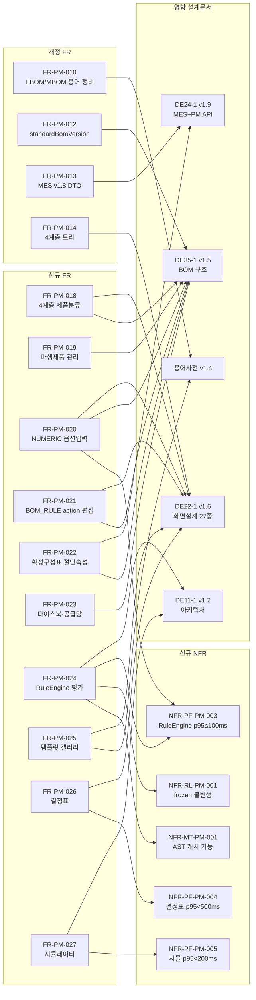

# 공통 원칙·ID 체계

> [!abstract]
> Phase 1 (PM + CM) 요구사항 정의서 공통 기반. 개요·범위·참조 문서·용어 정의·ID 체계·v1.1 개정 관계도·총괄 통계·금지어 점검표를 집약한다.
> v1.1-r2 분산 구조 재편 (2026-04-23): DE22-1 sections/ 패턴 적용, 부록 A v1.0 계승 FR 을 PM/CM 섹션 본문에 통합.

## 1. 개요

### 1.1 목적

WIMS 2.0 프로젝트 Phase 1 (제품관리 시스템 및 공통 기능) 에 대한 기능·비기능 요구사항을 명확히 정의하여, 설계·구현·테스트의 기준점을 제공한다. v1.1 은 용어사전 v1.3 및 후속 설계 문서(DE11-1 v1.2, DE22-1 v1.5→v1.6, DE24-1 v1.8, DE35-1 v1.5) 반영으로 확장된 신규 기능을 정식 요구사항화하며, v1.1-r2 는 단일 파일 구조를 메인 인덱스 + sections/ 분산 구조로 재편한다.

### 1.2 범위

**대상 서브시스템:**
- ① 제품관리 시스템 (PM: Product Management) — 24건 FR + 13건 NFR (v1.0 계승 17 + v1.1 신규·개정 7)
- 공통 기능 (CM: Common) — 6건 FR + 24건 NFR

**제외 대상:** Phase 2 시스템 (② 견적설계, ③ 발주관리, ④ 제조관리, ⑤ 현장실측) — `[[AN12-1_요구사항정의서_Phase2_v1.0]]` 참조

### 1.3 참조 문서

| 문서명 | 문서코드 | 버전 | 설명 |
|--------|---------|------|------|
| WIMS 2.0 개발계획서 | — | v1.2 | 프로젝트 목표, 기술 스택, 일정 |
| 사전설문조사 결과서 | AN11-2 | v1.0 | 현업 설문 63건 요구사항 |
| 요구사항 ID 체계 및 분류기준 | AN12-0 | v1.2 | FR/NFR 코드 정의 체계 |
| 요구사항 목록 (크로스체크) | AN12-1 | v1.5 | 최종 요구사항 목록 (정본 xlsx) |
| 요구사항 추적표 (RTM) | AN14-1 | v1.2 | 요구사항 ↔ 화면·API·엔티티 |
| WIMS 2.0 BOM 도메인 용어사전 | — | v1.4 | NUMERIC 옵션·action 동사·파생제품·템플릿 |
| 아키텍처 설계서 | DE11-1 | v1.2 | RuleEngine · AST 캐시 · 버전 축 · 결정표·시뮬 API |
| 화면설계서 | DE22-1 | v1.6 | 제품 4계층 · NUMERIC · BOM_RULE · Resolved 화면 27종 |
| 인터페이스 설계서 (통합본) | DE24-1 | v2.0 | 응답 DTO 8개 필드·supplyDivision 쿼리·PM 31 엔드포인트·MES+S3+SSO 외부 + 내부 CM/PM API 통합 |
| 미서기이중창 표준 BOM 구조 정의서 | DE35-1 | v1.5 | BOM 국제 규격·파생제품·BOM Rule 4동사 |
| 기존 설계문서 영향도 검증 | V3 | v1.0 | AN12-1 영향 섹션 근거 |
| 방법론 준수성 검증 | V6 | v1.0 | AN12-1 갱신 의무 근거 |

### 1.4 용어 정의 (용어사전 v1.4 발췌)

| 용어 | 정의 |
|------|------|
| 표준 BOM | EBOM + MBOM + Config 불가분 묶음. 단일 `standardBomVersion` |
| 자재구성(EBOM) | Engineering BOM — 기능 단위 분해 |
| 공정구성(MBOM) | Manufacturing BOM — 공정 단위 분해. MES 조회 대상 |
| 옵션구성(Config) | `PRODUCT_CONFIG`. DRAFT → RESOLVED → RELEASED |
| 옵션별규칙(BOM Rule) | `BOM_RULE`. 옵션값 조합에 따른 BOM 변형. action = `SET` \| `REPLACE` \| `ADD` \| `REMOVE` |
| 확정구성표(Resolved BOM) | Base MBOM + Rule 적용 결과. `frozen=TRUE` 후 불변 |
| 파생제품 | `derivativeOf` 로 원본 참조, `derivativeKind` ∈ {`1MM`, `CAP_TO_HIDDEN`, `TEMPERED`, `FIRE_43MM`} |
| productClassPath | L1 대분류 / L2 계약구분 / L3 유리사양 / L4 치수크기 (4계층 고정) |
| supplyDivision | 공통 / 외창 / 내창 (폐기 용어 대체) |
| RuleEngine | `UNIQUE_V1` 산식 언어 평가기. AST 캐시 기반 |
| RULE_TEMPLATE | 슬롯 기반 규칙 템플릿. 빌트인 6종 + 사용자 커스텀 |

## 2. ID 체계

### 2.1 기능 요구사항 (FR)

```
FR-{서브시스템}-{번호}
  예: FR-PM-010, FR-CM-001
```

- **서브시스템:** `PM`(제품관리) / `CM`(공통) / `ES`(견적설계) / `OM`(발주관리) / `MF`(제조관리) / `FS`(현장실측)
- **번호:** 서브시스템 내 일련번호. 불수용 항목(FR-PM-007) 은 번호를 유지하고 `수용여부=불수용` 으로 표기 (재사용 금지)

### 2.2 비기능 요구사항 (NFR)

```
NFR-{카테고리}-{서브시스템}-{번호}
  예: NFR-PF-PM-003, NFR-SC-CM-001
```

- **카테고리:** `SC`(보안) / `PF`(성능) / `US`(사용성) / `RL`(신뢰성) / `IF`(인터페이스) / `DA`(데이터) / `PT`(이식성) / `MT`(유지보수성)
- **서브시스템:** 공통 NFR 은 `CM` 로, 특정 서브시스템 한정 NFR 은 해당 서브시스템 코드로

### 2.3 화면 ID (참조)

```
SCR-{서브시스템}-{번호}
  예: SCR-PM-013B, SCR-CM-003
```

- DE22-1 v1.6 기준 총 27개. 결번 SCR: `SCR-PM-005`, `SCR-PM-008`, `SCR-PM-009`, `SCR-CM-004` (통폐합으로 결번) — 요구사항 문서에서 참조 금지.

## 3. v1.1 신규·개정 요구사항 관계도



## 4. Phase 1 요구사항 총괄 통계

### 4.1 요구사항 통계

| 분류 | 기능 요구사항 | 비기능 요구사항 | 합계 |
|------|-------------|----------------|------|
| **제품관리 시스템 (PM)** | 24건 (v1.0 계승 17 + v1.1 신규 7 + 개정 4) | 13건 (v1.0 계승 10 + v1.1 신규 5) | 37건 |
| **공통 기능 (CM)** | 6건 (v1.0 계승 전체) | 24건 (v1.0 계승 전체) | 30건 |
| **Phase 1 소계** | **30건** | **37건** | **67건** |

> v1.0 57건 대비 **+10건** (FR 7 + NFR 3 — 2026-04-16 1차 반영). v1.1-r1 에서 FR-PM-025/026/027 + NFR-PF-PM-004/005 추가되어 현재 Phase 1 총합 **72건**(FR 33 + NFR 39) 으로 계측되기도 하나, 본 문서 공식 집계는 **67건 + 템플릿 3 FR + 결정표·시뮬 2 NFR = 72건** 으로 두되 상세는 RTM([[AN14-1_요구사항추적표_v1.2]]) 정본을 따른다.

### 4.2 v1.1 신규·개정 항목 요약

**신규 FR (10건):**

| ID | 요구사항명 | 난이도 | 우선순위 | 근거 |
|----|-----------|--------|---------|------|
| FR-PM-018 | 제품 4계층 분류 체계 관리 및 트리 필터 | 중 | 상 | 용어사전 v1.3 §9, DE22-1 §4 |
| FR-PM-019 | 파생제품 등록·조회 및 Variant BOM 자동 상속 | 중 | 상 | 용어사전 v1.3 §15, DE35-1 v1.5 |
| FR-PM-020 | NUMERIC 옵션 입력 및 조건부 활성화 | 중 | 상 | 용어사전 v1.3 §11, DE22-1 §5 |
| FR-PM-021 | BOM_RULE action 편집기 (SET/REPLACE/ADD/REMOVE) | 중 | 상 | 용어사전 v1.3 §13, DE22-1 §5 |
| FR-PM-022 | 확정구성표 절단 속성 표시 | 중 | 상 | 용어사전 v1.3 §3·§4, DE24-1 v1.8 |
| FR-PM-023 | 다이스북 개정판·공급망(ITEM_SUPPLIER) 관리 | 중 | 중 | 용어사전 v1.3 §14 |
| FR-PM-024 | RuleEngine 산식 평가 및 frozen 불변성 보장 | 상 | 최상 | 용어사전 v1.3 §4, DE11-1 v1.2 |
| FR-PM-025 | BOM_RULE 템플릿 갤러리 — 슬롯 기반 규칙 생성 | 중 | 상 | 용어사전 v1.4 §13.3, DE22-1 §9.3.4.1 |
| FR-PM-026 | BOM_RULE 결정표 뷰 — 충돌·공백 자동 검출 | 상 | 상 | 용어사전 v1.4 §13.6, DE11-1 §11.9 |
| FR-PM-027 | BOM_RULE 시뮬레이터 — 가상 조합 매칭·MBOM diff | 중 | 상 | DE11-1 §11.8, DE22-1 §9.3.4.4 |

**개정 FR (4건):**

| ID | 개정 내용 |
|----|---------|
| FR-PM-010 | EBOM/MBOM 구분 명시 — "다단계 제조 BOM" 을 자재구성(EBOM) + 공정구성(MBOM) + 옵션구성(Config) 삼위일체로 재정의 |
| FR-PM-012 | `standardBomVersion` 단일 축 문언 유지 + `DRAFT/RELEASED/DEPRECATED` 상태값 명시 + `BOM_RULE` 확장 5컬럼 (v1.1-r1) |
| FR-PM-013 | DE24-1 v1.8 기준 응답 DTO 8개 필드, `?supplyDivision=공통\|외창\|내창` 쿼리 지원 |
| FR-PM-014 | 분류 트리를 4계층 (L1/L2/L3/L4) 로 고정. 체크박스 트리 필터 및 modelCode 세그먼트 디코딩 |

**신규 NFR (5건):**

| ID | 요구사항명 | 목표 수치 |
|----|-----------|---------|
| NFR-PF-PM-003 | RuleEngine Resolved BOM 생성 SLA | 5,000 BOM_RULE 기준 p95 ≤ 100ms |
| NFR-RL-PM-001 | frozen 후 Resolved BOM 재평가 금지 계약 | 산식 상수 변경 시에도 snapshot 불변 |
| NFR-MT-PM-001 | RuleEngine AST 캐시 기동 요구사항 | JVM 기동 후 60초 이내 warm-up 완료 |
| NFR-PF-PM-004 | BOM_RULE 결정표 로드 SLA | 규칙 ≤ 200 행 기준 p95 < 500ms |
| NFR-PF-PM-005 | BOM_RULE 시뮬레이터 응답 SLA | 규칙 ≤ 100 매칭 기준 p95 < 200ms |

## 5. v1.3 금지어 준수 점검표

| 금지어 | 대체어 | 본 문서 점검 결과 |
|--------|--------|----------------|
| `CuttingBOM` / `CUTTING_BOM` / `cuttingBomId` | MBOM + 절단 속성 | 미사용 — FR-PM-022 에서 확정구성표로 통일 |
| `LayoutType` / `LAYOUT_TYPE` | `OPT-LAY` | 미사용 |
| `ProductSeries` / `PRODUCT_SERIES` | `PRODUCT.series_code` | 미사용 |
| `산식구분` / `formula_kind` | `supplyDivision` | 미사용 — FR-PM-013 에서 `supplyDivision` 로만 표기 |
| `productVersion` / `configVersion` / `baseMbomVersion` | `standardBomVersion` | 미사용 — FR-PM-012 `standardBomVersion` 단일축 유지 |
| `formula` / `계산식` / `공식` | `산식` | 설계/DB/API 문맥에서 미사용 |
| `dies` / `압출코드` | `부재코드` / `다이스코드` | 미사용 — FR-PM-023 에서 분리 |
| `sv{N}` prefix | `sbv{N}` | 미사용 — FR-PM-012 `sbv{N}` 사용 |
| `changedParts` | `changedComponents` | 미사용 |
| `resolved-bom-id` 하이픈 | `resolvedBomId` | 미사용 |
| `BOM 행 유형` | `itemCategory` | 미사용 |

## 관련 문서

- [[AN12-1_요구사항정의서_Phase1_v1.1]] — 메인 인덱스 허브
- [[AN12-1_요구사항정의서_Phase1/sections/PM_제품관리|PM_제품관리]] — PM 서브시스템 FR·NFR 상세
- [[AN12-1_요구사항정의서_Phase1/sections/CM_공통|CM_공통]] — CM 서브시스템 FR·NFR 상세
- [[AN12-1_요구사항목록_v1.5]] — 요구사항 목록(xlsx 정본)
- [[AN14-1_요구사항추적표_v1.2]] — 요구사항 추적 매트릭스(RTM)
- [[WIMS_용어사전_BOM_v1.4]] — BOM 도메인 용어사전 최신
- [[DE22-1_화면설계서_v1.6]] — 화면설계서 27종
- [[DE24-1_인터페이스설계서_MES_REST_API_v1.9]] — 인터페이스설계서
