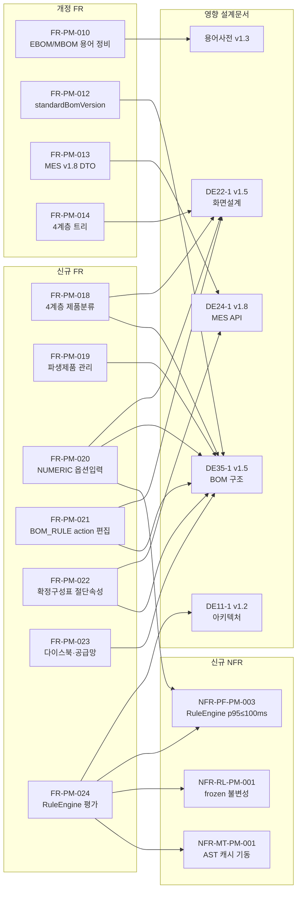

# WIMS 2.0 Phase 1 요구사항 정의서 v1.1

**문서코드:** AN12-1-P1
**버전:** v1.1
**작성일:** 2026.04.03 (v1.0) / 2026.04.16 (v1.1)
**작성자:** 김성현 (BA, 코드크래프트)
**검토자:** 김지광 (PM, 코드크래프트)
**승인자:** 유미숙 (사업주, 유니크시스템)

> [!abstract] v1.1 요약 (Gate 1 영향)
> - **배경:** 용어사전 v1.3 및 후속 설계 문서(DE11-1 v1.2, DE22-1 v1.5, DE24-1 v1.8, DE35-1 v1.5 예정)에서 **4계층 제품 분류, NUMERIC 옵션, 파생제품, 절단 속성 기반 확정구성표, 다이스북·공급망, RuleEngine** 등 신규 기능이 확정됨. 이 기능들을 기존 FR 목록에 정식 반영.
> - **변경 규모:**
>   - 신규 FR 7건 (FR-PM-018 ~ FR-PM-024) — 제품·옵션·BOM_RULE·Resolved·다이스북·RuleEngine 영역
>   - 개정 FR 4건 (FR-PM-010, FR-PM-012, FR-PM-013, FR-PM-014) — 4계층 분류·Resolved 절단 속성·MES v1.8 DTO·분류체계 트리
>   - 신규 NFR 3건 (NFR-PF-PM-003 RuleEngine SLA, NFR-RL-PM-001 frozen 불변성, NFR-MT-PM-001 AST 캐시 기동)
> - **총계:** 기능 30건(PM 24 + CM 6), 비기능 37건 → Phase 1 합계 **67건** (v1.0 57건 대비 +10건)
> - **호환성:** v1.0 의 모든 기존 FR/NFR 정의는 유지. 본 v1.1 은 **추가·개정** 성격이며 단독 SOT 로 사용한다 (delta 문서 아님).

> [!warning] v1.3 금지어 준수
> 본 문서 작성 시 용어사전 §7 금지어(`CuttingBOM`, `LayoutType`, `ProductSeries`, `cuttingBomId`, `산식구분`, `formula_kind`, `productVersion`, `configVersion`, `baseMbomVersion`, `sv{N}`, `changedParts`, `formula`/`계산식`/`공식`, `dies`/`압출코드` 등)는 설계·DB·API 문맥에서 사용하지 않았다. "산식구분", "formula" 등은 원본 엑셀 컬럼명을 인용하는 맥락에서만 표기.

---

## 변경 이력

| 버전 | 일자 | 작성자 | 검토자 | 변경 내용 |
|------|------|--------|--------|----------|
| v1.0 | 2026.04.03 | 김성현 | 김지광 | 초안 — Phase 1 기능 요구사항 23건, 비기능 요구사항 34건 정의 |
| v1.0 | 2026.04.14 | 김지광 | — | §1.3 AN12-0 v1.0→v1.2 갱신; AN12-0-3 참조 추가; FR 22건→23건 오기 정정 |
| v1.0 | 2026.04.14 | 김지광 | — | FR-PM-013 DE24-1 v1.1 반영 — `/bom/products/*` 체계, POST sync 제거(단방향 읽기 전용) |
| v1.1 | 2026.04.14 | 김지광 | — | FR-PM-012 단일 표준BOM 버전축 모델 채택 (EBOM/MBOM/Config 독립 버전 폐기) |
| **v1.1** | **2026.04.16** | **김지광** | **—** | **용어사전 v1.3 + DE11-1 v1.2 + DE22-1 v1.5 + DE24-1 v1.8 + DE35-1 v1.5(예정) 반영. 신규 FR 7건(FR-PM-018~024), 개정 FR 4건(010/012/013/014), 신규 NFR 3건(NFR-PF-PM-003, NFR-RL-PM-001, NFR-MT-PM-001). 통계 갱신(57→67). V3 영향도·V6 방법론 준수성 근거 반영.** |
| **v1.1-r1** | **2026.04.16** | **김지광** | **—** | **CX3 §E 반영 — 추상 SCR 명명(SCR-CM-BOM-EDIT/VERSION, SCR-PM-PRD-LIST/DETAIL, SCR-CM-OPT-EDIT, SCR-CM-BOM-RESOLVE, SCR-CM-RULE-EDIT, SCR-CM-BOM-RESOLVED-VIEW, SCR-PM-DIES-BOOK, SCR-PM-SUPPLIER, SCR-PM-BOM-EDIT) 을 DE22-1 v1.5(-r1) 번호 기반 SCR ID 로 통일. FR-PM-023 을 신설 SCR-PM-018/019/020 과 연결.** |
| v1.1-r1 | 2026-04-16 | 김지광 | — | [[2026-04-16-bom-rule-ui-design]] 반영. FR-PM-025(템플릿 갤러리)·FR-PM-026(결정표)·FR-PM-027(시뮬레이터) 신설, FR-PM-012 `BOM_RULE` +5컬럼 보강, NFR-PF-PM-004·005 신설 |

---

## 0. v1.1 신규·개정 요구사항 관계도

---

## 1. 개요

### 1.1 목적

WIMS 2.0 프로젝트 Phase 1 (제품관리 시스템 및 공통 기능)에 대한 기능·비기능 요구사항을 명확히 정의하여, 설계·구현·테스트의 기준점을 제공한다. v1.1 은 용어사전 v1.3 및 후속 설계 문서 반영으로 확장된 신규 기능을 정식 요구사항화한다.

### 1.2 범위

**대상 서브시스템:**
- ① 제품관리 시스템 (PM: Product Management)
- 공통 기능 (CM: Common)

**제외 대상:** Phase 2 시스템 (② 견적설계, ③ 발주관리, ④ 제조관리, ⑤ 현장실측)

### 1.3 참조 문서

| 문서명 | 문서코드 | 버전 | 설명 |
|--------|---------|------|------|
| WIMS 2.0 개발계획서 | - | v1.2 | 프로젝트 목표, 기술 스택, 일정 |
| 사전설문조사 결과서 | AN11-2 | v1.0 | 현업 설문 63건 요구사항 |
| 요구사항 ID 체계 및 분류기준 | AN12-0 | v1.2 | FR/NFR 코드 정의 체계 |
| 설문조사 서브시스템 매핑 | AN12-0-2 | v1.0 | 요구사항-서브시스템 매핑 |
| 개발계획서-설문조사 Gap분석 | AN12-0-3 | v1.0 | 개발계획서 27모듈 vs 설문 커버율 |
| 비기능 요구사항 보완항목 | AN12-0-4 | v1.0 | 비기능 요구사항 48건 도출 |
| 요구사항 목록 (크로스체크) | AN12-1-0 | v1.5 | 최종 요구사항 목록 |
| **WIMS 2.0 BOM 도메인 용어사전** | — | **v1.3** | **Blocker/P0 이슈 반영. 신규 FR 근거** |
| **아키텍처 설계서** | **DE11-1** | **v1.2** | **RuleEngine, AST 캐시, 버전 축** |
| **화면설계서** | **DE22-1** | **v1.5** | **제품 4계층·NUMERIC·BOM_RULE·Resolved 화면** |
| **인터페이스 설계서 (MES REST API)** | **DE24-1** | **v1.8** | **응답 DTO 8개 필드·supplyDivision 쿼리** |
| 미서기이중창 표준BOM구조 정의서 | DE35-1 | v1.5(예정) | BOM 국제 규격 기반 설계 |
| 기존 설계문서 영향도 검증 | V3 | v1.0 | AN12-1 영향 섹션 근거 |
| 방법론 준수성 검증 | V6 | v1.0 | AN12-1 갱신 의무 근거 |

### 1.4 용어 정의 (v1.3 발췌)

| 용어 | 정의 |
|------|------|
| 표준BOM | EBOM + MBOM + Config 불가분 묶음. 단일 `standardBomVersion` |
| 자재구성(EBOM) | Engineering BOM — 기능 단위 분해 |
| 공정구성(MBOM) | Manufacturing BOM — 공정 단위 분해. MES 조회 대상 |
| 옵션구성(Config) | `PRODUCT_CONFIG`. DRAFT→RESOLVED→RELEASED |
| 옵션별규칙(BOM Rule) | `BOM_RULE`. 옵션값 조합에 따른 BOM 변형. action = `SET` \| `REPLACE` \| `ADD` \| `REMOVE` |
| 확정구성표(Resolved BOM) | Base MBOM + Rule 적용 결과. frozen=TRUE 후 불변 |
| 파생제품 | `derivativeOf` 로 원본 참조, `derivativeKind` ∈ {`1MM`, `CAP_TO_HIDDEN`, `TEMPERED`, `FIRE_43MM`} |
| productClassPath | L1 대분류/L2 계약구분/L3 유리사양/L4 치수크기 |
| supplyDivision | 공통 / 외창 / 내창 (v1.2 `산식구분` 용어 폐기) |
| RuleEngine | `UNIQUE_V1` 산식 언어 평가기. AST 캐시 기반 |

---

## 2. Phase 1 요구사항 총괄 (v1.1 갱신)

### 2.1 요구사항 통계

| 분류 | 기능 요구사항 | 비기능 요구사항 | 합계 |
|------|-------------|----------------|------|
| **제품관리 시스템 (PM)** | 24건 (+7) | 13건 (+3) | 37건 |
| **공통 기능 (CM)** | 6건 | 24건 | 30건 |
| **Phase 1 소계** | **30건** | **37건** | **67건** |

### 2.2 v1.1 신규·개정 항목 요약

**신규 FR (7건):**

| ID | 요구사항명 | 난이도 | 우선순위 | 근거 |
|----|-----------|--------|---------|------|
| FR-PM-018 | 제품 4계층 분류 체계 관리 및 트리 필터 | 중 | 상 | 용어사전 v1.3 §9, DE22-1 §4 |
| FR-PM-019 | 파생제품 등록·조회 및 Variant BOM 자동 상속 | 중 | 상 | 용어사전 v1.3 §15, DE35-1 v1.5 |
| FR-PM-020 | NUMERIC 옵션 입력 및 조건부 활성화 | 중 | 상 | 용어사전 v1.3 §11, DE22-1 §5 |
| FR-PM-021 | BOM_RULE action 편집기 (SET/REPLACE/ADD/REMOVE) | 중 | 상 | 용어사전 v1.3 §13, DE22-1 §5 |
| FR-PM-022 | 확정구성표(Resolved BOM) 절단 속성 표시 | 중 | 상 | 용어사전 v1.3 §3·§4, DE24-1 v1.8 |
| FR-PM-023 | 다이스북 개정판·공급망(ITEM_SUPPLIER) 관리 | 중 | 중 | 용어사전 v1.3 §14 |
| FR-PM-024 | RuleEngine 산식 평가 및 frozen 불변성 보장 | 상 | 최상 | 용어사전 v1.3 §4, DE11-1 v1.2 |
| FR-PM-025 | BOM_RULE 템플릿 갤러리 — 슬롯 기반 규칙 생성 (RULE_TEMPLATE 빌트인 6종) | 중 | 상 | 용어사전 v1.4 §13.3, DE35-1 §6.5.3, DE22-1 §9.3.4.1 |
| FR-PM-026 | BOM_RULE 결정표 뷰 — 제품군 규칙 조감 + 충돌·공백 자동 검출 | 상 | 상 | 용어사전 v1.4 §13.6, DE11-1 §11.9, DE22-1 §9.3.4.2 |
| FR-PM-027 | BOM_RULE 시뮬레이터 — 저장 전 가상 옵션 조합 매칭·MBOM diff | 중 | 상 | DE11-1 §11.8, DE22-1 §9.3.4.4 |

**개정 FR (4건):**

| ID | 개정 내용 |
|----|---------|
| FR-PM-010 | EBOM/MBOM 구분 명시 — "다단계 제조 BOM"을 자재구성(EBOM) + 공정구성(MBOM) + 옵션구성(Config) 삼위일체로 재정의 |
| FR-PM-012 | `standardBomVersion` 단일 축 문언 유지 + `DRAFT/RELEASED/DEPRECATED` 상태값 명시 |
| FR-PM-013 | DE24-1 **v1.8** 기준 — 응답 DTO 8개 필드(cutDirection, cutLength, cutLength2, cutQty, actualCutLength, supplyDivision, frozen, itemCategory), `?supplyDivision=공통\|외창\|내창` 쿼리 지원 |
| FR-PM-014 | 분류 트리를 용어사전 §9 의 4계층 (L1 대분류 / L2 계약구분 / L3 유리사양 / L4 치수크기) 로 고정. 체크박스 트리 필터 및 modelCode 세그먼트 디코딩 |

**신규 NFR (3건):**

| ID | 요구사항명 | 목표 수치 |
|----|-----------|---------|
| NFR-PF-PM-003 | RuleEngine Resolved BOM 생성 SLA | 5,000 BOM_RULE 기준 p95 ≤ 100ms |
| NFR-RL-PM-001 | frozen 후 Resolved BOM 재평가 금지 계약 | 산식 상수 변경 시에도 snapshot 불변 |
| NFR-MT-PM-001 | RuleEngine AST 캐시 기동 요구사항 | JVM 기동 후 60초 이내 warm-up 완료 |
| NFR-PF-PM-004 | BOM_RULE 결정표 로드 SLA | 규칙 ≤200 행 기준 p95 < 500ms |
| NFR-PF-PM-005 | BOM_RULE 시뮬레이터 응답 SLA | 규칙 ≤100 매칭 기준 p95 < 200ms (AST 캐시 히트) |

---

## 3. 기능 요구사항 상세 (v1.1 추가·개정 부분)

> v1.0 에 정의된 FR-PM-001 ~ FR-PM-017, FR-CM-001 ~ FR-CM-006 는 **v1.1 에서도 유효**하며, v1.0 본문의 정의를 그대로 계승한다 (단독 SOT 원칙상 본 문서도 해당 절을 완전 복제해야 하나, 변경 없는 항목은 목록 요약(§2.2 상단 표)으로 대체하고 원본 상세는 v1.0 본문을 정식 참조). 본 절은 **신규·개정 항목만** 전체 상세를 기재한다.

### 3.1 개정 FR 상세

#### FR-PM-010 다단계 제조 BOM 구성 (v1.1 개정)

| 항목 | 내용 |
|------|------|
| **요구사항 ID** | FR-PM-010 |
| **분류** | 기능 > 제품관리 > BOM관리 |
| **난이도** | 상 / **우선순위** 최상 / **수용여부** 수용 |
| **출처** | 개발계획서 §3.2①, DE35-1 v1.5, 용어사전 v1.3 §2 |
| **관련 요구사항** | FR-PM-011, FR-PM-012, FR-PM-013, FR-PM-020, FR-PM-021, FR-PM-022, FR-PM-024 |
| **관련 화면** | [[DE22-1_화면설계서_v1.5#05 BOM관리\|SCR-PM-013]] (BOM 트리뷰), [[DE22-1_화면설계서_v1.5#05 BOM관리\|SCR-PM-013B]] (옵션 구성/확정 구성표), [[DE22-1_화면설계서_v1.5#05 BOM관리\|SCR-PM-014]] (버전 관리) |

**v1.1 개정 포인트:**
- v1.0 의 "BOM" 단일 개념을 용어사전 v1.3 §2 에 따라 **표준BOM = 자재구성(EBOM) + 공정구성(MBOM) + 옵션구성(Config) 불가분 묶음** 으로 재정의
- UI 용어 통일: EBOM → "자재구성" / MBOM → "공정구성" / Config → "옵션구성" / BOM_RULE → "옵션별규칙" / Resolved → "확정구성표"
- `EBOM_MBOM_MAP` 을 통한 기능군(구조부/유리부/개폐부/밀봉부/방충부) ↔ 공정 노드 다대다 매핑 명시
- `isPhantom=TRUE` Phantom Explosion 지원

**계승된 v1.0 요구사항:** 최대 5단계 계층, 드래그&드롭 편집, 자재 명세, 공정 정보 통합 (v1.0 §FR-PM-010 본문 유효).

---

#### FR-PM-012 표준BOM 버전 관리 및 변경 이력 추적 (v1.1 보강)

| 항목 | 내용 |
|------|------|
| **요구사항 ID** | FR-PM-012 |
| **난이도** | 중 / **우선순위** 상 / **수용여부** 수용 |
| **관련 요구사항** | FR-PM-010, FR-PM-011, FR-PM-013, FR-PM-022, FR-PM-024 |

**v1.1 보강 포인트 (v1.0 단일 버전축 모델 계승 + 확장):**
- RESOLVED_BOM 상태값 명시: `DRAFT` (편집, MES 미노출) / `RELEASED` (MES 조회 가능, 구조 변경 불가) / `DEPRECATED` (신규 바인딩 불가, 이력 조회만)
- frozen 전환 트리거 3종 명시: T1 견적서 CONFIRMED / T2 작업지시 RELEASED / T3 PM UI 명시적 "확정" 버튼
- `resolvedBomId = RBOM-{standardBomId}-sbv{N}-{optionsHash}` 결정적 생성, `optionsHash` 는 ENUM 옵션만으로 계산 (NUMERIC 옵션은 해시 제외 — 카디널리티 폭발 차단)
- `ruleEngineVersion` 을 Resolved 에 기록 (frozen 후 산식 언어 업그레이드 대비)
- **v1.1-r1 추가 (2026-04-16):** `BOM_RULE` 확장 5컬럼(template_id, template_instance_id, slot_values, scope_type, estimate_id) — 용어사전 v1.4 §13.4, DE35-1 §6.5.2 근거. DRAFT→RELEASED 전환은 EBOM·MBOM·Config·BOM_RULE 를 원자 번들로 묶어 수행
- **scope_type=ESTIMATE 오버레이 원칙:** PM 마스터 규칙 + 견적 예외 규칙을 동일 `BOM_RULE` 테이블의 다른 축(`scope_type`)으로 저장. RuleEngine resolve 시 MASTER 평가 후 ESTIMATE 오버레이 (Phase 2 ES 서브시스템 상세 설계에서 확정)

---

#### FR-PM-013 MES 연동 BOM 데이터 인터페이스 (v1.1 개정: DE24-1 v1.8 반영)

| 항목 | 내용 |
|------|------|
| **요구사항 ID** | FR-PM-013 |
| **난이도** | 상 / **우선순위** 최상 / **수용여부** 수용 |
| **관련 요구사항** | FR-PM-010, FR-PM-012, FR-PM-022, NFR-IF-PM-001, NFR-PF-PM-002 |

**v1.1 개정 포인트 (DE24-1 v1.8 기준):**

1. **응답 DTO 확장 — 8개 신규 필드:**
   | 필드 | 타입 | 의미 |
   |------|------|------|
   | `cutDirection` | String? | 절단 방향 enum (W/H/W1/H1/H2/H3) |
   | `cutLength` | BigDecimal? | 1차 절단 길이 평가값 (mm) |
   | `cutLength2` | BigDecimal? | 2차 절단 길이 평가값 (유리 세로 등) |
   | `cutQty` | BigDecimal? | 절단 개수 평가값 |
   | `actualCutLength` | BigDecimal? | `cutLength × (1 + lossRate)` |
   | `supplyDivision` | String? | 공통 / 외창 / 내창 (`산식구분` 폐기 후 단일화) |
   | `frozen` | Boolean | snapshot 불변 여부 |
   | `itemCategory` | enum | PROFILE/GLASS/HARDWARE/CONSUMABLE/SEALANT/SCREEN |

2. **쿼리 파라미터 지원:**
   - `GET /api/external/v1/bom/resolved/{resolvedBomId}?supplyDivision=외창` — 다층 제품의 창별 분리 조회
   - 추가 쿼리: `?itemCategory=PROFILE,GLASS` 자재 카테고리 필터

3. **CuttingBOM 엔드포인트 철회 확정:** v1.1 의 `/cutting-bom/{cuttingBomKey}` 신설안은 철회 — 기존 `/bom/resolved/{resolvedBomId}` 에 절단 속성 포함하여 돌려준다.

4. **단방향 읽기 전용 원칙 유지:** POST/PUT/DELETE 엔드포인트 제공 안 함.

5. **MES 권한:** `ROLE_MES_READER` — GET 전용, 외부 경로(`/api/external/v1/**`) 만 허용.

---

#### FR-PM-014 제품 분류 체계 관리 (v1.1 개정: 4계층 고정)

| 항목 | 내용 |
|------|------|
| **요구사항 ID** | FR-PM-014 |
| **난이도** | 하 / **우선순위** 상 / **수용여부** 수용 |
| **관련 요구사항** | FR-PM-015, FR-PM-016, FR-PM-018 |
| **관련 화면** | [[DE22-1_화면설계서_v1.5/sections/04_제품관리]] |

**v1.1 개정 포인트 (용어사전 v1.3 §9):**
- **분류 체계를 자유 계층이 아닌 4축 고정 구조**로 확정: `productClassPath = L1 대분류 / L2 계약구분 / L3 유리사양 / L4 치수크기`
- 값 예시:
  - L1 ∈ {`미서기`, `커튼월`}
  - L2 ∈ {`마스`, `우수`}
  - L3 ∈ {`삼중`, `복층`}
  - L4 ∈ {`특대(165)`, `대(135)`, `중(105)`, `소(75)`} (커튼월) / {`160`, `225`, `226`} (미서기)
- 저장 위치: `PRODUCT` 엔티티의 `class_l1 ~ class_l4` 4개 컬럼 (또는 `product_class_path` 단일 파생 필드) — **별도 분류 엔티티 불필요**
- v1.0 의 "자유 3단계 트리" 조항 폐기 → FR-PM-018 의 체크박스 트리 필터로 흡수

---

### 3.2 신규 FR 상세

#### FR-PM-018 제품 4계층 분류 체계 관리 및 트리 필터

| 항목 | 내용 |
|------|------|
| **요구사항 ID** | FR-PM-018 |
| **요구사항명** | 제품 4계층 분류 체계 관리 및 트리 필터 |
| **분류** | 기능 > 제품관리 > 제품관리 |
| **난이도** | 중 / **우선순위** 상 / **수용여부** 수용 |
| **출처** | 용어사전 v1.3 §9, DE22-1 v1.5 §4, V3 §2.1 |
| **관련 요구사항** | FR-PM-014, FR-PM-015, FR-PM-016, FR-PM-019 |
| **관련 화면** | SCR-PM-010 (제품 목록), SCR-PM-012 (제품 상세) |

**상세 설명:** 제품 50모델을 **4축 체크박스 트리** 로 필터링·분류하며, `modelCode` 의 코드 세그먼트를 자동 디코딩하여 상세 화면에 표시한다.

**주요 기능:**
1. **체크박스 트리 필터:** 제품 목록 화면 좌측에 L1→L2→L3→L4 4단 체크박스 트리 제공. 하위 축 미체크 시 상위 축 전체 선택으로 해석
2. **modelCode 세그먼트 디코딩:** `DHS-AE225-D-1` → `{brand: DHS, series: AE225, class: D, variant: 1}` 자동 분해하여 상세 화면 표시
3. **productClassPath 자동 산출:** L1~L4 컬럼을 "`/`" 로 연결한 파생 필드 (예: `미서기/마스/복층/225`)
4. **신규 축 값 등록:** 관리자는 각 축의 값 목록을 마스터 코드 테이블에서 확장 가능

**입력 데이터:** L1~L4 축별 선택값 또는 `modelCode`
**출력 데이터:** 필터링된 제품 목록, 디코딩된 modelCode 구성표
**비즈니스 규칙:** 4축 모두 NULL 불가 (신규 제품 등록 시 L1~L4 필수 입력)

**수용 사유:** 용어사전 v1.3 §9 에서 제품 50모델이 4축 계층 분류에 속함이 확정. 현행 무질서한 분류를 표준화하여 검색·리포팅 효율을 확보한다.

---

#### FR-PM-019 파생제품 등록·조회 및 Variant BOM 자동 상속

| 항목 | 내용 |
|------|------|
| **요구사항 ID** | FR-PM-019 |
| **요구사항명** | 파생제품 등록·조회 및 Variant BOM 자동 상속 |
| **분류** | 기능 > 제품관리 > 제품관리 |
| **난이도** | 중 / **우선순위** 상 / **수용여부** 수용 |
| **출처** | 용어사전 v1.3 §15, DE35-1 v1.5 |
| **관련 요구사항** | FR-PM-010, FR-PM-018, FR-PM-021 |

**상세 설명:** 원본 제품을 기반으로 1MM 편차·커버 교체·강화유리·방화 43MM 등의 **파생제품(Variant)** 을 등록하고, 원본 BOM 을 자동 상속한 후 차이점만 BOM_RULE 로 덧쓴다.

**주요 기능:**
1. **파생제품 등록:** `derivativeOf = {원본 productCode}`, `derivativeKind ∈ {1MM, CAP_TO_HIDDEN, TEMPERED, FIRE_43MM}` 입력
2. **Variant BOM 자동 상속:** 원본 제품의 EBOM/MBOM/Config 를 복사하여 파생 제품 BOM 초기화
3. **차이 편집:** 파생 제품에 대해 BOM_RULE 만 추가하여 편차 표현 (원본 BOM 재작성 불필요)
4. **역추적 조회:** 원본 제품 상세 화면에서 파생 제품 목록 표시

**비즈니스 규칙:** 원본 제품이 `DEPRECATED` 상태로 전환되면 파생 제품에 영향 경고 표시

**수용 사유:** 유니크시스템 실제 제품에 1MM 편차·화재등급 등 파생 계열 다수 존재. BOM 중복 관리 공수 절감.

---

#### FR-PM-020 NUMERIC 옵션 입력 및 조건부 활성화

| 항목 | 내용 |
|------|------|
| **요구사항 ID** | FR-PM-020 |
| **요구사항명** | NUMERIC 옵션 입력 및 조건부 활성화 |
| **분류** | 기능 > 제품관리 > 옵션관리 |
| **난이도** | 중 / **우선순위** 상 / **수용여부** 수용 |
| **출처** | 용어사전 v1.3 §11, DE22-1 v1.5 §5 |
| **관련 요구사항** | FR-PM-010, FR-PM-021, FR-PM-022, FR-PM-024 |

**상세 설명:** 옵션값 타입을 ENUM 외에 **NUMERIC** 으로 확장하여 치수 입력(`OPT-DIM-W/H/W1/H1/H2/H3`)을 지원. `numeric_min/max` 유효성 검증과 `enablement_condition` 을 통한 조건부 활성화 (예: 3편창 레이아웃일 때만 W1 입력 활성화).

**주요 기능:**
1. **치수 입력 UI:** W, H, W1, H1, H2, H3 숫자 입력 필드. 스피너·단위 mm 표시
2. **유효성 검증:** `OPTION_VALUE.numeric_min ≤ 입력값 ≤ numeric_max` 실시간 검증
3. **조건부 활성화:** `enablement_condition` 표현식 평가 결과 FALSE 인 필드는 disable/hide. 예: `OPT-LAY == 'W3XH1'` 일 때만 W1 활성화
4. **appliedOptions 저장:** `{"OPT-LAY": "W2XH1", "OPT-DIM-W": 1500, "OPT-DIM-H": 1200}` 혼합 구조 JSON 저장

**비즈니스 규칙:**
- NUMERIC 옵션값은 `optionsHash` 계산에서 제외 (카디널리티 폭발 차단)
- 결측 NUMERIC 옵션은 `is_default` 값 사용, 없으면 저장 거부

**수용 사유:** 용어사전 v1.3 §11 의 V5 P2 이슈 대응. 치수 기반 산식 평가의 전제.

---

#### FR-PM-021 BOM_RULE action 편집기 (SET/REPLACE/ADD/REMOVE)

| 항목 | 내용 |
|------|------|
| **요구사항 ID** | FR-PM-021 |
| **요구사항명** | BOM_RULE action 편집기 — 동사 스키마 4종 |
| **분류** | 기능 > 제품관리 > BOM관리 |
| **난이도** | 중 / **우선순위** 상 / **수용여부** 수용 |
| **출처** | 용어사전 v1.3 §13, DE22-1 v1.5 §5 |
| **관련 요구사항** | FR-PM-010, FR-PM-020, FR-PM-022, FR-PM-024 |

**상세 설명:** BOM_RULE 의 `action` 을 공식 4종 동사 (`SET` / `REPLACE` / `ADD` / `REMOVE`) 카드 UI 로 편집한다.

**주요 기능:**
1. **동사 선택:** 카드 좌측 라디오로 4종 선택
2. **SET:** MBOM 행의 특정 속성(cutLengthFormula, cutQtyFormula, lossRate, workCenter 등)을 상수 또는 산식으로 세팅
3. **REPLACE:** itemCode A → itemCode B 치환 (같은 슬롯)
4. **ADD:** 신규 MBOM 행 추가 (기능군·위치·공정 지정)
5. **REMOVE:** 조건부로 MBOM 행 삭제 (Phantom 처리와 별개)
6. **조건식:** `when` 절에 ENUM 옵션값 조합 입력 (예: `OPT-GLZ == '복층' AND OPT-MAT == 'TEMPERED'`)

**비즈니스 규칙:** action 이 NULL·기타 문자열이면 저장 거부. `산식구분` / `formula_kind` 등 폐기 용어 입력 차단.

**수용 사유:** 용어사전 v1.3 §13 의 action 동사 스키마 공식화. 편집 UX 의 표준화.

---

#### FR-PM-022 확정구성표(Resolved BOM) 절단 속성 표시

| 항목 | 내용 |
|------|------|
| **요구사항 ID** | FR-PM-022 |
| **요구사항명** | 확정구성표 절단 속성 표시 및 frozen 뱃지 |
| **분류** | 기능 > 제품관리 > BOM관리 |
| **난이도** | 중 / **우선순위** 상 / **수용여부** 수용 |
| **출처** | 용어사전 v1.3 §3·§4, DE24-1 v1.8, DE22-1 v1.5 §5 |
| **관련 요구사항** | FR-PM-010, FR-PM-013, FR-PM-020, FR-PM-024 |

**상세 설명:** 확정구성표(Resolved BOM) 조회 화면에 절단 관련 속성(cutDirection, cutLength, cutLength2, cutQty, actualCutLength, supplyDivision, frozen 🔒, itemCategory)을 표시한다.

**주요 기능:**
1. **절단 속성 컬럼:** 테이블에 8개 신규 컬럼 표시. null 값은 "—" 렌더
2. **frozen 뱃지:** `frozen=TRUE` 행은 🔒 아이콘 + 읽기 전용 배경색
3. **supplyDivision 필터:** 상단 탭으로 {공통 / 외창 / 내창} 전환
4. **itemCategory 필터:** {PROFILE / GLASS / HARDWARE / CONSUMABLE / SEALANT / SCREEN} 다중 선택
5. **Excel 다운로드:** 8개 속성 포함 엑셀 export

**비즈니스 규칙:** `frozen=TRUE` 시점 이후에는 UI 에서도 속성 편집 입력 disable.

**수용 사유:** 용어사전 v1.3 §3 MBOM 속성 확장, DE24-1 v1.8 응답 DTO 반영. 현장 작업지시서 생성의 기반.

---

#### FR-PM-023 다이스북 개정판·공급망(ITEM_SUPPLIER) 관리

| 항목 | 내용 |
|------|------|
| **요구사항 ID** | FR-PM-023 |
| **요구사항명** | 다이스북 개정판 이력 및 공급망 다대다 관리 |
| **분류** | 기능 > 제품관리 > 자재관리 |
| **난이도** | 중 / **우선순위** 중 / **수용여부** 수용 |
| **출처** | 용어사전 v1.3 §14, [[4-2_커튼월다이스북_분석]] |
| **관련 요구사항** | FR-PM-001, FR-PM-003 |

**상세 설명:** 다이스북(DIES_BOOK) 개정판 이력과 거래처 역할 구분(DIES_SUPPLIER) 및 자재-공급처 다대다 매핑(ITEM_SUPPLIER) 을 관리한다.

**주요 기능:**
1. **DIES_BOOK 개정판 이력:** `revision`, `effective_from`, `effective_to`, `pdf_url`, `notes` 관리. 특정 시점 유효 개정판 조회
2. **DIES_SUPPLIER 역할:** 거래처별 역할 {`EXTRUSION`(압출), `INSULATION`(단열), `HARDWARE`(철물)} 다중 지정
3. **ITEM_SUPPLIER 다대다:** 하나의 자재(itemCode)가 복수 공급처를 가질 수 있고, 공급처도 복수 자재 공급 가능. 우선순위(`preferredRank`) 및 리드타임 관리
4. **부재코드·다이스코드 분리:** 용어사전 §14 의 `부재코드` / `다이스코드` 구분 준수 (금지어 `dies`·`압출코드` 미사용)

**비즈니스 규칙:** 개정판 기간 중첩 금지 (같은 다이스북 내 `effective_from` ~ `effective_to` 겹침 불가).

**수용 사유:** 커튼월 실제 공급망 구조 반영. FR-PM-003 의 거래처 단가 관리와 연계.

---

#### FR-PM-024 RuleEngine 산식 평가 및 frozen 불변성 보장

| 항목 | 내용 |
|------|------|
| **요구사항 ID** | FR-PM-024 |
| **요구사항명** | RuleEngine 산식 평가 및 frozen 스냅샷 불변성 보장 |
| **분류** | 기능 > 제품관리 > BOM관리 > RuleEngine |
| **난이도** | 상 / **우선순위** 최상 / **수용여부** 수용 |
| **출처** | 용어사전 v1.3 §4·§13, DE11-1 v1.2, V3 §3 |
| **관련 요구사항** | FR-PM-010, FR-PM-012, FR-PM-020, FR-PM-021, FR-PM-022, NFR-PF-PM-003, NFR-RL-PM-001, NFR-MT-PM-001 |

**상세 설명:** `UNIQUE_V1` 산식 언어로 작성된 `cutLengthFormula`, `cutLengthFormula2`, `cutQtyFormula`, BOM_RULE.action 내 표현식을 평가하여 Resolved BOM 의 `cut_length_evaluated*`, `cut_qty_evaluated`, `actual_cut_length*` 컬럼에 스냅샷한다. `frozen=TRUE` 전환 이후 재평가를 금지한다.

**주요 기능:**
1. **산식 평가:** AST 파싱 + 바인딩(W, H, W1, H1, H2, H3, itemCategory, supplyDivision …) + 평가
2. **연산자·함수:** 사칙연산, IIF, MIN, MAX, ROUND (UNIQUE_V1 사양)
3. **AST 캐시:** 자주 호출되는 산식의 AST 를 메모리 캐시 (§NFR-MT-PM-001)
4. **snapshot 기록:** 평가 결과를 Resolved 행의 `*_evaluated` 필드에 저장 후 `frozen=TRUE` 전환
5. **재평가 금지:** `frozen=TRUE` 행은 BOM_RULE.action 상수나 RuleEngine 버전 업그레이드 시에도 재평가하지 않음
6. **재평가 필요 시 절차:** 기존 Resolved 를 `DEPRECATED` 처리 + 신규 `standardBomVersion` 으로 신규 Resolved 생성 — 이력 추적 가능
7. **ruleEngineVersion 기록:** 각 Resolved 에 평가 엔진 버전(`UNIQUE_V1`) 기록하여 V2 업그레이드 시 판정 근거 제공

**비즈니스 규칙:**
- 산식 평가 중 divide-by-zero / 바인딩 누락 시 명시 오류로 중단 (silent default 금지)
- NUMERIC 옵션 미입력 시 `is_default` 적용 후 평가

**수용 사유:** 용어사전 v1.3 §4 의 V5 P4 (frozen 후 재평가 불일치 차단) 이슈 대응. MES 작업지시 금액·치수 분쟁 원천 차단.

---

#### FR-PM-025 BOM_RULE 템플릿 갤러리 (v1.1-r1 신설)

| 항목 | 내용 |
|------|------|
| **요구사항 ID** | FR-PM-025 |
| **분류** | 기능 > 제품관리 > BOM관리 > 옵션별규칙 |
| **난이도** | 중 / **우선순위** 상 / **수용여부** 수용 |
| **출처** | [[2026-04-16-bom-rule-ui-design]] §2, 사용자 피드백 "규칙 조합 방식이 어렵다" (2026-04-16) |
| **관련 요구사항** | FR-PM-012, FR-PM-021, FR-PM-024, FR-PM-026, FR-PM-027 |
| **관련 화면** | [[DE22-1_화면설계서_v1.5#SCR-PM-013B]] §9.3.4.1 |

**요구사항:**
- 슬롯 기반 템플릿 양식으로 규칙을 생성할 수 있어야 한다. 사용자(견적 담당자 포함)는 조건식·액션 동사를 직접 쓰지 않고 드롭다운·숫자 입력으로만 규칙을 구성한다.
- 초기 빌트인 템플릿 6종 제공: `TPL-REINFORCE-SIZE`, `TPL-CUT-DIRECTION`, `TPL-ITEM-REPLACE-BY-OPT`, `TPL-FORMULA-BY-RANGE`, `TPL-ADD-BY-OPT`, `TPL-DERIVATIVE-DIFF` (용어사전 v1.4 §13.3).
- 한 템플릿 인스턴스가 다수 `BOM_RULE` 행을 생성할 수 있다 (N 규칙 연쇄). UI 는 `template_instance_id` 로 묶어 논리적 1 단위로 표시·편집·삭제한다.
- 슬롯 원본값(`slot_values`)은 DB 에 보존되어 편집 왕복 시 손실이 없어야 한다.
- PM 관리자(`ROLE_PM_ADMIN`) 는 전문가 모드 규칙을 "템플릿으로 승격" 마법사로 신규 커스텀 템플릿(`is_builtin=FALSE`)을 정의할 수 있다.

**수용 기준:**
- 견적 담당자 역할 사용자가 5분 내 첫 규칙 저장 가능
- 빌트인 6종은 Flyway 마이그레이션으로 `RULE_TEMPLATE` 시드
- 인스턴스 단위 삭제 시 `template_instance_id` 동일 행 일괄 삭제

---

#### FR-PM-026 BOM_RULE 결정표 뷰 (v1.1-r1 신설)

| 항목 | 내용 |
|------|------|
| **요구사항 ID** | FR-PM-026 |
| **분류** | 기능 > 제품관리 > BOM관리 > 옵션별규칙 |
| **난이도** | 상 / **우선순위** 상 / **수용여부** 수용 |
| **출처** | [[2026-04-16-bom-rule-ui-design]] §3 |
| **관련 요구사항** | FR-PM-021, FR-PM-024, FR-PM-025 |
| **관련 화면** | [[DE22-1_화면설계서_v1.5#SCR-PM-013B]] §9.3.4.2 |

**요구사항:**
- 제품군 단위로 규칙 전체를 **결정표(Decision Table)** 형식으로 조감할 수 있어야 한다. 행 = `BOM_RULE` 1행, 열 = 유효 OPTION_GROUP ENUM + 치수조건 + 액션 요약 + 우선순위.
- `template_instance_id` 가 같은 행들은 들여쓰기·아이콘으로 묶음 표시.
- 두 규칙의 조건 교집합이 비어있지 않으면서 액션이 경합하면 **충돌 경고** 를 자동 표시. 동점 우선순위 시 ❓ 배지.
- 제품군의 유효 옵션 조합 중 어떤 규칙도 매칭되지 않는 조합은 **미커버(gap)** 로 요약 집계.
- 규칙 수 ≤100 은 프런트 AST 교집합 계산, >100 은 서버 incremental 모드 (DE11-1 §11.9).

**수용 기준:**
- 규칙 ≤200 행 기준 결정표 로드 p95 < 500ms (NFR-PF-PM-004)
- 충돌·공백 발견 즉시 드로어 열어 상세 제공
- 결정표 API 응답 형식: DE11-1 §11.9

---

#### FR-PM-027 BOM_RULE 시뮬레이터 (v1.1-r1 신설)

| 항목 | 내용 |
|------|------|
| **요구사항 ID** | FR-PM-027 |
| **분류** | 기능 > 제품관리 > BOM관리 > 옵션별규칙 |
| **난이도** | 중 / **우선순위** 상 / **수용여부** 수용 |
| **출처** | [[2026-04-16-bom-rule-ui-design]] §6 |
| **관련 요구사항** | FR-PM-021, FR-PM-024, FR-PM-025, FR-PM-026 |
| **관련 화면** | [[DE22-1_화면설계서_v1.5#SCR-PM-013B]] §9.3.4.4 |

**요구사항:**
- 가상 옵션 조합을 입력해 **매칭 규칙·최종 MBOM diff** 를 DB 저장 없이 확인할 수 있어야 한다 (evaluate-only).
- API: `POST /api/pm/rules/simulate` (DE11-1 §11.8). 편집 중인 draft rules 도 리퀘스트에 포함 가능.
- 응답은 매칭 규칙 리스트(우선순위 순, 기각 규칙 포함·사유), Base MBOM 대비 추가/제거/변경 diff, 경고 목록을 포함.
- 뷰 공통 사이드 패널로 모든 뷰(템플릿·결정표·전문가) 에서 접근 가능.
- 견적 담당자에게도 제공 (`ROLE_PM_VIEWER` 이상).

**수용 기준:**
- 규칙 ≤100 매칭 기준 p95 < 200ms (NFR-PF-PM-005)
- MBOM diff 에 `cutLengthFormula` 변경 등 필드 단위 차이 표시
- 시뮬 실패(예: REPLACE target 부재) 는 422 + 경고 목록

---

## 4. 비기능 요구사항 상세 (v1.1 추가 부분)

> v1.0 의 NFR 34건은 v1.1 에서도 유효. 본 절은 **신규 NFR 3건만** 상세 기재.

### 4.2 성능 (NFR-PF) — 신규

**NFR-PF-PM-003 RuleEngine Resolved BOM 생성 SLA**

| 항목 | 내용 |
|------|------|
| **ID** | NFR-PF-PM-003 |
| **목표 수치** | 5,000 BOM_RULE 기준 Resolved BOM 1건 생성 **p95 ≤ 100ms** |
| **난이도** | 상 / **우선순위** 상 |
| **관련 요구사항** | FR-PM-024 |

**측정 기준:**
- 모집단: 제품당 BOM_RULE 5,000개, 옵션 20개(ENUM 15 + NUMERIC 5), MBOM 500 행
- 측정 지점: `POST /api/internal/v1/bom/resolved` (신규 Resolved 생성) 서버 내부 timing
- 목표: p50 ≤ 30ms, p95 ≤ 100ms, p99 ≤ 300ms

**최적화 전략:** AST 캐시 (NFR-MT-PM-001), 인덱스(`BOM_RULE.when_hash`), 스트리밍 평가, BOM_RULE 사전 정렬.

---

### 4.4 신뢰성 (NFR-RL) — 신규

**NFR-RL-PM-001 frozen 후 Resolved BOM 불변성 계약**

| 항목 | 내용 |
|------|------|
| **ID** | NFR-RL-PM-001 |
| **목표 수치** | `frozen=TRUE` 전환 이후 `cut_length_evaluated*`, `cut_qty_evaluated`, `actual_qty`, `actual_cut_length`, `rule_engine_version` 필드 **100% 불변** |
| **난이도** | 중 / **우선순위** 최상 |
| **관련 요구사항** | FR-PM-024 |

**보장 방식:**
- DB 레벨: 트리거로 `frozen=TRUE` 행의 대상 컬럼 UPDATE 차단 (RAISE)
- 애플리케이션 레벨: 서비스 계층에서 사전 분기
- 재평가 필요 시: 신규 `standardBomVersion` + 신규 Resolved 생성 절차만 허용 (기존 행 DEPRECATED)
- 감사: 모든 frozen 전환은 감사 로그 기록 (NFR-MT-CM-002 확장)

**수용 사유:** MES 작업지시·견적 금액 동결 후 사후 변경을 원천 차단. V5 P4 리스크 대응.

---

### 4.8 유지보수성 (NFR-MT) — 신규

**NFR-MT-PM-001 RuleEngine AST 캐시 기동**

| 항목 | 내용 |
|------|------|
| **ID** | NFR-MT-PM-001 |
| **목표 수치** | JVM 기동 후 **60초 이내** 활성 BOM_RULE 의 AST 캐시 warm-up 완료 |
| **난이도** | 중 / **우선순위** 중 |
| **관련 요구사항** | FR-PM-024, NFR-PF-PM-003 |

**구현 전략:**
- 기동 시 `ApplicationReadyEvent` 리스너에서 `BOM_RULE WHERE status='ACTIVE'` 전체를 파싱 → AST 캐시 로딩
- 캐시 무효화: BOM_RULE UPDATE/DELETE 이벤트 발생 시 해당 rule 의 AST 엔트리 제거
- 캐시 hit rate 모니터링: Micrometer gauge `rule_engine.ast_cache.hit_ratio`, 목표 ≥ 95%
- 캐시 크기 상한: 10,000 엔트리 LRU

**수용 사유:** cold start 시 첫 Resolved 생성 지연을 제거하여 NFR-PF-PM-003 SLA 안정화.

---

## 5. 요구사항 추적 매트릭스 (v1.1 신규·개정 항목)

| 요구사항 ID | 관련 화면 (DE22-1 v1.5) | 관련 API (DE24-1 v1.8) | 관련 엔티티 | 설계 문서 |
|-----------|---------------------|-------------------|-----------|---------|
| FR-PM-010 (개정) | SCR-PM-013, SCR-PM-013B | internal /bom/products/* | PRODUCT, EBOM, MBOM, PRODUCT_CONFIG | DE35-1 v1.5, 용어사전 v1.3 §2 |
| FR-PM-012 (보강) | SCR-PM-014 | internal /bom/standard/*/versions | STANDARD_BOM_VERSION, RESOLVED_BOM | DE35-1 v1.5, 용어사전 v1.3 §4 |
| FR-PM-013 (개정) | — (API) | external /bom/resolved/{id}?supplyDivision | RESOLVED_BOM | DE24-1 v1.8 |
| FR-PM-014 (개정) | SCR-PM-010 | internal /products?classPath | PRODUCT (class_l1~l4) | DE22-1 v1.5 §4, 용어사전 §9 |
| FR-PM-018 (신규) | SCR-PM-010, SCR-PM-012 | internal /products?classPath | PRODUCT | DE22-1 v1.5 §4 |
| FR-PM-019 (신규) | SCR-PM-017 (파생제품 등록/조회) | internal /products/{code}/derivatives | PRODUCT (derivativeOf, derivativeKind) | DE35-1 v1.5, 용어사전 §15 |
| FR-PM-020 (신규) | SCR-PM-013B (옵션 그룹 관리·확정 구성표 서브탭) | internal /options/values | OPTION_VALUE (valueType, numeric_min/max, enablement_condition) | DE22-1 v1.5 §5, 용어사전 §11 |
| FR-PM-021 (신규) | SCR-PM-013B (옵션별 규칙 관리 서브탭) | internal /bom/rules | BOM_RULE (action enum) | DE22-1 v1.5 §5, 용어사전 §13 |
| FR-PM-022 (신규) | SCR-PM-013B (확정 구성표 서브탭) | external /bom/resolved/{id} | RESOLVED_BOM (8개 신규 필드) | DE24-1 v1.8, 용어사전 §3 |
| FR-PM-023 (신규) | SCR-PM-018 (다이스북), SCR-PM-019 (공급사), SCR-PM-020 (자재↔공급사 매핑) | internal /dies-books, /suppliers, /items/{code}/suppliers | DIES_BOOK, DIES_SUPPLIER, ITEM_SUPPLIER | DE22-1 v1.5-r1 §4 공급망, 용어사전 §14 |
| FR-PM-024 (신규) | — (엔진) | internal /bom/resolved (생성) | RESOLVED_BOM, BOM_RULE | DE11-1 v1.2, 용어사전 §4 |
| NFR-PF-PM-003 | 성능 테스트 | — | — | DE11-1 v1.2 §성능 |
| NFR-RL-PM-001 | — | external /bom/resolved/{id} | RESOLVED_BOM 트리거 | 용어사전 §4.2 |
| NFR-MT-PM-001 | — | — | AST 캐시 컴포넌트 | DE11-1 v1.2 §RuleEngine |

> **전체 RTM** 은 [[AN14-1_요구사항_추적표]] 에서 관리한다.

---

## 6. 승인

| 역할 | 이름 | 서명 | 날짜 | 비고 |
|------|------|------|------|------|
| **PM** | 김지광 | ________________ | 2026.04.__ | v1.1 검토 및 승인 |
| **BA** | 김성현 | ________________ | 2026.04.__ | v1.1 작성 및 검토 |
| **사업주** | 유미숙 | ________________ | 2026.04.__ | v1.1 최종 승인 |

---

## 부록 A. v1.0 계승 요구사항 목록 (참조용)

> v1.1 에서 **내용 변경 없이 계승**되는 기존 요구사항. 상세 정의는 v1.0 본문을 참조한다.

**FR-PM (v1.0 계승, 개정된 010/012/013/014 제외):**

| ID | 요구사항명 | 난이도 | 우선순위 |
|----|-----------|--------|---------|
| FR-PM-001 | 원자재 규격 정보 등록·관리 | 하 | 상 |
| FR-PM-002 | 부자재 규격 정보 등록·관리 | 하 | 상 |
| FR-PM-003 | 구매 단가 이력 관리 | 중 | 상 |
| FR-PM-004 | 자재 코드 체계 표준화 | 중 | 상 |
| FR-PM-005 | 자재 등록 간소화 및 복사 기능 | 하 | 중 |
| FR-PM-006 | 자재 필요수량 자동 산출 | 중 | 상 |
| ~~FR-PM-007~~ | ~~자재 단가 자동 업데이트~~ | — | 불수용 |
| FR-PM-008 | 공정 유형별 등록 및 관리 | 중 | 상 |
| FR-PM-009 | 공정별 규격 및 제조 단가 관리 | 중 | 상 |
| FR-PM-011 | BOM 계층 구조 트리 뷰 GUI | 상 | 상 |
| FR-PM-015 | 제품 코드 부여 및 관리 | 하 | 상 |
| FR-PM-016 | 제품 메타 정보 등록·조회 | 하 | 중 |
| FR-PM-017 | 프로젝트 등록·수정·삭제·상태관리 | 중 | 상 |

**FR-CM (v1.0 계승 전체):** FR-CM-001 ~ FR-CM-006 (6건)

**NFR (v1.0 계승 전체):** 34건 (NFR-SC 6 / NFR-PF 4 / NFR-US 4 / NFR-RL 2 / NFR-IF 4 / NFR-DA 4 / NFR-PT 2 / NFR-MT 4 + 본 v1.1 신규 3건 = 총 37건)

---

## 부록 B. v1.3 금지어 준수 점검표

| 금지어 | 대체어 | 본 문서 점검 결과 |
|--------|--------|----------------|
| `CuttingBOM` / `CUTTING_BOM` / `cuttingBomId` | MBOM + 절단 속성 | 미사용 — FR-PM-022 에서 확정구성표로 통일 |
| `LayoutType` / `LAYOUT_TYPE` | `OPT-LAY` | 미사용 |
| `ProductSeries` / `PRODUCT_SERIES` | `PRODUCT.series_code` | 미사용 |
| `산식구분` / `formula_kind` | `supplyDivision` | 미사용 — FR-PM-013 에서 `supplyDivision` 로만 표기 |
| `productVersion` / `configVersion` / `baseMbomVersion` | `standardBomVersion` | 미사용 — FR-PM-012 `standardBomVersion` 단일축 유지 |
| `formula` / `계산식` / `공식` | `산식` | 설계/DB/API 문맥에서 미사용 |
| `dies` / `압출코드` | `부재코드` / `다이스코드` | 미사용 — FR-PM-023 에서 분리 |
| `sv{N}` prefix | `sbv{N}` | 미사용 — FR-PM-012 `sbv{N}` 사용 |
| `changedParts` | `changedComponents` | 미사용 |

---
