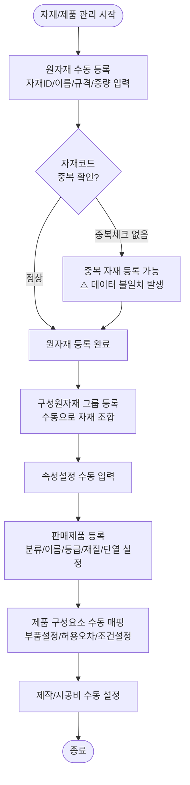
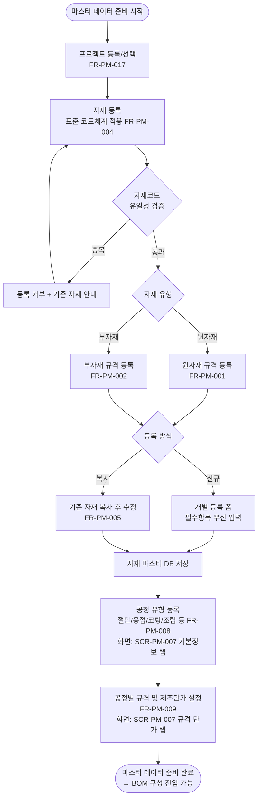
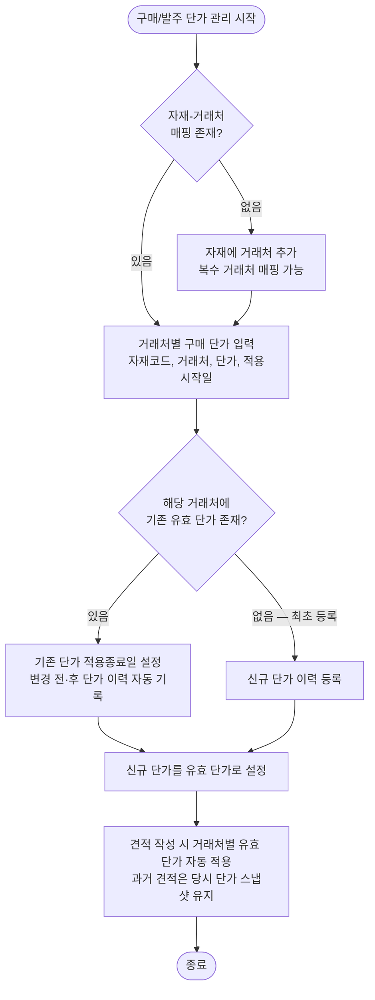

# AN21-1 제품관리 시스템 (PM) — As-Is/To-Be 업무흐름도

**문서코드:** AN21-1
**버전:** v1.0
**작성일:** 2026.04.06
**작성자:** 김성현 (BA, 코드크래프트)
**검토자:** 김지광 (PM, 코드크래프트)
**상위 문서:** [AN21 총괄 업무흐름도](AN21_총괄_업무흐름도_v1.0.md)
**Phase:** Phase 1 (S2~S5)

---

## 변경 이력

| 버전 | 일자 | 작성자 | 검토자 | 변경 내용 |
|------|------|--------|--------|----------|
| v1.0 | 2026.04.06 | 김성현 | 김지광 | 초안 — 제품관리 As-Is/To-Be 업무흐름도 작성 |
| v1.0 | 2026.04.14 | 김성현 | 김지광 | 정비 — §2.2.1 섹션 번호 중복 수정 (구매 단가 이력 관리 절을 §2.2.2로 변경) |

---

## 1. As-Is 현행 업무 프로세스

### 1.1 개요

현행 WIMS 제품관리는 자재관리(원자재/부자재/구성원자재)와 제품관리(판매제품/순번)로 구성된다. 자재 등록 만족도 1.33점(5점 만점)으로 가장 낮은 영역이며, BOM 체계가 부재하고 MES 연동 기능이 없는 상태이다.

### 1.2 현행 업무 흐름도

### 1.3 현행 주요 문제점

| # | 문제점 | 영향 | 관련 요구사항 |
|---|--------|------|-------------|
| 1 | 자재코드 표준화 부재, 중복 등록 가능 | 데이터 불일치, 견적 오류 | [[AN12-1_요구사항정의서_Phase1_v1.1#FR-PM-004 자재 코드 체계 표준화\|FR-PM-004]] |
| 2 | BOM 체계 미구현 — 제품-자재 간 계층 구조 없음 | 필요수량 수동 산출, 변경 추적 불가 | [[AN12-1_요구사항정의서_Phase1_v1.1#FR-PM-010 다단계 제조 BOM 구성\|FR-PM-010]], [[AN12-1_요구사항정의서_Phase1_v1.1#FR-PM-011 BOM 계층 구조 트리 뷰 GUI\|FR-PM-011]], [[AN12-1_요구사항정의서_Phase1_v1.1#FR-PM-012 BOM 버전 관리 및 변경 이력 추적\|FR-PM-012]] |
| 3 | 자재 등록 UX 불편 — 복사 기능 없음, 필드 과다 | 등록 시간 과다 (만족도 1.33점) | [[AN12-1_요구사항정의서_Phase1_v1.1#FR-PM-005 자재 등록 간소화 및 복사 기능\|FR-PM-005]] |
| 4 | 단가 변경 시 기존 견적 소급 반영 오류 | 견적 금액 변동, 신뢰도 저하 | [[AN12-1_요구사항정의서_Phase1_v1.1#FR-CM-005 현행 시스템 오류 수정 (11건 통합)\|FR-CM-005-06]] |
| 5 | 부자재 관리 메뉴 비활성 상태(HIDDEN) | 부자재 체계적 관리 불가 | [[AN12-1_요구사항정의서_Phase1_v1.1#FR-PM-002 부자재 규격 정보 등록·관리\|FR-PM-002]] |

---

## 2. To-Be 목표 업무 프로세스

### 2.1 개요

WIMS 2.0 제품관리 시스템은 자재코드 표준화, 다단계 제조 BOM 체계, MES REST API 실시간 연동을 핵심으로 한다. 자재 등록 간소화(필수항목 우선 입력, 기존 자재 복사)로 사용편의성을 개선하고, BOM 트리뷰 GUI로 제품-자재 계층 구조를 시각적으로 관리한다.

### 2.2 목표 업무 흐름도

#### 2.2.0 마스터 데이터 사전 준비

BOM 구성을 시작하기 전에 자재 마스터와 공정 마스터가 등록되어 있어야 한다. 이 두 가지는 제품 등록과 병행하여 점진적으로 추가할 수 있지만, EBOM 확정 전까지 자재가, MBOM 편집 전까지 공정이 등록되어야 한다.

#### 2.2.1 BOM 구성 업무 흐름도 (STEP 1~8)

새로운 제품의 BOM을 구성하여 MES에 전달하기까지의 전체 업무 순서이다. 각 단계의 상세 내용은 BOM 구성에 대한 고찰(DE35-1 부록 D) 7장을 참조한다.

```mermaid
flowchart TD
    Start([BOM 구성 시작])

    %% STEP 1: 제품 기본정보 등록
    Start --> S1["<b>STEP 1. 제품 기본정보 등록</b><br/>제품 분류체계 선택, 코드 자동 생성<br/>제품 메타정보 입력<br/>FR-PM-014, 015, 016<br/><i>담당: 설계팀/영업팀 · 화면: SCR-PM-011</i>"]

    %% STEP 2: EBOM 등록
    S1 --> S2["<b>STEP 2. EBOM 등록 — 자재 구성</b><br/>기능군(L1) 생성 → 부품 배치(L2~3)<br/>설계 수량 입력 → 대체부품 등록<br/>FR-PM-010, 011<br/><i>담당: 설계팀 · 화면: SCR-PM-013 (EBOM 모드)</i>"]

    %% STEP 3: EBOM 확정
    S2 --> S3{"<b>STEP 3. EBOM 확정</b><br/>검토 → 승인<br/>FR-PM-012<br/><i>화면: SCR-PM-014</i>"}
    S3 -->|승인 거부| S2
    S3 -->|승인| S3a["EBOM 상태: APPROVED<br/>MBOM 초안 자동 생성"]

    %% STEP 4 & 5 병행
    S3a --> S4["<b>STEP 4. MBOM 편집 — 공정 구성</b><br/>조립체 재구성 → 공정코드 배정<br/>작업순서 → 로스율 → 실소요량<br/>EBOM↔MBOM 매핑 확인<br/>FR-PM-010, 011, 006<br/><i>담당: 생산팀 · 화면: SCR-PM-013 (MBOM 모드)</i>"]
    S3a --> S5["<b>STEP 5. 옵션 그룹/값 정의</b><br/>6개 옵션 차원 정의<br/>옵션 값 등록, 제약 조건 설정<br/><i>담당: 설계팀 · 화면: SCR-PM-013B (옵션 그룹)</i>"]

    %% STEP 6: BOM Rule (STEP 4+5 완료 후)
    S4 --> S6
    S5 --> S6["<b>STEP 6. BOM Rule 정의</b><br/>조건식 + 액션 등록<br/>우선순위 설정, 시뮬레이션 검증<br/><i>담당: 설계팀 · 화면: SCR-PM-013B (규칙 관리)</i>"]

    %% STEP 7: BOM 해석
    S6 --> S7["<b>STEP 7. 옵션 구성 생성 및 BOM 해석</b><br/>옵션 조합 선택 → 제약 검증<br/>Base BOM + Rule 적용 → Resolved BOM 생성<br/>부품 누락/수량 정합성 검증<br/>FR-PM-013<br/><i>담당: 영업팀/설계팀 · 화면: SCR-PM-013B (구성 목록)</i>"]
    S7 --> S7a{검증 통과?}
    S7a -->|실패| S7b[Rule 수정 또는<br/>Base BOM 보완]
    S7b --> S6
    S7a -->|통과| S7c["Config 상태: RESOLVED"]

    %% STEP 8: MES 전달
    S7c --> S8["<b>STEP 8. 확정 구성표 검증 및 MES 전달</b><br/>Resolved BOM 검토 (변경 하이라이트)<br/>소요량 요약 확인 → MES 전달 승인<br/>FR-PM-013<br/><i>담당: 생산팀 리더 · 화면: SCR-PM-013B (확정 구성표)</i>"]
    S8 --> S8a["Config 상태: RELEASED<br/>MES REST API로 확정 구성표 노출"]

    S8a --> End([BOM 구성 완료<br/>MES 조회 가능])

    %% 스타일
    style S1 fill:#E8F0FE,stroke:#1F4E79
    style S2 fill:#E8F0FE,stroke:#1F4E79
    style S3 fill:#FFF3E0,stroke:#E65100
    style S3a fill:#E8F5E9,stroke:#2E7D32
    style S4 fill:#F3E5F5,stroke:#6A1B9A
    style S5 fill:#F3E5F5,stroke:#6A1B9A
    style S6 fill:#E8F0FE,stroke:#1F4E79
    style S7 fill:#E8F0FE,stroke:#1F4E79
    style S7c fill:#E8F5E9,stroke:#2E7D32
    style S8 fill:#FFF3E0,stroke:#E65100
    style S8a fill:#E8F5E9,stroke:#2E7D32
```

> **병행 가능 구간:** STEP 4(MBOM 편집)와 STEP 5(옵션 그룹/값 정의)는 서로 독립적이므로 병행 작업이 가능하다. 다만 STEP 6(BOM Rule 정의)은 MBOM 노드와 옵션 값을 모두 참조하므로, STEP 4와 STEP 5가 모두 완료된 후 진행해야 한다.

> **변경 시 재진입 지점:** BOM Rule만 변경된 경우 STEP 7(재해석)부터 재진행. EBOM 구조가 변경된 경우 STEP 2부터 새 버전으로 재진행.

### 2.2.2 구매 단가 이력 관리 (FR-PM-003) — 별도 업무 흐름

자재 마스터 등록/수정과는 독립적인 흐름으로, 구매·발주 시점에 거래처로부터 확정된 단가를 기록·관리한다.

> **핵심:**
> - 하나의 자재는 복수의 거래처에서 구매할 수 있다 (N:M 관계).
> - 거래처·단가 정보는 자재 마스터에 포함하지 않고, 자재-거래처 매핑에서 별도 관리한다.
> - 단가는 구매/발주 시점에 결정되며, 자재 마스터 저장과는 무관하다.
> - 견적서는 작성 시점의 유효 단가를 스냅샷으로 저장하여, 이후 단가 변경이 기존 견적에 소급 적용되지 않는다 (FR-CM-005-06 해결).

### 2.3 주요 개선 사항

| # | As-Is | To-Be | 관련 요구사항 |
|---|-------|-------|-------------|
| 1 | 자재코드 중복 등록 가능 | 코드 유일성 실시간 검증 + 표준 코드체계 | [[AN12-1_요구사항정의서_Phase1_v1.1#FR-PM-004 자재 코드 체계 표준화\|FR-PM-004]] |
| 2 | 원자재/부자재 구분 없이 등록 | 자재 유형별 규격 등록 분리 (원자재/부자재) | [[AN12-1_요구사항정의서_Phase1_v1.1#FR-PM-001 원자재 규격 정보 등록·관리\|FR-PM-001]], [[AN12-1_요구사항정의서_Phase1_v1.1#FR-PM-002 부자재 규격 정보 등록·관리\|FR-PM-002]] |
| 3 | 개별 수동 등록만 가능 | 간소화 등록 폼 + 기존 자재 복사 등록 | [[AN12-1_요구사항정의서_Phase1_v1.1#FR-PM-005 자재 등록 간소화 및 복사 기능\|FR-PM-005]] |
| 4 | 단가 이력 관리 없음 | 구매 단가 변경 시 이력 자동 기록, 과거 견적 당시 단가 조회 | [[AN12-1_요구사항정의서_Phase1_v1.1#FR-PM-003 구매 단가 이력 관리\|FR-PM-003]] |
| 5 | BOM 체계 없음 | 다단계 제조 BOM + 트리뷰 GUI + 버전관리 | [[AN12-1_요구사항정의서_Phase1_v1.1#FR-PM-010 다단계 제조 BOM 구성\|FR-PM-010]], [[AN12-1_요구사항정의서_Phase1_v1.1#FR-PM-011 BOM 계층 구조 트리 뷰 GUI\|FR-PM-011]], [[AN12-1_요구사항정의서_Phase1_v1.1#FR-PM-012 BOM 버전 관리 및 변경 이력 추적\|FR-PM-012]] |
| 6 | 필요수량 수동 산출 | BOM 기반 자동 산출 | [[AN12-1_요구사항정의서_Phase1_v1.1#FR-PM-006 자재 필요수량 자동 산출\|FR-PM-006]] |
| 7 | MES 연동 없음 | BOM 데이터 REST API 제공 (MES에서 조회) | [[AN12-1_요구사항정의서_Phase1_v1.1#FR-PM-013 MES 연동 BOM 데이터 인터페이스\|FR-PM-013]] |
| 8 | 제품 코드 수동 부여 | 분류체계 기반 제품 코드 자동 생성 | [[AN12-1_요구사항정의서_Phase1_v1.1#FR-PM-015 제품 코드 부여 및 관리\|FR-PM-015]] |
| 9 | 프로젝트 관리 기능 제한적 | 프로젝트 등록/수정/삭제/상태관리 | [[AN12-1_요구사항정의서_Phase1_v1.1#FR-PM-017 프로젝트 등록·수정·삭제·상태관리\|FR-PM-017]] |
| 10 | 부자재 메뉴 비활성 | 원자재/부자재 통합 관리 UI | [[AN12-1_요구사항정의서_Phase1_v1.1#FR-PM-002 부자재 규격 정보 등록·관리\|FR-PM-002]] |
| 11 | 단가 변경 시 기존 견적 소급 | 단가 변경은 신규 견적에만 적용 | [[AN12-1_요구사항정의서_Phase1_v1.1#FR-CM-005 현행 시스템 오류 수정 (11건 통합)\|FR-CM-005-06]] |
