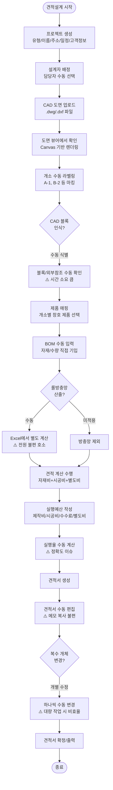
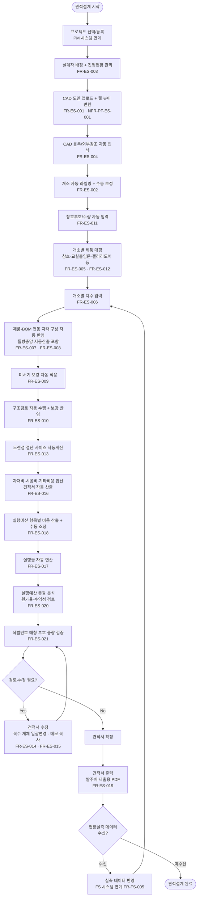

# AN21-2 견적설계 시스템 (ES) — As-Is/To-Be 업무흐름도

**문서코드:** AN21-2
**버전:** v1.0
**작성일:** 2026.04.06
**작성자:** 김성현 (BA, 코드크래프트)
**검토자:** 김지광 (PM, 코드크래프트)
**상위 문서:** [AN21 총괄 업무흐름도](AN21_총괄_업무흐름도_v1.0.md)
**Phase:** Phase 2 (S6~S11)

---

## 1. As-Is 현행 업무 프로세스

### 1.1 개요

현행 견적설계는 WIMS에서 가장 많은 사용자(6명 중 5명)가 사용하는 핵심 업무 영역이다. CAD 도면 기반 견적 설계를 수행하나, 롤방충망 자동산출 부재(전원 요청), CAD 블록 수동 인식, 수동 보강 적용 등 자동화 미흡이 주요 불만이다. 만족도 3.0점(보통).

### 1.2 현행 업무 흐름도

### 1.3 현행 주요 문제점

| # | 문제점 | 영향 | 관련 요구사항 |
|---|--------|------|-------------|
| 1 | 롤방충망 자동산출 없음 — Excel 별도 작업 | 전원(6명) 불편 호소, 최우선 개선 | [[AN12-1_요구사항정의서_Phase2_v1.0#FR-ES-008 롤방충망 자동산출\|FR-ES-008]] |
| 2 | CAD 블록/외부참조 수동 인식 | 도면 분석 시간 과다 | [[AN12-1_요구사항정의서_Phase2_v1.0#FR-ES-004 CAD 블록/외부참조 자동 인식\|FR-ES-004]] |
| 3 | 미서기 보강/하드웨어 수동 적용 | 규칙 누락, 견적 오류 | [[AN12-1_요구사항정의서_Phase2_v1.0#FR-ES-009 미서기 보강 자동화\|FR-ES-009]] |
| 4 | 실행율 계산 수동, 정확도 부족 | 원가율 오차, 수익성 판단 오류 | [[AN12-1_요구사항정의서_Phase2_v1.0#FR-ES-017 실행율 계산 정확도 향상\|FR-ES-017]] |
| 5 | 구조검토 수동 수행 | 보강 적용 누락 위험 | [[AN12-1_요구사항정의서_Phase2_v1.0#FR-ES-010 구조검토 자동화\|FR-ES-010]] |
| 6 | 복수 개체 일괄 변경 불가 | 대량 수정 시 반복 작업 | [[AN12-1_요구사항정의서_Phase2_v1.0#FR-ES-014 복수개체 일괄변경\|FR-ES-014]] |
| 7 | 대용량 도면(50MB+) 렌더링 불안정 | 작업 중단, 데이터 손실 | [[AN12-1_요구사항정의서_Phase2_v1.0#NFR-PF-ES-001 대용량 CAD 도면(50MB) 10초 이내 렌더링\|NFR-PF-ES-001]] |

---

## 2. To-Be 목표 업무 프로세스

### 2.1 개요

WIMS 2.0 견적설계는 CAD 블록 자동 인식, 롤방충망 자동산출, 미서기 보강 자동화, 구조검토 자동화를 통해 수작업을 최소화한다. 복수 개체 일괄 변경, 견적서 수정 편의성 개선으로 대량 프로젝트 효율을 높인다.

### 2.2 목표 업무 흐름도

### 2.3 주요 개선 사항

| # | As-Is | To-Be | 관련 요구사항 |
|---|-------|-------|-------------|
| 1 | 롤방충망 Excel 별도 계산 | 규격별 중량 시스템 자동산출 | [[AN12-1_요구사항정의서_Phase2_v1.0#FR-ES-008 롤방충망 자동산출\|FR-ES-008]] |
| 2 | CAD 블록 수동 식별 | 블록/외부참조 자동 인식 | [[AN12-1_요구사항정의서_Phase2_v1.0#FR-ES-004 CAD 블록/외부참조 자동 인식\|FR-ES-004]] |
| 3 | 개소별 제품 수동 매핑 + BOM 수동 구성 | 제품-개소 자동 매핑(창호·도어 통합) + 치수 입력 → BOM 연동 자동 반영 | [[AN12-1_요구사항정의서_Phase2_v1.0#FR-ES-005 도면 기반 개소별 제품 매핑\|FR-ES-005]], [[AN12-1_요구사항정의서_Phase2_v1.0#FR-ES-006 개소별 치수 입력\|FR-ES-006]], [[AN12-1_요구사항정의서_Phase2_v1.0#FR-ES-007 제품-BOM 연동 자재 구성 자동 반영\|FR-ES-007]], [[AN12-1_요구사항정의서_Phase2_v1.0#FR-ES-012 교실출입문/갤러리도어 설계\|FR-ES-012]] |
| 4 | 미서기 보강 수동 적용 | 규칙 기반 자동 적용 + 일괄변경 | [[AN12-1_요구사항정의서_Phase2_v1.0#FR-ES-009 미서기 보강 자동화\|FR-ES-009]] |
| 5 | 구조검토 수동 수행 | 자동 구조검토 + 보강 자동 적용 | [[AN12-1_요구사항정의서_Phase2_v1.0#FR-ES-010 구조검토 자동화\|FR-ES-010]] |
| 6 | 실행예산 항목 수동 입력 | 항목별 비용 자동 산출 + 수동 조정 | [[AN12-1_요구사항정의서_Phase2_v1.0#FR-ES-018 실행예산 항목별 비용 입력·산출\|FR-ES-018]] |
| 7 | 실행율 수동 계산 | BOM 연계 자동 연산 + 정확도 향상 | [[AN12-1_요구사항정의서_Phase2_v1.0#FR-ES-017 실행율 계산 정확도 향상\|FR-ES-017]] |
| 8 | 실행예산 분석 기능 없음 | 원가율/수익성 총괄 분석 대시보드 | [[AN12-1_요구사항정의서_Phase2_v1.0#FR-ES-020 실행예산 총괄 분석 (원가율·수익성 검토)\|FR-ES-020]] |
| 9 | 복수 개체 개별 수정 | 일괄 선택/변경 기능 | [[AN12-1_요구사항정의서_Phase2_v1.0#FR-ES-014 복수개체 일괄변경\|FR-ES-014]] |
| 10 | 견적서 수동 편집 | 양식 자동생성 + 메모 복사 편의성 | [[AN12-1_요구사항정의서_Phase2_v1.0#FR-ES-015 견적설계 수정 편의성 개선\|FR-ES-015]], [[AN12-1_요구사항정의서_Phase2_v1.0#FR-ES-016 자재비·시공비·기타비용 합산 및 견적서 산출\|FR-ES-016]] |
| 11 | 견적서 출력 기능 제한적 | 발주처 제출용 PDF 견적서 출력 | [[AN12-1_요구사항정의서_Phase2_v1.0#FR-ES-019 견적서 출력 (발주처 제출용)\|FR-ES-019]] |
| 12 | 식별번호 부호 중량 합산 오류 | 매칭 부호 중량 검증 자동화 | [[AN12-1_요구사항정의서_Phase2_v1.0#FR-ES-021 식별번호 매칭 부호 중량 합산 오류 수정\|FR-ES-021]] |
| 13 | 50MB 도면 불안정 | 10초 이내 안정적 렌더링 | [[AN12-1_요구사항정의서_Phase2_v1.0#NFR-PF-ES-001 대용량 CAD 도면(50MB) 10초 이내 렌더링\|NFR-PF-ES-001]] |
