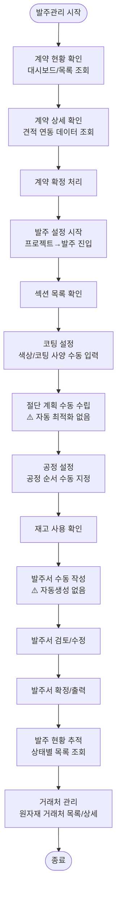
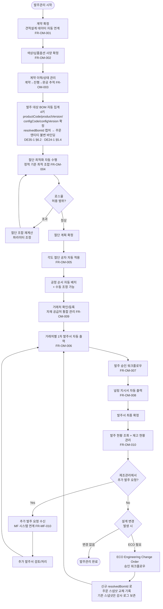

# AN21-3 발주관리 시스템 (OM) — As-Is/To-Be 업무흐름도

**문서코드:** AN21-3
**버전:** v1.2
**작성일:** 2026.04.06
**작성자:** 김성현 (BA, 코드크래프트)
**검토자:** 김지광 (PM, 코드크래프트)
**상위 문서:** [AN21 총괄 업무흐름도](AN21_총괄_업무흐름도_v1.0.md)
**Phase:** Phase 2 (S6~S11)

---

## 변경 이력

| 버전 | 일자 | 작성자 | 검토자 | 변경 내용 |
|------|------|--------|--------|----------|
| v1.0 | 2026.04.06 | 김성현 | 김지광 | 초안 — 발주관리 As-Is/To-Be 업무흐름도 작성 |
| v1.0 | 2026.04.14 | 김성현 | 김지광 | 정비 — §2.3 개선사항 8번 FR-MF-010 링크 표시 텍스트 정정 (`|010]]` → `|FR-MF-010]]`) |
| v1.1 | 2026.04.14 | 김성현 | 김지광 | Resolved BOM 불변 스냅샷 바인딩 반영 (DE35-1 v1.3 §6.2.1, DE24-1 v1.4 정합) — §2.2 A4 단계에 `resolvedBomId` 캡처 명시, ECO(Engineering Change Order) 분기 추가, §2.3 개선사항 항목 신설 |
| v1.2 | 2026.04.14 | 김성현 | 김지광 | 식별자(Code) vs 버전(Version) 축 분리 반영 (DE35-1 v1.4 §6.2, DE24-1 v1.5 정합) — §2.2 A4 단계에 4키(productCode/productVersion/configCode/configVersion) 캡처 명시, §2.3 개선사항 #9 참조 문서 버전 갱신 |

---

## 1. As-Is 현행 업무 프로세스

### 1.1 개요

현행 발주관리는 계약확정 → 발주설정(코팅/절단/공정/재고) → 발주서 생성 → 발주현황 추적의 흐름이다. 절단 계획 화면은 존재하나 자동 최적화 알고리즘이 미적용(수동)이며, 발주서 자동생성 기능이 없다. 만족도 4.0점(1명 응답)으로 상대적 양호하나 담당자가 제한적이다.

### 1.2 현행 업무 흐름도

### 1.3 현행 주요 문제점

| # | 문제점 | 영향 | 관련 요구사항 |
|---|--------|------|-------------|
| 1 | 절단 최적화 알고리즘 없음 — 수동 절단 계획 | 원자재 낭비(로스율 증가) | [[AN12-1_요구사항정의서_Phase2_v1.0#FR-OM-004 원자재 정척 기준 최적 절단 조합 자동 계산\|FR-OM-004]] |
| 2 | 발주서 수동 작성 | 작성 시간 과다, 누락 위험 | [[AN12-1_요구사항정의서_Phase2_v1.0#FR-OM-006 거래처별 1차 발주서 출력\|FR-OM-006]] |
| 3 | 각도 절단 공차 미반영 | 절단 정밀도 저하 | [[AN12-1_요구사항정의서_Phase2_v1.0#FR-OM-005 각도 절단 공차 적용\|FR-OM-005]] |
| 4 | 널링 지시서 미지원 | 별도 문서 수동 작성 | [[AN12-1_요구사항정의서_Phase2_v1.0#FR-OM-008 널링지시서 출력\|FR-OM-008]] |
| 5 | 부품 거래처 메뉴 비활성(HIDDEN) | 부품 거래처 관리 불가 | [[AN12-1_요구사항정의서_Phase2_v1.0#FR-OM-009 거래처 등록·수정·삭제·조회\|FR-OM-009]] |

---

## 2. To-Be 목표 업무 프로세스

### 2.1 개요

WIMS 2.0 발주관리는 절단 최적화 알고리즘(로스율 최소화), 발주서 자동생성, 각도 절단 공차 자동 반영을 핵심으로 한다. 계약확정부터 발주서 출력까지의 프로세스를 자동화하여 업무 시간을 단축한다.

### 2.2 목표 업무 흐름도

### 2.3 주요 개선 사항

| # | As-Is | To-Be | 관련 요구사항 |
|---|-------|-------|-------------|
| 1 | 수동 절단 계획 | 정척 기준 최적 절단 조합 자동 계산 | [[AN12-1_요구사항정의서_Phase2_v1.0#FR-OM-004 원자재 정척 기준 최적 절단 조합 자동 계산\|FR-OM-004]] |
| 2 | 각도 절단 공차 미반영 | 공차 자동 적용 | [[AN12-1_요구사항정의서_Phase2_v1.0#FR-OM-005 각도 절단 공차 적용\|FR-OM-005]] |
| 3 | 발주서 수동 작성 | 거래처별 1차 발주서 자동 출력 | [[AN12-1_요구사항정의서_Phase2_v1.0#FR-OM-006 거래처별 1차 발주서 출력\|FR-OM-006]] |
| 4 | 발주 승인 없음 | 발주 승인 워크플로우 도입 | [[AN12-1_요구사항정의서_Phase2_v1.0#FR-OM-007 발주 승인 워크플로우\|FR-OM-007]] |
| 5 | 널링 지시서 미지원 | 널링지시서 자동 출력 | [[AN12-1_요구사항정의서_Phase2_v1.0#FR-OM-008 널링지시서 출력\|FR-OM-008]] |
| 6 | 부품 거래처 비활성 | 거래처 통합 등록·관리 | [[AN12-1_요구사항정의서_Phase2_v1.0#FR-OM-009 거래처 등록·수정·삭제·조회\|FR-OM-009]] |
| 7 | 재고 수동 확인 | 발주 현황 + 재고 현황 통합 관리 | [[AN12-1_요구사항정의서_Phase2_v1.0#FR-OM-010 발주 현황 조회 및 재고 현황 관리\|FR-OM-010]] |
| 8 | 추가 발주 별도 처리 (제조관리와 미연계) | 제조관리 추가 발주 요청 자동 수신 및 처리 | [[AN12-1_요구사항정의서_Phase2_v1.0#FR-MF-009 1차 발주량 대비 최종 발주량 자동 비교\|FR-MF-009]], [[AN12-1_요구사항정의서_Phase2_v1.0#FR-MF-010 추가 발주서 출력 및 처리\|FR-MF-010]] |
| 9 | BOM 버전 추적 불가 (설계 변경 시 기존 주문과 신규 주문의 BOM 혼선) | 주문 생성 시 Resolved BOM 불변 스냅샷(`resolvedBomId`, 4키 결정적 ID) 을 주문에 바인딩, 설계 변경은 ECO 프로세스로만 반영 | [[DE35-1_미서기이중창_표준BOM구조_정의서_v1.4\|DE35-1]] §6.2, [[DE24-1_인터페이스설계서_MES_REST_API_v1.6\|DE24-1]] §5.4 |
