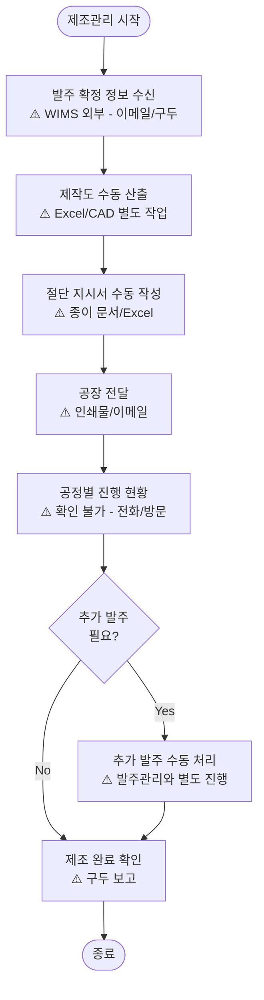
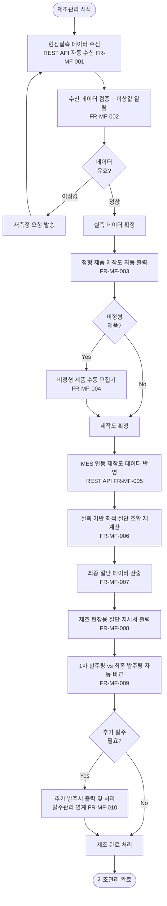

# AN21-4 제조관리 시스템 (MF) — As-Is/To-Be 업무흐름도

**문서코드:** AN21-4
**버전:** v1.0
**작성일:** 2026.04.06
**작성자:** 김성현 (BA, 코드크래프트)
**검토자:** 김지광 (PM, 코드크래프트)
**상위 문서:** [AN21 총괄 업무흐름도](AN21_총괄_업무흐름도_v1.0.md)
**Phase:** Phase 2 (S6~S11)

---

## 1. As-Is 현행 업무 프로세스

### 1.1 개요

현행 WIMS에는 제조관리 기능이 **전면 미구현** 상태이다. 제작도 산출, 절단 지시서, 공정별 추적, 추가 발주 등의 업무가 WIMS 외부(Excel, 수기 문서, 구두 전달)에서 이루어지고 있다. 설문조사에서 현장 실측/제조 관리 익숙도가 1.33점(매우 미숙)으로 최저치를 기록했다.

### 1.2 현행 업무 흐름도

### 1.3 현행 주요 문제점

| # | 문제점 | 영향 | 관련 요구사항 |
|---|--------|------|-------------|
| 1 | 제조관리 기능 전면 미구현 | 전체 프로세스 WIMS 외부에서 수행 | [[AN12-1_요구사항정의서_Phase2_v1.0#FR-MF-001 현장실측 데이터 수신 (REST API)\|FR-MF-001]]~[[AN12-1_요구사항정의서_Phase2_v1.0#FR-MF-010 추가 발주서 출력 및 처리\|010]] |
| 2 | 현장실측 데이터 수동 수신 | 데이터 오류, 지연 | [[AN12-1_요구사항정의서_Phase2_v1.0#FR-MF-001 현장실측 데이터 수신 (REST API)\|FR-MF-001]] |
| 3 | 제작도 수동 산출 | CAD/Excel 별도 작업, 오류 가능성 | [[AN12-1_요구사항정의서_Phase2_v1.0#FR-MF-003 정형 제품 제작도 자동 출력\|FR-MF-003]] |
| 4 | 절단 지시서 종이/Excel 기반 | 문서 분실, 버전 혼란 | [[AN12-1_요구사항정의서_Phase2_v1.0#FR-MF-008 제조 현장용 절단 지시서 출력\|FR-MF-008]] |
| 5 | 추가 발주와 기존 발주 연계 없음 | 자재 수급 혼란 | [[AN12-1_요구사항정의서_Phase2_v1.0#FR-MF-009 1차 발주량 대비 최종 발주량 자동 비교\|FR-MF-009]], [[AN12-1_요구사항정의서_Phase2_v1.0#FR-MF-010 추가 발주서 출력 및 처리\|010]] |

---

## 2. To-Be 목표 업무 프로세스

### 2.1 개요

WIMS 2.0에서 제조관리를 전면 신규 구현한다. 현장실측 데이터를 REST API로 자동 수신하여 제작도 산출, 절단 지시서 생성, 추가 발주 연계까지의 전 과정을 시스템화한다. MES 시스템과의 REST API 연동으로 실시간 생산 데이터를 교환한다.

### 2.2 목표 업무 흐름도

### 2.3 주요 개선 사항

| # | As-Is | To-Be | 관련 요구사항 |
|---|-------|-------|-------------|
| 1 | 실측 데이터 수동 수신 | REST API 자동 수신 + 검증 | [[AN12-1_요구사항정의서_Phase2_v1.0#FR-MF-001 현장실측 데이터 수신 (REST API)\|FR-MF-001]], [[AN12-1_요구사항정의서_Phase2_v1.0#FR-MF-002 수신 데이터 검증 및 이상값 알림\|002]] |
| 2 | 제작도 수동 산출 | 정형 제품 제작도 자동 출력 + 비정형 편집기 | [[AN12-1_요구사항정의서_Phase2_v1.0#FR-MF-003 정형 제품 제작도 자동 출력\|FR-MF-003]], [[AN12-1_요구사항정의서_Phase2_v1.0#FR-MF-004 비정형 제품 수동 편집기 제공\|004]] |
| 3 | MES 연동 없음 | MES REST API 제작도 데이터 반영 | [[AN12-1_요구사항정의서_Phase2_v1.0#FR-MF-005 MES 연동 제작도 데이터 반영\|FR-MF-005]] |
| 4 | 절단 계획 수동 | 실측 기반 최적 절단 재계산 + 최종 데이터 산출 | [[AN12-1_요구사항정의서_Phase2_v1.0#FR-MF-006 실측 기반 최적 절단 조합 재계산\|FR-MF-006]], [[AN12-1_요구사항정의서_Phase2_v1.0#FR-MF-007 최종 절단 데이터 산출\|007]] |
| 5 | 절단 지시서 종이/Excel | 제조 현장용 절단 지시서 자동 출력 | [[AN12-1_요구사항정의서_Phase2_v1.0#FR-MF-008 제조 현장용 절단 지시서 출력\|FR-MF-008]] |
| 6 | 추가 발주 별도 처리 | 1차/최종 발주량 자동 비교 + 추가 발주서 연계 | [[AN12-1_요구사항정의서_Phase2_v1.0#FR-MF-009 1차 발주량 대비 최종 발주량 자동 비교\|FR-MF-009]], [[AN12-1_요구사항정의서_Phase2_v1.0#FR-MF-010 추가 발주서 출력 및 처리\|010]] |
