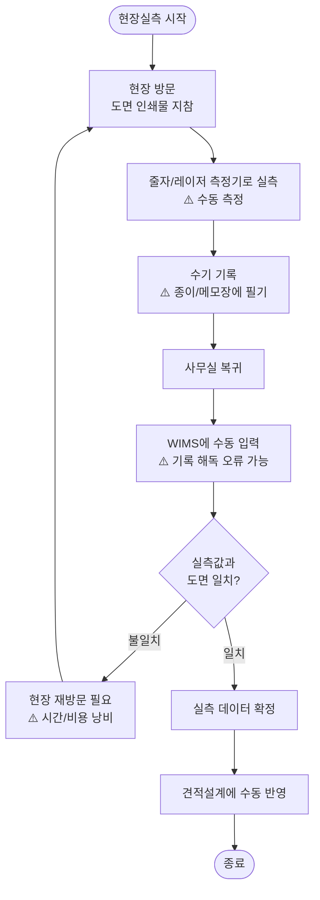
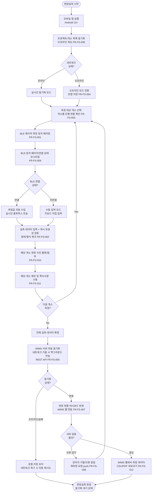

# AN21-5 현장실측 시스템 (FS) — As-Is/To-Be 업무흐름도

**문서코드:** AN21-5
**버전:** v1.0
**작성일:** 2026.04.06
**작성자:** 김성현 (BA, 코드크래프트)
**검토자:** 김지광 (PM, 코드크래프트)
**상위 문서:** [AN21 총괄 업무흐름도](AN21_총괄_업무흐름도_v1.0.md)
**Phase:** Phase 2 (S6~S11)

---

## 1. As-Is 현행 업무 프로세스

### 1.1 개요

현행 WIMS에는 현장실측 기능이 **전면 미구현** 상태이다. 현장에서의 창호 실측 작업은 줄자/레이저 측정기로 수행 후 수기 기록하고, 사무실 복귀 후 WIMS에 수동 입력하는 방식이다. 안드로이드 앱이나 BLE 연동 기능은 존재하지 않는다.

### 1.2 현행 업무 흐름도

### 1.3 현행 주요 문제점

| # | 문제점 | 영향 | 관련 요구사항 |
|---|--------|------|-------------|
| 1 | 현장실측 기능 전면 미구현 | 전 과정 수동(수기 기록→사무실 입력) | [[AN12-1_요구사항정의서_Phase2_v1.0#FR-FS-001 BLE 레이저 측정 장치 페어링 및 연결\|FR-FS-001]]~[[AN12-1_요구사항정의서_Phase2_v1.0#FR-FS-012 측정 데이터 내보내기 (CSV, PDF)\|012]] |
| 2 | BLE 측정기기 연동 없음 | 수동 측정/기록의 비효율 | [[AN12-1_요구사항정의서_Phase2_v1.0#FR-FS-001 BLE 레이저 측정 장치 페어링 및 연결\|FR-FS-001]] |
| 3 | 실측 데이터 유효성 검증 없음 | 오류 데이터 유입, 견적 오류 | [[AN12-1_요구사항정의서_Phase2_v1.0#FR-FS-002 실측 데이터 입력 및 유효성 검증\|FR-FS-002]] |
| 4 | 현장-사무실 데이터 동기화 불가 | 실시간 협업 불가, 재방문 빈번 | [[AN12-1_요구사항정의서_Phase2_v1.0#FR-FS-004 오프라인 모드 및 로컬 저장\|FR-FS-004]], [[AN12-1_요구사항정의서_Phase2_v1.0#FR-FS-005 WIMS 서버와 실측 데이터 동기화 (REST API)\|005]] |
| 5 | 현장 사진/메모 관리 체계 없음 | 분실, 정리 어려움 | [[AN12-1_요구사항정의서_Phase2_v1.0#FR-FS-010 사진 촬영 및 첨부 기능\|FR-FS-010]], [[AN12-1_요구사항정의서_Phase2_v1.0#FR-FS-011 현장 메모 및 특이사항 기록\|011]] |

---

## 2. To-Be 목표 업무 프로세스

### 2.1 개요

WIMS 2.0에서 안드로이드 전용 현장실측 앱(Kotlin, MVVM, Retrofit+OkHttp, Room, BLE API)을 신규 개발한다. BLE 연동 레이저 측정기와 연결하여 실측값을 자동 수집하고, 모바일 앱에서 직접 데이터를 입력/확인한다. 오프라인 모드를 지원하며, 네트워크 복구 시 서버와 자동 동기화한다.

**선행 조건:** Phase 1 ① 제품관리(PM) 및 Phase 2 ② 견적설계(ES)에서 프로젝트·개소 정보가 사전 등록되어 있어야 한다.

**후속 연계:** 수집된 실측 데이터는 ④ 제조관리(MF)로 REST API를 통해 자동 전달되며(FR-FS-005 → FR-MF-001), ② 견적설계(ES)에서 실측 기반 견적 수정에도 활용된다.

### 2.2 목표 업무 흐름도

### 2.3 주요 개선 사항

| # | As-Is | To-Be | 관련 요구사항 |
|---|-------|-------|-------------|
| 1 | BLE 측정기기 연동 없음 | BLE 레이저 측정 장치 페어링/자동 수집 | [[AN12-1_요구사항정의서_Phase2_v1.0#FR-FS-001 BLE 레이저 측정 장치 페어링 및 연결\|FR-FS-001]] |
| 2 | 실측 데이터 검증 없음 | 앱 즉시 유효성 검증([[AN12-1_요구사항정의서_Phase2_v1.0#FR-FS-002 실측 데이터 입력 및 유효성 검증\|FR-FS-002]]) + 서버 검증 후 오류 알림/재측정 요청([[AN12-1_요구사항정의서_Phase2_v1.0#FR-FS-008 측정 데이터 오류 알림 및 재측정 요청\|FR-FS-008]]) | [[AN12-1_요구사항정의서_Phase2_v1.0#FR-FS-002 실측 데이터 입력 및 유효성 검증\|FR-FS-002]], [[AN12-1_요구사항정의서_Phase2_v1.0#FR-FS-008 측정 데이터 오류 알림 및 재측정 요청\|008]] |
| 3 | 측정 진행 현황 없음 | 개소별 측정 진행 현황 관리 | [[AN12-1_요구사항정의서_Phase2_v1.0#FR-FS-003 개소별 측정 진행 현황 관리\|FR-FS-003]] |
| 4 | 오프라인 작업 불가 | 오프라인 모드 + 로컬 저장 | [[AN12-1_요구사항정의서_Phase2_v1.0#FR-FS-004 오프라인 모드 및 로컬 저장\|FR-FS-004]] |
| 5 | 데이터 동기화 없음 | WIMS 서버 REST API 자동 동기화 | [[AN12-1_요구사항정의서_Phase2_v1.0#FR-FS-005 WIMS 서버와 실측 데이터 동기화 (REST API)\|FR-FS-005]], [[AN12-1_요구사항정의서_Phase2_v1.0#FR-FS-006 프로젝트·개소 목록 동기화 및 오프라인 캐싱\|006]] |
| 6 | 현장 대시보드 없음 | 현장 현황 대시보드 (웹 연동) | [[AN12-1_요구사항정의서_Phase2_v1.0#FR-FS-007 현장 현황 대시보드 (WIMS 웹 연동)\|FR-FS-007]] |
| 7 | BLE 장치 상태 모니터링 없음 | 배터리/연결 상태 실시간 모니터링 | [[AN12-1_요구사항정의서_Phase2_v1.0#FR-FS-009 BLE 장치 배터리 및 연결 상태 모니터링\|FR-FS-009]] |
| 8 | 사진/메모 관리 없음 | 개소별 현장 사진 촬영 + 메모/특이사항 기록 | [[AN12-1_요구사항정의서_Phase2_v1.0#FR-FS-010 사진 촬영 및 첨부 기능\|FR-FS-010]], [[AN12-1_요구사항정의서_Phase2_v1.0#FR-FS-011 현장 메모 및 특이사항 기록\|011]] |
| 9 | 데이터 내보내기 없음 | WIMS 웹 대시보드에서 CSV/PDF 내보내기 | [[AN12-1_요구사항정의서_Phase2_v1.0#FR-FS-012 측정 데이터 내보내기 (CSV, PDF)\|FR-FS-012]] |
