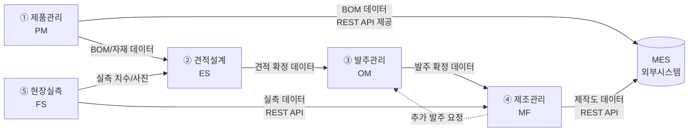

# AN21 As-Is/To-Be 업무흐름도 (총괄)

**문서코드:** AN21
**버전:** v1.0
**작성일:** 2026.04.06
**작성자:** 김성현 (BA, 코드크래프트)
**검토자:** 김지광 (PM, 코드크래프트)
**승인자:** 유미숙 (사업주, 유니크시스템)

---

## 변경 이력

| 버전 | 일자 | 작성자 | 검토자 | 변경 내용 |
|------|------|--------|--------|----------|
| v1.0 | 2026.04.06 | 김성현 | 김지광 | 초안 — 5개 서브시스템 As-Is/To-Be 업무흐름도 정의 |
| v1.0 | 2026.04.14 | 김성현 | 김지광 | 정비 — §1.1 서식 설명 5개 서브시스템 테일러링 명시; §1.3 PP12-1 파일 경로 명시, DE35-1 참조 v1.2로 갱신 |

---

## 목차

1. 개요
2. 서브시스템별 업무흐름도 (개별 문서)
3. 서브시스템 간 연계 흐름
4. As-Is → To-Be 주요 변경점 요약
5. 승인

---

## 1. 개요

### 1.1 목적

본 문서는 WIMS 2.0 프로젝트의 5개 서브시스템에 대한 As-Is/To-Be 업무흐름도의 총괄 문서이다. 특허청 SW 개발방법론 AN21(업무분석) 활동의 산출물로서, AN21-1~AN21-4 표준 서식(5개 서브시스템으로 확장 테일러링)을 본 프로젝트의 5개 서브시스템 구조에 맞게 테일러링하여 작성한다. 각 서브시스템의 상세 업무흐름도는 개별 문서로 분리하여 관리한다.

### 1.2 범위

| 코드     | 서브시스템       | Phase   | 주요 업무 영역                 | 개별 문서                            |
| ------ | ----------- | ------- | ------------------------ | -------------------------------- |
| AN21-1 | ① 제품관리 (PM) | Phase 1 | 자재등록, 제품구성, BOM관리, MES연동 | [[AN21-1_제품관리_PM_업무흐름도_v1.0.md]] |
| AN21-2 | ② 견적설계 (ES) | Phase 2 | CAD도면, 개소라벨링, 견적산출, 실행예산 | [[AN21-2_견적설계_ES_업무흐름도_v1.0.md]] |
| AN21-3 | ③ 발주관리 (OM) | Phase 2 | 계약확정, 최적절단, 발주서, 거래처     | [[AN21-3_발주관리_OM_업무흐름도_v1.0.md]] |
| AN21-4 | ④ 제조관리 (MF) | Phase 2 | 제작도, 절단지시서, 공정추적, 추가발주   | [[AN21-4_제조관리_MF_업무흐름도_v1.0.md]] |
| AN21-5 | ⑤ 현장실측 (FS) | Phase 2 | 모바일실측, BLE측정, 실측데이터동기화   | [[AN21-5_현장실측_FS_업무흐름도_v1.0.md]] |

### 1.3 참조 문서

| 문서명 | 문서코드 | 버전 |
|--------|---------|------|
| 개발계획서 | - | v1.2 |
| 사전설문조사 결과서 | AN11-2 | v1.0 |
| 요구사항 정의서 Phase 1 | AN12-1-P1 | v1.0 |
| 요구사항 정의서 Phase 2 | AN12-1-P2 | v1.0 |
| 현행시스템 사이트맵 | WIMS_현행시스템_사이트맵 | v1.0 |
| 방법론 테일러링 결과서 | PP12-1 | v2.1 (`docs/1_PP(프로젝트계획)/PP12-1_방법론_테일러링_결과서_v2.0_산출물확정.md`) |
| 미서기이중창 표준BOM구조 정의서 | DE35-1 | v1.4 |

### 1.4 흐름도 표기법

본 문서군의 업무흐름도는 Mermaid flowchart 문법으로 작성하며, 다음 기호를 사용한다.

| 기호 | Mermaid 표기 | 의미 |
|------|-------------|------|
| 둥근 사각형 | `([텍스트])` | 시작/종료 |
| 사각형 | `[텍스트]` | 처리/작업 |
| 마름모 | `{텍스트}` | 분기/판단 |
| 평행사변형 | `[/텍스트/]` | 입력/출력 데이터 |
| 원통 | `[(텍스트)]` | 데이터저장소/DB |
| 실선 화살표 | `-->` | 프로세스 흐름 |
| 점선 화살표 | `-.->` | 데이터 참조/연동 |

### 1.5 용어 정의

| 용어 | 정의 |
|------|------|
| BOM | Bill of Materials — 제품을 구성하는 자재·부품 목록 및 계층 구조 |
| 개소 | 도면 상의 창호 설치 위치 (A-1, B-2 등) |
| MES | Manufacturing Execution System — 생산 실행 관리 시스템 |
| BLE | Bluetooth Low Energy — 저전력 블루투스 (실측 기기 연동) |
| 절단 최적화 | 원자재 낭비를 최소화하는 절단 조합 자동 산출 알고리즘 |
| 롤방충망 | 창호에 설치되는 방충망. 규격별 중량을 자동 산출하는 기능 필요 |

---

## 2. 서브시스템별 업무흐름도 (개별 문서)

각 서브시스템의 As-Is/To-Be 업무흐름도는 아래 개별 문서를 참조한다.

| 문서 | 내용 요약 |
|------|----------|
| [AN21-1 제품관리 (PM)](AN21-1_제품관리_PM_업무흐름도_v1.0.md) | 자재코드 표준화, 다단계 BOM, MES REST API 연동 |
| [AN21-2 견적설계 (ES)](AN21-2_견적설계_ES_업무흐름도_v1.0.md) | CAD 블록 자동인식, 롤방충망 자동산출, 견적 자동화 |
| [AN21-3 발주관리 (OM)](AN21-3_발주관리_OM_업무흐름도_v1.0.md) | 절단 최적화, 발주서 자동출력, 승인 워크플로우 |
| [AN21-4 제조관리 (MF)](AN21-4_제조관리_MF_업무흐름도_v1.0.md) | 전면 신규 — 제작도, 절단지시서, MES 연동 |
| [AN21-5 현장실측 (FS)](AN21-5_현장실측_FS_업무흐름도_v1.0.md) | 전면 신규 — 안드로이드 앱, BLE, 오프라인 동기화 |

---

## 3. 서브시스템 간 연계 흐름

### 3.1 전체 업무 흐름 개요

5개 서브시스템은 프로젝트 라이프사이클에 따라 순차적/병행적으로 연계된다.

### 3.2 서브시스템 간 데이터 흐름 정의

| # | 출발 시스템 | 도착 시스템 | 전달 데이터 | 연동 방식 |
|---|-----------|-----------|-----------|----------|
| 1 | PM (제품관리) | ES (견적설계) | BOM 구조, 자재 규격, 단가 | DB 참조 (내부) |
| 2 | PM (제품관리) | MES (외부) | BOM 데이터, 자재 코드 | REST API (JWT) |
| 3 | ES (견적설계) | OM (발주관리) | 견적 확정 데이터, 수량, 금액 | DB 참조 (내부) |
| 4 | OM (발주관리) | MF (제조관리) | 발주 확정, 절단계획, 공정정보 | DB 참조 (내부) |
| 5 | MF (제조관리) | MES (외부) | 작업지시, 생산실적 | REST API (JWT) |
| 6 | MF (제조관리) | OM (발주관리) | 추가 발주 요청 | 내부 이벤트 |
| 7 | FS (현장실측) | ES (견적설계) | 실측 치수, 현장 사진 | REST API (모바일→서버) |
| 8 | FS (현장실측) | MF (제조관리) | 실측 데이터 (치수, 현장 사진) | REST API (모바일→서버→MF) |

---

## 4. As-Is → To-Be 주요 변경점 요약

### 4.1 변경 유형별 분류

| 변경 유형 | 서브시스템 | 건수 | 설명 |
|----------|-----------|------|------|
| **전면 신규 구현** | MF (제조관리), FS (현장실측) | 2개 시스템 (MF 6건, FS 9건) | 현행 미구현 → 전면 신규 |
| **핵심 기능 추가 + UX 개선** | PM (제품관리) | 11건 | 자재코드 표준화, 원자재/부자재 분리, 단가 이력, BOM 체계, MES API, 프로젝트 관리 등 |
| **자동화 전환** | ES (견적설계) | 13건 | 롤방충망, CAD블록, BOM 연동, 보강, 구조검토, 실행예산, 견적서 출력 등 |
| **알고리즘 도입 + 프로세스 개선** | OM (발주관리) | 8건 | 절단 최적화, 발주서 자동생성, 승인 워크플로우, 추가 발주 수신 등 |

### 4.2 Phase별 구현 범위

| Phase | 시스템 | 핵심 변경 | 스프린트 |
|-------|--------|----------|---------|
| **Phase 1** | PM (제품관리) | 자재코드 표준화, 원자재/부자재 분리, 단가 이력, BOM 체계, MES REST API, 프로젝트 관리 | S2~S5 |
| **Phase 2** | ES (견적설계) | 롤방충망 자동산출, CAD 자동인식, BOM 연동, 실행예산 자동화, 견적서 출력 | S6~S11 |
| **Phase 2** | OM (발주관리) | 절단 최적화, 발주서 자동생성, 승인 워크플로우, 추가 발주 수신 | S6~S11 |
| **Phase 2** | MF (제조관리) | 전면 신규 — 실측 수신, 제작도, 절단지시서, MES연동, 추가발주 | S6~S11 |
| **Phase 2** | FS (현장실측) | 전면 신규 — 안드로이드 앱, BLE, 오프라인 동기화, 대시보드 | S6~S11 |

---

## 5. 승인

| 구분 | 성명 | 소속 | 서명 | 일자 |
|------|------|------|------|------|
| 작성 | 김성현 | 코드크래프트 | | 2026.04. |
| 검토 | 김지광 | 코드크래프트 | | 2026.04. |
| 승인 | 유미숙 | 유니크시스템 | | 2026.04. |
