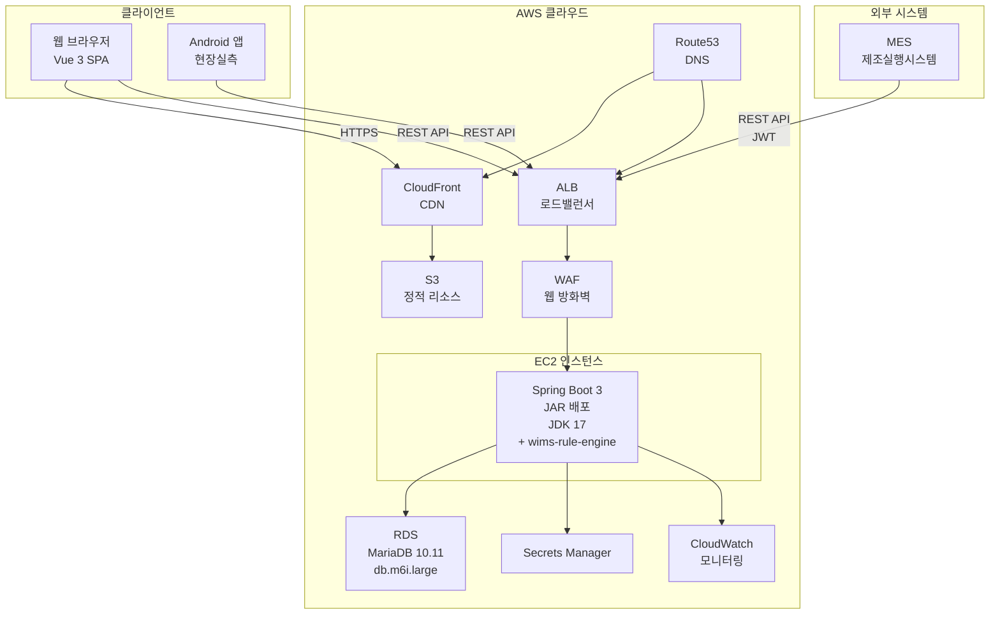
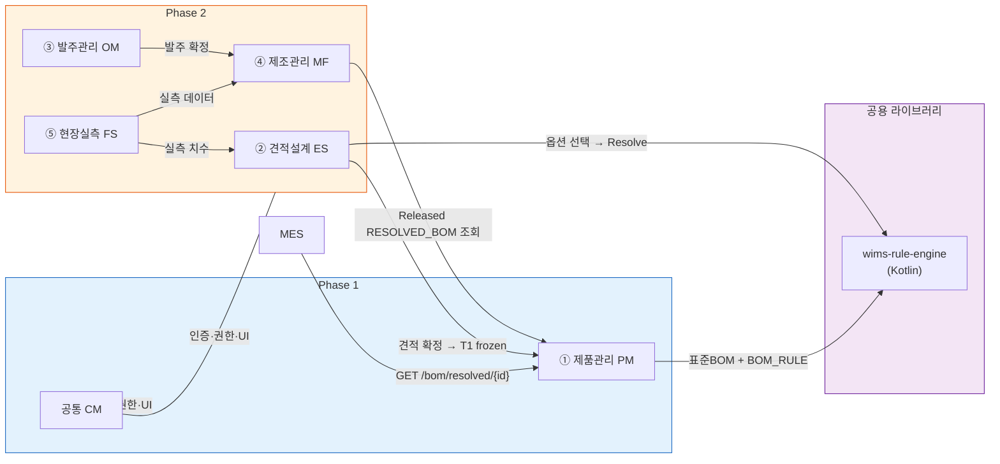
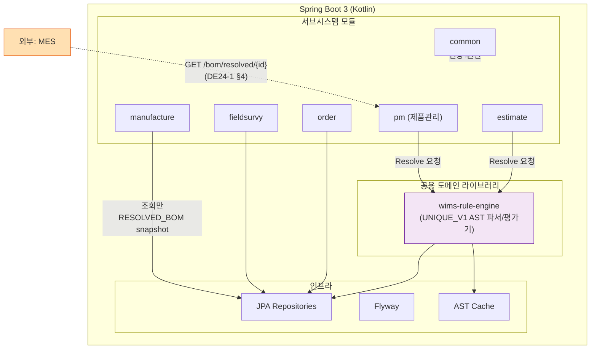
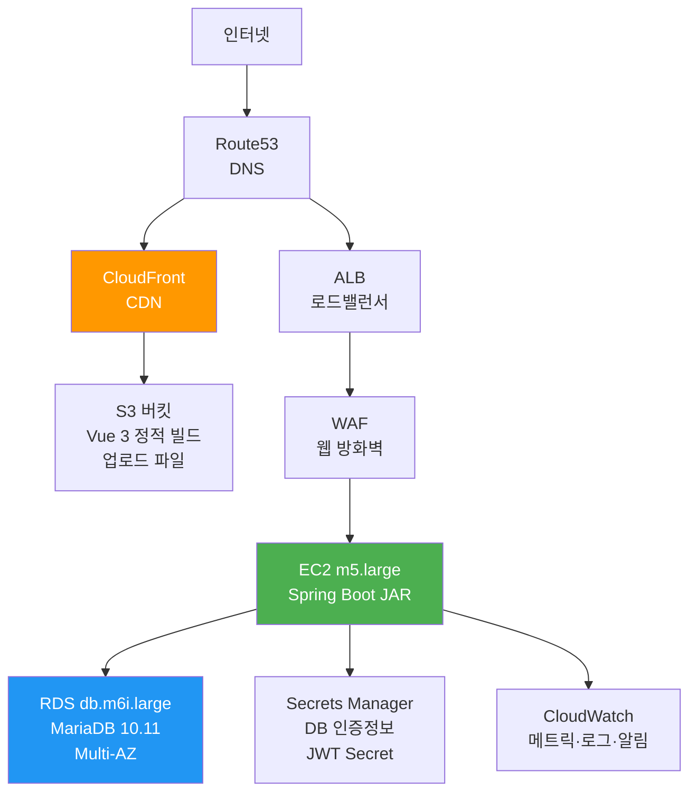
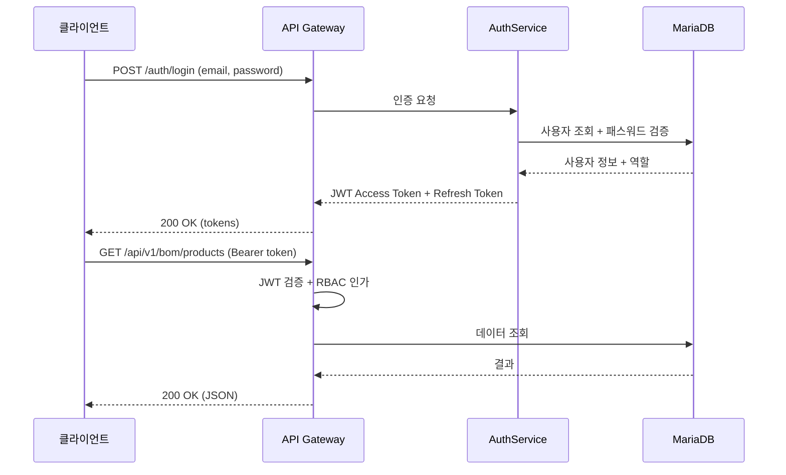
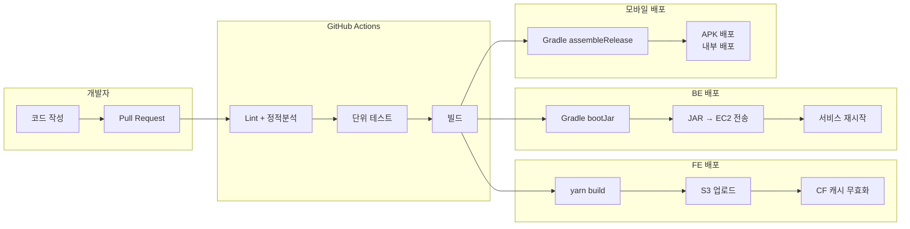
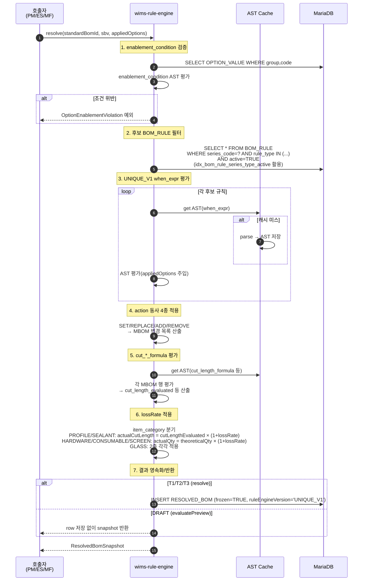

# DE11-1 소프트웨어 아키텍처 설계서

**문서코드:** DE11-1  
**버전:** v1.3  
**작성일:** 2026.04.16  
**작성자:** 김지광 (PM, 코드크래프트)  
**검토자:** 김진호 (BE, 코드크래프트)

> [!abstract] v1.2 요약
> 용어사전 [[WIMS_용어사전_BOM_v1.4]] 에서 확정된 엔티티 확장·RuleEngine 모듈·산식 언어 `UNIQUE_V1`·snapshot 필드를 아키텍처에 반영한다. 주요 변경:
> 1. ER 다이어그램에 PRODUCT(+5), OPTION_VALUE(+5), MBOM(+9), ITEM(+3), BOM_RULE(+3) 컬럼 및 신규 3개 엔티티(`DIES_BOOK`, `DIES_SUPPLIER`, `ITEM_SUPPLIER`) 보강.
> 2. 신규 섹션 §11 — `wims-rule-engine` 모듈 명세(입력·출력·7단계 파이프라인).
> 3. §4.2.2 성능·SLA — 인덱스, AST 캐시, p95 ≤ 100ms, 카디널리티 관리(lazy 생성) 명세.
> 4. ADR-006 — frozen 후 RESOLVED_BOM 불변성 계약(v1.3 §4.2 근거).
> 5. Flyway 마이그레이션 전략(§5.6) — 컬럼 추가 순서 및 롤백 정책.
> 6. 모듈 다이어그램 업데이트 — `wims-rule-engine` 포지션, MES 연동은 RESOLVED_BOM 조회 경유.

---

## 변경 이력

| 버전 | 일자 | 작성자 | 변경 내용 |
|------|------|--------|----------|
| v1.0 | 2026.04.07 | 김지광 | 초안 — 시스템 구성도, 기술 스택, 레이어 구조, 배포, 모바일 |
| v1.1 | 2026.04.14 | 김지광 | DHS-AE225-D-1 BOM 정리 분석 반영: Phantom, 위치 인스턴스, EBOM↔MBOM 매핑 사례; §1.3 DE24-1 v1.0→v1.1, §5.4.1 "확정 근거"→"설계 근거" 완화 |
| v1.1 (후속) | 2026.04.14 | 김지광 | 표준BOM 단일 버전축, §5.5 원자적 버전 관리 원칙, frozen 트리거 T1/T2/T3 |
| **v1.2** | **2026.04.15** | **김지광** | **용어사전 v1.3 반영. (A) ER 컬럼 25종+신규 엔티티 3종 보강, (B) §11 `wims-rule-engine` 모듈 명세 신설(7단계 파이프라인), (C) §4.2.2 성능·SLA — 인덱스·AST 캐시·p95 100ms, (D) ADR-006 frozen 불변성 계약, (E) §5.6 Flyway 마이그레이션 전략, (F) §4.2.3 모듈 다이어그램에 RuleEngine 포함, (G) 금지어(`CuttingBOM`, `산식구분`, `LayoutType`) 잔존 제거, (H) `itemCategory`/`seriesCode`/`OPT-DIM`/`enablement_condition`/`ruleEngineVersion`/`supplyDivision` 도입** |
| **v1.3** | **2026.04.16** | **김지광** | **BOM-RULE-UI 스펙 (v1-r1, 2026-04-16, archived) 반영. §11.7 템플릿 컴파일러 명세(TemplateCompiler 인터페이스, 컴파일 규약 4종), §11.8 시뮬레이터 API(POST /pm/rules/simulate), §11.9 결정표 API(GET /pm/rules/decision-table). 근거 용어사전 v1.3→v1.4** |
| **v1.3-r1** | **2026.04.24** | **김지광** | **DEC-06 Spring Security ROLE 사전 통합. §7.3 역할 사전 (Role Dictionary) SOT 신설 — 7종 표준 ROLE (ADMIN/PM_ADMIN/PM_EDITOR/PM_VIEWER/RULE_EDITOR/ESTIMATE_EDITOR/MES_READER) + 레거시 마이그레이션 맵 (SUPER/PR_MEM/ARCH_MEM/MEM → 표준). 기존 §7.3 사용자 역할은 §7.4 로 이동(레거시 매핑 참조용).** |

---

## 목차

1. 개요
2. 시스템 전체 구성도
3. 기술 스택
4. 애플리케이션 아키텍처
5. 데이터 아키텍처
   - 5.3 핵심 도메인 모델 (v1.3 반영 ER)
   - 5.5 BOM 원자적 버전 관리 원칙
   - 5.6 Flyway 마이그레이션 전략 (v1.2 신설)
6. 인프라 아키텍처
7. 보안 아키텍처
8. 배포 아키텍처
9. 형상관리 및 브랜치 전략
10. 아키텍처 결정 기록 (ADR)
11. RuleEngine 모듈 명세 (v1.2 신설)

---

## 1. 개요

### 1.1 목적

본 문서는 WIMS 2.0 시스템의 소프트웨어 아키텍처를 정의한다. 5개 서브시스템(PM/ES/OM/MF/FS)과 공통 기능의 구조, 기술 스택, 레이어, 인프라, 배포 전략을 설계한다. v1.2 는 [[WIMS_용어사전_BOM_v1.4]] 확정 사항(RuleEngine, snapshot, 신규 엔티티)을 반영한다.

### 1.2 적용 범위

| 구분 | 범위 |
|------|------|
| Phase 1 (M1~M3) | ① 제품관리(PM) + 공통(CM) + MES REST API 연동 |
| Phase 2 (M4~M8) | ② 견적설계(ES) + ③ 발주관리(OM) + ④ 제조관리(MF) + ⑤ 현장실측(FS) |
| 플랫폼 | 웹 (FE+BE) + Android (FS) |

### 1.3 참조 문서

| 문서코드 | 문서명 | 용도 |
|---------|--------|------|
| [[WIMS_용어사전_BOM_v1.4\|용어사전 v1.3]] | BOM 도메인 용어사전 | **본 문서의 기준 — 엔티티·필드·RuleEngine 명세** |
| [[PP11-1_TFT구성계획서_v2.3\|PP11-1]] | TFT 구성계획서 v2.3 | 개발 환경, 브랜치 전략 |
| [[DE24-1_인터페이스설계서_v2.0\|DE24-1]] | 인터페이스 설계서 (MES REST API) v1.8 | API 아키텍처, 인증 |
| [[DE35-1_미서기이중창_표준BOM구조_정의서_v1.5\|DE35-1]] | BOM 구조 정의서 v1.5 | BOM 도메인 모델 |
| V3 (archived) | 검증 V3 | DE11-1 영향 섹션 |
| V5 (archived) | 검증 V5 | 인덱스·AST 캐시·카디널리티 리스크 P2/P3/P4 |
| [[GAP_분석_통합_2026-04-15]] | GAP 통합 §4′ | DDL 총량 |

---

## 2. 시스템 전체 구성도

### 2.1 시스템 구성도



### 2.2 서브시스템 구성



> [!info] v1.2 변경점
> `wims-rule-engine` 은 신규 Kotlin 라이브러리 모듈. PM·ES 가 직접 의존하며, MF·MES 는 호출하지 않고 이미 생성된 `RESOLVED_BOM` snapshot 만 조회한다(§11 §4.2.2).

---

## 3. 기술 스택

(v1.1 §3 과 동일 — 변경 없음. Vue 3 / Kotlin+Spring Boot 3 / MariaDB 10.11 / AWS EC2+RDS / GitHub Actions / JAR 직배포)

### 3.x v1.2 추가 사항

| 계층 | 기술 | 버전/사양 | 비고 |
|------|------|----------|------|
| BOM 도메인 라이브러리 | `wims-rule-engine` (Kotlin) | 1.0 (UNIQUE_V1) | Spring Boot 앱에 라이브러리로 embedded. §11 참조 |
| 산식 파서 | 자체 구현(Lexer+Parser+AST) | UNIQUE_V1 | IIF + 산술연산 + 비교연산 + AND/OR. 용어사전 v1.3 §13.1 |
| AST 캐시 | `ConcurrentHashMap<String, ASTNode>` | JVM 내장 | 기동 시 warm-up |

---

## 4. 애플리케이션 아키텍처

### 4.1 프론트엔드 아키텍처

(v1.1 §4.1 유지)

### 4.2 백엔드 아키텍처

#### 4.2.1 레이어 구조

(v1.1 §4.2 유지)

#### 4.2.2 성능 최적화 및 SLA (v1.2 보강)

AN12-1 NFR-PF 및 V5 (archived) P2·P3·P4 를 반영한 아키텍처 수준 SLA:

| # | 목표 | 전략 | 구현 | 근거 |
|---|------|------|------|------|
| 1 | 일반 화면 p95 ≤ 3s | JPA Fetch Join, 인덱스, `@Cacheable` | Spring Boot 기본 | NFR-PF-CM-001 |
| 2 | BOM 트리 1만건 ≤ 5s | 서버 재귀 CTE + FE 가상 스크롤 | MariaDB CTE, Vue Virtual Scroller | NFR-PF-PM-001 |
| 3 | 동시접속 30인 | HikariCP 5~20, Kotlin Coroutines | — | NFR-PF-CM-002 |
| 4 | MES API p95 ≤ 500ms | RESOLVED_BOM 조회 전용(재평가 없음) | 메모리 캐시 TTL 5분 | NFR-PF-PM-002 |
| 5 | **Resolve p95 ≤ 100ms** | **BOM_RULE 인덱스 + AST 캐시** | §11 §4.2.2 표 2 | **V5 P3** |
| 6 | RESOLVED_BOM 카디널리티 제어 | **lazy 생성** (T1/T2 에만 INSERT) | 용어사전 v1.3 §4.1 | **V5 P2** |
| 7 | frozen 후 재평가 금지 | snapshot 필드 불변, language version 고정 | 용어사전 v1.3 §4.2, ADR-006 | **V5 P4** |

**핵심 인덱스 명세 (v1.2 신규):**

| 테이블 | 인덱스 | 컬럼 | 용도 |
|--------|--------|------|------|
| `BOM_RULE` | `idx_bom_rule_series_type_active` | `(series_code, rule_type, active)` | Resolve 시 후보 규칙 필터. 5,000행 규모에서 평균 20~50행으로 축소 |
| `BOM_RULE` | `idx_bom_rule_product_class` | `(product_class_path)` | 제품 분류 기반 보조 필터 |
| `ITEM` | `idx_item_category` | `(item_category)` | Resolve 로직 분기(길이 기반 vs 개수 기반 lossRate) |
| `OPTION_VALUE` | `idx_opt_value_group_type` | `(group_code, value_type)` | NUMERIC/ENUM 구분 조회, 해시 산출 시 ENUM 필터링 |
| `RESOLVED_BOM` | `uk_resolved_bom_key` | `(resolved_bom_key)` UNIQUE | 중복 생성 방지 |
| `MBOM` | `idx_mbom_product_item` | `(product_id, item_code)` | 기존 유지 |

**AST 캐시 정책:**

- 애플리케이션 기동(`@PostConstruct`) 시 `BOM_RULE.action_json` 내 모든 산식 + `MBOM.cut_*_formula` 를 사전 파싱하여 `ConcurrentHashMap<String, ASTNode>` 에 적재 (warm-up).
- 5,000개 산식 × 평균 AST 500 bytes ≈ 2.5 MB 메모리 점유.
- Invalidate: (a) 관리자 UI 의 BOM_RULE 수정 시 이벤트 `RuleChangedEvent` 발행 → 해당 캐시 엔트리 제거. (b) 비상 수단으로 관리자 API `POST /api/internal/v1/admin/rule-engine/cache/invalidate`.
- 캐시 미스 시 on-demand 파싱 + 캐시에 적재(thread-safe).

**카디널리티 관리 (lazy 생성):**

- `PRODUCT_CONFIG = DRAFT` 편집 중에는 RESOLVED_BOM row 를 INSERT 하지 않는다. RuleEngine 이 evaluate-only 모드로 결과를 반환(프리뷰).
- **T1** 견적 CONFIRMED / **T2** 작업지시 RELEASED / **T3** 명시적 확정 — 이 트리거 시점에만 INSERT + `frozen=TRUE` 전환.
- 결과: DRAFT 취소·재시도로 인한 garbage row 미생성. 5년 누적 주문 기반 125,000행 수준으로 수렴 가능.

#### 4.2.3 모듈 구성 (v1.2 보강)



**원칙:**
- MES 는 `wims-rule-engine` 을 직접 호출하지 않는다. 이미 frozen 된 RESOLVED_BOM 행을 DE24-1 엔드포인트로 조회할 뿐이다.
- RuleEngine 호출 경로는 PM(관리자 확정 — T3) / ES(견적 확정 — T1) / MF(작업지시 RELEASED — T2) 세 군데로 제한.

### 4.3 모바일 아키텍처 (Android)

(v1.1 §4.3 유지)

---

## 5. 데이터 아키텍처

### 5.1 데이터베이스 구성 · 5.2 스키마 관리

(v1.1 유지)

### 5.3 핵심 도메인 모델 (v1.3 ER 반영)

```mermaid
erDiagram
    PRODUCT ||--o{ EBOM : "1:N"
    PRODUCT ||--o{ MBOM : "1:N"
    PRODUCT ||--o{ PRODUCT_CONFIG : "1:N"
    PRODUCT ||--o{ PRODUCT : "derivative_of (self FK)"
    EBOM ||--o{ EBOM_MBOM_MAP : "1:N"
    MBOM ||--o{ EBOM_MBOM_MAP : "1:N"
    MBOM }o--|| PROCESS : "N:1"
    ITEM ||--o{ EBOM : "품목 참조"
    ITEM ||--o{ MBOM : "품목 참조"
    ITEM ||--o{ BOM_ITEM_LOCATION : "1:N"
    ITEM ||--o{ ITEM_SUPPLIER : "1:N"
    PRODUCT_CONFIG ||--o{ CONFIG_OPTION : "1:N"
    PRODUCT_CONFIG ||--o{ RESOLVED_BOM : "1:N"
    OPTION_GROUP ||--o{ OPTION_VALUE : "1:N"
    OPTION_GROUP ||--o{ CONFIG_OPTION : "1:N"
    BOM_RULE ||--o{ BOM_RULE_ACTION : "1:N"
    DIES_BOOK ||--o{ ITEM : "dies_code 참조"
    DIES_SUPPLIER ||--o{ ITEM_SUPPLIER : "1:N"

    PRODUCT {
        long product_id PK
        string product_code
        string product_name
        string category
        string status
        string series_code "v1.3 §1,§10"
        long derivative_of FK "v1.3 §16 self FK"
        string derivative_kind "1MM|CAP_TO_HIDDEN|TEMPERED|FIRE_43MM"
        string class_l1 "대분류"
        string class_l2 "계약구분"
        string class_l3 "유리사양"
        string class_l4 "치수크기"
        string dies_revision "선택, 예: 2025-08-20"
        int current_standard_bom_version
    }
    ITEM {
        long item_id PK
        string item_code
        string item_name
        string item_type
        string unit
        string item_category "PROFILE|GLASS|HARDWARE|CONSUMABLE|SEALANT|SCREEN (v1.3 §1)"
        string dies_code "금형 식별자 (v1.3 §14)"
        decimal unit_weight_kg_m "프로파일 단위중량 (v1.3 §14)"
    }
    EBOM {
        long ebom_id PK
        long product_id FK
        long parent_item_id FK
        long child_item_id FK
        int level
        decimal qty
        int standard_bom_version
    }
    MBOM {
        long mbom_id PK
        long product_id FK
        long parent_item_id FK
        long child_item_id FK
        int level
        decimal qty
        string process_code
        int work_order
        decimal loss_rate
        decimal actual_qty
        int standard_bom_version
        boolean is_phantom
        string cut_direction "v1.3 §3 W|H|W1|H1|H2|H3"
        string cut_length_formula "v1.3 §3 산식 원문"
        string cut_length_formula_2 "v1.3 §3 2차 치수 (유리 등)"
        string cut_qty_formula "v1.3 §3 절단 개수 산식"
        string supply_division "공통|외창|내창 (v1.3 §3)"
        decimal cut_length_evaluated "v1.3 §3,§4 snapshot — frozen 후 불변"
        decimal cut_length_evaluated_2 "v1.3 §3 2차 평가값"
        decimal cut_qty_evaluated "v1.3 §3 수량 평가 snapshot"
        decimal actual_cut_length "v1.3 §3.1 = cut_length_evaluated × (1+lossRate)"
    }
    OPTION_GROUP {
        long group_id PK
        string group_code "OPT-LAY|OPT-CUT|OPT-DIM|OPT-GLZ|..."
        string group_name
    }
    OPTION_VALUE {
        long value_id PK
        long group_id FK
        string value_code
        boolean is_default
        string value_type "ENUM|NUMERIC|RANGE (v1.3 §11.1)"
        decimal numeric_min "v1.3 §11.1 NUMERIC 전용"
        decimal numeric_max
        string unit "mm 등"
        string enablement_condition "v1.3 §11.2 UNIQUE_V1 조건식"
        string metadata "JSON"
    }
    BOM_RULE {
        long rule_id PK
        long product_id FK
        string series_code "필터 인덱스 컬럼"
        string rule_type "OPTION|DERIVATIVE (v1.3)"
        string when_expr "UNIQUE_V1 조건식"
        string action_json "SET|REPLACE|ADD|REMOVE (v1.3 §13.2)"
        boolean active "인덱스 대상"
        string product_class_path "보조 필터"
    }
    BOM_RULE_ACTION {
        long action_id PK
        long rule_id FK
        string verb "SET|REPLACE|ADD|REMOVE"
        string target_json
        string payload_json
    }
    RESOLVED_BOM {
        long resolved_bom_id PK
        long config_id FK
        string resolved_bom_key UK
        int standard_bom_version
        string option_snapshot "JSON appliedOptions"
        string applied_options_hash "ENUM 옵션만 해시 (v1.3 §4.1)"
        string bom_type
        long parent_item_id
        long child_item_id
        decimal resolved_qty
        decimal resolved_loss_rate
        boolean frozen
        datetime frozen_at
        string changed_components "JSON"
        string rule_engine_version "v1.3 §4 예: UNIQUE_V1"
        string state "DRAFT|RELEASED|DEPRECATED"
    }
    DIES_BOOK {
        long dies_book_id PK
        string dies_book_revision "예: 2025-08-20"
        string title
    }
    DIES_SUPPLIER {
        long supplier_id PK
        string supplier_name
        string role "EXTRUSION|INSULATION|HARDWARE (v1.3 §14)"
    }
    ITEM_SUPPLIER {
        long item_supplier_id PK
        long item_id FK
        long supplier_id FK
        string supply_role
    }
    BOM_ITEM_LOCATION {
        long location_id PK
        long item_id FK
        string location_code
        string variant_code
        string bom_context
    }
```



**v1.3 대비 컬럼 추가 요약:**

| 엔티티 | 추가/신규 컬럼 수 | 컬럼 |
|--------|----------------|------|
| `PRODUCT` | +7 (derivative_of 포함) | `series_code`, `derivative_of`, `derivative_kind`, `class_l1~l4`, `dies_revision` |
| `OPTION_VALUE` | +5 | `value_type`, `numeric_min`, `numeric_max`, `unit`, `enablement_condition` |
| `MBOM` | +9 | `cut_direction`, `cut_length_formula`, `cut_length_formula_2`, `cut_qty_formula`, `supply_division`, `cut_length_evaluated`, `cut_length_evaluated_2`, `cut_qty_evaluated`, `actual_cut_length` |
| `ITEM` | +3 | `item_category`, `dies_code`, `unit_weight_kg_m` |
| `BOM_RULE` | +3 | `rule_type`, `when_expr`, `action_json` (+ `active` 인덱스 대상 보강) |
| `RESOLVED_BOM` | +2 | `rule_engine_version`, `state` |
| **신규 엔티티** | 3 | `DIES_BOOK`, `DIES_SUPPLIER`, `ITEM_SUPPLIER` |

> **상세 물리 ERD:** DE32-1 논리/물리 ERD 에서 전체 엔티티 관계를 정의한다.

### 5.4 BOM 도메인 엔터티 보완 사항

(v1.1 §5.4.1~5.4.3 유지 — Phantom, BOM_ITEM_LOCATION, EBOM_MBOM_MAP 매핑 사례)

### 5.5 BOM 원자적 버전 관리 원칙

(v1.1 §5.5 유지 — standardBomVersion, resolvedBomKey, frozen T1/T2/T3 트리거)

#### 5.5.4 v1.2 추가: rule_engine_version (신규)

| 필드 | 타입 | 설명 |
|------|------|------|
| `RESOLVED_BOM.rule_engine_version` | VARCHAR(16) NOT NULL DEFAULT 'UNIQUE_V1' | 해당 행을 생성한 산식 엔진 버전. frozen 후 재평가 금지 판정 키. UNIQUE_V2 업그레이드 시에도 이미 `UNIQUE_V1` 로 frozen 된 행은 V1 로 재계산하거나 재계산 자체를 거부 |

### 5.6 Flyway 마이그레이션 전략 (v1.2 신설)

v1.3 반영 DDL 총량: **25 컬럼 추가 + 3 신규 테이블 + 4 인덱스**.

```sql
-- 순서 1: ADD COLUMN (nullable default null / 안전 default)
ALTER TABLE PRODUCT       ADD COLUMN series_code VARCHAR(32);
ALTER TABLE PRODUCT       ADD COLUMN derivative_of BIGINT;
ALTER TABLE PRODUCT       ADD COLUMN derivative_kind VARCHAR(16);
ALTER TABLE PRODUCT       ADD COLUMN class_l1 VARCHAR(16);
ALTER TABLE PRODUCT       ADD COLUMN class_l2 VARCHAR(16);
ALTER TABLE PRODUCT       ADD COLUMN class_l3 VARCHAR(16);
ALTER TABLE PRODUCT       ADD COLUMN class_l4 VARCHAR(16);
ALTER TABLE PRODUCT       ADD COLUMN dies_revision DATE;

ALTER TABLE OPTION_VALUE  ADD COLUMN value_type VARCHAR(16) NOT NULL DEFAULT 'ENUM';
ALTER TABLE OPTION_VALUE  ADD COLUMN numeric_min DECIMAL(10,2);
ALTER TABLE OPTION_VALUE  ADD COLUMN numeric_max DECIMAL(10,2);
ALTER TABLE OPTION_VALUE  ADD COLUMN unit VARCHAR(8);
ALTER TABLE OPTION_VALUE  ADD COLUMN enablement_condition VARCHAR(255);

ALTER TABLE MBOM          ADD COLUMN cut_direction VARCHAR(4);
ALTER TABLE MBOM          ADD COLUMN cut_length_formula VARCHAR(255);
ALTER TABLE MBOM          ADD COLUMN cut_length_formula_2 VARCHAR(255);
ALTER TABLE MBOM          ADD COLUMN cut_qty_formula VARCHAR(255);
ALTER TABLE MBOM          ADD COLUMN supply_division VARCHAR(8);
ALTER TABLE MBOM          ADD COLUMN cut_length_evaluated DECIMAL(10,2);
ALTER TABLE MBOM          ADD COLUMN cut_length_evaluated_2 DECIMAL(10,2);
ALTER TABLE MBOM          ADD COLUMN cut_qty_evaluated DECIMAL(10,2);
ALTER TABLE MBOM          ADD COLUMN actual_cut_length DECIMAL(10,2);

ALTER TABLE ITEM          ADD COLUMN item_category VARCHAR(16);
ALTER TABLE ITEM          ADD COLUMN dies_code VARCHAR(32);
ALTER TABLE ITEM          ADD COLUMN unit_weight_kg_m DECIMAL(10,3);

ALTER TABLE BOM_RULE      ADD COLUMN rule_type VARCHAR(16) NOT NULL DEFAULT 'OPTION';
ALTER TABLE BOM_RULE      ADD COLUMN when_expr VARCHAR(1024);
ALTER TABLE BOM_RULE      ADD COLUMN action_json JSON;
ALTER TABLE BOM_RULE      ADD COLUMN active BOOLEAN NOT NULL DEFAULT TRUE;

ALTER TABLE RESOLVED_BOM  ADD COLUMN rule_engine_version VARCHAR(16) NOT NULL DEFAULT 'UNIQUE_V1';
ALTER TABLE RESOLVED_BOM  ADD COLUMN state VARCHAR(16) NOT NULL DEFAULT 'DRAFT';

-- 순서 2: 신규 엔티티
CREATE TABLE DIES_BOOK (...);
CREATE TABLE DIES_SUPPLIER (...);
CREATE TABLE ITEM_SUPPLIER (...);

-- 순서 3: 데이터 이관
UPDATE RESOLVED_BOM SET rule_engine_version = 'UNIQUE_V1' WHERE rule_engine_version IS NULL;
-- item_category 는 품목 유형별 배치 UPDATE (item_type → item_category 매핑 스크립트)

-- 순서 4: 인덱스 생성
CREATE INDEX idx_bom_rule_series_type_active ON BOM_RULE (series_code, rule_type, active);
CREATE INDEX idx_item_category ON ITEM (item_category);
CREATE INDEX idx_opt_value_group_type ON OPTION_VALUE (group_code, value_type);
CREATE INDEX idx_bom_rule_product_class ON BOM_RULE (product_class_path);

-- 순서 5: NOT NULL 제약(필요 시, 데이터 이관 후)
ALTER TABLE ITEM MODIFY COLUMN item_category VARCHAR(16) NOT NULL;
```

**롤백 플랜:**
- `V{N}__undo_v12.sql` 을 동일 Flyway 디렉토리에 보관 (공식 실행 아님 — 수동 이력 복구용).
- 운영 DDL 적용 전 AWS RDS 스냅샷 생성. 실패 시 스냅샷 복원.
- Flyway Community Edition 은 undo 미지원이므로 수동 롤백 스크립트 관리.

---

## 6. 인프라 아키텍처

### 6.1 AWS 인프라 구성



### 6.2 환경 구성

| 환경 | 용도 | FE | BE | DB |
|------|------|------|------|------|
| DEV | 개발·단위테스트 | localhost:5173 | localhost:8080 | 사내 서버 MariaDB |
| TEST | 통합테스트 | S3+CF (test) | EC2 (test) | RDS (test) |
| STG | UAT·성능테스트 | S3+CF (stg) | EC2 (stg, 운영 동일 사양) | RDS (stg) |
| PROD | 운영 | S3+CF (prod) | EC2 m5.large | RDS db.m6i.large |

---

## 7. 보안 아키텍처

### 7.1 인증·인가



### 7.2 보안 정책

| 영역 | 정책 | 구현 |
|------|------|------|
| 통신 | HTTPS 전 구간 (TLS 1.2+) | ALB SSL 인증서, HTTP→HTTPS 리다이렉트 |
| 인증 | JWT Bearer Token | Spring Security + `JwtAuthenticationFilter` |
| 인가 | 역할 기반 접근제어 (RBAC) | `@PreAuthorize("hasRole('ADMIN')")` |
| 비밀번호 | BCrypt 해싱, 복잡도/만료/잠금 | Spring Security `PasswordEncoder` |
| 입력 검증 | XSS/SQL Injection 방어 | Spring Validation, Parameterized Query |
| API 보호 | Rate Limiting, CORS | Spring `RateLimiter`, `CorsConfigurationSource` |
| 시크릿 관리 | 환경변수/Secrets Manager | DB 인증정보, JWT Secret 외부화 |
| 모바일 | 로컬 데이터 AES-256 암호화 | Android EncryptedSharedPreferences, Room 암호화 |
| WAF | AWS WAF 규칙 | OWASP Top 10 보호 규칙 적용 |

### 7.3 역할 사전 (Role Dictionary) — SOT

본 절은 WIMS 전 문서(DE24-1 · AN12-1 CM · AN41-1) 의 Spring Security `ROLE_*` 단일 진실이다. 명명 규약은 **계층형 + 도메인 suffix**; 상위 권한은 하위 권한을 포함한다 (ADMIN > EDITOR > VIEWER).

| Role | 설명 | 포함 권한 |
|---|---|---|
| `ROLE_ADMIN` | 시스템 슈퍼관리자. 전 도메인 CRUD + 시스템 설정 | 모든 하위 권한 |
| `ROLE_PM_ADMIN` | 제품관리 도메인 관리자 (제품·BOM·옵션별규칙 승인 포함) | PM_EDITOR + 승인 |
| `ROLE_PM_EDITOR` | 제품관리 편집자 (CRUD, 승인 제외) | PM_VIEWER + 편집 |
| `ROLE_PM_VIEWER` | 제품관리 조회자 | 조회 only |
| `ROLE_RULE_EDITOR` | BOM_RULE 전담 편집자 (템플릿·결정표·시뮬레이터). PM 범위에 귀속 | PM_EDITOR 의 BOM_RULE 영역 subset |
| `ROLE_ESTIMATE_EDITOR` | 견적(ES) 편집자. Phase 2 | ES 도메인 CRUD |
| `ROLE_MES_READER` | MES 시스템 계정 (토큰 기반). Resolved BOM 조회만 | `/api/external/v1/bom/**` GET only |

> [!note] 마이그레이션 맵 (레거시 DE11-1 v1.2 → v1.3)
> 레거시 역할명 → 현 표준:
> - `SUPER` → `ROLE_ADMIN`
> - `PR_MEM` (프로젝트 멤버) → `ROLE_PM_EDITOR`
> - `ARCH_MEM` (아키텍트 멤버) → `ROLE_PM_ADMIN`
> - `MEM` (일반 멤버) → `ROLE_PM_VIEWER`
> - `ROLE_MES_READER` 그대로 유지

**인가 체크 패턴 (Spring Security)**:

```kotlin
@PreAuthorize("hasRole('PM_ADMIN') or hasRole('ADMIN')")
fun approveRule(@PathVariable ruleId: Long) { ... }

@PreAuthorize("hasAnyRole('PM_EDITOR', 'PM_ADMIN', 'ADMIN', 'RULE_EDITOR')")
fun updateRule(...) { ... }
```

**ADR-참조**: 본 표는 이후 변경 시 ADR 로 관리. 신규 역할 추가는 DE11-1 §7.3 을 SOT 로 하고 관련 문서를 후행 정렬한다.

### 7.4 사용자 역할 매핑 (레거시 참조)

> v1.3 이전 레거시 표기. 신규 문서는 §7.3 역할 사전을 사용한다.

| 역할 | 코드 (레거시) | 표준 ROLE (§7.3) | 접근 범위 |
|------|------|------|----------|
| 최고관리자 | SUPER | `ROLE_ADMIN` | 모든 기능 + 시스템 관리 |
| 프로젝트 멤버 | PR_MEM | `ROLE_PM_EDITOR` | 배정된 프로젝트 전체 기능 |
| 설계 멤버 | ARCH_MEM | `ROLE_PM_ADMIN` | 배정된 프로젝트 견적/도면 기능 |
| 일반 멤버 | MEM | `ROLE_PM_VIEWER` | 기본 조회 |
| MES 서비스 | ROLE_MES_READER | `ROLE_MES_READER` | BOM/자재/공정 조회 전용 (API) |

---

## 8. 배포 아키텍처

### 8.1 CI/CD 파이프라인



### 8.2 배포 전략

| 대상 | 빌드 산출물 | 배포 방식 | 배포 대상 |
|------|-----------|----------|----------|
| FE | Vue 3 정적 빌드 (dist/) | S3 업로드 + CloudFront 캐시 무효화 | S3 + CloudFront |
| BE | Spring Boot JAR | SCP 전송 + systemd 서비스 재시작 | EC2 |
| 모바일 | APK | 내부 배포 (사내 배포 서버 또는 직접 설치) | Android 기기 |
| DB 스키마 | Flyway SQL | 애플리케이션 기동 시 자동 실행 | MariaDB |

> **Docker 미사용 근거:** 발주사(유니크시스템) 인프라 운영팀의 Docker 운영 경험 부재. JAR 직접 배포가 운영 인수인계 및 장애 대응에 유리.

---

## 9. 형상관리 및 브랜치 전략

### 9.1 저장소 구성

| 저장소 | 기술 스택 | 담당 |
|--------|----------|------|
| `wims-frontend` | Vue 3 + Vite + Pinia | FE팀 (김수연, 주상원) |
| `wims-backend` | Kotlin + Spring Boot 3 | BE팀 (김진호, 이율희) |
| `wims-mobile` | Android Kotlin | 모바일 (김현봉) |

### 9.2 브랜치 전략 (GitHub Flow)

```mermaid
gitgraph
    commit id: "init"
    branch develop
    commit id: "dev-setup"
    branch feature/bom-crud
    commit id: "BOM 엔티티"
    commit id: "BOM 서비스"
    checkout develop
    merge feature/bom-crud id: "PR #1 병합"
    branch feature/jwt-auth
    commit id: "JWT 필터"
    checkout develop
    merge feature/jwt-auth id: "PR #2 병합"
    branch release/phase1
    commit id: "Phase 1 RC"
    checkout main
    merge release/phase1 id: "v1.0.0" tag: "v1.0.0"
```

| 브랜치 | 용도 | 규칙 |
|--------|------|------|
| `main` | 운영 배포 | 태그 관리, 직접 커밋 금지 |
| `develop` | 통합 개발 | CI 자동 빌드, PR 병합 대상 |
| `feature/{기능명}` | 기능 개발 | PR 코드 리뷰 후 develop 병합 |
| `release/phase1`, `release/phase2` | 릴리스 후보 | QA 완료 후 main 병합 |
| `hotfix/{이슈번호}` | 운영 긴급 수정 | main에서 분기, main+develop 동시 병합 |

### 9.3 코드 리뷰 규칙

| 규칙 | 내용 |
|------|------|
| 리뷰어 | 최소 1인 (같은 팀 동료 또는 PM) |
| 자동 검사 | GitHub Actions — Lint, 테스트, 빌드 통과 필수 |
| 병합 조건 | 리뷰 승인 + CI 통과 |
| 커밋 메시지 | Conventional Commits (`feat:`, `fix:`, `refactor:`, `docs:`) |

---

## 10. 아키텍처 결정 기록 (ADR)

### ADR-001 ~ ADR-005

(v1.1 유지: Vue 3 전환 / Kotlin+Spring Boot 3 / REST API / Docker 미사용 / Android 전용)

### ADR-006: frozen 후 RESOLVED_BOM snapshot 불변성 계약 (v1.2 신설)

| 항목 | 내용 |
|------|------|
| 결정 | `RESOLVED_BOM.frozen = TRUE` 이후 snapshot 필드(`cut_length_evaluated`, `cut_length_evaluated_2`, `cut_qty_evaluated`, `actual_qty`, `actual_cut_length`, `rule_engine_version`) 는 UPDATE/DELETE 금지. Service 레이어에서 `@PrePersist`·`@PreUpdate` 검증 + JPA Converter 로 불변 강제 |
| 근거 | V5 P4 — 작업지시(T2) 후 BOM_RULE 상수 변경으로 인한 재평가 결과 불일치는 생산 과실·계약 분쟁 직결. 용어사전 v1.3 §4.2 공식화 |
| 대안 | (a) BOM_RULE 변경 시 전체 RESOLVED_BOM 일괄 재평가 — 분쟁 위험 증가로 기각. (b) frozen 없이 매번 재계산 — MES SLA(p95 500ms) 위반 및 데이터 무결성 상실 |
| 영향 | BOM_RULE 수정 시 기존 RESOLVED_BOM 은 영향 없음. 신규 계산 결과가 필요하면 **신규 standardBomVersion + 신규 RESOLVED_BOM row** 로 처리. 기존 행은 `state='DEPRECATED'` 로 전환 (신규 바인딩 불가, 이력 조회만) |
| 운영 규칙 | BOM_RULE.action 수정은 `active=FALSE` 후 신규 row INSERT 권고(UPDATE 대신). 이력 추적성 확보. `rule_engine_version` 컬럼을 활용해 `UNIQUE_V1→V2` 언어 업그레이드 호환성 보장 — V2 에서도 V1 AST 파서는 유지 |

### ADR-007: RuleEngine 을 공용 라이브러리 모듈로 채택 (v1.2 신설)

| 항목 | 내용 |
|------|------|
| 결정 | RuleEngine 을 Spring Boot 독립 모듈(`wims-rule-engine`, Kotlin) 로 구현. 마이크로서비스 분리는 하지 않음 |
| 근거 | 단일 JAR 배포 원칙(ADR-004 Docker 미사용) 과 동일 트랜잭션 경계 내 평가 필요성. 네트워크 호출 오버헤드 제거로 p95 100ms 달성 용이 |
| 대안 | 별도 서비스 분리 — 운영 복잡도 증가로 기각 |
| 영향 | PM·ES 모듈이 RuleEngine 에 의존. 테스트는 라이브러리 단위 + 통합 테스트 이중 |

---

## 11. RuleEngine 모듈 명세 (v1.2 신설)

### 11.1 모듈 개요

| 항목 | 내용 |
|------|------|
| 모듈명 | `wims-rule-engine` (Kotlin 라이브러리) |
| 버전 식별자 | `UNIQUE_V1` (`RESOLVED_BOM.rule_engine_version` 과 일치) |
| 배포 형태 | Spring Boot 애플리케이션에 embedded 의존성(build.gradle.kts `implementation(project(":rule-engine"))`) |
| 근거 용어사전 | [[WIMS_용어사전_BOM_v1.4]] §11.2, §13(.1~.6), §4 |

### 11.2 공개 API

```kotlin
interface RuleEngine {
    /** T1/T2/T3 트리거 시 INSERT 용 */
    fun resolve(
        standardBomId: String,
        standardBomVersion: Int,
        appliedOptions: Map<String, Any>  // ENUM + NUMERIC 혼합
    ): ResolvedBomSnapshot

    /** DRAFT 편집 프리뷰 — row INSERT 없음 */
    fun evaluatePreview(
        standardBomId: String,
        standardBomVersion: Int,
        appliedOptions: Map<String, Any>
    ): ResolvedBomSnapshot

    fun invalidateCache(ruleId: Long? = null)
}

data class ResolvedBomSnapshot(
    val resolvedBomKey: String,
    val appliedOptions: Map<String, Any>,
    val appliedOptionsHash: String,          // ENUM 만으로 산출
    val ruleEngineVersion: String,           // "UNIQUE_V1"
    val lines: List<ResolvedMbomLine>        // 각 행에 cut_*_evaluated 포함
)
```

### 11.3 내부 파이프라인 (7단계)



**단계별 상세:**

| 단계 | 책임 | 실패 시 동작 |
|------|------|------------|
| 1. enablement_condition 검증 | `OPTION_VALUE.enablement_condition` AST 평가 (v1.3 §11.2) — 예: 3편창이 아닌데 OPT-DIM-W1 입력 시 차단 | `OptionEnablementViolation` 예외, Resolve 전체 중단 |
| 2. 후보 BOM_RULE 필터 | `series_code + rule_type + active` 인덱스 활용. 5,000행 → 평균 20~50행 | 후보 0건 → base MBOM 그대로 진행 |
| 3. `UNIQUE_V1` when_expr 평가 | AST 캐시 경유. Lexer + Parser + 평가기 | 파싱 오류는 기동 시 warm-up 에서 선검출. 런타임 평가 오류는 `FormulaEvaluationException` |
| 4. action 동사 4종 적용 | `SET` / `REPLACE` / `ADD` / `REMOVE` (v1.3 §13.2). `target` 선택자로 MBOM 행 부분 일치 매칭 | 매칭 실패 시 로그 + 스킵 (ADD 는 무조건 삽입) |
| 5. `cut_*_formula` 평가 | `cut_length_formula`, `cut_length_formula_2`, `cut_qty_formula` AST 평가. 변수는 NUMERIC 옵션값(W, H, W1, …) | null 결과는 비절단 자재로 취급 |
| 6. lossRate 적용 | `ITEM.item_category` 분기 (v1.3 §3.1). PROFILE/SEALANT=길이 기반, GLASS=2축, 그 외=개수 기반 | — |
| 7. 결과 영속화 | T1/T2/T3 에서만 RESOLVED_BOM INSERT + `frozen=TRUE`. DRAFT 는 in-memory snapshot 반환 | duplicate key 시 기존 row 반환(idempotent) |

### 11.4 AST 캐시 · 인덱스 (§4.2.2 참조)

§4.2.2 참조.

### 11.5 언어 업그레이드 호환성

- `UNIQUE_V1` → `UNIQUE_V2` 전환 시 RuleEngine 은 V1/V2 AST 파서를 **동시 내장**. 각 BOM_RULE·MBOM 행의 `rule_engine_version`(혹은 BOM_RULE 별도 컬럼) 으로 분기.
- **이미 frozen 된 RESOLVED_BOM**: `rule_engine_version='UNIQUE_V1'` 고정 → 재평가 금지(ADR-006). MES 는 저장된 `cut_length_evaluated` 를 그대로 반환.
- **신규 Config**: 관리자 설정으로 V2 로 점진 전환. `state='DEPRECATED'` 이력은 유지.

### 11.6 검증 · 테스트

- **DE-TE 단계 로드테스트**: k6 로 5,000 BOM_RULE × 100 동시 Resolve → p95 ≤ 100ms 검증. 목표치 미달 시 인덱스·AST 캐시 warm-up 튜닝.
- 단위 테스트: `UniqueV1ParserTest`, `RuleMatcherTest`, `LossRateApplierTest`.
- 통합 테스트: `RuleEngineIntegrationTest` — 3편창 OPT-DIM-W1 활성화 / 히든바 파생 REPLACE / 방충망 조건부 ADD 3종 시나리오 필수.

### 11.7 템플릿 컴파일러 (v1.3 신설)

UI 템플릿 시스템(`RULE_TEMPLATE`) 의 슬롯 값을 입력받아 `BOM_RULE` 행(1개 이상) 을 산출하는 순수 함수 모듈. 용어사전 v1.4 §13.3·§13.4 근거.

```kotlin
interface TemplateCompiler {
    /** 템플릿 인스턴스 → N개 BOM_RULE 행 */
    fun compile(
        template: RuleTemplate,
        slotValues: Map<String, Any>,
        scopeType: ScopeType = ScopeType.MASTER,
        estimateId: Long? = null
    ): List<BomRuleRow>

    /** 역방향 — 원시 BOM_RULE 이 템플릿 패턴과 일치하면 슬롯값 추출 */
    fun tryExtractSlots(
        template: RuleTemplate,
        rule: BomRuleRow
    ): Map<String, Any>?  // null = 패턴 불일치
}

data class BomRuleRow(
    val templateId: String?,
    val templateInstanceId: String?,
    val slotValues: Map<String, Any>?,
    val conditionExpr: String,
    val actionJson: List<Action>,
    val priority: Int,
    val scopeType: ScopeType,
    val estimateId: Long?
)
```

**컴파일 규약:**

1. 결정론적 — 동일 `(template, slotValues)` 입력은 동일 `BomRuleRow` 배열을 반환. `template_instance_id` 는 **호출자**가 UUIDv4 로 발급하여 주입(컴파일러 내부에서 생성하지 않음, 외부에서 주입된 instanceId 를 모든 행에 동일하게 할당).
2. 슬롯 유효성 — `slots_schema` 의 `required=true` 슬롯이 누락되면 `SlotValidationException`. 타입 불일치도 동일.
3. 파생 데이터 — `conditionExpr` 과 `actionJson` 은 `compile_template` 에 슬롯값을 주입하여 생성. 원본은 `slotValues` 에 보존되어 편집 왕복 시 손실 없음.
4. 역추출 — `tryExtractSlots` 는 원시 규칙이 템플릿으로 승격 가능한지 판별용. AST 패턴 매칭으로 구현.

### 11.8 시뮬레이터 API (v1.3 신설)

DRAFT 단계에서 규칙 저장 없이 가상 옵션 조합에 대한 매칭·결과를 확인한다. RESOLVED_BOM row 를 생성하지 않는 **evaluate-only** 모드.

```
POST /api/pm/rules/simulate
Content-Type: application/json

Request:
{
  "standardBomId": "DHS-AE225-D-1",
  "standardBomVersion": 3,
  "appliedOptions": {
    "OPT-LAY": "W3XH2-3편",
    "OPT-GLZ": "복층",
    "OPT-CUT": "가로우선",
    "W": 3200, "H": 2400
  },
  "draftRules": [
    {
      "conditionExpr": "...",
      "actionJson": [],
      "priority": 100
    }
  ]
}

Response 200:
{
  "matchedRules": [
    { "ruleId": 12, "templateId": "TPL-REINFORCE-SIZE",
      "priority": 100, "applied": true, "reason": null },
    { "ruleId": 15, "templateId": null,
      "priority": 50, "applied": false, "reason": "OVERRIDDEN_BY_HIGHER_PRIORITY" }
  ],
  "mbomDiff": {
    "added":   [ { "itemCode": "PRF-REIN-01", "qty": 2 } ],
    "removed": [],
    "modified": [
      { "itemCode": "PRF-BAR-H",
        "field": "cutLengthFormula",
        "from": "W - 94", "to": "W" }
    ]
  },
  "warnings": [
    { "code": "TARGET_NOT_IN_BASE_MBOM",
      "message": "REPLACE target 'PRF-XXX' 가 Base MBOM 에 없음" }
  ]
}

Response 422:
{
  "errorCode": "FORMULA_PARSE_ERROR",
  "details": { "line": 1, "column": 23, "unexpectedToken": "OR" }
}
```

- 권한: `ROLE_PM_VIEWER` 이상
- DB 쓰기 없음 — 파싱·매칭·diff 계산만 수행
- 성능 SLA: 규칙 ≤100 매칭 기준 p95 < 200ms (AST 캐시 히트 가정)

### 11.9 결정표 API (v1.3 신설)

PM 담당자의 결정표 뷰 백엔드. 제품군 단위 규칙 전체 + 충돌·공백 요약을 한 응답으로 제공.

```
GET /api/pm/rules/decision-table?productClass={path}&standardBomVersion={N}&scope=MASTER

Response 200:
{
  "columns": {
    "enumGroups": ["OPT-LAY", "OPT-CUT", "OPT-GLZ"],
    "hasNumericCondition": true
  },
  "rows": [
    {
      "ruleId": 12,
      "templateInstanceId": "TPI-a7f2...",
      "templateId": "TPL-REINFORCE-SIZE",
      "templateDisplay": "🔩 치수초과보강재 #12",
      "conditions": {
        "OPT-LAY": ["W3XH2-3편"],
        "OPT-CUT": "*",
        "OPT-GLZ": "*",
        "numeric": "W >= 3000"
      },
      "actionSummary": "+보강재×2, +보강공정",
      "priority": 100
    },
    {
      "ruleId": 7,
      "templateInstanceId": "TPI-b4c1...",
      "templateId": "TPL-CUT-DIRECTION",
      "groupIndex": 0,
      "templateDisplay": "◩ 절단방향 #7 — 가로우선",
      "conditions": { "OPT-CUT": ["가로우선"] },
      "actionSummary": "SET 가로바.cutLengthFormula",
      "priority": 50
    }
  ],
  "conflicts": [
    {
      "ruleIds": [12, 15],
      "overlap": "OPT-LAY='W3XH2-3편' AND W >= 3500",
      "winner": 12,
      "reason": "HIGHER_PRIORITY"
    }
  ],
  "gaps": [
    { "combination": "OPT-LAY='W3XH1-연' AND OPT-GLZ='단층'", "reason": "NO_MATCHING_RULE" }
  ]
}
```

- 권한: `ROLE_PM_VIEWER` 이상
- 캐싱: `(productClass, standardBomVersion, scope)` 키로 LRU 캐시. `BOM_RULE` INSERT/UPDATE/DELETE 시 해당 productClass 키 무효화
- 충돌·공백 계산 전략:
  - 규칙 수 ≤100 → 전역 AST 교집합
  - 규칙 수 >100 → incremental 모드 (편집된 규칙과 기존 규칙들 간의 교집합만 재계산)
- 성능 SLA: 규칙 ≤200 행 기준 p95 < 500ms

---

## 관련 문서

- [[WIMS_용어사전_BOM_v1.4]] — 기준 용어사전
- BOM-RULE-UI 스펙 (v1-r1, 2026-04-16, archived) — BOM 옵션별규칙 관리 UI 설계 스펙 (§11.7~11.9 근거)
- [[DE24-1_인터페이스설계서_v2.0]] — MES 연동 엔드포인트
- [[DE35-1_미서기이중창_표준BOM구조_정의서_v1.5]] — BOM 도메인 모델
- [[GAP_분석_통합_2026-04-15]] — DDL 총량
- `DE11-1 v1.1` — 직전 버전 (원본 보존)
