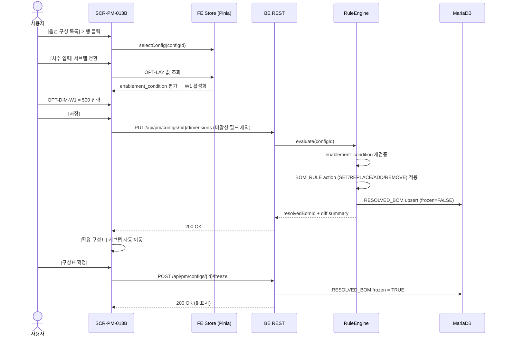
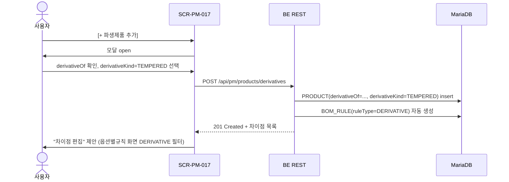
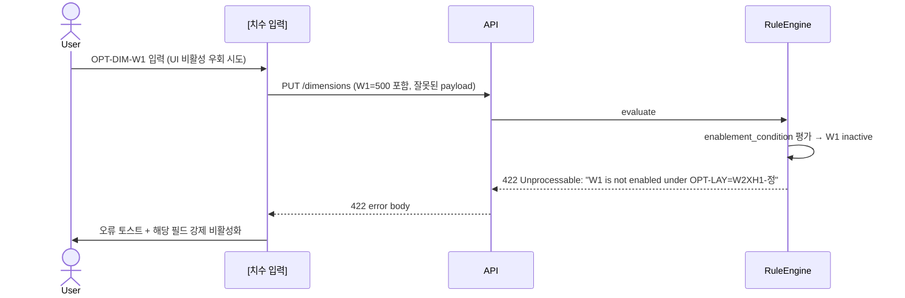

# DE22-1 화면 설계서 — Phase 1 (제품관리 + 공통) v1.5

**문서코드:** DE22-1
**버전:** v1.5
**작성일:** 2026-04-15
**작성자:** 이미희, 김나현 (UI/UX, 코드크래프트)
**검토자:** 김지광 (PM, 코드크래프트)
**Phase:** Phase 1 (S2~S5)
**상태:** 초안 (Gate 1 대비)

> [!abstract] v1.5 개정 요약
> - 용어사전 v1.3에서 확정된 세 축(NUMERIC 옵션, `enablement_condition` 조건부 활성화, BOM_RULE action 동사 4종)을 FE 화면에 반영.
> - 신규 서브탭: **옵션 구성 > [치수 입력]** (NUMERIC, §9.3.5)
> - 신규 화면: **SCR-PM-017 파생제품 등록/조회** (§8.4)
> - 개정 화면: SCR-PM-010 제품 목록 (4계층 필터 트리), SCR-PM-011 제품 등록 (modelCode 세그먼트 입력), SCR-PM-013B 옵션 구성 4개 서브탭 → **5개 서브탭** 확장, 옵션별규칙 편집기 action 카드 UI, 확정 구성표 컬럼 확장(supplyDivision/cutDirection/cutLength/cutLength2/cutQty/actualCutLength/frozen).
> - 본 문서는 **증분 개정본**으로, §1~§11 중 본 문서에 재기술하지 않은 섹션은 [[DE22-1_화면설계서_Phase1_v1.4]]를 기준으로 한다.

---

## 변경 이력

| 버전 | 일자 | 작성자 | 변경 내용 |
|------|------|--------|----------|
| v1.0 | 2026.04.08 | 이미희 | 초안 — Phase 1 화면 설계 (PM 15 + CM 7) |
| v1.1 | 2026.04.08 | 이미희 | 검증 반영 — 22건 보완 (PM 17 + CM 7) |
| v1.2 | 2026.04.08 | 이미희 | 탭별 상세 기획 보강 + 크로스체크 12건 반영 |
| v1.3 | 2026.04.08 | 이미희 | BOM 핵심 영역 상세 설계 (EBOM/MBOM/구성형 BOM 4개 서브탭) |
| v1.4 | 2026.04.15 | 김지광 | SOT 3종 크로스 검증 반영 (엔드포인트·신용어 병기·camelCase·상태 3단계) |
| **v1.5** | **2026-04-15** | **김지광** | **용어사전 v1.3 반영: ① NUMERIC 옵션(OPT-DIM-W/H/W1~H3) 입력 서브탭 신설 ② enablement_condition 조건부 활성화 UX ③ BOM_RULE action 동사 4종(SET/REPLACE/ADD/REMOVE) 카드 편집기 ④ 제품 분류 4계층 필터 트리(SCR-PM-010) ⑤ modelCode 세그먼트 입력(SCR-PM-011) ⑥ 확정 구성표 컬럼 확장(supplyDivision/cutDirection/cutLength/cutLength2/cutQty/actualCutLength/frozen 🔒) ⑦ 파생제품 등록 화면 신설(SCR-PM-017) ⑧ 금지어(산식구분) 전면 제거** |

---

## 1. 본 개정판 범위

> [!tip] v1.4 대비 변경 섹션
> - §4 화면 목록 — **SCR-PM-017 파생제품 등록/조회** 추가 (PM 18개 + CM 7개 = 총 25개 화면)
> - §8.1 SCR-PM-010 — 4계층 필터 트리 + `productClassPath` 브레드크럼 추가
> - §8.2 SCR-PM-011 — `modelCode` 세그먼트 드롭다운 입력 UX
> - §8.4 SCR-PM-017 (신규) — 파생제품 등록
> - §9.3 SCR-PM-013B — 4개 서브탭 → **5개 서브탭**으로 확장 ([치수 입력] 추가), 옵션별규칙 action 카드 UI, 확정 구성표 컬럼 확장
> - §12 (신규) — 화면 전환 시퀀스 다이어그램 3종
> - §13 (신규) — UI 신규 용어 레이블 매핑표

v1.4의 §1~§7, §8.3, §9.0~§9.2, §10~§11 섹션은 변경 없이 유효하다. 본 문서에 **재기술된 섹션만** 대체 적용한다.

---

## 2. 참조 문서 보강 (§1.3)

| 문서코드 | 문서명 | 용도 |
|---------|--------|------|
| [[WIMS_용어사전_BOM_v1.3\|용어사전 v1.3]] | BOM 도메인 용어사전 | NUMERIC 옵션·enablement_condition·action 동사·itemCategory·파생제품 기준 |
| [[V3_기존설계문서_영향도]] | v1.3 검증 — 설계문서 영향도 | DE22-1 개정 대상 식별 |
| [[V4_비즈니스규칙_수용성]] | v1.3 검증 — BR5 3편창 W1 조건부 활성화 | 조건부 활성화 UX 근거 |
| [[DE35-1_미서기이중창_표준BOM구조_정의서_v1.4]] | 표준 BOM 구조 정의서 | 파생제품(§16) · supplyDivision |

---

## 3. §4 화면 목록 (Phase 1 갱신판)

| 서브시스템 | 화면 ID | 화면명 | v1.5 변경 |
|-----------|--------|--------|-----------|
| PM | SCR-PM-010 | 제품 목록 | 4계층 필터 트리 |
| PM | SCR-PM-011 | 제품 등록 | modelCode 세그먼트 UX |
| PM | SCR-PM-012 | 제품 상세 | (변경 없음) |
| PM | SCR-PM-013 | BOM 트리뷰 | (변경 없음) |
| PM | SCR-PM-013B | 옵션 구성 / 확정 구성표 | 서브탭 4→5개, action 카드 UI, 컬럼 확장 |
| PM | SCR-PM-014 | BOM 버전 관리 | (변경 없음) |
| PM | **SCR-PM-017** | **파생제품 등록/조회 (신규)** | 신규 |
| CM | SCR-CM-001~007 | 공통 화면 | (변경 없음) |

총 화면 수: **PM 18개 + CM 7개 = 25개** (v1.4: 24개).

---

## 4. §8.1 SCR-PM-010 제품 목록 (개정)

### 4.1 4계층 분류 필터 트리

용어사전 v1.3 §9 기준, 제품 분류 L1(형식) → L2(등급) → L3(유리타입) → L4(치수크기) 4계층을 좌측 필터 트리로 제공.

```
┌─ 좌측 필터 패널 ────────────────────────────────────────────┐
│ 제품 분류 (4계층)                              [전체 해제]  │
│ ▼ ☑ L1: 형식                                                │
│    ☑ 미서기(SLIDING)                                        │
│    ☐ 커튼월(CURTAIN-WALL)                                   │
│ ▼ ☑ L2: 등급                                                │
│    ☑ 마스(MAS)       ☐ 우수(USU)                           │
│ ▼ ☑ L3: 유리타입                                            │
│    ☑ 복층(D-GLZ)     ☐ 삼중(T-GLZ)                         │
│ ▼ ☐ L4: 치수크기(프리셋)                                   │
│    ☐ 1500×1200       ☐ 2000×2400                           │
│                                                             │
│ ─────                                                       │
│ 상태 [전체▼]  재질 [전체▼]                                  │
└─────────────────────────────────────────────────────────────┘
```

### 4.2 productClassPath 브레드크럼

제품 목록 상단 breadcrumb 옆에 필터 적용 상태를 path 로 표시:

```
현재 필터: SLIDING > MAS > D-GLZ  (3개 기준 / 24개 제품)
```

- `productClassPath` 는 용어사전 v1.3 §9 파생 필드이며, 값은 UI 상 한글 레이블로 치환 표시(예: "미서기 > 마스 > 복층").

### 4.3 목록 테이블 컬럼 보강

| 컬럼 | 소스 | 비고 |
|-----|------|------|
| 제품코드 (modelCode) | PRODUCT.modelCode | 예: `DHS-AE225-D-1` |
| 제품명 | PRODUCT.productName | |
| 분류 경로 | productClassPath 파생 | 브레드크럼 형태 |
| **파생 여부** | derivativeOf != null | 뱃지 "파생" |
| BOM 상태 | standardBom.state | DRAFT/RELEASED/DEPRECATED |

---

## 5. §8.2 SCR-PM-011 제품 등록 (개정) — modelCode 세그먼트 UX

용어사전 v1.3 §15의 modelCode 파싱 규칙에 따라 **세그먼트별 드롭다운**으로 입력.

```
┌─ 제품 코드 생성 (세그먼트 입력) ──────────────────────────┐
│                                                            │
│  브랜드  │ 시리즈      │ 유리타입 │ 리비전                 │
│ [DHS ▼] │ [AE225 ▼]   │ [D ▼]    │ [-1 ▼]                │
│                                                            │
│  → 생성 미리보기:  DHS-AE225-D-1                          │
│  → productClassPath: 미서기 > 마스 > 복층                 │
│                                                            │
│  [ℹ 세그먼트 규칙: 브랜드(3)-시리즈(5)-유리타입(1)-리비전]  │
└────────────────────────────────────────────────────────────┘
```

> [!warning] 세그먼트 검증
> - 각 세그먼트 값은 `CODE_CATALOG` (SCR-CM-006 코드 관리)에서 정의된 값만 선택 가능.
> - 중복 modelCode 는 실시간 API (`GET /api/pm/products/exists?modelCode=...`)로 검증.

---

## 6. §8.4 SCR-PM-017 파생제품 등록/조회 (신규)

| 항목 | 내용 |
|------|------|
| 화면 ID | SCR-PM-017 |
| 화면명 | 파생제품 등록/조회 |
| 경로 | /products/:productCode/derivatives |
| 관련 요구사항 | FR-PM-018 (신규 — v1.3 §16) |
| 진입 경로 | SCR-PM-012 > [파생제품] 탭 |
| 권한 | 조회: ROLE_USER / 편집: ROLE_PRODUCT_EDITOR |

### 6.1 레이아웃

```
┌────────────────────────────────────────────────────────────┐
│ Breadcrumb: 제품관리 > DHS-AE225-D-1 > 파생제품            │
├────────────────────────────────────────────────────────────┤
│  기본제품: DHS-AE225-D-1 (미서기/마스/복층)  [기본제품 변경]│
├────────────────────────────────────────────────────────────┤
│ [+ 파생제품 추가]                                          │
│ 파생코드            │ 파생 종류       │ 차이점 Rule 수 │상태│
│ DHS-AE225-D-1-1MM   │ 1MM            │ 2개          │RELEASED│
│ DHS-AE225-D-1-CTH   │ CAP_TO_HIDDEN  │ 3개          │DRAFT  │
│ DHS-AE225-D-1-TEMP  │ TEMPERED        │ 1개          │DRAFT  │
│ DHS-AE225-D-1-F43   │ FIRE_43MM       │ 5개          │DRAFT  │
└────────────────────────────────────────────────────────────┘
```

### 6.2 [+ 파생제품 추가] 모달

```
┌─ 파생제품 등록 ──────────────────────────────────────────┐
│                                                           │
│ derivativeOf*   [DHS-AE225-D-1 (기본제품, 잠금)]         │
│                                                           │
│ derivativeKind* ( ) 1MM (두께 1mm 치환)                   │
│                 ( ) CAP_TO_HIDDEN (커버캡 → 감춤형)       │
│                 ( ) TEMPERED (강화유리)                   │
│                 ( ) FIRE_43MM (방화 43mm)                 │
│                                                           │
│ 파생 modelCode  [DHS-AE225-D-1-TEMP____] (자동 제안)     │
│                                                           │
│ ┌─ 기본제품 BOM 상속 미리보기 ──────────────────────────┐│
│ │ ✓ EBOM 항목 47개 자동 상속                            ││
│ │ ✓ MBOM 항목 53개 자동 상속                            ││
│ │                                                        ││
│ │ 차이점 (DERIVATIVE 타입 BOM_RULE): 자동 생성 예정     ││
│ │  · TEMPERED → GLS-OUT-P1 REPLACE GLS-OUT-P1-T        ││
│ │  · TEMPERED → GLS-IN-P1 REPLACE GLS-IN-P1-T          ││
│ │                                                        ││
│ │ [차이점 편집…] (→ 옵션별규칙 화면 DERIVATIVE 필터)    ││
│ └────────────────────────────────────────────────────────┘│
│                                       [취소] [등록]       │
└───────────────────────────────────────────────────────────┘
```

---

## 7. §9.3 SCR-PM-013B 옵션 구성 / 확정 구성표 (전면 개정)

v1.4의 4개 서브탭을 **5개 서브탭**으로 확장. 기존 서브탭명은 유지하고 [치수 입력]을 추가.

```
[옵션 구성 목록] [치수 입력] [옵션 그룹 관리] [옵션별 규칙 관리] [확정 구성표]
       1             2(신규)         3                  4                 5
```

### 7.1 §9.3.1 옵션 구성 목록 서브탭

> v1.4 §9.3.1 유지. 단, 목록 컬럼에 다음을 추가:
> - **치수 요약** (예: `W=1500, H=1200` 또는 `W1=500, W2=1000, H=1200`) — OPT-DIM 그룹 값의 요약.
> - **enablement 경고** 뱃지 — 사용자가 선택한 OPT-LAY 와 충돌하는 DIM 값이 남아있을 경우 ⚠ 표시.

### 7.2 §9.3.2 [치수 입력] 서브탭 (신규 — NUMERIC 옵션)

용어사전 v1.3 §11.1 `OPT-DIM` 그룹 전용. ENUM 드롭다운이 아닌 **숫자 입력 + 단위 + 범위 검증 + 조건부 활성화**.

```
┌─────────────────────────────────────────────────────────────────┐
│ [옵션 구성 목록] [치수 입력] [옵션 그룹 관리] [옵션별 규칙] ...  │
├─────────────────────────────────────────────────────────────────┤
│ 대상 옵션 구성: CFG-003 (3편창/일반/AL/브라운)                  │
│ 표준 치수 프리셋: [선택 ▼] (225 이중창 기본 1500×1200 / …)     │
├─────────────────────────────────────────────────────────────────┤
│                                                                 │
│ ┌─ 전체 치수 (필수) ───────────────────────────────────────┐  │
│ │ OPT-DIM-W   폭 (mm)*   [ 1500 ]   범위: 600 ~ 4000        │  │
│ │ OPT-DIM-H   높이 (mm)* [ 1200 ]   범위: 600 ~ 3000        │  │
│ └──────────────────────────────────────────────────────────┘  │
│                                                                 │
│ ┌─ 편창 분할 치수 (OPT-LAY 에 따라 조건부 활성화) ─────────┐  │
│ │                                                            │  │
│ │ ✓ 현재 OPT-LAY = 'W1XH1-3편'  → W1 활성화                 │  │
│ │                                                            │  │
│ │ OPT-DIM-W1  1편 폭 (mm)  [ 500  ]   범위: 300 ~ 1500      │  │
│ │ OPT-DIM-H1  1단 높이 (mm)[ 1200 ]   범위: 400 ~ 2000      │  │
│ │                                                            │  │
│ │ OPT-DIM-H2  2단 높이 (mm)[ (비활성) ] 🚫                  │  │
│ │   ⓘ OPT-LAY 가 'W1XH2-…' 일 때만 활성화됩니다.            │  │
│ │                                                            │  │
│ │ OPT-DIM-H3  3단 높이 (mm)[ (비활성) ] 🚫                  │  │
│ │   ⓘ OPT-LAY 가 'W1XH3-…' 일 때만 활성화됩니다.            │  │
│ └──────────────────────────────────────────────────────────┘  │
│                                                                 │
│ ⚠ 비활성 필드는 저장 시 전송되지 않습니다. 서버 RuleEngine 에서 │
│   enablement_condition 재검증을 수행합니다. (FE-only 신뢰 금지) │
│                                                                 │
│                                    [초기화]  [치수 검증]  [저장]│
└─────────────────────────────────────────────────────────────────┘
```

> [!warning] enablement_condition UX 규칙 (v1.3 §11.2)
> - **비활성 필드:** HTML `disabled` + 읽기전용 회색. 키보드 포커스 금지, submit payload 에서 해당 key 제외.
> - **툴팁:** 호버 시 활성화 조건 텍스트를 고정 노출 (예: "OPT-LAY = 'W1XH1-3편' 일 때만 입력 가능").
> - **사용자에 노출 안 함:** `enablement_condition` 이라는 내부 용어는 UI 에 노출하지 않는다. 사용자에게는 "활성화 조건" 이라는 자연어로 설명.
> - **BE 재검증:** FE 가 값을 제외해 전송해도, BE RuleEngine 이 `OPTION_VALUE.enablement_condition` 을 재평가한다. 불일치 시 422 에러.

**표준 치수 프리셋 예시 (드롭다운):**

| 프리셋 ID | 제품계열 | W | H | W1 | H1 | H2 | H3 |
|----------|---------|---|---|----|----|----|----|
| PRESET-AE225-D-STD | 225 이중창 표준 | 1500 | 1200 | — | — | — | — |
| PRESET-AE225-D-LRG | 225 이중창 대형 | 2400 | 2400 | — | — | — | — |
| PRESET-AE225-3W-STD | 225 3편창 표준 | 2100 | 1200 | 700 | — | — | — |

### 7.3 §9.3.3 옵션 그룹 관리 서브탭 (개정)

v1.4 §9.3.2 대비 주요 변경:
- `valueType` 컬럼 추가 (`ENUM` | `NUMERIC`)
- NUMERIC 그룹(OPT-DIM-*)은 선택지(Option Value) 대신 **numeric_min / numeric_max / unit** 을 관리.
- `enablement_condition` 식 편집기 (코드 에디터 형식, syntax highlighting `OPT-LAY = 'W1XH1-*'` 같은 DSL)

```
┌─ OPT-DIM-W1 옵션 그룹 상세 ──────────────────────────────┐
│ 그룹 코드:   OPT-DIM-W1                                   │
│ 그룹명:      1편 폭                                        │
│ valueType:  [NUMERIC ▼]                                   │
│ 단위 (unit): [mm ▼]                                        │
│ numeric_min: [ 300 ]    numeric_max: [ 1500 ]             │
│                                                            │
│ enablement_condition (활성화 조건 식):                    │
│ ┌────────────────────────────────────────────────────────┐│
│ │ OPT-LAY IN ('W1XH1-3편', 'W1XH2-3편', 'W1XH3-3편')    ││
│ └────────────────────────────────────────────────────────┘│
│ [조건 문법 도움말]                                         │
└────────────────────────────────────────────────────────────┘
```

### 7.4 §9.3.4 옵션별 규칙 관리 서브탭 — action 카드 UI (전면 개정)

v1.3 §13.2 확정된 **동사 4종**: `SET` / `REPLACE` / `ADD` / `REMOVE`. 각 verb 에 따라 폼이 다르게 렌더.

```
┌─ 규칙: BR5-3편창-W1활성 ──────────────────────────────────┐
│ 조건식: OPT-LAY = 'W1XH1-3편'                              │
│ 우선순위: [ 2 ]   BOM 유형: [ MBOM ▼ ]                     │
│ 규칙 유형: [OPTION ▼] (OPTION / DERIVATIVE)                │
├────────────────────────────────────────────────────────────┤
│ 액션 목록 (카드 배열)                   [+ 액션 추가 ▼]    │
│                                                            │
│ ┌─ 액션 #1 [SET] ──────────────────────────────── [✎][✕]┐│
│ │ target: MBOM.node[itemCode=FRM-MUL-W1]                ││
│ │ field:  cutLength                                      ││
│ │ value:  [ IIF(OPT-LAY='W1XH1-3편', OPT-DIM-W1, 0)  ] ││
│ │         [변수 자동완성: W H W1 H1 H2 H3]  [IIF 삽입]   ││
│ └────────────────────────────────────────────────────────┘│
│                                                            │
│ ┌─ 액션 #2 [REPLACE] ────────────────────────────── [✕]─┐│
│ │ target:  MBOM.node[itemCode=GLS-OUT-P1]               ││
│ │ from:    [GLS-OUT-P1      ▼]                          ││
│ │ to:      [GLS-OUT-P1-LOWE ▼]                          ││
│ └────────────────────────────────────────────────────────┘│
│                                                            │
│ ┌─ 액션 #3 [ADD] ──────────────────────────────── [✕]──┐│
│ │ item: {                                                ││
│ │   itemCode:  [CPL-MUL-001 ▼]                          ││
│ │   itemName:  연결 멀리언                                ││
│ │   quantity:  [ 2 ]   unit: [ EA ▼]                    ││
│ │   cutLength: [  ]    (조건부 입력)                    ││
│ │ }                                                      ││
│ └────────────────────────────────────────────────────────┘│
│                                                            │
│ ┌─ 액션 #4 [REMOVE] ─────────────────────────────── [✕]┐│
│ │ target: MBOM.node[itemCode=FRM-RGT-001]               ││
│ └────────────────────────────────────────────────────────┘│
│                                                            │
│                                     [취소] [저장]          │
└────────────────────────────────────────────────────────────┘
```

**verb 별 필드 스키마**

| verb | 필수 입력 | 비고 |
|------|----------|------|
| `SET` | target (선택자), field (속성명), value (리터럴 또는 산식) | `UNIQUE_V1` 변수(W/H/W1/H1/H2/H3)와 `IIF(...)` 템플릿 버튼 제공 |
| `REPLACE` | target (선택자), from (itemCode), to (itemCode) | from/to 드롭다운은 ITEM 마스터에서 조회 |
| `ADD` | item 구성 객체 (itemCode, itemName, quantity, unit, cutLength 등) | 서브 폼 |
| `REMOVE` | target (MBOM 선택자) | |

> [!tip] 산식 에디터 — 변수 자동완성
> - 키워드: `W`, `H`, `W1`, `H1`, `H2`, `H3` (OPT-DIM-* 값)
> - 함수: `IIF(condition, ifTrue, ifFalse)`, `MIN`, `MAX`, `ROUND`
> - 실시간 문법 검증. 참조하는 OPT-DIM 이 현재 규칙의 조건식에서 활성 상태가 아니면 경고 뱃지 표시.

### 7.5 §9.3.5 확정 구성표 (Resolved BOM) 서브탭 — 컬럼 확장

v1.3 §3 신규 속성을 모두 반영.

```
┌─────────────────────────────────────────────────────────────────────┐
│ 구성: CFG-003 (3편창/일반/AL/브라운 · W1=500·H=1200)                │
│ 상태: RELEASED │ frozen: ✅ │ 적용 규칙: 7개 │ 총 품목: 62개          │
│ [공급 구분 ▼] [전체 / 공통 / 외창 / 내창]                            │
├─────────────────────────────────────────────────────────────────────┤
│ 🔒│자재분류    │품목코드        │공급  │절단방향│절단길이 │2차길이│개수│실절단│
│───┼───────────┼───────────────┼─────┼───────┼────────┼──────┼───┼─────│
│ 🔒│[PROFILE]  │FRM-TOP-001    │공통 │  W ↔  │ 1500   │  —   │ 2 │1560│
│ 🔒│[PROFILE]  │FRM-MUL-W1     │공통 │  H ↕  │ 1200   │  —   │ 2 │1248│
│ 🔒│[GLASS]    │GLS-OUT-P1     │외창 │  —    │  485   │ 1185 │ 2 │  — │
│ 🔒│[HARDWARE] │HDW-LCK-001    │공통 │  —    │   —    │  —   │ 2 │  — │
│   │[CONSUMABLE]│MAT-SIL-001    │공통 │  —    │   —    │  —   │ - │  - │
├─────────────────────────────────────────────────────────────────────┤
│ 범례: 🔒 = frozen=TRUE (편집 불가)                                    │
│ 절단길이 = cutLength(evaluated snapshot)                             │
│ 실절단  = actualCutLength = cutLength × (1 + lossRate)               │
│ 2차길이 = cutLength2 (GLASS 카테고리만 표시)                          │
├─────────────────────────────────────────────────────────────────────┤
│ [소요량 요약] [Base BOM 비교] [PDF 내보내기] [MES 전달]              │
└─────────────────────────────────────────────────────────────────────┘
```

**컬럼 매핑 (용어사전 v1.3 §3)**

| UI 레이블 | 필드 | 소스 | 표시 규칙 |
|----------|------|------|----------|
| 🔒 | frozen | RESOLVED_BOM_ITEM.frozen | TRUE 시 아이콘, 편집 비활성 |
| 자재분류 | itemCategory | ITEM.item_category | 뱃지 색상: PROFILE/GLASS/HARDWARE/CONSUMABLE/SEALANT/SCREEN |
| 공급 | supplyDivision | RESOLVED_BOM_ITEM.supply_division | 탭/필터: 공통/외창/내창 |
| 절단 방향 | cutDirection | RESOLVED_BOM_ITEM.cut_direction | W(↔) / H(↕) 아이콘 |
| 절단 길이 | cutLength (evaluated) | RESOLVED_BOM_ITEM.cut_length_evaluated | mm, snapshot. PROFILE/GLASS 만 |
| 2차 길이 | cutLength2 | RESOLVED_BOM_ITEM.cut_length_formula_2_evaluated | GLASS 카테고리만 표시 |
| 개수 | cutQty | RESOLVED_BOM_ITEM.cut_qty_evaluated | 절단 개수 |
| 실절단 | actualCutLength | 파생: cutLength × (1 + lossRate) | lossRate §3.1 |

> [!warning] frozen 불변성
> 확정 구성표가 `frozen=TRUE`로 저장되면 화면의 모든 행은 편집 불가(🔒). 값을 변경하려면 새 옵션 구성(Config)을 생성해야 한다.

---

## 8. §12 화면 전환 시퀀스 (신규)

### 8.1 옵션 구성 → RuleEngine → 확정 구성표 (정상 흐름)



### 8.2 파생제품 등록 플로우



### 8.3 enablement_condition 위배 시 오류 처리



---

## 9. §13 UI 용어 레이블 매핑 (신규)

v1.3 신규 용어 및 기존 메모리 `project_ui_terminology` 정합.

| 내부 용어 (영문) | UI 한글 레이블 | 노출 위치 |
|-----------------|---------------|----------|
| EBOM | 자재 구성 | 탭, 드롭다운 |
| MBOM | 공정 구성 | 탭, 드롭다운 |
| Config | 옵션 구성 | 탭, 서브탭 |
| BOM Rule | 옵션별 규칙 | 서브탭 |
| Resolved BOM | 확정 구성표 | 서브탭 |
| supplyDivision | 공급 구분 | 컬럼/필터 |
| cutDirection | 절단 방향 | 컬럼 |
| cutLength / cutLengthEvaluated | 절단 길이 | 컬럼 |
| cutLength2 | 2차 길이 | 컬럼 (GLASS 전용) |
| cutQty | 개수 | 컬럼 |
| actualCutLength | 실절단 길이 | 컬럼 |
| itemCategory | 자재 분류 | 뱃지 |
| derivativeOf | 기본 제품 | 폼 라벨 |
| derivativeKind | 파생 종류 | 폼 라벨 |
| frozen | 잠금 (🔒) | 아이콘 |
| enablement_condition | *(사용자 노출 금지)* | — 내부 DSL. 사용자에게는 "활성화 조건" 자연어로만 설명 |
| modelCode | 제품 코드 | 컬럼, 폼 |
| productClassPath | 분류 경로 | 브레드크럼 |

### 9.1 금지어 점검 (v1.3 §7)

- `산식구분` → 본 v1.5 문서 내 **0건** (전면 제거 완료). 이전 v1.4 에서 지적된 용어는 `supplyDivision (공급 구분)` 으로 통일.
- `resolved-bom-id` 하이픈 표기, `Resolved MBOM ID`, `BOM 행 유형` 등 v1.3 §7 금지어 **0건**.

---

## 10. §14 Gate 1 수용 기준 (신규)

| 항목 | 기준 | 상태 |
|------|------|------|
| NUMERIC 옵션 입력 UX | OPT-DIM-W/H/W1/H1/H2/H3 6개 입력 필드 정의 | ✅ §7.2 |
| enablement_condition 조건부 활성화 | FE 비활성화 + BE 재검증 이중 방어 | ✅ §7.2 `[!warning]` |
| BOM_RULE action 동사 4종 UI | SET / REPLACE / ADD / REMOVE 카드 렌더 | ✅ §7.4 |
| 제품 분류 4계층 필터 | L1~L4 트리 + productClassPath 브레드크럼 | ✅ §4 |
| modelCode 세그먼트 입력 | 브랜드-시리즈-유리타입-리비전 4 드롭다운 | ✅ §5 |
| 확정 구성표 신규 컬럼 | supplyDivision/cutDirection/cutLength(2)/cutQty/actualCutLength/frozen 🔒 | ✅ §7.5 |
| 파생제품 등록 화면 | SCR-PM-017 신규 + derivativeKind 4종 | ✅ §6 |
| UI 용어 매핑 | 신규 용어 17개 한글 레이블 확정 | ✅ §9 |
| 와이어프레임·시퀀스 Mermaid ≥ 3 | 3종 (옵션→RE→확정, 파생, 오류) | ✅ §8 |
| 금지어 제거 | 산식구분 등 0건 | ✅ §9.1 |

---

## 11. 후속 작업

1. **S3 스프린트:** SCR-PM-017 파생제품 화면 Figma 프로토타입 (담당: 이미희)
2. **BE 협의:** RuleEngine 의 `enablement_condition` DSL 공식 파서 사양 확정 (DE13-1 설계와 통합)
3. **MES 연동 재협의:** 확정 구성표 신규 컬럼(supplyDivision/cutDirection/cutLength2)의 MES REST 응답 스키마 반영 — DE24-1 v1.8 예정
4. **테스트:** BR5 (3편창 W1 조건부 활성화) E2E 시나리오를 CO52-1 테스트 계획서에 추가

---

## 승인

| 역할 | 이름 | 일자 | 서명 |
|------|------|------|------|
| 작성 | 이미희 | 2026-04-15 | |
| 검토 (PM) | 김지광 | 2026-04-15 | |
| 승인 (사업관리) | — | — | |
