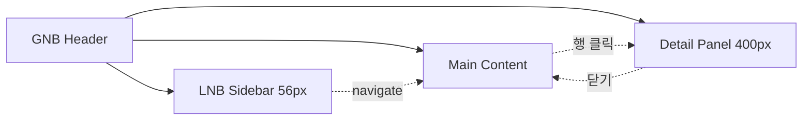

# 공통 원칙·레이아웃

> [!abstract]
> 디자인 시스템·인터랙션 규칙·반응형 브레이크포인트·GNB/LNB/공통 컴포넌트 등 Phase 1 전 화면이 공유하는 기반을 정의한다. 개별 화면 명세는 다른 섹션 파일에 분산.
> v1.6 개정 (2026-04-22): LNB 상세 스펙, 글로벌 검색·알림 카탈로그, a11y 원칙, Command Palette·HierarchyFilter·EmptyState 공통 컴포넌트 신설.

## 1. 개요

### 1.1 적용 범위

| 구분 | 내용 |
|------|------|
| Phase 1 (본 문서) | 자재·거래처·공정·제품·BOM·프로젝트·공통(CM) |
| Phase 2 (별도) | ES / OM / MF / FS |

### 1.2 참조 문서

| 문서코드 | 문서명 | 용도 |
|---------|--------|------|
| [[AN12-1_요구사항정의서_Phase1_v1.1\|AN12-1-P1]] | 요구사항 정의서 Phase 1 | 화면별 기능 요구사항 |
| [[AN12-1_요구사항목록_v1.5\|AN12-1]] | 요구사항 목록 (사이트맵) | 현행/To-Be 매핑 |
| [[AN21-1_제품관리_PM_업무흐름도_v1.0\|AN21-1]] | 업무흐름도 | To-Be 흐름 |
| [[DE11-1_소프트웨어_아키텍처_설계서_v1.2\|DE11-1]] | 아키텍처 설계서 | 기술 스택·레이어 |
| [[WIMS_용어사전_BOM_v1.4]] | BOM 도메인 용어사전 v1.4 | NUMERIC·enablement_condition·action 동사 기준 |
| [[DE35-1_미서기이중창_표준BOM구조_정의서_v1.5\|DE35-1]] | 표준 BOM 구조 정의서 | BOM 용어·상태·버전 기준 |
| [[DE24-1_인터페이스설계서_v2.0\|DE24-1]] | MES REST API 설계서 | MES 연동 API 경로·필드 |

### 1.3 디자인 시스템 기본 원칙

| 항목 | 규격 |
|------|------|
| 기본 폰트 | Pretendard (본문), Pretendard Mono (코드/수치) |
| 글꼴 크기 | 14px 본문 / 12px 캡션 / 16px 소제목 / 20px 페이지 제목 |
| Primary | #1F4E79 |
| Accent | #2E75B6 |
| Success / Warning / Error | #2E7D32 / #E65100 / #C62828 |
| 최소 해상도 | 1280×720 (태블릿 768px 이상, FR-CM-006) |
| 권장 해상도 | 1920×1080 (데스크톱 FHD 기준) |
| 그리드 | 12컬럼, 거터 16px |
| 간격 단위 | 4px 배수 (4/8/12/16/24/32/48) |
| 테이블 행 | 40px (compact) / 48px (default) |
| 버튼 | 32(s) / 36(m) / 40(l) px |
| 다크모드 | Phase 2 에서 제공 (v1.6 노트: 컬러 토큰 설계 시 light/dark 이중 스키마 고려) |

> [!note]
> 폰트 크기는 한국어 B2B 도구 기준으로 적합하여 v1.5 규격을 그대로 유지. 장시간 데이터 입력 환경을 고려하여 본문 14px 이상 보장.

## 2. 화면 설계 원칙

### 2.1 공통 인터랙션 규칙

| 규칙 | 설명 | 요구사항 |
|------|------|---------|
| 목록→상세 진입 | 행 클릭 시 상세 화면(새 탭 또는 우측 패널) | FR-CM-003 |
| 다중 창 지원 | 메인 + 우측 상세 패널(리사이즈) | FR-CM-003 |
| 인라인 편집 | 단순 필드 인라인, 복잡 필드 모달/상세 | — |
| 삭제 확인 | 확인 다이얼로그 필수 | — |
| 폼 유효성 | 필수 누락 시 실시간 오류(필드 하단 빨간 텍스트) | — |
| 토스트 알림 | 저장/삭제/오류 시 우측 상단 3초 | — |
| 로딩 상태 | 조회 시 스켈레톤, 저장 시 버튼 스피너 | — |
| 키보드 단축키 | Ctrl+S 저장, Esc 모달 닫기, Tab 이동, Cmd/Ctrl+K 글로벌 검색 | — |
| 세션 만료 알림 | 토큰 만료 15분 전 [연장]/[로그아웃] 모달 | FR-CM-001 |
| 자동 저장 | 폼 편집 중 30초 간격 자동 저장, 세션 만료 시 복원 | FR-CM-005 |
| 접근성(a11y) | WCAG 2.1 AA 준수, 키보드 Tab 순서 지정, ARIA label/role 필수, focus ring 가시화, 색 대비 4.5:1 이상 | §4 참조 |
| 오류 복구 | 422 검증오류 시 필드 포커싱 + 메시지 요약 박스, 500 오류 시 재시도 버튼 + 에러 코드 표시 | — |
| 빈 상태(Empty State) | 검색 결과 없음·데이터 없음 시 일러스트+안내 문구+주요 액션 버튼 (`EmptyState` 컴포넌트) | — |
| 파일 첨부 보안 | 확장자 allowlist (dwg/dxf/pdf/xlsx/docx/jpg/png), 파일당 50MB, 서버 MIME 재검증 | FR-CM-005 |
| 대량 데이터 | 1,000건 초과 목록은 가상 스크롤(virtualized list) 적용 | — |

> **FR-CM-005 오류 반영:** 브라우저 뒤로가기 시 Vue Router 히스토리로 상태 유지. 파일 업로드 용량 제한 미안내 → SCR-PM-016 파일관리 탭에 허용 형식/용량 안내 문구 표시.

### 2.2 반응형 브레이크포인트

| BP | 범위 | 레이아웃 |
|----|------|---------|
| Desktop | ≥1280px | 사이드바 + 메인 + 상세패널 (3단) |
| Tablet Landscape | 1024~1279px | 사이드바 접힘 + 메인 + 상세 (2단) |
| Tablet Portrait | 768~1023px | 사이드바 숨김 + 메인 단일, 상세 전체화면 |
| Mobile | 320~767px | Phase 1 미지원 (FS 는 Phase 2 Android 네이티브), 웹은 태블릿 세로 최소 |

## 3. 공통 레이아웃

> **설계 결정 (FR-CM-003):** 다중 창은 전용 화면이 아닌, 메인 콘텐츠 + 우측 상세 패널(리사이즈) 구조로 전역 구현. 모든 목록→상세 화면에서 동일 적용.

### 3.1 전체 레이아웃

```
┌──────────────────────────────────────────────────────────┐
│ [Header] GNB — 로고, 메뉴, ⌘K 검색, 알림벨, 사용자 메뉴   │
├────────┬─────────────────────────┬───────────────────────┤
│ [LNB]  │ [Main Content]          │ [Detail Panel]        │
│ 56px   │ flex: 1                 │ 기본 400px, 320~600   │
├────────┴─────────────────────────┴───────────────────────┤
│ [Footer] 버전·저작권                                       │
└──────────────────────────────────────────────────────────┘
```

### 3.2 GNB

| 영역 | 내용 |
|------|------|
| 좌측 | WIMS 로고 + 시스템명 |
| 중앙 | 프로젝트 · 자재관리 · 제품관리 · **공정관리** · 거래처관리 · 시스템관리 (Phase 1, 6개 메뉴) |
| 우측 | **⌘K 글로벌 검색** · 알림벨(NotificationBell) · 사용자 아바타+이름 · 로그아웃 |

> **v1.6 변경:** 공정관리를 별도 GNB 로 분리 (기존 5개 → 6개). 우측에 Command Palette(⌘K) 글로벌 검색 상시 노출.
> **Phase 2 추가:** 견적설계·발주관리·제조관리 (GNB 또는 프로젝트 상세 내 탭).

### 3.3 LNB 상세 스펙

GNB 진입 시 좌측 서브메뉴를 아이콘+텍스트로 표시. **접힘 56px / 펼침 200px.** 각 GNB 별 LNB 트리 구조는 아래와 같다.

| GNB | LNB 서브메뉴 | 대응 화면 |
|-----|------------|----------|
| 프로젝트 | 프로젝트 목록 / 내 프로젝트 / 관심 / 종료 | SCR-PM-015 (탭) |
| 자재관리 | 자재 목록 / 자재 등록 | SCR-PM-001/002 |
| 제품관리 | 제품 목록 / 제품 등록 / 파생제품 / BOM 트리뷰 / 옵션구성 / 옵션별규칙 (템플릿 갤러리·결정표·시뮬레이터·버전 관리) | SCR-PM-010~023 |
| 공정관리 | 공정 관리 | SCR-PM-007 |
| 거래처관리 | 거래처 관리 | SCR-PM-004 |
| 시스템관리 | 사용자 관리 / 그룹 관리 / 코드 관리 / 시스템 설정 | SCR-CM-003/005/006/007 |

> [!info]
> BOM·옵션별규칙은 제품 상세 진입이 주 경로이므로 LNB 는 **바로가기 수준**으로 표시. 실제 편집은 제품 상세의 각 탭(자재구성·공정구성·옵션구성·옵션별규칙)에서 수행한다.

### 3.4 공통 컴포넌트

| 컴포넌트 | 설명 | 사용 |
|---------|------|------|
| DataTable | 페이징/정렬/필터/컬럼 리사이즈 | 모든 목록 |
| SearchBar | 키워드 + 필터 토글 | 모든 목록 |
| FormField | 라벨+입력+유효성 메시지 | 모든 폼 |
| Modal | 확인/취소·폼 모달 | 삭제 확인 등 |
| TreeView | 계층 구조 트리 (접기/펼치기·드래그&드롭) | BOM 트리뷰 |
| TabBar | 탭 전환 | 상세 화면 |
| Breadcrumb | 위치 경로 | 모든 화면 |
| Toast | 알림 (성공/경고/오류) | 전역 |
| **HierarchyFilter** | 4계층 분류 필터 트리 (L1 형식 → L2 등급 → L3 유리타입 → L4 치수크기) | 제품 목록·자재 목록·파생제품 목록 공통 |
| **CommandPalette (⌘K)** | 제품코드·자재코드·프로젝트번호 즉시 점프. 단축키 Cmd/Ctrl+K | 전역 (GNB 우측) |
| **NotificationBell** | GNB 우측 벨 아이콘. 미읽음 카운트 배지. 클릭 시 드롭다운 목록(최근 10건) + [모두 보기] → /notifications | 전역 (GNB 우측) |
| **EmptyState** | 빈 목록·검색 결과 없음·에러 상태 공용 일러스트 컴포넌트 | 모든 목록·검색 결과 |

### 3.5 레이아웃 다이어그램



### 3.6 글로벌 검색 범위

⌘K Command Palette 가 검색하는 대상을 아래 표에 명시한다.

| 대상 | 필드 | 점프 목적지 |
|------|------|-----------|
| 제품 | productCode, productName, modelCode | SCR-PM-012 |
| 자재 | itemCode, itemName | SCR-PM-003 |
| 프로젝트 | projectNo, projectName, siteAddress | SCR-PM-016 |
| 거래처 | partnerName, bizRegNo | SCR-PM-004 (상세패널 자동 오픈) |
| 공정 | processCode, processName | SCR-PM-007 |
| 파생제품 | derivativeCode, derivativeName | SCR-PM-017 |

**동작 규칙**

- 키워드 타이핑 시 **디바운스 300ms** 후 서버 검색
- 카테고리별 **그룹화 표시** (최대 5건/카테고리)
- 키보드: ↑↓ 이동, Enter 선택, Esc 닫기

### 3.7 알림 이벤트 카탈로그

`NotificationBell` 이 수신하는 이벤트 목록.

| 이벤트 | 대상자 | 트리거 | 점프 |
|-------|-------|--------|------|
| BOM 승격 대기 | 제품 오너 | RELEASED 요청 | SCR-PM-014 |
| BOM 승격 완료 | 요청자·오너 | RELEASED 처리 | SCR-PM-013 |
| 파생제품 승인 요청 | 관리자 | 파생 등록 | SCR-PM-017 |
| 거래처 단가 변경 | 단가 구독자 | 단가 이력 등록 | SCR-PM-006 |
| 시스템 공지 | 전체 | 관리자 공지 | /notifications |
| 세션 만료 예정 | 본인 | 만료 15분 전 | 세션 연장 모달 |

> [!info]
> Phase 2 에서 이메일·Slack 연동은 별도 채널로 확장한다. Phase 1 은 인앱 드롭다운 + /notifications 목록 페이지만 제공.

## 4. 접근성·국제화 원칙

### 4.1 a11y 원칙 (WCAG 2.1 AA)

- [ ] 모든 인터랙티브 요소 **키보드 접근 가능** (Tab 순서, Enter/Space 활성화)
- [ ] **포커스 시각적 표시** (2px outline, accent 컬러)
- [ ] 스크린리더용 **ARIA label 필수** (SR-only 텍스트로 아이콘 버튼·상태 안내)
- [ ] **색상 단독 정보 전달 금지** (아이콘·텍스트 병행 — 예: 오류를 빨간색만으로 표시하지 않음)
- [ ] **명도 대비 4.5:1** (본문) / **3:1** (대형 텍스트, 18px 이상 또는 14px bold)
- [ ] **자동 이동 콘텐츠 일시정지 가능** (캐러셀·자동 갱신 대시보드 등)

### 4.2 국제화 (i18n)

- Phase 1 은 **한국어 단일**. 다국어 대응은 Phase 2 로 이연 (참조: [[WIMS_용어사전_BOM_v1.4]] §개방이슈)
- UI 문자열은 **i18n key 로 추출 권장** (하드코딩 지양, 추후 locale 파일 전환 대비)
- 숫자·일자·통화 포맷은 `Intl` API 경유로 통일

## 5. 변경이력

| 버전 | 일자 | 내용 |
|------|------|------|
| v1.5 | 2026-04-16 | 분산 구조 재구성 (섹션 파일 분리) |
| v1.6 | 2026-04-22 | LNB 상세, 글로벌 검색, 알림 카탈로그, a11y 원칙, Command Palette, HierarchyFilter, EmptyState 공통 컴포넌트 추가. GNB 에 공정관리 분리. |

## 관련 문서

- [[DE22-1_화면설계서_v1.6]] (메인 인덱스)
- [[DE22-1_화면설계서/sections/07_공통CM]] — 로그인·권한·코드 관리
- [[DE22-1_화면설계서/sections/01_자재관리]] — 자재 마스터
- [[WIMS_용어사전_BOM_v1.4]]
