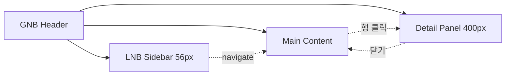

# 공통 원칙·레이아웃

> [!abstract]
> 디자인 시스템·인터랙션 규칙·반응형 브레이크포인트·GNB/LNB/공통 컴포넌트 등 Phase 1 전 화면이 공유하는 기반을 정의한다. 개별 화면 명세는 다른 섹션 파일에 분산.

## 1. 개요

### 1.1 적용 범위

| 구분 | 내용 |
|------|------|
| Phase 1 (본 문서) | 자재·거래처·공정·제품·BOM·프로젝트·공통(CM) |
| Phase 2 (별도) | ES / OM / MF / FS |

### 1.2 참조 문서

| 문서코드 | 문서명 | 용도 |
|---------|--------|------|
| [[AN12-1_요구사항정의서_Phase1_v1.1\|AN12-1-P1]] | 요구사항 정의서 Phase 1 | 화면별 기능 요구사항 |
| [[AN12-1_요구사항목록_v1.5\|AN12-1]] | 요구사항 목록 (사이트맵) | 현행/To-Be 매핑 |
| [[AN21-1_제품관리_PM_업무흐름도_v1.0\|AN21-1]] | 업무흐름도 | To-Be 흐름 |
| [[DE11-1_소프트웨어_아키텍처_설계서_v1.2\|DE11-1]] | 아키텍처 설계서 | 기술 스택·레이어 |
| [[WIMS_용어사전_BOM_v1.3]] | BOM 도메인 용어사전 v1.3 | NUMERIC·enablement_condition·action 동사 기준 |
| [[DE35-1_미서기이중창_표준BOM구조_정의서_v1.5\|DE35-1]] | 표준 BOM 구조 정의서 | BOM 용어·상태·버전 기준 |
| [[DE24-1_인터페이스설계서_MES_REST_API_v1.8\|DE24-1]] | MES REST API 설계서 | MES 연동 API 경로·필드 |

### 1.3 디자인 시스템 기본 원칙

| 항목 | 규격 |
|------|------|
| 기본 폰트 | Pretendard (본문), Pretendard Mono (코드/수치) |
| 글꼴 크기 | 14px 본문 / 12px 캡션 / 16px 소제목 / 20px 페이지 제목 |
| Primary | #1F4E79 |
| Accent | #2E75B6 |
| Success / Warning / Error | #2E7D32 / #E65100 / #C62828 |
| 최소 해상도 | 1280×720 (태블릿 768px 이상, FR-CM-006) |
| 그리드 | 12컬럼, 거터 16px |
| 간격 단위 | 4px 배수 (4/8/12/16/24/32/48) |
| 테이블 행 | 40px (compact) / 48px (default) |
| 버튼 | 32(s) / 36(m) / 40(l) px |

## 2. 화면 설계 원칙

### 2.1 공통 인터랙션 규칙

| 규칙 | 설명 | 요구사항 |
|------|------|---------|
| 목록→상세 진입 | 행 클릭 시 상세 화면(새 탭 또는 우측 패널) | FR-CM-003 |
| 다중 창 지원 | 메인 + 우측 상세 패널(리사이즈) | FR-CM-003 |
| 인라인 편집 | 단순 필드 인라인, 복잡 필드 모달/상세 | — |
| 삭제 확인 | 확인 다이얼로그 필수 | — |
| 폼 유효성 | 필수 누락 시 실시간 오류(필드 하단 빨간 텍스트) | — |
| 토스트 알림 | 저장/삭제/오류 시 우측 상단 3초 | — |
| 로딩 상태 | 조회 시 스켈레톤, 저장 시 버튼 스피너 | — |
| 키보드 단축키 | Ctrl+S 저장, Esc 모달 닫기, Tab 이동 | — |
| 세션 만료 알림 | 토큰 만료 15분 전 [연장]/[로그아웃] 모달 | FR-CM-001 |
| 자동 저장 | 폼 편집 중 30초 간격 자동 저장, 세션 만료 시 복원 | FR-CM-005 |

> **FR-CM-005 오류 반영:** 브라우저 뒤로가기 시 Vue Router 히스토리로 상태 유지. 파일 업로드 용량 제한 미안내 → SCR-PM-016 파일관리 탭에 허용 형식/용량 안내 문구 표시.

### 2.2 반응형 브레이크포인트

| BP | 범위 | 레이아웃 |
|----|------|---------|
| Desktop | ≥1280px | 사이드바 + 메인 + 상세패널 (3단) |
| Tablet Landscape | 1024~1279px | 사이드바 접힘 + 메인 + 상세 (2단) |
| Tablet Portrait | 768~1023px | 사이드바 숨김 + 메인 단일, 상세 전체화면 |

## 3. 공통 레이아웃

> **설계 결정 (FR-CM-003):** 다중 창은 전용 화면이 아닌, 메인 콘텐츠 + 우측 상세 패널(리사이즈) 구조로 전역 구현. 모든 목록→상세 화면에서 동일 적용.

### 3.1 전체 레이아웃

```
┌──────────────────────────────────────────────────────────┐
│ [Header] GNB — 로고, 메뉴, 검색, 알림, 사용자 메뉴        │
├────────┬─────────────────────────┬───────────────────────┤
│ [LNB]  │ [Main Content]          │ [Detail Panel]        │
│ 56px   │ flex: 1                 │ 기본 400px, 320~600   │
├────────┴─────────────────────────┴───────────────────────┤
│ [Footer] 버전·저작권                                       │
└──────────────────────────────────────────────────────────┘
```

### 3.2 GNB

| 영역 | 내용 |
|------|------|
| 좌측 | WIMS 로고 + 시스템명 |
| 중앙 | 프로젝트 · 자재관리 · 제품관리 · 거래처관리 · 시스템관리 (Phase 1) |
| 우측 | 글로벌 검색 · 알림 · 사용자 아바타+이름 · 로그아웃 |

> **Phase 2 추가:** 견적설계·발주관리·제조관리 (GNB 또는 프로젝트 상세 내 탭).

### 3.3 LNB

GNB 진입 시 좌측 서브메뉴를 아이콘+텍스트로 표시. 접힘 56px / 펼침 200px.

### 3.4 공통 컴포넌트

| 컴포넌트 | 설명 | 사용 |
|---------|------|------|
| DataTable | 페이징/정렬/필터/컬럼 리사이즈 | 모든 목록 |
| SearchBar | 키워드 + 필터 토글 | 모든 목록 |
| FormField | 라벨+입력+유효성 메시지 | 모든 폼 |
| Modal | 확인/취소·폼 모달 | 삭제 확인 등 |
| TreeView | 계층 구조 트리 (접기/펼치기·드래그&드롭) | BOM 트리뷰 |
| TabBar | 탭 전환 | 상세 화면 |
| Breadcrumb | 위치 경로 | 모든 화면 |
| Toast | 알림 (성공/경고/오류) | 전역 |

### 3.5 레이아웃 다이어그램



## 관련 문서

- [[DE22-1_화면설계서_v1.5]] (메인 인덱스)
- [[DE22-1_화면설계서/sections/07_공통CM]] — 로그인·권한·코드 관리
- [[DE22-1_화면설계서/sections/01_자재관리]] — 자재 마스터
- [[WIMS_용어사전_BOM_v1.3]]
