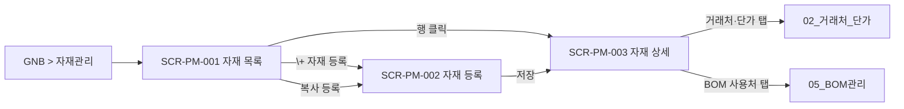

# 자재관리

> [!abstract]
> 포함 화면: **SCR-PM-001** 자재 목록, **SCR-PM-002** 자재 등록, **SCR-PM-003** 자재 상세/수정. 원자재/부자재 구분 CRUD, 복사 등록, BOM 사용처 조회(자재구성(EBOM)/공정구성(MBOM) 참조처).
>
> **v1.6 개정:** 공통 GNB 에서 공정관리 독립 메뉴로 승격(→ [[DE22-1_화면설계서/sections/00_공통_원칙_레이아웃|00 공통 §3.2]]), 헤더 ⌘K 글로벌 검색·🔔 알림벨 공통 적용([[DE22-1_화면설계서/sections/00_공통_원칙_레이아웃|00 공통 §3.6·§3.7]]), SCR-PM-003 [공급사] 탭에서 [[DE22-1_화면설계서/sections/04_제품관리#SCR-PM-020 자재↔공급사 매핑|SCR-PM-020 자재↔공급사 매핑]] 인라인 진입 확정.

## 화면 목록

| 화면 ID | 화면명 | 경로 | 관련 요구사항 |
|---------|--------|------|-------------|
| SCR-PM-001 | 자재 목록 | /materials | FR-PM-001,002,004,005 |
| SCR-PM-002 | 자재 등록 | /materials/new | FR-PM-001,002,004,005 |
| SCR-PM-003 | 자재 상세/수정 | /materials/:itemCode | FR-PM-001,002,003,004 |

> [!note]
> SCR-PM-005 결번: 02_거래처_단가 §SCR-PM-004 우측 상세 패널로 통폐합됨. 레거시 URL `/partners/:id/detail` 은 §00 §3.x 결번 redirect 규칙에 따라 301 → `/partners/:id` 로 전달.

## 화면 흐름



## 화면 상세

### SCR-PM-001 자재 목록

| 항목 | 내용 |
|------|------|
| 경로 | /materials |
| 요구사항 | FR-PM-001, FR-PM-002, FR-PM-004, FR-PM-005 |
| 진입 | **GNB > 자재관리** / **헤더 ⌘K 글로벌 검색**(v1.6) |
| 권한 | ROLE_PM_VIEWER 이상 |

**레이아웃**

```
┌──────────────────────────────────────────────────────────┐
│ GNB: 프로젝트│자재관리│제품관리│공정관리│거래처관리│시스템관리 │
│      우상단: [⌘K 검색] [🔔 3] [김진호 ▼]  ← v1.6 공통 헤더 │
├──────────────────────────────────────────────────────────┤
│ Breadcrumb: 자재관리 > 자재 목록                          │
├──────────────────────────────────────────────────────────┤
│ [원자재] [부자재]  ← 탭                                   │
│ 🔍 [자재코드/자재명 검색]  [검색] [필터▼]                  │
│ [+ 자재 등록] [복사 등록] [Excel 다운로드]                 │
├──────────────────────────────────────────────────────────┤
│ ☐ │ 자재코드▲ │ 자재명 │ 규격     │ 단위 │ 수정일        │
│ ☐ │ R-01-..  │ 상틀.. │ W×60×70 │ EA  │ 04.05         │
│ ☐ │ R-02-..  │ 로이.. │ 5+12A+5 │ EA  │ 04.03         │
├──────────────────────────────────────────────────────────┤
│ ◀ 1 2 3 ... 8 ▶        20개/페이지 ▼                     │
└──────────────────────────────────────────────────────────┘
```

> [!info] v1.6 공통 헤더·GNB 개정
> - **GNB 공정관리 독립 메뉴 승격**: v1.5 까지 제품관리 하위였던 공정관리가 GNB 최상위로 분리됨 (→ [[DE22-1_화면설계서/sections/03_공정관리|03 공정관리]]). 자재관리 메뉴는 변경 없음.
> - **⌘K 글로벌 검색**: 자재코드·자재명·규격 매칭 자재를 전역에서 즉시 점프 (→ [[DE22-1_화면설계서/sections/00_공통_원칙_레이아웃|00 공통 §3.6]]).
> - **🔔 알림벨**: 자재 삭제 차단·단가 변경 등 알림 이벤트 집계 (→ [[DE22-1_화면설계서/sections/00_공통_원칙_레이아웃|00 공통 §3.7]]).

**기능 상세**

| 기능 | 설명 |
|------|------|
| 탭 전환 | 원자재/부자재 |
| 검색 | 자재코드·자재명 키워드 (Enter/버튼) |
| 필터 | 단위·등록일 범위·규격 (토글 패널) |
| 자재 등록 | SCR-PM-002 이동 |
| 복사 등록 | 선택 자재 기반 프리필 등록 (FR-PM-005) |
| 행 클릭 | SCR-PM-003 이동 |
| 정렬 | 컬럼 헤더 클릭 오름/내림 |
| 페이징 | 기본 20, 50/100 선택 |
| Excel | 현재 필터 기준 xlsx 다운로드 |

---

### SCR-PM-002 자재 등록

| 항목 | 내용 |
|------|------|
| 경로 | /materials/new |
| 요구사항 | FR-PM-001, 002, 004, 005 |
| 진입 | SCR-PM-001 > [+ 자재 등록] 또는 [복사 등록] |
| 권한 | ROLE_PM_EDITOR 이상 |

**레이아웃**

```
┌──────────────────────────────────────────────────────────┐
│ Breadcrumb: 자재관리 > 자재 목록 > 자재 등록              │
├──────────────────────────────────────────────────────────┤
│ 자재 유형: (●) 원자재  ( ) 부자재                         │
│                                                          │
│ ┌─ 기본 정보 ────────────────────────────────────┐      │
│ │ 자재 코드*  [R-01-____] [중복확인] (실시간 검증)│      │
│ │ 자재명*     [_______________________________]  │      │
│ │ 규격*       [_______________________________]  │      │
│ │ 단위*       [EA ▼]                              │      │
│ └────────────────────────────────────────────────┘      │
│                                                          │
│ ┌─ 부자재 전용 (자재 유형=부자재 시) ────────────┐      │
│ │ 용도*  용량 단위*  사양  보관 방법              │      │
│ └────────────────────────────────────────────────┘      │
│                                                          │
│ ┌─ 추가 정보 ────────────────────────────────────┐      │
│ │ 비고  이미지 (파일 선택 + 미리보기)             │      │
│ └────────────────────────────────────────────────┘      │
│                                                          │
│ ℹ 거래처·구매 단가는 등록 후 [거래처 관리]에서 별도      │
│   등록합니다. (FR-PM-003)                                │
│                                                          │
│                             [취소]  [저장]               │
└──────────────────────────────────────────────────────────┘
```

**유효성 검증**

| 필드 | 규칙 |
|------|------|
| 자재 코드 | 필수, 최대 20자, 영문+숫자+하이픈, 시스템 전역 유일 |
| 자재명 | 필수, 최대 100자 |
| 규격 | 필수, 최대 200자 |
| 단위 | 필수, 드롭다운 (m, EA, kg, SET 등) |
| 용도/용량 단위 | 부자재 선택 시 필수 |

**복사 등록 모드**

- SCR-PM-001에서 기존 자재 선택 → [복사 등록] 시 자재 코드만 비우고 나머지 프리필.
- 거래처·단가는 분리 관리이므로 복사 제외. 등록 후 [거래처·단가] 탭에서 별도 연결.

> [!info] 자재 코드 중복 차단 실시간 피드백 (v1.7 보강, FR-PM-004)
> itemCode 입력 필드:
> - **debounce 300ms** 후 `GET /api/pm/materials?code={code}&exists=true` 호출
> - **결과 표시** (인라인, input 옆):
>   - ✅ "사용 가능" (초록)
>   - ❌ "이미 등록됨 — ASY-FRM-001 (자재 상세)" (빨강, 링크 클릭 시 기존 자재 상세로 이동)
>   - ⏳ 검증 중 (회색 스피너)
> - **패턴 힌트 툴팁**: `R-{카테고리}-{일련번호}` 형식 예시 · `itemCategory` 별 prefix 가이드
> - **제출 시 서버 재검증**: 409 시 RFC 7807 `title`: "Duplicate itemCode" 표시
> - **FR-CM-005-05 현행 오류** (중복 등록 유일성 미검증) 정면 대응

---

### SCR-PM-003 자재 상세/수정

| 항목 | 내용 |
|------|------|
| 경로 | /materials/:itemCode |
| 요구사항 | FR-PM-001, 002, 003, 004 |
| 진입 | SCR-PM-001 > 행 클릭 |
| 권한 | 조회 ROLE_PM_VIEWER / 수정 ROLE_PM_EDITOR |

**레이아웃**

```
┌──────────────────────────────────────────────────────────┐
│ Breadcrumb: 자재관리 > 자재 목록 > R-01-00001             │
├──────────────────────────────────────────────────────────┤
│ [기본정보] [거래처·단가] [BOM 사용처] [공급사] [변경이력]  ← 탭    │
│  ([공급사] = v1.6 확정: SCR-PM-020 자재↔공급사 매핑 인라인 진입)    │
├──────────────────────────────────────────────────────────┤
│ === [기본정보] ===                                        │
│ 자재 코드 R-01-00001 (수정 불가)                          │
│ 자재 유형 원자재                                           │
│ 자재명*, 규격*, 단위*, 비고                                │
│ 등록자/등록일, 수정자/수정일 (읽기 전용)                   │
│                                                          │
│ === [거래처·단가] ===  (SCR-PM-006 인라인)                │
│ [+ 거래처 추가]                                           │
│ 거래처 │ 유효단가 │ 적용시작 │ 최종변경                    │
│ 🟢 가공소A │ 12,500 │ 04.01 │ 04.01  ← 유효 강조           │
│ ▼ 클릭 시 단가 이력 아코디언                               │
│ [+ 신규 단가 등록] 단가/적용시작일/변경사유                │
│                                                          │
│ === [BOM 사용처] ===                                      │
│ 이 자재를 참조하는 BOM                                     │
│ 제품코드 │ 제품명 │ BOM유형 │ 버전 │ 상태                 │
│ SLD-..  │ 미서기 │ 공정구성(MBOM) │ v3 │ RELEASED          │
│ → 행 클릭 → 제품 상세 [자재/공정구성] 탭                   │
│ ⚠ BOM 포함 자재는 삭제 불가 (삭제 버튼 비활성)            │
│                                                          │
│ === [변경이력] ===                                         │
│ 변경일시 │ 변경자 │ 필드 │ 변경 전 │ 변경 후               │
│ 페이징: 기본 최근 20건, 필터(날짜 범위·변경자)             │
│                                                          │
│                [삭제]  [취소]  [저장]                     │
└──────────────────────────────────────────────────────────┘
```

**기능 상세**

| 기능 | 설명 |
|------|------|
| 기본정보 | 자재 마스터 조회/수정 (자재 코드 수정 불가) |
| 거래처·단가 | 거래처 매핑 + 단가 이력 (SCR-PM-006 인라인) |
| BOM 사용처 | 이 자재를 참조하는 BOM 목록 (삭제 가능 판단 근거) |
| **공급사 (v1.6 확정)** | **자재↔공급사 매핑 요약 (priority·role·단가·리드타임) + [SCR-PM-020 이동] 버튼.** 전체 편집은 [[DE22-1_화면설계서/sections/04_제품관리#SCR-PM-020 자재↔공급사 매핑|SCR-PM-020]] 에서 수행 |
| 변경이력 | 마스터 필드 변경 이력 (변경자/일시/전/후) |
| 삭제 | BOM 미포함 시만 활성. 포함 시 비활성 + 툴팁 |

## 관련 문서

- [[DE22-1_화면설계서_v1.6]] (메인)
- [[DE22-1_화면설계서/sections/00_공통_원칙_레이아웃]] — GNB·⌘K·🔔 공통 헤더 원칙
- [[DE22-1_화면설계서/sections/02_거래처_단가]] — 거래처·단가 이력 심화
- [[DE22-1_화면설계서/sections/04_제품관리]] — SCR-PM-020 자재↔공급사 매핑
- [[DE22-1_화면설계서/sections/05_BOM관리]] — BOM 사용처 참조 대상
- [[WIMS_용어사전_BOM_v1.4]]

## 변경 이력

| 버전 | 일자 | 내용 |
|------|------|------|
| v1.5 | 2026-04-16 | 초안 (SCR-PM-001/002/003 3화면). SCR-PM-003 [공급사] 탭은 v1.6 예정으로 자리확보. |
| v1.6 | 2026-04-22 | 공통 GNB 공정관리 독립 메뉴 승격·헤더 ⌘K/🔔 공통 적용 반영. SCR-PM-003 [공급사] 탭 → SCR-PM-020 자재↔공급사 매핑 인라인 진입 확정. frontmatter v1.5→v1.6 동기화. |
