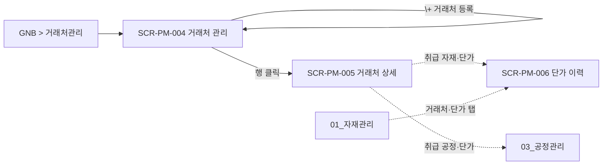

# 거래처·단가 관리

> [!abstract]
> 포함 화면: **SCR-PM-004** 거래처 관리, **SCR-PM-005** 거래처 상세, **SCR-PM-006** 자재-거래처 단가 이력. 자재·공정별 거래처 N:M 매핑, 단가 이력 감사 추적, 유효 단가 자동 판정.

## 화면 목록

| 화면 ID | 화면명 | 경로 | 관련 요구사항 |
|---------|--------|------|-------------|
| SCR-PM-004 | 거래처 관리 | /partners | FR-PM-003, FR-PM-009 |
| SCR-PM-005 | 거래처 상세 | /partners/:partnerId | FR-PM-003 |
| SCR-PM-006 | 자재-거래처 단가 이력 | /materials/:itemCode/prices | FR-PM-003 |

## 화면 흐름



## 화면 상세

### SCR-PM-004 거래처 관리

| 항목 | 내용 |
|------|------|
| 경로 | /partners |
| 요구사항 | FR-PM-003, FR-PM-009 |
| 진입 | GNB > 거래처관리 |
| 권한 | ROLE_USER 이상 |

**레이아웃**

```
┌──────────────────────────────────────────────────────────┐
│ Breadcrumb: 거래처관리 > 거래처 목록                      │
├──────────────────────────────────────────────────────────┤
│ 🔍 [거래처명/사업자번호 검색] [검색]                       │
│ [+ 거래처 등록]                                           │
├──────────────────────────────────────────────────────────┤
│ 거래처명 │ 사업자번호 │ 대표자 │ 유형 │ 자재 수             │
│ 가공소A │ 123-45-.. │ 홍길동 │ 가공/외주 │ 12             │
│ 유리공장B │ 234-56-.. │ 이순신 │ 자재공급 │ 8              │
└──────────────────────────────────────────────────────────┘
```

**기능 상세**

| 기능 | 설명 |
|------|------|
| 거래처 등록 | 거래처명·사업자번호·대표자·연락처·주소·유형(자재공급/가공/외주) |
| 행 클릭 | SCR-PM-005 이동 |
| 자재 수 | 해당 거래처 매핑 자재 건수 |

---

### SCR-PM-005 거래처 상세

| 항목 | 내용 |
|------|------|
| 경로 | /partners/:partnerId |
| 요구사항 | FR-PM-003 |
| 진입 | SCR-PM-004 > 행 클릭 |

**레이아웃**

```
┌──────────────────────────────────────────────────────────┐
│ Breadcrumb: 거래처관리 > 거래처 목록 > 가공소A             │
├──────────────────────────────────────────────────────────┤
│ [기본정보] [취급 자재·단가] [취급 공정·단가]  ← 탭         │
├──────────────────────────────────────────────────────────┤
│ === [기본정보] ===                                        │
│ 거래처명*, 사업자번호*, 대표자, 연락처, 주소, 유형*,        │
│ 이메일, 비고                                               │
│                                                          │
│ === [취급 자재·단가] ===                                  │
│ [+ 자재 추가]                                             │
│ 자재코드 │ 자재명 │ 단위 │ 유효단가 │ 변경일              │
│ → 행 클릭 시 단가 이력 아코디언 (최근 5건)                 │
│                                                          │
│ === [취급 공정·단가] ===                                  │
│ [+ 공정 추가]                                             │
│ 공정코드 │ 공정명 │ 규격범위 │ 단가 │ 적용시작 │ 적용종료   │
│ [+ 단가 등록]: 공정·규격범위·단가·적용시작일·변경사유      │
│                                                          │
│                [삭제]  [취소]  [저장]                     │
└──────────────────────────────────────────────────────────┘
```

---

### SCR-PM-006 자재-거래처 단가 이력

| 항목 | 내용 |
|------|------|
| 경로 | /materials/:itemCode/prices (또는 SCR-PM-003 [거래처·단가] 탭 인라인) |
| 요구사항 | FR-PM-003 |
| 진입 | SCR-PM-003 > [거래처·단가] 탭 |
| 권한 | 조회 ROLE_USER / 등록·수정 ROLE_PRICE_EDITOR |

**레이아웃**

```
┌──────────────────────────────────────────────────────────┐
│ 자재: R-01-00001 상틀 프로파일                            │
├──────────────────────────────────────────────────────────┤
│ 매핑된 거래처 목록                   [+ 거래처 추가]      │
│ 거래처 │ 유효단가 │ 적용시작 │ 최종변경                    │
│                                                          │
│ ▼ 가공소A 단가 이력 (펼침)                                │
│ 적용시작 │ 적용종료 │ 이전단가 │ 변경단가 │ 변경사유       │
│ 2026.04 │ (현재)   │ 11,000  │ 12,500  │ 원자재 인상     │
│                                                          │
│ [+ 신규 단가 등록]                                        │
│ 거래처: 가공소A / 신규 단가* / 적용시작일* / 변경사유      │
│                                                          │
│ > 적용종료일은 입력하지 않음. 기존 유효 단가의 종료일이   │
│ > 자동 설정되며 결과가 토스트로 알림.                      │
└──────────────────────────────────────────────────────────┘
```

**비즈니스 규칙**

| 규칙 | UI 반영 |
|------|---------|
| N:M 관계 | [+ 거래처 추가]로 복수 매핑 |
| 이력 삭제 불가 | 삭제 버튼 미제공 (감사 추적) |
| 적용시작일 중복 불가 | 동일 거래처에 동일 적용시작일 오류 |
| 유효 단가 강조 | 이력 테이블 배경 #E8F5E9 + 볼드 |
| 관리자만 이력 수정 | ROLE_ADMIN만 수정 가능 |

> **설계 결정:** FR-PM-003에서 적용종료일은 "선택 입력"이나 UX 간소화 위해 시스템 자동 설정으로 변경.

## 관련 문서

- [[DE22-1_화면설계서_v1.5]] (메인)
- [[DE22-1_화면설계서/sections/01_자재관리]] — 자재 마스터 원천
- [[DE22-1_화면설계서/sections/03_공정관리]] — 공정 단가
- [[WIMS_용어사전_BOM_v1.3]]
