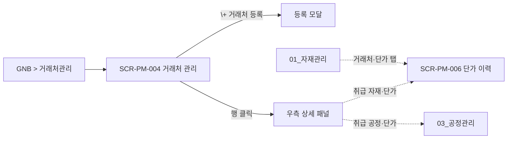

# 거래처·단가 관리

> [!abstract]
> 포함 화면: **SCR-PM-004** 거래처 관리 (목록 + 우측 상세 패널, v1.6 통폐합), **SCR-PM-006** 자재-거래처 단가 이력. 자재·공정별 거래처 N:M 매핑, 단가 이력 감사 추적, 유효 단가 자동 판정.

## 화면 목록

| 화면 ID | 화면명 | 경로 | 관련 요구사항 |
|---------|--------|------|-------------|
| SCR-PM-004 | 거래처 관리 | /partners (목록) · /partners/:partnerId (상세 패널 오픈) | FR-PM-003, FR-PM-009 |
| SCR-PM-006 | 자재-거래처 단가 이력 | /materials/:itemCode/prices | FR-PM-003 |

## 화면 흐름



## 화면 상세

### SCR-PM-004 거래처 관리

| 항목 | 내용 |
|------|------|
| 경로 | /partners (기본 목록) · /partners/:partnerId (상세 패널 오픈, 딥링크 지원) |
| 요구사항 | FR-PM-003, FR-PM-009 |
| 진입 | GNB > 거래처관리 |
| 권한 | 조회 ROLE_PM_VIEWER 이상 / 수정 ROLE_PM_EDITOR |

> [!note]
> v1.6 통폐합: 기존 SCR-PM-004(목록) + SCR-PM-005(상세)를 공통 §3.1 "Main + Detail Panel" 원칙(FR-CM-003)에 따라 단일 화면으로 병합. 좌측 2/3 목록, 우측 1/3 상세 패널.

**레이아웃**

```
┌─────────────────────────────────────────────────┬─────────────────────────────┐
│ Breadcrumb: 거래처관리 > 거래처 목록              │ 가공소A              [×닫기]│
├─────────────────────────────────────────────────┼─────────────────────────────┤
│ 🔍 [거래처명/사업자번호 검색] [검색]               │ [기본정보][취급 자재·단가]   │
│ [+ 거래처 등록]                                  │        [취급 공정·단가]     │
├─────────────────────────────────────────────────┼─────────────────────────────┤
│ 거래처명 │ 사업자번호 │ 대표자 │ 유형 │ 자재 수    │ === [기본정보] ===          │
│ 가공소A ●│ 123-45-.. │ 홍길동 │ 가공 │ 12       │ 거래처명*, 사업자번호*,     │
│ 유리공장B│ 234-56-.. │ 이순신 │ 공급 │ 8        │ 대표자, 연락처, 주소,       │
│                                                 │ 유형*, 이메일, 비고         │
│                                                 │                             │
│                                                 │ === [취급 자재·단가] ===    │
│                                                 │ [+ 자재 추가]               │
│                                                 │ 자재코드│자재명│단위        │
│                                                 │ │유효단가│변경일            │
│                                                 │ → 행 클릭 → 이력 아코디언    │
│                                                 │                             │
│                                                 │ === [취급 공정·단가] ===    │
│                                                 │ [+ 공정 추가] [+ 단가 등록] │
│                                                 │ 공정코드│공정명│규격범위    │
│                                                 │ │단가│적용시작│적용종료     │
│                                                 │                             │
│                                                 │      [삭제][취소][저장]     │
└─────────────────────────────────────────────────┴─────────────────────────────┘
  좌측 2/3 (목록)                                   우측 1/3 (400px, 320~600px)
```

**기능 상세**

| 기능 | 설명 |
|------|------|
| 검색 | 거래처명·사업자번호 부분일치 |
| 거래처 등록 | **모달** 방식 (별도 화면 아님). 필수: 거래처명·사업자번호·유형(자재공급/가공/외주). 선택: 대표자·연락처·주소·이메일·비고. 등록 완료 시 목록에 즉시 추가 + 상세 패널 자동 오픈 |
| 행 클릭 | 우측 상세 패널 오픈 + URL 업데이트 (/partners/:partnerId). 현재 선택 행은 좌측 배경 하이라이트 |
| 자재 수 컬럼 | 해당 거래처 매핑 자재 건수 (클릭 시 상세 패널 > [취급 자재·단가] 탭 포커스) |
| 상세 패널 헤더 | 거래처명 + [×닫기] 버튼. 닫기 시 URL /partners 로 되돌아가고 목록 단독 표시 |
| 상세 패널 리사이즈 | 드래그 핸들로 320~600px 조정, 사용자별 localStorage 저장 |
| [기본정보] 탭 | 거래처 기본 필드 편집. 저장 시 목록 해당 행 즉시 갱신 |
| [취급 자재·단가] 탭 | [+ 자재 추가] → 자재 검색 모달. 행 클릭 시 최근 5건 단가 이력 아코디언 펼침. 전체 이력은 SCR-PM-006 로 이동 |
| [취급 공정·단가] 탭 | [+ 공정 추가], [+ 단가 등록]: 공정·규격범위·단가·적용시작일·변경사유 |
| 딥링크 | /partners/:partnerId 로 직접 접근 시 목록 로드 + 해당 행 자동 선택 + 상세 패널 오픈 |
| 권한 제어 | ROLE_PM_EDITOR 미보유 시 [+ 거래처 등록]·편집·저장 버튼 비활성화, 조회만 가능 |

> [!note]
> v1.5 의 SCR-PM-005 거래처 상세는 v1.6 에서 SCR-PM-004 우측 상세 패널로 통합됨. SCR ID PM-005 결번 처리 (RTM 에서 supersedes 관계 기재). 레거시 URL `/partners/:id/detail` 은 §00 §3.x 결번 redirect 규칙에 따라 301 → `/partners/:id` 로 전달.

---

### SCR-PM-006 자재-거래처 단가 이력

| 항목 | 내용 |
|------|------|
| 경로 | /materials/:itemCode/prices (또는 SCR-PM-003 [거래처·단가] 탭 인라인) |
| 요구사항 | FR-PM-003 |
| 진입 | SCR-PM-003 > [거래처·단가] 탭 · SCR-PM-004 상세 패널 > [취급 자재·단가] > 행 > 전체 이력 · 글로벌 검색 ⌘K → 자재명 |
| 권한 | 조회 ROLE_PM_VIEWER / 등록·수정 ROLE_PM_EDITOR |

**레이아웃**

```
┌──────────────────────────────────────────────────────────┐
│ 자재: R-01-00001 상틀 프로파일                            │
├──────────────────────────────────────────────────────────┤
│ 매핑된 거래처 목록                   [+ 거래처 추가]      │
│ 거래처 │ 유효단가 │ 적용시작 │ 최종변경                    │
│                                                          │
│ ▼ 가공소A 단가 이력 (펼침)                                │
│ 적용시작 │ 적용종료 │ 이전단가 │ 변경단가 │ 변경사유       │
│ 2026.04 │ (현재)   │ 11,000  │ 12,500  │ 원자재 인상     │
│                                                          │
│ [+ 신규 단가 등록]                                        │
│ 거래처: 가공소A / 신규 단가* / 적용시작일* / 변경사유      │
│                                                          │
│ > 적용종료일은 입력하지 않음. 기존 유효 단가의 종료일이   │
│ > 자동 설정되며 결과가 토스트로 알림.                      │
└──────────────────────────────────────────────────────────┘
```

**비즈니스 규칙**

| 규칙 | UI 반영 |
|------|---------|
| N:M 관계 | [+ 거래처 추가]로 복수 매핑 |
| 이력 삭제 불가 | 삭제 버튼 미제공 (감사 추적) |
| 적용시작일 중복 불가 | 동일 거래처에 동일 적용시작일 오류 |
| 유효 단가 강조 | 이력 테이블 배경 #E8F5E9 + 볼드 |
| 관리자만 이력 수정 | ROLE_ADMIN만 수정 가능 |

> **설계 결정:** FR-PM-003에서 적용종료일은 "선택 입력"이나 UX 간소화 위해 시스템 자동 설정으로 변경.

> [!info] 소급 적용 차단 UX (v1.7 보강, FR-PM-003)
> 신규 단가 등록 폼:
> - **적용시작일** DatePicker `min={today}` (오늘 이전 선택 불가)
> - 하단 안내 배너: "⚠ 소급 적용 불가 — 적용시작일은 오늘 이후만 선택 가능 (FR-PM-003)"
> - 서버 검증 422 시: "소급 적용된 단가는 등록할 수 없습니다. 기존 단가 수정이 필요한 경우 [변경 요청] 워크플로우를 사용하세요" + CTA
> - **FR-CM-005-06** (단가 변경 후 기존 견적에 소급 적용) 오류 정면 대응
> - **단가 이력 타임라인**: 우측 패널 타임라인 뷰 · "이전 → 변경" 비교 · 두 버전 선택 후 diff 뷰

## 관련 문서

- [[DE22-1_화면설계서_v1.6]] (메인)
- [[DE22-1_화면설계서/sections/01_자재관리]] — 자재 마스터 원천
- [[DE22-1_화면설계서/sections/03_공정관리]] — 공정 단가
- [[WIMS_용어사전_BOM_v1.4]]

## 변경이력

| 버전 | 일자 | 내용 |
|------|------|------|
| v1.5 | 2026-04-16 | 초안 |
| v1.6 | 2026-04-22 | SCR-PM-005 → SCR-PM-004 통폐합 (목록+상세패널 단일화). 화면 수 3→2. |
