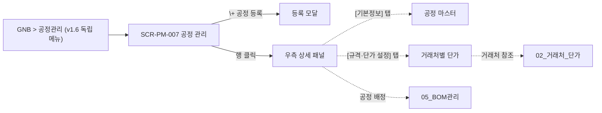

# 공정관리

> [!abstract]
> 포함 화면: **SCR-PM-007** 공정 관리 (목록 + 우측 상세 패널 [기본정보·규격/단가 2탭], v1.6 통폐합). 공정 마스터(processCode)·규격 범위·거래처별 단가 관리. GNB 에서 독립 메뉴로 진입.

## 화면 목록

| 화면 ID | 화면명 | 경로 | 관련 요구사항 |
|---------|--------|------|-------------|
| SCR-PM-007 | 공정 관리 | /processes (목록) · /processes/:processCode (상세 패널 오픈) | FR-PM-008, FR-PM-009 |

## 화면 흐름



## 화면 상세

### SCR-PM-007 공정 관리

| 항목 | 내용 |
|------|------|
| 경로 | /processes (기본) · /processes/:processCode (상세 딥링크) |
| 요구사항 | FR-PM-008, FR-PM-009 |
| 진입 | **GNB > 공정관리** (v1.6 독립 GNB) |
| 권한 | ROLE_PM_VIEWER 이상 / 수정 ROLE_PM_EDITOR |

**레이아웃 (목록 + 우측 상세 패널)**

```
┌─────────────────────────────────────────────┬──────────────────────────────────┐
│ Breadcrumb: 공정관리 > 공정 관리             │ 패널 헤더: PRC-CUT 절단   [×닫기] │
├─────────────────────────────────────────────┼──────────────────────────────────┤
│ 🔍 [공정코드/공정명 검색] [검색]              │ [기본정보] [규격·단가 설정]  ← 탭 │
│ [+ 공정 등록]                                ├──────────────────────────────────┤
├─────────────────────────────────────────────┤ === [기본정보] ===               │
│ 공정코드 │ 공정명 │ 분류 │ 예상시간 │ 상태   │ 공정 코드*  [PRC-CUT] (RO)       │
│ PRC-CUT │ 절단   │ 가공 │ 15초/개 │ 활성   │ 공정명*, 분류* (가공/도장/조립/   │
│ PRC-WLD │ 용접   │ 가공 │ 30초/개 │ 활성   │   기타), 설명                    │
│ PRC-ANO │ 양극산화│ 도장 │ -     │ 활성   │ 예상시간 (초/개)                 │
│ PRC-ASY │ 조립   │ 조립 │ 60초/SET│ 활성   │ 표준 작업 단가* (원/개)          │
│ ※ 행 클릭 → 우측 상세 패널 오픈             │ 보유 설비 [다중선택]              │
│   URL: /processes/:processCode 로 업데이트 │ 상태 [활성/비활성 ▼]              │
│                                             │                                  │
│                                             │ === [규격·단가 설정] ===         │
│                                             │ ┌─ 처리 규격 범위 ─────────────┐ │
│                                             │ │ 길이: [5]mm ~ [6,000]mm      │ │
│                                             │ │ 너비: [30]mm ~ [100]mm       │ │
│                                             │ └──────────────────────────────┘ │
│                                             │ ┌─ 거래처별 단가 ───────────────┐│
│                                             │ │ [+ 거래처 단가 추가]          ││
│                                             │ │ 거래처│규격범위│단가│시작│종료││
│                                             │ │ 가공소A│1000~2000│500│…│현재││
│                                             │ │ 가공소A│2000~3000│600│…│현재││
│                                             │ │ 가공소B│1000~2000│450│…│현재││
│                                             │ │ → 행 클릭 시 단가 이력 아코디언││
│                                             │ └──────────────────────────────┘│
│                                             │ ℹ 견적 시 자재 규격·수량에 따라  │
│                                             │   최저 단가 거래처 자동 추천      │
│                                             ├──────────────────────────────────┤
│                                             │        [삭제] [취소] [저장]      │
└─────────────────────────────────────────────┴──────────────────────────────────┘
```

**동작 규칙**

- **좌측 목록**: 검색 (공정코드/공정명) · [+ 공정 등록] 버튼 · 공정 목록 테이블
- **우측 상세 패널**: 탭 2개 구성
    - [기본정보] 탭: 공정 마스터 속성 (공정코드·공정명·분류·설명·예상시간·표준 단가·보유 설비·상태)
    - [규격·단가 설정] 탭: 처리 규격 범위 + 거래처별 단가 테이블 + 단가 이력 아코디언
- **패널 헤더**: 선택된 공정명 + [×닫기] 버튼
- **패널 하단**: [삭제] [취소] [저장] 버튼 공통 (탭 전환해도 유지)
- **[+ 공정 등록]** 클릭 → 등록 모달 오픈. 저장 시 목록에 새 행 추가 + 해당 공정 상세 패널 자동 오픈
- **행 클릭** → 우측 상세 패널 오픈 + URL 을 `/processes/:processCode` 로 업데이트 (딥링크 지원)
- **[×닫기]** → 패널 닫힘 + URL 을 `/processes` 로 복귀

> [!note]
> v1.5 의 SCR-PM-008 공정 등록/수정 및 SCR-PM-009 공정별 규격·단가 설정은 v1.6 에서 SCR-PM-007 우측 상세 패널의 두 탭으로 통합됨. SCR ID 008·009 결번 처리 (RTM supersedes 관계). 레거시 URL `/processes/new`·`/processes/:code/pricing` 은 §00 §3.x 규칙에 따라 301 → `/processes/:code#basic·#pricing`.

> [!info] 규격 범위 overlap 검증 (v1.7 보강)
> 규격 범위 편집:
> - 서버 검증 (제출 시): 동일 `process_code` 의 활성 규격 범위끼리 **overlap 차단**
>   - 허용: `[1000, 2000)` + `[2000, 3000)` (경계 인접)
>   - 차단: `[1000, 2000]` + `[1500, 2500]` (겹침) → 422 + "규격 범위가 공정 X 의 기존 범위와 겹칩니다"
> - **최저 단가 자동 추천** tie-break: 동률 시 (1) 최근 등록순 (2) 거래처 우선순위 (SCR-PM-004 거래처 `priority` 컬럼)
> - overlap 미리보기: 편집 중 실시간 그래프 (X축 규격·Y축 단가·선분으로 구간 표시)

## 관련 문서

- [[DE22-1_화면설계서_v1.6]] (메인)
- [[DE22-1_화면설계서/sections/02_거래처_단가]] — 거래처 마스터
- [[DE22-1_화면설계서/sections/05_BOM관리]] — 공정구성(MBOM) 공정 배정
- [[WIMS_용어사전_BOM_v1.4]]

## 변경이력

| 버전 | 일자 | 내용 |
|------|------|------|
| v1.5 | 2026-04-16 | 초안 (PM-007/008/009 3화면) |
| v1.6 | 2026-04-22 | PM-008/009 → PM-007 우측 상세 패널 2탭으로 통폐합. 화면 수 3→1. GNB 에서 공정관리 독립 메뉴로 승격. |
