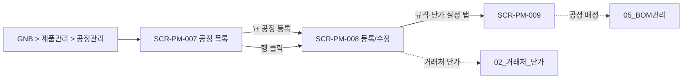

# 공정관리

> [!abstract]
> 포함 화면: **SCR-PM-007** 공정 목록, **SCR-PM-008** 공정 등록/수정, **SCR-PM-009** 공정별 규격·단가 설정. 공정 마스터(processCode)·규격 범위·거래처별 단가 관리.

## 화면 목록

| 화면 ID | 화면명 | 경로 | 관련 요구사항 |
|---------|--------|------|-------------|
| SCR-PM-007 | 공정 목록 | /processes | FR-PM-008 |
| SCR-PM-008 | 공정 등록/수정 | /processes/:processCode | FR-PM-008 |
| SCR-PM-009 | 공정별 규격·단가 설정 | /processes/:processCode/specs | FR-PM-009 |

## 화면 흐름



## 화면 상세

### SCR-PM-007 공정 목록

| 항목 | 내용 |
|------|------|
| 경로 | /processes |
| 요구사항 | FR-PM-008 |
| 진입 | GNB > 제품관리 > LNB 공정관리 |
| 권한 | ROLE_USER 이상 |

**레이아웃**

```
┌──────────────────────────────────────────────────────────┐
│ Breadcrumb: 제품관리 > 공정관리 > 공정 목록               │
├──────────────────────────────────────────────────────────┤
│ 🔍 [공정코드/공정명 검색] [검색]                           │
│ [+ 공정 등록]                                             │
├──────────────────────────────────────────────────────────┤
│ 공정코드 │ 공정명 │ 분류 │ 예상시간 │ 상태                 │
│ PRC-CUT │ 절단   │ 가공 │ 15초/개 │ 활성                 │
│ PRC-WLD │ 용접   │ 가공 │ 30초/개 │ 활성                 │
│ PRC-ANO │ 양극산화│ 도장 │ -      │ 활성                  │
│ PRC-ASY │ 조립   │ 조립 │ 60초/SET │ 활성                 │
└──────────────────────────────────────────────────────────┘
```

---

### SCR-PM-008 공정 등록/수정

| 항목 | 내용 |
|------|------|
| 경로 | /processes/:processCode |
| 요구사항 | FR-PM-008 |

**레이아웃**

```
┌──────────────────────────────────────────────────────────┐
│ Breadcrumb: 제품관리 > 공정관리 > PRC-CUT 절단             │
├──────────────────────────────────────────────────────────┤
│ [기본정보] [규격·단가 설정]   ← 탭                         │
├──────────────────────────────────────────────────────────┤
│ === [기본 정보] ===                                       │
│ 공정 코드*  [PRC-CUT] (수정 시 읽기전용)                   │
│ 공정명*, 분류* (가공/도장/조립/기타), 설명                  │
│ 예상시간 (초/개), 표준 작업 단가* (원/개)                  │
│ 보유 설비 [다중선택]  상태 [활성/비활성 ▼]                 │
│                                                          │
│ === [규격·단가 설정] ===                                   │
│ 처리 규격 범위: 길이 [5]~[6000]mm, 너비 [30]~[100]mm       │
│ 거래처별 단가 [+ 거래처 단가 추가]                         │
│ 거래처 │ 규격범위 │ 단가 │ 적용시작 │ 적용종료              │
│ → 행 클릭 시 단가 이력 아코디언                            │
│ ℹ 견적 시 최저 단가 거래처 자동 추천                       │
│                                                          │
│                [삭제]  [취소]  [저장]                     │
└──────────────────────────────────────────────────────────┘
```

---

### SCR-PM-009 공정별 규격·단가 설정

| 항목 | 내용 |
|------|------|
| 경로 | /processes/:processCode/specs |
| 요구사항 | FR-PM-009 |
| 진입 | SCR-PM-008 > [규격·단가 설정] 탭 |

> **설계 결정:** SCR-PM-008 [규격·단가 설정] 탭과 동일 컴포넌트 공유. 별도 URL 직접 접근 양방향 지원을 위해 별도 화면 ID 부여.

**레이아웃**

```
┌──────────────────────────────────────────────────────────┐
│ 공정: PRC-CUT 절단                                        │
├──────────────────────────────────────────────────────────┤
│ ┌─ 처리 규격 범위 ───────────────────────┐               │
│ │ 길이: 5mm ~ 6,000mm                    │               │
│ │ 너비: 30mm ~ 100mm                     │               │
│ │                    [규격 범위 수정]    │               │
│ └────────────────────────────────────────┘               │
│                                                          │
│ ┌─ 거래처별 단가 ────────────────────────┐               │
│ │ [+ 거래처 단가 추가]                    │               │
│ │ 거래처 │ 규격범위 │ 단가 │ 적용시작 │ 종료 │             │
│ │ 가공소A │ 1000~2000 │ 500 │ 2026.01 │ 현재 │           │
│ │ 가공소A │ 2000~3000 │ 600 │ 2026.01 │ 현재 │           │
│ │ 가공소B │ 1000~2000 │ 450 │ 2026.02 │ 현재 │           │
│ │ → 행 클릭 시 이력 아코디언 (전·후 단가, 사유)│          │
│ └────────────────────────────────────────┘               │
│                                                          │
│ ℹ 견적 작성 시 자재 규격·수량에 따라 최저 단가 자동 추천   │
│                                                          │
│                     [취소]  [저장]                        │
└──────────────────────────────────────────────────────────┘
```

## 관련 문서

- [[DE22-1_화면설계서_v1.5]] (메인)
- [[DE22-1_화면설계서/sections/02_거래처_단가]] — 거래처 마스터
- [[DE22-1_화면설계서/sections/05_BOM관리]] — 공정구성(MBOM) 공정 배정
- [[WIMS_용어사전_BOM_v1.3]]
