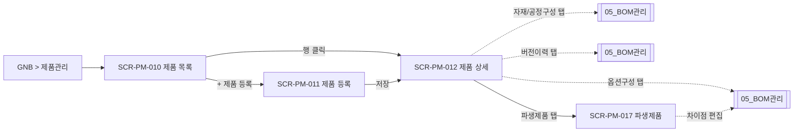
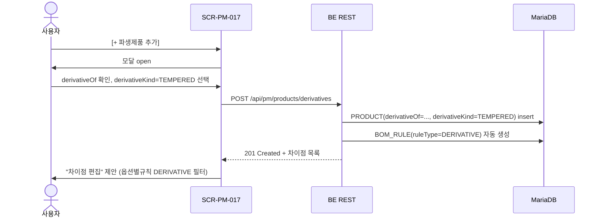
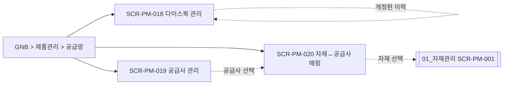

# 제품관리

> [!abstract]
> 포함 화면: **SCR-PM-010** 제품 목록, **SCR-PM-011** 제품 등록, **SCR-PM-012** 제품 상세, **SCR-PM-017** 파생제품 등록/조회, **SCR-PM-018** 다이스북 관리, **SCR-PM-019** 공급사 관리, **SCR-PM-020** 자재↔공급사 매핑 (v1.5-r1 신규 3건). v1.5에서 4계층 분류 필터 트리·modelCode 세그먼트 입력·파생제품 등록 화면 신설, v1.5-r1 에서 용어사전 v1.3 §14 기반 다이스북·공급망 관리 화면 3건 신설(FR-PM-023).

> **분류 체계 관리 위치:** 제품 분류 값(L1 형식/L2 등급/L3 유리타입/L4 치수크기)의 등록·수정은 [[DE22-1_화면설계서/sections/07_공통CM|SCR-CM-006 코드 관리]]에서 처리(FR-PM-014). 제품 등록/목록 화면에서는 코드 관리에서 정의된 값을 드롭다운으로 선택한다.

## 화면 목록

| 화면 ID | 화면명 | 경로 | 관련 요구사항 | v1.5 변경 |
|---------|--------|------|-------------|-----------|
| SCR-PM-010 | 제품 목록 | /products | FR-PM-014,015 | 4계층 필터 트리 |
| SCR-PM-011 | 제품 등록 | /products/new | FR-PM-014,015,016 | modelCode 세그먼트 UX |
| SCR-PM-012 | 제품 상세 | /products/:productCode | FR-PM-010,011,012,013,016 | (변경 없음) |
| **SCR-PM-017** | **파생제품 등록/조회 (신규)** | /products/:productCode/derivatives | FR-PM-018 (신규) | 신규 |
| **SCR-PM-018** | **다이스북 관리 (v1.5-r1 신규)** | /dies-books | FR-PM-023 (신규) | 신규 |
| **SCR-PM-019** | **공급사 관리 (v1.5-r1 신규)** | /suppliers | FR-PM-023 (신규) | 신규 |
| **SCR-PM-020** | **자재↔공급사 매핑 (v1.5-r1 신규)** | /materials/:itemCode/suppliers | FR-PM-023 (신규) | 신규 |

## 화면 흐름



## 화면 상세

### SCR-PM-010 제품 목록 (v1.5 개정)

| 항목 | 내용 |
|------|------|
| 경로 | /products |
| 요구사항 | FR-PM-014, FR-PM-015 |
| 진입 | GNB > 제품관리 |
| 권한 | ROLE_USER 이상 |

#### v1.5 — 4계층 분류 필터 트리

용어사전 v1.3 §9 기준, 제품 분류 L1(형식) → L2(등급) → L3(유리타입) → L4(치수크기)를 좌측 필터 트리로 제공.

```
┌─ 좌측 필터 패널 ────────────────────────────────────┐
│ 제품 분류 (4계층)                    [전체 해제]    │
│ ▼ ☑ L1: 형식                                        │
│    ☑ 미서기(SLIDING)                                │
│    ☐ 커튼월(CURTAIN-WALL)                           │
│ ▼ ☑ L2: 등급                                        │
│    ☑ 마스(MAS)       ☐ 우수(USU)                   │
│ ▼ ☑ L3: 유리타입                                    │
│    ☑ 복층(D-GLZ)     ☐ 삼중(T-GLZ)                 │
│ ▼ ☐ L4: 치수크기 (프리셋)                           │
│    ☐ 1500×1200      ☐ 2000×2400                    │
│ ─────                                               │
│ 상태 [전체▼]   재질 [전체▼]                          │
└─────────────────────────────────────────────────────┘
```

#### productClassPath 브레드크럼

```
현재 필터: 미서기 > 마스 > 복층  (3개 기준 / 24개 제품)
```

- `productClassPath`는 용어사전 v1.3 §9 파생 필드. UI는 한글 레이블로 치환 표시.

#### 목록 테이블 컬럼

| 컬럼 | 소스 | 비고 |
|------|------|------|
| 제품코드 (modelCode) | PRODUCT.modelCode | 예: `DHS-AE225-D-1` |
| 제품명 | PRODUCT.productName | |
| 분류 경로 | productClassPath 파생 | 브레드크럼 형태 |
| **파생 여부** | derivativeOf != null | 뱃지 "파생" |
| BOM 상태 | standardBom.state | DRAFT/RELEASED/DEPRECATED |

**레이아웃**

```
┌──────────────────────────────────────────────────────────┐
│ Breadcrumb: 제품관리 > 제품 목록                          │
│ 현재 필터: 미서기 > 마스 > 복층  (3개 / 24개 제품)         │
├──────────┬───────────────────────────────────────────────┤
│ [필터트리]│ 🔍 [제품코드/제품명 검색] [검색] [+ 제품 등록] │
│ 4계층    │ 제품코드 │ 제품명 │ 분류 경로 │ 파생 │ BOM 상태 │
│          │ DHS-AE225-D-1 │ 미서기 이중창 │ 미서기>마스>복층 │ — │ RELEASED │
│          │ DHS-AE225-D-1-TEMP │ … │ 미서기>마스>복층 │ 파생 │ DRAFT │
└──────────┴───────────────────────────────────────────────┘
```

---

### SCR-PM-011 제품 등록 (v1.5 개정 — modelCode 세그먼트 UX)

| 항목 | 내용 |
|------|------|
| 경로 | /products/new |
| 요구사항 | FR-PM-014, 015, 016 |

용어사전 v1.3 §15 modelCode 파싱 규칙에 따라 세그먼트별 드롭다운으로 입력.

```
┌──────────────────────────────────────────────────────────┐
│ Breadcrumb: 제품관리 > 제품 목록 > 제품 등록              │
├──────────────────────────────────────────────────────────┤
│ ┌─ 제품 코드 생성 (세그먼트 입력) ──────────────────┐    │
│ │  브랜드 │ 시리즈   │ 유리타입 │ 리비전             │    │
│ │ [DHS▼] │ [AE225▼] │ [D▼]     │ [-1▼]              │    │
│ │                                                    │    │
│ │  → 생성 미리보기: DHS-AE225-D-1                   │    │
│ │  → productClassPath: 미서기 > 마스 > 복층         │    │
│ │  [ℹ 세그먼트 규칙: 브랜드(3)-시리즈(5)-유리타입(1)-리비전] │ │
│ └────────────────────────────────────────────────────┘    │
│                                                          │
│ ┌─ 분류 정보 ───────────────────────────────────────┐   │
│ │ L1 형식*   [미서기 ▼]                              │   │
│ │ L2 등급*   [마스 ▼]                                 │   │
│ │ L3 유리타입* [복층 ▼]                               │   │
│ │ L4 치수크기(옵션) [프리셋 선택 ▼]                   │   │
│ │ 재질*      [AL ▼]                                   │   │
│ │ 단열 여부* (●) 단열  ( ) 비단열                     │   │
│ └─────────────────────────────────────────────────────┘   │
│                                                          │
│ ┌─ 기본 정보 ───────────────────────────────────────┐   │
│ │ 제품명*  [미서기 이중창_______________]             │   │
│ └─────────────────────────────────────────────────────┘   │
│                                                          │
│ ┌─ 규격·특성 ───────────────────────────────────────┐   │
│ │ 표준 폭·높이·깊이·무게, 색상 옵션, 마감재,         │   │
│ │ 제품 특성 (☐ 방음 ☐ 단열 ☐ 방화)                  │   │
│ └─────────────────────────────────────────────────────┘   │
│                                                          │
│ ℹ 제품 등록 후 [자재/공정구성]에서 자재구성(EBOM)을        │
│   설정하세요.                                             │
│                                                          │
│                        [취소]  [저장]                     │
└──────────────────────────────────────────────────────────┘
```

> [!warning] 세그먼트 검증
> - 각 세그먼트는 `CODE_CATALOG` (SCR-CM-006 코드 관리) 정의 값만 선택 가능.
> - 중복 modelCode 는 실시간 API (`GET /api/pm/products/exists?modelCode=...`) 검증.

---

### SCR-PM-012 제품 상세

| 항목 | 내용 |
|------|------|
| 경로 | /products/:productCode |
| 요구사항 | FR-PM-010, 011, 012, 013, 016 |
| 진입 | SCR-PM-010 > 행 클릭 |

**레이아웃**

```
┌──────────────────────────────────────────────────────────┐
│ Breadcrumb: 제품관리 > 제품 목록 > DHS-AE225-D-1          │
├──────────────────────────────────────────────────────────┤
│ [기본정보] [자재/공정구성] [옵션구성] [버전이력] [파생제품]    ← 탭 │
├──────────────────────────────────────────────────────────┤
│ === [기본정보] ===                                        │
│ 제품 코드: DHS-AE225-D-1 (수정 불가)                       │
│ 분류 경로: 미서기 > 마스 > 복층 (읽기전용)                 │
│ BOM 상태: RELEASED (배지, standardBomVersion 상태)        │
│ 제품명*, 표준 폭/높이/깊이/무게, 색상·마감재 옵션,          │
│ 제품 특성, 설명, 대표 이미지(JPG/PNG 5MB)                  │
│ [카탈로그 내보내기] ← 제품 기본 스펙+대표이미지 PDF         │
│                                                          │
│ === [자재/공정구성] ===                                   │
│ BOM 유형: [자재구성(EBOM) ▼ / 공정구성(MBOM)]              │
│ MES: 🟢 확정구성표 전달 중                                 │
│ → 상세는 [[DE22-1_화면설계서/sections/05_BOM관리|SCR-PM-013 BOM 트리뷰]] │
│                                                          │
│ === [옵션구성] ===                                        │
│ → [[DE22-1_화면설계서/sections/05_BOM관리|SCR-PM-013B 옵션구성/확정구성표]] 진입   │
│ 옵션구성 목록 (CFG-001 등) + RELEASED 구성만 MES 확정구성표 조회 가능   │
│                                                          │
│ === [버전이력] ===                                        │
│ [자재구성(EBOM) 버전] [공정구성(MBOM) 버전]  ← 서브탭      │
│ 상태 워크플로우: DRAFT → RELEASED → DEPRECATED             │
│ RELEASED BOM 직접 수정 불가 — 새 버전 생성 필요            │
│                                                          │
│ === [파생제품] ===                                        │
│ → SCR-PM-017 파생제품 등록/조회                            │
│                                                          │
│                [삭제]  [취소]  [저장]                     │
└──────────────────────────────────────────────────────────┘
```

> **현행 순번(Sequence) 기능:** 현행 `/pages/product/sequence`는 WIMS 2.0에서 제품 코드 자동 생성(FR-PM-015)으로 대체. 별도 화면 미구현.

---

### SCR-PM-017 파생제품 등록/조회 (v1.5 신규)

| 항목 | 내용 |
|------|------|
| 화면 ID | SCR-PM-017 |
| 화면명 | 파생제품 등록/조회 |
| 경로 | /products/:productCode/derivatives |
| 요구사항 | FR-PM-018 (신규 — 용어사전 v1.3 §16) |
| 진입 | SCR-PM-012 > [파생제품] 탭 |
| 권한 | 조회 ROLE_USER / 편집 ROLE_PRODUCT_EDITOR |

**레이아웃**

```
┌──────────────────────────────────────────────────────────┐
│ Breadcrumb: 제품관리 > DHS-AE225-D-1 > 파생제품            │
├──────────────────────────────────────────────────────────┤
│ 기본제품: DHS-AE225-D-1 (미서기/마스/복층)  [기본제품 변경] │
├──────────────────────────────────────────────────────────┤
│ [+ 파생제품 추가]                                          │
│ 파생코드 │ 파생 종류 │ 차이점 규칙 수 │ 상태                 │
│ DHS-AE225-D-1-1MM   │ 1MM           │ 2개 │ RELEASED      │
│ DHS-AE225-D-1-CTH   │ CAP_TO_HIDDEN │ 3개 │ DRAFT          │
│ DHS-AE225-D-1-TEMP  │ TEMPERED       │ 1개 │ DRAFT          │
│ DHS-AE225-D-1-F43   │ FIRE_43MM      │ 5개 │ DRAFT          │
└──────────────────────────────────────────────────────────┘
```

**[+ 파생제품 추가] 모달**

```
┌─ 파생제품 등록 ──────────────────────────────────────┐
│ derivativeOf*   [DHS-AE225-D-1 (기본제품, 잠금)]     │
│                                                       │
│ derivativeKind* ( ) 1MM (두께 1mm 치환)                │
│                 ( ) CAP_TO_HIDDEN (커버캡→감춤형)      │
│                 ( ) TEMPERED (강화유리)                │
│                 ( ) FIRE_43MM (방화 43mm)              │
│                                                       │
│ 파생 modelCode [DHS-AE225-D-1-TEMP] (자동 제안)       │
│                                                       │
│ ┌─ 기본제품 BOM 상속 미리보기 ──────────────────┐  │
│ │ ✓ 자재구성(EBOM) 47개 자동 상속                 │  │
│ │ ✓ 공정구성(MBOM) 53개 자동 상속                 │  │
│ │                                                  │  │
│ │ 차이점 (DERIVATIVE 유형 옵션별규칙): 자동 생성  │  │
│ │  · TEMPERED → GLS-OUT-P1 REPLACE GLS-OUT-P1-T   │  │
│ │  · TEMPERED → GLS-IN-P1  REPLACE GLS-IN-P1-T    │  │
│ │                                                  │  │
│ │ [차이점 편집…] → 옵션별규칙 (DERIVATIVE 필터)   │  │
│ └────────────────────────────────────────────────┘  │
│                                [취소] [등록]         │
└───────────────────────────────────────────────────────┘
```

**파생제품 등록 플로우 (시퀀스)**



---

## §4 공급망 관리 (v1.5-r1 신규)

> [!abstract] 섹션 목적
> 용어사전 v1.3 §14 기반 **다이스북·공급망** 관리 화면 3건. FR-PM-023(신규) 커버리지. 엔티티는 `DIES_BOOK`·`DIES_SUPPLIER`·`ITEM_SUPPLIER` 3종. UI 라벨은 "공급사"(DB 표기 `DIES_SUPPLIER`), "다이스북", "자재-공급사 매핑"으로 표기한다. 후속 섹션 분리 시 `sections/08_공급망관리.md` 로 이관 가능.

### 공급망 화면 흐름



---

### SCR-PM-018 다이스북 관리 (v1.5-r1 신규)

| 항목 | 내용 |
|------|------|
| 화면 ID | SCR-PM-018 |
| 화면명 | 다이스북 관리 |
| 경로 | /dies-books |
| 요구사항 | FR-PM-023 (신규 — 용어사전 v1.3 §14) |
| 진입 | GNB > 제품관리 > 공급망 > 다이스북 |
| 권한 | 조회 ROLE_USER / 편집 ROLE_PRODUCT_EDITOR |

**용어 정합성:** 엔티티 `DIES_BOOK` / UI 라벨 "다이스북". 개정 일자는 `dies_book_revision` (용어사전 v1.3 §14).

**레이아웃 (와이어프레임)**

```
┌──────────────────────────────────────────────────────────┐
│ Breadcrumb: 제품관리 > 공급망 > 다이스북                   │
├──────────────────────────────────────────────────────────┤
│ 🔍 [다이스북명/발행 Series 검색]   [+ 다이스북 등록]        │
│ ─────────────────────────────────────────────────────────│
│ 다이스북ID │ 다이스북명          │ 발행 Series │ 제정일     │
│            │                     │             │ /최신 개정일│
│ ──────────┼─────────────────────┼─────────────┼────────────│
│ DB-001    │ 커튼월 DHS-CW135   │ DHS-CW      │ 2023-03-24 │
│           │                     │             │ /2025-08-20│
│ DB-002    │ 미서기 AE225       │ DHS-AE225   │ 2022-11-01 │
│           │                     │             │ /2024-06-10│
│                                                          │
│ 행 클릭 → 다이스북 상세(개정판 이력 탭)                    │
└──────────────────────────────────────────────────────────┘
```

**다이스북 상세 — 개정판 이력 탭**

```
┌─ DB-001 커튼월 DHS-CW135 ────────────────────────────┐
│ 제정일: 2023-03-24                                    │
│ 최신 개정일: 2025-08-20 (rev 3)                       │
│ 발행 Series: DHS-CW                                   │
│ 관련 제품: DHS-CW135-H-2 외 12건                       │
│ ─── 개정판 이력 ──────────────────────────────────── │
│ rev │ 개정일     │ 주요 변경               │ 발행자    │
│ 3   │ 2025-08-20 │ 열교차단재 PA 단열재 치환 │ 김지광    │
│ 2   │ 2024-06-10 │ 압출 프로파일 5종 추가   │ 이미희    │
│ 1   │ 2023-03-24 │ 제정                    │ 유미숙    │
│                                                       │
│            [+ 개정판 발행]  [취소]  [저장]             │
└───────────────────────────────────────────────────────┘
```

**필드 목록**

| 필드 | DB 매핑 | 타입 | 비고 |
|------|---------|------|------|
| 다이스북ID | `DIES_BOOK.dies_book_id` | PK | 자동 채번 |
| 다이스북명 | `DIES_BOOK.name` | VARCHAR(100) | — |
| 발행 Series | `DIES_BOOK.series_code` | VARCHAR(20) | `DHS-CW`, `DHS-AE225` 등 |
| 제정일 | `DIES_BOOK.issued_date` | DATE | 최초 제정 |
| 최신 개정일 | `DIES_BOOK.dies_book_revision` | DATE | 용어사전 §14 |
| 개정판 이력 | `DIES_BOOK_REVISION` (서브 테이블) | — | rev 번호·일자·변경사유 |

**주요 이벤트**

- `onCreate` — `POST /api/pm/dies-books` (다이스북 신규 등록, 제정일 = 오늘 기본값)
- `onRevisionPublish` — `POST /api/pm/dies-books/{id}/revisions` (rev +1, `PRODUCT.dies_revision` 참조 갱신 안내)
- `onUpdate` — `PATCH /api/pm/dies-books/{id}`
- `onDelete` — `DELETE /api/pm/dies-books/{id}` (연결 PRODUCT 존재 시 409)

> [!info] 개정판 발행 영향
> rev 발행은 `PRODUCT.dies_revision` 컬럼과 연동된다. 해당 Series 제품에 "개정판 적용 검토" 알림이 뜨며, 자재 마스터의 `ITEM.dies_code` 매핑 재검증을 권고한다.

---

### SCR-PM-019 공급사 관리 (v1.5-r1 신규)

| 항목 | 내용 |
|------|------|
| 화면 ID | SCR-PM-019 |
| 화면명 | 공급사 관리 |
| 경로 | /suppliers |
| 요구사항 | FR-PM-023 (신규 — 용어사전 v1.3 §14) |
| 진입 | GNB > 제품관리 > 공급망 > 공급사 |
| 권한 | 조회 ROLE_USER / 편집 ROLE_PRODUCT_EDITOR |

**용어 정합성:** 엔티티 `DIES_SUPPLIER` / UI 라벨 "공급사" (금형사 범주 포함). `role` 값은 `EXTRUSION`(압출)·`INSULATION`(단열)·`HARDWARE`(부자재).

**레이아웃 (와이어프레임)**

```
┌──────────────────────────────────────────────────────────┐
│ Breadcrumb: 제품관리 > 공급망 > 공급사                     │
├──────────────────────────────────────────────────────────┤
│ 역할 필터: [전체▼ / EXTRUSION / INSULATION / HARDWARE]     │
│ 🔍 [공급사명 검색]                   [+ 공급사 등록]        │
│ ─────────────────────────────────────────────────────────│
│ 공급사ID │ 공급사명      │ 역할        │ 담당 영역           │
│ ─────────┼───────────────┼─────────────┼────────────────── │
│ SUP-001  │ 대양금속      │ EXTRUSION   │ AL 압출 프로파일   │
│ SUP-002  │ 성진알미늄    │ EXTRUSION   │ AL 압출 프로파일   │
│ SUP-003  │ 플라프로      │ INSULATION  │ PA 열교차단재      │
│ SUP-004  │ 동신테크      │ HARDWARE    │ 하드웨어·잠금장치   │
│ SUP-005  │ 가람정밀      │ HARDWARE    │ 롤러·피팅류         │
│                                                          │
│ 행 클릭 → 공급사 상세(담당 자재·단가 탭 진입)              │
└──────────────────────────────────────────────────────────┘
```

**필드 목록**

| 필드 | DB 매핑 | 타입 | 비고 |
|------|---------|------|------|
| 공급사ID | `DIES_SUPPLIER.supplier_id` | PK | — |
| 공급사명 | `DIES_SUPPLIER.name` | VARCHAR(100) | 대양·성진·삼산·플라프로·동신테크·지원이앤에스·가람정밀 등 |
| 역할 | `DIES_SUPPLIER.role` | ENUM | `EXTRUSION` / `INSULATION` / `HARDWARE` (용어사전 §14) |
| 담당 영역 | `DIES_SUPPLIER.scope_desc` | VARCHAR(200) | UI 참고용 자유 서술 |
| 연락 담당자 | `DIES_SUPPLIER.contact_name`, `contact_phone`, `contact_email` | — | 선택 |
| 활성 여부 | `DIES_SUPPLIER.active` | BOOLEAN | 비활성 시 신규 매핑 차단 |

**주요 이벤트**

- `onCreate` — `POST /api/pm/suppliers` (역할 필수)
- `onUpdate` — `PATCH /api/pm/suppliers/{id}`
- `onDeactivate` — `PATCH /api/pm/suppliers/{id}/deactivate` (기존 ITEM_SUPPLIER 는 유지, 신규 매핑만 차단)
- `onRoleChange` — 역할 변경 시 확인 모달 (관련 ITEM_SUPPLIER 영향 건수 표시)

> [!warning] 거래처와의 구분
> 본 화면의 "공급사"(`DIES_SUPPLIER`) 는 용어사전 §14 금형·압출·단열·하드웨어 **공급망 주체** 이며, 구매 거래처(`PARTNER`, [[DE22-1_화면설계서/sections/02_거래처_단가|SCR-PM-004]]) 와 식별자 체계가 다르다. 향후 통합 정책은 유니크시스템 합의 후 결정.

---

### SCR-PM-020 자재↔공급사 매핑 (v1.5-r1 신규)

| 항목 | 내용 |
|------|------|
| 화면 ID | SCR-PM-020 |
| 화면명 | 자재↔공급사 매핑 |
| 경로 | /materials/:itemCode/suppliers |
| 요구사항 | FR-PM-023 (신규 — 용어사전 v1.3 §14) |
| 진입 | SCR-PM-003 자재 상세 > [공급사] 탭 / 또는 GNB > 제품관리 > 공급망 > 자재-공급사 매핑 |
| 권한 | 조회 ROLE_USER / 편집 ROLE_PRODUCT_EDITOR |

**용어 정합성:** 엔티티 `ITEM_SUPPLIER` (자재↔공급사 다대다). 자재 1건에 복수 공급사 매핑 가능하며 `priority` 로 우선 공급사 지정.

**레이아웃 (와이어프레임)**

```
┌──────────────────────────────────────────────────────────┐
│ Breadcrumb: 자재관리 > AL-P-225-DHS > 공급사               │
├──────────────────────────────────────────────────────────┤
│ 자재: AL-P-225-DHS  (AL 225mm 메인 프로파일 / 다이스: D-225)│
│ ─────────────────────────────────────────────────────────│
│ [+ 공급사 추가]                                            │
│ 우선순위 │ 공급사         │ 역할      │ 단가(₩/m) │ 리드타임 │
│ ─────────┼────────────────┼───────────┼──────────┼──────────│
│ 1 (주)   │ 대양금속       │ EXTRUSION │  12,400  │ 7일      │
│ 2 (보조) │ 성진알미늄     │ EXTRUSION │  12,800  │ 5일      │
│ 3 (예비) │ 삼산메탈       │ EXTRUSION │  13,100  │ 10일     │
│                                                          │
│ [우선순위 재정렬: 드래그]    [저장]                         │
└──────────────────────────────────────────────────────────┘
```

**[+ 공급사 추가] 모달**

```
┌─ 공급사 매핑 추가 ─────────────────────────────────┐
│ 자재*     [AL-P-225-DHS (잠금)]                     │
│ 공급사*   [대양금속 (EXTRUSION) ▼]                  │
│          (역할이 자재 카테고리와 상이 시 경고 표시)  │
│ 우선순위* [ 1 ▼ ]  (1=주 / 2=보조 / 3~=예비)        │
│ 단가      [ 12,400 ] ₩/m                            │
│ 리드타임  [ 7 ] 일                                   │
│ 유효 시작 [ 2026-04-16 ]                             │
│ 유효 종료 [ (공란=무기한) ]                          │
│                              [취소] [추가]          │
└─────────────────────────────────────────────────────┘
```

**필드 목록**

| 필드 | DB 매핑 | 타입 | 비고 |
|------|---------|------|------|
| 자재 | `ITEM_SUPPLIER.item_code` (FK → `ITEM`) | — | 상위 화면에서 주입 |
| 공급사 | `ITEM_SUPPLIER.supplier_id` (FK → `DIES_SUPPLIER`) | — | 활성 공급사만 선택 가능 |
| 우선순위 | `ITEM_SUPPLIER.priority` | SMALLINT | 1=주, 2+=보조·예비. UNIQUE(itemCode, priority) |
| 단가 | `ITEM_SUPPLIER.unit_price` | DECIMAL(12,2) | 참고 단가(구매 실단가는 `PARTNER_PRICE`) |
| 단위 | `ITEM_SUPPLIER.price_unit` | VARCHAR(10) | `m` / `EA` / `kg` |
| 리드타임(일) | `ITEM_SUPPLIER.lead_time_days` | INT | — |
| 유효 기간 | `valid_from` / `valid_to` | DATE | `valid_to` NULL = 무기한 |

**주요 이벤트**

- `onAddMapping` — `POST /api/pm/items/{itemCode}/suppliers`
- `onRemoveMapping` — `DELETE /api/pm/items/{itemCode}/suppliers/{supplierId}`
- `onReorderPriority` — 드래그 완료 시 `PATCH /api/pm/items/{itemCode}/suppliers/reorder`
- `onPriceUpdate` — 단가 변경은 이력 테이블(`ITEM_SUPPLIER_HISTORY`) 적재

> [!tip] 우선순위 모델
> `priority=1` 주 공급사는 자재당 1건. 발주관리(OM, Phase 2) 가 자재 발주 시 기본 후보로 사용하며, 품절·납기지연 시 우선순위 2+ 공급사로 폴백.

---

## 관련 문서

- [[DE22-1_화면설계서_v1.5]] (메인)
- [[DE22-1_화면설계서/sections/05_BOM관리]] — 자재/공정구성·옵션구성·버전 관리
- [[DE22-1_화면설계서/sections/07_공통CM]] — 코드 관리(분류 체계 마스터)
- [[WIMS_용어사전_BOM_v1.3]] — §14 다이스북·공급망, §15 modelCode, §16 파생제품
- [[DE35-1_미서기이중창_표준BOM구조_정의서_v1.5]]
- [[4-2_커튼월다이스북_분석]] — 다이스북·공급사 현업 근거
