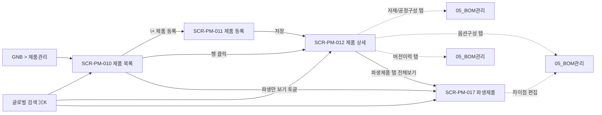
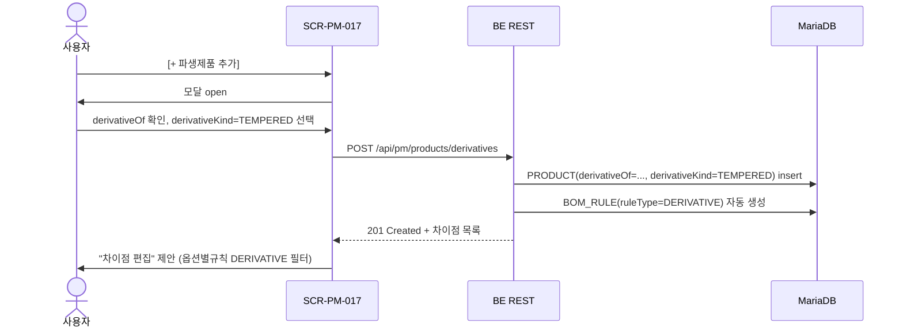
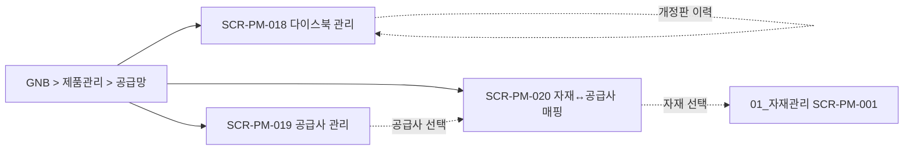

# 제품관리

> [!abstract]
> 포함 화면: **SCR-PM-010** 제품 목록, **SCR-PM-011** 제품 등록, **SCR-PM-012** 제품 상세, **SCR-PM-017** 파생제품 등록/조회, **SCR-PM-018** 다이스북 관리, **SCR-PM-019** 공급사 관리, **SCR-PM-020** 자재↔공급사 매핑 (v1.5-r1 신규 3건). v1.5에서 4계층 분류 필터 트리·modelCode 세그먼트 입력·파생제품 등록 화면 신설, v1.5-r1 에서 용어사전 v1.3 §14 기반 다이스북·공급망 관리 화면 3건 신설(FR-PM-023).
>
> **v1.6 개정:** SCR-PM-010 목록에 [파생만 보기] 토글·기본/파생 브레드크럼 추가, 4계층 분류 필터 트리를 공통 `<HierarchyFilter>` 컴포넌트 참조(→ [[DE22-1_화면설계서/sections/00_공통|00 공통 §3.4]])로 전환, SCR-PM-011 modelCode 세그먼트 드롭다운이 [[DE22-1_화면설계서/sections/07_공통CM|SCR-CM-006 코드관리]] 값에서 공급됨을 명시, SCR-PM-017 파생제품 이중 진입 경로(목록 토글 + 글로벌 검색) 추가, DE33-1 V100~V105 확정 반영.

> **분류 체계 관리 위치:** 제품 분류 값(L1 형식/L2 등급/L3 유리타입/L4 치수크기)의 등록·수정은 [[DE22-1_화면설계서/sections/07_공통CM|SCR-CM-006 코드 관리]]에서 처리(FR-PM-014). 제품 등록/목록 화면에서는 코드 관리에서 정의된 값을 드롭다운으로 선택한다.

## 화면 목록

| 화면 ID | 화면명 | 경로 | 관련 요구사항 | v1.5 / v1.6 변경 |
|---------|--------|------|-------------|-----------|
| SCR-PM-010 | 제품 목록 | /products | FR-PM-014,015,019 | v1.5 4계층 필터 트리 · **v1.6** 파생 토글·기본/파생 브레드크럼·HierarchyFilter 공통컴포넌트·⌘K 글로벌 검색 |
| SCR-PM-011 | 제품 등록 | /products/new | FR-PM-014,015,016 | v1.5 modelCode 세그먼트 UX · **v1.6** 세그먼트 공급원(SCR-CM-006) 명시·규칙 변경 호환성 정책·등록 후 SCR-PM-012 자동 이동 |
| SCR-PM-012 | 제품 상세 | /products/:productCode | FR-PM-010,011,012,013,016 | **v1.6** 파생제품 탭 빠른참조화·탭 과다 UX 주석 |
| **SCR-PM-017** | **파생제품 등록/조회** | /products/:productCode/derivatives | FR-PM-019 | v1.5 신규 · **v1.6** 이중 진입 경로(SCR-PM-010 토글·⌘K)·depth 1 제한 명시 |
| **SCR-PM-018** | **다이스북 관리 (v1.5-r1 신규)** | /dies-books | FR-PM-023 (신규) | 신규 |
| **SCR-PM-019** | **공급사 관리 (v1.5-r1 신규)** | /suppliers | FR-PM-023 (신규) | 신규 |
| **SCR-PM-020** | **자재↔공급사 매핑 (v1.5-r1 신규)** | /materials/:itemCode/suppliers | FR-PM-023 (신규) | 신규 |

## 화면 흐름



## 화면 상세

### SCR-PM-010 제품 목록 (v1.6 개정)

| 항목 | 내용 |
|------|------|
| 경로 | /products |
| 요구사항 | FR-PM-014, FR-PM-015, FR-PM-019 |
| 진입 | GNB > 제품관리 / 글로벌 검색 ⌘K |
| 권한 | ROLE_PM_VIEWER 이상 |

#### v1.6 — 4계층 분류 필터 트리 (공통 컴포넌트)

용어사전 v1.3 §9 기준, 제품 분류 L1(형식) → L2(등급) → L3(유리타입) → L4(치수크기) 를 좌측 필터로 제공. v1.6 부터는 본 화면 전용 트리가 아닌 **공통 `<HierarchyFilter>` 컴포넌트** ([[DE22-1_화면설계서/sections/00_공통|00 공통 §3.4]]) 를 사용한다.

- 트리 렌더링·체크박스·전체 해제·키보드 탐색은 공통 컴포넌트 계약 준수.
- `levels` prop: `[{code:'L1', label:'형식'}, {code:'L2', label:'등급'}, {code:'L3', label:'유리타입'}, {code:'L4', label:'치수크기'}]`
- `source` prop: `SCR-CM-006 코드관리 (CODE_CATALOG)` 에서 공급되는 레벨별 코드 목록.
- 선택 변경 시 emit 된 `{L1:[...], L2:[...], ...}` 을 URL 쿼리 파라미터로 동기화(뒤로가기·공유 지원).

```
┌─ 좌측 필터 패널 (<HierarchyFilter> 공통 컴포넌트) ──┐
│ 제품 분류 (4계층)                    [초기화]       │
│ ▼ ☑ L1: 형식                                        │
│    ☑ 미서기(SLIDING)                                │
│    ☐ 커튼월(CURTAIN-WALL)                           │
│ ▼ ☑ L2: 등급                                        │
│    ☑ 마스(MAS)       ☐ 우수(USU)                   │
│ ▼ ☑ L3: 유리타입                                    │
│    ☑ 복층(D-GLZ)     ☐ 삼중(T-GLZ)                 │
│ ▼ ☐ L4: 치수크기 (프리셋)                           │
│    ☐ 1500×1200      ☐ 2000×2400                    │
│ ─────                                               │
│ 상태 [전체▼]   재질 [전체▼]                          │
└─────────────────────────────────────────────────────┘
```

#### 필터 결과 브레드크럼

필터 트리 선택 결과는 목록 상단에 항상 브레드크럼으로 표시하고, `[초기화]` 버튼을 함께 제공한다.

```
현재 필터: 미서기 > 마스 > 복층  (3개 기준 / 24개 제품)   [초기화]
```

- `productClassPath` 는 용어사전 v1.3 §9 파생 필드. UI 는 한글 레이블로 치환 표시.

#### v1.6 — [파생만 보기] 토글 & 기본/파생 브레드크럼

목록 상단 액션바에 **[파생만 보기]** 토글 버튼을 추가. 활성화 시 `derivativeOf IS NOT NULL` 조건으로 필터링되어 파생제품만 노출한다.

```
[🔍 제품코드/제품명/modelCode 검색  ⌘K]  [☐ 파생만 보기]  [+ 제품 등록]
```

- 토글 상태는 URL 쿼리 파라미터 `?derivedOnly=true` 로 동기화. 필터 트리와 병행 적용.
- 파생 행에는 인라인 브레드크럼 "기본: SLD-XXXX → 파생 ▼" 표기를 통해 계통(lineage) 을 한 줄로 노출. 클릭 시 기본제품 [[#SCR-PM-012 제품 상세|SCR-PM-012]] 로 이동.

```
제품코드             │ 제품명          │ 분류 경로          │ 파생 브레드크럼                     │ BOM 상태
DHS-AE225-D-1        │ 미서기 이중창   │ 미서기>마스>복층   │ —                                   │ RELEASED
DHS-AE225-D-1-TEMP   │ 미서기(강화)    │ 미서기>마스>복층   │ 기본: DHS-AE225-D-1 → 파생 ▼        │ DRAFT
```

#### 글로벌 검색 (⌘K)

상단 글로벌 검색창(⌘K)에 제품코드·제품명·modelCode 를 타이핑하면 매칭 제품(파생 포함)으로 **직접 점프** 가능. 검색 결과 팝오버에서 Enter 시 해당 제품 상세(SCR-PM-012) 또는 파생 목록(SCR-PM-017) 으로 이동한다.

#### 목록 테이블 컬럼

| 컬럼 | 소스 | 비고 |
|------|------|------|
| 제품코드 (modelCode) | PRODUCT.modelCode | 예: `DHS-AE225-D-1` |
| 제품명 | PRODUCT.productName | |
| 분류 경로 | productClassPath 파생 | 브레드크럼 형태 |
| **파생 여부 / 파생 브레드크럼** | derivativeOf != null | 뱃지 "파생" + "기본: {code} → 파생 ▼" 인라인 표시, 클릭 시 기본제품 SCR-PM-012 이동 |
| BOM 상태 | standardBom.state | DRAFT/RELEASED/DEPRECATED |

**레이아웃**

```
┌──────────────────────────────────────────────────────────────────┐
│ Breadcrumb: 제품관리 > 제품 목록                                  │
│ 현재 필터: 미서기 > 마스 > 복층  (3개 / 24개 제품)   [초기화]     │
├──────────────┬───────────────────────────────────────────────────┤
│ <Hierarchy  │ 🔍 [코드/제품명/modelCode 검색 ⌘K]                │
│  Filter>    │ [☐ 파생만 보기]                    [+ 제품 등록]  │
│  L1 형식    │ 제품코드 │ 제품명 │ 분류 경로 │ 파생 브레드크럼 │상태│
│  L2 등급    │ DHS-AE225-D-1 │ 미서기 이중창 │ 미서기>마스>복층 │ — │ RELEASED │
│  L3 유리타입│ DHS-AE225-D-1-TEMP │ 미서기(강화) │ 미서기>마스>복층 │ 기본: DHS-AE225-D-1 → 파생 ▼ │ DRAFT │
│  L4 치수    │                                                    │
└──────────────┴───────────────────────────────────────────────────┘
```

> [!info] 제품 삭제 UX (v1.7 신설, §00 §3.x 의존성 검사 공통 원칙 적용) — SCR-PM-010 / SCR-PM-012 공통
> [삭제] 버튼 클릭 시 3단계 게이트:
> 1. **의존성 검사** `GET /api/pm/products/{code}/dependencies` — BOM 버전·옵션구성·규칙·파생·ITEM_SUPPLIER·견적 카운트
> 2. **영향도 확인 모달** — RESTRICT (차단): 확정 RESOLVED_BOM 1건 이상·견적 1건 이상 / CASCADE (자동 삭제): DRAFT BOM·미확정 옵션구성
> 3. **더블체크**: `productCode` 직접 타이핑 + 체크박스 "관련 데이터 손실을 이해했습니다"
> - 삭제 실행 시 `DELETE /api/pm/products/{code}` 호출 → 200 (soft delete, deleted_at 설정) / 409 (차단 대상 존재)
> - 30일 이내 **휴지통**(관리자 전용 페이지)에서 복원 가능

---

### SCR-PM-011 제품 등록 (v1.6 개정 — modelCode 세그먼트 UX)

| 항목 | 내용 |
|------|------|
| 경로 | /products/new |
| 요구사항 | FR-PM-014, 015, 016 |

용어사전 v1.3 §15 modelCode 파싱 규칙에 따라 세그먼트별 드롭다운으로 입력. **세그먼트 드롭다운 값(브랜드·시리즈·유리타입·리비전)은 모두 [[DE22-1_화면설계서/sections/07_공통CM|SCR-CM-006 코드관리]] 의 `CODE_CATALOG` 에서 공급**되며, 본 화면은 조회만 수행한다.

```
┌──────────────────────────────────────────────────────────┐
│ Breadcrumb: 제품관리 > 제품 목록 > 제품 등록              │
├──────────────────────────────────────────────────────────┤
│ ┌─ 제품 코드 생성 (세그먼트 입력) ──────────────────┐    │
│ │  브랜드 │ 시리즈   │ 유리타입 │ 리비전             │    │
│ │ [DHS▼] │ [AE225▼] │ [D▼]     │ [-1▼]              │    │
│ │                                                    │    │
│ │  → 생성 미리보기: DHS-AE225-D-1                   │    │
│ │  → productClassPath: 미서기 > 마스 > 복층         │    │
│ │  [ℹ 세그먼트 규칙: 브랜드(3)-시리즈(5)-유리타입(1)-리비전] │ │
│ └────────────────────────────────────────────────────┘    │
│                                                          │
│ ┌─ 분류 정보 ───────────────────────────────────────┐   │
│ │ L1 형식*   [미서기 ▼]                              │   │
│ │ L2 등급*   [마스 ▼]                                 │   │
│ │ L3 유리타입* [복층 ▼]                               │   │
│ │ L4 치수크기(옵션) [프리셋 선택 ▼]                   │   │
│ │ 재질*      [AL ▼]                                   │   │
│ │ 단열 여부* (●) 단열  ( ) 비단열                     │   │
│ └─────────────────────────────────────────────────────┘   │
│                                                          │
│ ┌─ 기본 정보 ───────────────────────────────────────┐   │
│ │ 제품명*  [미서기 이중창_______________]             │   │
│ └─────────────────────────────────────────────────────┘   │
│                                                          │
│ ┌─ 규격·특성 ───────────────────────────────────────┐   │
│ │ 표준 폭·높이·깊이·무게, 색상 옵션, 마감재,         │   │
│ │ 제품 특성 (☐ 방음 ☐ 단열 ☐ 방화)                  │   │
│ └─────────────────────────────────────────────────────┘   │
│                                                          │
│ ℹ 제품 등록 후 [자재/공정구성]에서 자재구성(EBOM)을        │
│   설정하세요.                                             │
│                                                          │
│                        [취소]  [저장]                     │
└──────────────────────────────────────────────────────────┘
```

> [!warning] 세그먼트 검증
> - 각 세그먼트는 `CODE_CATALOG` ([[DE22-1_화면설계서/sections/07_공통CM|SCR-CM-006 코드관리]]) 정의 값만 선택 가능. 세그먼트 값 추가·수정은 SCR-CM-006 에서만 수행.
> - 중복 modelCode 는 실시간 API (`GET /api/pm/products/exists?modelCode=...`) 검증.

> [!warning] 세그먼트 규칙 변경 시 호환성 정책
> SCR-CM-006 에서 세그먼트 코드 규칙(길이·허용문자·카탈로그 엔트리) 이 변경되면 **신규 등록 제품부터 새 규칙이 적용**된다. 기존 제품의 modelCode 는 자동 마이그레이션되지 않으며, 필요 시 별도 migration 작업을 요구사항(후속)으로 등록한 뒤 일괄 변환한다. 혼란 방지를 위해 규칙 변경 직후 진입하는 SCR-PM-011 상단에 "규칙 변경 이력: YYYY-MM-DD 적용" 배너를 노출한다.

> [!info] modelCode 세그먼트 ↔ classL1~L4 동기화 규칙 (v1.7 보강)
> modelCode 는 `{BRAND}-{SERIES}-{GLAZING}-{REVISION}` 4세그먼트 + classL1~L4 분류 정합 유지 필요:
> - **L1 선택 → BRAND 후보 필터링**: L1="커튼월" 선택 시 BRAND 드롭다운에 `CW*` prefix 만 노출 (SCR-CM-006 코드관리 BRAND 카테고리의 `parent_l1` 필터)
> - **L2/L3/L4 선택 → SERIES·GLAZING 후보 필터링**: L2="마스"·L3="복층" 조합 시 호환 SERIES (`AE225`·`AE135` 등) drop-down 자동 필터
> - **REVISION** 은 수동 입력 (1~99). 기존 modelCode 중복 실시간 검증 (debounce 300ms, 409 차단)
> - **세그먼트 ↔ classL1~L4 불일치** 시 저장 전 경고: "L1=커튼월인데 BRAND 가 미서기 계열입니다. 확인하세요"
> - 정규식 (용어사전 §15): `^[A-Z]{3}-[A-Z0-9]+(-[A-Z0-9]+)*$` 준수
> - **FR-PM-014 분류 체계 변경 시 기존 제품 마이그레이션**: SCR-CM-006 에서 L1~L4 값 삭제 시 `RESTRICT` (연결 제품 있으면 차단). renaming 은 CASCADE 업데이트 (감사 로그 필수). 본 정책은 v1.7 FR-PM-028 신설 후보로 STATUS.md 추적

> [!tip] 등록 완료 피드백
> 저장 성공 시 토스트 **"제품 등록 완료: {modelCode}"** 를 띄우고 [[#SCR-PM-012 제품 상세|SCR-PM-012 제품 상세]] 화면으로 자동 이동한다(등록 후 자재/공정구성 설정 유도).

---

### SCR-PM-012 제품 상세

| 항목 | 내용 |
|------|------|
| 경로 | /products/:productCode |
| 요구사항 | FR-PM-010, 011, 012, 013, 016 |
| 진입 | SCR-PM-010 > 행 클릭 |

**레이아웃**

```
┌──────────────────────────────────────────────────────────┐
│ Breadcrumb: 제품관리 > 제품 목록 > DHS-AE225-D-1          │
├──────────────────────────────────────────────────────────┤
│ [기본정보] [자재/공정구성] [옵션구성] [버전이력] [파생제품]    ← 탭 │
├──────────────────────────────────────────────────────────┤
│ === [기본정보] ===                                        │
│ 제품 코드: DHS-AE225-D-1 (수정 불가)                       │
│ 분류 경로: 미서기 > 마스 > 복층 (읽기전용)                 │
│ BOM 상태: RELEASED (배지, standardBomVersion 상태)        │
│ 제품명*, 표준 폭/높이/깊이/무게, 색상·마감재 옵션,          │
│ 제품 특성, 설명, 대표 이미지(JPG/PNG 5MB)                  │
│ [카탈로그 내보내기] ← 제품 기본 스펙+대표이미지 PDF         │
│                                                          │
│ === [자재/공정구성] ===                                   │
│ BOM 유형: [자재구성(EBOM) ▼ / 공정구성(MBOM)]              │
│ MES: 🟢 확정구성표 전달 중                                 │
│ → 상세는 [[DE22-1_화면설계서/sections/05_BOM관리|SCR-PM-013 BOM 트리뷰]] │
│                                                          │
│ === [옵션구성] ===                                        │
│ → [[DE22-1_화면설계서/sections/05_BOM관리|SCR-PM-013B 옵션구성/확정구성표]] 진입   │
│ 옵션구성 목록 (CFG-001 등) + RELEASED 구성만 MES 확정구성표 조회 가능   │
│                                                          │
│ === [버전이력] ===                                        │
│ [자재구성(EBOM) 버전] [공정구성(MBOM) 버전]  ← 서브탭      │
│ 상태 워크플로우: DRAFT → RELEASED → DEPRECATED             │
│ RELEASED BOM 직접 수정 불가 — 새 버전 생성 필요            │
│                                                          │
│ === [파생제품] ===                                        │
│ 빠른 참조 목록 (최대 5건) + [전체보기] → SCR-PM-017        │
│ - DHS-AE225-D-1-TEMP (TEMPERED)                            │
│ - DHS-AE225-D-1-1MM  (1MM)                                 │
│ - …                                                        │
│                                                          │
│                [삭제]  [취소]  [저장]                     │
└──────────────────────────────────────────────────────────┘
```

> [!note] 파생제품 탭 역할
> **주요 진입은 [[#SCR-PM-017 파생제품 등록-조회 v1-5 신규|SCR-PM-017 파생제품 등록/조회]]** 화면이다. 본 탭은 빠른 참조용으로 최대 5건만 노출하고, `[전체보기]` 버튼으로 SCR-PM-017 로 이동한다. 대량 파생 등록·차이 규칙 편집은 SCR-PM-017 에서 수행.

> [!note] v1.6 UX 고려 — 탭 과다
> 제품 상세 탭이 5개 이상으로 많다. 숙련 사용자는 탭 네비게이션을, 신규 사용자는 우측 split-view 패널로 BOM 편집([[DE22-1_화면설계서/sections/05_BOM관리|SCR-PM-013]]) 을 동반 오픈할 수 있도록 후속 Phase 에서 split-view 토글 도입을 검토한다.

> **현행 순번(Sequence) 기능:** 현행 `/pages/product/sequence`는 WIMS 2.0에서 제품 코드 자동 생성(FR-PM-015)으로 대체. 별도 화면 미구현.

---

> [!info] FE 구현 공통 원칙 (SCR-PM-017~020)
> - **DB 기준문서:** [[DE33-1_DB물리스키마_설계서_v1.3]] (MariaDB DDL). 각 화면 §DB 정합 체크리스트에서 gap 명시.
> - **프레임워크:** Vue 3 Composition API + Pinia + Vite ([[DE11-1_소프트웨어_아키텍처_설계서_v1.2]] §4). Form 은 VeeValidate + Zod 스키마.
> - **권한:** 조회 `ROLE_PM_VIEWER` / 편집 `ROLE_PM_EDITOR`. ROLE 체계는 [[DE11-1_소프트웨어_아키텍처_설계서_v1.2]] §7.3 역할 사전(SOT) 기준.
> - **반응형:** 기본 데스크톱 1280+. 태블릿 768~1279 로 대응. 모바일(<768) 은 현장실측(FS)만 대상이라 PM 화면은 비대응.
> - **a11y:** 모든 상호작용 요소는 키보드 탐색 가능. 모달은 focus trap + ESC 닫기. 테이블은 `<table>` + `scope` 속성, 필터는 `<label>` 연결.
> - **API 공통:** `Authorization: Bearer <JWT>`, 에러 시 `{errorCode, message, details?}` 형식. NFR-PF-CM-001 (화면 3초 이내) 기준.

---

### SCR-PM-017 파생제품 등록/조회 (v1.5 신규, v1.6 진입 경로 강화)

| 항목 | 내용 |
|------|------|
| 화면 ID | SCR-PM-017 |
| 화면명 | 파생제품 등록/조회 |
| 경로 | /products/:productCode/derivatives |
| 요구사항 | FR-PM-019 (신규 — 용어사전 v1.4 §16) |
| 진입 | ① [[#SCR-PM-012 제품 상세\|SCR-PM-012]] [파생제품] 탭 → **[전체보기]** / ② [[#SCR-PM-010 제품 목록 v1-6 개정\|SCR-PM-010]] **[파생만 보기] 토글 → 파생 목록** / ③ 글로벌 검색 ⌘K → derivativeCode |
| 권한 | 조회 ROLE_PM_VIEWER / 편집 ROLE_PM_EDITOR |

> [!info] v1.6 이중 진입 경로
> 파생제품은 (1) 개별 기본제품에서 들어가는 **제품 중심 경로** (SCR-PM-012 탭) 와 (2) 파생제품만 한눈에 보는 **목록 중심 경로** (SCR-PM-010 `[파생만 보기]`) 두 축으로 접근한다. 대량 파생을 관리하는 PM 담당자는 경로 (2) 를, 특정 기본제품의 변형군을 보는 설계자는 경로 (1) 을 사용한다.

> [!note] 파생 계통(lineage) 브레드크럼 & 깊이 제한
> 파생 목록·상세에서는 항상 **기본제품 → 파생** 브레드크럼을 노출한다. "파생의 파생"(depth 2 이상) 은 **Phase 1 에서는 depth 1 로 제한** 하며, 필요 시 Phase 2 에서 요구사항 재검토(계층형 파생 구조) 후 확장한다.

> [!info] 파생제품 영향도 뱃지 (v1.7 보강)
> - **기본제품 BOM 변경 시 파생에 전파되는 영향 수** 를 파생 목록 행에 뱃지로 표시:
>   - 🟢 "승계 중 (N규칙)" — 기본 규칙 자동 상속 중
>   - 🟡 "divergence 3필드" — 기본과 달라진 class_l1~l4 편집 있음
>   - 🔴 "충돌 2건" — 기본 BOM 변경 후 파생에서 미적용 규칙 존재
> - **영향도 모달**: 파생 클릭 시 기본제품 변경점 vs 파생 현재 상태 diff. [전파 적용] / [파생 유지] 선택
> - **divergence 방지**: derivativeKind 변경 시 경고 "이 변경은 파생 전체 BOM 재계산을 유발합니다"

**레이아웃**

```
┌──────────────────────────────────────────────────────────┐
│ Breadcrumb: 제품관리 > DHS-AE225-D-1 > 파생제품            │
├──────────────────────────────────────────────────────────┤
│ 기본제품: DHS-AE225-D-1 (미서기/마스/복층)  [기본제품 변경] │
├──────────────────────────────────────────────────────────┤
│ [+ 파생제품 추가]                                          │
│ 파생코드 │ 파생 종류 │ 차이 규칙 수 │ BOM 상태 │ 제품 상태  │
│ DHS-AE225-D-1-1MM   │ 1MM           │ 2 │ RELEASED │ ACTIVE │
│ DHS-AE225-D-1-CTH   │ CAP_TO_HIDDEN │ 3 │ DRAFT    │ ACTIVE │
│ DHS-AE225-D-1-TEMP  │ TEMPERED       │ 1 │ DRAFT    │ ACTIVE │
│ DHS-AE225-D-1-F43   │ FIRE_43MM      │ 5 │ DRAFT    │ ACTIVE │
└──────────────────────────────────────────────────────────┘
```

**[+ 파생제품 추가] 모달**

```
┌─ 파생제품 등록 ──────────────────────────────────────┐
│ derivativeOf*   [DHS-AE225-D-1 (기본제품, 잠금)]     │
│                                                       │
│ derivativeKind* ( ) 1MM (두께 1mm 치환)                │
│                 ( ) CAP_TO_HIDDEN (커버캡→감춤형)      │
│                 ( ) TEMPERED (강화유리)                │
│                 ( ) FIRE_43MM (방화 43mm)              │
│                                                       │
│ 파생 modelCode [DHS-AE225-D-1-TEMP] (자동 제안)       │
│                                                       │
│ ┌─ 기본제품 BOM 상속 미리보기 ──────────────────┐  │
│ │ ✓ 자재구성(EBOM) 47개 자동 상속                 │  │
│ │ ✓ 공정구성(MBOM) 53개 자동 상속                 │  │
│ │                                                  │  │
│ │ 차이점 (DERIVATIVE 유형 옵션별규칙): 자동 생성  │  │
│ │  · TEMPERED → GLS-OUT-P1 REPLACE GLS-OUT-P1-T   │  │
│ │  · TEMPERED → GLS-IN-P1  REPLACE GLS-IN-P1-T    │  │
│ │                                                  │  │
│ │ [차이점 편집…] → 옵션별규칙 (DERIVATIVE 필터)   │  │
│ └────────────────────────────────────────────────┘  │
│                                [취소] [등록]         │
└───────────────────────────────────────────────────────┘
```

**파생제품 등록 플로우 (시퀀스)**



**필드 바인딩 & 검증 (DE33-1 product 정합)**

| UI 필드 | DB 컬럼 | 타입 | 필수 | 검증 | 에러 메시지 |
|---|---|---|---|---|---|
| 기본제품 (읽기전용) | `product.product_code` (derivativeOf 로 역참조) | VARCHAR(32) | — | 상위 화면 주입 | — |
| derivativeKind (라디오) | `product.derivative_kind` | VARCHAR(16) | ✓ | `IN ('1MM','CAP_TO_HIDDEN','TEMPERED','FIRE_43MM')` | "파생 유형을 선택하세요" |
| 파생 modelCode | `product.product_code` | VARCHAR(32) | ✓ | 정규식 `^[A-Z]{3}-[A-Z0-9]+(-[A-Z0-9]+)*$`, UNIQUE | "이미 존재하는 modelCode", "코드 형식이 올바르지 않습니다" |
| 제품명 | `product.product_name` | VARCHAR(128) | ✓ (derivativeKind 선택 시 자동 제안) | 2~128자 | "제품명은 2자 이상 128자 이하" |
| class_l1~l4 (자동 상속) | `product.class_l1~l4` | VARCHAR(16)×4 | ✓ (기본제품에서 자동 상속, 편집 가능) | — | — |
| derivative_of (잠금) | `product.derivative_of` | BIGINT | ✓ | 자동 세팅 | — |
| 차이 규칙 수 (집계) | `COUNT(bom_rule WHERE rule_type='DERIVATIVE' AND product_id=?)` | — | 읽기전용 | — | 서버 사이드 집계. `GET /api/pm/products/{code}/derivatives` 응답에 포함 |
| BOM 상태 | `standard_bom.frozen` 또는 최신 `resolved_bom.state` | — | 읽기전용 | — | `DRAFT` / `RELEASED` / `DEPRECATED`. **§개방 이슈 #2** — 파생 단위 BOM 상태는 별도 라이프사이클 정의 필요 |
| 제품 상태 | `product.status` | VARCHAR(16) | 읽기전용 | `ACTIVE` / `DISCONTINUED` | 용어사전 §1 |

**주요 상호작용 & 상태**

| 요소 | 상태 | 조건·동작 |
|---|---|---|
| `[+ 파생제품 추가]` 버튼 | enabled | `ROLE_PM_EDITOR` + 기본제품 `status='ACTIVE'` |
| 등록 버튼 (모달) | disabled → enabled | 필수 필드 모두 채워지고 유효성 통과 시 |
| 모델코드 입력 | 자동 제안 | `{기본제품코드}-{derivativeKind 3글자}` (예: `-TEMP`). 사용자 편집 가능 |
| 모달 submit 중 | loading | `[등록]` 버튼에 스피너, 이중 클릭 방지 |
| 성공 | toast "파생제품 등록 완료" | 목록 자동 refetch, 등록된 행 highlight 2초 |
| 409 Conflict (중복 modelCode) | 인라인 에러 | 모델코드 필드 아래 "이미 존재하는 modelCode" 표시 |
| 422 Validation | 필드별 인라인 에러 | `details[].field` 매핑 |
| 500 | 토스트 에러 + 재시도 버튼 | 로그 전송 |

**빈 상태 (파생제품 0건)**

```
┌──────────────────────────────────────────────────────────┐
│ 기본제품: DHS-AE225-D-1                                   │
├──────────────────────────────────────────────────────────┤
│                                                          │
│           📦  아직 등록된 파생제품이 없습니다              │
│                                                          │
│     1MM·강화유리·방화등급 등 변형 제품을 추가하려면       │
│         [+ 파생제품 추가] 버튼을 클릭하세요                │
│                                                          │
│                [+ 첫 파생제품 추가]                         │
│                                                          │
└──────────────────────────────────────────────────────────┘
```

**API 스펙 요약**

| Method | Path | 용도 | 인증 |
|---|---|---|---|
| GET | `/api/pm/products/{productCode}/derivatives` | 파생제품 목록 | ROLE_PM_VIEWER |
| POST | `/api/pm/products/{productCode}/derivatives` | 등록 | ROLE_PM_EDITOR |
| PATCH | `/api/pm/products/{derivativeCode}` | 파생제품 수정 | ROLE_PM_EDITOR |
| DELETE | `/api/pm/products/{derivativeCode}` | 파생 삭제 (연결 RESOLVED_BOM 있으면 409) | ROLE_PM_EDITOR |
| GET | `/api/pm/bom-rules?ruleType=DERIVATIVE&productCode={code}` | 차이 규칙 조회 | ROLE_PM_VIEWER |

**권한별 UI 가시성**

| 역할 | `[+ 추가]` | 파생 상세 편집 | 차이 규칙 편집 | 삭제 |
|---|:---:|:---:|:---:|:---:|
| `ROLE_PM_VIEWER` | 숨김 | 읽기전용 | 읽기전용 | 숨김 |
| `ROLE_PM_EDITOR` | ✓ | ✓ | ✓ (DERIVATIVE 규칙만) | ✓ |
| `ROLE_PM_ADMIN` | ✓ | ✓ | ✓ | ✓ + 강제 삭제(cascade) |

**반응형 / 접근성**

- 데스크톱 1280+: 2 컬럼 (기본제품 정보 + 파생 테이블). 태블릿 768~1279: 1 컬럼 세로 스택.
- 모달 너비: 데스크톱 560px 고정, 태블릿 전체 너비.
- 키보드: Tab 순서 = derivativeKind 라디오 → 모델코드 → 제품명 → 취소 → 등록. ESC 로 모달 닫기.
- ARIA: 라디오 그룹 `role="radiogroup"` + `aria-labelledby`. 테이블 `scope="col"`. 로딩 상태 `aria-busy="true"`.

**DE33-1 정합 체크리스트**

- [x] `product.derivative_of` FK 자기참조 활용
- [x] `product.derivative_kind` CHECK (1MM/CAP_TO_HIDDEN/TEMPERED/FIRE_43MM) 준수
- [x] BOM_RULE `rule_type='DERIVATIVE'` 자동 생성 (POST 트랜잭션 내)
- [ ] **gap:** 화면에 "차이점 규칙 수" 컬럼 표시 → DE33-1 에는 집계 컬럼 없음. BE 는 `SELECT COUNT(*) FROM bom_rule WHERE rule_type='DERIVATIVE' AND product_id=?` 로 실시간 집계하거나 materialized count 컬럼 추가 검토 → **개방 이슈 #1**
- [ ] **gap:** 화면 상태 컬럼 `DRAFT/RELEASED` 은 어느 엔티티의 상태? `product.status (ACTIVE/DISCONTINUED)` 와 다른 개념 → **개방 이슈 #2**: 파생제품 상태 라이프사이클 별도 정의 필요

> [!abstract] 섹션 목적
> 용어사전 v1.3 §14 기반 **다이스북·공급망** 관리 화면 3건. FR-PM-023(신규) 커버리지. 엔티티는 `DIES_BOOK`·`DIES_SUPPLIER`·`ITEM_SUPPLIER` 3종. UI 라벨은 "공급사"(DB 표기 `DIES_SUPPLIER`), "다이스북", "자재-공급사 매핑"으로 표기한다. 후속 섹션 분리 시 `sections/08_공급망관리.md` 로 이관 가능.

### 공급망 화면 흐름



---

### SCR-PM-018 다이스북 관리 (v1.5-r1 신규)

| 항목 | 내용 |
|------|------|
| 화면 ID | SCR-PM-018 |
| 화면명 | 다이스북 관리 |
| 경로 | /dies-books |
| 요구사항 | FR-PM-023 (신규 — 용어사전 v1.3 §14) |
| 진입 | GNB > 제품관리 > 공급망 > 다이스북 |
| 권한 | 조회 ROLE_PM_VIEWER / 편집 ROLE_PM_EDITOR |

**용어 정합성:** 엔티티 `DIES_BOOK` / UI 라벨 "다이스북". 개정 일자는 `dies_book_revision` (용어사전 v1.3 §14).

**레이아웃 (와이어프레임)**

```
┌──────────────────────────────────────────────────────────┐
│ Breadcrumb: 제품관리 > 공급망 > 다이스북                   │
├──────────────────────────────────────────────────────────┤
│ 🔍 [다이스북명/발행 Series 검색]   [+ 다이스북 등록]        │
│ ─────────────────────────────────────────────────────────│
│ 다이스북ID │ 다이스북명          │ 발행 Series │ 제정일     │
│            │                     │             │ /최신 개정일│
│ ──────────┼─────────────────────┼─────────────┼────────────│
│ DB-001    │ 커튼월 DHS-CW135   │ DHS-CW      │ 2023-03-24 │
│           │                     │             │ /2025-08-20│
│ DB-002    │ 미서기 AE225       │ DHS-AE225   │ 2022-11-01 │
│           │                     │             │ /2024-06-10│
│                                                          │
│ 행 클릭 → 다이스북 상세(개정판 이력 탭)                    │
└──────────────────────────────────────────────────────────┘
```

**다이스북 상세 — 개정판 이력 탭**

```
┌─ DB-001 커튼월 DHS-CW135 ────────────────────────────┐
│ 제정일: 2023-03-24                                    │
│ 최신 개정일: 2025-08-20 (rev 3)                       │
│ 발행 Series: DHS-CW                                   │
│ 관련 제품: DHS-CW135-H-2 외 12건                       │
│ ─── 개정판 이력 ──────────────────────────────────── │
│ rev │ 개정일     │ 주요 변경               │ 발행자    │
│ 3   │ 2025-08-20 │ 열교차단재 PA 단열재 치환 │ 김지광    │
│ 2   │ 2024-06-10 │ 압출 프로파일 5종 추가   │ 이미희    │
│ 1   │ 2023-03-24 │ 제정                    │ 유미숙    │
│                                                       │
│            [+ 개정판 발행]  [취소]  [저장]             │
└───────────────────────────────────────────────────────┘
```

**필드 목록**

| 필드 | DB 매핑 | 타입 | 비고 |
|------|---------|------|------|
| 다이스북ID | `DIES_BOOK.dies_book_id` | PK | 자동 채번 |
| 다이스북명 | `DIES_BOOK.name` | VARCHAR(100) | — |
| 발행 Series | `DIES_BOOK.series_code` | VARCHAR(20) | `DHS-CW`, `DHS-AE225` 등 |
| 제정일 | `DIES_BOOK.issued_date` | DATE | 최초 제정 |
| 최신 개정일 | `DIES_BOOK.dies_book_revision` | DATE | 용어사전 §14 |
| 개정판 이력 | `DIES_BOOK_REVISION` (서브 테이블) | — | rev 번호·일자·변경사유 |

**주요 이벤트**

- `onCreate` — `POST /api/pm/dies-books` (다이스북 신규 등록, 제정일 = 오늘 기본값)
- `onRevisionPublish` — `POST /api/pm/dies-books/{id}/revisions` (rev +1, `PRODUCT.dies_revision` 참조 갱신 안내)
- `onUpdate` — `PATCH /api/pm/dies-books/{id}`
- `onDelete` — `DELETE /api/pm/dies-books/{id}` (연결 PRODUCT 존재 시 409)

> [!info] 개정판 발행 영향
> rev 발행은 `PRODUCT.dies_revision` 컬럼과 연동된다. 해당 Series 제품에 "개정판 적용 검토" 알림이 뜨며, 자재 마스터의 `ITEM.dies_code` 매핑 재검증을 권고한다.

> [!info] 개정판 UX 보강 (v1.7 신설)
> - **유효 개정판 하이라이트**: 현재 유효한 `dies_book.current_revision_no` 에 해당하는 행은 배경색 + **"현재 유효"** 배지. 과거 개정판은 회색 톤다운
> - **PDF 미리보기**: 이력 행 `file_url` 컬럼에 📎 아이콘 클릭 시 우측 슬라이드 패널 PDF 인라인 렌더 (PDF.js). 다운로드·인쇄 버튼 제공
> - **DB 스키마 요구**: `DIES_BOOK_REVISION.file_url VARCHAR(512)` 추가 (DE33-1 §개정 이슈로 기록). 업로드 시 S3 presigned URL · 접근 토큰 필요
> - **개정판 발행 모달**: 발행 번호 자동 +1 · 발행일 오늘 · PDF 업로드 필수 · 변경 사유 텍스트 (감사 로그)
> - **비교 기능**: 임의 2개 개정판 선택 → 메타데이터 diff 뷰 (발행일·발행자·변경사유·PDF 썸네일 좌우 비교)

**필드 바인딩 & 검증 (DE33-1 dies_book 정합)**

| UI 필드 | DB 컬럼 | 타입 | 필수 | 검증 | 비고 |
|---|---|---|---|---|---|
| 다이스북ID | `dies_book.dies_book_id` | BIGINT PK | 자동 | 자동 채번 | 표시용 `DB-{id}` 포맷 변환 |
| 다이스북명 | `dies_book.title` | VARCHAR(128) | ✓ | 2~128자, 공백 불허 | **UI 라벨 "다이스북명" ↔ DB `title`** (명명 통일 필요, §개방 이슈 #3) |
| 발행 Series | *(신규 컬럼 필요)* | — | ✓ | — | **DE33-1 gap:** `dies_book` 에 `series_code` 컬럼 없음 |
| 발행자 (supplier_id) | `dies_book.supplier_id` | BIGINT FK → `dies_supplier` | — | 활성 공급사만 | 드롭다운 |
| 제정일 | *(신규 컬럼 필요)* | — | ✓ | — | **DE33-1 gap:** `dies_book` 에 `issued_date` 컬럼 없음 |
| 최신 개정일 | `dies_book.dies_book_revision` | DATE | ✓ | ≥ 제정일 | — |
| 비고 | `dies_book.remarks` | TEXT | — | — | — |
| 관련 제품 (집계) | 계산 컬럼 | — | 읽기전용 | `SELECT COUNT(*) FROM product WHERE series_code='{series}'` | 서버 사이드 집계 |

**주요 상호작용 & 상태**

| 요소 | 상태 | 조건·동작 |
|---|---|---|
| 목록 검색 | debounce 300ms | 2자 이상 입력 시 `GET /api/pm/dies-books?q={keyword}` |
| `[+ 다이스북 등록]` | enabled | `ROLE_PM_EDITOR` |
| 행 클릭 | 상세 탭 전환 | 슬라이드 인 drawer (데스크톱) / 전체화면 (태블릿) |
| `[+ 개정판 발행]` | enabled | 상세 탭 진입 후 ROLE_PM_EDITOR |
| 개정판 발행 confirm | 모달 | "rev +1. 관련 제품 {N}건에 '개정판 검토' 알림이 발송됩니다. 진행하시겠습니까?" |
| 삭제 (행 hover 시) | enabled (조건부) | `RESTRICT`: 관련 product 있으면 409 "연결된 제품 {N}건이 있어 삭제할 수 없습니다" |

**빈 상태 (다이스북 0건)**

```
┌──────────────────────────────────────────────────────────┐
│                                                          │
│       📖  등록된 다이스북이 없습니다                        │
│                                                          │
│   다이스북은 압출 프로파일의 금형 카탈로그로,              │
│   제품 설계 및 자재 발주의 기준이 됩니다.                   │
│                                                          │
│              [+ 첫 다이스북 등록]                           │
│                                                          │
└──────────────────────────────────────────────────────────┘
```

**API 스펙 요약**

| Method | Path | 용도 | 인증 |
|---|---|---|---|
| GET | `/api/pm/dies-books?q=&page=&size=` | 목록 (검색·페이지) | ROLE_PM_VIEWER |
| GET | `/api/pm/dies-books/{id}` | 상세 + 개정판 이력 | ROLE_PM_VIEWER |
| POST | `/api/pm/dies-books` | 등록 | ROLE_PM_EDITOR |
| PATCH | `/api/pm/dies-books/{id}` | 수정 | ROLE_PM_EDITOR |
| POST | `/api/pm/dies-books/{id}/revisions` | 개정판 발행 | ROLE_PM_EDITOR |
| DELETE | `/api/pm/dies-books/{id}` | 삭제 (연결 product 없을 때만) | ROLE_PM_EDITOR |

**반응형 / 접근성**

- 데스크톱 1280+: 목록 + 상세 drawer 병행(30/70 분할). 태블릿: 목록 전체 + 상세 전체화면 전환.
- 개정판 이력 테이블은 가로 스크롤 대신 **칼럼 우선순위 숨김**(발행자 열은 태블릿에서 숨김).
- 키보드: ↑↓ 로 목록 행 이동, Enter 로 상세 진입, ESC 로 drawer 닫기.
- ARIA: 목록 `role="listbox"` 대안으로 `<table>` + `aria-rowindex` 사용 권장. drawer `role="dialog"` + `aria-modal="true"`.

**DE33-1 정합 체크리스트 및 스키마 gap**

| # | 항목 | 상태 | 조치 |
|---|---|---|---|
| 1 | `dies_book.title` ↔ UI "다이스북명" | ✅ 정합 | — |
| 2 | `dies_book.dies_book_revision` (최신 개정일) | ✅ | — |
| 3 | `dies_book.supplier_id` (발행 공급사) | ✅ | — |
| 4 | `dies_book.remarks` | ✅ | — |
| 5 | **UI "발행 Series"** (`series_code` 컬럼) | ❌ gap | **DE33-1 확장:** `dies_book.series_code VARCHAR(32)` 추가 필요 |
| 6 | **UI "제정일"** (`issued_date`) | ❌ gap | **DE33-1 확장:** `dies_book.issued_date DATE NOT NULL` 추가 필요 |
| 7 | **개정판 이력 테이블** | ❌ gap | **DE33-1 신규 테이블:** `dies_book_revision(revision_id, dies_book_id FK, rev_no INT, rev_date DATE, summary VARCHAR(256), published_by, created_at)` |
| 8 | UI "관련 제품 집계" | 🔗 | 계산 컬럼. `PRODUCT.series_code` 필터 + `product.dies_revision` 참조. `PRODUCT` 에 dies_book_id FK 연결 여부 **개방 이슈 #4** |

> [!warning] 스키마 확장 필요
> SCR-PM-018 구현 전 DE33-1 의 `dies_book` 에 `series_code`·`issued_date` 2컬럼 추가 + `dies_book_revision` 신규 테이블 정의가 선결. Flyway V100+ 로 `V100__add_dies_book_columns.sql` 및 `V101__create_dies_book_revision.sql` 분리 추가 권장.

---

### SCR-PM-019 공급사 관리 (v1.5-r1 신규)

| 항목 | 내용 |
|------|------|
| 화면 ID | SCR-PM-019 |
| 화면명 | 공급사 관리 |
| 경로 | /suppliers |
| 요구사항 | FR-PM-023 (신규 — 용어사전 v1.3 §14) |
| 진입 | GNB > 제품관리 > 공급망 > 공급사 |
| 권한 | 조회 ROLE_PM_VIEWER / 편집 ROLE_PM_EDITOR |

**용어 정합성:** 엔티티 `DIES_SUPPLIER` / UI 라벨 "공급사" (금형사 범주 포함). `role` 값은 `EXTRUSION`(압출)·`INSULATION`(단열)·`HARDWARE`(부자재).

**레이아웃 (와이어프레임)**

```
┌──────────────────────────────────────────────────────────┐
│ Breadcrumb: 제품관리 > 공급망 > 공급사                     │
├──────────────────────────────────────────────────────────┤
│ 역할 필터: [전체▼ / EXTRUSION / INSULATION / HARDWARE]     │
│ 🔍 [공급사명 검색]                   [+ 공급사 등록]        │
│ ─────────────────────────────────────────────────────────│
│ 공급사ID │ 공급사명      │ 역할        │ 담당 영역           │
│ ─────────┼───────────────┼─────────────┼────────────────── │
│ SUP-001  │ 대양금속      │ EXTRUSION   │ AL 압출 프로파일   │
│ SUP-002  │ 성진알미늄    │ EXTRUSION   │ AL 압출 프로파일   │
│ SUP-003  │ 플라프로      │ INSULATION  │ PA 열교차단재      │
│ SUP-004  │ 동신테크      │ HARDWARE    │ 하드웨어·잠금장치   │
│ SUP-005  │ 가람정밀      │ HARDWARE    │ 롤러·피팅류         │
│                                                          │
│ 행 클릭 → 공급사 상세(담당 자재·단가 탭 진입)              │
└──────────────────────────────────────────────────────────┘
```

**필드 목록**

| 필드 | DB 매핑 | 타입 | 비고 |
|------|---------|------|------|
| 공급사ID | `DIES_SUPPLIER.supplier_id` | PK | — |
| 공급사명 | `DIES_SUPPLIER.name` | VARCHAR(100) | 대양·성진·삼산·플라프로·동신테크·지원이앤에스·가람정밀 등 |
| 역할 | `DIES_SUPPLIER.role` | ENUM | `EXTRUSION` / `INSULATION` / `HARDWARE` (용어사전 §14) |
| 담당 영역 | `DIES_SUPPLIER.scope_desc` | VARCHAR(200) | UI 참고용 자유 서술 |
| 연락 담당자 | `DIES_SUPPLIER.contact_name`, `contact_phone`, `contact_email` | — | 선택 |
| 활성 여부 | `DIES_SUPPLIER.active` | BOOLEAN | 비활성 시 신규 매핑 차단 |

**주요 이벤트**

- `onCreate` — `POST /api/pm/suppliers` (역할 필수)
- `onUpdate` — `PATCH /api/pm/suppliers/{id}`
- `onDeactivate` — `PATCH /api/pm/suppliers/{id}/deactivate` (기존 ITEM_SUPPLIER 는 유지, 신규 매핑만 차단)
- `onRoleChange` — 역할 변경 시 확인 모달 (관련 ITEM_SUPPLIER 영향 건수 표시)

> [!warning] 거래처와의 구분
> 본 화면의 "공급사"(`DIES_SUPPLIER`) 는 용어사전 §14 금형·압출·단열·하드웨어 **공급망 주체** 이며, 구매 거래처(`PARTNER`, [[DE22-1_화면설계서/sections/02_거래처_단가|SCR-PM-004]]) 와 식별자 체계가 다르다. 향후 통합 정책은 유니크시스템 합의 후 결정.

**필드 바인딩 & 검증 (DE33-1 dies_supplier 정합)**

| UI 필드 | DB 컬럼 | 타입 | 필수 | 검증 | 비고 |
|---|---|---|---|---|---|
| 공급사ID | `dies_supplier.supplier_id` | BIGINT PK | 자동 | — | 표시용 `SUP-{id:03d}` |
| 공급사명 | `dies_supplier.supplier_name` | VARCHAR(64) | ✓ | 2~64자, UNIQUE | "이미 등록된 공급사명" |
| 역할 | `dies_supplier.role` | VARCHAR(16) | ✓ | `IN ('EXTRUSION','INSULATION','HARDWARE')` | 셀렉트박스 |
| 담당 영역 | *(신규 컬럼 필요)* | — | — | 0~200자 | **DE33-1 gap:** `dies_supplier.scope_desc VARCHAR(200)` 추가 필요 |
| 연락 담당자 | `dies_supplier.contact` | VARCHAR(64) | — | — | 이름 + 직함 자유 서술 |
| 연락처 분리 | *(신규 컬럼 필요)* | — | — | — | **DE33-1 gap:** 전화·이메일 분리 컬럼 추가 검토 (`contact_phone`, `contact_email`) |
| 활성 여부 | *(신규 컬럼 필요)* | — | — | — | **DE33-1 gap:** `dies_supplier.active BOOLEAN DEFAULT TRUE` 추가 필요 |

**주요 상호작용 & 상태**

| 요소 | 상태 | 조건·동작 |
|---|---|---|
| 역할 필터 | 다중 선택 | `?role=EXTRUSION,INSULATION` 쿼리 파라미터 |
| 목록 검색 | debounce 300ms | `?q={keyword}` |
| `[+ 공급사 등록]` | enabled | `ROLE_PM_EDITOR` |
| 역할 변경 | confirm 모달 | "역할 변경 시 연결된 자재 매핑 {N}건에 영향이 있을 수 있습니다. 진행하시겠습니까?" |
| 비활성화 (deactivate) | confirm 모달 | "비활성 시 신규 매핑만 차단되며 기존 연결은 유지됩니다" |
| 삭제 | disabled 기본 | FK 존재 시 비활성. `DELETE` 대신 `active=FALSE` 권장 |

**빈 상태 (공급사 0건)**

```
┌──────────────────────────────────────────────────────────┐
│                                                          │
│       🏭  등록된 공급사가 없습니다                          │
│                                                          │
│   자재를 공급받을 압출·단열재·하드웨어 공급사를            │
│   먼저 등록하세요.                                        │
│                                                          │
│              [+ 첫 공급사 등록]                             │
│                                                          │
└──────────────────────────────────────────────────────────┘
```

**API 스펙 요약**

| Method | Path | 용도 | 인증 |
|---|---|---|---|
| GET | `/api/pm/suppliers?role=&q=&active=&page=` | 목록 | ROLE_PM_VIEWER |
| GET | `/api/pm/suppliers/{id}` | 상세 (담당 자재 집계 포함) | ROLE_PM_VIEWER |
| POST | `/api/pm/suppliers` | 등록 | ROLE_PM_EDITOR |
| PATCH | `/api/pm/suppliers/{id}` | 수정 | ROLE_PM_EDITOR |
| PATCH | `/api/pm/suppliers/{id}/deactivate` | 비활성화 | ROLE_PM_EDITOR |
| PATCH | `/api/pm/suppliers/{id}/activate` | 재활성화 | ROLE_PM_EDITOR |
| DELETE | `/api/pm/suppliers/{id}` | 하드 삭제 (FK 없을 때만) | ROLE_PM_ADMIN |

**반응형 / 접근성**

- 역할 필터 칩: 태블릿에서 드롭다운으로 collapse. ARIA `role="group"` + `aria-label="역할 필터"`.
- 테이블: `aria-sort` 속성으로 정렬 상태 알림.
- 키보드: 필터 칩은 `Space`/`Enter` 로 토글, `Tab` 으로 다음 칩.

**DE33-1 정합 체크리스트 및 스키마 gap**

| # | 항목 | 상태 | 조치 |
|---|---|---|---|
| 1 | `dies_supplier.supplier_name` UNIQUE | ✅ | — |
| 2 | `dies_supplier.role` CHECK (EXTRUSION/INSULATION/HARDWARE) | ✅ | — |
| 3 | `dies_supplier.contact` | ✅ (단일 필드) | — |
| 4 | UI "담당 영역" | ❌ gap | **DE33-1 확장:** `scope_desc VARCHAR(200) NULL` |
| 5 | UI "활성 여부" (deactivate) | ❌ gap | **DE33-1 확장:** `active BOOLEAN NOT NULL DEFAULT TRUE` |
| 6 | UI "연락처 분리" (전화·이메일) | 🔄 선택 | `contact` 단일 필드 유지 또는 분리. **개방 이슈 #5** |

---

### SCR-PM-020 자재↔공급사 매핑 (v1.5-r1 신규)

| 항목 | 내용 |
|------|------|
| 화면 ID | SCR-PM-020 |
| 화면명 | 자재↔공급사 매핑 |
| 경로 | /materials/:itemCode/suppliers |
| 요구사항 | FR-PM-023 (신규 — 용어사전 v1.3 §14) |
| 진입 | SCR-PM-003 자재 상세 > [공급사] 탭 / 또는 GNB > 제품관리 > 공급망 > 자재-공급사 매핑 |
| 권한 | 조회 ROLE_PM_VIEWER / 편집 ROLE_PM_EDITOR |

**용어 정합성:** 엔티티 `ITEM_SUPPLIER` (자재↔공급사 다대다). 자재 1건에 복수 공급사 매핑 가능하며 `priority` 로 우선 공급사 지정.

**레이아웃 (와이어프레임)**

```
┌──────────────────────────────────────────────────────────┐
│ Breadcrumb: 자재관리 > AL-P-225-DHS > 공급사               │
├──────────────────────────────────────────────────────────┤
│ 자재: AL-P-225-DHS  (AL 225mm 메인 프로파일 / 다이스: D-225)│
│ ─────────────────────────────────────────────────────────│
│ [+ 공급사 추가]                                            │
│ 우선순위 │ 공급사         │ 역할      │ 단가(₩/m) │ 리드타임 │
│ ─────────┼────────────────┼───────────┼──────────┼──────────│
│ 1 (주)   │ 대양금속       │ EXTRUSION │  12,400  │ 7일      │
│ 2 (보조) │ 성진알미늄     │ EXTRUSION │  12,800  │ 5일      │
│ 3 (예비) │ 삼산메탈       │ EXTRUSION │  13,100  │ 10일     │
│                                                          │
│ [우선순위 재정렬: 드래그]    [저장]                         │
└──────────────────────────────────────────────────────────┘
```

**[+ 공급사 추가] 모달**

```
┌─ 공급사 매핑 추가 ─────────────────────────────────┐
│ 자재*     [AL-P-225-DHS (잠금)]                     │
│ 공급사*   [대양금속 (EXTRUSION) ▼]                  │
│          (역할이 자재 카테고리와 상이 시 경고 표시)  │
│ 우선순위* [ 1 ▼ ]  (1=주 / 2=보조 / 3~=예비)        │
│ 단가      [ 12,400 ] ₩/m                            │
│ 리드타임  [ 7 ] 일                                   │
│ 유효 시작 [ 2026-04-16 ]                             │
│ 유효 종료 [ (공란=무기한) ]                          │
│                              [취소] [추가]          │
└─────────────────────────────────────────────────────┘
```

**필드 목록**

| 필드 | DB 매핑 | 타입 | 비고 |
|------|---------|------|------|
| 자재 | `ITEM_SUPPLIER.item_code` (FK → `ITEM`) | — | 상위 화면에서 주입 |
| 공급사 | `ITEM_SUPPLIER.supplier_id` (FK → `DIES_SUPPLIER`) | — | 활성 공급사만 선택 가능 |
| 우선순위 | `ITEM_SUPPLIER.priority` | SMALLINT | 1=주, 2+=보조·예비. UNIQUE(itemCode, priority) |
| 단가 | `ITEM_SUPPLIER.unit_price` | DECIMAL(12,2) | 참고 단가(구매 실단가는 `PARTNER_PRICE`) |
| 단위 | `ITEM_SUPPLIER.price_unit` | VARCHAR(10) | `m` / `EA` / `kg` |
| 리드타임(일) | `ITEM_SUPPLIER.lead_time_days` | INT | — |
| 유효 기간 | `valid_from` / `valid_to` | DATE | `valid_to` NULL = 무기한 |

**주요 이벤트**

- `onAddMapping` — `POST /api/pm/items/{itemCode}/suppliers`
- `onRemoveMapping` — `DELETE /api/pm/items/{itemCode}/suppliers/{supplierId}`
- `onReorderPriority` — 드래그 완료 시 `PATCH /api/pm/items/{itemCode}/suppliers/reorder`
- `onPriceUpdate` — 단가 변경은 이력 테이블(`ITEM_SUPPLIER_HISTORY`) 적재

> [!tip] 우선순위 모델
> `priority=1` 주 공급사는 자재당 1건. 발주관리(OM, Phase 2) 가 자재 발주 시 기본 후보로 사용하며, 품절·납기지연 시 우선순위 2+ 공급사로 폴백.

**필드 바인딩 & 검증 (DE33-1 item_supplier 정합)**

| UI 필드 | DB 컬럼 | 타입 | 필수 | 검증 | 비고 |
|---|---|---|---|---|---|
| 자재 (잠금) | `item_supplier.item_id` (FK → `item`) | BIGINT | ✓ | 상위 화면 주입 | 표시는 `item.item_code` |
| 공급사 | `item_supplier.supplier_id` (FK → `dies_supplier`) | BIGINT | ✓ | `active=TRUE` 공급사만 | 드롭다운 |
| 우선순위 | `item_supplier.priority` | INT | ✓ | 1 이상, 자재별 1·2 는 유일 | "주 공급사는 1건만 지정 가능" |
| 역할 태그 (표시) | `dies_supplier.role` | — | 읽기전용 | JOIN 조회 | — |
| 공급 역할 | `item_supplier.supply_role` | VARCHAR(16) | — | `PRIMARY` / `SECONDARY` (CHECK) | UI 는 priority 와 상관관계 — priority=1 → PRIMARY 자동, 그 외 SECONDARY |
| 단가 | *(신규 컬럼 필요)* | — | — | 0 이상 | **DE33-1 gap:** `item_supplier.unit_price DECIMAL(12,2) NULL` |
| 단위 | *(신규 컬럼 필요)* | — | — | `IN ('m','EA','kg','SET')` | **DE33-1 gap:** `item_supplier.price_unit VARCHAR(8) NULL` |
| 리드타임 | *(신규 컬럼 필요)* | — | — | 0~365일 | **DE33-1 gap:** `item_supplier.lead_time_days INT NULL` |
| 유효 시작 | *(신규 컬럼 필요)* | — | — | 오늘 이상 | **DE33-1 gap:** `item_supplier.valid_from DATE NULL` |
| 유효 종료 | *(신규 컬럼 필요)* | — | — | 시작일 이상 / NULL | **DE33-1 gap:** `item_supplier.valid_to DATE NULL` |

**주요 상호작용 & 상태**

| 요소 | 상태 | 조건·동작 |
|---|---|---|
| 우선순위 드래그 | enabled | `ROLE_PM_EDITOR`. 드래그 드롭 완료 후 자동 재번호 + 저장 확인 toast |
| `[+ 공급사 추가]` | enabled (조건부) | 매핑되지 않은 활성 공급사가 있을 때만. 전부 매핑되었으면 비활성 + hint "모든 활성 공급사가 매핑됨" |
| 역할-자재 카테고리 불일치 경고 | 인라인 warning | 예: `item.item_category='GLASS'` 인데 공급사 `role='EXTRUSION'` 선택 시 "자재 카테고리와 공급사 역할이 일치하지 않습니다 (계속 진행 가능)" |
| 단가 입력 | 숫자 키패드 | 3자리 구분자 자동 삽입, 저장 시 숫자만 |
| 중복 매핑 시도 | 409 Conflict | "해당 공급사는 이미 매핑되어 있습니다 (우선순위 {N})" |
| 삭제 | confirm 모달 | "이 매핑을 삭제하시겠습니까? priority 는 자동 재정렬됩니다" |
| `priority=1` 교체 | confirm 모달 | "현재 주 공급사(공급사명)가 보조로 변경됩니다. 계속하시겠습니까?" |

**빈 상태 (매핑 0건)**

```
┌──────────────────────────────────────────────────────────┐
│ 자재: AL-P-225-DHS                                        │
├──────────────────────────────────────────────────────────┤
│                                                          │
│       🔗  등록된 공급사 매핑이 없습니다                     │
│                                                          │
│   이 자재를 공급할 수 있는 공급사를 추가하여                │
│   발주 시 자동 후보로 활용하세요.                          │
│                                                          │
│              [+ 첫 공급사 매핑 추가]                         │
│                                                          │
└──────────────────────────────────────────────────────────┘
```

**API 스펙 요약**

| Method | Path | 용도 | 인증 |
|---|---|---|---|
| GET | `/api/pm/items/{itemCode}/suppliers` | 자재별 공급사 목록 | ROLE_PM_VIEWER |
| POST | `/api/pm/items/{itemCode}/suppliers` | 매핑 추가 | ROLE_PM_EDITOR |
| PATCH | `/api/pm/items/{itemCode}/suppliers/reorder` | 우선순위 일괄 재정렬 | ROLE_PM_EDITOR |
| PATCH | `/api/pm/items/{itemCode}/suppliers/{supplierId}` | 매핑 수정 (단가·리드타임·유효기간) | ROLE_PM_EDITOR |
| DELETE | `/api/pm/items/{itemCode}/suppliers/{supplierId}` | 매핑 삭제 | ROLE_PM_EDITOR |

**반응형 / 접근성**

- 드래그 드롭은 태블릿/마우스 터치 모두 지원. 접근성 대안으로 "↑/↓ 이동 버튼" 제공.
- 자재 정보 bar 는 상단 sticky (스크롤 시에도 자재 식별 유지).
- ARIA: 우선순위 테이블 행 `aria-grabbed` + 드래그 중 `aria-dropeffect="move"`.

**DE33-1 정합 체크리스트 및 스키마 gap**

| # | 항목 | 상태 | 조치 |
|---|---|---|---|
| 1 | `item_supplier.item_id` FK | ✅ | — |
| 2 | `item_supplier.supplier_id` FK | ✅ | — |
| 3 | `item_supplier.priority` | ✅ | — |
| 4 | `item_supplier.supply_role` CHECK (PRIMARY/SECONDARY) | ✅ | — |
| 5 | UNIQUE (item_id, supplier_id) | ✅ | — |
| 6 | **UI 단가·단위·리드타임·유효기간** | ❌ gap (4 컬럼) | **DE33-1 확장 필수:** `unit_price`, `price_unit`, `lead_time_days`, `valid_from`, `valid_to` |
| 7 | UI "단가 변경 이력" (tip 언급 `ITEM_SUPPLIER_HISTORY`) | ❌ gap | **DE33-1 신규 테이블:** `item_supplier_history(history_id, item_supplier_id FK, operation, before_snapshot JSON, after_snapshot JSON, actor, changed_at)` — BOM_RULE_HISTORY 와 동일 패턴 |

> [!warning] 스키마 확장 우선순위
> SCR-PM-020 은 FR-PM-023 에서 **단가·리드타임은 핵심 정보** 로 정의됨. DE33-1 v1.1 갱신 시 `item_supplier` 에 5 컬럼 추가 필수. 이력 테이블은 Phase 1 에서는 트리거/JPA 로 `item_supplier_history` 서브시스템 구현 후 선택적 반영.

### SCR-PM-020 [이력] 탭 (v1.7 신설)

| 항목 | 내용 |
|------|------|
| 진입 | 자재-공급사 매핑 상세 우측 [이력] 탭 |
| 권한 | 조회 `ROLE_PM_VIEWER` · 변경자 필터 `ROLE_PM_ADMIN` 이상 |

**레이아웃**
- 타임라인 뷰: 세로 축 시간 · 각 이벤트 카드 = actor · 시각 · operation · before/after diff 요약
- 필터: actor · operation (INSERT/UPDATE/DELETE) · 기간 (기본 최근 90일)
- 행 클릭 시: before_snapshot vs after_snapshot JSON diff 사이드-바이-사이드 모달

**기능 상세**
- `ITEM_SUPPLIER_HISTORY` (DE33-1 §3.19) 기반
- cursor 페이지네이션 (50건씩)
- **비활성 공급사 매핑 배지**: 이력 중 `supplier.active` 가 사후 FALSE 된 경우 해당 카드에 ⚠ 배지 + "해당 공급사가 현재 비활성화됨" 툴팁
- **CSV 다운로드**: 감사 로그 내보내기 (NFR-SC-CM-006 90일 이상 보관 준수)

**API**: `GET /api/pm/items/{itemCode}/suppliers/history?limit=50&cursor=&actor=&op=&from=&to=` (`ROLE_PM_VIEWER`)

---

## §5 공급망 관리 화면 — 개방 이슈 종합 (v1.5-r2 추가 / v1.6 갱신)

본 §4 공급망 관리 화면 3건(SCR-PM-018/019/020) 및 파생제품 SCR-PM-017 을 **FE 상세 스펙 수준으로 확장** 하면서 식별된 개방 이슈·DB 스키마 gap·화면 간 정합성 사항을 종합한다. BE/DBA·FE 각 팀에 인계.

> [!success] v1.6 — DE33-1 v1.2 V100~V105 확정 완료 (2026-04-22)
> 본 §5 에서 선결 요건으로 정의한 DE33-1 스키마 확장(V100~V105)은 **DE33-1 v1.2 V100~V105 확정 완료 (2026-04-22)** 로 종결되었다. `dies_book`·`dies_supplier`·`item_supplier` 컬럼 추가, `dies_book_revision`·`item_supplier_history` 신규 테이블, `product.dies_book_id` FK 가 Flyway 로 병합됨. §5.2 표의 gap 항목(⚠) 은 FE 구현 착수 시 `✅` 로 간주 가능.

### 5.1 개방 이슈 (8건)

| # | 구분 | 이슈 | 관련 화면 | 대응 제안 | 담당 | 긴급도 |
|---|---|---|---|---|---|---|
| 1 | UI·BE | "차이 규칙 수" 집계 방식 — 실시간 COUNT vs materialized column | SCR-PM-017 | 초기: 실시간 COUNT. 성능 문제 발생 시 `product.derivative_rule_count` 캐시 컬럼 추가 | BE | 중 |
| 2 | 데이터 모델 | 파생제품의 BOM 상태 라이프사이클 — `standard_bom.frozen` 기준 vs `resolved_bom.state` 기준 | SCR-PM-017 | DE32-1 §6 에 파생 단위 라이프사이클 명시 또는 단일화 방침 | BA | 상 |
| 3 | 네이밍 | `dies_book.title` ↔ UI "다이스북명" — DB 컬럼명과 UI 라벨 정합 | SCR-PM-018 | 둘 중 하나 통일. `title` 을 `dies_book_name` 으로 변경 or UI 를 "제목" 으로 변경 | DBA | 중 |
| 4 | 데이터 모델 | `PRODUCT` ↔ `DIES_BOOK` 관계 — 현재 soft FK(`ITEM.dies_code`)만 정의. `PRODUCT.dies_book_id` FK 필요 여부 | SCR-PM-018 | DE32-1 §3 에 `PRODUCT.dies_book_id BIGINT NULL FK` 추가 검토 | BA/DBA | 상 |
| 5 | UI·데이터 | 공급사 연락처 단일 필드 vs 분리(전화·이메일·담당자) | SCR-PM-019 | Phase 1 은 `contact` 단일 유지, Phase 2 에서 분리. `scope_desc`·`active` 는 v1.1 에서 추가 | BA/DBA | 중 |
| 6 | 권한 | ~~구 `ROLE_PRODUCT_EDITOR` ↔ DE11-1 명명 불일치~~ | 전체 | ✅ **해소 (v1.7, 2026-04-24)** — [[DE11-1_소프트웨어_아키텍처_설계서_v1.2]] §7.3 역할 사전 SOT 신설, 본 §04 전 SCR `ROLE_USER`→`ROLE_PM_VIEWER`·`ROLE_PRODUCT_EDITOR`→`ROLE_PM_EDITOR` 일괄 치환 완료 | — | ✅ |
| 7 | 화면 | SCR-PM-003 자재 상세에 [공급사] 탭 부재 → SCR-PM-020 진입 경로 미구현 | SCR-PM-020 | 01_자재관리.md SCR-PM-003 에 [공급사] 탭 신설 (FE 라우팅: `/materials/:itemCode#suppliers`) | FE | 상 |
| 8 | 데이터 모델 | `ESTIMATE` 테이블 부재 → `bom_rule.estimate_id` FK 가 Phase 2 까지 미확정 | 전반 (향후 견적 오버레이) | Phase 2 ES 서브시스템 착수 시 `ALTER TABLE bom_rule ADD FOREIGN KEY...` | BA | 하 |

### 5.2 DE33-1 스키마 확장 요구 종합

SCR-PM-018~020 을 FE 구현 가능 수준으로 완성하려면 DE33-1 에 다음 변경이 선결된다. Flyway `V100+` 로 별도 마이그레이션.

| 대상 | 변경 | Flyway 파일 |
|---|---|---|
| `dies_book` | `+ series_code VARCHAR(32) NOT NULL`, `+ issued_date DATE NOT NULL` | `V100__alter_dies_book_add_series_issued.sql` |
| `dies_book_revision` | **신규 테이블** `(revision_id PK, dies_book_id FK, rev_no INT, rev_date DATE, summary VARCHAR(256), published_by, created_at)` | `V101__create_dies_book_revision.sql` |
| `dies_supplier` | `+ scope_desc VARCHAR(200) NULL`, `+ active BOOLEAN NOT NULL DEFAULT TRUE` | `V102__alter_dies_supplier_add_scope_active.sql` |
| `item_supplier` | `+ unit_price DECIMAL(12,2) NULL`, `+ price_unit VARCHAR(8) NULL`, `+ lead_time_days INT NULL`, `+ valid_from DATE NULL`, `+ valid_to DATE NULL` | `V103__alter_item_supplier_add_price_period.sql` |
| `item_supplier_history` | **신규 테이블** (BOM_RULE_HISTORY 와 동일 패턴: `history_id PK, item_supplier_id FK, operation, before_snapshot, after_snapshot, actor, changed_at`) | `V104__create_item_supplier_history.sql` — Phase 1 선택, Phase 2 필수 |
| `product` | `+ dies_book_id BIGINT UNSIGNED NULL FK → dies_book.dies_book_id` (개방이슈 #4 확정 시) | `V105__alter_product_add_dies_book_fk.sql` |

### 5.3 와이어프레임 vs 필드 목록 정합성 점검

| 화면 | 와이어프레임 요소 | 필드 목록 | 정합 |
|---|---|---|---|
| SCR-PM-017 | 파생코드·파생종류·차이규칙수·BOM상태·제품상태 | 매핑 완료 (v1.5-r2 에서 동기화) | ✅ |
| SCR-PM-017 모달 | derivativeOf(잠금)·derivativeKind·파생modelCode·BOM 상속 미리보기 | 매핑 완료 | ✅ |
| SCR-PM-018 목록 | 다이스북ID·다이스북명·발행Series·제정일·최신개정일 | "발행Series·제정일" 은 DB gap (§5.2) | ⚠ |
| SCR-PM-018 상세 | 제정일·최신개정일·발행Series·관련제품·개정판이력 | "개정판이력" 은 DB 신규 테이블 필요 (§5.2) | ⚠ |
| SCR-PM-019 목록 | 공급사ID·공급사명·역할·담당영역 | "담당영역" 은 DB gap (§5.2) | ⚠ |
| SCR-PM-019 모달 | 공급사명·역할·연락담당자·활성여부 | "활성여부" 는 DB gap (§5.2) | ⚠ |
| SCR-PM-020 목록 | 우선순위·공급사·역할·단가·리드타임 | "단가·리드타임" 은 DB gap (§5.2) | ⚠ |
| SCR-PM-020 모달 | 자재·공급사·우선순위·단가·리드타임·유효기간 | "단가·단위·리드타임·유효기간" 은 DB gap (§5.2) | ⚠ |

`⚠` 표시 항목은 **DE33-1 v1.2 V100~V105 확정 완료 (2026-04-22)** 로 `✅` 전환. Phase 1 FE 구현 착수 가능.

### 5.4 권장 착수 순서

```mermaid
graph TD
  A[DE33-1 v1.2 확장<br/>V100~V105 확정 2026-04-22] --> B[DE32-1 v1.2 ERD 갱신<br/>dies_book_revision 추가]
  B --> C[BE item/supplier/dies API 구현]
  A --> D[FE SCR-PM-018~020 컴포넌트 개발]
  C --> D
  D --> E[FE SCR-PM-017 파생제품<br/>+ SCR-PM-003 [공급사] 탭 추가]
  E --> F[통합 테스트]
```

1. **선결(S2 초):** ~~DE33-1 v1.1 작성~~ → **DE33-1 v1.2 V100~V105 확정 완료 (2026-04-22)** + DE32-1 v1.2 ERD 갱신
2. **병행(S2 중반):** BE API 구현 ↔ FE 컴포넌트 개발
3. **통합(S2 말):** SCR-PM-003 공급사 탭 + 통합 테스트

### 5.5 유니크시스템 BOM 2026-04-24 보완본 반영 요약 (v1.7-r1 추가)

> [!info] 원천 SOT
> 2026-04-24 유니크시스템 전달 `유니크시스템 BOM_26.04.24.xlsx` (41MB, 31시트) — 2026-04-14 Q1~Q19 질의서 보완본. **Q 해소 현황·시트 카탈로그·9대 추가 수확(Gain A~I) 전체 상세**는 [[7_유니크시스템BOM_26.04.24_분석]] 참조. 본 subsection 은 §4 제품관리 화면에 직접 영향하는 항목만 임팩트 요약한다. 본 §5.5 는 §5.1 개방 이슈(SCR-PM-017~020 공급망 관리 8건)와 **scope 가 다르므로(BOM 자체 데이터·표기 이슈)** 별도 관리한다.

#### Q1~Q19 해소 현황 간이표

| 구분 | 건수 | 성격 |
|---|---|---|
| ✅ 완전 해소 | 13 | Q2·Q3·Q6·Q7·Q8a·Q8b·Q9·Q11·Q12·Q13·Q14·Q15·Q16·Q18·Q19-a (중 13건) |
| 🔄 체계 변경 · 부분 | 4 | Q4(유리 커튼월 우선)·Q14(X- 통일)·Q17(절단 품번 폐기)·그 외 부분 |
| ⊘ N/A — 원천 미관리 | 1 | Q19-b 표준 작업시간(CT) |
| ➖ 현상 유지 | 1 | Q1 완제품 Part No (신 BOM 의도적 제거) |

#### 본 §04 화면 직접 영향 6건

- **Q15 반제품 명명 패턴 확정(`F-*` 완제품 / `HC-*` 가공 반제품 / `HX-*` 조립 반제품 / `-H` 접미사 = 널링 반제품)** → [[DE22-1_화면설계서/sections/04_제품관리#SCR-PM-017 파생제품 등록/조회|SCR-PM-017]] 파생제품 자재 식별 일관성 확보. `BOM_ITEM.item_code` prefix 규칙 근거.
- **Q16 위치구분 10종(H01·H02·H02-1·H02-2·H03·H03-1·H03-2·W01·W02·W03) 공식 도입** → [[DE22-1_화면설계서/sections/05_BOM관리|SCR-PM-013]] 공정구성(MBOM) 트리의 `bom_item.location_code` 차원 확정. SCR-PM-012 [자재·공정구성] 탭 트리 노드 라벨에 위치구분 표시 근거.
- **Q18 문짝 Vent 4종 누락 해소(`UNI-P225-401` 문짝단열재·`UNI-A225-MB` 문짝가네고·`UNI-A225-MV-A/B` 중간띠·중간띠캡)** → [[DE22-1_화면설계서/sections/04_제품관리#SCR-PM-012 제품 상세|SCR-PM-012]] 제품 상세 [자재·공정구성] 탭 정합. 초기 데이터 로드 후보(B-1 모델 31종 자재).
- **Q19-a 공정 순서표 제공(후렘 13공정 / 문짝 12공정 / 방충망 6공정)** → [[DE22-1_화면설계서/sections/03_공정관리|SCR-PM-007]] [규격·단가 설정] 탭의 공정 마스터 카탈로그 초기값·[[DE22-1_화면설계서/sections/05_BOM관리|SCR-PM-013]] 공정 차원(`PRC_TYPE` 코드그룹) 실 데이터 근거.
- **Q19-b 표준 작업시간(CT) = ⊘ N/A — 원천 미관리 확정** (유니크시스템 현업이 관리하지 않음 — 2026-04-24 PO 확인). SCR-PM-007/013 화면의 `예상시간(CT)` 필드는 **선택 입력(NULL 허용)** 로 유지. Phase 2 MES 연동 시 실적(observed CT) 역산 검토. ※ 본 항목은 §5.1 개방이슈(공급망 8건) scope 가 아니므로 §5.1 표에 추가하지 않는다.
- **Gain F. 파생제품 A-1 ⊂ B-1 ⊂ D-1 포함관계 (공통 26종 · A-1 only / B-1 only = 0종)** → [[DE22-1_화면설계서/sections/04_제품관리#SCR-PM-017 파생제품 등록/조회|SCR-PM-017]] "차이 규칙 수" 집계 방식(§5.1 개방이슈 #1)의 실제 증분 예시 근거. A-1(26) → B-1(31, +5 규칙) → D-1(40, +9 규칙) 실데이터로 `derivative_rule_count` 캐시 컬럼 필요성 재검토 가능.

> [!tip] 연관 반영 지점
> 본 보완본은 §04 외에도 [[DE22-1_화면설계서/sections/03_공정관리|§03 공정관리]] (Q19-a 공정 순서) · [[DE22-1_화면설계서/sections/05_BOM관리|§05 BOM관리]] (Q16 위치구분·Gain A 5단 Level·Gain B 공정 순서) · [[WIMS_용어사전_BOM_v1.4]] · [[DE33-1_DB물리스키마_설계서_v1.2]] (`bom_item.location_code`) · [[DE35-1_미서기이중창_표준BOM구조_정의서_v1.6]] 에 병렬 반영된다. 상세 매트릭스는 [[7_유니크시스템BOM_26.04.24_분석#5. 문서 반영 영향 매트릭스|§5 문서 반영 영향 매트릭스]] 참조.

---

## 관련 문서

- [[DE22-1_화면설계서_v1.6]] (메인)
- [[DE22-1_화면설계서/sections/01_자재관리]] — SCR-PM-003 자재 상세 (공급사 탭 신설 예정 — §5.1 #7)
- [[DE22-1_화면설계서/sections/05_BOM관리]] — 자재/공정구성·옵션구성·버전 관리
- [[DE22-1_화면설계서/sections/07_공통CM]] — 코드 관리(분류 체계 마스터)
- [[WIMS_용어사전_BOM_v1.4]] — §14 다이스북·공급망, §15 modelCode, §16 파생제품
- [[DE33-1_DB물리스키마_설계서_v1.3]] — DDL 정합 ground truth. §5.2 스키마 확장 요구
- [[DE32-1_BOM도메인_ER다이어그램_v1.2]] — 논리 ER
- [[DE35-1_미서기이중창_표준BOM구조_정의서_v1.6]]
- [[AN12-1_요구사항정의서_Phase1_v1.1]] — FR-PM-019 파생제품, FR-PM-023 공급망
- [[4-2_커튼월다이스북_분석]] — 다이스북·공급사 현업 근거
- [[7_유니크시스템BOM_26.04.24_분석]] — 2026-04-24 Q1~Q19 보완본 분석 SOT (§5.5 근거)

---

## 변경 이력 (§4/§5 제품관리 화면)

| 버전 | 일자 | 내용 |
|------|------|------|
| v1.5-r2 | 2026-04-21 | SCR-PM-017~020 FE 상세 보강 |
| v1.6 | 2026-04-22 | SCR-PM-010 파생 토글·브레드크럼, HierarchyFilter 공통컴포넌트 적용, SCR-PM-012 탭 과다 주석, SCR-PM-017 이중 진입 경로. DE33-1 V100~V105 확정 반영. |
| v1.7 | 2026-04-24 | DEC-S13 SCR-PM-011 modelCode 세그먼트↔classL1~L4 동기화, DEC-S14 SCR-PM-020 [이력] 탭(ITEM_SUPPLIER_HISTORY) 신설, DEC-S15 SCR-PM-018 PDF 미리보기·유효 개정판 하이라이트, SCR-PM-017 파생 영향도 뱃지, SCR-PM-010/012 제품 삭제 3단계 게이트 UX. |
| v1.7-r1 | 2026-04-24 | §5.5 유니크시스템 BOM 2026-04-24 보완본 반영 요약 신설. Q1~Q19 Q 해소 현황·SCR-PM-007/012/013/017 영향 정리([[7_유니크시스템BOM_26.04.24_분석]] 인계). |
