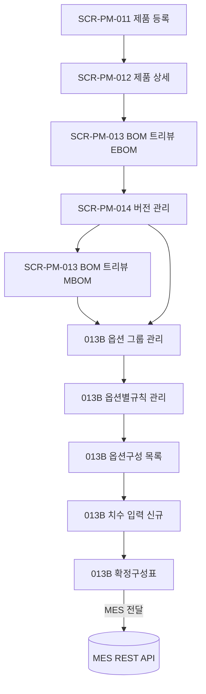
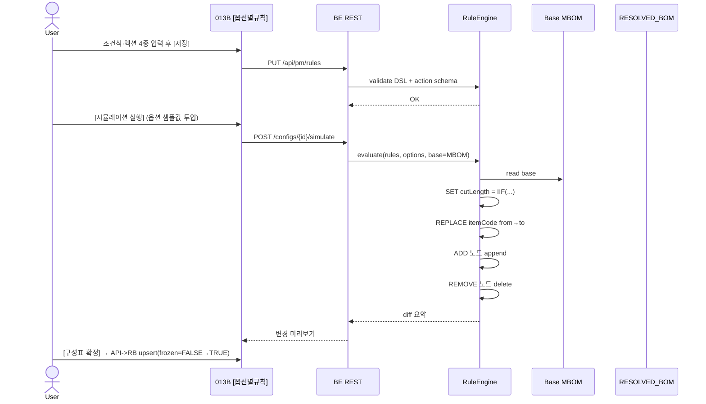
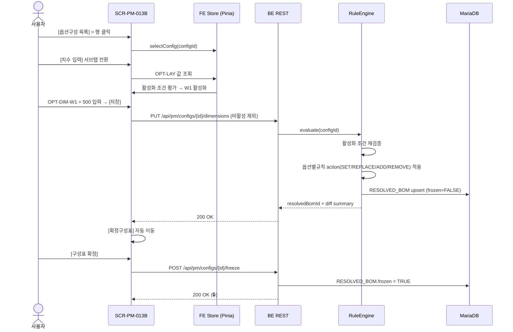

# BOM 관리

> [!abstract]
> 포함 화면: **SCR-PM-013** BOM 트리뷰(자재구성/공정구성 모드), **SCR-PM-014** BOM 버전 관리, **SCR-PM-013B** 옵션구성 / 확정구성표(**5개 서브탭** — v1.5 개정). v1.5 핵심: NUMERIC 옵션 치수 입력 서브탭 신설, enablement_condition 조건부 활성화, 옵션별규칙 action 동사 4종(SET/REPLACE/ADD/REMOVE) 카드 편집, 확정구성표 컬럼 확장.

## 화면 목록

| 화면 ID | 화면명 | 경로 | 관련 요구사항 | v1.5 변경 |
|---------|--------|------|-------------|-----------|
| SCR-PM-013 | BOM 트리뷰 | /products/:productCode/bom | FR-PM-006,010,011 | UI 용어 검수(자재구성/공정구성) |
| SCR-PM-014 | BOM 버전 관리 | /products/:productCode/bom/versions | FR-PM-012 | 상태 3단계(DRAFT/RELEASED/DEPRECATED) |
| SCR-PM-013B | 옵션구성 / 확정구성표 | /products/:productCode/bom/configs | FR-PM-010,011,012,013 | 4→5 서브탭, action 카드 UI, 컬럼 확장 |

## BOM 구성 워크플로우

```
사전준비: 자재 등록(SCR-PM-001~004) + 공정 등록(SCR-PM-007~009)
     ↓
STEP 1: 제품 등록 (SCR-PM-011)
     ↓
STEP 2: SCR-PM-012 > [자재/공정구성] > 자재구성(EBOM)
     → SCR-PM-013 자재구성(EBOM) 모드 (기능군 트리·드래그&드롭·수량)
     ↓
STEP 3: SCR-PM-012 > [버전이력] → SCR-PM-014 (자재구성 버전 RELEASED)
     ⚡ 공정구성(MBOM) 초안 자동 생성
     ↓
STEP 4: SCR-PM-013 공정구성(MBOM) 모드 (조립체·공정·작업순서·로스율)
     ┃ 병행
STEP 5: SCR-PM-013B > [옵션 그룹 관리] (옵션 차원·값·조건)
     ↓
STEP 6: SCR-PM-013B > [옵션별규칙 관리] (조건식 + 액션 4종)
     ↓
STEP 7: SCR-PM-013B > [옵션구성 목록] (옵션 선택·제약 검증)
     ↓ 치수 필요 시
STEP 7b: [치수 입력] 서브탭 (OPT-DIM, 조건부 활성화) — v1.5 신규
     ↓
STEP 8: [확정구성표] (요약·변경 하이라이트 → MES 전달 → RELEASED)
```

### 단계별 화면 매핑



---

## SCR-PM-013 BOM 트리뷰

| 항목 | 내용 |
|------|------|
| 경로 | /products/:productCode/bom |
| 요구사항 | FR-PM-006, 010, 011 |
| 진입 | SCR-PM-012 > [자재/공정구성] 탭 |
| 권한 | 조회 ROLE_USER / 편집 ROLE_BOM_EDITOR |

**레이아웃**

```
┌──────────────────────────────────────────────────────────┐
│ 제품: DHS-AE225-D-1  │ BOM 유형: [자재구성(EBOM) ▼]       │
│ 버전: v3 (RELEASED)   │ 총 품목: 47개 │ MES: 🟢 전달 중     │
├────────────┬─────────────────────┬───────────────────────┤
│ [자재 검색] │ [BOM 트리]           │ [선택 노드 상세]       │
│ 🔍 [검색]  │ ▼ 📦 미서기 이중창    │ 품목코드 / 품목명      │
│ R-01-001   │   ▼ 🔧 창틀 조립체    │ 유형(ASSEMBLY/PART…)   │
│ R-02-001   │     ├ 상틀 프로파일   │ 수량 / 단위            │
│ ASY-FRM-.. │     ├ 하틀 프로파일   │ 공정 / 작업순서/작업장 │
│ (드래그→)  │     └ 좌·우틀        │ 로스율 / 실소요량      │
│            │   ▼ 외측 창짝        │                        │
│            │   ▼ 하드웨어/밀봉/방충│ [노드 추가] [삭제]    │
├────────────┴─────────────────────┴───────────────────────┤
│ [전체펼침] [전체접기] [소요량 요약] [BOM 비교] [버전 저장] │
└──────────────────────────────────────────────────────────┘
```

> **MES 연동 상태 배지:** 🟢 RELEASED 옵션구성 존재 시 "확정구성표 전달 중". 없으면 배지 미표시.

### 기능 상세

| 기능 | 설명 |
|------|------|
| 트리 표시 | 자재구성(EBOM, 기능군 기준) / 공정구성(MBOM, 조립체 기준) 전환 |
| 드래그&드롭 | 계층 이동/순서 변경 (FR-PM-011) |
| 노드 추가/삭제 | 자재 검색 팝업·확인 다이얼로그 |
| 자재 소요량 | 이론수량·로스율·실소요량 우측 패널 표시 (FR-PM-006) |
| 소요량 요약 | 플랫 테이블(품목별/공정별 집계) |
| BOM 비교 | 두 버전 차이 시각 비교(추가/삭제/변경 하이라이트) |
| 버전 저장 | 현재 BOM을 새 버전으로 (FR-PM-012) |
| 색상 코딩 | L0 파랑 / L1 회색 / L2+ 초록 |
| 인라인 수량 편집 | 더블클릭 시 편집 모드 |
| 우클릭 메뉴 | 위/아래 이동·복사·삭제 |

### 자재구성(EBOM) 모드 — 설계 관점 (기능군 기준)

Level 1 = 기능군: 구조부(E-STR) / 유리부(E-GLZ) / 개폐부(E-HDW) / 밀봉부(E-SEL) / 방충부(E-SCR).

```
▼ 📦 미서기 이중창 1SET (L0)
  ▼ 🏗 구조부 (E-STR-001, L1)
    ├ 상틀 프로파일 (L2)  수량: 1EA
    ├ 하틀 / 좌틀 / 우틀 / 멀리언
  ▼ 🪟 유리부 (E-GLZ-001)
    └ 복층유리 IGU (L2) 수량: 4EA
  ▼ 🔧 개폐부 (E-HDW-001)
    ├ 호차 Roller 수량: 8EA
    └ 크리센트 세트 수량: 2SET
  ▼ 🔒 밀봉부 (E-SEL-001)
    ├ 모헤어 / 가스켓 / 실리콘
  └ 🪤 방충부 (E-SCR-001)
```

**자재구성(EBOM) 우측 패널 필드**

| 필드 | 설명 |
|------|------|
| 품목코드 | E-접두어 (E-STR/E-GLZ/E-HDW/E-SEL/E-SCR) |
| 유형 | FUNCTIONAL_GROUP(L1) / PART(L2) / RAW_MATERIAL(L3) |
| 분류 | 구조부/유리부/개폐부/밀봉부/방충부 |
| 설계 수량 | 이론 소요량 |
| 규격 | W×H×D / 재질 / 사양 |
| 대체 가능 부품 | 호환 부품 목록 |
| 공정구성 매핑 | 대응 공정구성(MBOM) 노드 |

### 공정구성(MBOM) 모드 — 제조 관점 (조립체 기준)

Level 1 = 주요 조립체(ASY-FRM/ASY-SSH-OUT 등). 공정구성(MBOM) 우측 패널 필드(용어사전 v1.3 §3):

| 필드 | 설명 |
|------|------|
| 품목코드 | ASY/FRM/GLS/HDW/SEL/SCR/MAT 접두 |
| 유형 | ASSEMBLY / PART / RAW_MATERIAL |
| theoreticalQty / actualQty | 이론·실소요량 |
| lossRate | 손실 비율(0.0~1.0) |
| workOrder / workCenter | 작업 순서·작업장(WC-FRAME 등) |
| processCode | PRC-CUT/WLD/ASY 등 |
| locationCode | 위치 인스턴스 코드(H01, W01 등, 없으면 null) |
| cutDirection | 절단 방향 (W/H/W1/H1/H2/H3 또는 null) |
| cutLengthFormula / cutLengthFormula2 / cutQtyFormula | 산식 표현식 |

### 자재↔공정 연결 관리

자재구성(EBOM) 노드 선택 시 "대응 공정구성(MBOM) 노드" 목록을 우측 하단에 표시. 매핑 유형: 1:1 / 1:N / N:1.

---

## SCR-PM-014 BOM 버전 관리

| 항목 | 내용 |
|------|------|
| 경로 | /products/:productCode/bom/versions |
| 요구사항 | FR-PM-012 |
| 진입 | SCR-PM-012 > [버전이력] 탭 |

**레이아웃**

```
┌──────────────────────────────────────────────────────────┐
│ 제품: DHS-AE225-D-1                                       │
│ [자재구성(EBOM) 버전] [공정구성(MBOM) 버전]  ← 서브탭      │
├──────────────────────────────────────────────────────────┤
│ 버전 │ 상태      │ 품목수│ 생성일│ 생성자│ 변경 내용       │
│ v3   │ RELEASED  │ 47   │ 04.01│ 김진호│ 방충망 추가     │
│ v2   │ DEPRECATED│ 43   │ 03.20│ 김진호│ 유리 규격 변경   │
│ v1   │ DEPRECATED│ 38   │ 03.10│ 김진호│ 초기 BOM        │
│                                                          │
│ [선택 버전 → BOM 보기] [버전 비교] [상태 변경 ▼]          │
│ 상태 워크플로우: DRAFT → RELEASED → DEPRECATED             │
│ RELEASED BOM 직접 수정 불가 — 새 버전 생성 필요            │
└──────────────────────────────────────────────────────────┘
```

> 상태 3단계(DRAFT/RELEASED/DEPRECATED)는 용어사전 v1.3 §4 및 DE35-1 v1.4 기준. 기존 5단계(APPROVED/ARCHIVED 포함)는 폐기.

---

## SCR-PM-013B 옵션구성 / 확정구성표 (v1.5 전면 개정)

| 항목 | 내용 |
|------|------|
| 경로 | /products/:productCode/bom/configs |
| 요구사항 | FR-PM-010, 011, 012, 013 |
| 진입 | SCR-PM-012 > [옵션구성] 탭 |

### 서브탭 구성 (v1.5 — 4→5개 확장)

```
[옵션구성 목록] [치수 입력] [옵션 그룹 관리] [옵션별규칙 관리] [확정구성표]
       1           2(신규)        3                4                  5
```

---

### 9.3.1 옵션구성 목록 서브탭

옵션구성(Config, `PRODUCT_CONFIG`) 목록. DRAFT → RESOLVED → RELEASED 3단계.

```
┌──────────────────────────────────────────────────────────┐
│ [+ 옵션구성 추가]                                          │
│ 구성 ID │ 구성명              │ 옵션 조합 │ 치수 요약 │ 상태 │
│ CFG-001 │ 2편창/사선/로이/AL/화이트│ 1x2,M45..│ W=1500,H=1200 │ RELEASED │
│ CFG-002 │ 2편창/직각/로이/AL/브라운│ 1x2,BUTT.│ W=1800,H=1200 │ RELEASED │
│ CFG-003 │ 3편창/일반/AL/그레이   │ 1x3,M45..│ W1=500,H=1200 │ DRAFT    │
│  ⚠ enablement 경고 (W1 충돌 시)                            │
└──────────────────────────────────────────────────────────┘

[옵션구성 추가] 시 옵션 그룹별 드롭다운:
 OPT-LAY [1x2▼] OPT-CUT [M45▼] OPT-GLZ [LOW-E▼]
 OPT-MAT [AL▼]  OPT-FIN [화이트▼] OPT-ACC [방충망▼]
```

> v1.5 변경: **치수 요약** 컬럼 추가 (OPT-DIM 값), **enablement 경고** 뱃지(선택한 OPT-LAY와 충돌 DIM 잔존 시 ⚠).

---

### 9.3.2 [치수 입력] 서브탭 (v1.5 신규 — NUMERIC 옵션)

용어사전 v1.3 §11.1 `OPT-DIM` 그룹 전용. ENUM 드롭다운이 아닌 **숫자 입력 + 단위 + 범위 검증 + 조건부 활성화**.

```
┌──────────────────────────────────────────────────────────┐
│ [옵션구성 목록] [치수 입력] [옵션 그룹] [옵션별규칙] ...   │
├──────────────────────────────────────────────────────────┤
│ 대상 옵션구성: CFG-003 (3편창/일반/AL/브라운)              │
│ 표준 치수 프리셋: [선택 ▼] (225 이중창 표준 1500×1200 등) │
├──────────────────────────────────────────────────────────┤
│ ┌─ 전체 치수 (필수) ──────────────────────────────┐     │
│ │ OPT-DIM-W  폭 (mm)*   [ 1500 ]  범위: 600~4000  │     │
│ │ OPT-DIM-H  높이 (mm)* [ 1200 ]  범위: 600~3000  │     │
│ └──────────────────────────────────────────────────┘     │
│                                                          │
│ ┌─ 편창 분할 치수 (OPT-LAY 에 따라 조건부 활성화) ─┐     │
│ │ ✓ 현재 OPT-LAY = 'W1XH1-3편' → W1 활성화         │     │
│ │                                                  │     │
│ │ OPT-DIM-W1 1편 폭 (mm)  [ 500 ]  범위: 300~1500 │     │
│ │ OPT-DIM-H1 1단 높이(mm) [1200 ]  범위: 400~2000 │     │
│ │                                                  │     │
│ │ OPT-DIM-H2 2단 높이(mm) [(비활성)] 🚫            │     │
│ │   ⓘ OPT-LAY가 'W1XH2-…' 일 때만 활성화          │     │
│ │ OPT-DIM-H3 3단 높이(mm) [(비활성)] 🚫            │     │
│ │   ⓘ OPT-LAY가 'W1XH3-…' 일 때만 활성화          │     │
│ └──────────────────────────────────────────────────┘     │
│                                                          │
│ ⚠ 비활성 필드는 저장 시 전송되지 않습니다.                 │
│   서버 RuleEngine이 활성화 조건을 재검증합니다.            │
│                                                          │
│            [초기화] [치수 검증] [저장]                    │
└──────────────────────────────────────────────────────────┘
```

> [!warning] 활성화 조건 UX 규칙 (v1.3 §11.2)
> - 비활성 필드: HTML `disabled` + 읽기전용 회색. 키보드 포커스 금지, submit payload 에서 key 제외.
> - 툴팁: 호버 시 활성화 조건 고정 노출 (예: "OPT-LAY = 'W1XH1-3편' 일 때만 입력 가능").
> - **사용자 노출 금지 용어:** `enablement_condition` 은 UI 문구로 노출하지 않음 — "활성화 조건" 자연어로만 표기.
> - BE 재검증: FE가 값을 제외해 전송해도 RuleEngine이 `OPTION_VALUE.enablement_condition` 을 재평가. 불일치 시 422.

**표준 치수 프리셋 드롭다운 예시**

| 프리셋 ID | 계열 | W | H | W1 | H1 | H2 | H3 |
|-----------|------|---|---|----|----|----|----|
| PRESET-AE225-D-STD | 225 이중창 표준 | 1500 | 1200 | — | — | — | — |
| PRESET-AE225-D-LRG | 225 이중창 대형 | 2400 | 2400 | — | — | — | — |
| PRESET-AE225-3W-STD | 225 3편창 표준 | 2100 | 1200 | 700 | — | — | — |

---

### 9.3.3 옵션 그룹 관리 서브탭

옵션 그룹(`OPTION_GROUP`) 및 옵션 값(`OPTION_VALUE`) 마스터 관리. v1.5에서 `valueType`(ENUM/NUMERIC) 컬럼, `enablement_condition` 식 편집기 추가.

```
┌─ OPT-DIM-W1 옵션 그룹 상세 ──────────────────────────┐
│ 그룹 코드:   OPT-DIM-W1                               │
│ 그룹명:      1편 폭                                    │
│ valueType:  [NUMERIC ▼]                               │
│ 단위 (unit): [mm ▼]                                    │
│ numeric_min: [ 300 ]  numeric_max: [ 1500 ]           │
│                                                        │
│ 활성화 조건 식 (enablement_condition 내부용):         │
│ ┌────────────────────────────────────────────────────┐│
│ │ OPT-LAY IN ('W1XH1-3편','W1XH2-3편','W1XH3-3편')  ││
│ └────────────────────────────────────────────────────┘│
│ [조건 문법 도움말]                                     │
└────────────────────────────────────────────────────────┘
```

ENUM 그룹(OPT-LAY/OPT-CUT/OPT-GLZ/OPT-MAT/OPT-FIN/OPT-ACC)은 OPTION_VALUE 목록 CRUD 테이블로 표시. `is_default=true` 기본값 표시.

---

### 9.3.4 옵션별규칙 관리 서브탭 — action 카드 UI (v1.5 전면 개정)

용어사전 v1.3 §13.2 확정 **동사 4종**: `SET` / `REPLACE` / `ADD` / `REMOVE`. 각 verb에 따라 폼이 다르게 렌더링.

```
┌─ 규칙: BR5-3편창-W1활성 ──────────────────────────────┐
│ 조건식: OPT-LAY = 'W1XH1-3편'                          │
│ 우선순위: [ 2 ]  BOM 유형: [ 공정구성(MBOM) ▼ ]          │
│ 규칙 유형: [OPTION ▼]  (OPTION / DERIVATIVE)           │
├────────────────────────────────────────────────────────┤
│ 액션 목록 (카드 배열)              [+ 액션 추가 ▼]     │
│                                                        │
│ ┌─ 액션 #1 [SET] ───────────────────── [✎][✕] ──┐   │
│ │ target: MBOM.node[itemCode=FRM-MUL-W1]        │   │
│ │ field:  cutLength                              │   │
│ │ value:  [IIF(OPT-LAY='W1XH1-3편', OPT-DIM-W1, 0)]│  │
│ │ [변수 자동완성: W H W1 H1 H2 H3] [IIF 삽입]   │   │
│ └────────────────────────────────────────────────┘   │
│                                                        │
│ ┌─ 액션 #2 [REPLACE] ─────────────────── [✕] ──┐    │
│ │ target: MBOM.node[itemCode=GLS-OUT-P1]       │    │
│ │ from:   [GLS-OUT-P1 ▼]                        │    │
│ │ to:     [GLS-OUT-P1-LOWE ▼]                   │    │
│ └────────────────────────────────────────────────┘   │
│                                                        │
│ ┌─ 액션 #3 [ADD] ──────────────────────── [✕] ──┐    │
│ │ item: {                                        │   │
│ │   itemCode: [CPL-MUL-001 ▼]                    │   │
│ │   itemName: 연결 멀리언                         │   │
│ │   quantity: [2]  unit: [EA ▼]                  │   │
│ │   cutLength: [ ]  (조건부 입력)                 │   │
│ │ }                                              │   │
│ └────────────────────────────────────────────────┘   │
│                                                        │
│ ┌─ 액션 #4 [REMOVE] ──────────────────── [✕] ──┐    │
│ │ target: MBOM.node[itemCode=FRM-RGT-001]      │    │
│ └────────────────────────────────────────────────┘   │
│                                                        │
│                             [취소] [저장]             │
└────────────────────────────────────────────────────────┘
```

**verb별 필수 필드**

| verb | 필수 입력 | 비고 |
|------|----------|------|
| `SET` | target·field·value (리터럴 또는 산식) | 변수(W/H/W1/H1/H2/H3) 자동완성, `IIF(...)` 템플릿 |
| `REPLACE` | target·from(itemCode)·to(itemCode) | from/to는 ITEM 마스터 드롭다운 |
| `ADD` | item 구성 객체(itemCode/itemName/quantity/unit/cutLength…) | 서브 폼 |
| `REMOVE` | target (MBOM 선택자) | |

> [!tip] 산식 에디터
> - 변수: `W`, `H`, `W1`, `H1`, `H2`, `H3`
> - 함수: `IIF(condition, ifTrue, ifFalse)`, `MIN`, `MAX`, `ROUND`
> - 실시간 문법 검증. 참조하는 OPT-DIM이 조건식에서 활성 상태가 아니면 경고 뱃지.

#### action 동사 4종 적용 시퀀스



---

### 9.3.5 확정구성표 (Resolved BOM) 서브탭 — 컬럼 확장 (v1.5)

v1.3 §3 신규 속성 전면 반영.

> [!info] `resolvedBomId` 산출 기준 안내
> 확정구성표 ID(`resolvedBomId` / `applied_options_hash`)는 **ENUM 옵션만** 해시 산출에 포함되고 **NUMERIC 옵션(W/H 등 치수)은 제외**됩니다. 따라서 같은 제품·같은 ENUM 옵션 조합이면 W/H 가 달라도 `resolvedBomId` 가 동일합니다. NUMERIC 치수는 별도 snapshot 필드(`actualCutLength` 등)로 frozen 됩니다. 자세한 산출 규칙은 [[WIMS_용어사전_BOM_v1.3]] §4.1 참조.

```
┌────────────────────────────────────────────────────────────────┐
│ 구성: CFG-003 (3편창/일반/AL/브라운 · W1=500 · H=1200)         │
│ 상태: RELEASED │ frozen: ✅ │ 적용 규칙: 7개 │ 총 품목: 62개   │
│ [공급 구분 ▼] [전체 / 공통 / 외창 / 내창]                       │
├────────────────────────────────────────────────────────────────┤
│🔒│자재분류   │품목코드      │공급 │절단방향│절단길이│2차길이│개수│실절단│
│──┼──────────┼─────────────┼────┼───────┼───────┼──────┼───┼─────│
│🔒│[PROFILE] │FRM-TOP-001  │공통│ W ↔  │1500   │ —    │ 2 │1560│
│🔒│[PROFILE] │FRM-MUL-W1   │공통│ H ↕  │1200   │ —    │ 2 │1248│
│🔒│[GLASS]   │GLS-OUT-P1   │외창│ —    │ 485   │1185  │ 2 │ — │
│🔒│[HARDWARE]│HDW-LCK-001  │공통│ —    │ —     │ —    │ 2 │ — │
│  │[CONSUMABLE]│MAT-SIL-001│공통│ —    │ —     │ —    │ - │ - │
├────────────────────────────────────────────────────────────────┤
│ 범례: 🔒 = frozen=TRUE (편집 불가)                              │
│ 절단길이 = cutLength (evaluated snapshot)                       │
│ 실절단  = actualCutLength = cutLength × (1 + lossRate)          │
│ 2차길이 = cutLength2 (GLASS 카테고리만)                          │
├────────────────────────────────────────────────────────────────┤
│ [소요량 요약] [Base BOM 비교] [PDF 내보내기] [MES 전달]         │
└────────────────────────────────────────────────────────────────┘
```

**컬럼 매핑 (용어사전 v1.3 §3)**

| UI 레이블 | 필드 | 소스 | 표시 규칙 |
|-----------|------|------|----------|
| 🔒 | frozen | RESOLVED_BOM_ITEM.frozen | TRUE 시 아이콘, 편집 비활성 |
| 자재분류 | itemCategory | ITEM.item_category | 뱃지(PROFILE/GLASS/HARDWARE/CONSUMABLE/SEALANT/SCREEN) |
| 공급 | supplyDivision | RESOLVED_BOM_ITEM.supply_division | 탭/필터: 공통/외창/내창 |
| 절단 방향 | cutDirection | RESOLVED_BOM_ITEM.cut_direction | W(↔) / H(↕) 아이콘 |
| 절단 길이 | cutLength (evaluated) | RESOLVED_BOM_ITEM.cut_length_evaluated | mm, snapshot. PROFILE/GLASS |
| 2차 길이 | cutLength2 | RESOLVED_BOM_ITEM.cut_length_formula_2_evaluated | GLASS만 표시 |
| 개수 | cutQty | RESOLVED_BOM_ITEM.cut_qty_evaluated | 절단 개수 |
| 실절단 | actualCutLength | 파생(cutLength × (1+lossRate)) | §3.1 |

> [!warning] frozen 불변성
> 확정구성표가 `frozen=TRUE`로 저장되면 모든 행은 편집 불가(🔒). 값 변경은 새 옵션구성(Config) 생성으로만 가능.

---

## 옵션구성 → RuleEngine → 확정구성표 (정상 흐름 시퀀스)



## 관련 문서

- [[DE22-1_화면설계서_v1.5]] (메인)
- [[DE22-1_화면설계서/sections/04_제품관리]] — 제품·파생제품 허브
- [[DE22-1_화면설계서/sections/03_공정관리]] — 공정 마스터
- [[DE22-1_화면설계서/sections/01_자재관리]] — 자재 마스터
- [[WIMS_용어사전_BOM_v1.3]] — §3 MBOM 속성·§4 버전·§11 옵션·§13 action
- [[DE35-1_미서기이중창_표준BOM구조_정의서_v1.5]]
- [[DE24-1_인터페이스설계서_MES_REST_API_v1.8]] — `/api/external/v1/bom/resolved/{resolvedBomId}`
- [[V4_비즈니스규칙_수용성]] — BR5 3편창 W1 조건부 활성화
