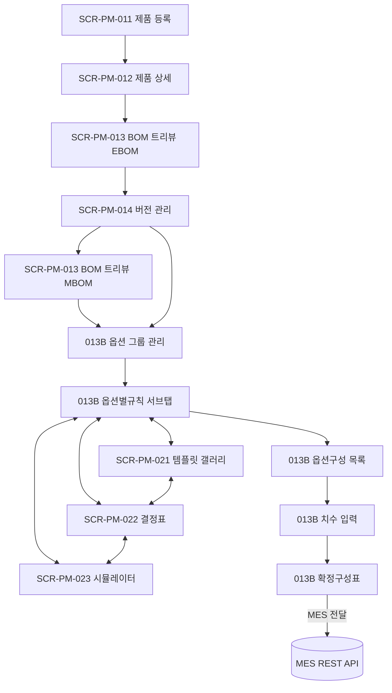
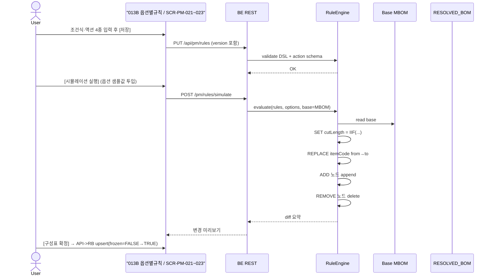
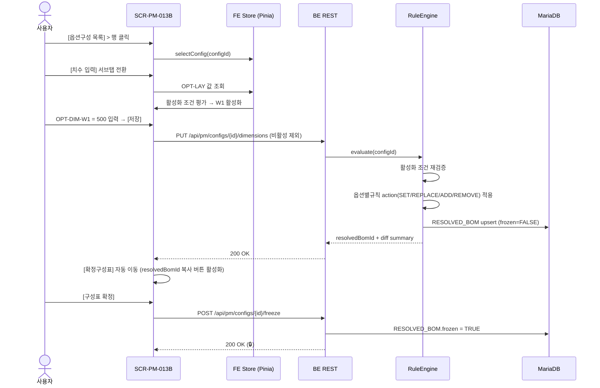

# BOM 관리

> [!abstract]
> 포함 화면: **SCR-PM-013** BOM 트리뷰 (+가상스크롤·검색·미니맵 보강), **SCR-PM-013B** 옵션 구성 / 확정 구성표 (5 서브탭·초보/숙련 모드 토글), **SCR-PM-014** BOM 버전 관리, **SCR-PM-021** 옵션별규칙 템플릿 갤러리 (신규, FR-PM-025), **SCR-PM-022** 옵션별규칙 결정표 (신규, FR-PM-026), **SCR-PM-023** 옵션별규칙 시뮬레이터 (신규, FR-PM-027).

## 화면 목록

| 화면 ID | 화면명 | 경로 | 관련 요구사항 | v1.6 변경 |
|---------|--------|------|-------------|-----------|
| SCR-PM-013 | BOM 트리뷰 | /products/:productCode/bom | FR-PM-006, 010, 011 | 가상 스크롤·전체 검색·경로 필터·미니맵 보강 |
| SCR-PM-013B | 옵션 구성 / 확정 구성표 | /products/:productCode/bom/configs | FR-PM-010, 011, 012, 013 | 초보/숙련 모드 토글, `resolvedBomId` 컬럼, 3뷰 동기화 원칙 |
| SCR-PM-014 | BOM 버전 관리 | /products/:productCode/bom/versions | FR-PM-012 | 관련 화면에 SCR-PM-021/022/023 추가 |
| **SCR-PM-021** | **옵션별규칙 템플릿 갤러리** | **/products/:productCode/rules/templates** | **FR-PM-025** | **신규 (v1.6 승격)** |
| **SCR-PM-022** | **옵션별규칙 결정표** | **/products/:productCode/rules/decision-table** | **FR-PM-026** | **신규 (v1.6 승격)** |
| **SCR-PM-023** | **옵션별규칙 시뮬레이터** | **/products/:productCode/rules/simulate** | **FR-PM-027** | **신규 (v1.6 승격)** |

> [!info] v1.6 핵심 변경 — 옵션별규칙 3뷰의 독립 SCR 승격
> v1.5 까지 SCR-PM-013B 내부 `[옵션별규칙]` 서브탭의 **3뷰 (📋 템플릿 갤러리 / 📊 결정표 / ⚙️ 전문가/시뮬레이터)** 로만 노출되던 FR-PM-025/026/027 을 **독립 SCR (SCR-PM-021/022/023)** 으로 승격. 기능은 동일하며 **두 개의 진입 경로가 공존**한다.
> - **서브탭 경로** (일반 흐름): 옵션값 → 옵션 그룹 → 옵션별규칙 → 옵션구성 → 확정을 연속 편집하는 PM 일반 사용자 흐름.
> - **독립 URL 경로** (심화 사용): 파워유저 / 딥링크 / 외부 문서 참조 / 북마크 / Phase 2 OM·ES 화면에서의 역참조.
> - 두 경로 모두 **동일한 `BOM_RULE` 엔티티** 를 조작한다 (§9.3.4 동기화 원칙 참조).

## BOM 구성 워크플로우

```
사전준비: 자재 등록(SCR-PM-001~004) + 공정 등록(SCR-PM-007 [기본정보]/[규격·단가] 탭)
     ↓
STEP 1: 제품 등록 (SCR-PM-011)
     ↓
STEP 2: SCR-PM-012 > [자재/공정구성] > 자재구성(EBOM)
     → SCR-PM-013 자재구성(EBOM) 모드 (기능군 트리·드래그&드롭·수량)
     ↓
STEP 3: SCR-PM-012 > [버전이력] → SCR-PM-014 (자재구성 버전 RELEASED)
     ⚡ 공정구성(MBOM) 초안 자동 생성
     ↓
STEP 4: SCR-PM-013 공정구성(MBOM) 모드 (조립체·공정·작업순서·로스율)
     ┃ 병행
STEP 5: SCR-PM-013B > [옵션 그룹 관리] (옵션 차원·값·조건)
     ↓
STEP 6: SCR-PM-013B > [옵션별규칙 관리] (3뷰 체계)
        ↔ 동등: SCR-PM-021(템플릿) / SCR-PM-022(결정표) / SCR-PM-023(시뮬레이터) 독립 URL
     ↓
STEP 7: SCR-PM-013B > [옵션구성 목록] (옵션 선택·제약 검증)
     ↓ 치수 필요 시
STEP 7b: [치수 입력] 서브탭 (OPT-DIM, 조건부 활성화)
     ↓
STEP 8: [확정구성표] (요약·resolvedBomId 발급 → MES 전달 → RELEASED)
```

### 단계별 화면 매핑



---

## SCR-PM-013 BOM 트리뷰

| 항목 | 내용 |
|------|------|
| 경로 | /products/:productCode/bom |
| 요구사항 | FR-PM-006, 010, 011 |
| 진입 | SCR-PM-012 > [자재/공정구성] 탭 |
| 권한 | 조회 ROLE_PM_VIEWER / 편집 ROLE_PM_EDITOR |

**레이아웃**

```
┌───────────────────────────────────────────────────────────────┐
│ 제품: DHS-AE225-D-1  │ BOM 유형: [자재구성(EBOM) ▼]             │
│ 버전: v3 (RELEASED)   │ 총 품목: 47개 │ MES: 🟢 전달 중          │
├──────────────┬──────────────────────────┬─────────────────────┤
│ [자재 검색]  │ [BOM 트리 🔍 전체 검색]  │ [선택 노드 상세]     │
│ 🔍 [검색]    │ pill: [공급구분 ▾][자재 │ 품목코드 / 품목명    │
│ R-01-001     │  분류 ▾][절단방향 ▾]    │ 유형(ASSEMBLY/PART…) │
│ R-02-001     │ ▼ 📦 미서기 이중창       │ 수량 / 단위          │
│ ASY-FRM-..   │   ▼ 🔧 창틀 조립체       │ 공정 / 작업순서/작업장│
│ (드래그→)    │     ├ 상틀 프로파일      │ 로스율 / 실소요량    │
│              │     ├ 하틀 프로파일      │                      │
│              │     └ 좌·우틀            │ [노드 추가] [삭제]   │
│              │   ▼ 외측 창짝            │                      │
│              │   ▼ 하드웨어/밀봉/방충   │                      │
│              │                          │                      │
│              │ ┌─ 미니맵 ─────┐ (우하단)│                      │
│              │ │ ■■□□□ 스크롤 │         │                      │
│              │ └──────────────┘         │                      │
├──────────────┴──────────────────────────┴─────────────────────┤
│ [전체펼침] [전체접기] [소요량 요약] [BOM 비교] [버전 저장]     │
└───────────────────────────────────────────────────────────────┘
```

> **MES 연동 상태 배지:** 🟢 RELEASED 옵션구성 존재 시 "확정구성표 전달 중". 없으면 배지 미표시.

> [!info] BOM 트리뷰 성능·탐색 전략 (v1.6 신설)
> - **가상 스크롤**: 100+ 노드 시 `<VirtualizedTree>` 로 전환 (viewport 내 노드만 렌더). 라이브러리: `@tanstack/react-virtual` 또는 Vue 동등 라이브러리 검토.
> - **펼침 상태 persist**: localStorage + productCode 키로 펼침/접힘 상태 세션 간 유지. 키 포맷: `wims.bomtree.expand.{productCode}.{bomType}`.
> - **전체 검색**: 트리 상단 검색창. itemCode·itemName·processCode 매칭 노드 하이라이트 + 자동 스크롤. 검색어 하이라이트는 `<mark>` 로 표시.
> - **경로 필터 pill**: 공급구분(공통/외창/내창) · 절단방향(W/H/W1/H1/H2/H3) · 자재분류(PROFILE/GLASS/HARDWARE/CONSUMABLE/SEALANT/SCREEN) 별 필터 pill. 복합 선택 가능 (AND 결합).
> - **미니맵**: 우측 하단 스크롤 위치 표시 (DE11-1 §SVG 트리맵 활용). 클릭 시 해당 영역으로 점프.

### 기능 상세

| 기능 | 설명 |
|------|------|
| 트리 표시 | 자재구성(EBOM, 기능군 기준) / 공정구성(MBOM, 조립체 기준) 전환 |
| 드래그&드롭 | 계층 이동/순서 변경 (FR-PM-011) |
| 노드 추가/삭제 | 자재 검색 팝업·확인 다이얼로그 |
| 자재 소요량 | 이론수량·로스율·실소요량 우측 패널 표시 (FR-PM-006) |
| 소요량 요약 | 플랫 테이블(품목별/공정별 집계) |
| BOM 비교 | 두 버전 차이 시각 비교(추가/삭제/변경 하이라이트) |
| 버전 저장 | 현재 BOM을 새 버전으로 (FR-PM-012) |
| 색상 코딩 | L0 파랑 / L1 회색 / L2+ 초록 |
| 인라인 수량 편집 | 더블클릭 시 편집 모드 |
| 우클릭 메뉴 | 위/아래 이동·복사·삭제 |
| **가상 스크롤** | 100+ 노드 시 viewport 기반 가상화 렌더. 스크롤 p95 < 16ms 유지. |
| **펼침 persist** | 펼침·접힘 상태를 localStorage 에 productCode·bomType 단위로 저장. |
| **전체 검색** | 트리 상단 검색창. itemCode·itemName·processCode 매칭. 결과 하이라이트 + 자동 스크롤 이동. |
| **경로 필터** | pill 식 필터 (공급구분·절단방향·자재분류). 복합 AND. 비매칭 노드 dim 처리. |
| **미니맵** | 우측 하단 트리 전체 스케일 축소 뷰. 현재 viewport 사각형 표시. 클릭 점프 지원. |

### 자재구성(EBOM) 모드 — 설계 관점 (기능군 기준)

Level 1 = 기능군: 구조부(E-STR) / 유리부(E-GLZ) / 개폐부(E-HDW) / 밀봉부(E-SEL) / 방충부(E-SCR).

```
▼ 📦 미서기 이중창 1SET (L0)
  ▼ 🏗 구조부 (E-STR-001, L1)
    ├ 상틀 프로파일 (L2)  수량: 1EA
    ├ 하틀 / 좌틀 / 우틀 / 멀리언
  ▼ 🪟 유리부 (E-GLZ-001)
    └ 복층유리 IGU (L2) 수량: 4EA
  ▼ 🔧 개폐부 (E-HDW-001)
    ├ 호차 Roller 수량: 8EA
    └ 크리센트 세트 수량: 2SET
  ▼ 🔒 밀봉부 (E-SEL-001)
    ├ 모헤어 / 가스켓 / 실리콘
  └ 🪤 방충부 (E-SCR-001)
```

**자재구성(EBOM) 우측 패널 필드**

| 필드 | 설명 |
|------|------|
| 품목코드 | E-접두어 (E-STR/E-GLZ/E-HDW/E-SEL/E-SCR) |
| 유형 | FUNCTIONAL_GROUP(L1) / PART(L2) / RAW_MATERIAL(L3) |
| 분류 | 구조부/유리부/개폐부/밀봉부/방충부 |
| 설계 수량 | 이론 소요량 |
| 규격 | W×H×D / 재질 / 사양 |
| 대체 가능 부품 | 호환 부품 목록 |
| 공정구성 매핑 | 대응 공정구성(MBOM) 노드 |

### 공정구성(MBOM) 모드 — 제조 관점 (조립체 기준)

Level 1 = 주요 조립체(ASY-FRM/ASY-SSH-OUT 등). 공정구성(MBOM) 우측 패널 필드(용어사전 v1.4 §3):

| 필드 | 설명 |
|------|------|
| 품목코드 | ASY/FRM/GLS/HDW/SEL/SCR/MAT 접두 |
| 유형 | ASSEMBLY / PART / RAW_MATERIAL |
| theoreticalQty / actualQty | 이론·실소요량 |
| lossRate | 손실 비율(0.0~1.0) |
| workOrder / workCenter | 작업 순서·작업장(WC-FRAME 등) |
| processCode | PRC-CUT/WLD/ASY 등 |
| locationCode | 위치 인스턴스 코드(H01, W01 등, 없으면 null) |
| cutDirection | 절단 방향 (W/H/W1/H1/H2/H3 또는 null) |
| cutLengthFormula / cutLengthFormula2 / cutQtyFormula | 산식 표현식 |

### 자재↔공정 연결 관리

자재구성(EBOM) 노드 선택 시 "대응 공정구성(MBOM) 노드" 목록을 우측 하단에 표시. 매핑 유형: 1:1 / 1:N / N:1.

---

## SCR-PM-014 BOM 버전 관리

| 항목 | 내용 |
|------|------|
| 경로 | /products/:productCode/bom/versions |
| 요구사항 | FR-PM-012 |
| 진입 | SCR-PM-012 > [버전이력] 탭 |
| 관련 화면 | SCR-PM-013, SCR-PM-013B, **SCR-PM-021, SCR-PM-022, SCR-PM-023** |

**레이아웃**

```
┌──────────────────────────────────────────────────────────┐
│ 제품: DHS-AE225-D-1                                       │
│ [자재구성(EBOM) 버전] [공정구성(MBOM) 버전]  ← 서브탭      │
├──────────────────────────────────────────────────────────┤
│ 버전 │ 상태      │ 품목수│ 생성일│ 생성자│ 변경 내용       │
│ v3   │ RELEASED  │ 47   │ 04.01│ 김진호│ 방충망 추가     │
│ v2   │ DEPRECATED│ 43   │ 03.20│ 김진호│ 유리 규격 변경   │
│ v1   │ DEPRECATED│ 38   │ 03.10│ 김진호│ 초기 BOM        │
│                                                          │
│ [선택 버전 → BOM 보기] [버전 비교] [상태 변경 ▼]          │
│ 상태 워크플로우: DRAFT → RELEASED → DEPRECATED             │
│ RELEASED BOM 직접 수정 불가 — 새 버전 생성 필요            │
└──────────────────────────────────────────────────────────┘
```

> 상태 3단계(DRAFT/RELEASED/DEPRECATED)는 용어사전 v1.4 §4 및 DE35-1 v1.5 기준.

---

## SCR-PM-013B 옵션 구성 / 확정 구성표

| 항목 | 내용 |
|------|------|
| 경로 | /products/:productCode/bom/configs |
| 요구사항 | FR-PM-010, 011, 012, 013 (옵션별규칙 심화 조작은 SCR-PM-021/022/023 으로 위임) |
| 진입 | SCR-PM-012 > [옵션구성] 탭 |

### 서브탭 구성 (5개)

```
[옵션구성 목록] [치수 입력] [옵션 그룹 관리] [옵션별규칙 관리] [확정구성표]
       1           2             3                4                  5
```

> [!note] 초보 모드 (Wizard) / 숙련 모드 (Expert) 토글 — v1.6 신설
> 화면 우상단 토글 **[🎓 Wizard / ⚡ Expert]** 제공.
> - **Wizard (초보 모드)**: 옵션값 → 옵션그룹 → 옵션별규칙 → 옵션구성 → 확정 순차 단계형 **stepper UI**. 각 단계 완료 시에만 다음 단계 활성. 이전 단계 수정 시 이후 단계 경고 뱃지.
> - **Expert (숙련 모드)**: 5 서브탭 병렬 (v1.5 기존 UX). 자유 이동, 독립 편집.
> - 사용자별 선호 `localStorage` 저장 키: `wims.bomconfigs.mode.{userId}`.
> - 첫 진입 기본값: `ROLE_PM_ADMIN`·`ROLE_PM_EDITOR` = Expert / 그 외 = Wizard.

---

### 9.3.1 옵션구성 목록 서브탭

옵션구성(Config, `PRODUCT_CONFIG`) 목록. DRAFT → RESOLVED → RELEASED 3단계.

```
┌──────────────────────────────────────────────────────────┐
│ [+ 옵션구성 추가]                                          │
│ 구성 ID │ 구성명              │ 옵션 조합 │ 치수 요약 │ 상태 │
│ CFG-001 │ 2편창/사선/로이/AL/화이트│ 1x2,M45..│ W=1500,H=1200 │ RELEASED │
│ CFG-002 │ 2편창/직각/로이/AL/브라운│ 1x2,BUTT.│ W=1800,H=1200 │ RELEASED │
│ CFG-003 │ 3편창/일반/AL/그레이   │ 1x3,M45..│ W1=500,H=1200 │ DRAFT    │
│  ⚠ enablement 경고 (W1 충돌 시)                            │
└──────────────────────────────────────────────────────────┘

[옵션구성 추가] 시 옵션 그룹별 드롭다운:
 OPT-LAY [1x2▼] OPT-CUT [M45▼] OPT-GLZ [LOW-E▼]
 OPT-MAT [AL▼]  OPT-FIN [화이트▼] OPT-ACC [방충망▼]
```

> **치수 요약** 컬럼 = OPT-DIM 값, **enablement 경고** 뱃지 = 선택한 OPT-LAY 와 충돌 DIM 잔존 시 ⚠.

---

### 9.3.2 [치수 입력] 서브탭 — NUMERIC 옵션

용어사전 v1.4 §11.1 `OPT-DIM` 그룹 전용. ENUM 드롭다운이 아닌 **숫자 입력 + 단위 + 범위 검증 + 조건부 활성화**.

```
┌──────────────────────────────────────────────────────────┐
│ [옵션구성 목록] [치수 입력] [옵션 그룹] [옵션별규칙] ...   │
├──────────────────────────────────────────────────────────┤
│ 대상 옵션구성: CFG-003 (3편창/일반/AL/브라운)              │
│ 표준 치수 프리셋: [선택 ▼] (225 이중창 표준 1500×1200 등) │
├──────────────────────────────────────────────────────────┤
│ ┌─ 전체 치수 (필수) ──────────────────────────────┐     │
│ │ OPT-DIM-W  폭 (mm)*   [ 1500 ]  범위: 600~4000  │     │
│ │ OPT-DIM-H  높이 (mm)* [ 1200 ]  범위: 600~3000  │     │
│ └──────────────────────────────────────────────────┘     │
│                                                          │
│ ┌─ 편창 분할 치수 (OPT-LAY 에 따라 조건부 활성화) ─┐     │
│ │ ✓ 현재 OPT-LAY = 'W1XH1-3편' → W1 활성화         │     │
│ │                                                  │     │
│ │ OPT-DIM-W1 1편 폭 (mm)  [ 500 ]  범위: 300~1500 │     │
│ │ OPT-DIM-H1 1단 높이(mm) [1200 ]  범위: 400~2000 │     │
│ │                                                  │     │
│ │ OPT-DIM-H2 2단 높이(mm) [(비활성)] 🚫            │     │
│ │   ⓘ OPT-LAY가 'W1XH2-…' 일 때만 활성화          │     │
│ │ OPT-DIM-H3 3단 높이(mm) [(비활성)] 🚫            │     │
│ │   ⓘ OPT-LAY가 'W1XH3-…' 일 때만 활성화          │     │
│ └──────────────────────────────────────────────────┘     │
│                                                          │
│ ⚠ 비활성 필드는 저장 시 전송되지 않습니다.                 │
│   서버 RuleEngine이 활성화 조건을 재검증합니다.            │
│                                                          │
│            [초기화] [치수 검증] [저장]                    │
└──────────────────────────────────────────────────────────┘
```

> [!warning] 활성화 조건 UX 규칙
> - 비활성 필드: HTML `disabled` + 읽기전용 회색. 키보드 포커스 금지, submit payload 에서 key 제외.
> - 툴팁: 호버 시 활성화 조건 고정 노출 (예: "OPT-LAY = 'W1XH1-3편' 일 때만 입력 가능").
> - **사용자 노출 금지 용어:** `enablement_condition` 은 UI 문구로 노출하지 않음 — "활성화 조건" 자연어로만 표기.
> - BE 재검증: FE가 값을 제외해 전송해도 RuleEngine이 `OPTION_VALUE.enablement_condition` 을 재평가. 불일치 시 422.

**표준 치수 프리셋 드롭다운 예시**

| 프리셋 ID | 계열 | W | H | W1 | H1 | H2 | H3 |
|-----------|------|---|---|----|----|----|----|
| PRESET-AE225-D-STD | 225 이중창 표준 | 1500 | 1200 | — | — | — | — |
| PRESET-AE225-D-LRG | 225 이중창 대형 | 2400 | 2400 | — | — | — | — |
| PRESET-AE225-3W-STD | 225 3편창 표준 | 2100 | 1200 | 700 | — | — | — |

---

### 9.3.3 옵션 그룹 관리 서브탭

옵션 그룹(`OPTION_GROUP`) 및 옵션 값(`OPTION_VALUE`) 마스터 관리. `valueType`(ENUM/NUMERIC) 컬럼, `enablement_condition` 식 편집기 포함.

```
┌─ OPT-DIM-W1 옵션 그룹 상세 ──────────────────────────┐
│ 그룹 코드:   OPT-DIM-W1                               │
│ 그룹명:      1편 폭                                    │
│ valueType:  [NUMERIC ▼]                               │
│ 단위 (unit): [mm ▼]                                    │
│ numeric_min: [ 300 ]  numeric_max: [ 1500 ]           │
│                                                        │
│ 활성화 조건 식 (enablement_condition 내부용):         │
│ ┌────────────────────────────────────────────────────┐│
│ │ OPT-LAY IN ('W1XH1-3편','W1XH2-3편','W1XH3-3편')  ││
│ └────────────────────────────────────────────────────┘│
│ [조건 문법 도움말]                                     │
└────────────────────────────────────────────────────────┘
```

ENUM 그룹(OPT-LAY/OPT-CUT/OPT-GLZ/OPT-MAT/OPT-FIN/OPT-ACC)은 OPTION_VALUE 목록 CRUD 테이블로 표시. `is_default=true` 기본값 표시.

---

### 9.3.4 옵션별규칙 관리 서브탭 — 3뷰 체계

> [!info] 3뷰 체계
> 같은 `BOM_RULE` 데이터를 **3개의 상호 전환 가능한 뷰** 로 보여준다. 데이터는 하나, 뷰만 바뀜.
> - **📋 템플릿 갤러리** (견적 담당자 기본) — 슬롯 기반 규칙 생성·소비 → [[#SCR-PM-021 옵션별규칙 템플릿 갤러리|SCR-PM-021]] 과 동일 기능.
> - **📊 결정표** (PM 담당자 기본) — 제품군 전체 조감·충돌·공백 검출 → [[#SCR-PM-022 옵션별규칙 결정표|SCR-PM-022]] 와 동일 기능.
> - **⚙️ 전문가 모드** (`ROLE_PM_ADMIN` 전용, 기본 숨김) — 원시 `condition_expr`·`action_json` 직접 편집, 우측 시뮬레이터 패널 → [[#SCR-PM-023 옵션별규칙 시뮬레이터|SCR-PM-023]] 과 동일 기능.
>
> **상세 편집은 SCR-PM-021/022/023 독립 화면에서도 가능** — 딥링크 / 외부 참조 / 파워유저 흐름.

> [!warning] 3뷰 데이터 동기화 원칙 (v1.6 신설)
> - 세 뷰(템플릿 갤러리 / 결정표 / 전문가)는 모두 **동일한 `BOM_RULE` 엔티티** 를 조작한다.
> - **저장 시 즉시 서버 반영** → 다른 뷰 전환 시 최신 상태 자동 로드 (`GET /pm/rules` refetch).
> - 뷰 전환 시점에 **미저장 편집이 있으면 확인 다이얼로그** 표시 — 버튼 **[저장하고 전환] / [변경사항 버리기] / [취소]**.
> - **동시 편집 충돌 방지**: optimistic locking (`BOM_RULE.version` 필드) 기반. 서버 응답 409 Conflict → 경고 토스트 + 재로드 유도 다이얼로그.
> - 서브탭 ↔ 독립 URL (SCR-PM-021/022/023) 진입 경로가 달라도 **동기화 원칙은 동일** 하게 적용.

```
┌─ 서브탭 상단 고정 헤더 ────────────────────────────────────────┐
│ [제품군: 225 미서기 ▾]  [sbv12]  [상태: DRAFT]                │
│ [뷰: 📋 템플릿 | 📊 결정표 | ⚙️ 전문가]        [🔍 시뮬레이터 🔘]│
└──────────────────────────────────────────────────────────────┘
```

용어사전 v1.4 §13.2 확정 **동사 4종**: `SET` / `REPLACE` / `ADD` / `REMOVE`. 템플릿 갤러리의 슬롯 폼은 동사·조건식을 숨기고, 전문가 모드는 동사 4종을 그대로 노출.

각 뷰의 상세 설명·레이아웃·기능 표는 독립 SCR 섹션(**[[#SCR-PM-021 옵션별규칙 템플릿 갤러리|SCR-PM-021]]**, **[[#SCR-PM-022 옵션별규칙 결정표|SCR-PM-022]]**, **[[#SCR-PM-023 옵션별규칙 시뮬레이터|SCR-PM-023]]**) 참조. 서브탭 내부의 뷰 UI 는 해당 독립 화면과 **픽셀 동등** 하게 구현된다.

#### 9.3.4.x action 동사 4종 적용 시퀀스



> [!info] frozen 이중방어 (DE33-1 §5.1 + DE11-1 ADR-006)
> `frozen=TRUE` 전환 후 snapshot 컬럼(`cut_length_evaluated`, `cut_length_evaluated_2`, `cut_qty_evaluated`, `actual_cut_length`, `actual_qty`, `rule_engine_version`) 은 이중으로 보호된다:
> - **1차 (APP 레벨)**: JPA `@PreUpdate` + Service 분기로 변경 시도 차단 (ADR-006)
> - **2차 (DB 레벨)**: `trg_resolved_bom_frozen_guard` 트리거가 SIGNAL SQLSTATE '45000' 발생 (DE33-1 §5.1)
> DDL 과 APP 양쪽에서 동시 차단되어 어느 한쪽이 우회돼도 불변성이 유지된다.

---

### 9.3.5 확정구성표 (Resolved BOM) 서브탭

용어사전 v1.4 §3 신규 속성 전면 반영.

> [!info] `resolvedBomId` 산출 기준
> 확정구성표 ID(`resolvedBomId` / `applied_options_hash`)는 **ENUM 옵션만** 해시 산출에 포함되고 **NUMERIC 옵션(W/H 등 치수)은 제외**됩니다. 따라서 같은 제품·같은 ENUM 옵션 조합이면 W/H 가 달라도 `resolvedBomId` 가 동일합니다. NUMERIC 치수는 별도 snapshot 필드(`actualCutLength` 등)로 frozen 됩니다. 자세한 산출 규칙은 [[WIMS_용어사전_BOM_v1.4]] §4.1 참조.

```
┌────────────────────────────────────────────────────────────────────┐
│ 구성: CFG-003 (3편창/일반/AL/브라운 · W1=500 · H=1200)             │
│ resolvedBomId: RBOM-AE225-3E-STD-v3  [📋 복사]  ← MES 바인딩 키    │
│ 상태: RELEASED │ frozen: ✅ │ 적용 규칙: 7개 │ 총 품목: 62개       │
│ [공급 구분 ▼] [전체 / 공통 / 외창 / 내창]                           │
├────────────────────────────────────────────────────────────────────┤
│🔒│resolvedBomId│자재분류 │품목코드     │공급│절단방향│절단길이│2차길이│개수│실절단│
│──┼────────────┼─────────┼────────────┼───┼───────┼───────┼──────┼───┼─────│
│🔒│RBOM-…-v3   │[PROFILE]│FRM-TOP-001 │공통│ W ↔  │1500   │ —    │ 2 │1560│
│🔒│RBOM-…-v3   │[PROFILE]│FRM-MUL-W1  │공통│ H ↕  │1200   │ —    │ 2 │1248│
│🔒│RBOM-…-v3   │[GLASS]  │GLS-OUT-P1  │외창│ —    │ 485   │1185  │ 2 │ — │
│🔒│RBOM-…-v3   │[HARDWARE]│HDW-LCK-001│공통│ —    │ —     │ —    │ 2 │ — │
│  │RBOM-…-v3   │[CONSUMABLE]│MAT-SIL-01│공통│ —   │ —     │ —    │ - │ - │
├────────────────────────────────────────────────────────────────────┤
│ 범례: 🔒 = frozen=TRUE (편집 불가)                                  │
│ 절단길이 = cutLength (evaluated snapshot)                           │
│ 실절단  = actualCutLength = cutLength × (1 + lossRate)              │
│ 2차길이 = cutLength2 (GLASS 카테고리만)                              │
├────────────────────────────────────────────────────────────────────┤
│ [소요량 요약] [Base BOM 비교] [PDF 내보내기] [MES 전달]             │
└────────────────────────────────────────────────────────────────────┘
```

**컬럼 매핑 (용어사전 v1.4 §3)**

| UI 레이블 | 필드 | 소스 | 표시 규칙 |
|-----------|------|------|----------|
| 🔒 | frozen | RESOLVED_BOM_ITEM.frozen | TRUE 시 아이콘, 편집 비활성 |
| **resolvedBomId** | **resolvedBomId** | **RESOLVED_BOM.resolved_bom_id** | **MES 바인딩 키. [📋 복사] 버튼 제공. Phase 2 OM·ES 수주 연결 시 입력용. v1.6 신설** |
| 자재분류 | itemCategory | ITEM.item_category | 뱃지(PROFILE/GLASS/HARDWARE/CONSUMABLE/SEALANT/SCREEN) |
| 공급 | supplyDivision | RESOLVED_BOM_ITEM.supply_division | 탭/필터: 공통/외창/내창 |
| 절단 방향 | cutDirection | RESOLVED_BOM_ITEM.cut_direction | W(↔) / H(↕) 아이콘 |
| 절단 길이 | cutLength (evaluated) | RESOLVED_BOM_ITEM.cut_length_evaluated | mm, snapshot. PROFILE/GLASS |
| 2차 길이 | cutLength2 | RESOLVED_BOM_ITEM.cut_length_formula_2_evaluated | GLASS만 표시 |
| 개수 | cutQty | RESOLVED_BOM_ITEM.cut_qty_evaluated | 절단 개수 |
| 실절단 | actualCutLength | 파생(cutLength × (1+lossRate)) | §3.1 |

> [!warning] frozen 불변성
> 확정구성표가 `frozen=TRUE`로 저장되면 모든 행은 편집 불가(🔒). 값 변경은 새 옵션구성(Config) 생성으로만 가능.

---

## SCR-PM-021 옵션별규칙 템플릿 갤러리

| 항목 | 내용 |
|------|------|
| 경로 | /products/:productCode/rules/templates |
| 요구사항 | FR-PM-025 |
| 진입 | SCR-PM-013B [옵션별규칙] 서브탭 > 📋 템플릿 갤러리 뷰 / 또는 직접 URL / LNB > 옵션별규칙 |
| 권한 | ROLE_PM_EDITOR 이상 |
| 관련 화면 | SCR-PM-013B, SCR-PM-022, SCR-PM-023 |

**용도**: 빌트인 6종 템플릿(BR1~BR5·확장예정) + 사용자 저장 템플릿 카탈로그. 카드 그리드 UI, 각 카드는 제목·한줄설명·태그·사용 횟수·액션 버튼([적용] [복사·편집] [삭제]) 제공.

**레이아웃**

```
┌─ SCR-PM-021 옵션별규칙 템플릿 갤러리 ─────────────────────────┐
│ 제품: DHS-AE225-D-1  │  [🔍 검색]  [태그 ▾] [빌트인/사용자 ▾] │
├──────────────────────────────────────────────────────────────┤
│ ┌────────────────┐ ┌────────────────┐ ┌────────────────┐    │
│ │ 🔩 BR1          │ │ ◩ BR2           │ │ 🧱 BR3          │    │
│ │ 치수초과 보강재 │ │ 절단방향 선택  │ │ 옵션별 자재교체 │    │
│ │ #미서기 #조건부 │ │ #MBOM #SET     │ │ #REPLACE        │    │
│ │ 사용: 42 회     │ │ 사용: 31 회    │ │ 사용: 18 회     │    │
│ │ [적용] [복사]   │ │ [적용] [복사]  │ │ [적용] [복사]   │    │
│ └────────────────┘ └────────────────┘ └────────────────┘    │
│ ┌────────────────┐ ┌────────────────┐ ┌────────────────┐    │
│ │ 📐 BR4          │ │ ➕ BR5          │ │ 🔀 확장          │    │
│ │ 치수구간별 산식 │ │ 3편창 W1 활성화│ │ 파생제품 차이   │    │
│ │ #NUMERIC #IIF   │ │ #SET #조건부   │ │ #SCR-PM-015B    │    │
│ │ 사용: 9 회      │ │ 사용: 25 회    │ │ 사용: 4 회      │    │
│ │ [적용] [복사]   │ │ [적용] [복사]  │ │ [적용] [복사]   │    │
│ └────────────────┘ └────────────────┘ └────────────────┘    │
│                                                              │
│ ┌─ 사용자 저장 템플릿 ──────────────────────────────────────┐│
│ │ 📌 225-3X2 보강재 (김진호, 2026-04-10)  #custom  [적용] 💢 ││
│ └────────────────────────────────────────────────────────────┘│
│                                                              │
│ [+ 템플릿 등록] — 전문가 뷰로 점프 저장 후 템플릿화           │
└──────────────────────────────────────────────────────────────┘
```

> [!info] 5컬럼 확장 매핑 (용어사전 §13.4 · DE33-1 §3.13)
> - **template_id**: 적용된 템플릿 식별자. "템플릿 묶음" 의 뿌리 추적용
> - **template_instance_id**: 한 번의 템플릿 적용으로 생성된 `BOM_RULE` 행 묶음. **묶음 삭제** 시 동일 `template_instance_id` 행 일괄 DELETE
> - **slot_values**: 사용자가 입력한 슬롯 값 JSON. "템플릿 갤러리 편집" 시 원본 보존(왕복 보존, FR-PM-025 수용기준)
> - **scope_type**: `MASTER`(제품 기본 규칙) / `ESTIMATE`(견적별 오버레이)
> - **estimate_id**: `scope_type=ESTIMATE` 일 때 견적 식별자

**슬롯 입력폼 — BR5 3편창 W1 활성화 예**

```
┌─ ➕ BR5 3편창 W1 활성화 — 적용 ────────────────────────────┐
│ 규칙명: [ 225-3W1-활성 ]                                   │
│                                                           │
│ 제품군:     [미서기/마스/복층/225 ▾]                        │
│ 레이아웃:   [W1XH1-3편 ▼] (다중 선택 가능)                  │
│ 활성화 대상: [OPT-DIM-W1 ▼] (NUMERIC)                       │
│                                                           │
│ ─ 자연어 미리보기 ────────────────────────────────────────  │
│ "225 미서기·W1XH1-3편 선택 시 OPT-DIM-W1 입력을 활성화합니다"│
│                                                           │
│ [시뮬레이션 먼저 실행] [저장]                              │
└──────────────────────────────────────────────────────────┘
```

### 기능 상세

| 기능 | 설명 |
|------|------|
| 카드 그리드 | 3열 데스크탑 / 2열 태블릿 / 1열 모바일 반응형 |
| 검색·필터 | 제목·태그 검색, 태그 필터, 빌트인/사용자 필터 |
| 적용 | 카드 [적용] 클릭 → 선택 영역(제품/옵션값 scope) 후 `BOM_RULE` 생성 preview. 저장 전 시뮬레이션 권장 배너. |
| 복사·편집 | 템플릿을 사용자 템플릿으로 fork. 전문가 뷰(SCR-PM-023 우측 패널 or §9.3.4.3) 로 열려 편집. |
| 삭제 | 사용자 템플릿만 삭제 가능. **빌트인 템플릿 삭제 불가 (읽기전용)** — 휴지통 버튼 비활성. |
| 사용 횟수 표시 | `RULE_TEMPLATE.usage_count` 집계. 카드 하단 표시. |
| 승격 마법사 | 사용자 템플릿 → 빌트인 승격 마법사 (후속 S3~S4 단계). `ROLE_PM_ADMIN` 전용. |
| [+ 템플릿 등록] | 전문가 뷰(SCR-PM-023 or 서브탭 ⚙️)로 점프 → 규칙 저장 후 "템플릿으로 저장" 액션 |

> [!note] 빌트인 6종 (초기)
> BR1 치수초과 보강재 / BR2 절단방향 선택 / BR3 옵션별 자재교체 / BR4 치수구간별 산식 / BR5 3편창 W1 활성화 / (6번째 확장 예정). DE35-1 v1.5 §6.5.3 · 용어사전 v1.4 §13.3 근거.

---

## SCR-PM-022 옵션별규칙 결정표

| 항목 | 내용 |
|------|------|
| 경로 | /products/:productCode/rules/decision-table |
| 요구사항 | FR-PM-026 |
| 진입 | SCR-PM-013B [옵션별규칙] > 📊 결정표 뷰 / 직접 URL |
| 권한 | ROLE_PM_EDITOR 이상 |
| 관련 화면 | SCR-PM-013B, SCR-PM-021, SCR-PM-023 |

**용도**: 옵션 조합 × 규칙 결과를 매트릭스로 한눈에 보고 편집. 충돌·공백 자동 검출. 백엔드 API: `GET /api/pm/products/{productCode}/rules/decision-table` (DE24-1 §5.3.11 / DE11-1 §11.9).

**레이아웃**

```
┌─ SCR-PM-022 옵션별규칙 결정표 ─────────────────────────────────┐
│ 제품: DHS-AE225-D-1  │  표시 축: 행[OPT-LAY ▾] 열[OPT-CUT ▾]   │
│ [🔍 검색] [충돌만 보기] [미커버만 보기]    [Excel 내보내기]    │
├──────────────────────────────────────────────────────────────┤
│        │ 가로우선 │ 세로우선 │ M45     │ BUTT    │ (미설정)  │
├────────┼─────────┼─────────┼─────────┼─────────┼───────────┤
│W1XH1-3편│ 🔧SET    │ 🔧SET    │         │         │ ⚠ 미커버  │
│W3XH2-3편│ 🔧SET➕  │ 🔧SET    │ 🔄REPLACE│         │          │
│        │ ⚠충돌   │         │         │         │          │
│1X2      │         │         │ 🔄REPLACE│ 🔄REPLACE│          │
│1X3      │ 🔧SET    │         │ 🔧SET    │         │          │
├────────┴─────────┴─────────┴─────────┴─────────┴───────────┤
│ 셀 클릭 → 우측 패널 상세 편집 (전문가 뷰 부분 임베드)           │
│ 셀 우클릭 → [규칙 추가] [빈 조합 비활성화] [템플릿으로 저장]    │
│                                                              │
│ ⚠ 충돌: 2건 (같은 조합에 action 중복)                         │
│ ⚠ 미커버: 14건 (규칙이 없는 조합)                              │
└──────────────────────────────────────────────────────────────┘
```

**우측 상세 패널 (셀 클릭 시 슬라이드인)**

```
┌─ 셀 상세 — W3XH2-3편 × 가로우선 ───────┐
│ 매칭 규칙 2건                          │
│ ▸ #12 🔩 치수초과 보강재 [SET+ADD] [⋮] │
│ ▸ #7  ◩ 절단방향 가로 [SET]      [⋮]   │
│ ─ 동일 조합 충돌 감지 ─                 │
│ ⚠ #15 와 #12 가 동일 target 에 SET      │
│   → 우선순위로 #12 채택 (priority=100) │
│ ─                                      │
│ [+ 규칙 추가] [전문가 뷰로 열기]        │
└────────────────────────────────────────┘
```

### 기능 상세

| 기능 | 설명 |
|------|------|
| 표시 축 선택 | 행 · 열 축에 옵션 그룹 2개 지정. 3축 이상은 필터로. |
| 매트릭스 셀 | 규칙 action 동사 아이콘 — **SET🔧 / REPLACE🔄 / ADD➕ / REMOVE➖** (용어사전 v1.4 §13.2 4종 고정) |
| 뷰 선택 | 완전 뷰 (모든 조합 표시) / 축약 뷰 (규칙 있는 조합만) |
| 필터 | OPT-GLZ/OPT-MAT 등 추가 축 필터, 충돌만·미커버만 토글 |
| 충돌 감지 | 같은 조합·같은 target 에 중복 action 시 ⚠충돌 뱃지. 우선순위(priority)로 해석. |
| 공백 감지 | 규칙 없는 조합 = ⚠미커버. 일괄 비활성화·템플릿 적용 버튼 제공. |
| 셀 편집 | 셀 클릭 → 우측 상세 패널 슬라이드인. [+ 규칙 추가] · 기존 규칙 편집 · 전문가 뷰 점프. |
| Excel 다운로드 | 매트릭스 그대로 xlsx 내보내기. 셀에 `verb#ruleId` 텍스트. |

> [!info] 우측 상세 패널 [이력] 탭 (v1.1 신설, FR-PM-021)
> - **타임라인**: 최근 50건 변경 이력 (actor · 시각 · operation · changed_fields 요약).
> - **diff 모달**: 항목 클릭 시 `before_snapshot` vs `after_snapshot` JSON diff 를 사이드-바이-사이드로 표시.
> - **필터**: actor, operation(INSERT/UPDATE/DELETE), 기간 (기본 최근 30일).
> - **데이터 소스**: `GET /api/pm/products/{productCode}/rules/{ruleId}/history` ([[DE24-1_인터페이스설계서_v2.0]] §5.3.11.1, cursor 페이지네이션).
> - **보관 기간**: NFR-SC-PM-002 에 따라 90일. 이후 archive 된 이력은 BA 문의 필요.

---

## SCR-PM-023 옵션별규칙 시뮬레이터

| 항목 | 내용 |
|------|------|
| 경로 | /products/:productCode/rules/simulate |
| 요구사항 | FR-PM-027 |
| 진입 | SCR-PM-013B [옵션별규칙] > ⚙️ 전문가 뷰 우측 패널 / 직접 URL |
| 권한 | ROLE_PM_EDITOR 이상 |
| 관련 화면 | SCR-PM-013B, SCR-PM-021, SCR-PM-022 |

**용도**: 옵션값 선택 시 `BOM_RULE` 평가 결과 실시간 미리보기. 견적 단계 "만약 이렇게 선택하면?" 질문에 즉답. 백엔드 API: `POST /api/pm/products/{productCode}/rules/simulate` (DE24-1 §5.3.12 / DE11-1 §11.8, evaluate-only, DB 쓰기 없음).

**레이아웃 (split view)**

```
┌─ SCR-PM-023 옵션별규칙 시뮬레이터 ──────────────────────────────┐
│ 제품: DHS-AE225-D-1   평가 시간: 142 ms   적용 규칙: 4 / 12       │
├──────────────────────────────┬────────────────────────────────┤
│ 좌: 옵션 선택 폼              │ 우: Resolved BOM Preview        │
│ ─ ENUM ─                      │ ▼ 📦 미서기 이중창 (evaluated)  │
│ OPT-LAY  [W3XH2-3편 ▾]        │   ▼ 🏗 구조부                   │
│ OPT-CUT  [가로우선 ▾]         │     ├ FRM-TOP-001   1500 mm     │
│ OPT-GLZ  [복층 ▾]             │     ├ FRM-BOT-001   1500 mm     │
│ OPT-MAT  [AL ▾]               │     ├ FRM-MUL-W1    1200 mm     │
│ OPT-FIN  [화이트 ▾]            │     └ 🔩 PRF-REIN-01   [규칙 #12]│
│ ─ NUMERIC (enablement_        │   ▼ 🪟 유리부                   │
│   condition 기반 조건부) ─     │     └ GLS-OUT-P1   485×1185 mm  │
│ W   [ 3200 ] mm              │   ▼ 🔧 개폐부 …                  │
│ H   [ 2400 ] mm              │                                  │
│ W1  [ 500  ] (활성화됨)       │ ─ 적용 규칙 추적 ───────────────│
│ H1  [ 1200 ]                 │ ✓ #12 🔩 치수초과 보강재 SET+ADD │
│ H2  [ 비활성 🚫 ]             │ ✓ #7  ◩ 절단방향 SET             │
│ H3  [ 비활성 🚫 ]             │ ✓ #3  🧱 유리교체 REPLACE        │
│                              │ ◌ #15 기각 (#12 우선순위 우위)   │
│                              │                                  │
│                              │ [저장 (ESTIMATE scope 오버레이)] │
│                              │ [제품 기본 규칙에 반영]          │
└──────────────────────────────┴────────────────────────────────┘
```

### 기능 상세

| 기능 | 설명 |
|------|------|
| 실시간 평가 | 옵션값 변경 시 debounce 500ms 후 자동 재평가. `POST /api/pm/products/{productCode}/rules/simulate`. AST 캐시 히트 시 p95 < 200ms (DE24-1 §5.3.12 / DE11-1 §11.8). |
| 조건부 활성화 | NUMERIC 입력 필드는 `OPTION_VALUE.enablement_condition` 평가 결과에 따라 `disabled` 토글. |
| 규칙 추적 | 적용된 rule·기각된 rule 을 목록 표시. 우측 preview 트리 노드에 규칙 ID 뱃지 표시. |
| MBOM diff | Base MBOM 대비 추가(+) · 변경(~) · 삭제(−) 하이라이트. |
| 저장 (ESTIMATE 오버레이) | `scope_type=ESTIMATE` BOM_RULE 로 저장. 특정 견적·수주에만 적용되는 임시 규칙. |
| 제품 기본 규칙에 반영 | `scope_type=PRODUCT` 로 저장 — `ROLE_PM_ADMIN` 승인 필요. |
| 딥링크 | 시뮬레이션 상태를 쿼리스트링에 인코딩 — 링크 공유 시 동일 입력 재현. 예: `?OPT-LAY=W3XH2-3편&W=3200&H=2400`. |

> [!tip] evaluate-only 보장
> 시뮬레이터는 **DB 쓰기 없음**. [저장] · [반영] 버튼 클릭 시에만 별도 `PUT /api/pm/rules` 가 발생한다. 자유 실험 보장.

---

## 옵션구성 → RuleEngine → 확정구성표 (정상 흐름 시퀀스)



## 관련 문서

- [[DE22-1_화면설계서_v1.6]] (메인)
- [[DE22-1_화면설계서/sections/04_제품관리]] — 제품·파생제품 허브
- [[DE22-1_화면설계서/sections/03_공정관리]] — 공정 마스터
- [[DE22-1_화면설계서/sections/01_자재관리]] — 자재 마스터
- [[WIMS_용어사전_BOM_v1.4]] — §3 MBOM 속성·§4 버전·§11 옵션·§13 action
- [[DE35-1_미서기이중창_표준BOM구조_정의서_v1.5]]
- [[DE11-1_소프트웨어_아키텍처_설계서_v1.2]] §11.7~11.9 템플릿 컴파일러·시뮬레이터·결정표 API
- [[DE24-1_인터페이스설계서_v2.0]] — v1.9 에서 `/pm/rules/*` 추가 예정. `/api/external/v1/bom/resolved/{resolvedBomId}` 키 연동.

## 변경 이력

| 버전 | 일자 | 내용 |
|------|------|------|
| v1.5 | 2026-04-16 | 5 서브탭·3뷰 체계·확정구성표 컬럼 확장 |
| v1.6 | 2026-04-22 | FR-PM-025/026/027 을 SCR-PM-021/022/023 으로 승격. 3뷰 동기화 규칙·BOM 트리 성능 전략(가상스크롤·검색·필터·미니맵)·초보/숙련 모드 토글 명시. 확정구성표에 `resolvedBomId` 컬럼 추가 (MES 바인딩 키). |
