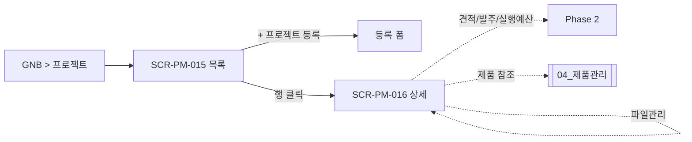

# 프로젝트 관리

> [!abstract]
> 포함 화면: **SCR-PM-015** 프로젝트 목록, **SCR-PM-016** 프로젝트 상세. 프로젝트 기본정보·멤버·체크리스트·파일관리 Phase 1 구현. [견적][발주][실행예산] 탭은 Phase 2에서 ES/OM 서브시스템 화면으로 구현.

## 화면 목록

| 화면 ID | 화면명 | 경로 | 관련 요구사항 |
|---------|--------|------|-------------|
| SCR-PM-015 | 프로젝트 목록 | /projects | FR-PM-017 |
| SCR-PM-016 | 프로젝트 상세 | /projects/:projectNo | FR-PM-017 |

## 화면 흐름



## 화면 상세

### SCR-PM-015 프로젝트 목록

| 항목 | 내용 |
|------|------|
| 경로 | /projects |
| 요구사항 | FR-PM-017 |
| 진입 | GNB > 프로젝트 |
| 권한 | ROLE_USER 이상 |

**레이아웃**

```
┌──────────────────────────────────────────────────────────┐
│ Breadcrumb: 프로젝트                                      │
├──────────────────────────────────────────────────────────┤
│ [전체] [내 프로젝트] [관심] [종료]   ← 탭                  │
│ 🔍 [프로젝트명/현장 검색] [검색]  [+ 프로젝트 등록]         │
├──────────────────────────────────────────────────────────┤
│ ☆ │ 프로젝트명 │ 현장주소 │ 발주처 │ 상태 │ 생성일          │
│ ★ │ A아파트 창호│ 서울 강남│ 대우건설│ 진행중│ 04.01          │
│ ☆ │ B오피스텔  │ 부산 해운│ 현대건설│ 견적중│ 03.28          │
└──────────────────────────────────────────────────────────┘
```

**기능 상세**

| 기능 | 설명 |
|------|------|
| 탭 필터 | 전체/내 프로젝트/관심(즐겨찾기)/종료 |
| 관심 토글 | ☆ 클릭 시 등록/해제 |
| 프로젝트 등록 | 등록 폼 모달 또는 별도 화면 |
| 행 클릭 | SCR-PM-016 이동 |

---

### SCR-PM-016 프로젝트 상세

| 항목 | 내용 |
|------|------|
| 경로 | /projects/:projectNo |
| 요구사항 | FR-PM-017 |
| 진입 | SCR-PM-015 > 행 클릭 |

**레이아웃**

```
┌──────────────────────────────────────────────────────────┐
│ Breadcrumb: 프로젝트 > A아파트 창호공사                     │
├──────────────────────────────────────────────────────────┤
│ [기본정보] [멤버] [체크리스트] [파일관리] [견적] [발주] [실행예산] ← 탭 │
├──────────────────────────────────────────────────────────┤
│ === [기본정보] ===                                         │
│ 프로젝트명*, 고객사명*, 현장주소*, 설계사무소,              │
│ 영업담당자, 시작일*, 예상종료일, 상태, 설명                 │
│                                                           │
│ === [멤버] ===                                             │
│ [+ 멤버 추가] 모달 — 사용자 검색 + 역할(영업/설계/제조/기타)│
│ ⚠ 프로젝트 역할(업무 분담) ≠ 시스템 접근 권한(FR-CM-002)   │
│                                                           │
│ === [체크리스트] ===                                       │
│ [+ 항목 추가] — 항목명/담당자(멤버)/기한/상태              │
│ 완료 체크 시 취소선 + 완료일 자동, 진행률(2/5 = 40%)       │
│ > 현행 2탭/마커 연동/확인자 추적은 Phase 1 제외. Phase 2   │
│ > 견적설계(FR-ES-001) 연계 시 재설계.                      │
│                                                           │
│ === [파일관리] ===                                         │
│ [파일 업로드] 드래그&드롭 / 파일 선택                       │
│ 허용: dwg, dxf, pdf, xlsx, docx, jpg, png (파일당 50MB)    │
│ 파일명 │ 유형 │ 크기 │ 업로드자 │ 업로드일                 │
│ 행 클릭: 다운로드 / 미리보기(이미지·PDF) / 삭제            │
│ > CAD는 Phase 2 견적설계 웹뷰어 연계(FR-ES-001)            │
│                                                           │
│ === [견적][발주][실행예산] ===                             │
│ → Phase 2 (ES/OM). "Phase 2에서 제공 예정" 안내 표시       │
│                                                           │
│                [삭제]  [취소]  [저장]                     │
└──────────────────────────────────────────────────────────┘
```

> **삭제 조건:** 예상(Prospect) 상태이며 견적서가 없는 프로젝트만 삭제 가능. 조건 미충족 시 [삭제] 비활성.
>
> **상태 전이:** 예상 → 진행중 → 일시중단 → 완료 → 종료 (단방향). 드롭다운에는 전이 가능한 상태만 표시.

## 관련 문서

- [[DE22-1_화면설계서_v1.5]] (메인)
- [[DE22-1_화면설계서/sections/04_제품관리]] — 프로젝트에서 참조하는 제품
- [[DE22-1_화면설계서/sections/07_공통CM]] — 사용자·그룹(멤버 추가 기반)
- [[WIMS_용어사전_BOM_v1.3]]
