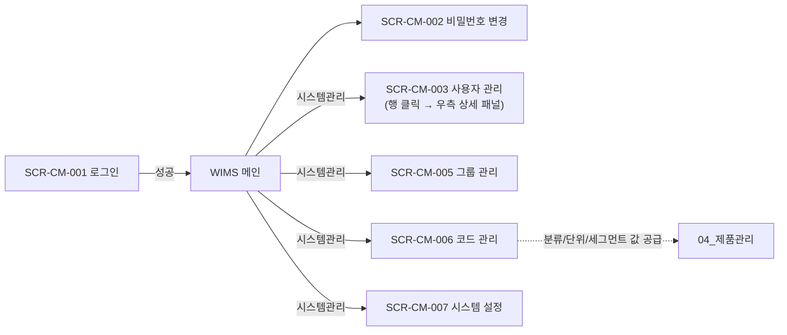

# 공통(CM) 화면

> [!abstract]
> 포함 화면: **SCR-CM-001** 로그인, **SCR-CM-002** 비밀번호 변경, **SCR-CM-003** 사용자 관리 (목록+상세 패널, v1.6 통폐합), **SCR-CM-005** 그룹(팀) 관리, **SCR-CM-006** 코드 관리, **SCR-CM-007** 시스템 설정 (필드 카테고리 상세화). 인증·RBAC·코드 카탈로그·전역 설정.

## 화면 목록

| 화면 ID | 화면명 | 경로 | 관련 요구사항 |
|---------|--------|------|-------------|
| SCR-CM-001 | 로그인 | /login | FR-CM-001, NFR-SC-CM-001 |
| SCR-CM-002 | 비밀번호 변경 | /settings/password | FR-CM-001, NFR-SC-CM-004 |
| SCR-CM-003 | 사용자 관리 | /admin/users (목록) · /admin/users/:userId (상세 패널) | FR-CM-002, 004 |
| SCR-CM-005 | 그룹(팀) 관리 | /admin/groups | FR-CM-002, 004 |
| SCR-CM-006 | 코드 관리 | /admin/codes | FR-CM-004 |
| SCR-CM-007 | 시스템 설정 | /admin/settings | FR-CM-004 |

> [!note]
> v1.5 의 SCR-CM-004 사용자 상세는 v1.6 에서 SCR-CM-003 우측 상세 패널로 통합됨. SCR ID **CM-004 결번 처리**.

## 화면 흐름



## 화면 상세

### SCR-CM-001 로그인

**레이아웃**

```
┌──────────────────────────────────────────────────────────┐
│                    WIMS 2.0 로고                          │
│            Window & Curtain Wall                          │
│         Information Management System                     │
│                                                           │
│          ┌──────────────────────────────┐                 │
│          │ 아이디*   [_________________]│                 │
│          │ 비밀번호* [_________________]│                 │
│          │                              │                 │
│          │ ☐ 로그인 상태 유지            │                 │
│          │       [   로그인   ]         │                 │
│          └──────────────────────────────┘                 │
│          비밀번호를 잊으셨나요?                             │
└──────────────────────────────────────────────────────────┘
```

| 기능 | 설명 |
|------|------|
| JWT 인증 | 로그인 성공 시 accessToken + refreshToken 발급 |
| 로그인 유지 | 체크 시 refreshToken 유효기간 확장 |
| 오류 표시 | ID/PW 불일치 시 인라인 오류 메시지 |
| 비밀번호 찾기 | 이메일 기반 재설정 링크 발송 |

---

### SCR-CM-002 비밀번호 변경

```
┌──────────────────────────────────────────────────────────┐
│ Breadcrumb: 설정 > 비밀번호 변경                           │
├──────────────────────────────────────────────────────────┤
│ ┌─ 비밀번호 변경 ──────────────────────────────────┐    │
│ │ 현재 비밀번호*  [________________]               │    │
│ │ 새 비밀번호*    [________________]               │    │
│ │ 비밀번호 확인*  [________________]               │    │
│ │                                                  │    │
│ │ 비밀번호 규칙 (현재 정책):                       │    │
│ │ ✓ 10자 이상 ✗ 특수문자 포함  ✓ 영문+숫자           │    │
│ │ ⦿ 3가지 이상 조합 필수  ⦿ 90일 만료  ⦿ 최근 5개 재사용 금지 │
│ │   (⦿ = 시스템 설정에서 관리자가 조정, SCR-CM-007) │    │
│ └──────────────────────────────────────────────────┘    │
│                     [취소]  [변경]                        │
└──────────────────────────────────────────────────────────┘
```

| 기호 | 의미 |
|------|------|
| `✓` | 현재 입력값이 규칙 충족 (실시간 검증) |
| `✗` | 현재 입력값이 규칙 미충족 |
| `⦿` | 시스템 전역 정책 (사용자는 변경 불가, SCR-CM-007 에서 관리자가 조정) |

> [!info]
> 규칙 표시는 **정적 아이콘**이며 사용자가 토글할 수 없다. 정책값 자체는 SCR-CM-007 에서 관리자 권한으로 조정한다.

---

### SCR-CM-003 사용자 관리 (목록 + 상세 패널)

| 권한 | ROLE_ADMIN |

**공통 원칙** [[DE22-1_화면설계서/sections/00_공통_원칙_레이아웃|§3.1 Main + Detail Panel]] 패턴 적용. 좌측 목록에서 행 클릭 시 우측 상세 패널이 열리며, URL 은 `/admin/users/:userId` 로 갱신된다.

```
┌──────────────────────────────────────────────────────────────────────────────┐
│ Breadcrumb: 시스템관리 > 사용자 관리                                          │
├──────────────────────────────────────────┬───────────────────────────────────┤
│ 🔍 [이름/아이디 검색] [검색] [+ 사용자]   │ 우측 상세 패널 (행 클릭 시 열림)    │
│ ─────────────────────────────────────── │ ──────────────────────────────    │
│ 이름 │ 아이디 │ 역할 │ 소속팀 │ 상태     │ ┌─ 기본 정보 ───────────────┐     │
│ 김진호│ jinho.k│ BOM… │ 개발팀 │ 활성 ●  │ │ 아이디 jinho.k (읽기전용) │     │
│ 김수연│ suyeon.k│ USER│ 개발팀 │ 활성    │ │ 이름*   [김진호]          │     │
│ 유미숙│ misuk.y│ ADMIN│ 유니크 │ 활성    │ │ 이메일* [jinho@…]         │     │
│                                          │ │ 연락처  [010-…]           │     │
│                                          │ │ 소속팀* [개발팀 ▼]        │     │
│                                          │ └───────────────────────────┘     │
│                                          │ ┌─ 권한 설정 ───────────────┐     │
│                                          │ │ 역할* [BOM_EDITOR ▼]      │     │
│                                          │ │ 역할별 권한 (읽기전용):    │     │
│                                          │ │ ✓ 자재 조회 ✓ 자재 편집    │     │
│                                          │ │ ✓ BOM 편집 ✗ 단가 편집     │     │
│                                          │ │ ✗ 사용자 관리             │     │
│                                          │ └───────────────────────────┘     │
│                                          │ [비번 초기화] [삭제] [취소] [저장] │
└──────────────────────────────────────────┴───────────────────────────────────┘
```

| 구역 | 설명 |
|------|------|
| 좌측 목록 | 검색·필터·페이징. 행 클릭 시 우측 상세 패널 활성화. 선택된 행은 하이라이트. |
| 우측 상세 패널 | 기본 정보 + 권한 설정 두 카드. 역할 드롭다운 변경 시 하단 권한 체크리스트가 정적 `✓`/`✗` 아이콘으로 미리보기 반영 (읽기 전용, 역할 정의는 시스템 고정). |
| 액션 버튼 | 비밀번호 초기화(임시 비번 메일 발송) · 삭제(소프트 삭제, 확인 모달) · 저장(변경 감지 시 활성). |
| URL 상태 | 목록만: `/admin/users`, 상세 열림: `/admin/users/:userId`. 뒤로가기 시 상세 패널만 닫힘. |

---

### SCR-CM-005 그룹(팀) 관리

| 권한 | ROLE_ADMIN |

```
┌──────────────────────────────────────────────────────────┐
│ Breadcrumb: 시스템관리 > 그룹 관리                          │
├──────────────────────────────────────────────────────────┤
│ [+ 그룹 추가]                                              │
│ 그룹명 │ 소속 인원 │ 기본 역할 │ 생성일                      │
│ 개발팀 │ 8명      │ USER     │ 2026.03.23                  │
│ 유니크 │ 2명      │ USER     │ 2026.03.23                  │
│ MES팀  │ 2명      │ MES_READER│ 2026.03.23                 │
│ 관리자 │ 1명      │ ADMIN    │ 2026.03.23                  │
│ ▼ 개발팀 (펼침) 김진호(BE), 이율희(BE), 김수연(FE), …       │
│             [그룹 수정]  [그룹 삭제]                       │
└──────────────────────────────────────────────────────────┘
```

---

### SCR-CM-006 코드 관리

| 권한 | ROLE_ADMIN |

**용도:**
- [[DE22-1_화면설계서/sections/04_제품관리|SCR-PM-011 제품 등록]] modelCode 세그먼트 드롭다운 값 공급 (BRAND / SERIES / L3_GLAZING / REVISION)
- [[DE22-1_화면설계서/sections/04_제품관리|SCR-PM-010 제품 목록]] 4계층 분류 필터 트리 값 공급 (L1_FORM / L2_GRADE / L3_GLAZING / L4_DIM)
- 자재 단위(UNIT)·공정 분류(PRC_TYPE) 등 전사 코드 카탈로그(`CODE_CATALOG`) 관리

```
┌──────────────────────────────────────────────────────────┐
│ Breadcrumb: 시스템관리 > 코드 관리                          │
├──────────────────────────────────────────────────────────┤
│ 좌측: 코드 그룹 트리        │ 우측: 선택 그룹 코드 목록      │
│ ▼ 자재 관련                │ 코드 │ 명칭 │ 정렬              │
│   ├ UNIT (단위)            │ EA   │ 개   │ 1                │
│   ├ MAT_TYPE (자재유형)    │ m    │ 미터 │ 2                │
│   └ MAT_SPEC (규격유형)    │ kg   │ 킬로그│ 3               │
│ ▼ 제품 관련                │ SET  │ 세트 │ 4                │
│   ├ L1_FORM (형식)         │ ml   │ 밀리리터│ 5             │
│   ├ L2_GRADE (등급)        │                                 │
│   ├ L3_GLAZING (유리타입)  │ [+ 코드 추가]                   │
│   ├ L4_DIM (치수크기)      │                                 │
│   └ BRAND / SERIES / REVISION                              │
│ ▼ 공정 관련                │                                 │
│   └ PRC_TYPE (공정분류)    │                                 │
│ [+ 코드 그룹 추가]          │                                 │
└──────────────────────────────────────────────────────────┘
```

---

### SCR-CM-007 시스템 설정

| 권한 | ROLE_ADMIN |

비밀번호 정책·계정 잠금·세션·알림·파일 업로드 등 시스템 전역 설정 관리. 카테고리별 접기/펼치기 패널로 구성한다.

```
┌──────────────────────────────────────────────────────────┐
│ Breadcrumb: 시스템관리 > 시스템 설정                        │
├──────────────────────────────────────────────────────────┤
│ ▼ 비밀번호 정책                                 [펼침]     │
│ ▷ 계정 잠금                                     [접힘]     │
│ ▷ 세션                                          [접힘]     │
│ ▷ 알림                                          [접힘]     │
│ ▷ 파일                                          [접힘]     │
│                                                            │
│ (펼친 패널 내부에 각 설정 입력 필드 + 기본값 복원 버튼)     │
│                         [취소]  [저장]                     │
└──────────────────────────────────────────────────────────┘
```

**설정 항목 (12):**

| 카테고리 | 설정 항목 | 기본값 | 비고 | 요구사항 |
|---------|----------|--------|------|--------|
| 비밀번호 정책 | 최소 길이 | 10자 | 10~20 범위 | NFR-SC-CM-004 |
| 비밀번호 정책 | 복잡도 조합 | 3가지 이상 | 영대/영소/숫자/특수 중 | NFR-SC-CM-004 |
| 비밀번호 정책 | 만료 주기 | 90일 | 0=무만료 | NFR-SC-CM-004 |
| 비밀번호 정책 | 재사용 제한 | 최근 5개 | 0=제한없음 | NFR-SC-CM-004 |
| 계정 잠금 | 실패 임계치 | 5회 | 1~10 | NFR-SC-CM-005 |
| 계정 잠금 | 잠금 시간 | 30분 | 또는 무한(관리자 해제) | NFR-SC-CM-005 |
| 세션 | accessToken TTL | 2시간 | FR-CM-001 | FR-CM-001 |
| 세션 | refreshToken TTL | 14일 | 로그인 유지 체크 시 30일 | FR-CM-001 |
| 세션 | 자동저장 간격 | 30초 | 폼 편집 중 | FR-CM-005 |
| 알림 | 세션 만료 사전 알림 | 15분 전 | 모달 | 00 §2.1 |
| 파일 | 파일당 최대 크기 | 50MB | 확장자 allowlist 고정 | 00 §2.1 |
| 파일 | 프로젝트당 총 용량 | 10GB | 초과 시 경고 | NFR-RL-CM-001 |

> [!tip] 신규 요구사항 후보
> 설정 변경 시 감사이력(변경자·전/후 값·타임스탬프) 자동 기록. 현재 FR 목록에 별도 항목 없으므로 v1.6 검토 시 요구사항 추가 후보로 제안.

---

## 변경 이력

| 버전 | 일자 | 내용 |
|------|------|------|
| v1.5 | 2026-04-16 | 초안 |
| v1.6 | 2026-04-22 | SCR-CM-004 사용자 상세 → SCR-CM-003 우측 상세 패널로 통폐합. SCR-CM-002 규칙 체크박스→정적 아이콘. SCR-CM-007 시스템 설정 필드·카테고리 표 상세화 (12항목). 화면 수 7→6. |

## 관련 문서

- [[DE22-1_화면설계서_v1.6]] (메인)
- [[DE22-1_화면설계서/sections/00_공통_원칙_레이아웃]] — 디자인 시스템·세션 정책·Main+Detail Panel 원칙
- [[DE22-1_화면설계서/sections/04_제품관리]] — 코드 관리가 공급하는 분류/세그먼트 값
- [[WIMS_용어사전_BOM_v1.4]]
