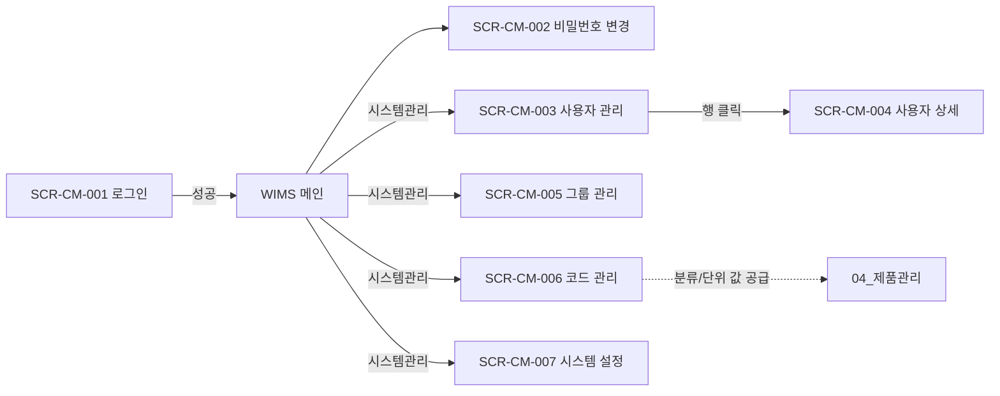

# 공통(CM) 화면

> [!abstract]
> 포함 화면: **SCR-CM-001** 로그인, **SCR-CM-002** 비밀번호 변경, **SCR-CM-003** 사용자 관리, **SCR-CM-004** 사용자 상세, **SCR-CM-005** 그룹(팀) 관리, **SCR-CM-006** 코드 관리, **SCR-CM-007** 시스템 설정. 인증·RBAC 권한·코드 카탈로그·시스템 전역 설정.

## 화면 목록

| 화면 ID | 화면명 | 경로 | 관련 요구사항 |
|---------|--------|------|-------------|
| SCR-CM-001 | 로그인 | /login | FR-CM-001, NFR-SC-CM-001 |
| SCR-CM-002 | 비밀번호 변경 | /settings/password | FR-CM-001, NFR-SC-CM-004 |
| SCR-CM-003 | 사용자 관리 | /admin/users | FR-CM-002, 004 |
| SCR-CM-004 | 사용자 상세 | /admin/users/:userId | FR-CM-004 |
| SCR-CM-005 | 그룹(팀) 관리 | /admin/groups | FR-CM-002, 004 |
| SCR-CM-006 | 코드 관리 | /admin/codes | FR-CM-004 |
| SCR-CM-007 | 시스템 설정 | /admin/settings | FR-CM-004 |

## 화면 흐름



## 화면 상세

### SCR-CM-001 로그인

**레이아웃**

```
┌──────────────────────────────────────────────────────────┐
│                    WIMS 2.0 로고                          │
│            Window & Curtain Wall                          │
│         Information Management System                     │
│                                                           │
│          ┌──────────────────────────────┐                 │
│          │ 아이디*   [_________________]│                 │
│          │ 비밀번호* [_________________]│                 │
│          │                              │                 │
│          │ ☐ 로그인 상태 유지            │                 │
│          │       [   로그인   ]         │                 │
│          └──────────────────────────────┘                 │
│          비밀번호를 잊으셨나요?                             │
└──────────────────────────────────────────────────────────┘
```

| 기능 | 설명 |
|------|------|
| JWT 인증 | 로그인 성공 시 accessToken + refreshToken 발급 |
| 로그인 유지 | 체크 시 refreshToken 유효기간 확장 |
| 오류 표시 | ID/PW 불일치 시 인라인 오류 메시지 |
| 비밀번호 찾기 | 이메일 기반 재설정 링크 발송 |

---

### SCR-CM-002 비밀번호 변경

```
┌──────────────────────────────────────────────────────────┐
│ Breadcrumb: 설정 > 비밀번호 변경                           │
├──────────────────────────────────────────────────────────┤
│ ┌─ 비밀번호 변경 ──────────────────────────────────┐    │
│ │ 현재 비밀번호*  [________________]               │    │
│ │ 새 비밀번호*    [________________]               │    │
│ │ 비밀번호 확인*  [________________]               │    │
│ │                                                  │    │
│ │ 비밀번호 규칙:                                    │    │
│ │ ✅ 8자 이상  ❌ 특수문자 포함  ✅ 영문+숫자        │    │
│ │ ☐ 3가지 이상 조합  ☐ 90일 만료  ☐ 최근 5개 재사용 금지│  │
│ └──────────────────────────────────────────────────┘    │
│                     [취소]  [변경]                        │
└──────────────────────────────────────────────────────────┘
```

---

### SCR-CM-003 사용자 관리

| 권한 | ROLE_ADMIN |

```
┌──────────────────────────────────────────────────────────┐
│ Breadcrumb: 시스템관리 > 사용자 관리                        │
├──────────────────────────────────────────────────────────┤
│ 🔍 [이름/아이디 검색] [검색]  [+ 사용자 등록]               │
│ 이름 │ 아이디 │ 역할 │ 소속팀 │ 상태                        │
│ 김진호│ jinho.k│ BOM_EDITOR │ 개발팀 │ 활성                 │
│ 김수연│ suyeon.k│ USER      │ 개발팀 │ 활성                 │
│ 유미숙│ misuk.y │ ADMIN     │ 유니크 │ 활성                 │
└──────────────────────────────────────────────────────────┘
```

---

### SCR-CM-004 사용자 상세

```
┌──────────────────────────────────────────────────────────┐
│ Breadcrumb: 시스템관리 > 사용자 관리 > 김진호                │
├──────────────────────────────────────────────────────────┤
│ ┌─ 기본 정보 ──────────────────────────────────────┐    │
│ │ 아이디 jinho.k (수정 불가)                          │    │
│ │ 이름*, 이메일*, 연락처, 소속팀*                     │    │
│ └──────────────────────────────────────────────────┘    │
│                                                          │
│ ┌─ 권한 설정 ──────────────────────────────────────┐    │
│ │ 역할*   [BOM_EDITOR ▼]                            │    │
│ │ 역할별 권한:                                       │    │
│ │ ☑ 자재 조회  ☑ 자재 편집  ☑ BOM 편집               │    │
│ │ ☐ 단가 편집  ☐ 사용자 관리                          │    │
│ └──────────────────────────────────────────────────┘    │
│      [비밀번호 초기화]  [삭제]  [취소]  [저장]             │
└──────────────────────────────────────────────────────────┘
```

---

### SCR-CM-005 그룹(팀) 관리

| 권한 | ROLE_ADMIN |

```
┌──────────────────────────────────────────────────────────┐
│ Breadcrumb: 시스템관리 > 그룹 관리                          │
├──────────────────────────────────────────────────────────┤
│ [+ 그룹 추가]                                              │
│ 그룹명 │ 소속 인원 │ 기본 역할 │ 생성일                      │
│ 개발팀 │ 8명      │ USER     │ 2026.03.23                  │
│ 유니크 │ 2명      │ USER     │ 2026.03.23                  │
│ MES팀  │ 2명      │ MES_READER│ 2026.03.23                 │
│ 관리자 │ 1명      │ ADMIN    │ 2026.03.23                  │
│ ▼ 개발팀 (펼침) 김진호(BE), 이율희(BE), 김수연(FE), …       │
│             [그룹 수정]  [그룹 삭제]                       │
└──────────────────────────────────────────────────────────┘
```

---

### SCR-CM-006 코드 관리

| 권한 | ROLE_ADMIN |

**용도:** 제품 분류 체계(L1 형식/L2 등급/L3 유리타입/L4 치수크기)·자재 단위·공정 분류·modelCode 세그먼트(브랜드/시리즈/유리타입/리비전) 등 전사 코드 카탈로그(`CODE_CATALOG`) 관리. [[DE22-1_화면설계서/sections/04_제품관리|SCR-PM-011 제품 등록]]의 세그먼트 드롭다운 값이 여기에서 공급된다.

```
┌──────────────────────────────────────────────────────────┐
│ Breadcrumb: 시스템관리 > 코드 관리                          │
├──────────────────────────────────────────────────────────┤
│ 좌측: 코드 그룹 트리        │ 우측: 선택 그룹 코드 목록      │
│ ▼ 자재 관련                │ 코드 │ 명칭 │ 정렬              │
│   ├ UNIT (단위)            │ EA   │ 개   │ 1                │
│   ├ MAT_TYPE (자재유형)    │ m    │ 미터 │ 2                │
│   └ MAT_SPEC (규격유형)    │ kg   │ 킬로그│ 3               │
│ ▼ 제품 관련                │ SET  │ 세트 │ 4                │
│   ├ L1_FORM (형식)         │ ml   │ 밀리리터│ 5             │
│   ├ L2_GRADE (등급)        │                                 │
│   ├ L3_GLAZING (유리타입)  │ [+ 코드 추가]                   │
│   ├ L4_DIM (치수크기)      │                                 │
│   └ BRAND / SERIES / REVISION                              │
│ ▼ 공정 관련                │                                 │
│   └ PRC_TYPE (공정분류)    │                                 │
│ [+ 코드 그룹 추가]          │                                 │
└──────────────────────────────────────────────────────────┘
```

---

### SCR-CM-007 시스템 설정

| 권한 | ROLE_ADMIN |

비밀번호 정책(최소 길이, 복잡도, 만료, 재사용 제한), 계정 잠금(실패 횟수, 잠금 시간), 세션(토큰 유효기간, 자동 저장 간격) 등 시스템 전역 설정 관리.

## 관련 문서

- [[DE22-1_화면설계서_v1.5]] (메인)
- [[DE22-1_화면설계서/sections/00_공통_원칙_레이아웃]] — 디자인 시스템·세션 정책
- [[DE22-1_화면설계서/sections/04_제품관리]] — 코드 관리가 공급하는 분류/세그먼트 값
- [[WIMS_용어사전_BOM_v1.3]]
