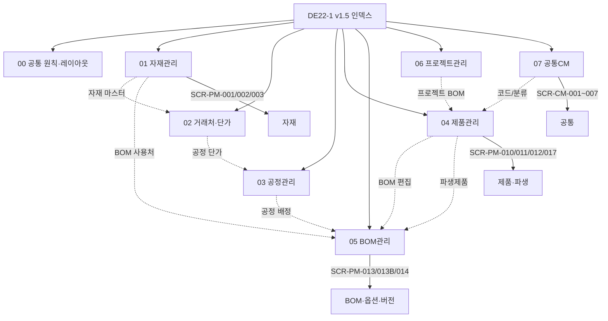

# DE22-1 화면 설계서 v1.5 (Phase 1)

> [!abstract] v1.5 개정 요약
> - 용어사전 v1.3의 세 축(NUMERIC 옵션, `enablement_condition` 조건부 활성화, BOM_RULE action 동사 4종)을 FE 화면에 반영.
> - 신규 화면 **SCR-PM-017 파생제품 등록/조회** 추가 (PM 18 + CM 7 = 25 화면).
> - 개정 화면: SCR-PM-010 (4계층 필터 트리), SCR-PM-011 (modelCode 세그먼트 UX), SCR-PM-013B (옵션 구성 4→5 서브탭, 옵션별규칙 action 카드, 확정 구성표 컬럼 확장).
> - **분산 구조**: 본 문서는 얇은 인덱스 허브. 상세는 [[DE22-1_화면설계서/sections/00_공통_원칙_레이아웃|00_공통]] ~ [[DE22-1_화면설계서/sections/07_공통CM|07_공통CM]] 7개 섹션 파일 참조.

---

## 1. 개요

### 1.1 목적·범위

WIMS 2.0 Phase 1 (제품관리 PM + 공통 CM) 화면 UI 설계. 총 28개 화면(PM 21 + CM 7). (v1.5-r1: 공급망 3 화면 추가)

| 구분 | 내용 |
|------|------|
| Phase 1 (본 문서) | 자재관리·거래처단가·공정관리·제품관리·BOM관리·프로젝트관리·공통(CM) |
| Phase 2 (별도) | ES(견적설계)·OM(발주관리)·MF(제조관리)·FS(현장실측) |

### 1.2 본 v1.5의 분산 구조

v1.4 단일 거대 파일(약 1,842행)을 **메인 인덱스 + 7개 섹션 파일**로 분할. 각 섹션은 독립 편집 가능하며 Obsidian wikilink·그래프뷰에서 자연스럽게 연결된다.

---

## 2. 섹션 인덱스

| # | 섹션 파일 | 포함 화면 ID | 주요 영역 |
|---|----------|-------------|----------|
| 00 | [[DE22-1_화면설계서/sections/00_공통_원칙_레이아웃\|00 공통 원칙·레이아웃]] | — | §1~§3 개요/디자인시스템/GNB·LNB/공통 컴포넌트 |
| 01 | [[DE22-1_화면설계서/sections/01_자재관리\|01 자재관리]] | SCR-PM-001, 002, 003 | 자재 목록/등록/상세 |
| 02 | [[DE22-1_화면설계서/sections/02_거래처_단가\|02 거래처·단가]] | SCR-PM-004, 005, 006 | 거래처 CRUD·단가 이력 |
| 03 | [[DE22-1_화면설계서/sections/03_공정관리\|03 공정관리]] | SCR-PM-007, 008, 009 | 공정 마스터·규격/단가 |
| 04 | [[DE22-1_화면설계서/sections/04_제품관리\|04 제품관리]] | SCR-PM-010, 011, 012, **017, 018, 019, 020** | 제품 목록/등록/상세 + 파생제품 + **공급망(다이스북·공급사·자재-공급사 매핑, v1.5-r1)** |
| 05 | [[DE22-1_화면설계서/sections/05_BOM관리\|05 BOM관리]] | SCR-PM-013, 013B, 014 | BOM 트리뷰·옵션 구성 5 서브탭·버전 관리 |
| 06 | [[DE22-1_화면설계서/sections/06_프로젝트관리\|06 프로젝트관리]] | SCR-PM-015, 016 | 프로젝트 목록/상세 |
| 07 | [[DE22-1_화면설계서/sections/07_공통CM\|07 공통(CM)]] | SCR-CM-001~007 | 로그인·사용자·그룹·코드·시스템 설정 |

---

## 3. Phase 1 전체 화면 목록

| # | 영역 | 화면 ID | 화면명 | 경로 | 관련 요구사항 | 섹션 |
|---|------|---------|--------|------|-------------|------|
| 1 | PM | SCR-PM-001 | 자재 목록 | /materials | FR-PM-001,002,004,005 | 01 |
| 2 | PM | SCR-PM-002 | 자재 등록 | /materials/new | FR-PM-001,002,004,005 | 01 |
| 3 | PM | SCR-PM-003 | 자재 상세/수정 | /materials/:itemCode | FR-PM-001,002,003,004 | 01 |
| 4 | PM | SCR-PM-004 | 거래처 관리 | /partners | FR-PM-003, FR-PM-009 | 02 |
| 5 | PM | SCR-PM-005 | 거래처 상세 | /partners/:partnerId | FR-PM-003 | 02 |
| 6 | PM | SCR-PM-006 | 자재-거래처 단가 이력 | /materials/:itemCode/prices | FR-PM-003 | 02 |
| 7 | PM | SCR-PM-007 | 공정 목록 | /processes | FR-PM-008 | 03 |
| 8 | PM | SCR-PM-008 | 공정 등록/수정 | /processes/:processCode | FR-PM-008 | 03 |
| 9 | PM | SCR-PM-009 | 공정별 규격·단가 설정 | /processes/:processCode/specs | FR-PM-009 | 03 |
| 10 | PM | SCR-PM-010 | 제품 목록 | /products | FR-PM-014,015 | 04 |
| 11 | PM | SCR-PM-011 | 제품 등록 | /products/new | FR-PM-014,015,016 | 04 |
| 12 | PM | SCR-PM-012 | 제품 상세 | /products/:productCode | FR-PM-010,011,012,013,016 | 04 |
| 13 | PM | SCR-PM-013 | BOM 트리뷰 | /products/:productCode/bom | FR-PM-006,010,011 | 05 |
| 14 | PM | SCR-PM-014 | BOM 버전 관리 | /products/:productCode/bom/versions | FR-PM-012 | 05 |
| 15 | PM | SCR-PM-013B | 옵션 구성 / 확정 구성표 | /products/:productCode/bom/configs | FR-PM-010,011,012,013 | 05 |
| 16 | PM | SCR-PM-015 | 프로젝트 목록 | /projects | FR-PM-017 | 06 |
| 17 | PM | SCR-PM-016 | 프로젝트 상세 | /projects/:projectNo | FR-PM-017 | 06 |
| 18 | PM | **SCR-PM-017** | **파생제품 등록/조회 (신규)** | /products/:productCode/derivatives | FR-PM-018 (신규) | 04 |
| 19 | PM | **SCR-PM-018** | **다이스북 관리 (v1.5-r1 신규)** | /dies-books | FR-PM-023 (신규) | 04 |
| 20 | PM | **SCR-PM-019** | **공급사 관리 (v1.5-r1 신규)** | /suppliers | FR-PM-023 (신규) | 04 |
| 21 | PM | **SCR-PM-020** | **자재↔공급사 매핑 (v1.5-r1 신규)** | /materials/:itemCode/suppliers | FR-PM-023 (신규) | 04 |
| 22 | CM | SCR-CM-001 | 로그인 | /login | FR-CM-001 | 07 |
| 23 | CM | SCR-CM-002 | 비밀번호 변경 | /settings/password | FR-CM-001 | 07 |
| 24 | CM | SCR-CM-003 | 사용자 관리 | /admin/users | FR-CM-002,004 | 07 |
| 25 | CM | SCR-CM-004 | 사용자 상세 | /admin/users/:userId | FR-CM-004 | 07 |
| 26 | CM | SCR-CM-005 | 그룹(팀) 관리 | /admin/groups | FR-CM-002,004 | 07 |
| 27 | CM | SCR-CM-006 | 코드 관리 | /admin/codes | FR-CM-004 | 07 |
| 28 | CM | SCR-CM-007 | 시스템 설정 | /admin/settings | FR-CM-004 | 07 |

---

## 4. 섹션 파일 간 탐색 지도

---

## 5. v1.5 변경 이력

| 버전 | 일자 | 작성자 | 변경 내용 |
|------|------|--------|----------|
| v1.0 | 2026.04.08 | 이미희 | 초안 (PM 15 + CM 7) |
| v1.1 | 2026.04.08 | 이미희 | 검증 반영 22건 (PM 17 + CM 7) |
| v1.2 | 2026.04.08 | 이미희 | 탭별 상세 + 크로스체크 12건 |
| v1.3 | 2026.04.08 | 이미희 | BOM 핵심(EBOM/MBOM/옵션 구성 4 서브탭) 상세 |
| v1.4 | 2026.04.15 | 김지광 | SOT 3종 크로스검증(엔드포인트·신용어 병기·camelCase·상태 3단계) |
| **v1.5** | **2026-04-16** | **김지광** | **분산 구조 재구성 + 용어사전 v1.3 반영: NUMERIC 옵션·enablement_condition·action 동사 4종·4계층 분류 필터·modelCode 세그먼트·확정 구성표 컬럼 확장·SCR-PM-017 파생제품 신설·금지어(산식구분) 전면 제거** |
| **v1.5-r1** | **2026-04-16** | **김지광** | **CX2 P1 반영 — 용어사전 v1.3 §14 기반 공급망 화면 3건(SCR-PM-018 다이스북 / SCR-PM-019 공급사 / SCR-PM-020 자재-공급사 매핑) 신설. FR-PM-023 추적 단절 해소. 총 화면 25→28건.** |

---

## 6. v1.5 개정 핵심 포인트

- **04 제품관리** — SCR-PM-010 4계층 분류 필터 트리(L1형식→L2등급→L3유리타입→L4치수크기), SCR-PM-011 modelCode 세그먼트 드롭다운 UX, **SCR-PM-017 파생제품 등록(신규)** — derivativeOf/derivativeKind 4종(1MM/CAP_TO_HIDDEN/TEMPERED/FIRE_43MM).
- **05 BOM관리** — SCR-PM-013B 5개 서브탭(옵션 구성 목록·**치수 입력(신규)**·옵션 그룹 관리·옵션별 규칙 관리·확정 구성표), enablement_condition 기반 조건부 활성화(BR5 3편창 W1), BOM_RULE action 동사 4종(SET/REPLACE/ADD/REMOVE) 카드 편집기, 확정 구성표 컬럼 확장(🔒 frozen/자재분류/공급구분/절단방향/절단길이/2차길이/개수/실절단).
- **전 섹션** — UI 라벨을 용어사전 v1.3 기준으로 검수: 자재구성(EBOM)·공정구성(MBOM)·옵션구성(Config)·옵션별규칙(BOM Rule)·확정구성표(Resolved BOM)·공급구분·절단방향·절단길이·자재분류.
- **금지어 제거** — `산식구분`, `CuttingBOM`, `LayoutType`, `resolved-bom-id` 하이픈, `BOM 행 유형` 등 용어사전 v1.3 §7 금지어는 본문 설계부에서 0건(변경이력·철회 메타 서술만 허용).

---

## 관련 문서

- [[WIMS_용어사전_BOM_v1.3]] — 기준 용어(NUMERIC 옵션·enablement_condition·action 동사·itemCategory·파생제품)
- [[DE35-1_미서기이중창_표준BOM구조_정의서_v1.5]] — 표준 BOM 구조·파생제품
- [[DE24-1_인터페이스설계서_MES_REST_API_v1.8]] — MES 연동 API(확정 구성표 조회)
- [[AN12-1_요구사항정의서_Phase1_v1.1]] — 기능 요구사항
- [[AN21-1_제품관리_PM_업무흐름도_v1.0]] — To-Be 업무 흐름
- [[V3_기존설계문서_영향도]], [[V4_비즈니스규칙_수용성]] — 검증 리포트
- [[DE22-1_화면설계서_Phase1_v1.4]] — 직전 단일 파일 버전(참고 보존)
