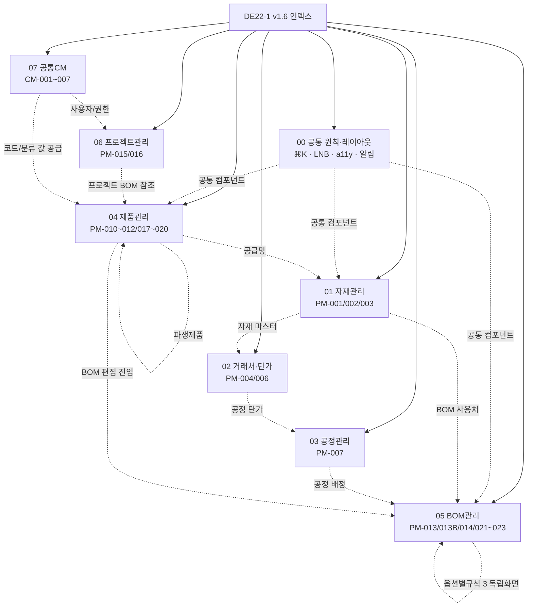

# DE22-1 화면 설계서 v1.6 (Phase 1)

> [!abstract] v1.6 개정 요약 (2026-04-22)
> - **통폐합 4건 → 순증 −1 = 총 27 화면**: SCR-PM-005 → PM-004 (거래처 관리 우측 상세 패널), SCR-PM-008/009 → PM-007 (공정 관리 우측 상세 패널 2탭), SCR-CM-004 → CM-003 (사용자 관리 우측 상세 패널).
> - **승격 3건 (v1.6 신규)**: SCR-PM-021 옵션별규칙 템플릿 갤러리 (FR-PM-025), SCR-PM-022 결정표 (FR-PM-026), SCR-PM-023 시뮬레이터 (FR-PM-027). 기존 SCR-PM-013B §9.3.4 서브탭 내부 3뷰 → 독립 URL·SCR ID 병행.
> - **공통 원칙 대폭 보강**: LNB 상세 스펙 표·글로벌 검색(⌘K Command Palette) 범위·알림 이벤트 카탈로그·a11y 원칙(WCAG 2.1 AA)·공통 컴포넌트 4종 신설 (HierarchyFilter / CommandPalette / NotificationBell / EmptyState).
> - **BOM 품질 개선**: BOM 트리 가상스크롤·검색·미니맵 / 3뷰 데이터 동기화 규칙(optimistic locking 409) / SCR-PM-013B 초보(Wizard)·숙련(Expert) 모드 토글 / 확정구성표에 `resolvedBomId` 컬럼 추가 (OM Phase 2 MES 바인딩 키).
> - **기타 개선**: SCR-PM-010 `[파생만 보기]` 토글·기본/파생 브레드크럼 / SCR-PM-011 modelCode 세그먼트 값 공급처 명시 / SCR-CM-002 비밀번호 규칙 체크박스→정적 아이콘 / SCR-CM-007 시스템 설정 12항목 카테고리 표 / SCR-PM-016 Phase 2 탭 숨김 + 배너 pill / SCR-PM-015 등록 모달 확정 / GNB 에 공정관리 독립 메뉴 승격.
> - **분산 구조 유지**: 본 문서는 얇은 인덱스 허브. 상세는 [[DE22-1_화면설계서/sections/00_공통_원칙_레이아웃|00_공통]] ~ [[DE22-1_화면설계서/sections/07_공통CM|07_공통CM]] 섹션 파일 참조.

---

## 1. 개요

### 1.1 목적·범위

WIMS 2.0 Phase 1 (제품관리 PM + 공통 CM) 화면 UI 설계. **총 27개 화면** (PM 21 + CM 6).

| 구분 | 내용 |
|------|------|
| Phase 1 (본 문서) | 자재관리·거래처·공정관리·제품관리·BOM관리·옵션별규칙·프로젝트관리·공통(CM) |
| Phase 2 (별도) | ES(견적설계) / OM(발주관리) / MF(제조관리) / FS(현장실측) |

### 1.2 v1.6 분산 구조

메인 인덱스(본 파일) + 섹션 파일 8개(`sections/00`~`07`). 각 섹션은 독립 편집 가능하며 Obsidian wikilink·그래프뷰로 연결. 공통 원칙·컴포넌트는 `00_공통_원칙_레이아웃`에 집약되어 모든 섹션이 참조.

---

## 2. 섹션 인덱스

| # | 섹션 파일 | 포함 화면 ID | 주요 영역 |
|---|----------|-------------|----------|
| 00 | [[DE22-1_화면설계서/sections/00_공통_원칙_레이아웃\|00 공통 원칙·레이아웃]] | — | §1~§5 디자인시스템·인터랙션·GNB/LNB·공통 컴포넌트·a11y·글로벌 검색·알림 |
| 01 | [[DE22-1_화면설계서/sections/01_자재관리\|01 자재관리]] | PM-001, 002, 003 | 자재 목록/등록/상세 |
| 02 | [[DE22-1_화면설계서/sections/02_거래처_단가\|02 거래처·단가]] | PM-004, 006 | 거래처 관리(통합) · 단가 이력 |
| 03 | [[DE22-1_화면설계서/sections/03_공정관리\|03 공정관리]] | PM-007 | 공정 관리(통합, GNB 독립 메뉴) |
| 04 | [[DE22-1_화면설계서/sections/04_제품관리\|04 제품관리]] | PM-010, 011, 012, 017, 018, 019, 020 | 제품 목록/등록/상세 · 파생제품 · 공급망(다이스북·공급사·자재매핑) |
| 05 | [[DE22-1_화면설계서/sections/05_BOM관리\|05 BOM관리]] | PM-013, 013B, 014, **021**, **022**, **023** | BOM 트리뷰 · 옵션 구성 5 서브탭 · 버전 · 옵션별규칙 3 독립 화면 |
| 06 | [[DE22-1_화면설계서/sections/06_프로젝트관리\|06 프로젝트관리]] | PM-015, 016 | 프로젝트 목록/상세 (Phase 2 탭 배너 대체) |
| 07 | [[DE22-1_화면설계서/sections/07_공통CM\|07 공통(CM)]] | CM-001, 002, 003, 005, 006, 007 | 로그인·비번·사용자 관리(통합)·그룹·코드·시스템설정 |

---

## 3. Phase 1 전체 화면 목록 (v1.6, 27개)

### 3.1 PM 영역 (21)

| # | 화면 ID | 화면명 | 경로 | 관련 요구사항 | 섹션 | 비고 |
|---|---------|--------|------|-------------|------|------|
| 1 | SCR-PM-001 | 자재 목록 | /materials | FR-PM-001,002,004,005 | 01 | |
| 2 | SCR-PM-002 | 자재 등록 | /materials/new | FR-PM-001,002,004,005 | 01 | |
| 3 | SCR-PM-003 | 자재 상세/수정 | /materials/:itemCode | FR-PM-001,002,003,004 | 01 | |
| 4 | **SCR-PM-004** | **거래처 관리** | /partners · /partners/:partnerId | FR-PM-003, FR-PM-009 | 02 | **v1.6 통폐합** (목록+상세패널) |
| 5 | SCR-PM-006 | 자재-거래처 단가 이력 | /materials/:itemCode/prices | FR-PM-003 | 02 | |
| 6 | **SCR-PM-007** | **공정 관리** | /processes · /processes/:processCode | FR-PM-008, FR-PM-009 | 03 | **v1.6 통폐합** (목록+2탭 상세패널, GNB 독립) |
| 7 | SCR-PM-010 | 제품 목록 | /products | FR-PM-014,015 | 04 | v1.6: 파생 토글·HierarchyFilter |
| 8 | SCR-PM-011 | 제품 등록 | /products/new | FR-PM-014,015,016 | 04 | modelCode 세그먼트 값 from SCR-CM-006 |
| 9 | SCR-PM-012 | 제품 상세 | /products/:productCode | FR-PM-010,011,012,013,016 | 04 | |
| 10 | SCR-PM-013 | BOM 트리뷰 | /products/:productCode/bom | FR-PM-006,010,011 | 05 | v1.6: 가상스크롤·검색·미니맵 |
| 11 | SCR-PM-013B | 옵션 구성 / 확정 구성표 | /products/:productCode/bom/configs | FR-PM-010,011,012,013 | 05 | v1.6: Wizard/Expert 토글·resolvedBomId 컬럼 |
| 12 | SCR-PM-014 | BOM 버전 관리 | /products/:productCode/bom/versions | FR-PM-012 | 05 | |
| 13 | SCR-PM-015 | 프로젝트 목록 | /projects | FR-PM-017 | 06 | v1.6: 등록 모달 확정 |
| 14 | SCR-PM-016 | 프로젝트 상세 | /projects/:projectNo | FR-PM-017 | 06 | v1.6: Phase 2 탭 숨김+배너 |
| 15 | SCR-PM-017 | 파생제품 등록/조회 | /products/:productCode/derivatives | FR-PM-019 | 04 | v1.6: 이중 진입 경로 |
| 16 | SCR-PM-018 | 다이스북 관리 | /dies-books | FR-PM-023 | 04 | v1.5-r1 신규 |
| 17 | SCR-PM-019 | 공급사 관리 | /suppliers | FR-PM-023 | 04 | v1.5-r1 신규 |
| 18 | SCR-PM-020 | 자재↔공급사 매핑 | /materials/:itemCode/suppliers | FR-PM-023 | 04 | v1.5-r1 신규 |
| 19 | **SCR-PM-021** | **옵션별규칙 템플릿 갤러리** | /products/:productCode/rules/templates | **FR-PM-025** | 05 | **v1.6 승격 신규** |
| 20 | **SCR-PM-022** | **옵션별규칙 결정표** | /products/:productCode/rules/decision-table | **FR-PM-026** | 05 | **v1.6 승격 신규** |
| 21 | **SCR-PM-023** | **옵션별규칙 시뮬레이터** | /products/:productCode/rules/simulate | **FR-PM-027** | 05 | **v1.6 승격 신규** |

### 3.2 CM 영역 (6)

| # | 화면 ID | 화면명 | 경로 | 관련 요구사항 | 섹션 | 비고 |
|---|---------|--------|------|-------------|------|------|
| 22 | SCR-CM-001 | 로그인 | /login | FR-CM-001, NFR-SC-CM-001 | 07 | |
| 23 | SCR-CM-002 | 비밀번호 변경 | /settings/password | FR-CM-001, NFR-SC-CM-004 | 07 | v1.6: 규칙 체크박스→정적 아이콘 |
| 24 | **SCR-CM-003** | **사용자 관리** | /admin/users · /admin/users/:userId | FR-CM-002, 004 | 07 | **v1.6 통폐합** (목록+상세패널) |
| 25 | SCR-CM-005 | 그룹(팀) 관리 | /admin/groups | FR-CM-002, 004 | 07 | |
| 26 | SCR-CM-006 | 코드 관리 | /admin/codes | FR-CM-004 | 07 | 제품 분류/세그먼트 값 공급처 |
| 27 | SCR-CM-007 | 시스템 설정 | /admin/settings | FR-CM-004 | 07 | v1.6: 12항목 카테고리 표 |

### 3.3 v1.6 결번 SCR (통폐합)

| 결번 SCR | 통합 대상 | 근거 섹션 |
|----------|----------|----------|
| SCR-PM-005 | SCR-PM-004 | 02 |
| SCR-PM-008 | SCR-PM-007 | 03 |
| SCR-PM-009 | SCR-PM-007 | 03 |
| SCR-CM-004 | SCR-CM-003 | 07 |

---

## 4. 섹션 파일 간 탐색 지도

---

## 5. v1.6 개정 이력

| 버전 | 일자 | 작성자 | 변경 내용 |
|------|------|--------|----------|
| v1.0 | 2026-04-08 | 이미희 | 초안 (PM 15 + CM 7) |
| v1.1 | 2026-04-08 | 이미희 | 검증 반영 22건 (PM 17 + CM 7) |
| v1.2 | 2026-04-08 | 이미희 | 탭별 상세 + 크로스체크 12건 |
| v1.3 | 2026-04-08 | 이미희 | BOM 핵심 상세 |
| v1.4 | 2026-04-15 | 김지광 | SOT 3종 크로스검증 |
| v1.5 | 2026-04-16 | 김지광 | 분산 구조 재구성 + 용어사전 v1.3 반영 |
| v1.5-r1 | 2026-04-16 | 김지광 | CX2 P1 — 공급망 3 화면 신설(SCR-PM-018/019/020). 25→28 |
| v1.5-r2 | 2026-04-21 | 김지광 | §4 SCR-PM-017~020 FE 상세 보강 · §5 공급망 개방이슈 종합 |
| **v1.6** | **2026-04-22** | **김지광** | **종합 검증·개정. 통폐합 4건(PM-005→004, PM-008/009→007, CM-004→003) · 승격 3건(PM-021/022/023, FR-PM-025/026/027) · 공통 섹션 대폭 보강(LNB·⌘K·알림·a11y·공통컴포넌트) · BOM 트리 성능 전략 · Wizard/Expert 모드 · resolvedBomId 노출 · Phase 2 탭 숨김 · GNB 공정관리 독립. 28→27 화면.** |

---

## 6. v1.6 개정 핵심 포인트

### 6.1 통폐합 (목록+우측 상세 패널 원칙 일관 적용)

- **SCR-PM-004 거래처 관리** — 기존 004 목록 + 005 상세 통합. 목록 클릭 시 우측 400px 상세 패널 오픈 (리사이즈 320~600). 딥링크 `/partners/:partnerId` 지원. `[+ 거래처 등록]` 모달 방식. 공통 원칙 [[DE22-1_화면설계서/sections/00_공통_원칙_레이아웃|§3.1]] 준수.
- **SCR-PM-007 공정 관리** — 기존 007/008/009 통합. 우측 상세 패널에 [기본정보][규격·단가] 2탭. GNB 에서 **공정관리 독립 메뉴**로 승격 (기존 "제품관리 > 공정관리" 하위 → GNB 독립).
- **SCR-CM-003 사용자 관리** — 기존 003/004 통합. 우측 상세 패널에 [기본정보][권한 설정] 2카드.

### 6.2 옵션별규칙 3 화면 승격 (FR-PM-025/026/027)

기존 SCR-PM-013B [옵션별 규칙 관리] 서브탭의 3뷰 체계(📋 템플릿 갤러리 / 📊 결정표 / ⚙️ 전문가)가 서브절 §9.3.4.x 로만 묻혀있어 추적이 어려움. v1.6 에서 **독립 SCR ID·독립 URL** 부여:

- **SCR-PM-021** /products/:productCode/rules/templates — 빌트인 6종+사용자 템플릿 카탈로그, 카드 그리드, [적용]·[복사·편집]·[삭제]·승격 마법사
- **SCR-PM-022** /products/:productCode/rules/decision-table — 옵션 조합 × 규칙 매트릭스, action 동사 아이콘(SET/REPLACE/ADD/REMOVE), 셀 편집, Excel 내보내기
- **SCR-PM-023** /products/:productCode/rules/simulate — 옵션값 입력 → Resolved BOM preview 실시간(debounce 500ms), 적용 규칙 trace highlight, ESTIMATE 오버레이 저장

서브탭 진입은 유지하되, 3뷰가 같은 `BOM_RULE` 엔티티를 조작하는 원칙을 명시 (optimistic locking version 필드, 뷰 전환 시 미저장 변경 확인 다이얼로그).

### 6.3 공통 원칙 대폭 보강 ([[DE22-1_화면설계서/sections/00_공통_원칙_레이아웃|00_공통]])

- **§3.3 LNB 상세 스펙 표** — GNB 6 메뉴별 서브메뉴·대응 화면 전면 정의
- **§3.4 공통 컴포넌트 4종 신설** — `<HierarchyFilter>` (4계층 분류 필터 트리 공통화), `<CommandPalette>` (⌘K 글로벌 검색), `<NotificationBell>` (GNB 벨 + 미읽음 배지), `<EmptyState>` (빈 목록·검색 결과 없음·에러)
- **§3.6 글로벌 검색 범위** — 제품·자재·프로젝트·거래처·공정·파생제품 6대상, 필드·점프 목적지 매핑
- **§3.7 알림 이벤트 카탈로그** — BOM 승격 대기/완료, 파생제품 승인 요청, 거래처 단가 변경, 시스템 공지, 세션 만료 예정
- **§4 a11y·i18n 원칙** — WCAG 2.1 AA 체크리스트(포커스·대비·ARIA·키보드), Phase 2 다국어 준비

### 6.4 BOM 품질 개선 ([[DE22-1_화면설계서/sections/05_BOM관리|05_BOM관리]])

- **BOM 트리(SCR-PM-013)** — 가상스크롤(`@tanstack/react-virtual`), localStorage 펼침 persist, 전체 검색 하이라이트, 경로 필터 pill, 우측 하단 미니맵
- **SCR-PM-013B Wizard/Expert 모드 토글** — 초보: 옵션값→그룹→규칙→구성→확정 단계형, 숙련: 5 서브탭 병렬
- **확정구성표 컬럼에 `resolvedBomId` 추가** — MES 바인딩 키, 복사 버튼. AN21-3 OM A4 단계 "resolvedBomId 캡처" 블로킹 해소

### 6.5 기타 개선

- **SCR-PM-010** — `[파생만 보기]` 토글, 기본→파생 브레드크럼, 4계층 필터를 `<HierarchyFilter>` 공통 컴포넌트 사용
- **SCR-PM-011** — modelCode 세그먼트 드롭다운 값이 SCR-CM-006 코드관리(CODE_CATALOG)에서 공급됨을 명시. 규칙 변경 시 호환성 정책 warning
- **SCR-PM-012** — [파생제품] 탭은 "빠른 참조(최대 5건 + [전체보기] → PM-017)"로 간소화
- **SCR-PM-017** — 이중 진입 경로 (PM-012 탭·PM-010 토글·⌘K), depth 1 제한 note
- **SCR-PM-015** — [+ 프로젝트 등록] **모달 확정**
- **SCR-PM-016** — Phase 2 탭([견적][발주][실행예산]) Phase 1 빌드에서 숨김 → 배너 pill 대체. `project_favorite` 개방이슈 기입
- **SCR-CM-002** — 비밀번호 규칙 체크박스(☐) 제거 → 정적 아이콘(✓/✗/⦿)으로 변경
- **SCR-CM-007** — 비밀번호·계정잠금·세션·알림·파일 5 카테고리 12항목 설정 표

### 6.6 동반 문서 개정

- [[AN14-1_요구사항추적표_v1.2]] — SCR ID 재편 반영. FR-PM-025/026/027 → SCR-PM-021/022/023 매핑. 결번 관리 섹션 신설.
- [[DE24-1_인터페이스설계서_v2.0]] — PM 도메인 섹션 신설. 파생·다이스북·공급사·자재매핑·템플릿·결정표·시뮬레이터 31 엔드포인트 추가.
- [[DE33-1_DB물리스키마_설계서_v1.2]] — Flyway V100~V106 확정. 엔티티 21→23, FK 29→31, 인덱스 45→48. `project_favorite` 테이블 추가.

---

## 7. 금지어 재확인 (용어사전 v1.4 §7)

본문 설계부 0건 유지:
- `산식구분`, `CuttingBOM`, `LayoutType`, `resolved-bom-id` 하이픈 표기, `BOM 행 유형`

변경이력·철회 메타 서술만 예외 허용.

---

## 관련 문서

- [[WIMS_용어사전_BOM_v1.4]] — NUMERIC 옵션·enablement_condition·action 동사·itemCategory·파생제품
- [[DE35-1_미서기이중창_표준BOM구조_정의서_v1.5]] — 표준 BOM·파생제품·BOM Rule 4동사
- [[DE24-1_인터페이스설계서_v2.0]] — MES 연동 + PM 도메인 31 엔드포인트
- [[DE33-1_DB물리스키마_설계서_v1.2]] — DB 엔티티 23종·Flyway V1~V106
- [[DE32-1_BOM도메인_ER다이어그램_v1.2]] — ER 다이어그램
- [[DE11-1_소프트웨어_아키텍처_설계서_v1.2]] — 템플릿 컴파일러·시뮬레이터·결정표 API
- [[AN12-1_요구사항정의서_Phase1_v1.1]] — 기능 요구사항
- [[AN14-1_요구사항추적표_v1.2]] — RTM 최신
- [[AN21-1_제품관리_PM_업무흐름도_v1.0]] — To-Be 업무 흐름
- [[AN21-3_발주관리_OM_업무흐름도_v1.0]] — OM 흐름 (Phase 2 접점, resolvedBomId 캡처)
