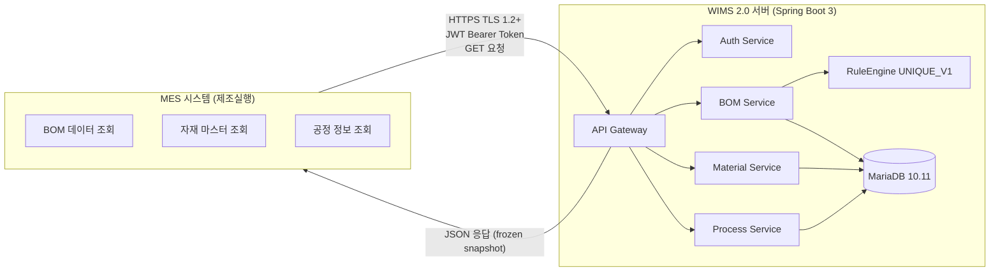
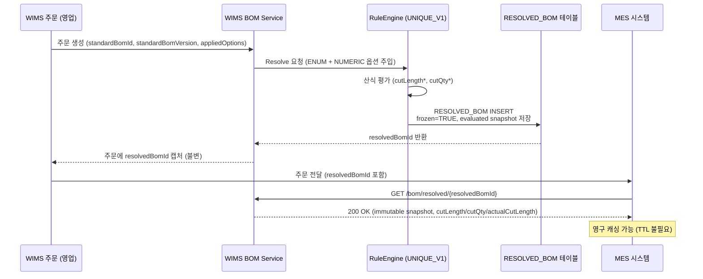
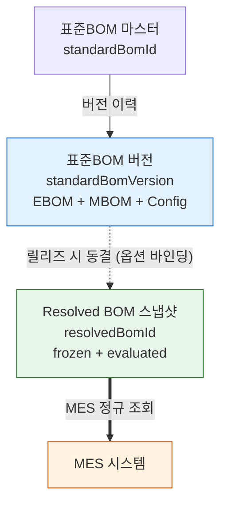

# DE24-1 인터페이스 설계서 (MES REST API)

**문서코드:** DE24-1
**버전:** v1.8
**작성일:** 2026.04.07 (최종 개정 2026.04.16)
**작성자:** 김진호 (BE, 코드크래프트)
**검토자:** 김지광 (PM, 코드크래프트)
**MES팀 확인:** 배봉균, 신세은 (MES팀)
**상태:** 초안 — Gate 1(2026-04-19) MES팀 서명 대상

> [!info] v1.8 개정 범위 요약
> 용어사전 BOM v1.3 (2026-04-16) 반영. Resolved BOM 응답 DTO 에 절단 속성 8개(`itemCategory`, `cutDirection`, `cutLength`, `cutLength2`, `cutQty`, `actualCutLength`, `supplyDivision`, `ruleEngineVersion`) 추가. `?supplyDivision`·`?debug` 쿼리 파라미터 신설. frozen 이후 재평가 금지 계약 명문화. `optionsHash` 산출 규칙(NUMERIC 옵션 제외) API 계약에 반영. 에러코드 2종 신설(`OPTION_ENABLEMENT_VIOLATION`, `FORMULA_EVALUATION_ERROR`).
>
> **철회 엔드포인트 재확인:** v1.2 신설 제안이었던 `/cutting-bom/{cuttingBomKey}` 는 v1.3 에서 최종 철회 확정. 본 문서 어디에도 등장하지 않으며, Resolved BOM 응답 확장으로 대체.

---

## 변경 이력

| 버전 | 일자 | 작성자 | 변경 내용 |
|------|------|--------|----------|
| **v1.8** | **2026.04.16** | **김진호** | **용어사전 BOM v1.3 정합 개정 (Gate 1 필수).** (A) §5.4.1 Resolved BOM 응답 DTO 및 §6.1 `ResolvedBomNodeDto` 에 v1.3 §3 MBOM 절단 속성을 반영 — `itemCategory` (enum: PROFILE/GLASS/HARDWARE/CONSUMABLE/SEALANT/SCREEN), `cutDirection`, `cutLength`(= `cutLengthEvaluated`), `cutLength2`(= `cutLengthEvaluated2`, 2차원 자재), `cutQty`(= `cutQtyEvaluated`), `actualCutLength`(lossRate 반영), `supplyDivision`(공통/외창/내창), `ruleEngineVersion`(현재 `UNIQUE_V1`) 8개 필드 추가. 산식 원문(`cutLengthFormula`/`cutLengthFormula2`/`cutQtyFormula`)은 평시 응답에서 **숨김** — MES 는 평가 결과값만 필요하며, 산식 누설은 RuleEngine 내부 구현 세부 노출을 야기. 단 `?debug=true` 로 노출 가능. (B) §5.4.1 에 쿼리 파라미터 `?supplyDivision=공통|외창|내창` 추가(V4 BR6 대응, 창별 분리 수신) 및 `?debug=true` 추가. (C) §5.4 운영 시나리오 및 §5.4.1 에 **v1.3 §4.2 frozen 불변성 계약** 명문화 — `cutLength*`, `cutQty*`, `actualQty`, `actualCutLength` snapshot 은 산식 상수 사후 변경·RuleEngine 언어 업그레이드에도 재평가 금지. 규정 변경 시 DEPRECATED 후 신규 `standardBomVersion` 발급 절차 기술. (D) §5.4.1 에 v1.3 §4.1 `optionsHash` 산출 규칙 명세 — NUMERIC 옵션(OPT-DIM-W/H 등)은 해시 계산에서 **제외**, ENUM 옵션만 정규화·정렬·SHA-256 앞 8자. 동일 `resolvedBomId` 가 서로 다른 W/H 수치의 다중 견적을 공유할 수 있음을 명시. (E) §7.2 에 `OPTION_ENABLEMENT_VIOLATION`(422, v1.3 §11.2 enablement_condition 위반), `FORMULA_EVALUATION_ERROR`(500, RuleEngine 평가 실패 — 실패 산식 원문은 서버 로그에만 기록, 응답에는 미노출) 2종 신설. (F) v1.3 §7 금지어 전수 검토 완료 — 본문에 `CuttingBOM`/`cuttingBomId`/`cuttingBomKey`/`ProductSeries`/`LayoutType`/`formula_kind`/`산식구분`/`productVersion`/`configVersion` 잔존 없음(변경이력 역사적 기록은 제외). (G) 프런트매터 신설, v1.3 및 V3·V4 리포트 wikilink. |
| v1.7 | 2026.04.14 | 김진호 | BOM API 를 단일 표준BOM 버전축 기반으로 통일, productVersion/configVersion 분리 축 제거 — §5.1 다이어그램을 3-레이어(표준BOM 마스터·버전·Resolved 스냅샷) 단일 축으로 재설계, 묶음 스냅샷 원칙 명시. §5.2 BOM 엔드포인트를 `{standardBomId}/{standardBomVersion}` 단일 파라미터 구조로 리팩토링. 요청/응답 스키마의 *구명칭* 필드를 standardBomVersion 으로 교체. resolvedBomId 생성 규칙을 3키(standardBomId, standardBomVersion, 옵션선택값 해시) 기반으로 변경. §5.4 MES 연동 엔드포인트(`/bom/resolved/{resolvedBomId}`) 유지하되 상위 키가 standardBomVersion 기반임을 명시. §6.1 DTO 목록 정합 반영. 문서정비: (1) `location_code`→`locationCode` 일괄 정정. (2) §5.4.1 응답 `appliedOptionsHash` 중복 제거. (3) §7.1 HTTP 410, §7.2 `RESOLVED_BOM_NOT_FOUND`·`RESOLVED_BOM_DEPRECATED` 등재. (4) §9.2 캐싱 전략을 Resolved 스냅샷(영구)과 표준BOM 마스터(TTL 5분) 로 분리. (5) §4.2 Content-Type 필수 플래그 해제. (6) 부록 OpenAPI paths 정합. |
| v1.6 | 2026.04.14 | 김진호 | 외부/내부 API path prefix 분리 정책 도입. 본 문서를 외부 API 전용 명세서로 한정. |
| v1.5 | 2026.04.14 | 김진호 | §5.4.6 "Resolved BOM 최신 RELEASED 조회" 절 삭제. §5.1 BOM API 매핑 정합. 식별자 vs 버전 축 분리 반영. |
| v1.4 | 2026.04.14 | 김진호 | Resolved BOM 불변 스냅샷 모델 도입. `GET /bom/resolved/{resolvedBomId}` MES 정규 경로 신설. |
| v1.3 | 2026.04.14 | 김진호 | Config 조회 엔드포인트 2종을 MES 노출 API 로 추가. |
| v1.2 | 2026.04.14 | 김진호 | `format=flat` 응답 형식 제거. tree 단일 응답으로 통일. |
| v1.1 | 2026.04.14 | 김진호 | DHS-AE225-D-1 BOM 정리 분석 결과 반영. MBOM/EBOM 등 MES 비노출 API 제거. |
| v1.0 | 2026.04.07 | 김진호 | 초안 — MES REST API 인터페이스 규격 설계. |

---

## 목차

1. 개요
2. 인터페이스 아키텍처
3. 인증 및 보안
4. API 공통 규격
5. API 엔드포인트 상세
6. 데이터 모델 (DTO)
7. 에러 처리
8. 버전 관리
9. 성능 요구사항 및 최적화
10. MES팀 협의 사항

---

## 1. 개요

### 1.1 목적

본 문서는 WIMS 2.0 시스템과 MES(제조실행시스템) 간의 REST API 인터페이스 규격을 정의한다. MES 시스템이 WIMS의 BOM, 자재, 공정 데이터를 조회할 수 있도록 API 엔드포인트, 요청/응답 스키마, 인증 방식, 에러 처리를 설계한다.

### 1.2 연동 방식 변경 경위

| 항목 | 현행 (초기 계획) | 변경 (개발계획서 v1.2 확정) |
|------|----------------|-----------------|
| 연동 방식 | DB 직접 연동 (Read-Only 뷰) | **REST API** |
| 접근 제어 | DB 계정 권한 | **JWT Bearer Token** |
| 데이터 포맷 | SQL 쿼리 결과 | **JSON** |
| 문서화 | 뷰/테이블 DDL | **Swagger/OpenAPI 3.0** |
| 변경 영향 | 뷰 구조 변경 시 MES 직접 영향 | **API 버전 관리로 하위 호환성 보장** |

> **변경 근거:** 개발계획서 v1.2에서 "MES 연동 방식 변경 (DB 직접 → REST API)"로 확정.

### 1.3 적용 범위

| 구분 | 내용 |
|------|------|
| Phase 1 (본 문서) | BOM 조회, 자재 조회, 공정 조회 — **읽기 전용 (Read-Only)** |
| Phase 2 (향후) | 실측 데이터 수신, 제작도 데이터 동기화, 양방향 연동 확장 |
| 제외 | MES 내부 로직, MES→WIMS 데이터 쓰기 |

### 1.4 참조 문서

| 문서코드 | 문서명 | 용도 |
|---------|--------|------|
| [[WIMS_용어사전_BOM_v1.3\|WIMS 용어사전 BOM v1.3]] | 용어·스키마·산식 언어 표준 | **기준 문서 (v1.8 반영 대상)** |
| [[V3_기존설계문서_영향도\|V3 리포트]] | 기존 설계 문서 영향도 분석 | D24-1/D24-3 지적 수용 근거 |
| [[V4_비즈니스규칙_수용성\|V4 리포트]] | 비즈니스 규칙 수용성 검증 | BR6 supplyDivision 필터 근거 |
| [[AN12-1_요구사항정의서_Phase1_v1.1#FR-PM-013\|FR-PM-013]] | MES 연동 BOM 데이터 인터페이스 | 핵심 기능 요구사항 |
| [[DE35-1_미서기이중창_표준BOM구조_정의서_v1.5\|DE35-1]] | 미서기이중창 표준 BOM 구조 정의서 | BOM 계층 구조, 품목코드 체계 |
| [[WIMS_BOM구성에_대한_고찰\|DE35-1 부록D]] | BOM 구성에 대한 고찰 | EBOM/MBOM 분리 모델 |

### 1.5 관련 요구사항

| 요구사항 ID | 요구사항명 | 유형 |
|------------|-----------|------|
| [[AN12-1_요구사항정의서_Phase1_v1.1#FR-PM-013\|FR-PM-013]] | MES 연동 BOM 데이터 인터페이스 | 기능 |
| NFR-IF-PM-001 | MES REST API 규격 정의 | 인터페이스 |
| NFR-IF-PM-002 | API 버전 관리 (Semantic Versioning) | 인터페이스 |
| NFR-IF-PM-003 | 데이터 캡슐화 (DTO 기반 I/O) | 인터페이스 |
| NFR-SC-PM-001 | MES 전용 서비스 계정 발급 및 관리 | 보안 |
| NFR-PF-PM-002 | MES REST API 응답시간 2초 이내 | 성능 |

---

## 2. 인터페이스 아키텍처

### 2.1 시스템 구성도



### 2.2 MES ↔ WIMS BOM 호출 흐름 (v1.8 신규)



### 2.3 연동 원칙

| # | 원칙 | 설명 |
|---|------|------|
| 1 | **단방향 (Phase 1)** | MES → WIMS 방향으로 조회만 가능. WIMS → MES 데이터 푸시 없음 |
| 2 | **읽기 전용** | MES 계정은 GET 요청만 허용. POST/PUT/DELETE 차단 |
| 3 | **Resolved MBOM 기준** | MES는 Resolved MBOM만 조회. Base BOM, EBOM에는 접근 불가 |
| 4 | **Released 버전만 노출** | Released 상태의 최신 MBOM만 API에 노출. Draft/Under Review 미노출 |
| 5 | **하위 호환성 보장** | API 변경 시 기존 v1 엔드포인트 최소 3개월 병행 운영 |
| 6 | **Snapshot 불변성 (v1.8 신규)** | `frozen=TRUE` 된 Resolved BOM 의 `cutLength*`, `cutQty*`, `actualQty`, `actualCutLength` 는 산식 상수·RuleEngine 언어 업그레이드에도 **재평가 금지**. 규정 변경 시 DEPRECATED 후 신규 `standardBomVersion` (용어사전 v1.3 §4.2) |

---

## 3. 인증 및 보안

### 3.1 인증 방식

| 항목 | 규격 |
|------|------|
| 방식 | JWT (JSON Web Token) Bearer Token |
| 알고리즘 | HS256 (HMAC-SHA256) 이상 |
| 토큰 유효기간 | 8시간 (28,800초) |
| 갱신 방식 | Refresh Token (유효기간 7일) |
| 전송 방식 | `Authorization: Bearer <token>` 헤더 |

### 3.2 MES 전용 서비스 계정

| 항목 | 내용 |
|------|------|
| 계정 유형 | 서비스 계정 (Service Account) |
| 계정 ID | `mes-service` (협의 확정 예정) |
| 역할 (Role) | `ROLE_MES_READER` |
| 허용 메서드 | GET만 허용 |
| 허용 경로 | `/api/external/v1/bom/**`, `/api/external/v1/materials/**`, `/api/external/v1/processes/**` |
| IP 제한 | MES 서버 IP 화이트리스트 적용 (협의 확정 예정) |

### 3.3 토큰 발급 API

**`POST /api/external/v1/auth/token`**

```json
{
  "clientId": "mes-service",
  "clientSecret": "****"
}
```

**Response (200 OK):**
```json
{
  "accessToken": "eyJhbGciOiJIUzI1NiIs...",
  "tokenType": "Bearer",
  "expiresIn": 28800,
  "refreshToken": "dGhpcyBpcyBhIHJlZnJl..."
}
```

### 3.4 토큰 갱신 API

**`POST /api/external/v1/auth/refresh`**

```json
{ "refreshToken": "dGhpcyBpcyBhIHJlZnJl..." }
```

### 3.5 JWT 클레임 구조

```json
{
  "sub": "mes-service",
  "role": "ROLE_MES_READER",
  "iat": 1711843200,
  "exp": 1711872000,
  "iss": "wims-api"
}
```

### 3.6 API 호출 로그

모든 API 호출에 대해 다음 항목을 로그에 기록한다: timestamp, clientId, method, endpoint, statusCode, responseTime, requestId.

---

## 4. API 공통 규격

### 4.1 Base URL

```
https://{host}/api/external/v1
```

| 환경 | Host |
|------|------|
| 개발 (DEV) | dev-api.wims.local |
| 테스트 (TEST) | test-api.wims.local |
| 스테이징 (STG) | stg-api.wims.example.com |
| 운영 (PROD) | api.wims.example.com |

#### 4.1.1 외부(External) / 내부(Internal) API Prefix 분리 정책

| 구분 | Path Prefix | 노출 대상 | 본 문서 범위 |
|------|------------|---------|:----------:|
| **외부(External)** | `/api/external/v1/...` | MES, 향후 추가될 외부 B2B 파트너 시스템 | ✅ |
| 내부(Internal) | `/api/internal/v1/...` | WIMS GUI, 운영자/관리자 콘솔, 사내 도구 | ❌ |

**MES 서비스 계정 권한:** `ROLE_MES_READER` 는 `/api/external/v1/**` 경로만 호출 가능. `/api/internal/**` 호출 시 `403 FORBIDDEN_PREFIX` 반환.

### 4.2 공통 헤더

**요청:**

| 헤더 | 필수 | 값 | 설명 |
|------|:---:|------|------|
| Authorization | ✓ | `Bearer <token>` | JWT 인증 토큰 |
| Content-Type | | `application/json` | GET-only 이므로 미사용 |
| Accept | ✓ | `application/json` | 응답 형식 |
| X-Request-ID | | UUID | 요청 추적 ID |

**응답:**

| 헤더 | 값 | 설명 |
|------|------|------|
| Content-Type | `application/json; charset=UTF-8` | 응답 형식 |
| X-Request-ID | UUID | 요청 추적 ID |
| X-Response-Time | `123ms` | 서버 처리 시간 |

### 4.3 공통 응답 구조

**성공 응답:**
```json
{
  "success": true,
  "data": { },
  "meta": {
    "requestId": "550e8400-e29b-41d4-a716-446655440000",
    "timestamp": "2026-04-16T09:30:00+09:00",
    "apiVersion": "v1"
  }
}
```

**에러 응답:**
```json
{
  "success": false,
  "error": {
    "code": "RESOLVED_BOM_NOT_FOUND",
    "message": "요청한 Resolved BOM 스냅샷을 찾을 수 없습니다.",
    "details": "resolvedBomId: RBOM-DHS-AE225-D-1-sbv1-zzzzzzzz"
  },
  "meta": { }
}
```

### 4.4 페이징 파라미터

| 파라미터 | 타입 | 기본값 | 설명 |
|---------|------|:------:|------|
| page | int | 1 | 페이지 번호 |
| size | int | 20 | 페이지당 항목 수 (최대 100) |
| sort | string | - | 정렬 기준 |

### 4.5 날짜/시간 형식

ISO 8601. 일시: `2026-04-16T09:30:00+09:00`.

---

## 5. API 엔드포인트 상세

### 5.1 BOM API 매핑

[[WIMS_BOM구성에_대한_고찰|BOM 구성에 대한 고찰]] 및 [[DE35-1_미서기이중창_표준BOM구조_정의서_v1.5|DE35-1]] §6.2 의 **단일 표준BOM 버전축 모델** 을 API 경로에 반영한다.

> **묶음 스냅샷 원칙:** 하나의 `standardBomVersion` 은 EBOM·MBOM·Config(옵션구성 규칙) 세 구성요소를 원자적 묶음으로 캡슐화한다. 외부(MES) 관점에서는 `{standardBomId}/{standardBomVersion}` 두 파라미터만으로 특정 시점의 완전한 BOM 묶음을 식별·재현한다.



**계층 매핑:**

| 계층 | 식별자 | 주 사용자 | API 경로 |
|------|--------|---------|---------|
| 표준BOM 마스터 | standardBomId | WIMS 내부 + MES | `/bom/standard/{standardBomId}` |
| 표준BOM 버전 | standardBomVersion | WIMS 내부 + MES | `/bom/standard/{standardBomId}/versions/{standardBomVersion}` |
| **Resolved BOM 스냅샷** | resolvedBomId | **MES (정규)** | `/bom/resolved/{resolvedBomId}` |

**resolvedBomId 식별자 체계:**

```
RBOM-{standardBomId}-sbv{standardBomVersion}-{optionsHash}
예: RBOM-DHS-AE225-D-1-sbv1-a3f9c2b1
```

- `optionsHash`: 적용 ENUM 옵션 키-값 쌍의 정규화(키 정렬) 후 SHA-256 앞 8자. 무옵션은 `default`. **NUMERIC 옵션(OPT-DIM-W/H/W1/H1/H2/H3)은 해시 계산에서 제외** (용어사전 v1.3 §4.1). → 동일 `resolvedBomId` 가 서로 다른 W/H 수치의 다중 견적/작업지시를 공유 가능. MES 는 치수를 `appliedOptions` JSON 에서 직접 판독하여 작업지시에 전달.

### 5.2 엔드포인트 목록

#### 인증 API

| # | 메서드 | 엔드포인트 | 설명 |
|---|--------|-----------|------|
| 1 | POST | /api/external/v1/auth/token | 토큰 발급 |
| 2 | POST | /api/external/v1/auth/refresh | 토큰 갱신 |

#### BOM API — 표준BOM 마스터 및 버전

| # | 메서드 | 엔드포인트 | 설명 |
|---|--------|-----------|------|
| 3 | GET | /api/external/v1/bom/standard | 표준BOM 목록 조회 |
| 4 | GET | /api/external/v1/bom/standard/{standardBomId} | 표준BOM 마스터 조회 |
| 5 | GET | /api/external/v1/bom/standard/{standardBomId}/versions | 표준BOM 버전 이력 조회 |
| 6 | GET | /api/external/v1/bom/standard/{standardBomId}/versions/{standardBomVersion} | 표준BOM 특정 버전 상세 |

#### BOM API — Resolved BOM 스냅샷

| # | 메서드 | 엔드포인트 | 설명 |
|---|--------|-----------|------|
| 7 | GET | /api/external/v1/bom/resolved/{resolvedBomId} | **Resolved BOM 스냅샷 조회 (MES 정규, IF-MES-BOM-001)** |

> **IF-MES-BOM-001:** MES 생산 플로우 정규 엔드포인트는 #7 단독. #3~#6 은 탐색·감사·디버깅용.

#### 자재/공정 마스터 API

| # | 메서드 | 엔드포인트 | 설명 |
|---|--------|-----------|------|
| 8 | GET | /api/external/v1/materials | 자재 마스터 목록 |
| 9 | GET | /api/external/v1/materials/{itemCode} | 자재 상세 |
| 10 | GET | /api/external/v1/processes | 공정 마스터 목록 |
| 11 | GET | /api/external/v1/processes/{processCode} | 공정 상세 |

---

### 5.3 표준BOM API

#### 5.3.1 표준BOM 목록 조회

**`GET /api/external/v1/bom/standard`**

Released 상태 표준BOM 목록.

**Query Parameters:**

| 파라미터 | 타입 | 필수 | 설명 |
|---------|------|:---:|------|
| category | string | | 제품 분류 필터 (SLD, DSLD, CW 등) |
| status | string | | 상태 필터 (기본값: RELEASED) |
| keyword | string | | 제품명/BOM 명칭 검색 |
| page / size | int | | 페이징 |

**Response (200 OK):**
```json
{
  "success": true,
  "data": [
    {
      "standardBomId": "DHS-AE225-D-1",
      "standardBomName": "225mm 단열 중중연 이중창",
      "category": "SLD",
      "grade": "1등급",
      "material": "AL",
      "insulation": true,
      "latestStandardBomVersion": 1,
      "latestVersionStatus": "RELEASED",
      "versionCount": 1,
      "releasedAt": "2026-04-01T10:00:00+09:00",
      "updatedAt": "2026-04-07T14:30:00+09:00"
    }
  ],
  "pagination": { },
  "meta": { }
}
```

#### 5.3.2 표준BOM 마스터 조회

**`GET /api/external/v1/bom/standard/{standardBomId}`**

표준BOM 영속 식별자 기준 마스터. standardBomVersion 요약 및 최신 RELEASED 포인터.

```json
{
  "success": true,
  "data": {
    "standardBomId": "DHS-AE225-D-1",
    "standardBomName": "225mm 단열 중중연 이중창",
    "category": "SLD",
    "status": "ACTIVE",
    "latestStandardBomVersion": 1,
    "latestReleasedVersion": 1,
    "versionCount": 1,
    "deprecatedVersionCount": 0,
    "createdAt": "2026-04-01T10:00:00+09:00",
    "updatedAt": "2026-04-07T14:30:00+09:00"
  }
}
```

#### 5.3.3 표준BOM 버전 이력 조회

**`GET /api/external/v1/bom/standard/{standardBomId}/versions`**

```json
{
  "success": true,
  "data": [
    {
      "standardBomId": "DHS-AE225-D-1",
      "standardBomVersion": 1,
      "status": "RELEASED",
      "totalItems": 38,
      "changeNotes": "초기 릴리즈 — EBOM·MBOM·Config 통합 확정",
      "changedComponents": ["EBOM", "MBOM", "Config"],
      "releasedAt": "2026-04-01T10:00:00+09:00",
      "releasedBy": "yms@uniqsys.co.kr",
      "supersededAt": null
    }
  ]
}
```

#### 5.3.4 표준BOM 특정 버전 상세 조회

**`GET /api/external/v1/bom/standard/{standardBomId}/versions/{standardBomVersion}`**

특정 standardBomVersion 의 EBOM·MBOM·Config 원자적 묶음.

```json
{
  "success": true,
  "data": {
    "standardBomId": "DHS-AE225-D-1",
    "standardBomVersion": 1,
    "standardBomName": "225mm 단열 중중연 이중창",
    "status": "RELEASED",
    "mbom": {
      "totalItems": 38,
      "assemblies": ["후렘(프레임) 공정 라인", "문짝 공정 라인"]
    },
    "config": {
      "totalOptionGroups": 7,
      "optionGroups": ["설치구성", "절단방식", "유리사양", "프레임재질", "색상", "부속", "치수(OPT-DIM)"],
      "releasedConfigCount": 1
    },
    "ruleEngineVersion": "UNIQUE_V1",
    "changeNotes": "초기 릴리즈",
    "changedComponents": ["EBOM", "MBOM", "Config"],
    "releasedAt": "2026-04-01T10:00:00+09:00",
    "releasedBy": "yms@uniqsys.co.kr"
  }
}
```

---

### 5.4 Resolved BOM API (MES 정규 연동)

구성형 BOM은 **표준BOM 버전 + 옵션 선택값(ENUM + NUMERIC) → Resolved BOM**의 구조이다.

> **단일 표준BOM 버전축 원칙:**
> - `standardBomId` + `standardBomVersion` → EBOM·MBOM·Config 세 구성요소 원자적 묶음
> - `resolvedBomId` = `RBOM-{standardBomId}-sbv{standardBomVersion}-{optionsHash}` — ENUM 옵션만의 결정적 해시
> - NUMERIC 옵션(W/H 등)은 해시에서 제외되어, 동일 `resolvedBomId` 스냅샷 아래 W/H 수치만 다른 다수 견적이 공존 가능
>
> **불변 스냅샷 원칙 (용어사전 v1.3 §4.2):**
> - `frozen=TRUE` 전환 시점에 각 행의 `cutLength*`, `cutQty*`, `actualQty`, `actualCutLength` 필드가 고정됨
> - **산식 상수 사후 변경·RuleEngine 언어 업그레이드(예: UNIQUE_V1→V2)에도 재평가 금지**. MES 작업지시·금액 산출의 안정성 보장
> - 규정 변경·데이터 오류 정정 시: 기존 스냅샷 `DEPRECATED` 처리 + 신규 `standardBomVersion` 발급 → 신규 `resolvedBomId` 생성. 기존 스냅샷은 감사용으로 보존(삭제 금지)
>
> **운영 시나리오:**
> 1. **정상 플로우 (MES 정규):** 주문 생성 시 WIMS 가 `resolvedBomId` 캡처(불변) → MES 수신 → §5.4.1 조회 (1회 호출로 EBOM+MBOM+Config+절단속성 완전 수신) → `resolvedBomId` 키 영구 캐싱 가능
> 2. **탐색/디버깅:** §5.3.3 버전 이력(`changedComponents`) → §5.3.4 특정 버전 → §5.4.1 직접 조회
> 3. **감사:** 주문의 `resolvedBomId` 로 §5.4.1 호출 → 불변 원본 재현
> 4. **ECO:** 주문의 `resolvedBomId` 를 신규 스냅샷 ID 로 교체, 교체 이력 감사 로그 보존

#### 5.4.1 Resolved BOM 스냅샷 조회 (MES 정규 경로, IF-MES-BOM-001)

**`GET /api/external/v1/bom/resolved/{resolvedBomId}`**

주문 엔티티에 캡처된 `resolvedBomId` 로 **불변 스냅샷** 을 조회. 동일 `resolvedBomId` 로 언제 호출해도 동일한 응답(멱등).

**Query Parameters (v1.8 신규):**

| 파라미터 | 타입 | 필수 | 설명 |
|---------|------|:---:|------|
| supplyDivision | enum | | `공통` \| `외창` \| `내창`. 지정 시 해당 값 행만 필터. 미지정 시 전체 반환. 이외 값은 `400 INVALID_PARAMETER`. (V4 BR6) |
| debug | boolean | | `true` 시 각 노드에 `cutLengthFormula`, `cutLengthFormula2`, `cutQtyFormula` (산식 원문) 포함. 기본값 `false` — **평시 응답에서는 산식 원문 숨김** (MES 는 평가 결과값만 필요). 디버깅·감사 용도 한정 |

> [!warning] 산식 원문 노출 정책 (v1.8 결정)
> `cutLengthFormula`·`cutLengthFormula2`·`cutQtyFormula` 는 RuleEngine 내부 구현 세부에 해당하며, MES 는 평가 결과값(`cutLength`/`cutLength2`/`cutQty`/`actualCutLength`)만으로 작업지시를 발행한다. 산식 원문을 상시 노출할 경우 (1) MES 측이 산식을 파싱·재평가하려는 안티패턴 유발, (2) `frozen` 재평가 금지 계약 침해 위험. 따라서 **기본 응답에서는 숨김**, `?debug=true` 로만 노출한다.

**응답 DTO: `ResolvedBomNodeDto` 필드 (v1.8 확장)**

| 필드 | 타입 | 필수 | 설명 |
|------|------|:---:|------|
| level | int | ✓ | 0(완제품)~3(원자재) |
| itemCode | string | ✓ | 품목코드 |
| itemName | string | ✓ | 품목명 |
| itemType | enum | ✓ | `PRODUCT` \| `ASSEMBLY` \| `SEMI` \| `RAW` \| `SUB` |
| **itemCategory** | enum | ✓ | **v1.8 신규.** `PROFILE` \| `GLASS` \| `HARDWARE` \| `CONSUMABLE` \| `SEALANT` \| `SCREEN`. Resolved 로직 분기 키 (용어사전 v1.3 §1) |
| category | string | | 자재 분류 표시용 (프레임/원자재/부자재/공정) |
| qty | decimal | ✓ | 이론 소요량 (`theoreticalQty`) |
| unit | string | ✓ | EA, SET, M, M2, KG 등 |
| lossRate | decimal | | 손실률 0.0~1.0 |
| actualQty | decimal | | 개수 기반 자재: `theoreticalQty × (1 + lossRate)` |
| **cutDirection** | enum? | | **v1.8 신규.** `W` \| `H` \| `W1` \| `H1` \| `H2` \| `H3`. 절단 대상이 아니면 null (용어사전 v1.3 §3) |
| **cutLength** | decimal? | | **v1.8 신규.** 1차 절단 길이 평가 결과 (mm). `cutLengthEvaluated` snapshot. frozen 이후 불변 |
| **cutLength2** | decimal? | | **v1.8 신규.** 2차 절단 길이 (`itemCategory=GLASS` 세로 치수 등) |
| **cutQty** | decimal? | | **v1.8 신규.** 절단 개수 평가 결과. `cutQtyEvaluated` snapshot |
| **actualCutLength** | decimal? | | **v1.8 신규.** `cutLength × (1 + lossRate)`. 길이 기반 자재(PROFILE/SEALANT/GLASS)에 적용 (용어사전 v1.3 §3.1) |
| **supplyDivision** | enum? | | **v1.8 신규.** `공통` \| `외창` \| `내창`. null 이면 공통 (용어사전 v1.3 §3) |
| **ruleEngineVersion** | string | ✓ | **v1.8 신규.** 이 Resolved 를 생성한 RuleEngine 버전. 현재 고정값 `UNIQUE_V1` (용어사전 v1.3 §4) |
| cutLengthFormula | string? | | **`?debug=true` 에서만 노출.** 1차 절단 산식 원문 |
| cutLengthFormula2 | string? | | **`?debug=true` 에서만 노출.** 2차 절단 산식 원문 |
| cutQtyFormula | string? | | **`?debug=true` 에서만 노출.** 수량 산식 원문 |
| processCode | string | | MBOM 공정 (HF-0001~0007 등) |
| processName | string | | 공정명 |
| workOrder | int | | 작업순서 |
| workCenter | string | | 작업장 |
| locationCode | string? | | 후렘/문짝 위치구분 (H01~H04, W01~W03) |
| children | array | | 하위 노드 |

**Response (200 OK) — 평시 응답 예시 (산식 원문 숨김):**

```json
{
  "success": true,
  "data": {
    "resolvedBomId": "RBOM-DHS-AE225-D-1-sbv1-a3f9c2b1",
    "standardBomId": "DHS-AE225-D-1",
    "standardBomVersion": 1,
    "standardBomName": "225mm 단열 중중연 이중창",
    "appliedOptionsHash": "a3f9c2b1",
    "bomType": "RESOLVED_MBOM",
    "status": "RELEASED",
    "immutable": true,
    "frozenAt": "2026-04-07T14:00:00+09:00",
    "releasedBy": "yms@uniqsys.co.kr",
    "ruleEngineVersion": "UNIQUE_V1",
    "totalItems": 38,
    "appliedOptions": {
      "OPT-LAY": "W2XH1-2편",
      "OPT-CUT": "45도",
      "OPT-GLS": "24mm 복층유리",
      "OPT-MAT": "AL 압출",
      "OPT-COL": "화이트",
      "OPT-ACC": "기본",
      "OPT-DIM-W": 1500,
      "OPT-DIM-H": 1200
    },
    "optionsHashRule": "ENUM 옵션만 정규화 후 SHA-256 앞 8자. NUMERIC(OPT-DIM-*) 제외",
    "tree": [
      {
        "level": 0,
        "itemCode": "DHS-AE225-D-1",
        "itemName": "225mm 단열 중중연 이중창",
        "itemType": "PRODUCT",
        "itemCategory": "PROFILE",
        "qty": 1,
        "unit": "SET",
        "ruleEngineVersion": "UNIQUE_V1",
        "children": [
          {
            "level": 1,
            "itemCode": "HF-0007",
            "itemName": "조립후 가공품",
            "itemType": "ASSEMBLY",
            "itemCategory": "PROFILE",
            "processCode": "HF-0007",
            "processName": "미서기 조립",
            "workOrder": 1,
            "workCenter": "WC-FRAME",
            "ruleEngineVersion": "UNIQUE_V1",
            "children": [
              {
                "level": 2,
                "itemCode": "UNI-A225-101-HC",
                "itemName": "225-H-프레임-1",
                "itemType": "SEMI",
                "itemCategory": "PROFILE",
                "category": "반제품",
                "qty": 1,
                "unit": "EA",
                "cutDirection": "H",
                "cutLength": 1106,
                "cutLength2": null,
                "cutQty": 1,
                "lossRate": 0.02,
                "actualCutLength": 1128.12,
                "actualQty": 1,
                "supplyDivision": "외창",
                "processCode": "HF-0002",
                "processName": "미서기 피스홀 가공",
                "workOrder": 1,
                "locationCode": "H01",
                "ruleEngineVersion": "UNIQUE_V1",
                "children": [
                  {
                    "level": 3,
                    "itemCode": "UNI-A225-101A",
                    "itemName": "19년 225mm 1등급 미서기 후렘-외부 A",
                    "itemType": "RAW",
                    "itemCategory": "PROFILE",
                    "category": "원자재",
                    "qty": 1,
                    "unit": "EA",
                    "cutDirection": "H",
                    "cutLength": 1106,
                    "cutQty": 1,
                    "lossRate": 0.02,
                    "actualCutLength": 1128.12,
                    "actualQty": 1,
                    "supplyDivision": "외창",
                    "locationCode": "H01",
                    "ruleEngineVersion": "UNIQUE_V1",
                    "children": []
                  }
                ]
              },
              {
                "level": 2,
                "itemCode": "02-0094-1",
                "itemName": "후레임연결재-1(19년형)",
                "itemType": "SUB",
                "itemCategory": "HARDWARE",
                "category": "부자재",
                "qty": 5,
                "unit": "EA",
                "cutDirection": null,
                "cutLength": null,
                "cutQty": null,
                "lossRate": 0,
                "actualCutLength": null,
                "actualQty": 5,
                "supplyDivision": null,
                "processCode": "HF-0006",
                "processName": "미서기 후렘 연결",
                "locationCode": null,
                "ruleEngineVersion": "UNIQUE_V1",
                "children": []
              }
            ]
          }
        ]
      }
    ]
  },
  "meta": { }
}
```

**Response 예시 — `?debug=true` (산식 원문 포함):**

```json
{
  "level": 2,
  "itemCode": "UNI-A225-101-HC",
  "itemCategory": "PROFILE",
  "cutDirection": "H",
  "cutLengthFormula": "H - 94",
  "cutLength": 1106,
  "cutQtyFormula": "2",
  "cutQty": 1,
  "supplyDivision": "외창",
  "ruleEngineVersion": "UNIQUE_V1"
}
```

> **frozen 불변성 계약 (용어사전 v1.3 §4.2):** 본 응답의 `cutLength`, `cutLength2`, `cutQty`, `actualQty`, `actualCutLength` 는 `frozenAt` 시점에 RuleEngine (`UNIQUE_V1`) 이 평가한 snapshot 값이다. **산식 상수가 사후 변경되거나 RuleEngine 이 `UNIQUE_V2` 로 업그레이드되어도 본 스냅샷은 재평가하지 않는다.** MES 는 이 값을 신뢰하여 작업지시를 발행한다. 규정 변경이 필요하면 WIMS 가 기존 스냅샷을 `DEPRECATED` 처리하고 신규 `standardBomVersion` 을 발급한다 (HTTP 410 응답).

> **optionsHash 산출 규칙 (용어사전 v1.3 §4.1):**
> - 해시 입력: `appliedOptions` 중 **ENUM 값만** (키 사전순 정렬 → JSON canonical → SHA-256 앞 8자)
> - NUMERIC 값 (`OPT-DIM-W`, `OPT-DIM-H`, `OPT-DIM-W1`, `OPT-DIM-H1/H2/H3`) 은 해시 계산에서 **제외**
> - 동일 `resolvedBomId` 가 W/H 수치만 다른 여러 주문·견적에 공유될 수 있음 — 치수별 작업지시는 MES 가 `appliedOptions` JSON 에서 NUMERIC 값을 판독하여 처리

> **`locationCode` 필드:** 후렘·문짝 파일 위치구분 코드 (H01~H04, W01~W03). 해당 없는 자재는 `null`. Q16 회신 대기.

**Error Responses:**

| HTTP | 코드 | 상황 |
|------|------|------|
| 400 | INVALID_PARAMETER | `?supplyDivision` enum 외 값 |
| 404 | RESOLVED_BOM_NOT_FOUND | 존재하지 않는 resolvedBomId |
| 410 | RESOLVED_BOM_DEPRECATED | DEPRECATED 스냅샷 |
| 422 | OPTION_ENABLEMENT_VIOLATION | `enablement_condition` 위반 (v1.3 §11.2 — 예: 3편창 아닌데 `OPT-DIM-W1` 주입) |
| 500 | FORMULA_EVALUATION_ERROR | RuleEngine 산식 평가 실패 (실패 산식 원문은 서버 로그에만 기록, 응답 본문에는 미포함) |

---

### 5.5 자재 마스터 API

#### 5.5.1 자재 목록 조회

**`GET /api/external/v1/materials`**

| 파라미터 | 타입 | 설명 |
|---------|------|------|
| category | string | 자재 분류 |
| type | string | 자재 유형 필터 |
| keyword | string | 자재명/코드 검색 |

```json
{
  "success": true,
  "data": [
    {
      "itemCode": "UNI-A225-101A",
      "itemName": "19년 225mm 1등급 미서기 후렘-외부 A",
      "itemCategory": "PROFILE",
      "category": "원자재",
      "itemType": "알루미늄 압출",
      "unit": "EA",
      "spec": "6.3",
      "material": "AL",
      "status": "ACTIVE"
    }
  ]
}
```

#### 5.5.2 자재 상세 조회

**`GET /api/external/v1/materials/{itemCode}`**

```json
{
  "success": true,
  "data": {
    "itemCode": "UNI-A225-101A",
    "itemName": "19년 225mm 1등급 미서기 후렘-외부 A",
    "itemCategory": "PROFILE",
    "category": "원자재",
    "itemType": "알루미늄 압출",
    "unit": "EA",
    "spec": "6.3",
    "material": "AL",
    "supplier": null,
    "unitPrice": null,
    "status": "ACTIVE",
    "createdAt": "2026-01-15T10:00:00+09:00",
    "updatedAt": "2026-04-07T14:30:00+09:00"
  }
}
```

---

### 5.6 공정 마스터 API

#### 5.6.1 공정 목록 조회

**`GET /api/external/v1/processes`**

```json
{
  "success": true,
  "data": [
    {
      "processCode": "HF-0002",
      "processName": "미서기 피스홀 가공",
      "processType": "가공",
      "workCenter": "WC-FRAME",
      "unit": "EA",
      "description": "피스홀 가공품 — H/W 계열 프레임 공용",
      "status": "ACTIVE"
    }
  ]
}
```

#### 5.6.2 공정 상세 조회

**`GET /api/external/v1/processes/{processCode}`**

```json
{
  "success": true,
  "data": {
    "processCode": "HF-0002",
    "processName": "미서기 피스홀 가공",
    "processType": "가공",
    "workCenter": "WC-FRAME",
    "unit": "EA",
    "description": "피스홀 가공품",
    "applicableMaterials": ["UNI-A225-101-HC", "UNI-A225-101-HC2", "UNI-A225-101-WC", "UNI-A225-101-WC-2"],
    "status": "ACTIVE",
    "createdAt": "2026-02-01T10:00:00+09:00",
    "updatedAt": "2026-04-07T11:00:00+09:00"
  }
}
```

---

## 6. 데이터 모델 (DTO)

### 6.1 DTO 목록

| DTO 클래스 | 용도 | 사용 엔드포인트 |
|-----------|------|---------------|
| StandardBomSummaryDto | 표준BOM 목록 항목 | GET /bom/standard |
| StandardBomMasterDto | 표준BOM 마스터 상세 | GET /bom/standard/{standardBomId} |
| StandardBomVersionSummaryDto | standardBomVersion 이력 항목 | GET /bom/standard/{standardBomId}/versions |
| StandardBomVersionDetailDto | 특정 버전 상세 (MBOM·Config 묶음, ruleEngineVersion) | GET /bom/standard/{standardBomId}/versions/{standardBomVersion} |
| **ResolvedBomDto** | Resolved BOM 스냅샷 (resolvedBomId, 3키, immutable, frozenAt, ruleEngineVersion, appliedOptions, optionsHashRule, tree) | GET /bom/resolved/{resolvedBomId} |
| **ResolvedBomNodeDto** | **v1.8 확장.** Resolved BOM 트리 노드. level/itemCode/itemType/**itemCategory**/qty/**cutDirection/cutLength/cutLength2/cutQty/actualCutLength/supplyDivision/ruleEngineVersion**, processCode, locationCode | GET /bom/resolved/{resolvedBomId} (tree 원소) |
| MaterialDto | 자재 마스터 (itemCategory 포함) | GET /materials |
| MaterialDetailDto | 자재 상세 | GET /materials/{code} |
| ProcessDto | 공정 마스터 | GET /processes |
| ProcessDetailDto | 공정 상세 | GET /processes/{code} |
| TokenResponseDto | 토큰 발급 응답 | POST /auth/token, /auth/refresh |
| ApiResponseDto\<T\> | 공통 응답 래퍼 | 전체 |
| ErrorResponseDto | 에러 응답 | 전체 |
| PaginationDto | 페이징 정보 | 목록 조회 |

### 6.2 BOM 데이터 필수 항목 (v1.8 확장)

| # | 항목 | 필드명 | 타입 | 필수 | 설명 |
|---|------|--------|------|:---:|------|
| 1 | 품목코드 | itemCode | string | ✓ | DE35-1 §6.1 코드 체계 |
| 2 | 품목명 | itemName | string | ✓ | 한글 자재명 |
| 3 | BOM 계층 | level | int | ✓ | 0~3 |
| 4 | 수량 | qty | decimal | ✓ | 이론 소요량 |
| 5 | 단위 | unit | string | ✓ | EA, SET, M, M2, KG |
| 6 | **자재 카테고리** | **itemCategory** | **enum** | **✓** | **v1.8 신규.** PROFILE/GLASS/HARDWARE/CONSUMABLE/SEALANT/SCREEN |
| 7 | 자재분류 | category | string | | 프레임, 원자재, 부자재, 공정 |
| 8 | 공정코드 | processCode | string | ✓ | MBOM 필수 |
| 9 | 작업순서 | workOrder | int | | MBOM 조립 순서 |
| 10 | 로스율 | lossRate | decimal | | 절단/조립 손실률 |
| 11 | 실소요량 | actualQty | decimal | | 개수 기반 자재 |
| 12 | **절단 방향** | **cutDirection** | **enum?** | | **v1.8 신규.** W/H/W1/H1/H2/H3 |
| 13 | **1차 절단 길이** | **cutLength** | **decimal?** | | **v1.8 신규.** evaluated snapshot (mm) |
| 14 | **2차 절단 길이** | **cutLength2** | **decimal?** | | **v1.8 신규.** GLASS 세로 등 2차원 |
| 15 | **절단 개수** | **cutQty** | **decimal?** | | **v1.8 신규.** evaluated snapshot |
| 16 | **실절단길이** | **actualCutLength** | **decimal?** | | **v1.8 신규.** cutLength × (1 + lossRate) |
| 17 | **공급구분** | **supplyDivision** | **enum?** | | **v1.8 신규.** 공통/외창/내창 (V4 BR6) |
| 18 | **룰엔진 버전** | **ruleEngineVersion** | **string** | ✓ | **v1.8 신규.** 고정 `UNIQUE_V1` |
| 19 | 작업장 | workCenter | string | | MES 작업장 코드 |
| 20 | 위치구분 코드 | locationCode | string? | | H01~H04, W01~W03 |

---

## 7. 에러 처리

### 7.1 HTTP 상태 코드

| 코드 | 의미 | 사용 상황 |
|:----:|------|---------|
| 200 | OK | 정상 응답 |
| 400 | Bad Request | 잘못된 요청 파라미터 |
| 401 | Unauthorized | 토큰 없음/만료/변조 |
| 403 | Forbidden | 권한 부족 |
| 404 | Not Found | 리소스 없음 |
| 410 | Gone | DEPRECATED 스냅샷 |
| **422** | **Unprocessable Entity** | **옵션 enablement_condition 위반 (v1.8 신규)** |
| 429 | Too Many Requests | Rate Limit 초과 |
| 500 | Internal Server Error | 서버 내부 오류 (RuleEngine 평가 실패 포함) |

### 7.2 에러 코드 체계

| 에러 코드 | HTTP | 설명 |
|----------|:---:|------|
| AUTH_TOKEN_EXPIRED | 401 | JWT 만료 |
| AUTH_TOKEN_INVALID | 401 | JWT 변조/형식 오류 |
| AUTH_UNAUTHORIZED | 403 | 권한 없음 |
| AUTH_METHOD_NOT_ALLOWED | 403 | 허용되지 않은 메서드 |
| FORBIDDEN_PREFIX | 403 | `/api/internal/**` 호출 시 |
| BOM_NOT_FOUND | 404 | BOM 데이터 없음 |
| BOM_NOT_RELEASED | 404 | Released 상태 없음 |
| RESOLVED_BOM_NOT_FOUND | 404 | 존재하지 않는 resolvedBomId |
| RESOLVED_BOM_DEPRECATED | 410 | DEPRECATED 스냅샷 |
| **OPTION_ENABLEMENT_VIOLATION** | **422** | **v1.8 신규.** 옵션 `enablement_condition` 위반. 예: `OPT-LAY != 'W1XH1-3편'` 인데 `OPT-DIM-W1=500` 주입. `details` 에 위반 옵션 키·규칙 식별자 포함 (용어사전 v1.3 §11.2) |
| MATERIAL_NOT_FOUND | 404 | 자재 코드 조회 실패 |
| PROCESS_NOT_FOUND | 404 | 공정 코드 조회 실패 |
| INVALID_PARAMETER | 400 | 잘못된 요청 파라미터 (`?supplyDivision` enum 외 값 등) |
| **FORMULA_EVALUATION_ERROR** | **500** | **v1.8 신규.** RuleEngine (`UNIQUE_V1`) 산식 평가 실패. **응답 본문에는 실패 산식 원문 미포함** (보안). 서버 로그(X-Request-ID 기준)에만 실패 산식 원문·입력 옵션값 기록. `details` 에는 실패 itemCode·산식 필드명만 제공 |
| RATE_LIMIT_EXCEEDED | 429 | 호출 제한 초과 |
| INTERNAL_ERROR | 500 | 서버 내부 오류 |

**OPTION_ENABLEMENT_VIOLATION 응답 예시:**

```json
{
  "success": false,
  "error": {
    "code": "OPTION_ENABLEMENT_VIOLATION",
    "message": "선택한 옵션 조합이 활성화 조건을 만족하지 않습니다.",
    "details": "OPT-DIM-W1 (enablement: OPT-LAY IN ('W1XH1-3편','W3XH2-3편','W3XH3-3편')) — 현재 OPT-LAY=W2XH1-2편"
  },
  "meta": { }
}
```

**FORMULA_EVALUATION_ERROR 응답 예시:**

```json
{
  "success": false,
  "error": {
    "code": "FORMULA_EVALUATION_ERROR",
    "message": "산식 평가 중 오류가 발생했습니다. 관리자에게 문의하세요.",
    "details": "itemCode=UNI-A225-101-HC, field=cutLengthFormula, requestId=550e8400-...-446655440000"
  },
  "meta": { }
}
```

### 7.3 Rate Limiting

| 항목 | 제한 |
|------|------|
| 분당 요청 수 | 60 requests/min |
| 시간당 요청 수 | 1,000 requests/hour |
| 초과 시 응답 | 429 + `Retry-After` 헤더 |

---

## 8. 버전 관리

### 8.1 버전 전략

| 항목 | 내용 |
|------|------|
| 버전 표기 | URI 경로 (`/api/external/v1/...`) |
| 현재 버전 | v1 (Phase 1) |
| 다음 버전 | v2 (Phase 2) |
| 하위 호환 | v1→v2 전환 시 v1 최소 3개월 병행 |
| Deprecation | `Deprecated: true` 응답 헤더 + 문서 공지 |

### 8.2 v2 확장 예정 (Phase 2)

| 엔드포인트 | 방향 | 설명 |
|-----------|------|------|
| POST /api/external/v2/measurements | MES→WIMS | 현장실측 데이터 수신 |
| GET /api/external/v2/drawings/{productCode} | MES←WIMS | 제작도 데이터 조회 |
| GET /api/external/v2/cutting-plans/{orderNo} | MES←WIMS | 절단 지시서 조회 |

---

## 9. 성능 요구사항 및 최적화

### 9.1 성능 기준

| # | 항목 | 목표 |
|---|------|------|
| 1 | 단일 Resolved BOM 조회 | 평균 500ms, P99 2초 |
| 2 | 자재 마스터 목록 (1만건) | 5초 이내 |
| 3 | 동시 접속 | 30인, 에러율 0% |

### 9.2 최적화 전략

| # | 전략 | 설명 |
|---|------|------|
| 1 | 응답 캐싱 | Resolved BOM 스냅샷(§5.4.1)은 불변이므로 `resolvedBomId` 키 기반 영구 캐싱. 표준BOM 마스터/버전(§5.3)은 RELEASED 메모리 캐시 TTL 5분 |
| 2 | DB 연결 풀링 | HikariCP (최소 5, 최대 20) |
| 3 | 페이징 | 목록 조회 최대 100건/페이지 |
| 4 | N+1 해결 | Fetch Join / 배치 로딩 |
| 5 | 캐시 무효화 | DEPRECATED 전환 시 해당 resolvedBomId 캐시 퍼지 (기존 스냅샷은 DB 보존) |

---

## 10. MES팀 협의 사항

### 10.1 협의 완료 항목

| # | 항목 | 합의 내용 | 합의일 |
|---|------|---------|--------|
| 1 | 연동 방식 | DB 직접 → REST API | 2026.03 |
| 2 | 데이터 방향 | Phase 1: MES→WIMS 조회(단방향) | 2026.03 |
| 3 | 데이터 범위 | Resolved MBOM, 자재·공정 마스터 | 2026.03 |

### 10.2 협의 필요 항목 (Gate 1 전 확정)

| # | 항목 | 현재 | 협의 대상 | 목표 |
|---|------|------|----------|------|
| 1 | MES 서비스 계정 ID/Secret | 미확정 | 배봉균 | S1 내 |
| 2 | MES 서버 IP 화이트리스트 | 미확정 | 배봉균 | S1 내 |
| 3 | MES 작업장 코드 체계 | 초안 | 신세은 | S2 초 |
| 4 | BOM 캐싱 TTL | 초안 | 배봉균 | S2 초 |
| 5 | Rate Limit 수준 | 초안 | 배봉균 | S2 초 |
| 6 | **절단 속성 8개 수용 가능성** | **v1.8 신규 제안** | **배봉균, 신세은** | **Gate 1 (04.19)** |
| 7 | **`?supplyDivision` 분리 수신 필요성** | **v1.8 신규 제안** | **배봉균** | **Gate 1** |
| 8 | **산식 원문 `?debug` 노출 정책** | **v1.8 신규** | **배봉균** | **Gate 1** |
| 9 | v2 확장 범위 | 예비 정의 | 전체 | S6 |

### 10.3 MES팀 검증 계획

| 시점 | 활동 | 참여자 |
|------|------|--------|
| Gate 1 (04.19) | **v1.8 서명** — 절단 속성 8개, supplyDivision 필터, frozen 불변성 계약 확정 | 배봉균, 신세은 |
| S2 (04.20~05.03) | API 규격서 최종 리뷰 | 배봉균, 신세은 |
| S3 (05.04~05.17) | Mock API 기반 연동 사전 테스트 | MES팀 |
| S4 (05.18~05.31) | 실 API 연동 테스트 | MES팀 + BE팀 |
| S5 (06.01~06.14) | 운영 환경 연동 검증 → Gate 3 | MES팀 + PM |

---

## 부록 A: Swagger/OpenAPI 3.0 명세 (요약)

```yaml
openapi: 3.0.3
info:
  title: WIMS 2.0 MES Integration API
  version: "1.8.0"
  description: MES 연동 BOM·자재·공정 조회 API (외부 API 전용). v1.8 에서 절단 속성 8개 필드·supplyDivision/debug 쿼리 파라미터·frozen 불변성 계약 반영.
  contact:
    name: 코드크래프트 BE팀
    email: dev@codecraft.example.com
servers:
  - url: https://api.wims.example.com/api/external/v1
    description: Production
  - url: https://stg-api.wims.example.com/api/external/v1
    description: Staging
security:
  - bearerAuth: []
paths:
  /bom/standard:
    get:
      summary: 표준BOM 목록 조회
      tags: [BOM]
  /bom/standard/{standardBomId}:
    get:
      summary: 표준BOM 마스터 조회
      tags: [BOM]
  /bom/standard/{standardBomId}/versions:
    get:
      summary: 표준BOM 버전 이력 조회
      tags: [BOM]
  /bom/standard/{standardBomId}/versions/{standardBomVersion}:
    get:
      summary: 표준BOM 특정 버전 상세
      tags: [BOM]
  /bom/resolved/{resolvedBomId}:
    get:
      summary: Resolved BOM 스냅샷 조회 (MES 정규, IF-MES-BOM-001)
      tags: [BOM]
      parameters:
        - name: supplyDivision
          in: query
          required: false
          schema:
            type: string
            enum: [공통, 외창, 내창]
        - name: debug
          in: query
          required: false
          schema:
            type: boolean
            default: false
      responses:
        "200": { description: OK, immutable snapshot }
        "404": { description: RESOLVED_BOM_NOT_FOUND }
        "410": { description: RESOLVED_BOM_DEPRECATED }
        "422": { description: OPTION_ENABLEMENT_VIOLATION }
        "500": { description: FORMULA_EVALUATION_ERROR }
  /materials:
    get: { summary: 자재 마스터 목록, tags: [Material] }
  /materials/{itemCode}:
    get: { summary: 자재 상세, tags: [Material] }
  /processes:
    get: { summary: 공정 마스터 목록, tags: [Process] }
  /processes/{processCode}:
    get: { summary: 공정 상세, tags: [Process] }

components:
  schemas:
    ItemCategory:
      type: string
      enum: [PROFILE, GLASS, HARDWARE, CONSUMABLE, SEALANT, SCREEN]
    CutDirection:
      type: string
      enum: [W, H, W1, H1, H2, H3]
      nullable: true
    SupplyDivision:
      type: string
      enum: [공통, 외창, 내창]
      nullable: true
    ResolvedBomNodeDto:
      type: object
      required: [level, itemCode, itemName, itemType, itemCategory, ruleEngineVersion]
      properties:
        level: { type: integer }
        itemCode: { type: string }
        itemName: { type: string }
        itemType:
          type: string
          enum: [PRODUCT, ASSEMBLY, SEMI, RAW, SUB]
        itemCategory: { $ref: "#/components/schemas/ItemCategory" }
        qty: { type: number, format: double }
        unit: { type: string }
        cutDirection: { $ref: "#/components/schemas/CutDirection" }
        cutLength: { type: number, format: double, nullable: true }
        cutLength2: { type: number, format: double, nullable: true }
        cutQty: { type: number, format: double, nullable: true }
        lossRate: { type: number, format: double, nullable: true }
        actualCutLength: { type: number, format: double, nullable: true }
        actualQty: { type: number, format: double, nullable: true }
        supplyDivision: { $ref: "#/components/schemas/SupplyDivision" }
        ruleEngineVersion: { type: string, example: "UNIQUE_V1" }
        cutLengthFormula:
          type: string
          nullable: true
          description: "?debug=true 에서만 노출"
        cutLengthFormula2:
          type: string
          nullable: true
          description: "?debug=true 에서만 노출"
        cutQtyFormula:
          type: string
          nullable: true
          description: "?debug=true 에서만 노출"
        processCode: { type: string }
        processName: { type: string }
        workOrder: { type: integer }
        workCenter: { type: string }
        locationCode: { type: string, nullable: true }
        children:
          type: array
          items: { $ref: "#/components/schemas/ResolvedBomNodeDto" }
```

---

## 부록 B: v1.3 §7 금지어 검증 결과 (v1.8 자체 점검)

| 금지어 | v1.8 본문 등장 | 결과 |
|--------|:-------------:|------|
| `CuttingBOM` / `cuttingBomId` / `cuttingBomKey` / `/cutting-bom/*` | ❌ | 본문 미등장. v1.2 신설 제안은 v1.3 에서 철회 확정 |
| `ProductSeries`, `시리즈`(미서기 문맥) | ❌ | 본문 미등장 |
| `LayoutType` | ❌ | 본문 미등장 |
| `formula_kind`, `formulaKind`, `산식구분` (MBOM 속성) | ❌ | 본문 미등장. `supplyDivision` 으로 단일화 |
| `productVersion`, `configVersion` | ❌ (변경이력 v1.7 설명 문구에만 역사적 기록으로 언급 — "*구명칭*" 표시로 무해화) | 본문 설계부 미등장 |
| `appliedOptionValues`, `changedParts` | ❌ | 본문 미등장 |
| `계산식`, `공식` (BOM 문맥) | ❌ | 본문 미등장. `산식` 으로 통일 |

> [!success] 금지어 전수 검증 통과
> v1.3 §7 기준 전 항목 clean. 변경이력 테이블에 남은 v1.7 의 `productVersion`/`configVersion` 언급은 v1.7 의 역사적 변경 설명이며 이탤릭(*구명칭*) 처리로 무해화.
