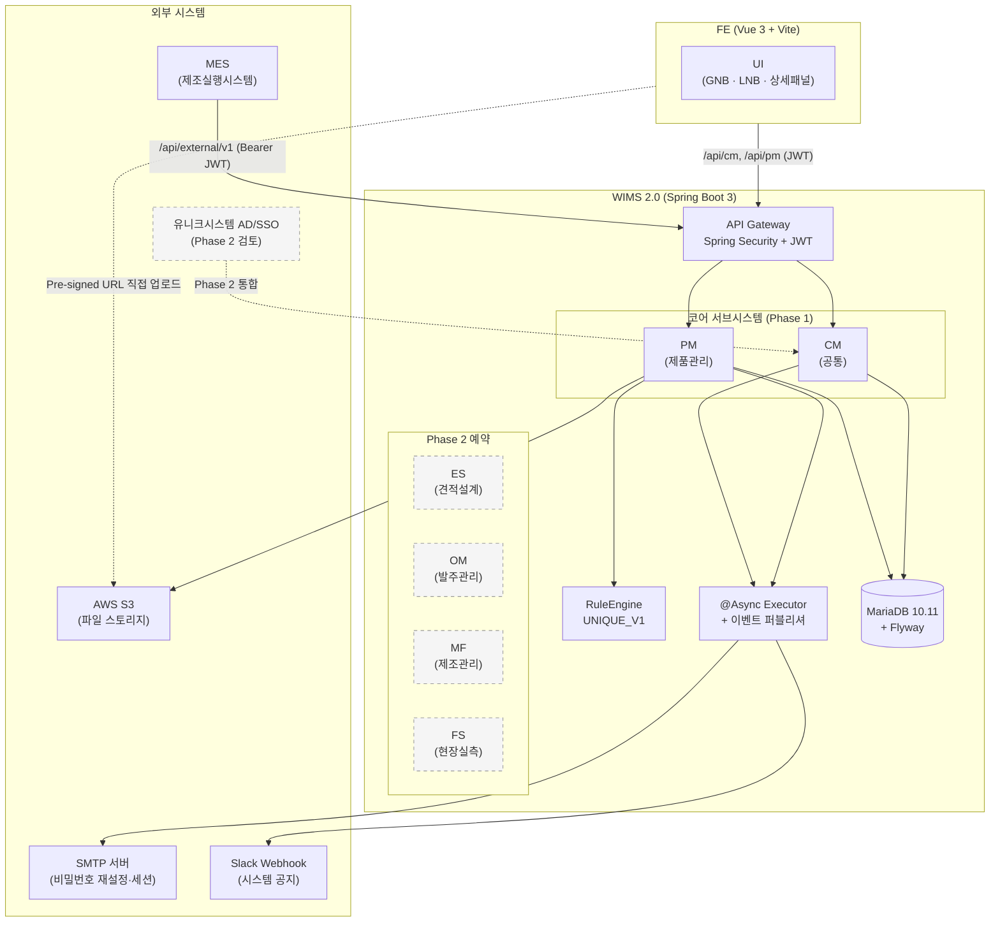
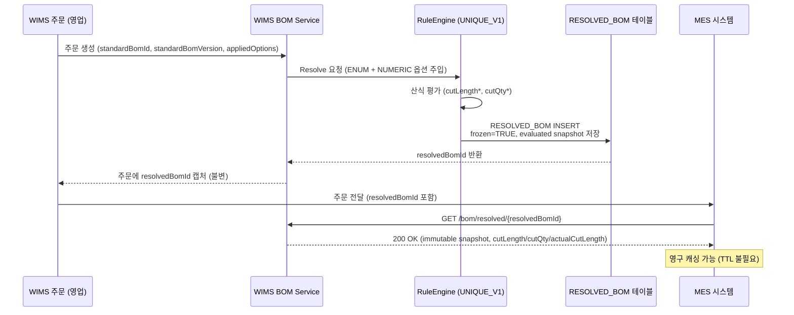
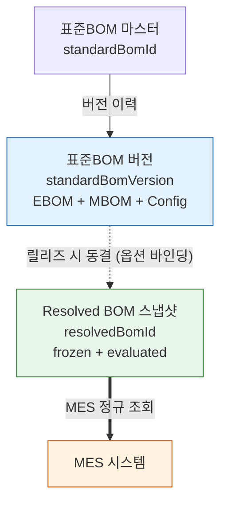
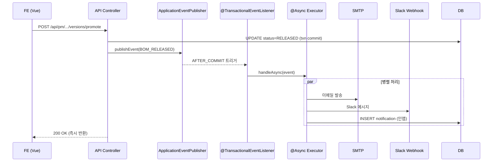

# DE24-1 인터페이스 설계서 v2.0 (통합본, r2)

**문서코드:** DE24-1
**버전:** v2.0-r2 (내부 revision, v2.0 본문 보존)
**작성일:** 2026-04-07 (최종 개정 2026-04-27)
**작성자:** 김진호 (BE, 코드크래프트)
**검토자:** 김지광 (PM, 코드크래프트)
**MES팀 확인:** 배봉균, 신세은 (MES팀) — MES 외부 API 한정
**상태:** 초안 — 통합 인터페이스 설계서

> [!abstract] v2.0 통합본 취지
> v1.x 계열은 **MES 외부 API** 명세(§1~§10)에 **PM 내부 API**(§11)가 덧붙은 임시 구조였다. v2.0 은 WIMS 2.0 시스템이 주고받는 **모든 인터페이스**를 (1) 외부 REST, (2) 내부 REST, (3) 이벤트·비동기, (4) 데이터 인터페이스의 네 축으로 재편해 한 문서에서 관리한다. 사용자 인터페이스(화면)는 [[DE22-1_화면설계서_v1.6]] 가 담당한다.
>
> MES 팀 서명용 외부 API 계약은 §4.1 본문 + **부록 A (발췌본)** 으로 독립 배포 가능하도록 분리했다.

---

## 변경 이력

| 버전 | 일자 | 작성자 | 변경 내용 |
|------|------|--------|----------|
| **v2.0-r2** | **2026-04-27** | **김지광** | **관리자 인증 사양 확정 (admin = 일반 사용자 단일 모델, IF-CM-AUTH-001/002/003 백엔드 SOT).** (1) §3.2.1 JWT 정책: 알고리즘 HS256 명시 / accessToken **1h** · refreshToken **24h** (관리자) 로 명문화 / claims 구조(`sub`=adminId, `jti`, `iat`, `exp`, `typ`=access\|refresh) / `JWT_SECRET` env var 강제 (prod), `application-local.yml` fallback (dev). (2) §3.2.5 ROLE 표에 admin 단일 사용자 모델 메모 추가 (Phase 2 정규화). (3) §5.2.1 인증 본문 강화: 관리자 = 일반 사용자 단일 모델 명시, Redis 활용(`refresh:{adminId}:{jti}` 저장 / `session:{adminId}` 활성 jti 1개 / `bl:{jti}` 로그아웃 blacklist), 5회 실패 시 `admin.status='SUSPENDED'` 자동 전환 + IF-EVT-USR-001 발행, LoginRequest/LoginResponse/RefreshRequest/RefreshResponse DTO 스키마 표 추가. (4) DE33-1 wikilink v1.2→v1.3 일괄 치환. **메타: r2 = v2.0 본문 보존 + internal revision** (파일명 v2.0 유지). |
| **v2.0-r1** | **2026-04-24** | **김지광** | **DEC-06 Spring Security ROLE 사전 정렬 + DEC-07 BOM_RULE 이력 조회 엔드포인트 신설.** (1) §3.2.5 RBAC 표를 DE11-1 §7.3 역할 사전 SOT 의 API 요약으로 재편. 구 `ROLE_USER` → `ROLE_PM_VIEWER` 일괄 치환, 구 `ROLE_BOM_EDITOR` → `ROLE_PM_EDITOR` 일괄 치환. (2) §5.3.11.1 BOM_RULE 변경 이력 조회 엔드포인트(`GET /api/pm/products/{productCode}/rules/{ruleId}/history`) 신설. (3) §8 IF-ID 매트릭스에 `IF-PM-DTB-002` 행 추가. |
| **v2.0** | **2026-04-23** | **김진호** | **통합본 전면 개편.** (1) 인터페이스 분류 체계 §2 신설 — 외부 REST / 내부 REST / 이벤트 / 데이터 4축 분류. (2) 공통 규약 §3 재편 (인증·헤더·응답 래퍼·에러·페이징·CORS·Rate Limit·감사로그 통합). (3) 외부 인터페이스 §4 확장 — 4.1 MES(v1.8 보존), 4.2 AWS S3 Pre-signed URL, 4.3 SSO/사내 계정, 4.4 이메일·Slack 신설. (4) 내부 REST §5 재편 — 5.2 CM(공통) API 신설(인증·사용자·그룹·코드·시스템설정 6군), 5.3 PM API 이전 및 자재·거래처·공정·제품·프로젝트 확장, 5.4 Phase 2 ES/OM/MF/FS Base path 예약. (5) 이벤트·비동기 §6 신설 — 도메인 이벤트 카탈로그(DE22-1 §3.7 이관), 알림 채널, @Async 경로. (6) 데이터 인터페이스 §7 신설 — Flyway, 파일, Excel. (7) IF-ID 매트릭스 §8 신설 — 전체 인터페이스 통합 식별. (8) NFR 매핑 §12 신설. (9) 부록 A MES 발췌본 신설(서명용). 기존 v1.8 MES API 계약·v1.9 PM 엔드포인트 전부 보존. |
| v1.9 | 2026-04-22 | 김진호 | PM 도메인 §11 신설 (파생제품/다이스북/공급사/자재-공급사/옵션별규칙템플릿/결정표/시뮬레이터 31개 엔드포인트). Base path `/api/pm`. |
| v1.8 | 2026-04-16 | 김진호 | 용어사전 BOM v1.4 반영. Resolved BOM 응답 DTO 에 절단 속성 8필드(`itemCategory`·`cutDirection`·`cutLength`·`cutLength2`·`cutQty`·`actualCutLength`·`supplyDivision`·`ruleEngineVersion`) + 트리 식별 키 2개(`nodeId`·`parentNodeId`) 추가. `?supplyDivision`·`?debug` 쿼리 파라미터. frozen 불변성 계약 명문화. `optionsHash` 규칙(NUMERIC 제외). 에러코드 `OPTION_ENABLEMENT_VIOLATION`·`FORMULA_EVALUATION_ERROR` 2종 신설. |
| v1.7 | 2026-04-14 | 김진호 | 단일 표준BOM 버전축 모델 정착 (productVersion/configVersion 분리 축 제거). |
| v1.6 | 2026-04-14 | 김진호 | 외부/내부 API path prefix 분리 정책 도입. |
| v1.5 | 2026-04-14 | 김진호 | "Resolved BOM 최신 RELEASED 조회" 절 삭제. 식별자 vs 버전 축 분리 반영. |
| v1.4 | 2026-04-14 | 김진호 | Resolved BOM 불변 스냅샷 모델 도입. `GET /bom/resolved/{resolvedBomId}` MES 정규 경로 신설. |
| v1.3 | 2026-04-14 | 김진호 | Config 조회 엔드포인트 2종을 MES 노출 API 로 추가. |
| v1.2 | 2026-04-14 | 김진호 | `format=flat` 제거. tree 단일 응답. |
| v1.1 | 2026-04-14 | 김진호 | DHS-AE225-D-1 BOM 정리 분석 결과 반영. |
| v1.0 | 2026-04-07 | 김진호 | 초안 — MES REST API 규격. |

---

## 목차

```
§1  개요
§2  인터페이스 아키텍처
§3  공통 규약
§4  외부 인터페이스 (MES · S3 · SSO · Email/Slack)
§5  내부 REST API (CM · PM · Phase 2 예약)
§6  이벤트·알림·비동기
§7  데이터 인터페이스 (Flyway · 파일 · Excel)
§8  인터페이스 목록 (IF-ID 매트릭스)
§9  데이터 모델 (DTO)
§10 성능·SLA
§11 버전 관리
§12 NFR 매핑
§13 개방이슈·후속
부록 A — MES 팀 서명용 외부 API 발췌본
부록 B — Swagger/OpenAPI 3.0 명세
부록 C — 용어사전 v1.4 §7 금지어 검증 결과
```

---

## §1. 개요

### 1.1 목적·배경

WIMS 2.0 시스템이 외부 시스템·내부 서브시스템·데이터 스토어·이벤트 버스와 주고받는 **모든 인터페이스**의 설계 계약을 단일 문서로 통합 관리한다.

- **v1.x 계열**: MES 연동이 시발점 — 외부 REST API 만의 계약서로 시작
- **v1.9**: PM 도메인 내부 API 를 §11 로 임시 편입
- **v2.0 (본 문서)**: 인터페이스를 네 축(외부 REST · 내부 REST · 이벤트 · 데이터)으로 재분류하여 일관된 공통 규약 아래 통합

> [!info] 통합의 이유
> 인터페이스 설계는 "MES 외부 API" 만의 문제가 아니다. 내부 서브시스템 간 REST 호출, 비동기 도메인 이벤트, S3·이메일·Slack·SSO 등 외부 인프라 연동, DB 마이그레이션·파일·Excel 등 데이터 채널까지 모두 계약(contract) 을 갖는다. 한 문서에서 관리해야 중복·모순을 방지할 수 있다.

### 1.2 적용 범위

| 구분 | 포함 | 참조 |
|------|:---:|------|
| 사용자 UI | ❌ | [[DE22-1_화면설계서_v1.6]] |
| 외부 REST (MES 등) | ✅ | §4 |
| 내부 REST (FE↔BE) | ✅ | §5 |
| 도메인 이벤트·알림 | ✅ | §6 |
| 데이터 인터페이스 (DB·파일·Excel) | ✅ | §7 |
| 내부 구현(서비스 계층) | ❌ | [[DE11-1_소프트웨어_아키텍처_설계서_v1.2]] |

### 1.3 참조 문서

| 문서코드 | 문서명 | 용도 |
|---------|--------|------|
| [[WIMS_용어사전_BOM_v1.4]] | 용어사전 BOM v1.4 | 용어·스키마·산식 언어 표준 (기준 문서) |
| [[DE11-1_소프트웨어_아키텍처_설계서_v1.2]] | SW 아키텍처 설계서 | 기술 스택·레이어·RuleEngine |
| [[DE22-1_화면설계서_v1.6]] | 화면설계서 | UI·화면 요구사항·알림 이벤트 |
| [[DE32-1_BOM도메인_ER다이어그램_v1.2]] | ER 다이어그램 | 데이터 모델 |
| [[DE33-1_DB물리스키마_설계서_v1.3]] | DB 물리 스키마 | 테이블·Flyway·데이터 인터페이스 |
| [[DE35-1_미서기이중창_표준BOM구조_정의서_v1.6]] | 표준 BOM 구조 | BOM 계층·품목코드 체계 |
| [[AN12-1_요구사항정의서_Phase1_v1.1]] | 요구사항정의서 | FR·NFR 기준 |
| [[AN14-1_요구사항추적표_v1.2]] | 요구사항 추적표 | IF-ID ↔ FR/NFR 매핑 |
| V3 (archived) | V3 리포트 | 설계 문서 영향도 |
| V4 (archived) | V4 리포트 | supplyDivision 등 |

### 1.4 관련 요구사항

| 요구사항 ID | 내용 | 유형 | 본 문서 대응 |
|------------|------|------|-------------|
| [[AN12-1_요구사항정의서_Phase1_v1.1#FR-PM-013\|FR-PM-013]] | MES 연동 BOM 데이터 인터페이스 | 기능 | §4.1 |
| NFR-IF-PM-001 | MES REST API 규격 정의 | 인터페이스 | §4.1 |
| NFR-IF-PM-002 | API 버전 관리 (Semantic Versioning) | 인터페이스 | §11 |
| NFR-IF-PM-003 | 데이터 캡슐화 (DTO 기반 I/O) | 인터페이스 | §9 |
| NFR-SC-PM-001 | MES 전용 서비스 계정 발급·관리 | 보안 | §3.2.2 |
| NFR-PF-PM-002 | MES REST API 응답시간 p95 ≤ 500ms | 성능 | §10.1 |
| NFR-PF-PM-003 | RuleEngine 평가 100ms 이내 | 성능 | §10.1 |
| NFR-PF-PM-004 | Resolved BOM 생성 3초 이내 | 성능 | §10.1 |
| NFR-PF-PM-005 | BOM_RULE 조회 500ms 이내 | 성능 | §10.1 |
| NFR-MT-CM-003 | Swagger/OpenAPI 자동화 | 유지보수 | §4.5, 부록 B |

---

## §2. 인터페이스 아키텍처

### 2.1 시스템 구성도 (통합뷰)



### 2.2 인터페이스 분류 체계

| 분류 | ID 접두 | 예시 | 본 문서 섹션 |
|------|--------|------|:-----------:|
| 사용자 UI | — | SCR-PM-*, SCR-CM-* | (DE22-1 별도) |
| 외부 REST | `IF-MES-*` / `IF-EXT-*` | MES API, S3, Email, Slack | §4 |
| 내부 REST | `IF-PM-*` / `IF-CM-*` | `/api/pm/*`, `/api/cm/*` | §5 |
| 이벤트·비동기 | `IF-EVT-*` | BOM 승격, 파생 승인 요청 | §6 |
| 데이터 | `IF-DATA-*` | Flyway, 파일, Excel | §7 |

전체 IF-ID 카탈로그는 §8 에 매트릭스 형태로 통합 나열한다.

### 2.3 MES ↔ WIMS BOM 호출 흐름 (v1.8 보존)



### 2.4 연동 원칙

| # | 원칙 | 설명 |
|---|------|------|
| 1 | **Base path 분리** | 외부 `/api/external/v1`, 내부 `/api/cm`·`/api/pm`. 혼용 금지 |
| 2 | **외부는 읽기 전용(Phase 1)** | MES 계정은 GET 만 허용 |
| 3 | **Released 버전만 외부 노출** | Draft/Under Review 는 외부 미노출 |
| 4 | **snapshot 불변성 계약** | `frozen=TRUE` Resolved BOM 은 재평가 금지. 규정 변경 시 DEPRECATED → 신규 `standardBomVersion` |
| 5 | **DTO 기반 I/O** | 엔터티 직접 노출 금지. NFR-IF-PM-003 |
| 6 | **Semantic Versioning** | MAJOR 비호환 변경 시 `/v2/` 신규 경로. NFR-IF-PM-002 |
| 7 | **이벤트는 인-프로세스 우선** | Spring `ApplicationEventPublisher` + `@TransactionalEventListener`. Kafka/RabbitMQ 는 Phase 2 검토 |

---

## §3. 공통 규약

### 3.1 Base URL / Prefix 정책

| 구분 | Prefix | 노출 대상 | 인증 |
|------|--------|---------|------|
| 외부 (MES 등) | `/api/external/v1/**` | MES, 향후 B2B 파트너 | 서비스 계정 JWT |
| 인증 | `/api/auth/**` | 전체 | 비인증 허용 (login/refresh) |
| 내부 CM | `/api/cm/**` | WIMS FE, 관리자 | 사용자 JWT |
| 내부 PM | `/api/pm/**` | WIMS FE | 사용자 JWT |
| 내부 Phase 2 | `/api/es/**`, `/api/om/**`, `/api/mf/**`, `/api/fs/**` | Phase 2 FE | 사용자 JWT |

환경별 호스트:

| 환경 | Host |
|------|------|
| 개발 (DEV) | dev-api.wims.local |
| 테스트 (TEST) | test-api.wims.local |
| 스테이징 (STG) | stg-api.wims.example.com |
| 운영 (PROD) | api.wims.example.com |

**Prefix 위반 시:** `ROLE_MES_READER` 가 `/api/cm/**` · `/api/pm/**` 호출하면 `403 FORBIDDEN_PREFIX` 반환. 반대로 일반 사용자가 `/api/external/v1/**` 호출하면 `403 AUTH_UNAUTHORIZED`.

### 3.2 인증·인가

#### 3.2.1 JWT (사용자 계정 = 관리자)

> [!info] v2.0-r2 명문화 (2026-04-27)
> WIMS 2.0 Phase 1 은 **관리자 = 일반 사용자 단일 모델**. JWT sub claim 은 `admin.admin_id` 로 발급. 토큰 TTL 은 DEC-03 정합 / IF-CM-AUTH-001/002/003 ([[DE33-1_DB물리스키마_설계서_v1.3]] §3.21 `admin`) 백엔드 SOT.

| 항목 | 규격 |
|------|------|
| 방식 | JWT Bearer Token |
| 알고리즘 | **HS256 (HMAC-SHA256)** |
| accessToken TTL | **1시간 (3,600초)** — DEC-03 정합 |
| refreshToken TTL | **24시간 (86,400초)** — DEC-03 정합 |
| 전송 | `Authorization: Bearer <token>` |
| 서명 키 보관 (prod) | **환경변수 `JWT_SECRET` 강제 주입** (없으면 부팅 실패) |
| 서명 키 보관 (dev) | `application-local.yml` fallback (dev 전용 placeholder secret) |
| Refresh 저장 | Redis `refresh:{adminId}:{jti}` (TTL = refreshToken TTL) |
| 중복 로그인 방지 | Redis `session:{adminId}` 에 활성 access `jti` 1개만 유지 (신규 발급 시 기존 invalidate) |
| 로그아웃 blacklist | Redis `bl:{jti}` (TTL = access 잔여 만료까지) |

**Claims 구조:**

```json
{
  "sub": "admin01",
  "jti": "9b1c…",
  "iat": 1716796800,
  "exp": 1716800400,
  "typ": "access"
}
```

| 필드 | 설명 |
|------|------|
| `sub` | `admin.admin_id` (로그인 ID) |
| `jti` | 토큰 고유 ID (UUID v4). Redis 키 구성에 사용 |
| `iat` | 발급 시각 (Unix epoch sec) |
| `exp` | 만료 시각 (Unix epoch sec) |
| `typ` | `access` 또는 `refresh` |

> [!warning] secret 운영 정책
> prod 환경에서 `JWT_SECRET` env var 가 미주입 / 32 bytes 미만 / placeholder 값일 경우 Spring Boot 부팅을 거부한다 (Fail-fast). 키 회전(rotation) 정책은 후속 ([[STATUS]] 후속 작업 섹션 참조).

내부 FE 사용. TTL 은 향후 [[SCR-CM-007_시스템설정]] 세션·잠금 카테고리에서 ADMIN 이 조정 가능 (Phase 1 은 고정값으로 운영).

#### 3.2.2 서비스 계정 (MES 등 외부)

| 항목 | 내용 |
|------|------|
| 계정 유형 | 서비스 계정 (비대화형) |
| 예시 계정 ID | `mes-service` (협의 확정 예정) |
| 역할 | `ROLE_MES_READER` (GET 만 허용) |
| 허용 경로 | `/api/external/v1/bom/**`, `/materials/**`, `/processes/**` |
| accessToken TTL | **8시간 (28,800초)** — 장시간 세션 대응 |
| refreshToken TTL | 7일 |
| IP 화이트리스트 | MES 서버 IP 고정 (협의 확정 예정) |

> [!warning] NFR-SC-PM-001
> 서비스 계정은 사용자 계정 테이블과 **물리적으로 분리된 별도 테이블**(`service_account`) 로 관리. 클라이언트 시크릿은 BCrypt 해시 저장. 탈취 시 즉시 회수 가능.

#### 3.2.3 토큰 발급·갱신 API

**사용자 로그인:** `POST /api/auth/login`

```json
{
  "loginId": "kim.jinho",
  "password": "********"
}
```

**사용자 토큰 갱신:** `POST /api/auth/refresh`

```json
{ "refreshToken": "dGhpcyBpcyBhIHJlZnJl..." }
```

**MES 서비스 계정 토큰 발급:** `POST /api/external/v1/auth/token`

```json
{
  "clientId": "mes-service",
  "clientSecret": "****"
}
```

**Response (200 OK, 공통):**

```json
{
  "accessToken": "eyJhbGciOiJIUzI1NiIs...",
  "tokenType": "Bearer",
  "expiresIn": 3600,
  "refreshToken": "dGhpcyBpcyBhIHJlZnJl..."
}
```

> 사용자 계정(관리자)는 access 1h(3,600s) / refresh 24h. MES 서비스 계정은 별도 TTL(§3.2.2).

#### 3.2.4 JWT 클레임 구조

> [!info] v2.0-r2 정정 (2026-04-27)
> 관리자 단일 모델 (Phase 1) 에서는 `role`/`uid`/`grp`/`iss` 등 보조 claims 를 생략하고 §3.2.1 의 표준 5-필드(`sub`·`jti`·`iat`·`exp`·`typ`) 만 사용한다. ROLE 정규화는 Phase 2 ([[DE11-1_소프트웨어_아키텍처_설계서_v1.2]] §7.3) 에서 추가.

**관리자 (Phase 1):**

```json
{
  "sub": "admin01",
  "jti": "9b1c4d2e-...",
  "iat": 1711843200,
  "exp": 1711846800,
  "typ": "access"
}
```

**MES 서비스 계정:**

```json
{
  "sub": "mes-service",
  "role": "ROLE_MES_READER",
  "iat": 1711843200,
  "exp": 1711872000,
  "iss": "wims-api"
}
```

MES 서비스 계정은 §3.2.2 의 별도 정책(TTL 8h)을 따르며 `role` claim 보유.

#### 3.2.5 RBAC 역할 체계

> [!info] 역할 SOT: [[DE11-1_소프트웨어_아키텍처_설계서_v1.2]] §7.3 역할 사전
> 본 절은 DE11-1 §7.3 역할 사전의 API 관점 요약이다. 신규 역할 추가·명칭 변경은 DE11-1 §7.3 에서 선행하고 본 문서는 후행 정렬한다. 구 `ROLE_USER` → `ROLE_PM_VIEWER`, 구 `ROLE_PRODUCT_EDITOR`·`ROLE_SUPPLIER_EDITOR` → `ROLE_PM_EDITOR` 로 흡수 (DE24-1 v2.0-r1, 2026-04-24).

> [!warning] v2.0-r2 — Phase 1 관리자 단일 모델 (2026-04-27)
> Phase 1 의 인증/인가 단일 SOT 는 [[DE33-1_DB물리스키마_설계서_v1.3]] §3.21 `admin` 이며, **모든 admin 은 동일 권한**으로 운영된다 (별도 ROLE 컬럼 미보유). Spring Security 정책은 우선 `/api/auth/**` permitAll + 나머지 `/api/**` `authenticated` 로 시작하고, 아래 ROLE 표의 세분화된 RBAC 적용은 후속 (Phase 2 사용자/역할 정규화 시) 단계로 위임한다. JWT 의 ROLE-기반 라우팅은 Phase 2 활성화 시점에 일괄 시행.

| Role | 설명 | 주요 권한 |
|------|------|---------|
| `ROLE_ADMIN` | 시스템 슈퍼관리자 | 전체 CRUD + 시스템 설정 |
| `ROLE_PM_ADMIN` | 제품관리 도메인 관리자 | 제품·BOM·옵션별규칙 승인 포함 |
| `ROLE_PM_EDITOR` | 제품·BOM 편집자 (구 `ROLE_PRODUCT_EDITOR` / `ROLE_SUPPLIER_EDITOR` 흡수) | 제품·BOM·공급사·자재-공급사·파생·옵션규칙 CRUD |
| `ROLE_PM_VIEWER` | 제품관리 조회자 (구 `ROLE_USER`) | 조회 전용 |
| `ROLE_RULE_EDITOR` | BOM_RULE 전담 편집자 | 템플릿·결정표·시뮬레이터 CRUD (PM_EDITOR 의 BOM_RULE 영역 subset) |
| `ROLE_ESTIMATE_EDITOR` | 견적(ES) 편집자 | Phase 2 ES overlay CRUD |
| `ROLE_MES_READER` | MES 서비스 계정 | `/api/external/v1/**` GET only |

권한 모델 상세·레거시 마이그레이션 맵은 [[DE11-1_소프트웨어_아키텍처_설계서_v1.2]] §7.3 참조.

### 3.3 공통 헤더

**요청:**

| 헤더 | 필수 | 값 | 설명 |
|------|:---:|------|------|
| `Authorization` | ✓ | `Bearer <token>` | JWT. `/api/auth/login` 제외 |
| `Content-Type` | △ | `application/json` | POST/PUT/PATCH 시 필수 |
| `Accept` | ✓ | `application/json` | 응답 형식 |
| `X-Request-ID` | | UUID | 요청 추적. 클라이언트 생성 또는 서버 부여 |
| `If-Match` | △ | ETag/version | 낙관적 락 수정 시 |

**응답:**

| 헤더 | 값 | 설명 |
|------|------|------|
| `Content-Type` | `application/json; charset=UTF-8` | |
| `X-Request-ID` | UUID | 요청 추적 반향 |
| `X-Response-Time` | `123ms` | 서버 처리 시간 |
| `Deprecated` | `true` / `<date>` | Deprecation 예고 (§11.3) |

### 3.4 공통 응답 구조

**성공 (단일 리소스):**

```json
{
  "success": true,
  "data": { },
  "meta": {
    "requestId": "550e8400-e29b-41d4-a716-446655440000",
    "timestamp": "2026-04-23T09:30:00+09:00",
    "apiVersion": "v1"
  }
}
```

**성공 (목록/페이지):**

```json
{
  "success": true,
  "data": [ ],
  "pagination": {
    "page": 0,
    "size": 20,
    "totalElements": 137,
    "totalPages": 7,
    "sort": "updatedAt,desc"
  },
  "meta": { }
}
```

**에러:**

```json
{
  "success": false,
  "error": {
    "code": "RESOLVED_BOM_NOT_FOUND",
    "message": "요청한 Resolved BOM 스냅샷을 찾을 수 없습니다.",
    "details": "resolvedBomId: RBOM-DHS-AE225-D-1-sbv1-zzzzzzzz",
    "field": null
  },
  "meta": { }
}
```

### 3.5 에러 체계

#### 3.5.1 HTTP 상태 코드

| 코드 | 의미 | 사용 상황 |
|:----:|------|---------|
| 200 | OK | 정상 응답 |
| 201 | Created | 신규 리소스 생성 |
| 204 | No Content | 삭제·업데이트 성공 (응답 본문 없음) |
| 400 | Bad Request | 요청 포맷/파라미터 오류 |
| 401 | Unauthorized | 토큰 없음/만료/변조 |
| 403 | Forbidden | 권한 부족 |
| 404 | Not Found | 리소스 없음 |
| 409 | Conflict | 낙관적 락 실패, 중복 |
| 410 | Gone | DEPRECATED 리소스 |
| 422 | Unprocessable Entity | 유효성 검증 실패, 비즈니스 제약 위반 |
| 429 | Too Many Requests | Rate Limit 초과 |
| 500 | Internal Server Error | 서버 내부 오류 |

#### 3.5.2 에러 코드 카탈로그 (공통 + 도메인)

| 에러 코드 | HTTP | 도메인 | 설명 |
|----------|:---:|-------|------|
| `AUTH_TOKEN_EXPIRED` | 401 | 인증 | JWT 만료 |
| `AUTH_TOKEN_INVALID` | 401 | 인증 | JWT 변조/형식 오류 |
| `AUTH_UNAUTHORIZED` | 403 | 인증 | 권한 없음 |
| `AUTH_METHOD_NOT_ALLOWED` | 403 | 인증 | 허용되지 않은 메서드 |
| `FORBIDDEN_PREFIX` | 403 | 인증 | Prefix 위반 호출 |
| `BAD_REQUEST` | 400 | 공통 | 요청 형식 오류 |
| `INVALID_PARAMETER` | 400 | 공통 | 쿼리 파라미터 enum 외 값 등 |
| `VERSION_CONFLICT` | 409 | 공통 | 낙관적 락 충돌 |
| `RATE_LIMIT_EXCEEDED` | 429 | 공통 | Rate Limit 초과 |
| `INTERNAL_SERVER_ERROR` | 500 | 공통 | 서버 내부 오류 |
| `BOM_NOT_FOUND` | 404 | BOM | BOM 없음 |
| `BOM_NOT_RELEASED` | 404 | BOM | RELEASED 상태 없음 |
| `RESOLVED_BOM_NOT_FOUND` | 404 | BOM | 존재하지 않는 resolvedBomId |
| `RESOLVED_BOM_DEPRECATED` | 410 | BOM | DEPRECATED 스냅샷 |
| `OPTION_ENABLEMENT_VIOLATION` | 422 | BOM | `enablement_condition` 위반 (용어사전 v1.4 §11) |
| `FORMULA_EVALUATION_ERROR` | 500 | BOM | RuleEngine 평가 실패. 산식 원문은 서버 로그에만 기록 |
| `MATERIAL_NOT_FOUND` | 404 | 자재 | 자재 코드 조회 실패 |
| `PROCESS_NOT_FOUND` | 404 | 공정 | 공정 코드 조회 실패 |
| `PRODUCT_NOT_FOUND` | 404 | 제품 | 제품 코드 조회 실패 |
| `DERIVATIVE_CODE_DUPLICATE` | 422 | 파생 | `derivativeCode` 중복 |
| `DERIVATIVE_KIND_CONFLICT` | 409 | 파생 | `derivativeOf`+`derivativeKind` 조합 활성 중복 |
| `SUPPLIER_NOT_FOUND` | 404 | 공급사 | 공급사 ID 조회 실패 |
| `ITEM_SUPPLIER_PRIORITY_CONFLICT` | 409 | 매핑 | priority=1 동시 2개 활성 |
| `ITEM_SUPPLIER_ROLE_VIOLATION` | 422 | 매핑 | PRIMARY 는 priority=1 과만 허용 |
| `TEMPLATE_NOT_FOUND` | 404 | 규칙 | 템플릿 없음 |
| `TEMPLATE_DEFINITION_INVALID` | 422 | 규칙 | `ruleDefinition` 스키마 위반 |
| `BUILTIN_TEMPLATE_IMMUTABLE` | 403 | 규칙 | 빌트인 템플릿 PUT/DELETE 시도 |
| `USER_LOCKED` | 403 | CM | 비밀번호 5회 실패 잠금 (SCR-CM-007) |
| `USER_PASSWORD_POLICY_VIOLATION` | 422 | CM | 비밀번호 정책 위반 |

**에러 응답 예시 (`OPTION_ENABLEMENT_VIOLATION`):**

```json
{
  "success": false,
  "error": {
    "code": "OPTION_ENABLEMENT_VIOLATION",
    "message": "선택한 옵션 조합이 활성화 조건을 만족하지 않습니다.",
    "details": "OPT-DIM-W1 (enablement: OPT-LAY IN ('W1XH1-3편','W3XH2-3편','W3XH3-3편')) — 현재 OPT-LAY=W2XH1-2편"
  },
  "meta": { }
}
```

### 3.6 페이징·정렬·필터

| 파라미터 | 타입 | 기본값 | 설명 |
|---------|------|:------:|------|
| `page` | int | 0 | 페이지 번호 (0-base) |
| `size` | int | 20 | 페이지당 항목 수 (최대 100) |
| `sort` | string | `updatedAt,desc` | `field,asc|desc` 콤마 연결 다중 지정 가능 |
| `search` | string | - | 키워드 검색 (도메인 해석) |

**응답의 `pagination` 필드**는 §3.4 참조.

### 3.7 날짜/시간·숫자 형식

| 항목 | 규격 |
|------|------|
| 날짜 | `2026-04-23` (ISO 8601) |
| 일시 | `2026-04-23T09:30:00+09:00` (KST) 또는 `2026-04-23T00:30:00Z` (UTC) |
| 시간대 | 외부 API: UTC 권장. 내부 API: KST (+09:00) 허용 |
| 통화 | 원(KRW) 정수. 소수점 미사용 |
| 수치 필드 | JSON number (`decimal` 은 문자열 금지). 금액은 정수 |
| 길이 (BOM) | mm 단위 decimal |

### 3.8 CORS · 보안 헤더

| 항목 | 값 | 비고 |
|------|-----|------|
| `Access-Control-Allow-Origin` | 화이트리스트 기반 | `wims.example.com`, `*.wims.example.com` |
| `Access-Control-Allow-Methods` | `GET, POST, PUT, PATCH, DELETE, OPTIONS` | |
| `Access-Control-Allow-Headers` | `Authorization, Content-Type, X-Request-ID, If-Match` | |
| `Access-Control-Allow-Credentials` | `true` | refreshToken 쿠키 사용 시 |
| `X-Content-Type-Options` | `nosniff` | MIME 스니핑 방지 |
| `X-Frame-Options` | `DENY` | Clickjacking 방지 |
| `Strict-Transport-Security` | `max-age=31536000; includeSubDomains` | HTTPS 강제 (PROD) |
| `Content-Security-Policy` | `default-src 'self'; img-src 'self' data: https:` | FE SPA 기준 |
| `Referrer-Policy` | `strict-origin-when-cross-origin` | |

### 3.9 Rate Limiting

| 계정 유형 | 분당 | 시간당 | 초과 시 |
|---------|:---:|:-----:|--------|
| 사용자 계정 (`ROLE_PM_VIEWER`) | 300 | 10,000 | 429 + `Retry-After` |
| 사용자 계정 (`ROLE_ADMIN`) | 600 | 20,000 | 429 + `Retry-After` |
| MES 서비스 계정 | 60 | 1,000 | 429 + `Retry-After` |

구현: Bucket4j + Redis (Phase 1 은 애플리케이션 메모리 기반 허용).

### 3.10 API 호출 로그 · 감사

모든 API 호출에 대해 다음 항목을 구조화 로그(JSON)로 기록한다:

| 필드 | 예시 | 용도 |
|------|------|------|
| `timestamp` | `2026-04-23T09:30:00.123Z` | 시각 |
| `requestId` | UUID | 상관관계 키 |
| `principal` | `kim.jinho` / `mes-service` | 호출자 |
| `role` | `ROLE_PM_EDITOR` | 권한 |
| `method` | `POST` | HTTP 메서드 |
| `endpoint` | `/api/pm/products/SLD-UL-01/bom` | 경로 |
| `statusCode` | 200 | 응답 코드 |
| `responseTimeMs` | 123 | 처리 시간 |
| `ip` | `10.0.0.12` | 클라이언트 IP |
| `userAgent` | `MES-Client/1.2` | |

보관: PROD 90일 (CloudWatch Logs), 감사 대상 엔드포인트(변경 작업)는 별도 `audit_log` 테이블에 영구 저장.

---

## §4. 외부 인터페이스

### 4.1 MES 연동 (`/api/external/v1`)

> [!info] v1.8 MES API 계약 보존
> 본 §4.1 은 v1.8 MES API 계약 원문을 그대로 이전한 것이다. MES 팀 서명 대상. 독립 배포용 발췌본은 **부록 A** 참조.

#### 4.1.1 서비스 계정·인증 (§3.2.2 요약)

MES 시스템은 `mes-service` 서비스 계정으로 `/api/external/v1/auth/token` 에 `clientId`·`clientSecret` 을 POST 하여 accessToken(TTL 8시간)을 발급받는다. 모든 호출은 `Authorization: Bearer <token>`.

#### 4.1.2 표준 BOM API (`/bom/standard`)

| # | Method | Endpoint | 설명 | 화면 |
|---|--------|----------|------|------|
| 1 | GET | `/bom/standard` | 표준BOM 목록 조회 (Released) | — |
| 2 | GET | `/bom/standard/{standardBomId}` | 표준BOM 마스터 조회 | — |
| 3 | GET | `/bom/standard/{standardBomId}/versions` | 버전 이력 조회 | — |
| 4 | GET | `/bom/standard/{standardBomId}/versions/{standardBomVersion}` | 특정 버전 상세 (EBOM+MBOM+Config 묶음) | — |

**Query (공통 목록):**

| 파라미터 | 타입 | 필수 | 설명 |
|---------|------|:---:|------|
| `category` | string | | 제품 분류 (SLD, DSLD, CW 등) |
| `status` | string | | 기본 `RELEASED` |
| `keyword` | string | | 제품명/BOM 명칭 검색 |
| `page`, `size` | int | | 페이징 |

**Response (GET `/bom/standard`, 목록 예시):**

```json
{
  "success": true,
  "data": [
    {
      "standardBomId": "DHS-AE225-D-1",
      "standardBomName": "225mm 단열 중중연 이중창",
      "category": "SLD",
      "grade": "1등급",
      "material": "AL",
      "insulation": true,
      "latestStandardBomVersion": 1,
      "latestVersionStatus": "RELEASED",
      "versionCount": 1,
      "releasedAt": "2026-04-01T10:00:00+09:00",
      "updatedAt": "2026-04-07T14:30:00+09:00"
    }
  ],
  "pagination": { },
  "meta": { }
}
```

**Response (GET `/bom/standard/{standardBomId}`):**

```json
{
  "success": true,
  "data": {
    "standardBomId": "DHS-AE225-D-1",
    "standardBomName": "225mm 단열 중중연 이중창",
    "category": "SLD",
    "status": "ACTIVE",
    "latestStandardBomVersion": 1,
    "latestReleasedVersion": 1,
    "versionCount": 1,
    "deprecatedVersionCount": 0,
    "createdAt": "2026-04-01T10:00:00+09:00",
    "updatedAt": "2026-04-07T14:30:00+09:00"
  }
}
```

**Response (GET `/versions/{standardBomVersion}` 특정 버전):**

```json
{
  "success": true,
  "data": {
    "standardBomId": "DHS-AE225-D-1",
    "standardBomVersion": 1,
    "standardBomName": "225mm 단열 중중연 이중창",
    "status": "RELEASED",
    "mbom": {
      "totalItems": 38,
      "assemblies": ["후렘(프레임) 공정 라인", "문짝 공정 라인"]
    },
    "config": {
      "totalOptionGroups": 7,
      "optionGroups": ["설치구성", "절단방식", "유리사양", "프레임재질", "색상", "부속", "치수(OPT-DIM)"],
      "releasedConfigCount": 1
    },
    "ruleEngineVersion": "UNIQUE_V1",
    "changeNotes": "초기 릴리즈",
    "changedComponents": ["EBOM", "MBOM", "Config"],
    "releasedAt": "2026-04-01T10:00:00+09:00",
    "releasedBy": "yms@uniqsys.co.kr"
  }
}
```

> **묶음 스냅샷 원칙:** 하나의 `standardBomVersion` 은 EBOM·MBOM·Config(옵션구성 규칙) 세 구성요소를 원자적 묶음으로 캡슐화한다. 외부(MES) 관점에서는 `{standardBomId}/{standardBomVersion}` 두 파라미터만으로 특정 시점의 완전한 BOM 묶음을 식별·재현한다.



**resolvedBomId 식별자 체계:**

```
RBOM-{standardBomId}-sbv{standardBomVersion}-{optionsHash}
예: RBOM-DHS-AE225-D-1-sbv1-a3f9c2b1
```

- `optionsHash`: 적용 ENUM 옵션 키-값 쌍의 정규화(키 정렬) 후 SHA-256 앞 8자. 무옵션은 `default`.
- **NUMERIC 옵션(OPT-DIM-W/H/W1/H1/H2/H3)은 해시 계산에서 제외** (용어사전 v1.4 §4.1).
- → 동일 `resolvedBomId` 가 서로 다른 W/H 수치의 다중 견적/작업지시를 공유 가능. MES 는 치수를 `appliedOptions` JSON 에서 직접 판독하여 작업지시에 전달.

#### 4.1.3 Resolved BOM API (`/bom/resolved` — MES 정규 연동 핵심)

**`GET /api/external/v1/bom/resolved/{resolvedBomId}`** — **IF-MES-BOM-001**

주문 엔티티에 캡처된 `resolvedBomId` 로 **불변 스냅샷**을 조회. 동일 `resolvedBomId` 로 언제 호출해도 동일한 응답(멱등).

**운영 시나리오:**

1. **정상 플로우 (MES 정규):** 주문 생성 시 WIMS 가 `resolvedBomId` 캡처(불변) → MES 수신 → 본 엔드포인트 조회 (1회 호출로 EBOM+MBOM+Config+절단속성 완전 수신) → `resolvedBomId` 키 영구 캐싱 가능
2. **탐색/디버깅:** §4.1.2 버전 이력(`changedComponents`) → 특정 버전 → 본 엔드포인트 직접 조회
3. **감사:** 주문의 `resolvedBomId` 로 호출 → 불변 원본 재현
4. **ECO:** 주문의 `resolvedBomId` 를 신규 스냅샷 ID 로 교체, 교체 이력 감사 로그 보존

**Query Parameters (v1.8 신규):**

| 파라미터 | 타입 | 필수 | 설명 |
|---------|------|:---:|------|
| `supplyDivision` | enum | | `공통` \| `외창` \| `내창`. 지정 시 해당 값 행만 필터. 미지정 시 전체. 이외 값은 `400 INVALID_PARAMETER`. (V4 BR6) |
| `debug` | boolean | | `true` 시 각 노드에 `cutLengthFormula`·`cutLengthFormula2`·`cutQtyFormula` (산식 원문) 포함. 기본 `false` — 평시 응답에서는 산식 원문 숨김 |

> [!warning] 산식 원문 노출 정책 (v1.8 결정)
> `cutLengthFormula`·`cutLengthFormula2`·`cutQtyFormula` 는 RuleEngine 내부 구현 세부에 해당하며, MES 는 평가 결과값(`cutLength`/`cutLength2`/`cutQty`/`actualCutLength`)만으로 작업지시를 발행한다. 산식 원문을 상시 노출할 경우 (1) MES 측이 산식을 파싱·재평가하려는 안티패턴 유발, (2) `frozen` 재평가 금지 계약 침해 위험. 따라서 **기본 응답에서는 숨김**, `?debug=true` 로만 노출.

**응답 DTO: `ResolvedBomNodeDto` 필드**

| 필드 | 타입 | 필수 | 설명 |
|------|------|:---:|------|
| `nodeId` | int | ✓ | 트리 노드 고유 식별자. DFS pre-order 순서로 1부터 순차 부여. `ResolvedBomDto` 범위 내 유일. frozen snapshot 이므로 재조회 시에도 동일값 보장 |
| `parentNodeId` | int? | | 부모 노드의 `nodeId`. 루트(level=0)는 null. MES 가 트리를 flat 테이블로 저장·조회할 때 부모-자식 관계 복원 키 |
| `level` | int | ✓ | 0(완제품)~3(원자재) |
| `itemCode` | string | ✓ | 품목코드 |
| `itemName` | string | ✓ | 품목명 |
| `itemType` | enum | ✓ | `PRODUCT` \| `ASSEMBLY` \| `SEMI` \| `RAW` \| `SUB` |
| `itemCategory` | enum | ✓ | `PROFILE` \| `GLASS` \| `HARDWARE` \| `CONSUMABLE` \| `SEALANT` \| `SCREEN`. Resolved 로직 분기 키 |
| `category` | string | | 자재 분류 표시용 (프레임/원자재/부자재/공정) |
| `qty` | decimal | ✓ | 이론 소요량 (`theoreticalQty`) |
| `unit` | string | ✓ | EA, SET, M, M2, KG 등 |
| `lossRate` | decimal | | 손실률 0.0~1.0 |
| `actualQty` | decimal | | 개수 기반 자재: `theoreticalQty × (1 + lossRate)` |
| `cutDirection` | enum? | | `W` \| `H` \| `W1` \| `H1` \| `H2` \| `H3` |
| `cutLength` | decimal? | | 1차 절단 길이 평가 결과 (mm). frozen 이후 불변 |
| `cutLength2` | decimal? | | 2차 절단 길이 (`itemCategory=GLASS` 세로 치수 등) |
| `cutQty` | decimal? | | 절단 개수 평가 결과 |
| `actualCutLength` | decimal? | | `cutLength × (1 + lossRate)` |
| `supplyDivision` | enum? | | `공통` \| `외창` \| `내창` |
| `ruleEngineVersion` | string | ✓ | 현재 고정값 `UNIQUE_V1` |
| `cutLengthFormula` | string? | | `?debug=true` 에서만 노출 |
| `cutLengthFormula2` | string? | | `?debug=true` 에서만 노출 |
| `cutQtyFormula` | string? | | `?debug=true` 에서만 노출 |
| `processCode` | string | | MBOM 공정 (HF-0001~0007 등) |
| `processName` | string | | 공정명 |
| `workOrder` | int | | 작업순서 |
| `workCenter` | string | | 작업장 |
| `locationCode` | string? | | 후렘/문짝 위치구분 (H01~H04, W01~W03) |
| `children` | array | | 하위 노드 |

**Response (200 OK) — 평시 응답 예시 (산식 원문 숨김):**

```json
{
  "success": true,
  "data": {
    "resolvedBomId": "RBOM-DHS-AE225-D-1-sbv1-a3f9c2b1",
    "standardBomId": "DHS-AE225-D-1",
    "standardBomVersion": 1,
    "standardBomName": "225mm 단열 중중연 이중창",
    "appliedOptionsHash": "a3f9c2b1",
    "bomType": "RESOLVED_MBOM",
    "status": "RELEASED",
    "immutable": true,
    "frozenAt": "2026-04-07T14:00:00+09:00",
    "releasedBy": "yms@uniqsys.co.kr",
    "ruleEngineVersion": "UNIQUE_V1",
    "totalItems": 38,
    "appliedOptions": {
      "OPT-LAY": "W2XH1-2편",
      "OPT-CUT": "45도",
      "OPT-GLS": "24mm 복층유리",
      "OPT-MAT": "AL 압출",
      "OPT-COL": "화이트",
      "OPT-ACC": "기본",
      "OPT-DIM-W": 1500,
      "OPT-DIM-H": 1200
    },
    "optionsHashRule": "ENUM 옵션만 정규화 후 SHA-256 앞 8자. NUMERIC(OPT-DIM-*) 제외",
    "tree": [
      {
        "nodeId": 1,
        "parentNodeId": null,
        "level": 0,
        "itemCode": "DHS-AE225-D-1",
        "itemName": "225mm 단열 중중연 이중창",
        "itemType": "PRODUCT",
        "itemCategory": "PROFILE",
        "qty": 1,
        "unit": "SET",
        "ruleEngineVersion": "UNIQUE_V1",
        "children": [
          {
            "nodeId": 2,
            "parentNodeId": 1,
            "level": 1,
            "itemCode": "HF-0007",
            "itemName": "조립후 가공품",
            "itemType": "ASSEMBLY",
            "itemCategory": "PROFILE",
            "processCode": "HF-0007",
            "processName": "미서기 조립",
            "workOrder": 1,
            "workCenter": "WC-FRAME",
            "ruleEngineVersion": "UNIQUE_V1",
            "children": [
              {
                "nodeId": 3,
                "parentNodeId": 2,
                "level": 2,
                "itemCode": "UNI-A225-101-HC",
                "itemName": "225-H-프레임-1",
                "itemType": "SEMI",
                "itemCategory": "PROFILE",
                "category": "반제품",
                "qty": 1,
                "unit": "EA",
                "cutDirection": "H",
                "cutLength": 1106,
                "cutLength2": null,
                "cutQty": 1,
                "lossRate": 0.02,
                "actualCutLength": 1128.12,
                "actualQty": 1,
                "supplyDivision": "외창",
                "processCode": "HF-0002",
                "processName": "미서기 피스홀 가공",
                "workOrder": 1,
                "locationCode": "H01",
                "ruleEngineVersion": "UNIQUE_V1",
                "children": [
                  {
                    "nodeId": 4,
                    "parentNodeId": 3,
                    "level": 3,
                    "itemCode": "UNI-A225-101A",
                    "itemName": "19년 225mm 1등급 미서기 후렘-외부 A",
                    "itemType": "RAW",
                    "itemCategory": "PROFILE",
                    "category": "원자재",
                    "qty": 1,
                    "unit": "EA",
                    "cutDirection": "H",
                    "cutLength": 1106,
                    "cutQty": 1,
                    "lossRate": 0.02,
                    "actualCutLength": 1128.12,
                    "actualQty": 1,
                    "supplyDivision": "외창",
                    "locationCode": "H01",
                    "ruleEngineVersion": "UNIQUE_V1",
                    "children": []
                  }
                ]
              },
              {
                "nodeId": 5,
                "parentNodeId": 2,
                "level": 2,
                "itemCode": "02-0094-1",
                "itemName": "후레임연결재-1(19년형)",
                "itemType": "SUB",
                "itemCategory": "HARDWARE",
                "category": "부자재",
                "qty": 5,
                "unit": "EA",
                "cutDirection": null,
                "cutLength": null,
                "cutQty": null,
                "lossRate": 0,
                "actualCutLength": null,
                "actualQty": 5,
                "supplyDivision": null,
                "processCode": "HF-0006",
                "processName": "미서기 후렘 연결",
                "locationCode": null,
                "ruleEngineVersion": "UNIQUE_V1",
                "children": []
              }
            ]
          }
        ]
      }
    ]
  },
  "meta": { }
}
```

**Response 예시 — `?debug=true` (산식 원문 포함):**

```json
{
  "level": 2,
  "itemCode": "UNI-A225-101-HC",
  "itemCategory": "PROFILE",
  "cutDirection": "H",
  "cutLengthFormula": "H - 94",
  "cutLength": 1106,
  "cutQtyFormula": "2",
  "cutQty": 1,
  "supplyDivision": "외창",
  "ruleEngineVersion": "UNIQUE_V1"
}
```

> **frozen 불변성 계약 (용어사전 v1.4 §4.2):** 본 응답의 `cutLength`·`cutLength2`·`cutQty`·`actualQty`·`actualCutLength` 는 `frozenAt` 시점에 RuleEngine (`UNIQUE_V1`) 이 평가한 snapshot 값이다. **산식 상수가 사후 변경되거나 RuleEngine 이 `UNIQUE_V2` 로 업그레이드되어도 본 스냅샷은 재평가하지 않는다.** MES 는 이 값을 신뢰하여 작업지시를 발행한다. 규정 변경이 필요하면 WIMS 가 기존 스냅샷을 `DEPRECATED` 처리하고 신규 `standardBomVersion` 을 발급한다 (HTTP 410 응답).

> **optionsHash 산출 규칙 (용어사전 v1.4 §4.1):**
> - 해시 입력: `appliedOptions` 중 **ENUM 값만** (키 사전순 정렬 → JSON canonical → SHA-256 앞 8자)
> - NUMERIC 값 (`OPT-DIM-W`, `OPT-DIM-H`, `OPT-DIM-W1`, `OPT-DIM-H1/H2/H3`) 은 해시 계산에서 **제외**
> - 동일 `resolvedBomId` 가 W/H 수치만 다른 여러 주문·견적에 공유될 수 있음 — 치수별 작업지시는 MES 가 `appliedOptions` JSON 에서 NUMERIC 값을 판독하여 처리

**Error Responses:**

| HTTP | 코드 | 상황 |
|------|------|------|
| 400 | `INVALID_PARAMETER` | `?supplyDivision` enum 외 값 |
| 404 | `RESOLVED_BOM_NOT_FOUND` | 존재하지 않는 resolvedBomId |
| 410 | `RESOLVED_BOM_DEPRECATED` | DEPRECATED 스냅샷 |
| 422 | `OPTION_ENABLEMENT_VIOLATION` | `enablement_condition` 위반 (v1.4 §11) |
| 500 | `FORMULA_EVALUATION_ERROR` | RuleEngine 산식 평가 실패. 실패 산식 원문은 서버 로그에만 기록, 응답 본문에는 미포함 |

#### 4.1.4 자재/공정 마스터 API

| # | Method | Endpoint | 설명 |
|---|--------|----------|------|
| 1 | GET | `/materials` | 자재 마스터 목록 |
| 2 | GET | `/materials/{itemCode}` | 자재 상세 |
| 3 | GET | `/processes` | 공정 마스터 목록 |
| 4 | GET | `/processes/{processCode}` | 공정 상세 |

**Response (GET `/materials/{itemCode}`):**

```json
{
  "success": true,
  "data": {
    "itemCode": "UNI-A225-101A",
    "itemName": "19년 225mm 1등급 미서기 후렘-외부 A",
    "itemCategory": "PROFILE",
    "category": "원자재",
    "itemType": "알루미늄 압출",
    "unit": "EA",
    "spec": "6.3",
    "material": "AL",
    "supplier": null,
    "unitPrice": null,
    "status": "ACTIVE",
    "createdAt": "2026-01-15T10:00:00+09:00",
    "updatedAt": "2026-04-07T14:30:00+09:00"
  }
}
```

**Response (GET `/processes/{processCode}`):**

```json
{
  "success": true,
  "data": {
    "processCode": "HF-0002",
    "processName": "미서기 피스홀 가공",
    "processType": "가공",
    "workCenter": "WC-FRAME",
    "unit": "EA",
    "description": "피스홀 가공품",
    "applicableMaterials": ["UNI-A225-101-HC", "UNI-A225-101-HC2", "UNI-A225-101-WC", "UNI-A225-101-WC-2"],
    "status": "ACTIVE",
    "createdAt": "2026-02-01T10:00:00+09:00",
    "updatedAt": "2026-04-07T11:00:00+09:00"
  }
}
```

#### 4.1.5 MES 팀 협의 사항

**협의 완료:**

| # | 항목 | 합의 내용 | 합의일 |
|---|------|---------|--------|
| 1 | 연동 방식 | DB 직접 → REST API | 2026.03 |
| 2 | 데이터 방향 | Phase 1: MES→WIMS 조회(단방향) | 2026.03 |
| 3 | 데이터 범위 | Resolved MBOM, 자재·공정 마스터 | 2026.03 |

**협의 필요 (Gate 1 전 확정):**

| # | 항목 | 현재 | 협의 대상 | 목표 |
|---|------|------|----------|------|
| 1 | MES 서비스 계정 ID/Secret | 미확정 | 배봉균 | S1 내 |
| 2 | MES 서버 IP 화이트리스트 | 미확정 | 배봉균 | S1 내 |
| 3 | MES 작업장 코드 체계 | 초안 | 신세은 | S2 초 |
| 4 | BOM 캐싱 TTL | 초안 | 배봉균 | S2 초 |
| 5 | Rate Limit 수준 | 초안 | 배봉균 | S2 초 |
| 6 | 절단 속성 8개 수용 가능성 | v1.8 신규 제안 | 배봉균·신세은 | Gate 1 |
| 7 | `?supplyDivision` 분리 수신 필요성 | v1.8 신규 제안 | 배봉균 | Gate 1 |
| 8 | 산식 원문 `?debug` 노출 정책 | v1.8 신규 | 배봉균 | Gate 1 |
| 9 | v2 확장 범위 | 예비 정의 | 전체 | S6 |

#### 4.1.6 MES 팀 검증 계획

| 시점 | 활동 | 참여자 |
|------|------|--------|
| Gate 1 (04.19) | v1.8/v2.0 서명 — 절단 속성 8개, supplyDivision, frozen 불변성 | 배봉균·신세은 |
| S2 (04.20~05.03) | API 규격서 최종 리뷰 | 배봉균·신세은 |
| S3 (05.04~05.17) | Mock API 기반 연동 사전 테스트 | MES팀 |
| S4 (05.18~05.31) | 실 API 연동 테스트 | MES팀 + BE팀 |
| S5 (06.01~06.14) | 운영 환경 연동 검증 → Gate 3 | MES팀 + PM |

---

### 4.2 파일 스토리지 (AWS S3)

대용량 파일(도면·이미지·Excel 산출물)은 AWS S3 + CloudFront 에 저장한다. 업로드는 Pre-signed URL 을 통해 브라우저에서 S3 로 직접 PUT 하여 애플리케이션 서버 부하를 줄인다.

#### 4.2.1 Pre-signed URL 발급

**`POST /api/external/s3/presign`** — **IF-EXT-S3-001**

| 필드 | 타입 | 필수 | 설명 |
|------|------|:---:|------|
| `scope` | enum | ✓ | `PROJECT_FILE` \| `DRAWING_CAD` \| `IMAGE` \| `EXCEL` |
| `filename` | string | ✓ | 원본 파일명 (확장자 포함) |
| `contentType` | string | ✓ | MIME 타입 |
| `sizeBytes` | int | ✓ | 파일 크기 |
| `projectNo` | string | △ | `scope=PROJECT_FILE` 필수 |

**Response (200 OK):**

```json
{
  "success": true,
  "data": {
    "uploadUrl": "https://wims-prod.s3.ap-northeast-2.amazonaws.com/project-file/2026/04/abc123.dwg?X-Amz-...",
    "uploadMethod": "PUT",
    "headers": { "Content-Type": "application/acad" },
    "expiresIn": 900,
    "fileKey": "project-file/2026/04/abc123.dwg"
  }
}
```

#### 4.2.2 버킷 구조

| 스코프 | 버킷 prefix | 용도 |
|-------|------------|------|
| `PROJECT_FILE` | `project-file/YYYY/MM/` | SCR-PM-016 프로젝트 상세 첨부 |
| `DRAWING_CAD` | `drawing-cad/YYYY/MM/` | dwg/dxf 설계 도면 |
| `IMAGE` | `image/YYYY/MM/` | 제품 이미지, 자재 이미지 |
| `EXCEL` | `excel-export/{userId}/` | 산출물 Excel (TTL 7일 lifecycle) |

#### 4.2.3 업로드 검증 규칙

- 확장자 allowlist: `dwg / dxf / pdf / xlsx / docx / jpg / png` (FR-CM-005)
- 파일당 최대 50MB (FR-CM-005, [[DE22-1_화면설계서/sections/00_공통_원칙_레이아웃]] §2.1)
- 서버 MIME 재검증: 업로드 완료 후 `HEAD` 요청으로 실제 MIME 확인, 불일치 시 즉시 삭제 + `415 UNSUPPORTED_MEDIA_TYPE`
- 바이러스 스캔 (Phase 2): ClamAV 또는 S3 Macie

#### 4.2.4 다운로드 서명 URL

**`GET /api/external/s3/presign/download?fileKey=...`** — **IF-EXT-S3-002**

| 필드 | 값 |
|------|-----|
| 서명 URL TTL | 1시간 (3,600초) |
| HTTP 메서드 | GET only |
| Content-Disposition | `attachment; filename="원본파일명"` 자동 설정 |

---

### 4.3 SSO / 사내 계정

#### 4.3.1 Phase 1 (현재)

JWT 기반 **자체 로컬 인증**만 사용. 사용자 계정은 WIMS DB(`wims_user` 테이블)에 BCrypt 해시 저장. SSO·AD 연동 없음.

#### 4.3.2 Phase 2 (개방이슈)

유니크시스템 사내 AD / SSO 통합 여부는 §13 개방이슈. 검토 옵션:

- SAML 2.0 — 기업용 표준, 브라우저 리다이렉트 기반
- OAuth 2.0 / OIDC — 모바일·API 친화
- LDAP Bind — 레거시 AD 직결 (권장도 낮음)

확정 시 별도 IdP 설정 + `wims_user.external_id` 컬럼 추가 + JWT sub 매핑 변경.

---

### 4.4 이메일·Slack 알림

#### 4.4.1 SMTP 발송

서버에서 Spring Boot `JavaMailSender` 로 비동기 발송. 외부 SMTP Relay (AWS SES 권장).

| 용도 | 트리거 | 템플릿 ID |
|------|-------|---------|
| 비밀번호 재설정 | SCR-CM-001 `[비밀번호 찾기]` | `email-reset-password` |
| 세션 만료 임박 안내 | 만료 15분 전 (NotificationBell §3.7) | `email-session-expiring` |
| 파생제품 승인 요청 | `DERIVATIVE_APPROVAL_REQUESTED` 이벤트 (§6.1) | `email-derivative-approval` |
| 시스템 공지 | ADMIN 발송 | `email-broadcast` |

**SMTP 설정:**

| 항목 | 값 |
|------|-----|
| Host | AWS SES (`email-smtp.ap-northeast-2.amazonaws.com`) |
| Port | 587 (STARTTLS) |
| 발송자 | `noreply@wims.example.com` |
| 일일 발송 제한 | 50,000 건 (SES 상한 기준) |

#### 4.4.2 Slack Webhook

**`POST` 외부 Slack Incoming Webhook** — **IF-EXT-SLACK-001**

| 용도 | 채널 | 트리거 |
|------|------|-------|
| 시스템 공지 | `#wims-announce` | ADMIN 발송 |
| 장애 알림 | `#wims-ops` | P1/P2 장애 탐지 |
| BOM 승격 이벤트 | `#wims-bom` (opt-in) | `BOM_RELEASED` |

Webhook URL 은 [[SCR-CM-007_시스템설정]] 알림 카테고리에서 ADMIN 이 등록. 미설정 시 Slack 채널은 비활성.

**Payload (Block Kit):**

```json
{
  "text": "BOM RELEASED: SLD-UL-01 v1.3.0",
  "blocks": [
    { "type": "header", "text": { "type": "plain_text", "text": "BOM 승격 완료" }},
    { "type": "section", "fields": [
      { "type": "mrkdwn", "text": "*제품:* SLD-UL-01" },
      { "type": "mrkdwn", "text": "*버전:* v1.3.0" }
    ]}
  ]
}
```

#### 4.4.3 템플릿 관리

- Phase 1: Thymeleaf 템플릿 파일(`/resources/templates/email/*.html`) 기반. 한국어 단일
- Phase 2: 템플릿 DB 저장 + ADMIN UI + 다국어 (`/resources/templates/email/{lang}/*.html`) 준비

---

### 4.5 Swagger / OpenAPI 공개 방침

| 경로 | 공개 대상 | 포함 내용 |
|------|---------|---------|
| `/swagger-ui/external` | MES·파트너 | `/api/external/v1/**` 만 |
| `/swagger-ui/internal` | 개발팀·관리자 | 전체 (`/api/cm`, `/api/pm`, `/api/external/v1`) |
| `/v3/api-docs/external` | MES·파트너 | OpenAPI 3.0 JSON |
| `/v3/api-docs/internal` | 개발팀·관리자 | OpenAPI 3.0 JSON |

- Springdoc-openapi 2.x 로 자동 생성 (NFR-MT-CM-003)
- External 은 `mes-service` 서비스 계정 Bearer 로 보호 + IP 화이트리스트
- Internal 은 사내망 VPN 필수

---

## §5. 내부 REST API

### 5.1 내부 API 공통 정책

| 항목 | 값 |
|------|-----|
| Base path | `/api/cm`, `/api/pm` (Phase 2: `/api/es`, `/api/om`, `/api/mf`, `/api/fs`) |
| 인증 | 사용자(=관리자) JWT (accessToken TTL **1시간**, refreshToken TTL **24시간**, §3.2.1) |
| 응답 래퍼 | §3.4 재사용 |
| 페이징 | §3.6 재사용 (`page`·`size`·`sort`·`search`) |
| 낙관적 락 | 수정 엔드포인트는 `If-Match` 헤더 또는 body `version` 필드. 불일치 시 409 `VERSION_CONFLICT` |
| 네이밍 | URL path: kebab-case 허용. JSON key: camelCase |
| 시간 | ISO-8601 UTC 또는 KST (+09:00) |
| OpenAPI | `/swagger-ui/internal` 에 노출 |

### 5.2 CM (공통) API

[[DE22-1_화면설계서_v1.6]] 의 SCR-CM-001~007 에 대응하는 공통 도메인 API.

#### 5.2.1 인증 — [[SCR-CM-001_로그인]]

> [!abstract] v2.0-r2 강화 (2026-04-27) — 관리자 = 일반 사용자 단일 모델
> WIMS 2.0 Phase 1 은 일반 사용자 별도 개념 없이 **관리자(admin) 단일** 로 운영한다. 본 절의 IF-CM-AUTH-001/002/003 (`/api/auth/login` · `/refresh` · `/logout`) 가 관리자 인증 엔드포인트이며 백엔드 SOT 는 [[DE33-1_DB물리스키마_설계서_v1.3]] §3.21 `admin` / §3.22 `admin_login_history`.
>
> **정책 요약 (DEC-03 정합):**
> - JWT HS256, **access 1h / refresh 24h** (§3.2.1)
> - Redis: `refresh:{adminId}:{jti}` 저장 / `session:{adminId}` 활성 access jti 1개 유지(중복 로그인 방지) / `bl:{jti}` 로그아웃 blacklist (TTL = access 잔여 만료)
> - 비밀번호 bcrypt 해시 + DEC-03 **10자 이상** + 영문/숫자/특수문자 3종 이상
> - **5회 실패 시 `admin.status='SUSPENDED'` 자동 전환 + `IF-EVT-USR-001(USER_LOCKED)` 발행**. 실패 카운터는 Redis `loginfail:{adminId}` (성공 시 reset, SUSPENDED 시 reset)
> - 모든 시도(성공/실패) → `admin_login_history` INSERT, 성공 시 `admin.latest_at` UPDATE

| IF-ID | Method | Path | 설명 | 권한 |
|-------|--------|------|------|-----|
| **IF-CM-AUTH-001** | POST | `/api/auth/login` | 관리자 로그인 (admin_id + password → access/refresh) | 비인증 |
| **IF-CM-AUTH-002** | POST | `/api/auth/refresh` | 토큰 갱신 (refreshToken jti 검증·blacklist 미포함 확인) | 비인증 (refresh 본문 필수) |
| **IF-CM-AUTH-003** | POST | `/api/auth/logout` | 로그아웃 (access jti → `bl:{jti}` 등록 + `refresh:*` / `session:*` 삭제) | 인증 (자기자신) |
| (보조) | POST | `/api/auth/password-reset-request` | 비밀번호 재설정 이메일 발송 (Phase 1 r2 스펙 외) | 비인증 |
| (보조) | POST | `/api/auth/password-reset-confirm` | 토큰 검증 + 신규 비밀번호 설정 | 비인증 (reset token) |

##### IF-CM-AUTH-001 로그인

**Request DTO (`LoginRequest`):**

| 필드 | 타입 | 필수 | 설명 |
|------|------|:---:|------|
| `adminId` | string(64) | ✓ | `admin.admin_id` |
| `password` | string | ✓ | 평문(전송 구간 TLS) |

```json
{ "adminId": "admin01", "password": "Pa$$w0rd!23" }
```

**Response DTO (`LoginResponse`, 200):**

| 필드 | 타입 | 설명 |
|------|------|------|
| `accessToken` | string | JWT (typ=access, exp=iat+3600) |
| `refreshToken` | string | JWT (typ=refresh, exp=iat+86400) |
| `tokenType` | string | `Bearer` |
| `expiresIn` | int | 3600 (sec) |
| `admin.id` | long | `admin.id` |
| `admin.adminId` | string | 로그인 ID |
| `admin.name` | string | 표시 이름 |
| `admin.email` | string\|null | — |
| `admin.status` | string | `JOINED` (성공 분기에서는 항상 JOINED) |
| `admin.latestAt` | string | RFC 3339 (이번 로그인 직전의 마지막 로그인 시각) |

```json
{
  "success": true,
  "data": {
    "accessToken": "eyJhbGc...",
    "refreshToken": "eyJhbGc...",
    "tokenType": "Bearer",
    "expiresIn": 3600,
    "admin": {
      "id": 1,
      "adminId": "admin01",
      "name": "관리자",
      "email": "admin01@example.com",
      "status": "JOINED",
      "latestAt": "2026-04-26T14:08:00+09:00"
    }
  }
}
```

##### IF-CM-AUTH-002 토큰 갱신

**Request DTO (`RefreshRequest`):**

| 필드 | 타입 | 필수 | 설명 |
|------|------|:---:|------|
| `refreshToken` | string | ✓ | 발급받은 refreshToken |

**Response DTO (`RefreshResponse`, 200):**

| 필드 | 타입 | 설명 |
|------|------|------|
| `accessToken` | string | 신규 access (TTL 3600s) |
| `refreshToken` | string | **선택적 회전** — 잔여 < 30 분이면 재발급, 그 외 동일 토큰 반환 |
| `tokenType` | string | `Bearer` |
| `expiresIn` | int | 3600 |

> 검증 흐름: refresh JWT 서명 검증 → `jti` 추출 → Redis `refresh:{adminId}:{jti}` 존재 확인 → access 발급 → `session:{adminId}` 갱신.

##### IF-CM-AUTH-003 로그아웃

**Request:** 본문 없음. `Authorization: Bearer <accessToken>` 필수.

**Response (204):** No Content.

> 처리 흐름: access jti 추출 → `bl:{jti}` Redis 등록 (TTL = exp - now) → `refresh:{adminId}:*` 키 일괄 삭제 → `session:{adminId}` 삭제.

##### Errors (3 엔드포인트 공통)

| HTTP | 코드 | 상황 |
|------|------|------|
| 400 | `AUTH_BAD_REQUEST` | adminId/password 빈 값, 형식 오류 |
| 401 | `AUTH_INVALID_CREDENTIALS` | adminId/비밀번호 불일치 (Redis 카운터 +1, `admin_login_history.success=FALSE` INSERT) |
| 401 | `AUTH_TOKEN_EXPIRED` | accessToken/refreshToken 만료 |
| 401 | `AUTH_TOKEN_INVALID` | 변조·jti Redis 미존재·blacklist hit |
| 403 | `USER_LOCKED` | 5회 실패 누적 직후 (`status='SUSPENDED'` 전환과 동일 trigger) — `IF-EVT-USR-001` 발행 |
| 403 | `USER_SUSPENDED` | 이미 `SUSPENDED` 상태인 admin 로그인 시도 |
| 403 | `USER_WITHDRAWN` | `WITHDRAWN` 상태 |
| 422 | `USER_PASSWORD_POLICY_VIOLATION` | 최초 로그인 시 비밀번호 변경 필요 (mustChangePassword) |

> 5회 실패 시 트랜잭션 흐름: APP 이 Redis 카운터 5 도달 감지 → `UPDATE admin SET status='SUSPENDED' WHERE id=?` → 응답 `403 USER_LOCKED` → `ApplicationEventPublisher.publishEvent(UserLockedEvent)` → `@TransactionalEventListener(AFTER_COMMIT)` 가 `IF-EVT-USR-001` 알림 발송 (§6.1).

#### 5.2.2 비밀번호 변경 — [[SCR-CM-002_비밀번호변경]]

| Method | Path | 설명 | 권한 |
|--------|------|------|-----|
| PUT | `/api/cm/me/password` | 본인 비밀번호 변경 | `ROLE_PM_VIEWER` |

**Request:**

```json
{
  "currentPassword": "********",
  "newPassword": "********",
  "newPasswordConfirm": "********"
}
```

정책 검증: 최소 10자, 영문·숫자·특수문자 3종 이상, 직전 3회 재사용 금지 (SCR-CM-007 시스템설정으로 조정 가능).

#### 5.2.3 사용자 관리 — [[SCR-CM-003_사용자관리]]

| Method | Path | 설명 | 권한 |
|--------|------|------|-----|
| GET | `/api/cm/users?search=&role=&active=&page=&size=` | 사용자 목록 | `ROLE_ADMIN` |
| POST | `/api/cm/users` | 사용자 등록 | `ROLE_ADMIN` |
| GET | `/api/cm/users/{uid}` | 사용자 상세 | `ROLE_ADMIN` |
| PUT | `/api/cm/users/{uid}` | 사용자 수정 | `ROLE_ADMIN` |
| PATCH | `/api/cm/users/{uid}/active` | 활성/비활성 토글 | `ROLE_ADMIN` |
| PATCH | `/api/cm/users/{uid}/role` | 역할 변경 | `ROLE_ADMIN` |
| POST | `/api/cm/users/{uid}/reset-password` | 관리자 비밀번호 초기화 → 임시 비밀번호 메일 | `ROLE_ADMIN` |
| POST | `/api/cm/users/{uid}/unlock` | 잠금 해제 | `ROLE_ADMIN` |

**User DTO (Response):**

```json
{
  "uid": 12345,
  "loginId": "kim.jinho",
  "name": "김진호",
  "email": "kim.jinho@codecraft.example.com",
  "phone": "010-1234-5678",
  "role": "ROLE_PM_EDITOR",
  "groups": ["GRP-BE", "GRP-PRODUCT"],
  "active": true,
  "locked": false,
  "lastLoginAt": "2026-04-22T09:15:30+09:00",
  "passwordChangedAt": "2026-03-01T00:00:00+09:00",
  "createdAt": "2026-01-15T10:00:00+09:00",
  "updatedAt": "2026-04-22T09:15:30+09:00"
}
```

#### 5.2.4 그룹 관리 — [[SCR-CM-005_그룹관리]]

| Method | Path | 설명 | 권한 |
|--------|------|------|-----|
| GET | `/api/cm/groups?search=&page=&size=` | 그룹 목록 | `ROLE_PM_VIEWER` |
| POST | `/api/cm/groups` | 그룹 등록 | `ROLE_ADMIN` |
| GET | `/api/cm/groups/{groupCode}` | 그룹 상세 | `ROLE_PM_VIEWER` |
| PUT | `/api/cm/groups/{groupCode}` | 그룹 수정 | `ROLE_ADMIN` |
| DELETE | `/api/cm/groups/{groupCode}` | 그룹 삭제 (멤버 0 일 때만) | `ROLE_ADMIN` |
| GET | `/api/cm/groups/{groupCode}/members` | 그룹 멤버 목록 | `ROLE_PM_VIEWER` |
| POST | `/api/cm/groups/{groupCode}/members` | 멤버 추가 (body: `{ uid }`) | `ROLE_ADMIN` |
| DELETE | `/api/cm/groups/{groupCode}/members/{uid}` | 멤버 제거 | `ROLE_ADMIN` |

**Group DTO:**

```json
{
  "groupCode": "GRP-PRODUCT",
  "groupName": "제품관리팀",
  "description": "제품·BOM 편집 그룹",
  "memberCount": 7,
  "active": true
}
```

#### 5.2.5 코드 관리 — [[SCR-CM-006_코드관리]]

CODE_CATALOG: 단위(UNIT), 4계층 분류(L1~L4), 브랜드·시리즈·유리·리비전, 가격 유형(PRC_TYPE) 등 시스템 전역 참조 코드.

| Method | Path | 설명 | 권한 |
|--------|------|------|-----|
| GET | `/api/cm/codes?categoryCode=&active=&search=&page=&size=` | 코드 목록 (카테고리 필터) | `ROLE_PM_VIEWER` |
| GET | `/api/cm/codes/categories` | 카테고리 목록 (`UNIT`, `L1`~`L4`, `BRAND`, `SERIES`, `GLAZING`, `REVISION`, `PRC_TYPE`) | `ROLE_PM_VIEWER` |
| GET | `/api/cm/codes/{codeId}` | 코드 상세 | `ROLE_PM_VIEWER` |
| POST | `/api/cm/codes` | 코드 등록 | `ROLE_ADMIN` |
| PUT | `/api/cm/codes/{codeId}` | 코드 수정 | `ROLE_ADMIN` |
| PATCH | `/api/cm/codes/{codeId}/active` | 활성/비활성 토글 | `ROLE_ADMIN` |
| GET | `/api/cm/codes/tree?categoryCode=L1` | 계층 트리 조회 (L1→L2→L3→L4) | `ROLE_PM_VIEWER` |

**Code DTO:**

```json
{
  "codeId": "CAT-L1-SLD",
  "categoryCode": "L1",
  "code": "SLD",
  "codeName": "미서기",
  "parentCodeId": null,
  "sortOrder": 1,
  "attributes": { "materialClass": "AL" },
  "active": true
}
```

#### 5.2.6 시스템 설정 — [[SCR-CM-007_시스템설정]]

5 카테고리 12항목 (비밀번호 3 · 세션 2 · 잠금 2 · 알림 3 · 파일 2).

| Method | Path | 설명 | 권한 |
|--------|------|------|-----|
| GET | `/api/cm/settings` | 전체 설정 조회 (카테고리별 그룹) | `ROLE_ADMIN` |
| GET | `/api/cm/settings/{category}` | 카테고리 설정 조회 | `ROLE_ADMIN` |
| PUT | `/api/cm/settings/{category}` | 카테고리 설정 일괄 수정 | `ROLE_ADMIN` |
| GET | `/api/cm/settings/history?key=&limit=50` | 설정 변경 이력 | `ROLE_ADMIN` |

**카테고리:** `password` / `session` / `lock` / `notification` / `file`.

**Settings DTO (예: `session`):**

```json
{
  "category": "session",
  "items": [
    { "key": "accessTokenTtlSeconds", "value": 7200, "type": "int", "description": "accessToken 유효기간(초)" },
    { "key": "refreshTokenTtlDays", "value": 14, "type": "int", "description": "refreshToken 유효기간(일)" }
  ],
  "updatedAt": "2026-04-22T09:15:30+09:00",
  "updatedBy": "admin"
}
```

---

### 5.3 PM (제품관리) API

v1.9 §11 의 31 엔드포인트에 더해 자재·거래처·공정·제품·프로젝트 마스터 API 를 확장 편입한다.

#### 5.3.1 자재 마스터 — [[SCR-PM-001_자재목록]]·[[SCR-PM-002_자재등록]]·[[SCR-PM-003_자재상세]]

| Method | Path | 설명 | 권한 |
|--------|------|------|-----|
| GET | `/api/pm/materials?category=&itemCategory=&search=&page=&size=` | 자재 목록 | `ROLE_PM_VIEWER` |
| POST | `/api/pm/materials` | 자재 등록 | `ROLE_PRODUCT_EDITOR` |
| GET | `/api/pm/materials/{itemCode}` | 자재 상세 | `ROLE_PM_VIEWER` |
| PUT | `/api/pm/materials/{itemCode}` | 자재 수정 | `ROLE_PRODUCT_EDITOR` |
| PATCH | `/api/pm/materials/{itemCode}/active` | 활성/비활성 | `ROLE_PRODUCT_EDITOR` |
| GET | `/api/pm/materials/{itemCode}/bom-usage` | 자재 BOM 사용처 | `ROLE_PM_VIEWER` |

**Material DTO:**

```json
{
  "itemCode": "UNI-A225-101A",
  "itemName": "19년 225mm 1등급 미서기 후렘-외부 A",
  "itemCategory": "PROFILE",
  "category": "원자재",
  "l1": "SLD", "l2": "1등급", "l3": "-", "l4": "225",
  "unit": "EA",
  "spec": "6.3",
  "material": "AL",
  "defaultLossRate": 0.02,
  "active": true,
  "version": 3,
  "createdAt": "2026-01-15T10:00:00+09:00",
  "updatedAt": "2026-04-07T14:30:00+09:00"
}
```

#### 5.3.2 거래처·단가 — [[SCR-PM-004_거래처관리]]·[[SCR-PM-006_거래처단가이력]]

| Method | Path | 설명 | 권한 |
|--------|------|------|-----|
| GET | `/api/pm/partners?type=&active=&search=&page=&size=` | 거래처 목록 (공급사/고객사/시공사) | `ROLE_PM_VIEWER` |
| POST | `/api/pm/partners` | 거래처 등록 | `ROLE_SUPPLIER_EDITOR` |
| GET | `/api/pm/partners/{partnerId}` | 거래처 상세 | `ROLE_PM_VIEWER` |
| PUT | `/api/pm/partners/{partnerId}` | 거래처 수정 | `ROLE_SUPPLIER_EDITOR` |
| PATCH | `/api/pm/partners/{partnerId}/active` | 활성/비활성 | `ROLE_SUPPLIER_EDITOR` |
| GET | `/api/pm/materials/{itemCode}/prices` | 자재 단가 이력 (거래처별) | `ROLE_PM_VIEWER` |
| POST | `/api/pm/materials/{itemCode}/prices` | 단가 이력 등록 | `ROLE_SUPPLIER_EDITOR` |

#### 5.3.3 공정 마스터 — [[SCR-PM-007_공정관리]]

| Method | Path | 설명 | 권한 |
|--------|------|------|-----|
| GET | `/api/pm/processes?workCenter=&search=&page=&size=` | 공정 목록 | `ROLE_PM_VIEWER` |
| POST | `/api/pm/processes` | 공정 등록 | `ROLE_PRODUCT_EDITOR` |
| GET | `/api/pm/processes/{processCode}` | 공정 상세 | `ROLE_PM_VIEWER` |
| PUT | `/api/pm/processes/{processCode}` | 공정 수정 | `ROLE_PRODUCT_EDITOR` |
| PATCH | `/api/pm/processes/{processCode}/active` | 활성/비활성 | `ROLE_PRODUCT_EDITOR` |

#### 5.3.4 제품 — [[SCR-PM-010_제품목록]]·[[SCR-PM-011_제품등록]]·[[SCR-PM-012_제품상세]]

| Method | Path | 설명 | 권한 |
|--------|------|------|-----|
| GET | `/api/pm/products?l1=&l2=&l3=&l4=&search=&page=&size=` | 제품 목록 (4계층 필터) | `ROLE_PM_VIEWER` |
| POST | `/api/pm/products` | 제품 등록 | `ROLE_PRODUCT_EDITOR` |
| GET | `/api/pm/products/{productCode}` | 제품 상세 | `ROLE_PM_VIEWER` |
| PUT | `/api/pm/products/{productCode}` | 제품 수정 | `ROLE_PRODUCT_EDITOR` |
| DELETE | `/api/pm/products/{productCode}` | 제품 삭제 (soft) | `ROLE_PRODUCT_EDITOR` |

**Product DTO:**

```json
{
  "productCode": "SLD-UL-01",
  "productName": "미서기 이중창 표준",
  "modelCode": "UL-01",
  "l1": "SLD", "l2": "1등급", "l3": "5+16A+5", "l4": "1500X1200",
  "brand": "UNIQ",
  "series": "YS-2280",
  "standardBomId": "DHS-AE225-D-1",
  "latestStandardBomVersion": 1,
  "diesBookSeriesCode": "YS-2280",
  "active": true,
  "version": 2,
  "createdAt": "2026-01-20T10:00:00+09:00",
  "updatedAt": "2026-04-22T09:15:30+09:00"
}
```

#### 5.3.5 BOM — [[SCR-PM-013_BOM트리뷰]]·[[SCR-PM-013B_옵션구성]]·[[SCR-PM-014_BOM버전관리]]

| Method | Path | 설명 | 권한 |
|--------|------|------|-----|
| GET | `/api/pm/products/{productCode}/bom?view=tree&version=` | BOM 트리 조회 | `ROLE_PM_VIEWER` |
| PUT | `/api/pm/products/{productCode}/bom` | BOM 노드 대량 편집 (Draft 상태) | `ROLE_PRODUCT_EDITOR` |
| GET | `/api/pm/products/{productCode}/configs` | 옵션구성 목록 | `ROLE_PM_VIEWER` |
| POST | `/api/pm/products/{productCode}/configs` | 옵션그룹·옵션값 추가 | `ROLE_PRODUCT_EDITOR` |
| PUT | `/api/pm/products/{productCode}/configs/{configId}` | 옵션구성 수정 | `ROLE_PRODUCT_EDITOR` |
| GET | `/api/pm/products/{productCode}/versions` | BOM 버전 이력 | `ROLE_PM_VIEWER` |
| POST | `/api/pm/products/{productCode}/versions/promote` | Draft → Released 승격 | `ROLE_PRODUCT_EDITOR` |
| POST | `/api/pm/products/{productCode}/versions/{version}/retire` | Released → Retired | `ROLE_ADMIN` |

#### 5.3.6 파생제품 — [[SCR-PM-017_파생제품관리]] (v1.9 §11.3 보존)

| Method | Path | 설명 | 권한 |
|--------|------|------|-----|
| GET | `/api/pm/products/{productCode}/derivatives` | 특정 원본 제품의 파생 목록 | `ROLE_PM_VIEWER` |
| POST | `/api/pm/products/{productCode}/derivatives` | 파생 등록 | `ROLE_PRODUCT_EDITOR` |
| GET | `/api/pm/derivatives/{derivativeCode}` | 파생 상세 | `ROLE_PM_VIEWER` |
| PUT | `/api/pm/derivatives/{derivativeCode}` | 파생 수정 | `ROLE_PRODUCT_EDITOR` |
| DELETE | `/api/pm/derivatives/{derivativeCode}` | 파생 삭제 (soft) | `ROLE_PRODUCT_EDITOR` |

**Request (POST):**

```json
{
  "derivativeCode": "SLD-UL-01-1MM",
  "derivativeName": "미서기 1.0mm 두께 파생",
  "derivativeOf": "SLD-UL-01",
  "derivativeKind": "1MM",
  "description": "1.0mm 두께 프로파일 적용 파생"
}
```

| 필드 | 타입 | 제약 | 설명 |
|------|------|------|------|
| `derivativeCode` | string | PK, 불변, ≤40자 | 파생 식별 코드 |
| `derivativeName` | string | required | 파생 이름 |
| `derivativeOf` | string | FK → product | 원본 제품 코드 |
| `derivativeKind` | enum | required | `1MM` / `CAP_TO_HIDDEN` / `TEMPERED` / `FIRE_43MM` |
| `description` | string | optional | 설명 |

**Errors:**

| HTTP | 코드 | 상황 |
|------|------|------|
| 422 | `DERIVATIVE_CODE_DUPLICATE` | `derivativeCode` 중복 |
| 409 | `DERIVATIVE_KIND_CONFLICT` | 동일 `derivativeOf`+`derivativeKind` 활성 중복 |
| 404 | `PRODUCT_NOT_FOUND` | `productCode` 미존재 |

#### 5.3.7 다이스북 — [[SCR-PM-018_다이스북관리]] (v1.9 §11.4 보존)

| Method | Path | 설명 | 권한 |
|--------|------|------|-----|
| GET | `/api/pm/dies-books?search=&series=&page=&size=` | 다이스북 목록 | `ROLE_PM_VIEWER` |
| POST | `/api/pm/dies-books` | 다이스북 등록 | `ROLE_PRODUCT_EDITOR` |
| GET | `/api/pm/dies-books/{seriesCode}/revisions` | 리비전 목록 | `ROLE_PM_VIEWER` |
| POST | `/api/pm/dies-books/{seriesCode}/revisions` | 신규 리비전 | `ROLE_PRODUCT_EDITOR` |
| GET | `/api/pm/dies-books/{seriesCode}/revisions/{rev}` | 리비전 상세 | `ROLE_PM_VIEWER` |

**Schema:**

```json
{
  "seriesCode": "YS-2280",
  "seriesName": "YS-2280 미서기 계열",
  "issuedDate": "2024-03-15",
  "publisher": "예림이앤씨",
  "revision": "R02",
  "notes": "단열바 치수 업데이트",
  "active": true
}
```

#### 5.3.8 공급사 — [[SCR-PM-019_공급사관리]] (v1.9 §11.5 보존)

| Method | Path | 설명 | 권한 |
|--------|------|------|-----|
| GET | `/api/pm/suppliers?active=&search=&page=&size=` | 공급사 목록 | `ROLE_PM_VIEWER` |
| POST | `/api/pm/suppliers` | 공급사 등록 | `ROLE_SUPPLIER_EDITOR` |
| GET | `/api/pm/suppliers/{supplierId}` | 공급사 상세 | `ROLE_PM_VIEWER` |
| PUT | `/api/pm/suppliers/{supplierId}` | 공급사 수정 | `ROLE_SUPPLIER_EDITOR` |
| PATCH | `/api/pm/suppliers/{supplierId}/active` | 활성/비활성 | `ROLE_SUPPLIER_EDITOR` |

```json
{
  "supplierId": "SUP-00001",
  "supplierName": "대양산업",
  "bizRegNo": "123-45-67890",
  "contact": { "manager": "홍길동", "phone": "02-1234-5678", "email": "ho@daeyang.co.kr" },
  "scopeDesc": "알루미늄 프로파일 공급",
  "active": true
}
```

#### 5.3.9 자재-공급사 매핑 — [[SCR-PM-020_자재공급사매핑]] (v1.9 §11.6 보존)

| Method | Path | 설명 | 권한 |
|--------|------|------|-----|
| GET | `/api/pm/items/{itemCode}/suppliers` | 자재의 공급사 목록 | `ROLE_PM_VIEWER` |
| POST | `/api/pm/items/{itemCode}/suppliers` | 매핑 추가 | `ROLE_SUPPLIER_EDITOR` |
| PUT | `/api/pm/items/{itemCode}/suppliers/{supplierId}` | 매핑 수정 | `ROLE_SUPPLIER_EDITOR` |
| DELETE | `/api/pm/items/{itemCode}/suppliers/{supplierId}` | 매핑 제거 (soft) | `ROLE_SUPPLIER_EDITOR` |
| GET | `/api/pm/items/{itemCode}/suppliers/history` | 매핑 변경 이력 | `ROLE_PM_VIEWER` |

```json
{
  "itemCode": "RAW-AL-7030",
  "supplierId": "SUP-00001",
  "priority": 1,
  "role": "PRIMARY",
  "unitPrice": 3250.00,
  "leadTimeDays": 7,
  "effectiveFrom": "2026-04-01",
  "effectiveTo": null,
  "updatedAt": "2026-04-22T09:15:30Z"
}
```

| 필드 | 타입 | 제약 | 설명 |
|------|------|------|------|
| `itemCode` | string (PK part) | FK → item | 자재 코드 |
| `supplierId` | string (PK part) | FK → supplier | 공급사 ID |
| `priority` | int | 1~N (1=주공급사) | 우선순위 |
| `role` | enum | `PRIMARY` / `SECONDARY` / `EMERGENCY` | 역할 구분 |
| `unitPrice` | decimal | ≥ 0 | 단가 |
| `leadTimeDays` | int | ≥ 0 | 리드타임 |
| `effectiveFrom` | date | required | 적용 시작일 |
| `effectiveTo` | date | nullable | 적용 종료일 (null = 무기한) |

**Errors:**

| HTTP | 코드 | 상황 |
|------|------|------|
| 409 | `ITEM_SUPPLIER_PRIORITY_CONFLICT` | 동일 itemCode 에 priority=1 이 2개 이상 활성 |
| 422 | `ITEM_SUPPLIER_ROLE_VIOLATION` | PRIMARY 는 priority=1 과만 허용 |

#### 5.3.10 옵션별규칙 템플릿 — [[SCR-PM-021_옵션별규칙템플릿]] (v1.9 §11.7 보존)

| Method | Path | 설명 | 권한 |
|--------|------|------|-----|
| GET | `/api/pm/rules/templates?tags=&builtin=&search=&page=&size=` | 빌트인 + 사용자 템플릿 카탈로그 | `ROLE_PM_VIEWER` |
| GET | `/api/pm/rules/templates/{templateId}` | 템플릿 상세 (`ruleDefinition` 포함) | `ROLE_PM_VIEWER` |
| POST | `/api/pm/rules/templates` | 사용자 템플릿 저장 | `ROLE_RULE_EDITOR` |
| PUT | `/api/pm/rules/templates/{templateId}` | 템플릿 수정 (빌트인 제외) | `ROLE_RULE_EDITOR` |
| DELETE | `/api/pm/rules/templates/{templateId}` | 템플릿 삭제 (빌트인 제외) | `ROLE_RULE_EDITOR` |
| POST | `/api/pm/products/{productCode}/rules/apply-template` | 템플릿을 특정 제품의 옵션별규칙으로 적용 (BOM_RULE 생성) | `ROLE_RULE_EDITOR` |

```json
{
  "templateId": "RT-0001",
  "templateName": "두께 1.0mm 파생 치환",
  "tags": ["thickness", "derivative"],
  "description": "1.0mm 두께 선택 시 프로파일 치환 규칙 세트",
  "builtin": false,
  "usageCount": 12,
  "ruleDefinition": { "type": "REPLACE", "conditions": [ ], "actions": [ ] }
}
```

**Request (apply-template):**

```json
{
  "templateId": "RT-0001",
  "scopeType": "STANDARD",
  "targetStandardBomVersion": "v1.3.0"
}
```

**Errors:**

| HTTP | 코드 | 상황 |
|------|------|------|
| 403 | `BUILTIN_TEMPLATE_IMMUTABLE` | 빌트인 템플릿에 PUT/DELETE 시도 |
| 422 | `TEMPLATE_DEFINITION_INVALID` | `ruleDefinition` 스키마 위반 |

#### 5.3.11 결정표 — [[SCR-PM-022_결정표]] (v1.9 §11.8 보존)

| Method | Path | 설명 | 권한 |
|--------|------|------|-----|
| GET | `/api/pm/products/{productCode}/rules/decision-table?axisRow=&axisCol=` | 2축 결정표 조회 | `ROLE_PM_VIEWER` |
| PATCH | `/api/pm/products/{productCode}/rules/decision-table` | 셀 대량 편집 | `ROLE_RULE_EDITOR` |
| GET | `/api/pm/products/{productCode}/rules/decision-table/export?format=xlsx` | Excel 다운로드 | `ROLE_PM_VIEWER` |

**Response (GET):**

```json
{
  "data": {
    "productCode": "SLD-UL-01",
    "axes": [
      { "axisRow": { "groupCode": "OPT-OPENING-DIR", "values": ["LEFT","RIGHT"] } },
      { "axisCol": { "groupCode": "OPT-GLAZING",    "values": ["5+12A+5","5+16A+5"] } }
    ],
    "matrix": [
      [
        { "action": "REPLACE", "actionDetail": "ITEM:GLS-22A-C", "ruleId": "BR-00123" },
        { "action": "NO_OP",   "actionDetail": null,             "ruleId": null }
      ],
      [
        { "action": "REPLACE", "actionDetail": "ITEM:GLS-26A-C", "ruleId": "BR-00124" },
        { "action": "REPLACE", "actionDetail": "ITEM:GLS-26A-D", "ruleId": "BR-00125" }
      ]
    ],
    "conflicts": []
  }
}
```

**Request (PATCH):**

```json
{
  "updates": [
    { "rowValue": "LEFT",  "colValue": "5+12A+5", "action": "REPLACE", "actionDetail": "ITEM:GLS-22A-C" },
    { "rowValue": "RIGHT", "colValue": "5+16A+5", "action": "REPLACE", "actionDetail": "ITEM:GLS-26A-D" }
  ],
  "version": 7
}
```

#### 5.3.11.1 BOM_RULE 변경 이력 조회 (v2.0-r1 신설, DEC-07)

| Method | Path | 설명 | 권한 |
|---|---|---|---|
| GET | `/api/pm/products/{productCode}/rules/{ruleId}/history?limit=50&cursor=` | BOM_RULE 변경 이력 조회 (커서 페이지네이션) | `ROLE_PM_VIEWER` |

**Response (RuleHistoryEntry[]):**

```json
{
  "items": [
    {
      "historyId": 12345,
      "ruleId": 100,
      "operation": "UPDATE",
      "beforeSnapshot": { "/* BOM_RULE 전 상태 JSON": "..." },
      "afterSnapshot":  { "/* BOM_RULE 후 상태 JSON": "..." },
      "changedFields": ["action_json", "priority"],
      "actor": "ARCH_HONG",
      "actorRole": "ROLE_PM_ADMIN",
      "changedAt": "2026-04-24T15:32:18.552Z",
      "reason": "3편창 W1 활성화 조건 보강"
    }
  ],
  "nextCursor": "eyJoaXN0b3J5X2lkIjoxMjM0NX0=",
  "hasMore": true
}
```

**데이터 근거**: [[DE33-1_DB물리스키마_설계서_v1.3]] §3.15 `BOM_RULE_HISTORY` 테이블. `(rule_id, changed_at DESC)` 인덱스 활용.
**보관 기간**: NFR-SC-PM-002 에 따라 90일. 이후 archive (BA 문의 필요).
**IF-ID**: `IF-PM-DTB-002`

#### 5.3.12 시뮬레이터 — [[SCR-PM-023_시뮬레이터]] (v1.9 §11.9 보존)

| Method | Path | 설명 | 권한 |
|--------|------|------|-----|
| POST | `/api/pm/products/{productCode}/rules/simulate` | 옵션값 입력 → Resolved BOM preview | `ROLE_PM_VIEWER` |
| POST | `/api/pm/products/{productCode}/rules/estimate-overlay` | 견적 오버레이 저장 (scopeType=ESTIMATE) | `ROLE_ESTIMATE_EDITOR` |

**Request (simulate):**

```json
{
  "optionValues": {
    "width": 1200,
    "height": 1500,
    "openingDirection": "LEFT",
    "glazingType": "5+12A+5"
  },
  "debug": true
}
```

**Response (simulate):**

```json
{
  "data": {
    "resolvedBomPreview": [
      { "nodeId": 1, "itemCode": "SLD-UL-01", "itemName": "미서기 이중창", "level": 0, "qty": 1 },
      { "nodeId": 2, "parentNodeId": 1, "itemCode": "GLS-22A-C", "cutLength": 1180, "cutQty": 1 }
    ],
    "appliedRules": [
      { "ruleId": "BR-00123", "action": "REPLACE", "target": "GLS-22A-*", "condition": "glazingType=5+12A+5" }
    ],
    "evaluationTimeMs": 37,
    "conflicts": [],
    "trace": [
      { "step": 1, "ruleId": "BR-00123", "outcome": "APPLIED" },
      { "step": 2, "ruleId": "BR-00999", "outcome": "SKIPPED", "reason": "condition miss" }
    ]
  }
}
```

> `debug=true` 일 때만 `trace`·산식 원문 필드 포함. 평시 숨김 (§4.1.3 debug 정책 재사용).

**Request (estimate-overlay):**

```json
{
  "resolvedBomId": "RBOM-20260422-00123",
  "estimateId": "EST-2026-0087",
  "overlayRules": [
    { "ruleId": "BR-TMP-0001", "action": "ADJUST_PRICE", "actionDetail": "+5%" }
  ]
}
```

적용 범위 `scopeType=ESTIMATE` 로 저장되며, 표준 BOM 본체에는 영향 없음 ([[DE33-1_DB물리스키마_설계서_v1.3]] `BOM_RULE_OVERLAY` 참조).

#### 5.3.13 프로젝트 — [[SCR-PM-015_프로젝트목록]]·[[SCR-PM-016_프로젝트상세]]

| Method | Path | 설명 | 권한 |
|--------|------|------|-----|
| GET | `/api/pm/projects?status=&owner=&search=&page=&size=` | 프로젝트 목록 | `ROLE_PM_VIEWER` |
| POST | `/api/pm/projects` | 프로젝트 등록 | `ROLE_PRODUCT_EDITOR` |
| GET | `/api/pm/projects/{projectNo}` | 프로젝트 상세 | `ROLE_PM_VIEWER` |
| PUT | `/api/pm/projects/{projectNo}` | 프로젝트 수정 | `ROLE_PRODUCT_EDITOR` |
| GET | `/api/pm/projects/{projectNo}/files` | 프로젝트 첨부 파일 목록 | `ROLE_PM_VIEWER` |
| POST | `/api/pm/projects/{projectNo}/files` | 파일 메타데이터 등록 (S3 업로드 완료 후) | `ROLE_PRODUCT_EDITOR` |
| DELETE | `/api/pm/projects/{projectNo}/files/{fileId}` | 파일 삭제 | `ROLE_PRODUCT_EDITOR` |
| POST | `/api/pm/projects/{projectNo}/favorite` | 즐겨찾기 추가 ([[DE33-1_DB물리스키마_설계서_v1.3]] V106) | `ROLE_PM_VIEWER` |
| DELETE | `/api/pm/projects/{projectNo}/favorite` | 즐겨찾기 제거 | `ROLE_PM_VIEWER` |

### 5.4 Phase 2 스켈레톤 (Base path 예약)

| 서브시스템 | Base path | 주요 도메인 |
|-----------|----------|-----------|
| ES (견적설계) | `/api/es` | 견적·견적라인·BOM overlay |
| OM (발주관리) | `/api/om` | 발주·납품·프로젝트 즐겨찾기 FK 확정 |
| MF (제조관리) | `/api/mf` | 작업지시·진척·품질 |
| FS (현장실측) | `/api/fs` | Android 모바일 실측 데이터, 오프라인 동기화 |

Phase 2 상세 스펙은 별도 개정(v3.0) 에서 작성한다. 본 v2.0 에서는 path prefix 예약·충돌 방지 목적으로만 등재.

---

## §6. 이벤트·알림·비동기

### 6.1 도메인 이벤트 카탈로그

[[DE22-1_화면설계서/sections/00_공통_원칙_레이아웃]] §3.7 의 알림 이벤트 카탈로그를 도메인 이벤트로 일반화·이전한다.

| 이벤트 ID | 이벤트명 | 발생 시점 | 기본 구독자 | 페이로드 |
|---------|---------|---------|-----------|---------|
| `IF-EVT-BOM-001` | `BOM_PROMOTION_REQUESTED` | Draft → Released 승격 요청 | 제품 오너 (인앱+이메일) | `{ productCode, version, requestedBy }` |
| `IF-EVT-BOM-002` | `BOM_RELEASED` | Released 승격 완료 | 요청자·오너, Slack `#wims-bom` | `{ productCode, version, releasedBy, diffSummary }` |
| `IF-EVT-BOM-003` | `BOM_RETIRED` | Released → Retired 전환 | 제품 오너·ADMIN | `{ productCode, version, retiredBy, reason }` |
| `IF-EVT-DRV-001` | `DERIVATIVE_APPROVAL_REQUESTED` | 파생제품 등록(승인 필요) | 관리자 (인앱+이메일) | `{ derivativeCode, derivativeOf, requestedBy }` |
| `IF-EVT-DRV-002` | `DERIVATIVE_APPROVED` | 파생제품 승인 완료 | 요청자 | `{ derivativeCode, approvedBy }` |
| `IF-EVT-PRC-001` | `PRICE_CHANGED` | 자재 단가 이력 등록 | 단가 구독자 | `{ itemCode, supplierId, oldPrice, newPrice }` |
| `IF-EVT-SUP-001` | `SUPPLIER_ACTIVATED` | 공급사 활성 토글 | `ROLE_SUPPLIER_EDITOR` | `{ supplierId, by }` |
| `IF-EVT-SUP-002` | `SUPPLIER_DEACTIVATED` | 공급사 비활성 토글 | `ROLE_SUPPLIER_EDITOR` | `{ supplierId, by, reason }` |
| `IF-EVT-USR-001` | `USER_LOCKED` | 비밀번호 5회 실패 | ADMIN | `{ uid, lockedAt }` |
| `IF-EVT-SES-001` | `SESSION_EXPIRING` | 만료 15분 전 | 본인 (인앱) | `{ uid, expiresAt }` |
| `IF-EVT-SYS-001` | `SYSTEM_BROADCAST` | ADMIN 공지 발송 | 전체 | `{ title, body, severity }` |

구현 메커니즘: Spring `ApplicationEventPublisher` + `@TransactionalEventListener(phase = AFTER_COMMIT)`. 이벤트 핸들러는 `@Async` 로 비동기 처리 (§6.3).

### 6.2 알림 채널

| 채널 | 구현 | 수신처 | 비고 |
|------|------|-------|------|
| 인앱 | `notification` 테이블 + `NotificationBell` 컴포넌트 | 본인 | DE22-1 §3.4 |
| 이메일 | Spring `JavaMailSender` + SES | 본인 / ADMIN | §4.4.1 |
| Slack | Incoming Webhook | 채널 (opt-in) | §4.4.2 |
| Android Push (Phase 2) | FCM | FS 모바일 | Phase 2 |

채널 구독 정책은 [[SCR-CM-007_시스템설정]] 알림 카테고리 + 개인 환경설정으로 제어.

### 6.3 비동기 처리 (Spring `@Async`)

대상 작업:

- Resolved BOM 생성 (대형 BOM 시 3초 초과 가능) — NFR-PF-PM-004
- 이메일 발송 (SMTP 지연 영향 차단)
- Slack Webhook (외부 네트워크 지연 차단)
- 파일 대용량 업로드 후처리 (MIME 재검증·썸네일 생성)



설정: `@EnableAsync`, ThreadPoolTaskExecutor (core 4, max 16, queue 100).

---

## §7. 데이터 인터페이스

### 7.1 DB 접근 계층

#### 7.1.1 Flyway 마이그레이션

[[DE33-1_DB물리스키마_설계서_v1.3]] §7 기준.

| 버전 | 파일명 | 내용 |
|------|--------|------|
| V1 | `V1__create_master_tables.sql` | product · item · option_group · option_value · standard_bom |
| V2 | `V2__create_bom_tables.sql` | ebom · mbom · ebom_mbom_map · bom_item_location |
| V3 | `V3__create_config_tables.sql` | product_config · config_option |
| V4 | `V4__create_rule_tables.sql` | rule_template · bom_rule · bom_rule_action · bom_rule_history |
| V5 | `V5__create_resolved_bom.sql` | resolved_bom |
| V6 | `V6__create_supply_chain.sql` | dies_supplier · dies_book · item_supplier |
| V7 | `V7__create_triggers.sql` | frozen 불변성 트리거 |
| V8 | `V8__seed_option_groups.sql` | option_group 7종 + OPT-DIM NUMERIC 6종 |
| V9 | `V9__seed_rule_templates.sql` | 빌트인 6종 JSON |
| V100 | `V100__dies_book_series.sql` | dies_book +2컬럼 3단계 마이그레이션 |
| V101 | `V101__dies_book_revision.sql` | dies_book_revision CREATE |
| V102 | `V102__dies_supplier_active.sql` | dies_supplier +active/scope |
| V103 | `V103__item_supplier_priority.sql` | item_supplier +priority/role |
| V104 | `V104__item_supplier_pricing.sql` | item_supplier +unitPrice/leadTime/effective |
| V105 | `V105__item_supplier_history.sql` | item_supplier_history CREATE |
| V106 | `V106__project_favorite.sql` | project_favorite CREATE |

IF-ID: `IF-DATA-FLY-001`.

#### 7.1.2 JPA Repository 네이밍 규칙

- `{Entity}Repository` extends `JpaRepository<Entity, PK>`
- 조회: `findBy{Field}`, `findAllBy{Field}` (Page 반환 시 `Pageable` 파라미터)
- 수정: `@Modifying @Query` 또는 엔터티 save
- 트랜잭션: Service 계층에 `@Transactional`. Repository 는 트랜잭션 경계 아님

#### 7.1.3 트랜잭션 경계

- 읽기: `@Transactional(readOnly = true)` (1차 캐시 비활성, 성능 이점)
- 쓰기: `@Transactional` (기본 전파 `REQUIRED`, 격리 `READ_COMMITTED` MariaDB 기본)
- 대량 배치: `@Transactional(propagation = REQUIRES_NEW)` 로 chunk 경계 분리
- 이벤트: §6.3 — `AFTER_COMMIT` phase 필수 (rollback 시 부정확한 알림 발송 방지)

### 7.2 파일 업로드·다운로드

#### 7.2.1 직접 업로드 (≤10MB)

**`POST /api/pm/projects/{projectNo}/files/upload-direct`** — **IF-DATA-FILE-001**

Spring `MultipartFile`. 10MB 이하 소형 파일 전용. 서버가 S3 PUT 대행.

#### 7.2.2 S3 Pre-signed URL 업로드 (>10MB)

§4.2.1 참조. 브라우저가 S3 에 직접 PUT. 서버는 메타데이터만 등록.

#### 7.2.3 CAD 파일 (dwg / dxf)

- MIME: `application/acad`, `image/vnd.dxf`
- Phase 1: 단순 저장·다운로드
- Phase 2: 웹뷰어 연계 (react-cad-viewer 또는 Autodesk Viewer 검토)

### 7.3 Excel Import/Export

| 방향 | 라이브러리 | 용도 |
|------|---------|------|
| Node.js 산출물 생성 | `exceljs` | WIMS 산출물 docx/xlsx 생성 스크립트 (`scripts/`) |
| BE 런타임 | Apache POI 5.x | `/api/pm/...` Excel export, 자재·옵션값 import |

#### 7.3.1 Export 표준 포맷

| 대상 | 엔드포인트 | IF-ID |
|------|-----------|-------|
| 자재 목록 | `GET /api/pm/materials/export?format=xlsx` | `IF-DATA-EXCEL-001` |
| BOM 트리 | `GET /api/pm/products/{productCode}/bom/export?format=xlsx` | `IF-DATA-EXCEL-002` |
| 옵션 결정표 | `GET /api/pm/products/{productCode}/rules/decision-table/export?format=xlsx` | `IF-DATA-EXCEL-003` |
| 공급사·매핑 | `GET /api/pm/suppliers/export?format=xlsx` | `IF-DATA-EXCEL-004` |

응답: 202 Accepted + 비동기 처리 후 S3 파일 경로 제공 (§4.2), 소형은 즉시 200 OK + binary.

#### 7.3.2 Import 표준 포맷

| 대상 | 엔드포인트 | IF-ID |
|------|-----------|-------|
| 자재 대량 등록 | `POST /api/pm/materials/import` (multipart xlsx) | `IF-DATA-EXCEL-005` |
| 옵션값 대량 등록 | `POST /api/pm/products/{productCode}/configs/import` | `IF-DATA-EXCEL-006` |

**Response:**

```json
{
  "success": true,
  "data": {
    "total": 250,
    "inserted": 240,
    "updated": 5,
    "skipped": 5,
    "errors": [
      { "row": 12, "column": "itemCode", "message": "중복 코드: UNI-A225-101A" }
    ]
  }
}
```

### 7.4 BOM 외부 가져오기/내보내기

| 경로 | 용도 | 대상 사용자 |
|------|------|-----------|
| Excel (§7.3) | 중소기업 거래처, 수기 검토 | 내부 운영자 |
| JSON API (`/api/external/v1/bom/...` §4.1) | 시스템 간 연동 | MES, B2B 파트너 |

---

## §8. 인터페이스 목록 (IF-ID 매트릭스)

전체 인터페이스의 대표 목록. 상세는 해당 섹션 참조.

| IF-ID | 이름 | 유형 | 엔드포인트/채널 | 섹션 | FR/NFR | 관련 화면 |
|-------|------|------|---------------|-----|--------|----------|
| `IF-MES-AUTH-001` | MES 서비스 계정 토큰 발급 | 외부 REST | `POST /api/external/v1/auth/token` | §3.2.3 | NFR-SC-PM-001 | — |
| `IF-MES-AUTH-002` | MES 토큰 갱신 | 외부 REST | `POST /api/external/v1/auth/refresh` | §3.2.3 | NFR-SC-PM-001 | — |
| `IF-MES-BOM-001` | **Resolved BOM 조회 (MES 정규)** | 외부 REST | `GET /api/external/v1/bom/resolved/{id}` | §4.1.3 | FR-PM-013, NFR-IF-PM-001, NFR-PF-PM-002 | — |
| `IF-MES-BOM-002` | 표준BOM 목록 | 외부 REST | `GET /api/external/v1/bom/standard` | §4.1.2 | FR-PM-013 | — |
| `IF-MES-BOM-003` | 표준BOM 마스터 | 외부 REST | `GET /api/external/v1/bom/standard/{id}` | §4.1.2 | FR-PM-013 | — |
| `IF-MES-BOM-004` | 표준BOM 버전이력 | 외부 REST | `GET .../versions` | §4.1.2 | FR-PM-013 | — |
| `IF-MES-BOM-005` | 표준BOM 버전상세 | 외부 REST | `GET .../versions/{ver}` | §4.1.2 | FR-PM-013 | — |
| `IF-MES-MAT-001` | 자재 목록 (MES) | 외부 REST | `GET /api/external/v1/materials` | §4.1.4 | — | — |
| `IF-MES-MAT-002` | 자재 상세 (MES) | 외부 REST | `GET /api/external/v1/materials/{code}` | §4.1.4 | — | — |
| `IF-MES-PRC-001` | 공정 목록 (MES) | 외부 REST | `GET /api/external/v1/processes` | §4.1.4 | — | — |
| `IF-MES-PRC-002` | 공정 상세 (MES) | 외부 REST | `GET /api/external/v1/processes/{code}` | §4.1.4 | — | — |
| `IF-EXT-S3-001` | S3 Pre-signed Upload URL | 외부 REST | `POST /api/external/s3/presign` | §4.2.1 | FR-CM-005 | SCR-PM-016 |
| `IF-EXT-S3-002` | S3 Pre-signed Download URL | 외부 REST | `GET /api/external/s3/presign/download` | §4.2.4 | FR-CM-005 | SCR-PM-016 |
| `IF-EXT-EMAIL-001` | 비밀번호 재설정 메일 | 외부 SMTP | SMTP (SES) | §4.4.1 | FR-CM-001 | SCR-CM-001 |
| `IF-EXT-EMAIL-002` | 세션 만료 안내 메일 | 외부 SMTP | SMTP | §4.4.1 | FR-CM-001 | — |
| `IF-EXT-EMAIL-003` | 파생 승인 요청 메일 | 외부 SMTP | SMTP | §4.4.1 | — | SCR-PM-017 |
| `IF-EXT-SLACK-001` | 시스템 공지 (Slack) | 외부 Webhook | Slack Incoming Webhook | §4.4.2 | — | — |
| `IF-EXT-SLACK-002` | 장애 알림 (Slack) | 외부 Webhook | Slack | §4.4.2 | — | — |
| `IF-EXT-SSO-001` | 유니크 AD/SSO 통합 (Phase 2) | 외부 REST | TBD | §4.3.2 | — | SCR-CM-001 |
| `IF-CM-AUTH-001` | 로그인 | 내부 REST | `POST /api/auth/login` | §5.2.1 | FR-CM-001 | SCR-CM-001 |
| `IF-CM-AUTH-002` | 토큰 갱신 | 내부 REST | `POST /api/auth/refresh` | §5.2.1 | FR-CM-001 | — |
| `IF-CM-AUTH-003` | 로그아웃 | 내부 REST | `POST /api/auth/logout` | §5.2.1 | FR-CM-001 | — |
| `IF-CM-USR-001` | 사용자 관리 | 내부 REST | `/api/cm/users/**` | §5.2.3 | FR-CM-002, FR-CM-004 | SCR-CM-003 |
| `IF-CM-GRP-001` | 그룹 관리 | 내부 REST | `/api/cm/groups/**` | §5.2.4 | FR-CM-004 | SCR-CM-005 |
| `IF-CM-COD-001` | 코드 관리 | 내부 REST | `/api/cm/codes/**` | §5.2.5 | FR-CM-004 | SCR-CM-006 |
| `IF-CM-SET-001` | 시스템 설정 | 내부 REST | `/api/cm/settings/**` | §5.2.6 | FR-CM-004 | SCR-CM-007 |
| `IF-PM-MAT-001` | 자재 CRUD | 내부 REST | `/api/pm/materials/**` | §5.3.1 | FR-PM-001~003 | SCR-PM-001~003 |
| `IF-PM-PRT-001` | 거래처 CRUD | 내부 REST | `/api/pm/partners/**` | §5.3.2 | FR-PM-004 | SCR-PM-004 |
| `IF-PM-PRC-001` | 공정 CRUD | 내부 REST | `/api/pm/processes/**` | §5.3.3 | FR-PM-007 | SCR-PM-007 |
| `IF-PM-PRD-001` | 제품 CRUD | 내부 REST | `/api/pm/products/**` | §5.3.4 | FR-PM-014/015 | SCR-PM-010~012 |
| `IF-PM-BOM-001` | BOM 트리 조회 | 내부 REST | `GET /api/pm/products/{code}/bom` | §5.3.5 | FR-PM-010/011 | SCR-PM-013 |
| `IF-PM-BOM-002` | 옵션구성 | 내부 REST | `/api/pm/products/{code}/configs/**` | §5.3.5 | FR-PM-011 | SCR-PM-013B |
| `IF-PM-BOM-003` | BOM 버전 관리 (승격·은퇴) | 내부 REST | `/api/pm/products/{code}/versions/**` | §5.3.5 | FR-PM-012 | SCR-PM-014 |
| `IF-PM-DRV-001` | 파생제품 CRUD | 내부 REST | `/api/pm/derivatives/**` | §5.3.6 | FR-PM-017 | SCR-PM-017 |
| `IF-PM-DIS-001` | 다이스북 관리 | 내부 REST | `/api/pm/dies-books/**` | §5.3.7 | FR-PM-018 | SCR-PM-018 |
| `IF-PM-SUP-001` | 공급사 CRUD | 내부 REST | `/api/pm/suppliers/**` | §5.3.8 | FR-PM-019 | SCR-PM-019 |
| `IF-PM-ISP-001` | 자재-공급사 매핑 | 내부 REST | `/api/pm/items/{code}/suppliers/**` | §5.3.9 | FR-PM-020 | SCR-PM-020 |
| `IF-PM-TPL-001` | 옵션별규칙 템플릿 | 내부 REST | `/api/pm/rules/templates/**` | §5.3.10 | FR-PM-021 | SCR-PM-021 |
| `IF-PM-DTB-001` | 결정표 | 내부 REST | `/api/pm/products/{code}/rules/decision-table` | §5.3.11 | FR-PM-022 | SCR-PM-022 |
| `IF-PM-DTB-002` | BOM_RULE 이력 조회 | 내부 REST | `GET /api/pm/products/{productCode}/rules/{ruleId}/history` | §5.3.11.1 | FR-PM-021, NFR-SC-PM-002 | SCR-PM-022 |
| `IF-PM-SIM-001` | 시뮬레이터 | 내부 REST | `POST /api/pm/products/{code}/rules/simulate` | §5.3.12 | FR-PM-027, NFR-PF-PM-003 | SCR-PM-023 |
| `IF-PM-SIM-002` | 견적 오버레이 저장 | 내부 REST | `POST .../estimate-overlay` | §5.3.12 | — | SCR-PM-023 |
| `IF-PM-PRJ-001` | 프로젝트 CRUD | 내부 REST | `/api/pm/projects/**` | §5.3.13 | FR-PM-015/016 | SCR-PM-015/016 |
| `IF-PM-PRJ-002` | 프로젝트 즐겨찾기 | 내부 REST | `/api/pm/projects/{no}/favorite` | §5.3.13 | FR-PM-016 | SCR-PM-015 |
| `IF-EVT-BOM-001` | BOM 승격 요청 이벤트 | 이벤트 | `ApplicationEvent` | §6.1 | FR-PM-012 | SCR-PM-014 |
| `IF-EVT-BOM-002` | BOM RELEASED 이벤트 | 이벤트 | `ApplicationEvent` | §6.1 | FR-PM-012 | SCR-PM-013 |
| `IF-EVT-BOM-003` | BOM RETIRED 이벤트 | 이벤트 | `ApplicationEvent` | §6.1 | FR-PM-012 | — |
| `IF-EVT-DRV-001` | 파생 승인 요청 이벤트 | 이벤트 | `ApplicationEvent` | §6.1 | — | SCR-PM-017 |
| `IF-EVT-PRC-001` | 단가 변경 이벤트 | 이벤트 | `ApplicationEvent` | §6.1 | — | SCR-PM-006 |
| `IF-EVT-USR-001` | 사용자 잠금 이벤트 | 이벤트 | `ApplicationEvent` | §6.1 | FR-CM-001 | SCR-CM-003 |
| `IF-EVT-SES-001` | 세션 만료 임박 이벤트 | 이벤트 | `ApplicationEvent` | §6.1 | FR-CM-001 | — |
| `IF-DATA-FLY-001` | Flyway 마이그레이션 | 데이터 | DB | §7.1.1 | — | — |
| `IF-DATA-FILE-001` | 직접 파일 업로드 | 데이터 | HTTP multipart | §7.2.1 | FR-CM-005 | SCR-PM-016 |
| `IF-DATA-EXCEL-001` | 자재 Excel Export | 데이터 | HTTP xlsx | §7.3.1 | FR-PM-006 | SCR-PM-001 |
| `IF-DATA-EXCEL-002` | BOM Excel Export | 데이터 | HTTP xlsx | §7.3.1 | FR-PM-006 | SCR-PM-013 |
| `IF-DATA-EXCEL-003` | 결정표 Excel Export | 데이터 | HTTP xlsx | §7.3.1 | — | SCR-PM-022 |
| `IF-DATA-EXCEL-004` | 공급사 Excel Export | 데이터 | HTTP xlsx | §7.3.1 | — | SCR-PM-019 |
| `IF-DATA-EXCEL-005` | 자재 Excel Import | 데이터 | HTTP multipart xlsx | §7.3.2 | FR-PM-006 | SCR-PM-002 |
| `IF-DATA-EXCEL-006` | 옵션값 Excel Import | 데이터 | HTTP multipart xlsx | §7.3.2 | — | SCR-PM-013B |

---

## §9. 데이터 모델 (DTO)

### 9.1 공통 DTO

| DTO | 용도 |
|-----|------|
| `ApiResponseDto<T>` | 공통 응답 래퍼 (`success`·`data`·`pagination`·`meta`·`error`) |
| `ErrorDto` | 에러 상세 (`code`·`message`·`details`·`field`) |
| `PaginationDto` | `page`·`size`·`totalElements`·`totalPages`·`sort` |
| `MetaDto` | `requestId`·`timestamp`·`apiVersion` |

### 9.2 BOM DTO (v1.8 보존)

| DTO | 용도 | 엔드포인트 |
|-----|------|----------|
| `StandardBomSummaryDto` | 표준BOM 목록 항목 | GET `/bom/standard` |
| `StandardBomMasterDto` | 표준BOM 마스터 상세 | GET `/bom/standard/{id}` |
| `StandardBomVersionSummaryDto` | 버전 이력 항목 | GET `/bom/standard/{id}/versions` |
| `StandardBomVersionDetailDto` | 버전 상세 (EBOM·MBOM·Config) | GET `/bom/standard/{id}/versions/{ver}` |
| `ResolvedBomDto` | Resolved 스냅샷 (12 필드: resolvedBomId, standardBomId, standardBomVersion, standardBomName, appliedOptionsHash, bomType, status, immutable, frozenAt, releasedBy, ruleEngineVersion, totalItems, appliedOptions, optionsHashRule, tree) | GET `/bom/resolved/{id}` |
| `ResolvedBomNodeDto` | Resolved 트리 노드 (절단 속성 8 + 트리 식별 키 2 포함) | GET `/bom/resolved/{id}` (tree 원소) |

상세 필드는 §4.1.3 참조.

### 9.3 PM 도메인 DTO

| DTO | 용도 | 엔드포인트 |
|-----|------|----------|
| `MaterialDto` / `MaterialDetailDto` | 자재 | `/api/pm/materials/**` |
| `PartnerDto` | 거래처 | `/api/pm/partners/**` |
| `ProcessDto` / `ProcessDetailDto` | 공정 | `/api/pm/processes/**` |
| `ProductDto` / `ProductDetailDto` | 제품 | `/api/pm/products/**` |
| `BomTreeDto` / `BomNodeDto` | BOM 트리 | `/api/pm/products/{code}/bom` |
| `OptionGroupDto` / `OptionValueDto` | 옵션구성 | `/api/pm/products/{code}/configs/**` |
| `DerivativeDto` | 파생제품 (§5.3.6) | `/api/pm/derivatives/**` |
| `DiesBookDto` / `DiesBookRevisionDto` | 다이스북 (§5.3.7) | `/api/pm/dies-books/**` |
| `SupplierDto` | 공급사 (§5.3.8) | `/api/pm/suppliers/**` |
| `ItemSupplierDto` / `ItemSupplierHistoryDto` | 자재-공급사 매핑 (§5.3.9) | `/api/pm/items/{code}/suppliers/**` |
| `RuleTemplateDto` | 옵션별규칙 템플릿 (§5.3.10) | `/api/pm/rules/templates/**` |
| `DecisionTableDto` | 결정표 (§5.3.11) | `/api/pm/products/{code}/rules/decision-table` |
| `SimulationRequestDto` / `SimulationResultDto` | 시뮬레이터 (§5.3.12) | `POST .../rules/simulate` |
| `ProjectDto` / `ProjectFileDto` | 프로젝트 (§5.3.13) | `/api/pm/projects/**` |

### 9.4 CM 도메인 DTO

| DTO | 용도 | 엔드포인트 |
|-----|------|----------|
| `LoginRequestDto` / `TokenResponseDto` | 인증 | `/api/auth/**` |
| `UserDto` / `UserDetailDto` | 사용자 | `/api/cm/users/**` |
| `GroupDto` / `GroupMemberDto` | 그룹 | `/api/cm/groups/**` |
| `CodeCatalogDto` / `CodeTreeDto` | 코드 | `/api/cm/codes/**` |
| `SystemSettingCategoryDto` / `SystemSettingItemDto` | 시스템설정 | `/api/cm/settings/**` |
| `NotificationDto` | 인앱 알림 | (FE 조회 전용) |

---

## §10. 성능·SLA

### 10.1 API 응답시간 목표

| # | 대상 | 목표 | 관련 NFR |
|---|------|------|----------|
| 1 | MES Resolved BOM 조회 | **p95 ≤ 500ms** (평균 300ms, P99 ≤ 800ms) | NFR-PF-PM-002 |
| 2 | 내부 REST 일반 (CRUD 단건) | ≤ 500ms | — |
| 3 | 대형 BOM 트리 조회 (1만 노드) | ≤ **3초** | NFR-PF-PM-004 |
| 4 | 시뮬레이터 단건 평가 | ≤ **1초** (RuleEngine 자체는 100ms 이내) | NFR-PF-PM-003 |
| 5 | BOM_RULE 조회 (결정표) | ≤ **500ms** | NFR-PF-PM-005 |
| 6 | 자재 마스터 목록 (1만건) | ≤ 5초 | — |
| 7 | 동시 접속 | 30인, 에러율 0% | NFR-PF-PM-001 |

### 10.2 Rate Limiting

§3.9 참조.

### 10.3 최적화 전략

| # | 전략 | 설명 |
|---|------|------|
| 1 | Resolved 스냅샷 영구 캐시 | `resolvedBomId` 는 불변이므로 CDN·Redis 레벨에서 ETag 기반 영구 캐시 |
| 2 | 표준BOM 마스터 TTL 캐시 | RELEASED 목록 TTL 5분 |
| 3 | JPA N+1 방지 | Fetch Join / `@EntityGraph` / 배치 로딩 |
| 4 | 페이징 강제 | 목록 조회 최대 100건/페이지 |
| 5 | AST 캐시 warm-up | RuleEngine 기동 시 빌트인 템플릿 AST 프리로드 ([[DE11-1_소프트웨어_아키텍처_설계서_v1.2]] §11.4) |
| 6 | DB 연결 풀링 | HikariCP (min 5, max 20) |
| 7 | 무효화 | DEPRECATED 전환 시 해당 resolvedBomId 캐시 퍼지. DB 는 보존 |

---

## §11. 버전 관리

### 11.1 Semantic Versioning

| 축 | 규칙 | 예시 |
|----|------|------|
| MAJOR | 비호환 변경 → URI `/v{n}/` 신규 경로 | `/api/external/v1/` → `/api/external/v2/` |
| MINOR | 하위호환 추가 (필드 추가, 엔드포인트 추가) | v1.8 → v1.9 |
| PATCH | 버그 수정 | v1.9.0 → v1.9.1 |

NFR-IF-PM-002 대응.

### 11.2 호환성 전략

- MAJOR 변경 시 v1 과 v2 **최소 3개월 병행 운영**
- MINOR 변경 시 기존 필드 타입·의미 변경 금지. 필드 추가만 허용
- 응답에 새 필드 추가 시 기존 클라이언트는 무시 (Jackson `FAIL_ON_UNKNOWN_PROPERTIES = false` 권장)

### 11.3 Deprecation 프로세스

1. **공지:** 응답 헤더 `Deprecated: true` + `Sunset: <date>` 추가
2. **문서:** Swagger description 에 deprecation 표시 + 대체 엔드포인트 링크
3. **유예기간:** 최소 3개월
4. **제거:** Sunset 일자 경과 시 410 Gone 반환

### 11.4 v2 확장 예정 (Phase 2)

| 엔드포인트 | 방향 | 설명 |
|-----------|------|------|
| `POST /api/external/v2/measurements` | MES → WIMS | 현장실측 데이터 수신 |
| `GET /api/external/v2/drawings/{productCode}` | MES ← WIMS | 제작도 데이터 조회 |
| `GET /api/external/v2/cutting-plans/{orderNo}` | MES ← WIMS | 절단 지시서 조회 |

---

## §12. NFR 매핑

본 설계서가 해소하는 NFR 항목 매트릭스. [[AN12-1_요구사항정의서_Phase1_v1.1]] 기준.

| NFR ID | 내용 | 본 문서 섹션 | 검증 방법 |
|--------|------|------------|---------|
| NFR-IF-PM-001 | MES REST API 규격 정의 | §4.1 전체 + 부록 A·B | Swagger 스펙 완비 확인 |
| NFR-IF-PM-002 | API 버전 관리 (SemVer) | §11 | `/api/external/v{n}/` 경로 + Deprecation 프로세스 |
| NFR-IF-PM-003 | 데이터 캡슐화 (DTO I/O) | §9 | 엔터티 직접 노출 0건 코드 스캔 |
| NFR-SC-PM-001 | MES 전용 서비스 계정 | §3.2.2 | `service_account` 테이블 + `ROLE_MES_READER` |
| NFR-PF-PM-001 | 동시 접속 30인 에러율 0% | §10.1 #7 | JMeter 시나리오 |
| NFR-PF-PM-002 | MES API 응답시간 p95 ≤ 500ms | §10.1 #1 | p95/P99 측정 |
| NFR-PF-PM-003 | RuleEngine 평가 100ms | §10.1 #4 | 단위 테스트 + APM 트레이스 |
| NFR-PF-PM-004 | Resolved BOM 생성 3초 | §10.1 #3 | 대형 BOM 벤치 |
| NFR-PF-PM-005 | BOM_RULE 조회 500ms | §10.1 #5 | 단위 테스트 |
| NFR-MT-CM-003 | Swagger/OpenAPI 자동화 | §4.5, 부록 B | springdoc-openapi 통합 확인 |

---

## §13. 개방이슈·후속

| # | 이슈 | 확정 시점 | 영향 범위 |
|---|------|---------|---------|
| 1 | Phase 2 ES/OM/MF/FS API 설계 착수 | S6 | §5.4 구체화 |
| 2 | 유니크 AD/SSO 통합 여부·프로토콜 | S4 | §4.3.2 |
| 3 | 이벤트 버스 도입 (Kafka / RabbitMQ) | Phase 2 초 | §6.3 — 현재 in-process `@Async` |
| 4 | GraphQL 도입 검토 (대형 BOM 효율) | Phase 2 검토 | §5 보조 채널 |
| 5 | MES IP 화이트리스트 확정 | S1 | §3.2.2 |
| 6 | `?debug=true` 노출 정책 (MES 팀 최종 승인) | Gate 1 | §4.1.3 |
| 7 | `project_favorite` FK 추가 타이밍 (OM 스키마 확정 후) | Phase 2 초 | §7.1.1 V106 |
| 8 | Slack `#wims-bom` 채널 opt-in 정책 | S2 | §4.4.2 |
| 9 | 파일 바이러스 스캔 솔루션 선정 | Phase 2 | §4.2.3 |

---

## 부록 A — MES 팀 서명용 외부 API 발췌본

> [!info] 부록 A 취지
> §4.1 MES 연동 내용을 독립적으로 읽을 수 있게 재구성한 **MES 팀 서명용 발췌본**. v2.0 §4.1 과 동일 내용 + 독립 배포 포맷. 본 부록만 MES 팀에 전달해도 계약 체결이 가능하도록 목적·인증·엔드포인트·DTO·에러·검증 계획을 자족적으로 포함한다.

### A.1 목적

WIMS 2.0 (유니크시스템 발주 / 코드크래프트 개발) 과 MES 시스템 간의 Resolved BOM·자재·공정 조회 REST API 계약.

### A.2 Base URL

```
https://{host}/api/external/v1
```

| 환경 | Host |
|------|------|
| 운영 (PROD) | api.wims.example.com |
| 스테이징 (STG) | stg-api.wims.example.com |

### A.3 인증 (§3.2.2)

- 방식: JWT Bearer (HS256)
- 서비스 계정: `mes-service` (clientId/clientSecret 별도 발급)
- accessToken TTL: 8시간 / refreshToken TTL: 7일
- 허용 메서드: GET only
- 허용 경로: `/bom/**`, `/materials/**`, `/processes/**`
- IP 화이트리스트: MES 서버 IP 고정 (Gate 1 확정 예정)
- 토큰 발급: `POST /api/external/v1/auth/token` — body `{ clientId, clientSecret }` → 200 `{ accessToken, refreshToken, tokenType, expiresIn }`
- 토큰 갱신: `POST /api/external/v1/auth/refresh` — body `{ refreshToken }`

### A.4 엔드포인트 목록

| # | Method | Endpoint | 용도 |
|---|--------|----------|------|
| 1 | POST | `/auth/token` | 토큰 발급 |
| 2 | POST | `/auth/refresh` | 토큰 갱신 |
| 3 | GET | `/bom/standard` | 표준BOM 목록 |
| 4 | GET | `/bom/standard/{standardBomId}` | 표준BOM 마스터 |
| 5 | GET | `/bom/standard/{standardBomId}/versions` | 버전 이력 |
| 6 | GET | `/bom/standard/{standardBomId}/versions/{standardBomVersion}` | 버전 상세 |
| **7** | **GET** | **`/bom/resolved/{resolvedBomId}`** | **Resolved BOM 조회 (MES 정규, IF-MES-BOM-001)** |
| 8 | GET | `/materials` | 자재 목록 |
| 9 | GET | `/materials/{itemCode}` | 자재 상세 |
| 10 | GET | `/processes` | 공정 목록 |
| 11 | GET | `/processes/{processCode}` | 공정 상세 |

### A.5 핵심 계약 — Resolved BOM 조회

상세 응답 DTO·예시·쿼리 파라미터(`?supplyDivision`·`?debug`)·산식 원문 노출 정책·frozen 불변성 계약은 본문 §4.1.3 을 그대로 참조한다.

**핵심 약속:**

- `resolvedBomId` 로 조회한 응답은 **영구 불변** (frozenAt 이후 재평가 금지)
- MES 는 응답을 영구 캐싱 가능 (TTL 불필요)
- 규정 변경 시 WIMS 는 기존 스냅샷을 `DEPRECATED (HTTP 410)` 처리하고 신규 `standardBomVersion` 을 발급한다
- NUMERIC 옵션(OPT-DIM-W/H) 은 `optionsHash` 계산에서 제외 → 동일 `resolvedBomId` 가 W/H 수치만 다른 다중 주문을 공유 가능. MES 는 `appliedOptions` JSON 에서 직접 판독
- 절단 속성 8필드 + 트리 식별 키 2개 (`nodeId`·`parentNodeId`) 포함

### A.6 응답 DTO (발췌)

§4.1.3 `ResolvedBomNodeDto` 필드 표와 평시/`?debug=true` 응답 예시 참조.

### A.7 에러 체계

| HTTP | 코드 | 상황 |
|------|------|------|
| 400 | `INVALID_PARAMETER` | `?supplyDivision` enum 외 값 |
| 401 | `AUTH_TOKEN_EXPIRED` / `AUTH_TOKEN_INVALID` | JWT 문제 |
| 403 | `AUTH_UNAUTHORIZED` / `FORBIDDEN_PREFIX` | 권한 문제 |
| 404 | `RESOLVED_BOM_NOT_FOUND` / `MATERIAL_NOT_FOUND` / `PROCESS_NOT_FOUND` | 리소스 없음 |
| 410 | `RESOLVED_BOM_DEPRECATED` | DEPRECATED 스냅샷 |
| 422 | `OPTION_ENABLEMENT_VIOLATION` | `enablement_condition` 위반 |
| 429 | `RATE_LIMIT_EXCEEDED` | Rate Limit 초과 |
| 500 | `FORMULA_EVALUATION_ERROR` / `INTERNAL_SERVER_ERROR` | 서버 오류 |

### A.8 Rate Limiting

MES 서비스 계정: 분당 60, 시간당 1,000. 초과 시 429 + `Retry-After` 헤더.

### A.9 검증 계획

| 시점 | 활동 | 참여자 |
|------|------|--------|
| Gate 1 (04.19) | v2.0 §4.1 / 부록 A 서명 | 배봉균·신세은 |
| S2 (04.20~05.03) | API 규격서 최종 리뷰 | 배봉균·신세은 |
| S3 (05.04~05.17) | Mock API 기반 연동 사전 테스트 | MES팀 |
| S4 (05.18~05.31) | 실 API 연동 테스트 | MES팀 + BE팀 |
| S5 (06.01~06.14) | 운영 환경 연동 검증 → Gate 3 | MES팀 + PM |

### A.10 협의 필요 항목

§4.1.5 참조 (Gate 1 전 확정 8항목).

---

## 부록 B — Swagger/OpenAPI 3.0 명세

MES 외부 API 기준. PM·CM 내부 API OpenAPI 는 `/swagger-ui/internal` 에서 자동 제공.

```yaml
openapi: 3.0.3
info:
  title: WIMS 2.0 External API (MES Integration)
  version: "2.0.0"
  description: >
    MES 연동 BOM·자재·공정 조회 API (외부 API 전용, `/api/external/v1`).
    내부 API(`/api/cm`, `/api/pm`) 는 별도 내부 사양서(`/v3/api-docs/internal`)에서 제공한다.
  contact:
    name: 코드크래프트 BE팀
    email: dev@codecraft.example.com
servers:
  - url: https://api.wims.example.com/api/external/v1
    description: Production
  - url: https://stg-api.wims.example.com/api/external/v1
    description: Staging
security:
  - bearerAuth: []
paths:
  /auth/token:
    post:
      summary: 서비스 계정 토큰 발급
      tags: [Auth]
      security: []
  /auth/refresh:
    post:
      summary: 토큰 갱신
      tags: [Auth]
      security: []
  /bom/standard:
    get:
      summary: 표준BOM 목록 조회
      tags: [BOM]
  /bom/standard/{standardBomId}:
    get:
      summary: 표준BOM 마스터 조회
      tags: [BOM]
  /bom/standard/{standardBomId}/versions:
    get:
      summary: 표준BOM 버전 이력 조회
      tags: [BOM]
  /bom/standard/{standardBomId}/versions/{standardBomVersion}:
    get:
      summary: 표준BOM 특정 버전 상세
      tags: [BOM]
  /bom/resolved/{resolvedBomId}:
    get:
      summary: Resolved BOM 스냅샷 조회 (MES 정규, IF-MES-BOM-001)
      tags: [BOM]
      parameters:
        - name: supplyDivision
          in: query
          required: false
          schema:
            type: string
            enum: [공통, 외창, 내창]
        - name: debug
          in: query
          required: false
          schema:
            type: boolean
            default: false
      responses:
        "200": { description: OK, immutable snapshot }
        "404": { description: RESOLVED_BOM_NOT_FOUND }
        "410": { description: RESOLVED_BOM_DEPRECATED }
        "422": { description: OPTION_ENABLEMENT_VIOLATION }
        "500": { description: FORMULA_EVALUATION_ERROR }
  /materials:
    get: { summary: 자재 마스터 목록, tags: [Material] }
  /materials/{itemCode}:
    get: { summary: 자재 상세, tags: [Material] }
  /processes:
    get: { summary: 공정 마스터 목록, tags: [Process] }
  /processes/{processCode}:
    get: { summary: 공정 상세, tags: [Process] }

components:
  securitySchemes:
    bearerAuth:
      type: http
      scheme: bearer
      bearerFormat: JWT
  schemas:
    ItemCategory:
      type: string
      enum: [PROFILE, GLASS, HARDWARE, CONSUMABLE, SEALANT, SCREEN]
    CutDirection:
      type: string
      enum: [W, H, W1, H1, H2, H3]
      nullable: true
    SupplyDivision:
      type: string
      enum: [공통, 외창, 내창]
      nullable: true
    ResolvedBomNodeDto:
      type: object
      required: [nodeId, level, itemCode, itemName, itemType, itemCategory, ruleEngineVersion]
      properties:
        nodeId:
          type: integer
          description: "트리 노드 고유 식별자. DFS pre-order 순서로 1부터 순차 부여. ResolvedBomDto 범위 내 유일."
        parentNodeId:
          type: integer
          nullable: true
          description: "부모 노드의 nodeId. 루트(level=0)는 null."
        level: { type: integer }
        itemCode: { type: string }
        itemName: { type: string }
        itemType:
          type: string
          enum: [PRODUCT, ASSEMBLY, SEMI, RAW, SUB]
        itemCategory: { $ref: "#/components/schemas/ItemCategory" }
        qty: { type: number, format: double }
        unit: { type: string }
        cutDirection: { $ref: "#/components/schemas/CutDirection" }
        cutLength: { type: number, format: double, nullable: true }
        cutLength2: { type: number, format: double, nullable: true }
        cutQty: { type: number, format: double, nullable: true }
        lossRate: { type: number, format: double, nullable: true }
        actualCutLength: { type: number, format: double, nullable: true }
        actualQty: { type: number, format: double, nullable: true }
        supplyDivision: { $ref: "#/components/schemas/SupplyDivision" }
        ruleEngineVersion: { type: string, example: "UNIQUE_V1" }
        cutLengthFormula:
          type: string
          nullable: true
          description: "?debug=true 에서만 노출"
        cutLengthFormula2:
          type: string
          nullable: true
          description: "?debug=true 에서만 노출"
        cutQtyFormula:
          type: string
          nullable: true
          description: "?debug=true 에서만 노출"
        processCode: { type: string }
        processName: { type: string }
        workOrder: { type: integer }
        workCenter: { type: string }
        locationCode: { type: string, nullable: true }
        children:
          type: array
          items: { $ref: "#/components/schemas/ResolvedBomNodeDto" }
```

---

## 부록 C — 용어사전 v1.4 §7 금지어 검증 결과

v2.0 자체 점검 (2026-04-23):

| 금지어 | v2.0 본문 등장 | 결과 |
|--------|:-------------:|------|
| `CuttingBOM` / `cuttingBomId` / `cuttingBomKey` / `/cutting-bom/*` | ❌ | 본문 미등장. v1.3 철회 확정, v2.0 정합 유지 |
| `ProductSeries`, `시리즈`(미서기 문맥) | ❌ | 본문 미등장. 다이스북 `seriesCode` 는 Dies 시리즈로 문맥 상이 |
| `LayoutType` | ❌ | 본문 미등장 |
| `formula_kind`, `formulaKind`, `산식구분` | ❌ | 본문 미등장. `supplyDivision` 으로 단일화 |
| `productVersion`, `configVersion` | ❌ (변경이력 역사적 기록 제외) | 본문 설계부 미등장 |
| `appliedOptionValues`, `changedParts` | ❌ | 본문 미등장 |
| `계산식`, `공식` (BOM 문맥) | ❌ | 본문 미등장. `산식` 으로 통일 |
| `resolved-bom-id` (하이픈 형) | ❌ | 본문 미등장. camelCase `resolvedBomId` 로 통일 |
| `BOM 행 유형` | ❌ | 본문 미등장 |

> [!success] 금지어 전수 검증 통과
> v1.4 §7 기준 전 항목 clean. 변경이력에 남은 v1.7 의 `productVersion`/`configVersion` 언급은 역사적 변경 설명이며 이탤릭(*구명칭*) 처리로 무해화. `Resolved BOM` 명칭은 camelCase 식별자 `resolvedBomId` 와 일관되게 사용.

---

## 관련 문서

- [[DE11-1_소프트웨어_아키텍처_설계서_v1.2]] — §11 RuleEngine, §7 보안 아키텍처
- [[DE22-1_화면설계서_v1.6]] — 사용자 인터페이스, SCR-PM-*, SCR-CM-*
- [[DE32-1_BOM도메인_ER다이어그램_v1.2]] — ER 모델
- [[DE33-1_DB물리스키마_설계서_v1.3]] — 테이블·Flyway V1~V108 (CM 인증 admin 포함)
- [[DE35-1_미서기이중창_표준BOM구조_정의서_v1.6]] — BOM 계층·품목코드
- [[WIMS_용어사전_BOM_v1.4]] — 용어·스키마·산식 언어
- [[AN12-1_요구사항정의서_Phase1_v1.1]] — FR/NFR 기준
- [[AN14-1_요구사항추적표_v1.2]] — IF-ID ↔ FR/NFR 매트릭스
