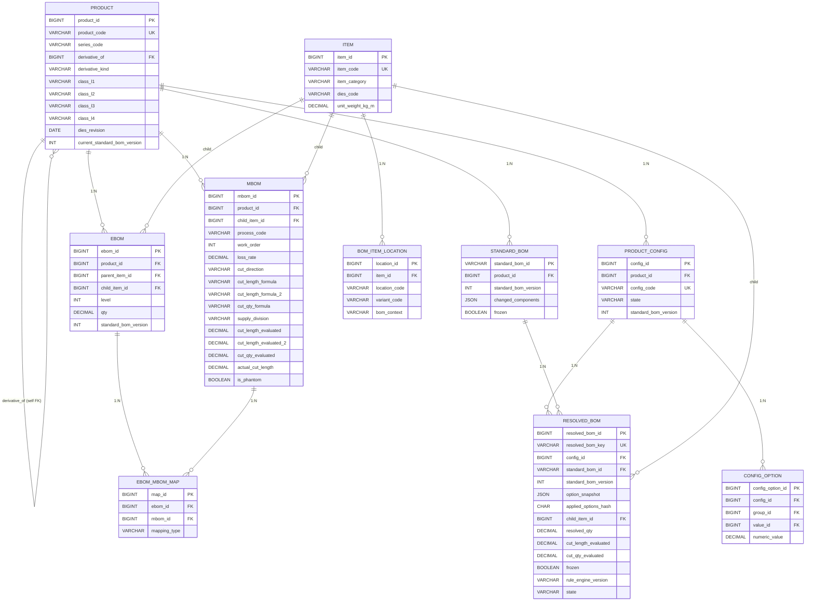
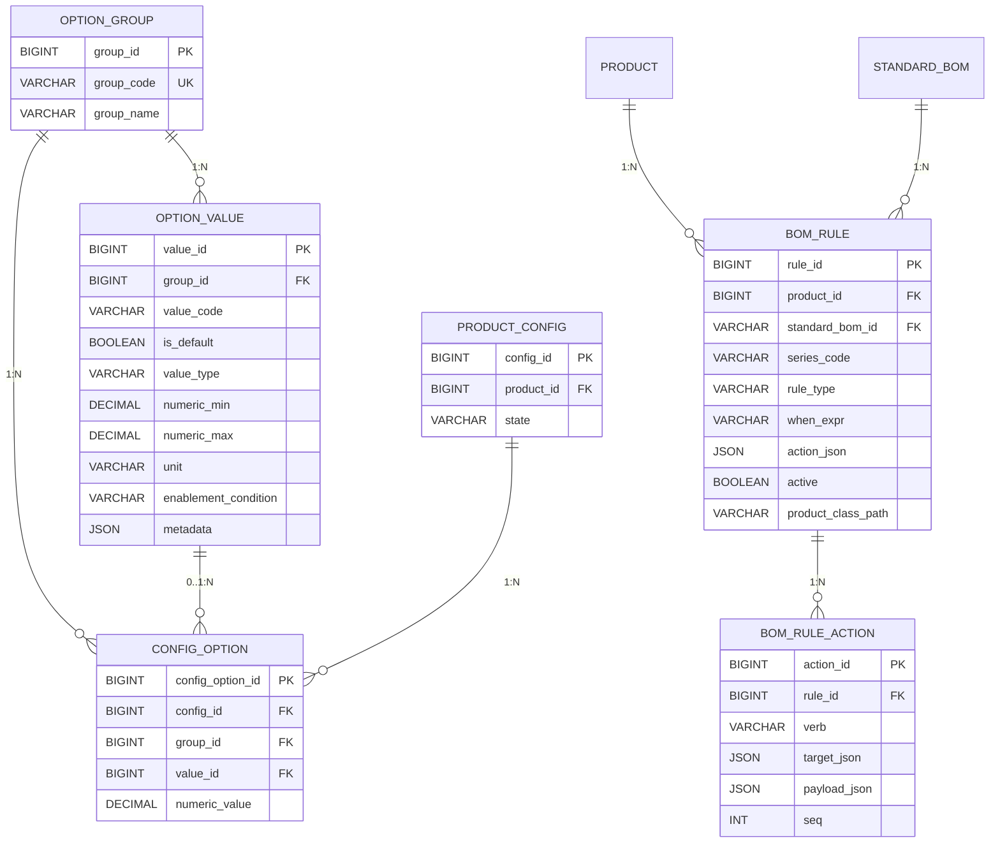
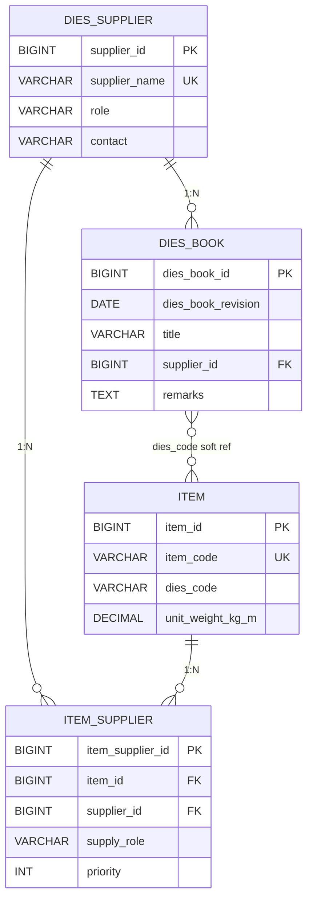
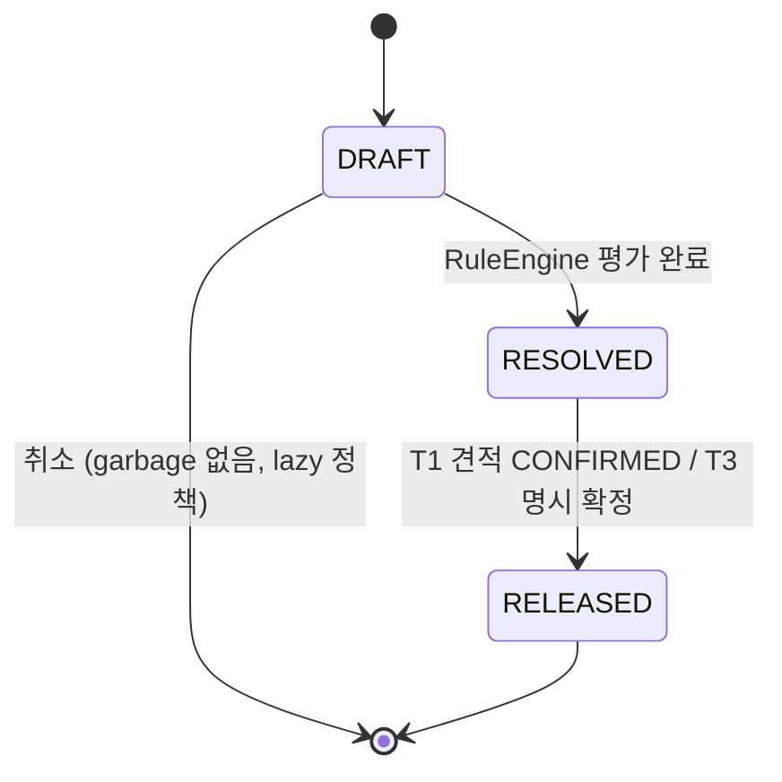
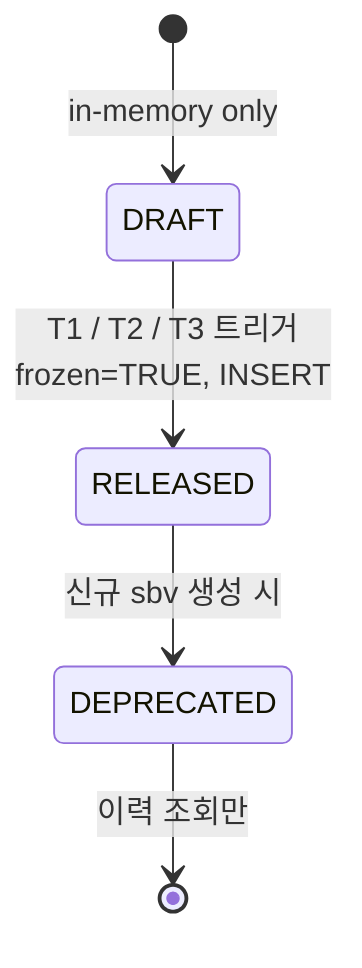

# DE32-1 BOM 도메인 통합 ER 다이어그램 정의서 v1.0

> [!abstract] 요약
> - **BOM 도메인 ERD 단독 SOT(Single Source of Truth)** — 기존 DE35-1·DE11-1 §5 에 산재하던 BOM ER 정보를 분리 독립시킨 Gate 2 필수 산출물.
> - **Phase 1(PM 서브시스템) 범위** 15개 엔티티 ERD + 관계 27건 + 인덱스 전략 + 상태 라이프사이클.
> - 기존 BOM 핵심 12개: `PRODUCT`, `PRODUCT_CONFIG`, `CONFIG_OPTION`, `STANDARD_BOM`, `EBOM`, `MBOM`, `EBOM_MBOM_MAP`, `BOM_ITEM_LOCATION`, `OPTION_GROUP`, `OPTION_VALUE`, `BOM_RULE`, `BOM_RULE_ACTION`, `RESOLVED_BOM`, `ITEM`
> - **v1.3 신규 3개**: `DIES_BOOK`, `DIES_SUPPLIER`, `ITEM_SUPPLIER` (다이스북·공급망, §14)
> - 구조(컬럼·FK·제약·인덱스)만 다룬다. 산식·비즈니스 규칙은 DE35-1 소관.

> [!info] 문서 위상
> - **SOT**: 본 문서(DE32-1) — BOM 도메인 모든 엔티티·관계·컬럼의 단일 진실.
> - DE11-1 §5.3 는 요약·개관만 유지, 상세는 본 문서를 참조.
> - DE35-1 v1.5 이후는 본 문서 엔티티명·컬럼명을 인용만 하고 재정의 금지.

---

## 1. 범위 및 기준

### 1.1 범위

| 구분 | 포함 | 제외(후속 Phase) |
|---|---|---|
| 서브시스템 | **PM** (제품관리) | ES / OM / MF / FS |
| 엔티티 | BOM 핵심 + 다이스북·공급망 (15개) | `ESTIMATE`, `ORDER`, `WORK_ORDER`, `MEASUREMENT` 등 |
| 관계 | 15개 엔티티 내 FK/자기참조/다대다 | 타 도메인과의 외부 FK (§7 확장 포인트) |
| 제약 | PK/FK/UNIQUE/NOT NULL/CHECK/인덱스 | Application-level 비즈니스 규칙 (DE35-1) |

### 1.2 기준 문서

- 엔티티·컬럼·관계 ground truth: **용어사전 v1.3** (모든 정의의 근거)
- DDL 요약: **GAP_분석_통합_2026-04-15 §4′**
- 기존 아키텍처 ERD: **DE11-1 v1.2 §5.3** (v1.3 반영 상태)
- 기존 BOM Level 체계 참고: **DE35-1 v1.4**

### 1.3 네이밍 원칙 (용어사전 §8)

- DB: `snake_case` (본 문서 기준)
- 도메인: `camelCase` (Kotlin JPA 엔티티)
- API: `camelCase` JSON (`@JsonProperty`)

---

## 2. 엔티티 상세 정의

모든 엔티티는 surrogate PK(`BIGINT AUTO_INCREMENT`) 를 갖는다. `created_at`/`updated_at`/`created_by`/`updated_by` 감사 컬럼은 공통 trait 으로 모든 테이블에 존재하지만 지면 관계상 각 표에서 생략한다.

### 2.1 PRODUCT — 제품 마스터

| 컬럼명 | 타입 | NULL | 기본값 | 제약 | 설명 |
|---|---|---|---|---|---|
| product_id | BIGINT | N | AUTO | PK | surrogate PK |
| product_code | VARCHAR(32) | N | — | UNIQUE | modelCode. 예: `DHS-AE225-D-1` |
| product_name | VARCHAR(128) | N | — | — | 제품명 |
| category | VARCHAR(16) | N | — | — | `미서기` / `커튼월` |
| status | VARCHAR(16) | N | `ACTIVE` | CHECK(IN `ACTIVE`,`DISCONTINUED`) | 제품 활성 상태 |
| series_code | VARCHAR(32) | Y | — | — | 계열/시리즈. v1.3 §10 |
| derivative_of | BIGINT | Y | — | FK→PRODUCT(product_id) | **자기참조**. 파생→기본 (v1.3 §16) |
| derivative_kind | VARCHAR(16) | Y | — | CHECK(IN `1MM`,`CAP_TO_HIDDEN`,`TEMPERED`,`FIRE_43MM`) | 파생 유형 |
| class_l1 | VARCHAR(16) | Y | — | — | 대분류 (미서기/커튼월) |
| class_l2 | VARCHAR(16) | Y | — | — | 계약구분 (마스/우수) |
| class_l3 | VARCHAR(16) | Y | — | — | 유리사양 (삼중/복층) |
| class_l4 | VARCHAR(16) | Y | — | — | 치수크기 (특대/대/중/소 또는 160/225/226) |
| dies_revision | DATE | Y | — | — | 다이스북 개정일 |
| current_standard_bom_version | INT | N | 1 | — | 최신 standardBomVersion 포인터 |

### 2.2 PRODUCT_CONFIG — 옵션구성

| 컬럼명 | 타입 | NULL | 기본값 | 제약 | 설명 |
|---|---|---|---|---|---|
| config_id | BIGINT | N | AUTO | PK | surrogate PK (내부 전용) |
| product_id | BIGINT | N | — | FK→PRODUCT | 대상 제품 |
| config_code | VARCHAR(64) | N | — | UNIQUE | 자연 식별자 (내부) |
| state | VARCHAR(16) | N | `DRAFT` | CHECK(IN `DRAFT`,`RESOLVED`,`RELEASED`) | 상태 라이프사이클 (§6.1) |
| standard_bom_version | INT | N | — | — | 연결된 표준BOM 버전 |

### 2.3 CONFIG_OPTION — 옵션 선택 스냅샷

| 컬럼명 | 타입 | NULL | 기본값 | 제약 | 설명 |
|---|---|---|---|---|---|
| config_option_id | BIGINT | N | AUTO | PK | — |
| config_id | BIGINT | N | — | FK→PRODUCT_CONFIG | — |
| group_id | BIGINT | N | — | FK→OPTION_GROUP | — |
| value_id | BIGINT | Y | — | FK→OPTION_VALUE | ENUM 선택값 |
| numeric_value | DECIMAL(10,2) | Y | — | — | NUMERIC 옵션 입력값 |

CHECK: `value_id IS NOT NULL OR numeric_value IS NOT NULL`

### 2.4 STANDARD_BOM — 표준BOM 버전 헤더

| 컬럼명 | 타입 | NULL | 기본값 | 제약 | 설명 |
|---|---|---|---|---|---|
| standard_bom_id | VARCHAR(32) | N | — | PK | 제품·구성 조합 영속 식별자. 예: `DHS-AE225-D-1` |
| product_id | BIGINT | N | — | FK→PRODUCT | — |
| standard_bom_version | INT | N | 1 | — | EBOM+MBOM+Config 묶음 버전 카운터 |
| changed_components | JSON | Y | — | — | `["EBOM","MBOM","Config"]` |
| frozen | BOOLEAN | N | FALSE | — | 버전 확정 여부 |
| frozen_at | DATETIME | Y | — | — | frozen 전환 시각 |

UNIQUE(standard_bom_id, standard_bom_version)

### 2.5 ITEM — 자재 마스터

| 컬럼명 | 타입 | NULL | 기본값 | 제약 | 설명 |
|---|---|---|---|---|---|
| item_id | BIGINT | N | AUTO | PK | — |
| item_code | VARCHAR(32) | N | — | UNIQUE | 접두: PRD/ASY/FRM/GLS/HDW/SEL/SCR/MAT |
| item_name | VARCHAR(128) | N | — | — | — |
| item_type | VARCHAR(16) | N | — | — | `ASSEMBLY`/`MATERIAL`/`PROCESS` |
| unit | VARCHAR(8) | N | `EA` | — | 단위 |
| item_category | VARCHAR(16) | Y | — | CHECK(IN `PROFILE`,`GLASS`,`HARDWARE`,`CONSUMABLE`,`SEALANT`,`SCREEN`) | v1.3 §1. Resolved 분기 키 |
| dies_code | VARCHAR(32) | Y | — | — | 금형 식별자 (v1.3 §14). `itemCode` 와 구분 |
| unit_weight_kg_m | DECIMAL(8,3) | Y | — | — | 프로파일 단위중량(kg/m) |

### 2.6 EBOM — 자재구성 (Engineering BOM)

| 컬럼명 | 타입 | NULL | 기본값 | 제약 | 설명 |
|---|---|---|---|---|---|
| ebom_id | BIGINT | N | AUTO | PK | — |
| product_id | BIGINT | N | — | FK→PRODUCT | — |
| parent_item_id | BIGINT | Y | — | FK→ITEM | 루트면 NULL |
| child_item_id | BIGINT | N | — | FK→ITEM | — |
| level | INT | N | — | CHECK(level >= 0) | EBOM Level (구조부/유리부/…) |
| qty | DECIMAL(12,4) | N | 1 | — | 수량 |
| standard_bom_version | INT | N | — | — | 버전 추적 |

### 2.7 MBOM — 공정구성 (Manufacturing BOM)

| 컬럼명 | 타입 | NULL | 기본값 | 제약 | 설명 |
|---|---|---|---|---|---|
| mbom_id | BIGINT | N | AUTO | PK | — |
| product_id | BIGINT | N | — | FK→PRODUCT | — |
| parent_item_id | BIGINT | Y | — | FK→ITEM | — |
| child_item_id | BIGINT | N | — | FK→ITEM | — |
| level | INT | N | — | — | MBOM Level |
| qty | DECIMAL(12,4) | N | 1 | — | theoreticalQty |
| process_code | VARCHAR(32) | Y | — | — | `PRC-{유형}-{순번}` |
| work_order | INT | Y | — | — | 조립 순서 |
| work_center | VARCHAR(32) | Y | — | — | MES 작업장 |
| loss_rate | DECIMAL(5,4) | N | 0 | CHECK(loss_rate BETWEEN 0 AND 1) | 손실률 |
| actual_qty | DECIMAL(12,4) | Y | — | — | `qty × (1+loss_rate)` (개수 기반) |
| is_phantom | BOOLEAN | N | FALSE | — | 재고 미보유 가상 노드 |
| standard_bom_version | INT | N | — | — | — |
| cut_direction | VARCHAR(4) | Y | — | CHECK(IN `W`,`H`,`W1`,`H1`,`H2`,`H3`) | v1.3 §3 |
| cut_length_formula | VARCHAR(255) | Y | — | — | 1차 절단 산식 |
| cut_length_formula_2 | VARCHAR(255) | Y | — | — | 2차 절단 산식 (유리 세로) |
| cut_qty_formula | VARCHAR(255) | Y | — | — | 절단 개수 산식 |
| supply_division | VARCHAR(8) | Y | — | CHECK(IN `공통`,`외창`,`내창`) | v1.3 §3 |
| cut_length_evaluated | DECIMAL(10,2) | Y | — | — | snapshot. frozen 후 불변 (§6.2) |
| cut_length_evaluated_2 | DECIMAL(10,2) | Y | — | — | 2차 평가 snapshot |
| cut_qty_evaluated | DECIMAL(10,2) | Y | — | — | 수량 평가 snapshot |
| actual_cut_length | DECIMAL(10,2) | Y | — | — | `cut_length_evaluated × (1+loss_rate)` (§3.1) |

### 2.8 EBOM_MBOM_MAP — EBOM↔MBOM 매핑

| 컬럼명 | 타입 | NULL | 기본값 | 제약 | 설명 |
|---|---|---|---|---|---|
| map_id | BIGINT | N | AUTO | PK | — |
| ebom_id | BIGINT | N | — | FK→EBOM | — |
| mbom_id | BIGINT | N | — | FK→MBOM | — |
| mapping_type | VARCHAR(8) | N | — | CHECK(IN `1:1`,`1:N`,`N:1`) | — |

UNIQUE(ebom_id, mbom_id)

### 2.9 BOM_ITEM_LOCATION — 위치 인스턴스

| 컬럼명 | 타입 | NULL | 기본값 | 제약 | 설명 |
|---|---|---|---|---|---|
| location_id | BIGINT | N | AUTO | PK | — |
| item_id | BIGINT | N | — | FK→ITEM | — |
| location_code | VARCHAR(16) | Y | — | — | H01/W01 등 |
| variant_code | VARCHAR(32) | Y | — | — | 위치 인스턴스 품번. 예: `UNI-A225-101-HC` |
| bom_context | VARCHAR(16) | Y | — | — | EBOM/MBOM 구분 |

### 2.10 OPTION_GROUP — 옵션 카테고리

| 컬럼명 | 타입 | NULL | 기본값 | 제약 | 설명 |
|---|---|---|---|---|---|
| group_id | BIGINT | N | AUTO | PK | — |
| group_code | VARCHAR(16) | N | — | UNIQUE | `OPT-LAY`/`OPT-CUT`/`OPT-DIM`/`OPT-GLZ`/`OPT-MAT`/`OPT-FIN`/`OPT-ACC` |
| group_name | VARCHAR(64) | N | — | — | — |

### 2.11 OPTION_VALUE — 옵션 선택값

| 컬럼명 | 타입 | NULL | 기본값 | 제약 | 설명 |
|---|---|---|---|---|---|
| value_id | BIGINT | N | AUTO | PK | — |
| group_id | BIGINT | N | — | FK→OPTION_GROUP | — |
| value_code | VARCHAR(32) | N | — | — | `W1XH1-정` 등 |
| is_default | BOOLEAN | N | FALSE | — | 기본값 여부 |
| value_type | VARCHAR(16) | N | `ENUM` | CHECK(IN `ENUM`,`NUMERIC`,`RANGE`) | v1.3 §11.1 |
| numeric_min | DECIMAL(10,2) | Y | — | — | NUMERIC 전용 |
| numeric_max | DECIMAL(10,2) | Y | — | — | NUMERIC 전용 |
| unit | VARCHAR(8) | Y | — | — | `mm` 등 |
| enablement_condition | VARCHAR(255) | Y | — | — | UNIQUE_V1 조건식 (v1.3 §11.2) |
| metadata | JSON | Y | — | — | 부가 속성 |

UNIQUE(group_id, value_code)

### 2.12 BOM_RULE — 옵션별 규칙

| 컬럼명 | 타입 | NULL | 기본값 | 제약 | 설명 |
|---|---|---|---|---|---|
| rule_id | BIGINT | N | AUTO | PK | — |
| product_id | BIGINT | Y | — | FK→PRODUCT | 제품 국한 Rule 시 |
| series_code | VARCHAR(32) | Y | — | — | 필터 인덱스 컬럼 |
| rule_type | VARCHAR(16) | N | `OPTION` | CHECK(IN `OPTION`,`DERIVATIVE`) | — |
| when_expr | VARCHAR(1024) | Y | — | — | UNIQUE_V1 조건식 |
| action_json | JSON | N | — | — | SET/REPLACE/ADD/REMOVE 동사 배열 |
| active | BOOLEAN | N | TRUE | — | 활성 여부 |
| product_class_path | VARCHAR(128) | Y | — | — | 보조 필터 |
| standard_bom_id | VARCHAR(32) | Y | — | FK→STANDARD_BOM | 표준BOM 바인딩 |

### 2.13 BOM_RULE_ACTION — 규칙 액션 (정규화)

| 컬럼명 | 타입 | NULL | 기본값 | 제약 | 설명 |
|---|---|---|---|---|---|
| action_id | BIGINT | N | AUTO | PK | — |
| rule_id | BIGINT | N | — | FK→BOM_RULE | — |
| verb | VARCHAR(8) | N | — | CHECK(IN `SET`,`REPLACE`,`ADD`,`REMOVE`) | v1.3 §13.2 |
| target_json | JSON | Y | — | — | MBOM 선택자 |
| payload_json | JSON | Y | — | — | from/to/field/value/item |
| seq | INT | N | 0 | — | 액션 적용 순서 |

> [!note] 이중 저장
> `BOM_RULE.action_json` 과 `BOM_RULE_ACTION` 은 동일 정보의 정규화/비정규화 쌍. 쿼리·편집 편의를 위해 양쪽을 유지하되, **정규화 테이블이 source** 이고 `action_json` 은 읽기 캐시로 취급.

### 2.14 RESOLVED_BOM — 확정구성표

| 컬럼명 | 타입 | NULL | 기본값 | 제약 | 설명 |
|---|---|---|---|---|---|
| resolved_bom_id | BIGINT | N | AUTO | PK | surrogate |
| resolved_bom_key | VARCHAR(96) | N | — | UNIQUE | `RBOM-{standardBomId}-sbv{N}-{hash}` |
| config_id | BIGINT | N | — | FK→PRODUCT_CONFIG | — |
| standard_bom_id | VARCHAR(32) | N | — | FK→STANDARD_BOM | — |
| standard_bom_version | INT | N | — | — | — |
| option_snapshot | JSON | N | — | — | appliedOptions 원본 |
| applied_options_hash | CHAR(8) | N | — | — | ENUM 옵션만 SHA-256 앞 8자 |
| bom_type | VARCHAR(16) | N | `RESOLVED_MBOM` | — | — |
| parent_item_id | BIGINT | Y | — | FK→ITEM | — |
| child_item_id | BIGINT | N | — | FK→ITEM | — |
| resolved_qty | DECIMAL(12,4) | N | — | — | — |
| resolved_loss_rate | DECIMAL(5,4) | N | 0 | — | — |
| cut_length_evaluated | DECIMAL(10,2) | Y | — | — | snapshot (frozen 후 불변) |
| cut_length_evaluated_2 | DECIMAL(10,2) | Y | — | — | — |
| cut_qty_evaluated | DECIMAL(10,2) | Y | — | — | — |
| actual_cut_length | DECIMAL(10,2) | Y | — | — | — |
| frozen | BOOLEAN | N | FALSE | — | T1/T2/T3 트리거 시 TRUE |
| frozen_at | DATETIME | Y | — | — | — |
| changed_components | JSON | Y | — | — | — |
| rule_engine_version | VARCHAR(16) | N | `UNIQUE_V1` | — | v1.3 §4 |
| state | VARCHAR(16) | N | `DRAFT` | CHECK(IN `DRAFT`,`RELEASED`,`DEPRECATED`) | §6.2 |

UNIQUE(standard_bom_id, standard_bom_version, applied_options_hash)

### 2.15 DIES_BOOK — 다이스북 (신규, v1.3 §14)

| 컬럼명 | 타입 | NULL | 기본값 | 제약 | 설명 |
|---|---|---|---|---|---|
| dies_book_id | BIGINT | N | AUTO | PK | — |
| dies_book_revision | DATE | N | — | — | 개정 일자 |
| title | VARCHAR(128) | N | — | — | 다이스북 제목 |
| supplier_id | BIGINT | Y | — | FK→DIES_SUPPLIER | 발행 금형사 |
| remarks | TEXT | Y | — | — | — |

UNIQUE(title, dies_book_revision)

### 2.16 DIES_SUPPLIER — 금형사 (신규, v1.3 §14)

| 컬럼명 | 타입 | NULL | 기본값 | 제약 | 설명 |
|---|---|---|---|---|---|
| supplier_id | BIGINT | N | AUTO | PK | — |
| supplier_name | VARCHAR(64) | N | — | UNIQUE | 대양/성진/삼산/플라프로/동신테크/지원이앤에스/가람정밀 등 |
| role | VARCHAR(16) | N | — | CHECK(IN `EXTRUSION`,`INSULATION`,`HARDWARE`) | — |
| contact | VARCHAR(64) | Y | — | — | — |

### 2.17 ITEM_SUPPLIER — 자재↔공급사 매핑 (신규, v1.3 §14)

| 컬럼명 | 타입 | NULL | 기본값 | 제약 | 설명 |
|---|---|---|---|---|---|
| item_supplier_id | BIGINT | N | AUTO | PK | — |
| item_id | BIGINT | N | — | FK→ITEM | — |
| supplier_id | BIGINT | N | — | FK→DIES_SUPPLIER | — |
| supply_role | VARCHAR(16) | Y | — | — | `PRIMARY`/`SECONDARY` |
| priority | INT | N | 1 | — | 다중 공급사 우선순위 |

UNIQUE(item_id, supplier_id)

---

## 3. 관계 서술

### 3.1 FK 관계 목록 (27건)

| # | From | To | 카디널리티 | 제약 | 비고 |
|---|---|---|---|---|---|
| R01 | `PRODUCT.derivative_of` | `PRODUCT.product_id` | N:1 | FK NULL 허용 | **자기참조** (§16) |
| R02 | `PRODUCT_CONFIG.product_id` | `PRODUCT.product_id` | N:1 | NOT NULL | — |
| R03 | `CONFIG_OPTION.config_id` | `PRODUCT_CONFIG.config_id` | N:1 | ON DELETE CASCADE | — |
| R04 | `CONFIG_OPTION.group_id` | `OPTION_GROUP.group_id` | N:1 | — | — |
| R05 | `CONFIG_OPTION.value_id` | `OPTION_VALUE.value_id` | N:1 | NULL 허용 | ENUM 선택 시만 |
| R06 | `STANDARD_BOM.product_id` | `PRODUCT.product_id` | N:1 | — | — |
| R07 | `EBOM.product_id` | `PRODUCT.product_id` | N:1 | — | — |
| R08 | `EBOM.parent_item_id` | `ITEM.item_id` | N:1 | NULL 허용 | 루트 |
| R09 | `EBOM.child_item_id` | `ITEM.item_id` | N:1 | — | — |
| R10 | `MBOM.product_id` | `PRODUCT.product_id` | N:1 | — | — |
| R11 | `MBOM.parent_item_id` | `ITEM.item_id` | N:1 | NULL 허용 | — |
| R12 | `MBOM.child_item_id` | `ITEM.item_id` | N:1 | — | — |
| R13 | `EBOM_MBOM_MAP.ebom_id` | `EBOM.ebom_id` | N:1 | — | M:N 중간 |
| R14 | `EBOM_MBOM_MAP.mbom_id` | `MBOM.mbom_id` | N:1 | — | M:N 중간 |
| R15 | `BOM_ITEM_LOCATION.item_id` | `ITEM.item_id` | N:1 | — | 1자재 → N위치 인스턴스 |
| R16 | `OPTION_VALUE.group_id` | `OPTION_GROUP.group_id` | N:1 | ON DELETE CASCADE | — |
| R17 | `BOM_RULE.product_id` | `PRODUCT.product_id` | N:1 | NULL 허용 | 전역 Rule 시 NULL |
| R18 | `BOM_RULE.standard_bom_id` | `STANDARD_BOM.standard_bom_id` | N:1 | NULL 허용 | — |
| R19 | `BOM_RULE_ACTION.rule_id` | `BOM_RULE.rule_id` | N:1 | ON DELETE CASCADE | — |
| R20 | `RESOLVED_BOM.config_id` | `PRODUCT_CONFIG.config_id` | N:1 | — | — |
| R21 | `RESOLVED_BOM.standard_bom_id` | `STANDARD_BOM.standard_bom_id` | N:1 | — | — |
| R22 | `RESOLVED_BOM.parent_item_id` | `ITEM.item_id` | N:1 | NULL 허용 | — |
| R23 | `RESOLVED_BOM.child_item_id` | `ITEM.item_id` | N:1 | — | — |
| R24 | `ITEM.dies_code` | `DIES_BOOK` (soft) | N:1 | 논리 참조 | FK 미설정 (문자열 매칭) |
| R25 | `DIES_BOOK.supplier_id` | `DIES_SUPPLIER.supplier_id` | N:1 | NULL 허용 | — |
| R26 | `ITEM_SUPPLIER.item_id` | `ITEM.item_id` | N:1 | — | M:N 중간 |
| R27 | `ITEM_SUPPLIER.supplier_id` | `DIES_SUPPLIER.supplier_id` | N:1 | — | M:N 중간 |

### 3.2 다대다(M:N) 관계 (중간 테이블 경유)

- `EBOM` ↔ `MBOM` : `EBOM_MBOM_MAP` 경유 (R13+R14)
- `ITEM` ↔ `DIES_SUPPLIER` : `ITEM_SUPPLIER` 경유 (R26+R27)
- `PRODUCT_CONFIG` ↔ `OPTION_VALUE` : `CONFIG_OPTION` 경유 (R03+R05, ENUM 한정)

### 3.3 자기참조

- `PRODUCT.derivative_of → PRODUCT.product_id` — 1 기본제품 ↔ ≤6 파생제품 (v1.3 §16). Variant BOM 패턴: 파생은 기본의 BOM 을 참조하고 차이만 `BOM_RULE(rule_type='DERIVATIVE')` 로 표현.

---

## 4. 통합 ER 다이어그램 (Mermaid)

엔티티 15+ 개를 3 영역으로 분할해 가독성을 확보한다.

### 4.1 Diagram-A: BOM 핵심

### 4.2 Diagram-B: 옵션·Rule

### 4.3 Diagram-C: 공급망 (다이스북)

---

## 5. 인덱스 전략

용어사전 v1.3 §13.3 및 DE11-1 v1.2 §5.3 기반.

| 엔티티 | 인덱스명 | 컬럼 | 유형 | 목적 |
|---|---|---|---|---|
| `BOM_RULE` | `idx_bom_rule_series_type_active` | `(series_code, rule_type, active)` | 복합 | Resolve 시 후보 규칙 필터. 5,000행 → 평균 20~50행 |
| `BOM_RULE` | `idx_bom_rule_product_class` | `(product_class_path)` | 단일 | 제품 분류 보조 필터 |
| `ITEM` | `idx_item_category` | `(item_category)` | 단일 | Resolved 분기 키 |
| `OPTION_VALUE` | `idx_opt_value_group_type` | `(group_id, value_type)` | 복합 | ENUM/NUMERIC 구분, 해시 산출 시 ENUM 필터 |
| `RESOLVED_BOM` | `uk_resolved_bom_key` | `(resolved_bom_key)` | UNIQUE | 중복 생성 방지 |
| `RESOLVED_BOM` | `uk_resolved_bom_triple` | `(standard_bom_id, standard_bom_version, applied_options_hash)` | UNIQUE | lazy 생성 idempotent 보장 (§4.1). **optionsHash 산출 규칙**: NUMERIC 옵션(W/H 등)은 해시 산출에서 제외되므로 ENUM 옵션이 동일하면 NUMERIC 치수가 달라도 동일 `applied_options_hash` 생성 ([[WIMS_용어사전_BOM_v1.3]] §4.1 참조) |
| `MBOM` | `idx_mbom_std_item` | `(standard_bom_version, child_item_id)` | 복합 | 버전별 자재 조회 |
| `MBOM` | `idx_mbom_product` | `(product_id, work_order)` | 복합 | 공정 순서 조회 |
| `EBOM` | `idx_ebom_product_ver` | `(product_id, standard_bom_version)` | 복합 | — |
| `STANDARD_BOM` | `uk_std_bom_version` | `(standard_bom_id, standard_bom_version)` | UNIQUE | 버전 유일성 |
| `ITEM_SUPPLIER` | `uk_item_supplier` | `(item_id, supplier_id)` | UNIQUE | 중복 매핑 방지 |
| `CONFIG_OPTION` | `idx_config_option_config` | `(config_id, group_id)` | 복합 | 옵션 조회 |

---

## 6. 상태 라이프사이클

### 6.1 PRODUCT_CONFIG

- `DRAFT`: RESOLVED_BOM row INSERT 없이 in-memory 프리뷰만 수행 (§4.1 lazy)
- `RESOLVED`: RuleEngine 평가 완료, in-memory snapshot 존재
- `RELEASED`: 확정, 구조 변경 불가

### 6.2 RESOLVED_BOM

**frozen 전환 트리거** (용어사전 v1.3 §4.2):
- **T1**: 견적서 CONFIRMED (ES) — Phase 2
- **T2**: 작업지시 RELEASED (MF) — Phase 2
- **T3**: PM UI 명시적 "확정" 버튼 (PM) — Phase 1 범위

**frozen=TRUE 후 불변 컬럼** (§4.2):
- `cut_length_evaluated`, `cut_length_evaluated_2`, `cut_qty_evaluated`
- `actual_qty`, `actual_cut_length`
- `rule_engine_version`

### 6.3 STANDARD_BOM

- `frozen=FALSE`: 편집 중
- `frozen=TRUE`: 버전 확정, standardBomVersion +1 시 신규 행

---

## 7. 제약조건·비즈니스 규칙 참조

> [!info] 본 문서는 구조만 다룬다
> 아래 항목은 Application-level(RuleEngine/Service) 검증으로 DE35-1·DE11-1 §11 을 참조한다.

| 구분 | 규칙 | 구현 위치 | 본 문서에서는 |
|---|---|---|---|
| 옵션 활성화 | `OPTION_VALUE.enablement_condition` 평가 | RuleEngine (DE35-1) | 컬럼만 정의 |
| frozen 불변성 | snapshot 컬럼 UPDATE 금지 | JPA `@PreUpdate` + Service (DE11-1 ADR-006) | 컬럼 목록 §6.2 제시 |
| optionsHash 산출 | NUMERIC 제외 SHA-256 앞 8자 | RuleEngine (v1.3 §4.1) | `applied_options_hash` CHAR(8) 정의만 |
| BOM_RULE action 동사 | SET/REPLACE/ADD/REMOVE 4종 | RuleEngine (v1.3 §13.2) | `BOM_RULE_ACTION.verb` CHECK 로 강제 |
| 파생제품 Variant | 기본 BOM 참조 + Rule 로 차이 표현 | DE35-1 §7 | `derivative_of` self-FK 만 |

---

## 8. 변경 예측 · 확장 포인트 (Phase 2)

Phase 2 에서 ES/OM/MF/FS 추가 시 BOM 도메인과 연결될 예상 엔티티:

| 서브시스템 | 예상 엔티티 | BOM 연결 지점 |
|---|---|---|
| ES (견적설계) | `ESTIMATE`, `ESTIMATE_LINE` | `ESTIMATE_LINE.resolved_bom_id → RESOLVED_BOM` (T1 트리거 발신) |
| OM (발주관리) | `ORDER`, `ORDER_LINE` | `ORDER_LINE.item_id → ITEM`, `ORDER.estimate_id` |
| MF (제조관리) | `WORK_ORDER`, `WORK_ORDER_LINE`, `CUTTING_INSTRUCTION` | `WORK_ORDER.resolved_bom_id → RESOLVED_BOM` (T2 트리거 발신), MES 는 `RESOLVED_BOM` 조회 전용 |
| FS (현장실측) | `MEASUREMENT`, `SITE_ITEM` | `MEASUREMENT.product_id → PRODUCT` 또는 `resolved_bom_id` |

> [!warning] 확장 시 원칙
> Phase 2 엔티티는 **RESOLVED_BOM 을 읽기만** 한다. BOM 핵심 엔티티 스키마를 수정하지 않는다. 신규 요구사항은 BOM 도메인 외부에 엔티티를 두거나 `BOM_RULE` 확장으로 수용.

---

## 9. 검증 체크리스트

- [x] 용어사전 v1.3 에 정의된 모든 엔티티 포함 (15개)
- [x] v1.3 신규 3 엔티티(`DIES_BOOK`, `DIES_SUPPLIER`, `ITEM_SUPPLIER`) 명세
- [x] v1.3 추가 컬럼 전부 반영 (PRODUCT +7, MBOM +9, OPTION_VALUE +5, ITEM +3, BOM_RULE +3, RESOLVED_BOM +2)
- [x] 자기참조 `PRODUCT.derivative_of` 표기
- [x] 금지어(용어사전 §7) 사용 안함: `CUTTING_BOM`, `LAYOUT_TYPE`, `PRODUCT_SERIES`, `formula_kind`, `산식구분`(설계 용어로), `productVersion`, `configVersion`
- [x] Mermaid 다이어그램 4개 (ERD 3 + stateDiagram 2) 포함
- [x] 인덱스 전략 v1.3 §13.3 / DE11-1 §5.3 와 일치
- [x] Phase 1 PM 범위 명시, Phase 2 확장 예측

---

## 10. 변경 이력

| 버전 | 일자 | 변경 |
|---|---|---|
| **v1.0** | **2026-04-16** | **신규 작성**. DE35-1·DE11-1 §5 에 산재했던 BOM ER 정보를 분리 독립. 용어사전 v1.3 전면 반영 (엔티티 15개, 관계 27건, 인덱스 12건, 상태다이어그램 2건) |

## 관련 문서

- [[WIMS_용어사전_BOM_v1.3]] — ground truth
- [[DE11-1_소프트웨어_아키텍처_설계서_v1.2]] §5.3 — 요약 ERD
- [[DE35-1_미서기이중창_표준BOM구조_정의서_v1.5]] — Level 체계·산식 예제
- [[GAP_분석_통합_2026-04-15]] §4′ — DDL 요약
- [[V3_기존설계문서_영향도]] / [[V6_방법론_준수성]]
