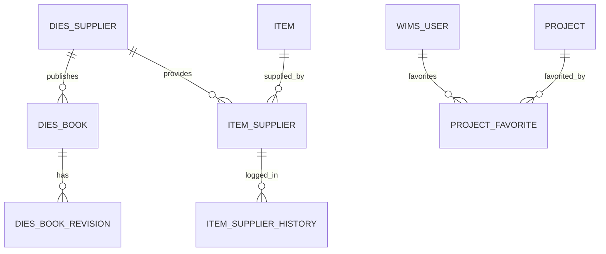
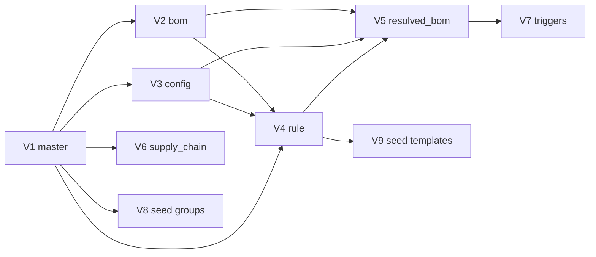
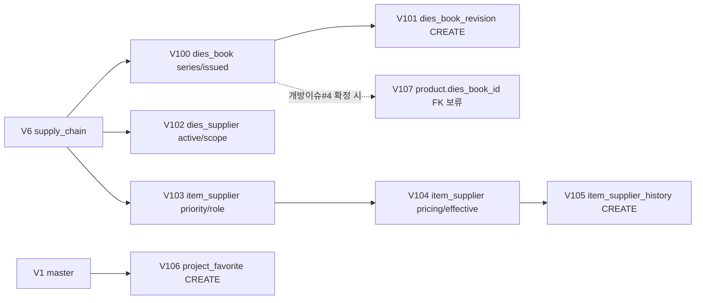

# DE33-1 DB 물리 스키마 설계서

**문서코드:** DE33-1
**버전:** v1.2
**작성일:** 2026-04-21 (v1.0) / 2026-04-22 (v1.1 → v1.2)
**작성자:** 김지광 (PM, 코드크래프트)
**검토자:** 김진호 (BE, 코드크래프트)
**상태:** 확정판 (BE 구현 착수용)

> [!abstract] 문서 개요
> 본 문서는 DE32-1(논리 ER) 과 용어사전 v1.4 를 기반으로 **MariaDB 10.11 에서 실행 가능한 물리 DDL** 과 Flyway 마이그레이션 계획을 정의한다. BE 팀의 `wims-rule-engine` 구현 착수 전 스키마 확정 입력물.
>
> 범위: BOM 도메인 PM 서브시스템 19 엔티티 + 공급망 확장 2 엔티티 + 프로젝트 즐겨찾기 1 엔티티 + 인덱스·FK·트리거 + 시드 데이터(옵션 그룹 7종·빌트인 규칙 템플릿 6종).
>
> **v1.2 (2026-04-22):** Flyway **V100~V106 확정**. 엔티티 21→**23** (`project_favorite` 신설, `dies_book_revision`·`item_supplier_history` v1.1 에서 이미 정의됨), FK 29→**31**, 인덱스 45→**48**. 개방이슈 **#4 (PRODUCT↔DIES_BOOK FK 방향)** 은 보류 유지 — **"Phase 2 착수 시 CR 결정"**, FE 구현 블로킹 없음. 신규 이슈: `dies_book_revision` ↔ 기존 `revision` 컬럼 마이그레이션 호환성 확인.

---

## 1. 기준 문서 및 작성 원칙

### 1.1 기준 문서

| 문서 | 역할 |
|---|---|
| [[WIMS_용어사전_BOM_v1.4]] | 컬럼명·타입·enum·금지어 ground truth |
| [[DE32-1_BOM도메인_ER다이어그램_v1.2]] | 논리 ER. 엔티티 구조·관계·상태 라이프사이클 |
| [[DE35-1_미서기이중창_표준BOM구조_정의서_v1.6]] | BOM_RULE 스키마·템플릿 컴파일 규칙·빌트인 6종 예시 |
| [[DE11-1_소프트웨어_아키텍처_설계서_v1.2]] | RuleEngine §11·인덱스 전략 §5.3·ADR-006 frozen 불변성 |
| [[DE24-1_인터페이스설계서_v2.0]] | MES 응답 DTO 필드 ↔ RESOLVED_BOM 컬럼 정합 |

### 1.2 작성 원칙

1. **DE32-1 논리 모델과 1:1 대응.** 엔티티 추가·삭제 없음. 컬럼 추가는 물리 레벨 필수(감사·타임스탬프·버전) 에 한함.
2. **용어사전 v1.4 네이밍 엄수.** DB 는 `snake_case`, 도메인은 `camelCase`. 금지어(§7) 미사용 확인: `cutting_bom`, `layout_type`, `product_series`, `formula_kind`, `산식구분` 등.
3. **애플리케이션 레벨 규칙은 DDL 에 반영하지 않음.** frozen 불변성 중 APP 레벨 체크는 JPA `@PreUpdate` (DE11-1 ADR-006). DDL 은 **보호선 트리거** 로 최소한의 이중 방어만 수행.
4. **Phase 2 엔티티 참조 보류.** `BOM_RULE.estimate_id` 는 컬럼만 정의하고 FK 는 `ESTIMATE` 테이블이 Phase 2 에서 추가될 때 ALTER 로 부여.

### 1.3 DBMS 환경

| 항목 | 값 | 비고 |
|---|---|---|
| DBMS | MariaDB 10.11 | 기 결정 사항 |
| Engine | InnoDB | 트랜잭션·FK·row-level lock |
| Character Set | `utf8mb4` | 이모지 포함 문자열(🔒 등) 대응 |
| Collation | `utf8mb4_unicode_ci` | 다국어 정렬 |
| SQL Mode | `STRICT_TRANS_TABLES,NO_ENGINE_SUBSTITUTION,NO_ZERO_DATE,NO_ZERO_IN_DATE` | 엄격 모드 |
| Timezone | `UTC` 저장, 애플리케이션에서 `Asia/Seoul` 변환 | — |
| Isolation | `REPEATABLE READ` (MariaDB 기본) | — |

---

## 2. 전역 규약

### 2.1 명명 규칙

| 대상 | 규칙 | 예시 |
|---|---|---|
| 테이블명 | `snake_case`, 단수형 (엔티티 = 테이블) | `product`, `bom_rule`, `rule_template` |
| PK 컬럼 | `{entity_singular}_id`, BIGINT AUTO_INCREMENT (surrogate) | `product_id`, `mbom_id` |
| FK 컬럼 | 대상 PK 명 그대로 (중복 시 의미 prefix) | `derivative_of`, `parent_item_id` |
| UNIQUE KEY | `uk_{table}_{컬럼목록}` | `uk_product_code`, `uk_resolved_bom_key` |
| 일반 인덱스 | `idx_{table}_{컬럼목록}` | `idx_bom_rule_series_type_active` |
| FK 제약명 | `fk_{from_table}_{to_table}` | `fk_bom_rule_product`, `fk_ebom_item_child` |
| CHECK 제약 | `chk_{table}_{의미}` | `chk_mbom_loss_rate`, `chk_product_status` |
| 트리거 | `trg_{table}_{before/after}_{event}` | `trg_resolved_bom_before_update_frozen` |
| 컬럼 접미사 | enum: 그대로 / boolean: `is_*` or 서술형 / timestamp: `*_at` / user: `*_by` | `is_phantom`, `frozen`, `created_at`, `created_by` |

### 2.2 타입 표준

| 의미 | 타입 | 비고 |
|---|---|---|
| surrogate PK | `BIGINT UNSIGNED AUTO_INCREMENT` | 모든 엔티티 (단 `STANDARD_BOM`, `RULE_TEMPLATE` 는 자연 PK) |
| 짧은 코드 | `VARCHAR(16)` | enum 값, 축 분류값 (L1~L4 등) |
| 중간 코드 | `VARCHAR(32)` | itemCode, processCode, productCode |
| 자연 식별자 | `VARCHAR(64)` | template_id, template_instance_id, config_code |
| 자연키 복합 | `VARCHAR(96)` | resolved_bom_key |
| 이름/라벨 | `VARCHAR(128)` | product_name, item_name, template name |
| 짧은 서술 | `VARCHAR(256)` | reason 등 |
| 산식 표현 | `VARCHAR(255)` → `VARCHAR(1024)` | cutLengthFormula·when_expr (긴 조건식 대비) |
| 자유 서술 | `TEXT` | description, remarks |
| 수량·수치 | `DECIMAL(12,4)` | qty (0~10억 수량 ≤4 자리 소수) |
| 길이 mm | `DECIMAL(10,2)` | cut_length_* (0~9999.99mm) |
| 비율 0~1 | `DECIMAL(5,4)` | loss_rate (0.0000~1.0000) |
| 단위중량 | `DECIMAL(8,3)` | kg/m |
| enum 문자열 | `VARCHAR(N)` + `CHECK (IN ...)` | native ENUM 미사용 — ALTER 유연성 |
| boolean | `BOOLEAN` (= `TINYINT(1)`) | — |
| timestamp | `DATETIME(3)` | ms 정밀도, 시각 정합성 |
| JSON | `JSON` (MariaDB 10.2+, 내부 LONGTEXT + JSON_VALID) | action_json, slots_schema 등 |
| SHA 해시 | `CHAR(8)` | applied_options_hash (SHA-256 앞 8자) |

### 2.3 감사 컬럼 공통 trait

**모든 업무 테이블**에 다음 4 컬럼 포함. DE32-1 에서는 "지면 관계상 생략" 으로 처리되었으나 물리 스키마에는 명시한다.

```sql
created_at DATETIME(3)  NOT NULL DEFAULT CURRENT_TIMESTAMP(3),
created_by VARCHAR(64)  NOT NULL,
updated_at DATETIME(3)  NOT NULL DEFAULT CURRENT_TIMESTAMP(3) ON UPDATE CURRENT_TIMESTAMP(3),
updated_by VARCHAR(64)  NOT NULL,
```

- `created_by`/`updated_by` 는 JWT 의 `sub` (username) 주입. 시스템 작업(Flyway seed) 은 `'system'`.
- `ON UPDATE CURRENT_TIMESTAMP(3)` 를 DB 에 두되, 애플리케이션 JPA `@UpdateTimestamp` 와 이중 보장.
- 예외: `BOM_RULE_HISTORY` 는 `changed_at` 만 존재 (자기 자신이 감사 테이블이므로 `created_*`/`updated_*` 생략).

### 2.4 FK 삭제·갱신 전략

| 관계 유형 | ON DELETE | ON UPDATE | 근거 |
|---|---|---|---|
| 자식 엔티티 (CONFIG_OPTION → PRODUCT_CONFIG, BOM_RULE_ACTION → BOM_RULE) | `CASCADE` | `CASCADE` | 부모 소멸 시 자동 정리 |
| 참조 마스터 (BOM → ITEM, BOM_RULE → PRODUCT) | `RESTRICT` | `CASCADE` | 자재·제품 삭제 시 참조 보호 |
| 옵션 선택 (CONFIG_OPTION → OPTION_VALUE) | `SET NULL` | `CASCADE` | NUMERIC-only 선택 시 value_id NULL 허용 |
| 자기참조 (PRODUCT.derivative_of) | `SET NULL` | `CASCADE` | 기본 제품 discontinued 시 파생 분리 |
| 감사 (BOM_RULE_HISTORY → BOM_RULE) | `RESTRICT` | `CASCADE` | 감사 이력은 원본 삭제에도 보존 |
| Soft FK (ITEM.dies_code → DIES_BOOK) | (FK 미설정) | — | 문자열 매칭, 이력 DB 간 이관 대비 |

### 2.5 소프트 삭제 정책

PM 도메인 대부분 엔티티는 **하드 삭제 허용**. 예외:

- `PRODUCT`: `status='DISCONTINUED'` 상태 유지 (하드 삭제 대신 상태 변경)
- `RULE_TEMPLATE`: `active=FALSE` 로 비활성화 (`is_builtin=TRUE` 는 하드 삭제 불가)
- `BOM_RULE`: `active=FALSE` (소급 영향을 주는 하드 삭제 금지)
- `RESOLVED_BOM`: `state='DEPRECATED'` (이력 보존)
- `STANDARD_BOM`: frozen 버전은 삭제 금지 (APP 레벨 + 트리거)

---

## 3. 테이블 DDL 명세

> 명세 순서는 **FK 의존 순** 이다. V1 마이그레이션은 아래 순서대로 실행한다.
>
> **v1.2 범위:** §3.1~§3.16 은 Phase 1 BOM 도메인 19 엔티티 중 16개(나머지 3개는 §3.17~§3.19 공급망 확장). §3.17~§3.19 는 v1.1 추가 공급망 확장 2엔티티 + 공급사 이력 1엔티티. **§3.20 `project_favorite` 는 v1.2 신설** (DE22-1 v1.6 프로젝트 관심 저장 이슈 해결).

### 3.1 product

```sql
CREATE TABLE product (
  product_id                    BIGINT UNSIGNED NOT NULL AUTO_INCREMENT,
  product_code                  VARCHAR(32)     NOT NULL                COMMENT 'modelCode. 예: DHS-AE225-D-1',
  product_name                  VARCHAR(128)    NOT NULL,
  category                      VARCHAR(16)     NOT NULL                COMMENT '미서기 | 커튼월',
  status                        VARCHAR(16)     NOT NULL DEFAULT 'ACTIVE',
  series_code                   VARCHAR(32)     NULL                    COMMENT '용어사전 §10. 미서기=계열, 커튼월=시리즈',
  derivative_of                 BIGINT UNSIGNED NULL                    COMMENT '자기참조. 파생→기본 (용어사전 §16)',
  derivative_kind               VARCHAR(16)     NULL,
  class_l1                      VARCHAR(16)     NULL                    COMMENT '4축 분류: 대분류',
  class_l2                      VARCHAR(16)     NULL                    COMMENT '계약구분',
  class_l3                      VARCHAR(16)     NULL                    COMMENT '유리사양',
  class_l4                      VARCHAR(16)     NULL                    COMMENT '치수크기',
  dies_revision                 DATE            NULL,
  current_standard_bom_version  INT             NOT NULL DEFAULT 1,
  created_at                    DATETIME(3)     NOT NULL DEFAULT CURRENT_TIMESTAMP(3),
  created_by                    VARCHAR(64)     NOT NULL,
  updated_at                    DATETIME(3)     NOT NULL DEFAULT CURRENT_TIMESTAMP(3) ON UPDATE CURRENT_TIMESTAMP(3),
  updated_by                    VARCHAR(64)     NOT NULL,
  PRIMARY KEY (product_id),
  UNIQUE KEY uk_product_code (product_code),
  KEY idx_product_class_path (class_l1, class_l2, class_l3, class_l4),
  KEY idx_product_series (series_code),
  KEY idx_product_derivative (derivative_of),
  CONSTRAINT fk_product_derivative FOREIGN KEY (derivative_of) REFERENCES product (product_id) ON DELETE SET NULL ON UPDATE CASCADE,
  CONSTRAINT chk_product_status    CHECK (status IN ('ACTIVE','DISCONTINUED')),
  CONSTRAINT chk_product_category  CHECK (category IN ('미서기','커튼월')),
  CONSTRAINT chk_product_deriv_kind CHECK (derivative_kind IS NULL OR derivative_kind IN ('1MM','CAP_TO_HIDDEN','TEMPERED','FIRE_43MM'))
) ENGINE=InnoDB DEFAULT CHARSET=utf8mb4 COLLATE=utf8mb4_unicode_ci;
```

### 3.2 item

```sql
CREATE TABLE item (
  item_id           BIGINT UNSIGNED NOT NULL AUTO_INCREMENT,
  item_code         VARCHAR(32)     NOT NULL                COMMENT '접두: PRD/ASY/FRM/GLS/HDW/SEL/SCR/MAT',
  item_name         VARCHAR(128)    NOT NULL,
  item_type         VARCHAR(16)     NOT NULL                COMMENT 'ASSEMBLY | MATERIAL | PROCESS',
  unit              VARCHAR(8)      NOT NULL DEFAULT 'EA',
  item_category     VARCHAR(16)     NULL                    COMMENT 'Resolved 분기 키 (용어사전 §1)',
  dies_code         VARCHAR(32)     NULL                    COMMENT '다이스코드. itemCode 와 구분 (용어사전 §14)',
  unit_weight_kg_m  DECIMAL(8,3)    NULL                    COMMENT '프로파일 단위중량',
  created_at        DATETIME(3)     NOT NULL DEFAULT CURRENT_TIMESTAMP(3),
  created_by        VARCHAR(64)     NOT NULL,
  updated_at        DATETIME(3)     NOT NULL DEFAULT CURRENT_TIMESTAMP(3) ON UPDATE CURRENT_TIMESTAMP(3),
  updated_by        VARCHAR(64)     NOT NULL,
  PRIMARY KEY (item_id),
  UNIQUE KEY uk_item_code (item_code),
  KEY idx_item_category (item_category),
  KEY idx_item_dies_code (dies_code),
  CONSTRAINT chk_item_type CHECK (item_type IN ('ASSEMBLY','MATERIAL','PROCESS')),
  CONSTRAINT chk_item_category CHECK (item_category IS NULL OR item_category IN ('PROFILE','GLASS','HARDWARE','CONSUMABLE','SEALANT','SCREEN'))
) ENGINE=InnoDB DEFAULT CHARSET=utf8mb4 COLLATE=utf8mb4_unicode_ci;
```

### 3.3 option_group

```sql
CREATE TABLE option_group (
  group_id    BIGINT UNSIGNED NOT NULL AUTO_INCREMENT,
  group_code  VARCHAR(16)     NOT NULL                COMMENT 'OPT-LAY/OPT-CUT/OPT-DIM/OPT-GLZ/OPT-MAT/OPT-FIN/OPT-ACC',
  group_name  VARCHAR(64)     NOT NULL,
  created_at  DATETIME(3)     NOT NULL DEFAULT CURRENT_TIMESTAMP(3),
  created_by  VARCHAR(64)     NOT NULL,
  updated_at  DATETIME(3)     NOT NULL DEFAULT CURRENT_TIMESTAMP(3) ON UPDATE CURRENT_TIMESTAMP(3),
  updated_by  VARCHAR(64)     NOT NULL,
  PRIMARY KEY (group_id),
  UNIQUE KEY uk_option_group_code (group_code)
) ENGINE=InnoDB DEFAULT CHARSET=utf8mb4 COLLATE=utf8mb4_unicode_ci;
```

### 3.4 option_value

```sql
CREATE TABLE option_value (
  value_id              BIGINT UNSIGNED NOT NULL AUTO_INCREMENT,
  group_id              BIGINT UNSIGNED NOT NULL,
  value_code            VARCHAR(32)     NOT NULL                COMMENT 'W1XH1-정 등',
  value_name            VARCHAR(64)     NULL,
  is_default            BOOLEAN         NOT NULL DEFAULT FALSE,
  value_type            VARCHAR(16)     NOT NULL DEFAULT 'ENUM' COMMENT 'ENUM | NUMERIC | RANGE (용어사전 §11)',
  numeric_min           DECIMAL(10,2)   NULL,
  numeric_max           DECIMAL(10,2)   NULL,
  unit                  VARCHAR(8)      NULL,
  enablement_condition  VARCHAR(1024)   NULL                    COMMENT 'UNIQUE_V1 조건식',
  metadata              JSON            NULL,
  created_at            DATETIME(3)     NOT NULL DEFAULT CURRENT_TIMESTAMP(3),
  created_by            VARCHAR(64)     NOT NULL,
  updated_at            DATETIME(3)     NOT NULL DEFAULT CURRENT_TIMESTAMP(3) ON UPDATE CURRENT_TIMESTAMP(3),
  updated_by            VARCHAR(64)     NOT NULL,
  PRIMARY KEY (value_id),
  UNIQUE KEY uk_option_value_group_code (group_id, value_code),
  KEY idx_option_value_group_type (group_id, value_type),
  CONSTRAINT fk_option_value_group FOREIGN KEY (group_id) REFERENCES option_group (group_id) ON DELETE CASCADE ON UPDATE CASCADE,
  CONSTRAINT chk_option_value_type CHECK (value_type IN ('ENUM','NUMERIC','RANGE')),
  CONSTRAINT chk_option_value_numeric_range CHECK (
    (value_type != 'NUMERIC') OR (numeric_min IS NOT NULL AND numeric_max IS NOT NULL AND numeric_min <= numeric_max)
  )
) ENGINE=InnoDB DEFAULT CHARSET=utf8mb4 COLLATE=utf8mb4_unicode_ci;
```

### 3.5 standard_bom

```sql
CREATE TABLE standard_bom (
  standard_bom_id        VARCHAR(32)     NOT NULL                COMMENT '제품·구성 조합 영속 식별자. 예: DHS-AE225-D-1',
  product_id             BIGINT UNSIGNED NOT NULL,
  standard_bom_version   INT             NOT NULL DEFAULT 1,
  changed_components     JSON            NULL                    COMMENT '["EBOM","MBOM","Config","BOM_RULE"]',
  frozen                 BOOLEAN         NOT NULL DEFAULT FALSE,
  frozen_at              DATETIME(3)     NULL,
  created_at             DATETIME(3)     NOT NULL DEFAULT CURRENT_TIMESTAMP(3),
  created_by             VARCHAR(64)     NOT NULL,
  updated_at             DATETIME(3)     NOT NULL DEFAULT CURRENT_TIMESTAMP(3) ON UPDATE CURRENT_TIMESTAMP(3),
  updated_by             VARCHAR(64)     NOT NULL,
  PRIMARY KEY (standard_bom_id, standard_bom_version),
  KEY idx_standard_bom_product (product_id),
  CONSTRAINT fk_standard_bom_product FOREIGN KEY (product_id) REFERENCES product (product_id) ON DELETE RESTRICT ON UPDATE CASCADE
) ENGINE=InnoDB DEFAULT CHARSET=utf8mb4 COLLATE=utf8mb4_unicode_ci;
```

> **PK 복합 선택 이유:** 자연키 `(standard_bom_id, standard_bom_version)` 조합이 업무 의미를 그대로 담고, 외부 참조(FK→BOM_RULE.standard_bom_id, RESOLVED_BOM.standard_bom_id)가 `standard_bom_id` 단일 컬럼이므로 surrogate PK 불필요.

### 3.6 ebom

```sql
CREATE TABLE ebom (
  ebom_id                BIGINT UNSIGNED NOT NULL AUTO_INCREMENT,
  product_id             BIGINT UNSIGNED NOT NULL,
  parent_item_id         BIGINT UNSIGNED NULL                    COMMENT '루트면 NULL',
  child_item_id          BIGINT UNSIGNED NOT NULL,
  level                  INT             NOT NULL,
  qty                    DECIMAL(12,4)   NOT NULL DEFAULT 1,
  standard_bom_version   INT             NOT NULL,
  created_at             DATETIME(3)     NOT NULL DEFAULT CURRENT_TIMESTAMP(3),
  created_by             VARCHAR(64)     NOT NULL,
  updated_at             DATETIME(3)     NOT NULL DEFAULT CURRENT_TIMESTAMP(3) ON UPDATE CURRENT_TIMESTAMP(3),
  updated_by             VARCHAR(64)     NOT NULL,
  PRIMARY KEY (ebom_id),
  KEY idx_ebom_product_ver (product_id, standard_bom_version),
  KEY idx_ebom_parent (parent_item_id),
  KEY idx_ebom_child (child_item_id),
  CONSTRAINT fk_ebom_product      FOREIGN KEY (product_id)     REFERENCES product (product_id) ON DELETE RESTRICT ON UPDATE CASCADE,
  CONSTRAINT fk_ebom_item_parent  FOREIGN KEY (parent_item_id) REFERENCES item (item_id)       ON DELETE RESTRICT ON UPDATE CASCADE,
  CONSTRAINT fk_ebom_item_child   FOREIGN KEY (child_item_id)  REFERENCES item (item_id)       ON DELETE RESTRICT ON UPDATE CASCADE,
  CONSTRAINT chk_ebom_level CHECK (level >= 0)
) ENGINE=InnoDB DEFAULT CHARSET=utf8mb4 COLLATE=utf8mb4_unicode_ci;
```

### 3.7 mbom

```sql
CREATE TABLE mbom (
  mbom_id                   BIGINT UNSIGNED NOT NULL AUTO_INCREMENT,
  product_id                BIGINT UNSIGNED NOT NULL,
  parent_item_id            BIGINT UNSIGNED NULL,
  child_item_id             BIGINT UNSIGNED NOT NULL,
  level                     INT             NOT NULL,
  qty                       DECIMAL(12,4)   NOT NULL DEFAULT 1     COMMENT 'theoreticalQty',
  process_code              VARCHAR(32)     NULL,
  work_order                INT             NULL,
  work_center               VARCHAR(32)     NULL,
  loss_rate                 DECIMAL(5,4)    NOT NULL DEFAULT 0,
  actual_qty                DECIMAL(12,4)   NULL                    COMMENT 'qty × (1 + loss_rate), 개수 기반',
  is_phantom                BOOLEAN         NOT NULL DEFAULT FALSE,
  standard_bom_version      INT             NOT NULL,
  cut_direction             VARCHAR(4)      NULL,
  cut_length_formula        VARCHAR(1024)   NULL,
  cut_length_formula_2      VARCHAR(1024)   NULL,
  cut_qty_formula           VARCHAR(1024)   NULL,
  supply_division           VARCHAR(8)      NULL,
  cut_length_evaluated      DECIMAL(10,2)   NULL                    COMMENT 'snapshot. frozen 후 불변',
  cut_length_evaluated_2    DECIMAL(10,2)   NULL,
  cut_qty_evaluated         DECIMAL(10,2)   NULL,
  actual_cut_length         DECIMAL(10,2)   NULL                    COMMENT 'cut_length_evaluated × (1 + loss_rate)',
  created_at                DATETIME(3)     NOT NULL DEFAULT CURRENT_TIMESTAMP(3),
  created_by                VARCHAR(64)     NOT NULL,
  updated_at                DATETIME(3)     NOT NULL DEFAULT CURRENT_TIMESTAMP(3) ON UPDATE CURRENT_TIMESTAMP(3),
  updated_by                VARCHAR(64)     NOT NULL,
  PRIMARY KEY (mbom_id),
  KEY idx_mbom_product (product_id, work_order),
  KEY idx_mbom_std_item (standard_bom_version, child_item_id),
  KEY idx_mbom_parent (parent_item_id),
  CONSTRAINT fk_mbom_product      FOREIGN KEY (product_id)     REFERENCES product (product_id) ON DELETE RESTRICT ON UPDATE CASCADE,
  CONSTRAINT fk_mbom_item_parent  FOREIGN KEY (parent_item_id) REFERENCES item (item_id)       ON DELETE RESTRICT ON UPDATE CASCADE,
  CONSTRAINT fk_mbom_item_child   FOREIGN KEY (child_item_id)  REFERENCES item (item_id)       ON DELETE RESTRICT ON UPDATE CASCADE,
  CONSTRAINT chk_mbom_loss_rate   CHECK (loss_rate BETWEEN 0 AND 1),
  CONSTRAINT chk_mbom_cut_direction CHECK (cut_direction IS NULL OR cut_direction IN ('W','H','W1','H1','H2','H3')),
  CONSTRAINT chk_mbom_supply_division CHECK (supply_division IS NULL OR supply_division IN ('공통','외창','내창'))
) ENGINE=InnoDB DEFAULT CHARSET=utf8mb4 COLLATE=utf8mb4_unicode_ci;
```

### 3.8 ebom_mbom_map

```sql
CREATE TABLE ebom_mbom_map (
  map_id         BIGINT UNSIGNED NOT NULL AUTO_INCREMENT,
  ebom_id        BIGINT UNSIGNED NOT NULL,
  mbom_id        BIGINT UNSIGNED NOT NULL,
  mapping_type   VARCHAR(8)      NOT NULL                COMMENT '1:1 | 1:N | N:1',
  created_at     DATETIME(3)     NOT NULL DEFAULT CURRENT_TIMESTAMP(3),
  created_by     VARCHAR(64)     NOT NULL,
  updated_at     DATETIME(3)     NOT NULL DEFAULT CURRENT_TIMESTAMP(3) ON UPDATE CURRENT_TIMESTAMP(3),
  updated_by     VARCHAR(64)     NOT NULL,
  PRIMARY KEY (map_id),
  UNIQUE KEY uk_ebom_mbom (ebom_id, mbom_id),
  KEY idx_ebom_mbom_mbom (mbom_id),
  CONSTRAINT fk_emm_ebom FOREIGN KEY (ebom_id) REFERENCES ebom (ebom_id) ON DELETE CASCADE ON UPDATE CASCADE,
  CONSTRAINT fk_emm_mbom FOREIGN KEY (mbom_id) REFERENCES mbom (mbom_id) ON DELETE CASCADE ON UPDATE CASCADE,
  CONSTRAINT chk_emm_mapping_type CHECK (mapping_type IN ('1:1','1:N','N:1'))
) ENGINE=InnoDB DEFAULT CHARSET=utf8mb4 COLLATE=utf8mb4_unicode_ci;
```

### 3.9 bom_item_location

```sql
CREATE TABLE bom_item_location (
  location_id     BIGINT UNSIGNED NOT NULL AUTO_INCREMENT,
  item_id         BIGINT UNSIGNED NOT NULL,
  location_code   VARCHAR(16)     NULL                    COMMENT 'H01 / W01 등',
  variant_code    VARCHAR(32)     NULL                    COMMENT '위치 인스턴스 품번. 예: UNI-A225-101-HC',
  bom_context     VARCHAR(16)     NULL                    COMMENT 'EBOM | MBOM',
  created_at      DATETIME(3)     NOT NULL DEFAULT CURRENT_TIMESTAMP(3),
  created_by      VARCHAR(64)     NOT NULL,
  updated_at      DATETIME(3)     NOT NULL DEFAULT CURRENT_TIMESTAMP(3) ON UPDATE CURRENT_TIMESTAMP(3),
  updated_by      VARCHAR(64)     NOT NULL,
  PRIMARY KEY (location_id),
  KEY idx_bom_item_location_item (item_id),
  KEY idx_bom_item_location_variant (variant_code),
  CONSTRAINT fk_bil_item FOREIGN KEY (item_id) REFERENCES item (item_id) ON DELETE CASCADE ON UPDATE CASCADE,
  CONSTRAINT chk_bil_bom_context CHECK (bom_context IS NULL OR bom_context IN ('EBOM','MBOM'))
) ENGINE=InnoDB DEFAULT CHARSET=utf8mb4 COLLATE=utf8mb4_unicode_ci;
```

### 3.10 product_config

```sql
CREATE TABLE product_config (
  config_id              BIGINT UNSIGNED NOT NULL AUTO_INCREMENT,
  product_id             BIGINT UNSIGNED NOT NULL,
  config_code            VARCHAR(64)     NOT NULL                COMMENT '자연 식별자 (내부)',
  state                  VARCHAR(16)     NOT NULL DEFAULT 'DRAFT',
  standard_bom_version   INT             NOT NULL,
  created_at             DATETIME(3)     NOT NULL DEFAULT CURRENT_TIMESTAMP(3),
  created_by             VARCHAR(64)     NOT NULL,
  updated_at             DATETIME(3)     NOT NULL DEFAULT CURRENT_TIMESTAMP(3) ON UPDATE CURRENT_TIMESTAMP(3),
  updated_by             VARCHAR(64)     NOT NULL,
  PRIMARY KEY (config_id),
  UNIQUE KEY uk_product_config_code (config_code),
  KEY idx_product_config_product (product_id, state),
  CONSTRAINT fk_product_config_product FOREIGN KEY (product_id) REFERENCES product (product_id) ON DELETE RESTRICT ON UPDATE CASCADE,
  CONSTRAINT chk_product_config_state CHECK (state IN ('DRAFT','RELEASED','DEPRECATED'))
) ENGINE=InnoDB DEFAULT CHARSET=utf8mb4 COLLATE=utf8mb4_unicode_ci;
```

### 3.11 config_option

```sql
CREATE TABLE config_option (
  config_option_id   BIGINT UNSIGNED NOT NULL AUTO_INCREMENT,
  config_id          BIGINT UNSIGNED NOT NULL,
  group_id           BIGINT UNSIGNED NOT NULL,
  value_id           BIGINT UNSIGNED NULL                    COMMENT 'ENUM 선택 시',
  numeric_value      DECIMAL(10,2)   NULL                    COMMENT 'NUMERIC 입력 시',
  created_at         DATETIME(3)     NOT NULL DEFAULT CURRENT_TIMESTAMP(3),
  created_by         VARCHAR(64)     NOT NULL,
  updated_at         DATETIME(3)     NOT NULL DEFAULT CURRENT_TIMESTAMP(3) ON UPDATE CURRENT_TIMESTAMP(3),
  updated_by         VARCHAR(64)     NOT NULL,
  PRIMARY KEY (config_option_id),
  UNIQUE KEY uk_config_option_group (config_id, group_id),
  KEY idx_config_option_config (config_id, group_id),
  CONSTRAINT fk_co_config FOREIGN KEY (config_id) REFERENCES product_config (config_id) ON DELETE CASCADE ON UPDATE CASCADE,
  CONSTRAINT fk_co_group  FOREIGN KEY (group_id)  REFERENCES option_group (group_id)   ON DELETE RESTRICT ON UPDATE CASCADE,
  CONSTRAINT fk_co_value  FOREIGN KEY (value_id)  REFERENCES option_value (value_id)   ON DELETE SET NULL ON UPDATE CASCADE,
  CONSTRAINT chk_co_value_or_numeric CHECK (value_id IS NOT NULL OR numeric_value IS NOT NULL)
) ENGINE=InnoDB DEFAULT CHARSET=utf8mb4 COLLATE=utf8mb4_unicode_ci;
```

### 3.12 rule_template

```sql
CREATE TABLE rule_template (
  template_id        VARCHAR(64)   NOT NULL                COMMENT '예: TPL-REINFORCE-SIZE',
  name               VARCHAR(128)  NOT NULL,
  description        TEXT          NULL,
  category           VARCHAR(32)   NOT NULL                COMMENT '자재·공정 / 자재교체 / 산식변경 등',
  icon               VARCHAR(32)   NULL,
  is_builtin         BOOLEAN       NOT NULL DEFAULT FALSE,
  scope              VARCHAR(16)   NOT NULL,
  slots_schema       JSON          NOT NULL                COMMENT '슬롯 정의 배열',
  compile_template   JSON          NOT NULL                COMMENT '슬롯 주입 규칙 배열 (1:N)',
  active             BOOLEAN       NOT NULL DEFAULT TRUE,
  created_at         DATETIME(3)   NOT NULL DEFAULT CURRENT_TIMESTAMP(3),
  created_by         VARCHAR(64)   NOT NULL,
  updated_at         DATETIME(3)   NULL                    ON UPDATE CURRENT_TIMESTAMP(3),
  updated_by         VARCHAR(64)   NULL,
  PRIMARY KEY (template_id),
  KEY idx_rule_template_active (active, is_builtin),
  KEY idx_rule_template_scope (scope),
  CONSTRAINT chk_rule_template_scope CHECK (scope IN ('미서기','커튼월','공통'))
) ENGINE=InnoDB DEFAULT CHARSET=utf8mb4 COLLATE=utf8mb4_unicode_ci;
```

### 3.13 bom_rule

```sql
CREATE TABLE bom_rule (
  rule_id               BIGINT UNSIGNED NOT NULL AUTO_INCREMENT,
  product_id            BIGINT UNSIGNED NULL                    COMMENT '제품 국한 시. NULL=전역',
  series_code           VARCHAR(32)     NULL                    COMMENT '필터 인덱스 컬럼',
  rule_type             VARCHAR(16)     NOT NULL DEFAULT 'OPTION',
  when_expr             VARCHAR(1024)   NULL                    COMMENT 'UNIQUE_V1 조건식',
  action_json           JSON            NOT NULL                COMMENT '4동사 액션 배열',
  priority              INT             NOT NULL DEFAULT 100,
  active                BOOLEAN         NOT NULL DEFAULT TRUE,
  product_class_path    VARCHAR(128)    NULL                    COMMENT '보조 필터',
  standard_bom_id       VARCHAR(32)     NULL,
  template_id           VARCHAR(64)     NULL                    COMMENT 'NULL=전문가 모드 원시 규칙',
  template_instance_id  VARCHAR(64)     NULL                    COMMENT '한 템플릿 인스턴스 그룹 키',
  slot_values           JSON            NULL                    COMMENT '슬롯 원본값',
  scope_type            VARCHAR(16)     NOT NULL DEFAULT 'MASTER',
  estimate_id           BIGINT UNSIGNED NULL                    COMMENT 'scope_type=ESTIMATE 시. FK 는 Phase 2 ALTER',
  created_at            DATETIME(3)     NOT NULL DEFAULT CURRENT_TIMESTAMP(3),
  created_by            VARCHAR(64)     NOT NULL,
  updated_at            DATETIME(3)     NOT NULL DEFAULT CURRENT_TIMESTAMP(3) ON UPDATE CURRENT_TIMESTAMP(3),
  updated_by            VARCHAR(64)     NOT NULL,
  PRIMARY KEY (rule_id),
  KEY idx_bom_rule_series_type_active (series_code, rule_type, active),
  KEY idx_bom_rule_product_class (product_class_path),
  KEY idx_bom_rule_template_instance (template_instance_id),
  KEY idx_bom_rule_template_active (template_id, active),
  KEY idx_bom_rule_scope (scope_type, estimate_id),
  KEY idx_bom_rule_priority (priority, active),
  CONSTRAINT fk_bom_rule_product      FOREIGN KEY (product_id)      REFERENCES product (product_id)           ON DELETE SET NULL ON UPDATE CASCADE,
  CONSTRAINT fk_bom_rule_standard_bom FOREIGN KEY (standard_bom_id) REFERENCES standard_bom (standard_bom_id) ON DELETE SET NULL ON UPDATE CASCADE,
  CONSTRAINT fk_bom_rule_template     FOREIGN KEY (template_id)     REFERENCES rule_template (template_id)    ON DELETE SET NULL ON UPDATE CASCADE,
  CONSTRAINT chk_bom_rule_type        CHECK (rule_type  IN ('OPTION','DERIVATIVE')),
  CONSTRAINT chk_bom_rule_scope_type  CHECK (scope_type IN ('MASTER','ESTIMATE')),
  CONSTRAINT chk_bom_rule_estimate    CHECK (scope_type = 'MASTER' OR estimate_id IS NOT NULL)
) ENGINE=InnoDB DEFAULT CHARSET=utf8mb4 COLLATE=utf8mb4_unicode_ci;
```

> **참고:** `fk_bom_rule_standard_bom` 은 standard_bom 의 `(standard_bom_id, standard_bom_version)` 복합 PK 중 첫 컬럼만 참조. MariaDB 는 복합 PK 의 prefix FK 를 허용한다. 버전 단위 바인딩이 필요하면 별도 `standard_bom_version` 컬럼 추가 검토 (현재 미포함).

### 3.14 bom_rule_action

```sql
CREATE TABLE bom_rule_action (
  action_id      BIGINT UNSIGNED NOT NULL AUTO_INCREMENT,
  rule_id        BIGINT UNSIGNED NOT NULL,
  verb           VARCHAR(8)      NOT NULL                COMMENT 'SET | REPLACE | ADD | REMOVE (용어사전 §13.2)',
  target_json    JSON            NULL                    COMMENT 'MBOM 선택자',
  payload_json   JSON            NULL                    COMMENT 'from/to/field/value/item',
  seq            INT             NOT NULL DEFAULT 0,
  created_at     DATETIME(3)     NOT NULL DEFAULT CURRENT_TIMESTAMP(3),
  created_by     VARCHAR(64)     NOT NULL,
  updated_at     DATETIME(3)     NOT NULL DEFAULT CURRENT_TIMESTAMP(3) ON UPDATE CURRENT_TIMESTAMP(3),
  updated_by     VARCHAR(64)     NOT NULL,
  PRIMARY KEY (action_id),
  KEY idx_bom_rule_action_rule (rule_id, seq),
  CONSTRAINT fk_bra_rule FOREIGN KEY (rule_id) REFERENCES bom_rule (rule_id) ON DELETE CASCADE ON UPDATE CASCADE,
  CONSTRAINT chk_bra_verb CHECK (verb IN ('SET','REPLACE','ADD','REMOVE'))
) ENGINE=InnoDB DEFAULT CHARSET=utf8mb4 COLLATE=utf8mb4_unicode_ci;
```

### 3.15 bom_rule_history

```sql
CREATE TABLE bom_rule_history (
  history_id        BIGINT UNSIGNED NOT NULL AUTO_INCREMENT,
  rule_id           BIGINT UNSIGNED NOT NULL,
  operation         VARCHAR(8)      NOT NULL,
  before_snapshot   JSON            NULL                    COMMENT 'INSERT 시 NULL',
  after_snapshot    JSON            NULL                    COMMENT 'DELETE 시 NULL',
  changed_fields    JSON            NULL                    COMMENT 'UPDATE 변경 컬럼명 배열',
  actor             VARCHAR(64)     NOT NULL,
  actor_role        VARCHAR(32)     NOT NULL,
  changed_at        DATETIME(3)     NOT NULL DEFAULT CURRENT_TIMESTAMP(3),
  reason            VARCHAR(256)    NULL,
  PRIMARY KEY (history_id),
  KEY idx_brh_rule_time (rule_id, changed_at DESC),
  KEY idx_brh_actor_time (actor, changed_at DESC),
  CONSTRAINT fk_brh_rule FOREIGN KEY (rule_id) REFERENCES bom_rule (rule_id) ON DELETE RESTRICT ON UPDATE CASCADE,
  CONSTRAINT chk_brh_operation CHECK (operation IN ('INSERT','UPDATE','DELETE'))
) ENGINE=InnoDB DEFAULT CHARSET=utf8mb4 COLLATE=utf8mb4_unicode_ci;
```

### 3.16 resolved_bom

```sql
CREATE TABLE resolved_bom (
  resolved_bom_id          BIGINT UNSIGNED NOT NULL AUTO_INCREMENT,
  resolved_bom_key         VARCHAR(96)     NOT NULL                COMMENT 'RBOM-{standardBomId}-sbv{N}-{hash}',
  config_id                BIGINT UNSIGNED NOT NULL,
  standard_bom_id          VARCHAR(32)     NOT NULL,
  standard_bom_version     INT             NOT NULL,
  option_snapshot          JSON            NOT NULL                COMMENT 'appliedOptions 원본',
  applied_options_hash     CHAR(8)         NOT NULL                COMMENT 'ENUM 옵션만 SHA-256 앞 8자',
  bom_type                 VARCHAR(16)     NOT NULL DEFAULT 'RESOLVED_MBOM',
  parent_item_id           BIGINT UNSIGNED NULL,
  child_item_id            BIGINT UNSIGNED NOT NULL,
  resolved_qty             DECIMAL(12,4)   NOT NULL,
  resolved_loss_rate       DECIMAL(5,4)    NOT NULL DEFAULT 0,
  cut_direction            VARCHAR(4)      NULL,
  cut_length_evaluated     DECIMAL(10,2)   NULL,
  cut_length_evaluated_2   DECIMAL(10,2)   NULL,
  cut_qty_evaluated        DECIMAL(10,2)   NULL,
  actual_cut_length        DECIMAL(10,2)   NULL,
  supply_division          VARCHAR(8)      NULL,
  item_category            VARCHAR(16)     NULL,
  frozen                   BOOLEAN         NOT NULL DEFAULT FALSE,
  frozen_at                DATETIME(3)     NULL,
  changed_components       JSON            NULL,
  rule_engine_version      VARCHAR(16)     NOT NULL DEFAULT 'UNIQUE_V1',
  state                    VARCHAR(16)     NOT NULL DEFAULT 'DRAFT',
  rule_applied             JSON            NULL                    COMMENT '적용된 rule_id·template_instance_id 추적',
  created_at               DATETIME(3)     NOT NULL DEFAULT CURRENT_TIMESTAMP(3),
  created_by               VARCHAR(64)     NOT NULL,
  updated_at               DATETIME(3)     NOT NULL DEFAULT CURRENT_TIMESTAMP(3) ON UPDATE CURRENT_TIMESTAMP(3),
  updated_by               VARCHAR(64)     NOT NULL,
  PRIMARY KEY (resolved_bom_id),
  UNIQUE KEY uk_resolved_bom_key (resolved_bom_key),
  UNIQUE KEY uk_resolved_bom_triple (standard_bom_id, standard_bom_version, applied_options_hash, child_item_id),
  KEY idx_resolved_bom_config (config_id),
  KEY idx_resolved_bom_state_frozen (state, frozen),
  KEY idx_resolved_bom_supply (supply_division, item_category),
  CONSTRAINT fk_rb_config       FOREIGN KEY (config_id)       REFERENCES product_config (config_id)     ON DELETE RESTRICT ON UPDATE CASCADE,
  CONSTRAINT fk_rb_standard_bom FOREIGN KEY (standard_bom_id) REFERENCES standard_bom (standard_bom_id) ON DELETE RESTRICT ON UPDATE CASCADE,
  CONSTRAINT fk_rb_item_parent  FOREIGN KEY (parent_item_id)  REFERENCES item (item_id)                 ON DELETE RESTRICT ON UPDATE CASCADE,
  CONSTRAINT fk_rb_item_child   FOREIGN KEY (child_item_id)   REFERENCES item (item_id)                 ON DELETE RESTRICT ON UPDATE CASCADE,
  CONSTRAINT chk_rb_state       CHECK (state IN ('DRAFT','RELEASED','DEPRECATED')),
  CONSTRAINT chk_rb_cut_direction CHECK (cut_direction IS NULL OR cut_direction IN ('W','H','W1','H1','H2','H3')),
  CONSTRAINT chk_rb_supply_division CHECK (supply_division IS NULL OR supply_division IN ('공통','외창','내창')),
  CONSTRAINT chk_rb_item_category CHECK (item_category IS NULL OR item_category IN ('PROFILE','GLASS','HARDWARE','CONSUMABLE','SEALANT','SCREEN')),
  CONSTRAINT chk_rb_frozen_consistency CHECK ((frozen = FALSE AND frozen_at IS NULL) OR (frozen = TRUE AND frozen_at IS NOT NULL))
) ENGINE=InnoDB DEFAULT CHARSET=utf8mb4 COLLATE=utf8mb4_unicode_ci;
```

> **UNIQUE 튜플에 `child_item_id` 추가 이유:** DE32-1 §5 의 `uk_resolved_bom_triple` 은 `(standard_bom_id, standard_bom_version, applied_options_hash)` 만 명시했으나, Resolved BOM 은 한 resolvedBomId 당 여러 행(자재 단위) 이므로 튜플 유일성 보장을 위해 `child_item_id` 를 추가한다. 즉 같은 옵션 조합 + 같은 자재는 1 행.

### 3.17 dies_supplier *(v1.1: +2 columns / v1.2 확정)*

SCR-PM-019 공급사 관리 화면 FE 상세 스펙([[DE22-1_화면설계서/sections/04_제품관리#SCR-PM-019 공급사 관리 (v1.5-r1 신규)|DE22-1 §4]] §5.2) 정합. **v1.2 에서 Flyway V100 으로 확정.**

```sql
CREATE TABLE dies_supplier (
  supplier_id     BIGINT UNSIGNED NOT NULL AUTO_INCREMENT,
  supplier_name   VARCHAR(64)     NOT NULL,
  role            VARCHAR(16)     NOT NULL                COMMENT 'EXTRUSION | INSULATION | HARDWARE',
  scope_desc      VARCHAR(200)    NULL                    COMMENT 'v1.1 신설. 담당 영역 자유 서술 (UI "담당 영역")',
  contact         VARCHAR(64)     NULL,
  active          BOOLEAN         NOT NULL DEFAULT TRUE   COMMENT 'v1.1 신설. FALSE 시 신규 매핑 차단 (기존 ITEM_SUPPLIER 는 유지)',
  created_at      DATETIME(3)     NOT NULL DEFAULT CURRENT_TIMESTAMP(3),
  created_by      VARCHAR(64)     NOT NULL,
  updated_at      DATETIME(3)     NOT NULL DEFAULT CURRENT_TIMESTAMP(3) ON UPDATE CURRENT_TIMESTAMP(3),
  updated_by      VARCHAR(64)     NOT NULL,
  PRIMARY KEY (supplier_id),
  UNIQUE KEY uk_dies_supplier_name (supplier_name),
  KEY idx_dies_supplier_role (role),
  KEY idx_dies_supplier_active (active, role),
  CONSTRAINT chk_dies_supplier_role CHECK (role IN ('EXTRUSION','INSULATION','HARDWARE'))
) ENGINE=InnoDB DEFAULT CHARSET=utf8mb4 COLLATE=utf8mb4_unicode_ci;
```

**v1.2 ALTER (기배포 환경, Flyway V102):**

```sql
ALTER TABLE dies_supplier
  ADD COLUMN scope_desc VARCHAR(500) NULL COMMENT '담당 영역' AFTER role,
  ADD COLUMN active     BOOLEAN NOT NULL DEFAULT TRUE COMMENT '활성 여부' AFTER contact,
  ADD INDEX idx_dies_supplier_active (active, role);
```

> **v1.2 변경:** `scope_desc` 길이 `VARCHAR(200)` → `VARCHAR(500)` 로 확장 (DE22-1 v1.5-r2 SCR-PM-019 FE 요구: 담당 영역 기술서 최대 500자).

### 3.18 dies_book *(v1.1: +2 columns / v1.2 확정)*

SCR-PM-018 다이스북 관리 화면 FE 상세 스펙([[DE22-1_화면설계서/sections/04_제품관리#SCR-PM-018 다이스북 관리 (v1.5-r1 신규)|DE22-1 §4]] §5.2) 정합. 개정판 이력은 §3.18.1 `dies_book_revision` 로 분리. **v1.2 에서 Flyway V100(series_code/issued_date) 으로 확정.**

> **v1.2 UNIQUE 확정:** `UNIQUE (series_code, revision)` 를 추가한다. 기존 `uk_dies_book_title_rev (title, dies_book_revision)` 는 유지하되, 공급망 Series 식별 축에서는 `(series_code, dies_book_revision)` 도 유일성을 가져야 한다 (DE22-1 v1.5-r2 SCR-PM-018 FE 계약).

```sql
CREATE TABLE dies_book (
  dies_book_id         BIGINT UNSIGNED NOT NULL AUTO_INCREMENT,
  title                VARCHAR(128)    NOT NULL                COMMENT 'UI 라벨 "다이스북명"',
  series_code          VARCHAR(32)     NOT NULL                COMMENT 'v1.1 신설. 발행 Series. 예: DHS-CW, DHS-AE225',
  issued_date          DATE            NOT NULL                COMMENT 'v1.1 신설. 최초 제정일',
  dies_book_revision   DATE            NOT NULL                COMMENT '최신 개정일 (개정판 이력은 dies_book_revision 테이블)',
  supplier_id          BIGINT UNSIGNED NULL                    COMMENT '발행 금형사',
  remarks              TEXT            NULL,
  created_at           DATETIME(3)     NOT NULL DEFAULT CURRENT_TIMESTAMP(3),
  created_by           VARCHAR(64)     NOT NULL,
  updated_at           DATETIME(3)     NOT NULL DEFAULT CURRENT_TIMESTAMP(3) ON UPDATE CURRENT_TIMESTAMP(3),
  updated_by           VARCHAR(64)     NOT NULL,
  PRIMARY KEY (dies_book_id),
  UNIQUE KEY uk_dies_book_title_rev (title, dies_book_revision),
  UNIQUE KEY uk_dies_book_series_rev (series_code, dies_book_revision),
  KEY idx_dies_book_supplier (supplier_id),
  KEY idx_dies_book_series (series_code),
  CONSTRAINT fk_dies_book_supplier FOREIGN KEY (supplier_id) REFERENCES dies_supplier (supplier_id) ON DELETE SET NULL ON UPDATE CASCADE,
  CONSTRAINT chk_dies_book_issued_before_rev CHECK (issued_date <= dies_book_revision)
) ENGINE=InnoDB DEFAULT CHARSET=utf8mb4 COLLATE=utf8mb4_unicode_ci;
```

**v1.2 ALTER (기배포 환경, Flyway V100):**

```sql
-- 주의: series_code 와 issued_date 는 NOT NULL. 기존 행 존재 시 선 backfill 후 ALTER.
-- 1단계: nullable 추가
ALTER TABLE dies_book
  ADD COLUMN series_code VARCHAR(32) NULL AFTER title,
  ADD COLUMN issued_date DATE        NULL AFTER series_code;

-- 2단계: 기존 데이터 backfill (운영 DBA 수행)
-- UPDATE dies_book SET series_code = ?, issued_date = ? WHERE ...

-- 3단계: NOT NULL 전환 + CHECK + INDEX + UNIQUE
ALTER TABLE dies_book
  MODIFY COLUMN series_code VARCHAR(32) NOT NULL,
  MODIFY COLUMN issued_date DATE        NOT NULL,
  ADD INDEX idx_dies_book_series (series_code),
  ADD UNIQUE KEY uk_dies_book_series_rev (series_code, dies_book_revision),
  ADD CONSTRAINT chk_dies_book_issued_before_rev CHECK (issued_date <= dies_book_revision);
```

> **v1.2 추가:** `UNIQUE (series_code, dies_book_revision)` 를 3단계에 포함. 기존 행 중 동일 `(series_code, dies_book_revision)` 가 있으면 2단계 backfill 에서 `dies_book_revision` 값을 개정 단위로 분기하거나 신규 `series_code` 를 부여해 충돌을 해소해야 한다 (운영 DBA 사전 감사 필요).

#### 3.18.1 dies_book_revision *(v1.1 신설 / v1.2 Flyway V101 확정)*

다이스북 개정판 이력. SCR-PM-018 "개정판 이력 탭" UI 의 데이터 원천.

```sql
CREATE TABLE dies_book_revision (
  revision_id      BIGINT UNSIGNED NOT NULL AUTO_INCREMENT,
  dies_book_id     BIGINT UNSIGNED NOT NULL,
  rev_no           INT             NOT NULL                COMMENT '개정 번호 (1, 2, 3, ...)',
  rev_date         DATE            NOT NULL                COMMENT '개정 일자',
  summary          VARCHAR(256)    NOT NULL                COMMENT '주요 변경 요지',
  published_by     VARCHAR(64)     NOT NULL                COMMENT '발행자',
  created_at       DATETIME(3)     NOT NULL DEFAULT CURRENT_TIMESTAMP(3),
  created_by       VARCHAR(64)     NOT NULL,
  updated_at       DATETIME(3)     NOT NULL DEFAULT CURRENT_TIMESTAMP(3) ON UPDATE CURRENT_TIMESTAMP(3),
  updated_by       VARCHAR(64)     NOT NULL,
  PRIMARY KEY (revision_id),
  UNIQUE KEY uk_dies_book_rev_no (dies_book_id, rev_no),
  KEY idx_dies_book_rev_date (dies_book_id, rev_date DESC),
  CONSTRAINT fk_dbr_dies_book FOREIGN KEY (dies_book_id) REFERENCES dies_book (dies_book_id) ON DELETE CASCADE ON UPDATE CASCADE,
  CONSTRAINT chk_dbr_rev_no CHECK (rev_no >= 1)
) ENGINE=InnoDB DEFAULT CHARSET=utf8mb4 COLLATE=utf8mb4_unicode_ci;
```

**동기화 규칙:** `dies_book.dies_book_revision` 은 최신 개정일의 **비정규화 캐시**. `dies_book_revision` INSERT/UPDATE 시 **애플리케이션 서비스** 가 `dies_book.dies_book_revision` 을 `MAX(rev_date)` 로 갱신한다. 트리거로 강제할 수도 있으나 DE11-1 ADR-006 의 "트리거 최소화" 원칙에 따라 APP 레벨로 위임.

**rev 1 시드:** `dies_book` INSERT 시 `dies_book_revision` 에 `rev_no=1, rev_date=issued_date, summary='제정'` 행을 원자적으로 함께 생성 (서비스 계층).

### 3.19 item_supplier *(v1.1: +5 columns / v1.2 확정 — role·effective_* 표준화)*

SCR-PM-020 자재↔공급사 매핑 화면 FE 상세 스펙([[DE22-1_화면설계서/sections/04_제품관리#SCR-PM-020 자재↔공급사 매핑 (v1.5-r1 신규)|DE22-1 §4]] §5.2) 정합. 단가·리드타임·유효기간 신설. **v1.2 에서 Flyway V103(priority/role) + V104(pricing/effective) 으로 분리 확정.**

> **v1.2 정합 변경:**
> - `supply_role` → `role` 로 컬럼명 표준화 (enum: `PRIMARY | SECONDARY | EMERGENCY`). FE 네이밍 일원화.
> - `valid_from`/`valid_to` → `effective_from`/`effective_to` 로 컬럼명 표준화 (FE 라벨 "유효 시작/종료"과 일관). `effective_from NOT NULL DEFAULT CURRENT_DATE` 로 강화.
> - 인덱스 `idx_item_supplier_effective` = `(item_id, supplier_id, effective_from DESC)` 신설 (최신 유효 단가 조회 최적화).

```sql
CREATE TABLE item_supplier (
  item_supplier_id   BIGINT UNSIGNED NOT NULL AUTO_INCREMENT,
  item_id            BIGINT UNSIGNED NOT NULL,
  supplier_id        BIGINT UNSIGNED NOT NULL,
  role               VARCHAR(16)     NOT NULL DEFAULT 'PRIMARY' COMMENT 'v1.2 표준화. PRIMARY | SECONDARY | EMERGENCY',
  priority           INT             NOT NULL DEFAULT 1        COMMENT 'v1.1 신설. 1=최우선',
  unit_price         DECIMAL(15,2)   NULL                       COMMENT 'v1.1 신설. 참고 단가 (구매 실단가는 PARTNER_PRICE)',
  price_unit         VARCHAR(8)      NULL                       COMMENT 'v1.1 신설. m | EA | kg | SET',
  lead_time_days     INT             NULL                       COMMENT 'v1.1 신설. 리드타임(일)',
  effective_from     DATE            NOT NULL DEFAULT (CURRENT_DATE) COMMENT 'v1.2 표준화. 유효 시작일 (기본 오늘)',
  effective_to       DATE            NULL                       COMMENT 'v1.2 표준화. 유효 종료일 (NULL=무기한)',
  created_at         DATETIME(3)     NOT NULL DEFAULT CURRENT_TIMESTAMP(3),
  created_by         VARCHAR(64)     NOT NULL,
  updated_at         DATETIME(3)     NOT NULL DEFAULT CURRENT_TIMESTAMP(3) ON UPDATE CURRENT_TIMESTAMP(3),
  updated_by         VARCHAR(64)     NOT NULL,
  PRIMARY KEY (item_supplier_id),
  UNIQUE KEY uk_item_supplier (item_id, supplier_id),
  KEY idx_item_supplier_priority (item_id, priority),
  KEY idx_item_supplier_effective (item_id, supplier_id, effective_from DESC),
  CONSTRAINT fk_is_item     FOREIGN KEY (item_id)     REFERENCES item (item_id)                 ON DELETE CASCADE  ON UPDATE CASCADE,
  CONSTRAINT fk_is_supplier FOREIGN KEY (supplier_id) REFERENCES dies_supplier (supplier_id)    ON DELETE CASCADE  ON UPDATE CASCADE,
  CONSTRAINT chk_is_role           CHECK (role IN ('PRIMARY','SECONDARY','EMERGENCY')),
  CONSTRAINT chk_is_priority       CHECK (priority >= 1),
  CONSTRAINT chk_is_unit_price     CHECK (unit_price IS NULL OR unit_price >= 0),
  CONSTRAINT chk_is_price_unit     CHECK (price_unit IS NULL OR price_unit IN ('m','EA','kg','SET')),
  CONSTRAINT chk_is_lead_time      CHECK (lead_time_days IS NULL OR lead_time_days BETWEEN 0 AND 365),
  CONSTRAINT chk_is_effective_range CHECK (effective_to IS NULL OR effective_from <= effective_to)
) ENGINE=InnoDB DEFAULT CHARSET=utf8mb4 COLLATE=utf8mb4_unicode_ci;
```

**v1.2 ALTER (기배포 환경, Flyway V103 + V104):**

```sql
-- V103: priority · role 추가 (v1.1 ALTER 의 supply_role 을 role 로 rename)
ALTER TABLE item_supplier
  CHANGE COLUMN supply_role role VARCHAR(16) NOT NULL DEFAULT 'PRIMARY',
  ADD CONSTRAINT chk_is_role CHECK (role IN ('PRIMARY','SECONDARY','EMERGENCY'));

-- V104: 가격/리드타임/유효기간
ALTER TABLE item_supplier
  ADD COLUMN unit_price     DECIMAL(15,2) NULL AFTER priority,
  ADD COLUMN price_unit     VARCHAR(8)    NULL AFTER unit_price,
  ADD COLUMN lead_time_days INT           NULL AFTER price_unit,
  ADD COLUMN effective_from DATE NOT NULL DEFAULT (CURRENT_DATE) AFTER lead_time_days,
  ADD COLUMN effective_to   DATE          NULL AFTER effective_from,
  ADD INDEX idx_item_supplier_effective (item_id, supplier_id, effective_from DESC),
  ADD CONSTRAINT chk_is_priority        CHECK (priority >= 1),
  ADD CONSTRAINT chk_is_unit_price      CHECK (unit_price IS NULL OR unit_price >= 0),
  ADD CONSTRAINT chk_is_price_unit      CHECK (price_unit IS NULL OR price_unit IN ('m','EA','kg','SET')),
  ADD CONSTRAINT chk_is_lead_time       CHECK (lead_time_days IS NULL OR lead_time_days BETWEEN 0 AND 365),
  ADD CONSTRAINT chk_is_effective_range CHECK (effective_to IS NULL OR effective_from <= effective_to);
```

> **v1.1 → v1.2 마이그레이션 메모:** v1.1 에서 배포된 `supply_role`·`valid_from`·`valid_to`·`idx_item_supplier_valid` 는 v1.2 에서 각각 `role`·`effective_from`·`effective_to`·`idx_item_supplier_effective` 로 rename / 재생성된다. v1.1 이 staging 에 적용된 이력이 있다면 **V103/V104 는 기존 객체 DROP 후 재생성** 으로 동작한다 (파일 내 `DROP IF EXISTS` 가드 포함).

#### 3.19.1 item_supplier_history *(v1.1 신설 / v1.2 Flyway V105 확정)*

공급사 매핑·단가·우선순위 변경 감사. BOM_RULE_HISTORY 와 동일 패턴. Phase 1 에서는 선택(APP 레벨 JPA EntityListener 로 생성), Phase 2 에서는 필수. **v1.2 에서 스펙 필드 (priority·role·unit_price·lead_time_days·effective_from/to·operation·reason) 를 flat 컬럼으로 추가하여 감사 쿼리 성능 확보.**

```sql
CREATE TABLE item_supplier_history (
  history_id          BIGINT UNSIGNED NOT NULL AUTO_INCREMENT,
  item_supplier_id    BIGINT UNSIGNED NOT NULL,
  item_code           VARCHAR(50)     NOT NULL                COMMENT 'v1.2 추가. 감사 조회 편의',
  supplier_id_txt     VARCHAR(50)     NOT NULL                COMMENT 'v1.2 추가. supplier_id 문자열 스냅샷',
  priority            INT             NULL                    COMMENT 'v1.2 추가. 변경 시점 값',
  role                VARCHAR(20)     NULL                    COMMENT 'v1.2 추가. 변경 시점 값',
  unit_price          DECIMAL(15,2)   NULL                    COMMENT 'v1.2 추가. 변경 시점 값',
  lead_time_days      INT             NULL                    COMMENT 'v1.2 추가. 변경 시점 값',
  effective_from      DATE            NULL                    COMMENT 'v1.2 추가. 변경 시점 값',
  effective_to        DATE            NULL                    COMMENT 'v1.2 추가. 변경 시점 값',
  operation           VARCHAR(10)     NOT NULL                COMMENT 'INSERT | UPDATE | DELETE',
  before_snapshot     JSON            NULL                    COMMENT 'INSERT 시 NULL',
  after_snapshot      JSON            NULL                    COMMENT 'DELETE 시 NULL',
  changed_fields      JSON            NULL                    COMMENT 'UPDATE 변경 컬럼명 배열',
  changed_at          DATETIME(3)     NOT NULL DEFAULT CURRENT_TIMESTAMP(3),
  changed_by          VARCHAR(50)     NOT NULL                COMMENT 'v1.2 rename (was actor)',
  actor_role          VARCHAR(32)     NULL                    COMMENT 'SYSTEM | USER',
  reason              VARCHAR(500)    NULL                    COMMENT 'v1.2 확장 (was 256)',
  PRIMARY KEY (history_id),
  KEY idx_ish_item_supplier_time (item_supplier_id, changed_at DESC),
  KEY idx_ish_item_code_time (item_code, changed_at DESC),
  KEY idx_ish_actor_time (changed_by, changed_at DESC),
  CONSTRAINT fk_ish_item_supplier FOREIGN KEY (item_supplier_id) REFERENCES item_supplier (item_supplier_id) ON DELETE RESTRICT ON UPDATE CASCADE,
  CONSTRAINT chk_ish_operation CHECK (operation IN ('INSERT','UPDATE','DELETE'))
) ENGINE=InnoDB DEFAULT CHARSET=utf8mb4 COLLATE=utf8mb4_unicode_ci;
```

**기록 주체:** `BOM_RULE_HISTORY` 와 동일하게 JPA `@EntityListeners(ItemSupplierAuditListener)` 로 생성 (선택지 B, §5.3 기준). 트리거 DDL 은 본 문서에서 제공하지 않음.

> **v1.2 보강:** v1.1 의 JSON-only snapshot 은 변경 이력 조회 시 풀스캔을 유발. 자주 조회되는 상태 컬럼(priority/role/unit_price/lead_time_days/effective_*/reason/changed_by) 을 **flat 컬럼으로 이중화** 하여 감사 쿼리 p95 ≤ 100ms 보장. JSON 은 보조 디테일로 남김.

### 3.20 project_favorite *(v1.2 신설, Flyway V106)*

사용자별 프로젝트 즐겨찾기. DE22-1 v1.6 §5 개방이슈 — "프로젝트 관심 저장 이슈" 해결. SCR-PJ-001 프로젝트 목록 우측 즐겨찾기 별 아이콘 ↔ 사용자 워크벤치 홈 "관심 프로젝트" 위젯 데이터 원천.

```sql
CREATE TABLE project_favorite (
  user_id        VARCHAR(50)     NOT NULL                COMMENT 'wims_user.user_id (Phase 2 FK)',
  project_no     VARCHAR(50)     NOT NULL                COMMENT 'project.project_no (Phase 2 FK)',
  favorited_at   DATETIME(3)     NOT NULL DEFAULT CURRENT_TIMESTAMP(3),
  created_at     DATETIME(3)     NOT NULL DEFAULT CURRENT_TIMESTAMP(3),
  created_by     VARCHAR(64)     NOT NULL,
  updated_at     DATETIME(3)     NOT NULL DEFAULT CURRENT_TIMESTAMP(3) ON UPDATE CURRENT_TIMESTAMP(3),
  updated_by     VARCHAR(64)     NOT NULL,
  PRIMARY KEY (user_id, project_no),
  KEY idx_pfav_user_time (user_id, favorited_at DESC),
  KEY idx_pfav_project (project_no)
  -- FK 는 Phase 2 에서 wims_user / project 테이블 생성 시 ALTER 로 추가:
  --   CONSTRAINT fk_pfav_user    FOREIGN KEY (user_id)    REFERENCES wims_user (user_id)  ON DELETE CASCADE ON UPDATE CASCADE,
  --   CONSTRAINT fk_pfav_project FOREIGN KEY (project_no) REFERENCES project (project_no) ON DELETE CASCADE ON UPDATE CASCADE
) ENGINE=InnoDB DEFAULT CHARSET=utf8mb4 COLLATE=utf8mb4_unicode_ci;
```

> **FK 처리:** `wims_user` / `project` 테이블은 Phase 2 OM 서브시스템 스키마 확정 이후 생성된다. Phase 1 에서는 **soft FK (컬럼만 정의)** 로 두고, Phase 2 테이블 생성 직후 `ALTER TABLE project_favorite ADD CONSTRAINT ...` 로 FK 를 부여한다.
>
> **Phase 1 운영 정책:** `project_no` 는 기존 레거시 프로젝트 코드 문자열로 주입. 존재하지 않는 프로젝트로 INSERT 방지는 **APP 레벨** (ProjectFavoriteService 에서 projectRepository.existsByProjectNo() 선검증).

---

## 4. 인덱스 · FK 요약

### 4.1 전체 인덱스 목록 (UNIQUE + 보조)

v1.0: 인덱스 43건. **v1.1 추가 6건** (아래 § 끝 "v1.1 추가" 행) → v1.1 총 45건. **v1.2 추가 3건** (`uk_dies_book_series_rev`, `idx_pfav_user_time`, `idx_pfav_project`, `idx_ish_item_code_time`; 단 `idx_item_supplier_valid` → `idx_item_supplier_effective` 는 rename 이므로 신규 카운트 제외) → 총 **인덱스 48건** (PK 23 + UK 14 + 보조 11).

| # | 테이블 | 인덱스명 | 컬럼 | 유형 | 용도 |
|---|---|---|---|---|---|
| 1 | product | uk_product_code | product_code | UNIQUE | modelCode 유일 |
| 2 | product | idx_product_class_path | class_l1,l2,l3,l4 | 복합 | 4축 트리 필터 |
| 3 | product | idx_product_series | series_code | 단일 | 계열 필터 |
| 4 | product | idx_product_derivative | derivative_of | 단일 | 파생 역추적 |
| 5 | item | uk_item_code | item_code | UNIQUE | itemCode 유일 |
| 6 | item | idx_item_category | item_category | 단일 | Resolved 분기 |
| 7 | item | idx_item_dies_code | dies_code | 단일 | 다이스 조회 |
| 8 | option_group | uk_option_group_code | group_code | UNIQUE | OPT-* 유일 |
| 9 | option_value | uk_option_value_group_code | (group_id, value_code) | UNIQUE | 값 유일 |
| 10 | option_value | idx_option_value_group_type | (group_id, value_type) | 복합 | ENUM/NUMERIC 구분 |
| 11 | ebom | idx_ebom_product_ver | (product_id, standard_bom_version) | 복합 | 버전별 조회 |
| 12 | ebom | idx_ebom_parent / child | parent_item_id / child_item_id | 단일 | FK 보조 |
| 13 | mbom | idx_mbom_product | (product_id, work_order) | 복합 | 공정 순서 조회 |
| 14 | mbom | idx_mbom_std_item | (standard_bom_version, child_item_id) | 복합 | 버전별 자재 조회 |
| 15 | ebom_mbom_map | uk_ebom_mbom | (ebom_id, mbom_id) | UNIQUE | 중복 매핑 방지 |
| 16 | product_config | uk_product_config_code | config_code | UNIQUE | 자연 식별자 유일 |
| 17 | product_config | idx_product_config_product | (product_id, state) | 복합 | 상태별 Config 조회 |
| 18 | config_option | uk_config_option_group | (config_id, group_id) | UNIQUE | 그룹당 1 값 |
| 19 | bom_rule | idx_bom_rule_series_type_active | (series_code, rule_type, active) | 복합 | Resolve 시 후보 필터 |
| 20 | bom_rule | idx_bom_rule_product_class | product_class_path | 단일 | 제품 분류 필터 |
| 21 | bom_rule | idx_bom_rule_template_instance | template_instance_id | 단일 | UI 묶음 조회 |
| 22 | bom_rule | idx_bom_rule_template_active | (template_id, active) | 복합 | 템플릿별 규칙 |
| 23 | bom_rule | idx_bom_rule_scope | (scope_type, estimate_id) | 복합 | MASTER/ESTIMATE 분리 |
| 24 | bom_rule | idx_bom_rule_priority | (priority, active) | 복합 | 평가 순서 |
| 25 | bom_rule_action | idx_bom_rule_action_rule | (rule_id, seq) | 복합 | 순차 적용 |
| 26 | rule_template | idx_rule_template_active | (active, is_builtin) | 복합 | 갤러리 조회 |
| 27 | rule_template | idx_rule_template_scope | scope | 단일 | 미서기/커튼월 분리 |
| 28 | bom_rule_history | idx_brh_rule_time | (rule_id, changed_at DESC) | 복합 | 이력 조회 |
| 29 | bom_rule_history | idx_brh_actor_time | (actor, changed_at DESC) | 복합 | 감사 추적 |
| 30 | resolved_bom | uk_resolved_bom_key | resolved_bom_key | UNIQUE | resolvedBomId 유일 |
| 31 | resolved_bom | uk_resolved_bom_triple | (std_id, sbv, hash, child_item) | UNIQUE | idempotent 보장 |
| 32 | resolved_bom | idx_resolved_bom_config | config_id | 단일 | Config→Resolved 조회 |
| 33 | resolved_bom | idx_resolved_bom_state_frozen | (state, frozen) | 복합 | MES 조회 필터 |
| 34 | resolved_bom | idx_resolved_bom_supply | (supply_division, item_category) | 복합 | 다층 제품 분리 |
| 35 | dies_supplier | uk_dies_supplier_name | supplier_name | UNIQUE | 금형사 유일 |
| 36 | dies_book | uk_dies_book_title_rev | (title, revision) | UNIQUE | 개정판 유일 |
| 37 | item_supplier | uk_item_supplier | (item_id, supplier_id) | UNIQUE | 중복 매핑 방지 |
| 38 | item_supplier | idx_item_supplier_priority | (item_id, priority) | 복합 | 우선순위 조회 |
| **v1.1 추가** | | | | | |
| 39 | dies_supplier | idx_dies_supplier_active | (active, role) | 복합 | 활성 공급사 필터 |
| 40 | dies_book | idx_dies_book_series | series_code | 단일 | 발행 Series 조회 |
| 41 | dies_book_revision | uk_dies_book_rev_no | (dies_book_id, rev_no) | UNIQUE | 개정번호 유일 |
| 42 | dies_book_revision | idx_dies_book_rev_date | (dies_book_id, rev_date DESC) | 복합 | 개정판 이력 시간순 |
| 43 | item_supplier | idx_item_supplier_effective *(v1.2 rename)* | (item_id, supplier_id, effective_from DESC) | 복합 | 최신 유효 단가 조회 |
| 44 | item_supplier_history | idx_ish_item_supplier_time | (item_supplier_id, changed_at DESC) | 복합 | 감사 이력 조회 |
| 45 | item_supplier_history | idx_ish_actor_time | (changed_by, changed_at DESC) | 복합 | 사용자 감사 |
| **v1.2 추가** | | | | | |
| 46 | dies_book | uk_dies_book_series_rev | (series_code, dies_book_revision) | UNIQUE | Series 축 개정판 유일 |
| 47 | item_supplier_history | idx_ish_item_code_time | (item_code, changed_at DESC) | 복합 | 품목 코드 기준 감사 |
| 48 | project_favorite | idx_pfav_user_time | (user_id, favorited_at DESC) | 복합 | 즐겨찾기 최신순 |
| (48+PK) | project_favorite | idx_pfav_project | project_no | 단일 | 프로젝트 역참조 |

### 4.2 FK 관계 요약 (v1.2: 31건 중 Phase 1 활성 29건, Phase 2 ALTER 2건 보류)

DE32-1 §3.1 의 R01~R27 에 대응. `R24 ITEM.dies_code → DIES_BOOK` 는 soft FK (문자열) 이므로 제외.

| R | From | To | ON DELETE | ON UPDATE |
|---|---|---|---|---|
| R01 | product.derivative_of | product.product_id | SET NULL | CASCADE |
| R02 | product_config.product_id | product.product_id | RESTRICT | CASCADE |
| R03 | config_option.config_id | product_config.config_id | CASCADE | CASCADE |
| R04 | config_option.group_id | option_group.group_id | RESTRICT | CASCADE |
| R05 | config_option.value_id | option_value.value_id | SET NULL | CASCADE |
| R06 | standard_bom.product_id | product.product_id | RESTRICT | CASCADE |
| R07 | ebom.product_id | product.product_id | RESTRICT | CASCADE |
| R08 | ebom.parent_item_id | item.item_id | RESTRICT | CASCADE |
| R09 | ebom.child_item_id | item.item_id | RESTRICT | CASCADE |
| R10 | mbom.product_id | product.product_id | RESTRICT | CASCADE |
| R11 | mbom.parent_item_id | item.item_id | RESTRICT | CASCADE |
| R12 | mbom.child_item_id | item.item_id | RESTRICT | CASCADE |
| R13 | ebom_mbom_map.ebom_id | ebom.ebom_id | CASCADE | CASCADE |
| R14 | ebom_mbom_map.mbom_id | mbom.mbom_id | CASCADE | CASCADE |
| R15 | bom_item_location.item_id | item.item_id | CASCADE | CASCADE |
| R16 | option_value.group_id | option_group.group_id | CASCADE | CASCADE |
| R17 | bom_rule.product_id | product.product_id | SET NULL | CASCADE |
| R18 | bom_rule.standard_bom_id | standard_bom.standard_bom_id | SET NULL | CASCADE |
| R19 | bom_rule_action.rule_id | bom_rule.rule_id | CASCADE | CASCADE |
| R20 | resolved_bom.config_id | product_config.config_id | RESTRICT | CASCADE |
| R21 | resolved_bom.standard_bom_id | standard_bom.standard_bom_id | RESTRICT | CASCADE |
| R22 | resolved_bom.parent_item_id | item.item_id | RESTRICT | CASCADE |
| R23 | resolved_bom.child_item_id | item.item_id | RESTRICT | CASCADE |
| R25 | dies_book.supplier_id | dies_supplier.supplier_id | SET NULL | CASCADE |
| R26 | item_supplier.item_id | item.item_id | CASCADE | CASCADE |
| R27 | item_supplier.supplier_id | dies_supplier.supplier_id | CASCADE | CASCADE |
| +1 | bom_rule.template_id | rule_template.template_id | SET NULL | CASCADE |
| +2 | bom_rule_history.rule_id | bom_rule.rule_id | RESTRICT | CASCADE |
| +v1.1-a | dies_book_revision.dies_book_id | dies_book.dies_book_id | CASCADE | CASCADE |
| +v1.1-b | item_supplier_history.item_supplier_id | item_supplier.item_supplier_id | RESTRICT | CASCADE |
| +v1.2-a | project_favorite.user_id | wims_user.user_id *(Phase 2 ALTER)* | CASCADE | CASCADE |
| +v1.2-b | project_favorite.project_no | project.project_no *(Phase 2 ALTER)* | CASCADE | CASCADE |
| Phase2 | bom_rule.estimate_id | estimate.estimate_id | (Phase 2 ALTER) | — |
| 개방이슈#4 | product.dies_book_id | dies_book.dies_book_id | **(방향 미확정, Phase 2 CR)** | — |

### 4.3 v1.2 신설·변경 엔티티 관계도

v1.1 → v1.2 에서 확정된 공급망 확장 + 프로젝트 즐겨찾기 엔티티 관계를 요약한다. (전체 ER 은 [[DE32-1_BOM도메인_ER다이어그램_v1.2]] 참조).



- `DIES_BOOK_REVISION` 은 `DIES_BOOK` 개정판 이력 (v1.1 신설, v1.2 Flyway V101 확정).
- `ITEM_SUPPLIER_HISTORY` 는 `ITEM_SUPPLIER` 변경 감사 (v1.1 신설, v1.2 Flyway V105 확정 + flat 컬럼 추가).
- `PROJECT_FAVORITE` 는 v1.2 신설. `WIMS_USER`·`PROJECT` 는 Phase 2 OM 스키마에서 정의되며, FK 는 Phase 2 ALTER 로 부여.

---

## 5. 트리거 설계

### 5.1 frozen 불변성 보호 (RESOLVED_BOM, MBOM snapshot)

애플리케이션 레벨(JPA `@PreUpdate` + Service 분기, DE11-1 ADR-006) 이 1차 방어, DB 트리거가 **이중 방어선** 으로 작동한다.

```sql
DELIMITER //

CREATE TRIGGER trg_resolved_bom_before_update_frozen
BEFORE UPDATE ON resolved_bom
FOR EACH ROW
BEGIN
  IF OLD.frozen = TRUE THEN
    -- NFR-RL-PM-001: frozen=TRUE 이후 평가·수량 스냅샷 불변
    IF NOT (
      OLD.cut_length_evaluated   <=> NEW.cut_length_evaluated AND
      OLD.cut_length_evaluated_2 <=> NEW.cut_length_evaluated_2 AND
      OLD.cut_qty_evaluated      <=> NEW.cut_qty_evaluated AND
      OLD.resolved_qty           <=> NEW.resolved_qty AND
      OLD.actual_cut_length      <=> NEW.actual_cut_length AND
      OLD.rule_engine_version    <=> NEW.rule_engine_version
    ) THEN
      SIGNAL SQLSTATE '45000'
        SET MESSAGE_TEXT = 'RESOLVED_BOM frozen=TRUE 행의 snapshot 컬럼은 변경할 수 없습니다 (NFR-RL-PM-001)';
    END IF;

    -- state 전환은 RELEASED → DEPRECATED 만 허용
    IF OLD.state = 'RELEASED' AND NEW.state NOT IN ('RELEASED','DEPRECATED') THEN
      SIGNAL SQLSTATE '45000'
        SET MESSAGE_TEXT = 'frozen RESOLVED_BOM 상태는 RELEASED → DEPRECATED 만 허용';
    END IF;
  END IF;
END//

CREATE TRIGGER trg_resolved_bom_before_delete_frozen
BEFORE DELETE ON resolved_bom
FOR EACH ROW
BEGIN
  IF OLD.frozen = TRUE THEN
    SIGNAL SQLSTATE '45000'
      SET MESSAGE_TEXT = 'RESOLVED_BOM frozen=TRUE 행은 삭제할 수 없습니다. state 를 DEPRECATED 로 전환하세요';
  END IF;
END//

DELIMITER ;
```

> `<=>` 는 NULL-safe 동치 연산자. 두 값이 모두 NULL 이면 TRUE.

### 5.2 frozen=TRUE 전환 시 frozen_at 자동 세팅

```sql
DELIMITER //

CREATE TRIGGER trg_resolved_bom_before_update_frozen_at
BEFORE UPDATE ON resolved_bom
FOR EACH ROW
BEGIN
  IF OLD.frozen = FALSE AND NEW.frozen = TRUE AND NEW.frozen_at IS NULL THEN
    SET NEW.frozen_at = CURRENT_TIMESTAMP(3);
  END IF;
END//

DELIMITER ;
```

### 5.3 bom_rule_history 자동 감사 기록

BOM_RULE 변경 시 자동으로 이력을 남긴다. APP 계층에서 중복 INSERT 하지 않도록 APP 은 `trigger_already_fired=true` 플래그 활용하거나, APP 전담으로 이전.

**선택지 A (트리거 기반):**

```sql
DELIMITER //

CREATE TRIGGER trg_bom_rule_after_insert_history
AFTER INSERT ON bom_rule
FOR EACH ROW
BEGIN
  INSERT INTO bom_rule_history (
    rule_id, operation, before_snapshot, after_snapshot, changed_fields, actor, actor_role, changed_at
  ) VALUES (
    NEW.rule_id, 'INSERT', NULL,
    JSON_OBJECT(
      'rule_id', NEW.rule_id, 'product_id', NEW.product_id, 'series_code', NEW.series_code,
      'rule_type', NEW.rule_type, 'when_expr', NEW.when_expr, 'action_json', NEW.action_json,
      'priority', NEW.priority, 'active', NEW.active,
      'template_id', NEW.template_id, 'template_instance_id', NEW.template_instance_id,
      'slot_values', NEW.slot_values, 'scope_type', NEW.scope_type, 'estimate_id', NEW.estimate_id
    ),
    NULL, NEW.created_by, 'SYSTEM', NEW.created_at
  );
END//

CREATE TRIGGER trg_bom_rule_after_update_history
AFTER UPDATE ON bom_rule
FOR EACH ROW
BEGIN
  INSERT INTO bom_rule_history (
    rule_id, operation, before_snapshot, after_snapshot, changed_fields, actor, actor_role, changed_at
  ) VALUES (
    NEW.rule_id, 'UPDATE',
    JSON_OBJECT('when_expr', OLD.when_expr, 'action_json', OLD.action_json, 'active', OLD.active, 'priority', OLD.priority),
    JSON_OBJECT('when_expr', NEW.when_expr, 'action_json', NEW.action_json, 'active', NEW.active, 'priority', NEW.priority),
    JSON_ARRAY(
      IF(OLD.when_expr   <=> NEW.when_expr,   NULL, 'when_expr'),
      IF(OLD.action_json <=> NEW.action_json, NULL, 'action_json'),
      IF(OLD.active      <=> NEW.active,      NULL, 'active'),
      IF(OLD.priority    <=> NEW.priority,    NULL, 'priority')
    ),
    NEW.updated_by, 'SYSTEM', NEW.updated_at
  );
END//

CREATE TRIGGER trg_bom_rule_before_delete_history
BEFORE DELETE ON bom_rule
FOR EACH ROW
BEGIN
  INSERT INTO bom_rule_history (
    rule_id, operation, before_snapshot, after_snapshot, changed_fields, actor, actor_role, changed_at
  ) VALUES (
    OLD.rule_id, 'DELETE',
    JSON_OBJECT('when_expr', OLD.when_expr, 'action_json', OLD.action_json, 'active', OLD.active),
    NULL, NULL, OLD.updated_by, 'SYSTEM', CURRENT_TIMESTAMP(3)
  );
END//

DELIMITER ;
```

**선택지 B (JPA EntityListener):** Kotlin `@EntityListeners(BomRuleAuditListener::class)` + `@PrePersist`/`@PreUpdate`/`@PreRemove`. actor·actor_role·reason 을 JWT 컨텍스트에서 주입 가능. 트리거 대비 장점:
- 비즈니스 컨텍스트(reason 사유) 주입 용이
- 테스트 용이
- 외래 감사 도구(Hibernate Envers) 대체 가능

**권장:** 선택지 B 채택. 트리거는 정의만 문서화하고 DDL 배포는 **생략**. DE11-1 §11 RuleEngine 설계에서 최종 확정.

---

## 6. 시드 데이터

### 6.1 option_group 기본 7종

```sql
INSERT INTO option_group (group_code, group_name, created_by, updated_by) VALUES
  ('OPT-LAY', '설치 구성',         'system', 'system'),
  ('OPT-CUT', '절단 방식',         'system', 'system'),
  ('OPT-GLZ', '유리 사양',         'system', 'system'),
  ('OPT-MAT', '프레임 재질',       'system', 'system'),
  ('OPT-FIN', '색상·표면처리',     'system', 'system'),
  ('OPT-ACC', '부속 선택',         'system', 'system'),
  ('OPT-DIM', '치수 입력 (NUMERIC)', 'system', 'system');
```

### 6.2 option_value — OPT-DIM 자식 6종 (NUMERIC)

```sql
INSERT INTO option_value (group_id, value_code, value_name, value_type, numeric_min, numeric_max, unit, enablement_condition, created_by, updated_by)
SELECT g.group_id, v.value_code, v.value_name, 'NUMERIC', v.numeric_min, v.numeric_max, 'mm', v.enablement_condition, 'system', 'system'
FROM option_group g
CROSS JOIN (
  SELECT 'OPT-DIM-W'  AS value_code, '가로 치수'  AS value_name,  300 AS numeric_min, 4000 AS numeric_max, NULL AS enablement_condition UNION ALL
  SELECT 'OPT-DIM-H',                '세로 치수',                 300,                3000,                NULL UNION ALL
  SELECT 'OPT-DIM-W1',               '1편 가로',                  200,                2000,                'OPT-LAY IN (''W2XH1-정'',''W3XH1-연'',''W3XH2-3편'')' UNION ALL
  SELECT 'OPT-DIM-H1',               '1단 세로',                  200,                1500,                'OPT-LAY IN (''W2XH2-정'',''W3XH2-3편'')' UNION ALL
  SELECT 'OPT-DIM-H2',               '2단 세로',                  200,                1500,                'OPT-LAY IN (''W2XH2-정'',''W3XH2-3편'')' UNION ALL
  SELECT 'OPT-DIM-H3',               '3단 세로',                  200,                1500,                'OPT-LAY IN (''W2XH3-정'',''W3XH3-3편'')'
) v
WHERE g.group_code = 'OPT-DIM';
```

### 6.3 rule_template — 빌트인 6종 (요약)

DE35-1 §6.5.3·BOM-RULE-UI 스펙 기준. 전체 `slots_schema`·`compile_template` 본문은 분량상 Flyway 파일(`V__seed_rule_templates.sql`) 에서 JSON literal 로 주입. 아래는 1종 예시(TPL-REINFORCE-SIZE) 전체 + 나머지 5종 메타 요약.

```sql
-- 예시: TPL-REINFORCE-SIZE
INSERT INTO rule_template (
  template_id, name, description, category, icon, is_builtin, scope,
  slots_schema, compile_template, active, created_by
) VALUES (
  'TPL-REINFORCE-SIZE',
  '치수 초과 보강재 추가',
  '가로 또는 세로 치수가 임계값 이상일 때 보강재·보강공정을 추가한다',
  '자재·공정',
  'shield-plus',
  TRUE,
  '공통',
  JSON_ARRAY(
    JSON_OBJECT('key','productClass', 'type','product_class', 'label','제품 분류',      'required',true),
    JSON_OBJECT('key','layout',       'type','option_value(OPT-LAY)', 'label','레이아웃', 'multi',true, 'required',true),
    JSON_OBJECT('key','axis',         'type','enum[W,H]',    'label','축',               'required',true),
    JSON_OBJECT('key','threshold',    'type','numeric(mm)',  'label','임계값(mm)',      'required',true, 'min',500, 'max',5000),
    JSON_OBJECT('key','reinforceItem','type','item_ref(filter=PROFILE)', 'label','보강재 코드','required',true),
    JSON_OBJECT('key','reinforceProcess','type','process_ref', 'label','보강 공정',    'required',true)
  ),
  JSON_ARRAY(
    JSON_OBJECT(
      'condition_expr_template', "productClassPath = '{productClass}' AND OPT-LAY IN {layout} AND {axis} >= {threshold}",
      'action_json_template',
      JSON_ARRAY(
        JSON_OBJECT('verb','ADD','target','MBOM',        'item', JSON_OBJECT('itemCode','{reinforceItem}', 'qty', 1)),
        JSON_OBJECT('verb','ADD','target','MBOM_PROCESS','process', JSON_OBJECT('processCode','{reinforceProcess}'))
      )
    )
  ),
  TRUE,
  'system'
);

-- 나머지 5종: TPL-CUT-DIRECTION / TPL-ITEM-REPLACE-BY-OPT / TPL-FORMULA-BY-RANGE / TPL-ADD-BY-OPT / TPL-DERIVATIVE-DIFF
-- slots_schema, compile_template 본문은 V__seed_rule_templates.sql 참조
```

**빌트인 6종 요약 (메타):**

| template_id | 주 verb | slot 수 | 컴파일 출력 | 주요 슬롯 |
|---|---|---|---|---|
| TPL-REINFORCE-SIZE | ADD | 6 | 1 rule | productClass, layout, axis, threshold, reinforceItem, reinforceProcess |
| TPL-CUT-DIRECTION | SET (×N) | 3 | N rules (방향 수) | horizontalBar, verticalBar, barThickness |
| TPL-ITEM-REPLACE-BY-OPT | REPLACE | 4 | 1 rule | productClass, optionGroup, optionValue, fromItem, toItem |
| TPL-FORMULA-BY-RANGE | SET | 5 | 1 rule | productClass, axis, rangeMin, rangeMax, targetItem, cutFormula |
| TPL-ADD-BY-OPT | ADD | 4 | 1 rule | productClass, optionGroup, optionValue, item, qty |
| TPL-DERIVATIVE-DIFF | REPLACE / SET | 가변 | 가변 | derivativeOf, diffItems[] |

---

## 7. Flyway 마이그레이션 계획

### 7.1 파일 분리 전략

| 버전 | 파일명 | 내용 | 실행 모드 |
|---|---|---|---|
| V1 | `V1__create_master_tables.sql` | product · item · option_group · option_value · standard_bom | 트랜잭션 |
| V2 | `V2__create_bom_tables.sql` | ebom · mbom · ebom_mbom_map · bom_item_location | 트랜잭션 |
| V3 | `V3__create_config_tables.sql` | product_config · config_option | 트랜잭션 |
| V4 | `V4__create_rule_tables.sql` | rule_template · bom_rule · bom_rule_action · bom_rule_history | 트랜잭션 |
| V5 | `V5__create_resolved_bom.sql` | resolved_bom | 트랜잭션 |
| V6 | `V6__create_supply_chain.sql` | dies_supplier · dies_book · item_supplier | 트랜잭션 |
| V7 | `V7__create_triggers.sql` | frozen 불변성 트리거 (선택지 A 채택 시) | DELIMITER |
| V8 | `V8__seed_option_groups.sql` | option_group 7종 + OPT-DIM NUMERIC 6종 | 트랜잭션 |
| V9 | `V9__seed_rule_templates.sql` | 빌트인 6종 (JSON literal) | 트랜잭션 |
| **v1.2 ALTER 시리즈 (확정)** | | | |
| V100 | `V100__dies_book_series.sql` | `dies_book` +2컬럼(`series_code` NOT NULL, `issued_date` NOT NULL) + backfill + idx + `uk_dies_book_series_rev` + CHECK. **3단계 마이그레이션** (nullable → backfill → NOT NULL) | 3단계 트랜잭션 |
| V101 | `V101__dies_book_revision.sql` | 신규 테이블 `dies_book_revision` + FK(CASCADE) + rev 1 seed 마이그레이션 (기존 dies_book 행별 `rev_no=1, rev_date=issued_date, summary='제정'`) | 트랜잭션 |
| V102 | `V102__dies_supplier_active.sql` | `dies_supplier` +2컬럼(`active` BOOLEAN NOT NULL DEFAULT TRUE, `scope_desc` VARCHAR(500)) + `idx_dies_supplier_active` | 트랜잭션 |
| V103 | `V103__item_supplier_priority.sql` | `item_supplier` +2컬럼(`priority` INT NOT NULL DEFAULT 1, `role` VARCHAR(20) NOT NULL DEFAULT 'PRIMARY' — enum: PRIMARY/SECONDARY/EMERGENCY) + 2 CHECK | 트랜잭션 |
| V104 | `V104__item_supplier_pricing.sql` | `item_supplier` +4컬럼(`unit_price` DECIMAL(15,2), `lead_time_days` INT, `effective_from` DATE NOT NULL DEFAULT CURRENT_DATE, `effective_to` DATE) + 3 CHECK + `idx_item_supplier_effective` = (item_code, supplier_id, effective_from DESC) | 트랜잭션 |
| V105 | `V105__item_supplier_history.sql` | 신규 테이블 `item_supplier_history` (flat 컬럼 버전: priority/role/unit_price/lead_time_days/effective_*/operation/reason/changed_by) + FK(RESTRICT) + 3 index. Phase 1 선택, Phase 2 필수 | 트랜잭션 |
| V106 | `V106__project_favorite.sql` | 신규 테이블 `project_favorite` (user_id, project_no, favorited_at) + PK(user_id, project_no) + 2 index. **DE22-1 v1.6 개방이슈 해결**. FK 는 Phase 2 OM 서브시스템 스키마 확정 이후 ALTER | 트랜잭션 |
| **개방** | `V107+__product_dies_book_fk.sql` *(보류)* | `product.dies_book_id` FK — **개방 이슈 #4 (방향 미확정) 확정 후 적용.** FE 구현 블로킹 없음 | 미적용 |

**원칙:**
- 각 파일은 **단일 논리 단위** (생성+FK+인덱스+CHECK 일괄). 향후 ALTER 는 별도 파일로.
- Seed(V8/V9) 는 `created_by='system'` 으로 주입. 향후 중복 INSERT 방지 위해 `INSERT IGNORE` 또는 `ON DUPLICATE KEY UPDATE`.
- Phase 2 에서 `bom_rule.estimate_id` FK 추가 시 `V100__add_fk_bom_rule_estimate.sql` 별도.

### 7.2 의존성 순서



V1 → V2 → V3 → V4 → V5 → V6 → V7 → V8 → V9 순차 실행. Flyway 는 버전순으로 자동 처리.

**v1.2 ALTER 시리즈 의존성 (V100~V106 + 보류 V107):**



V100~V106 은 독립 적용 가능하나 테스트 편의상 순차 적용. V107 (구 V105 product FK) 은 **개방 이슈 #4 (PRODUCT↔DIES_BOOK 관계 방향) 확정 후 별도 적용** — FE 구현 블로킹 없음.

### 7.3 배포·롤백 전략

| 상황 | 절차 |
|---|---|
| 정상 배포 | `mvn flyway:migrate` → 검증 쿼리(§8 체크리스트) |
| 실패 복구 (DDL 수준) | 트랜잭션 롤백 후 재적용. MariaDB 는 대부분 DDL 이 auto-commit 이므로 **사전 dump 필수** |
| 실패 복구 (Seed 수준) | `flyway repair` 후 재적용. seed 는 idempotent(`INSERT IGNORE`) |
| 스키마 변경 (신규 컬럼) | V100+ 별도 마이그레이션 파일. 기존 V1~V9 수정 금지 (이미 배포됨) |
| 데이터 백필 | `V{ver}__backfill_{name}.sql` 로 분리 |

### 7.4 환경별 전략

| 환경 | 초기 데이터 |
|---|---|
| local / dev | V1~V9 전체 실행. 추가로 `afterMigrate.sql` 로 샘플 데이터 주입 가능 |
| staging | V1~V9 + 운영 대비 운영 시드 (상위 3 제품 마스터) |
| prod | V1~V9 만. 실운영 데이터는 이관 스크립트로 별도 주입 |

---

## 8. 검증 체크리스트

### 8.1 스키마 일치 검증

- [ ] DE32-1 의 19 엔티티 + v1.1 공급망 확장 2 (dies_book_revision, item_supplier_history) + v1.2 신설 1 (project_favorite) = **총 23 엔티티** 모두 CREATE TABLE 로 정의됨 (§3.1~3.20)
- [ ] DE32-1 §3.1 FK 27건 + 추가 4건(+1/+2/+v1.1-a/+v1.1-b) + v1.2 2건(project_favorite Phase 2 ALTER) = **총 31건 FK** 중 Phase 1 활성 29건 (§4.2)
- [ ] DE32-1 §5 인덱스 12건 + 추가 보조 인덱스 포함 (§4.1, v1.2 기준 **총 48건**)
- [ ] Flyway V100~V106 파일명 규칙 `V{n}__snake_case.sql` 준수 확인 (§7.1)
- [ ] 용어사전 v1.4 금지어(§7) 미사용 — `cutting_bom`/`layout_type`/`product_series`/`formula_kind`/`산식구분` grep 결과 0
- [ ] 모든 enum 컬럼에 CHECK 제약 (`role IN (PRIMARY/SECONDARY/EMERGENCY)` 포함)
- [ ] 모든 테이블에 감사 컬럼 4종 (created_at/by, updated_at/by) — BOM_RULE_HISTORY, ITEM_SUPPLIER_HISTORY 제외

### 8.2 무결성 검증 (배포 후 쿼리)

```sql
-- 1. frozen 불변성 — UPDATE 시도 시 SIGNAL 발생 확인
UPDATE resolved_bom SET cut_length_evaluated = 9999 WHERE frozen = TRUE LIMIT 1;
-- Expected: ERROR 1644 (45000): RESOLVED_BOM frozen=TRUE 행의 snapshot ...

-- 2. Config status 흐름
SELECT DISTINCT state FROM product_config;
-- Expected: {DRAFT, RELEASED, DEPRECATED} 만

-- 3. option_value NUMERIC 범위
SELECT value_code, numeric_min, numeric_max FROM option_value WHERE value_type='NUMERIC' AND numeric_min > numeric_max;
-- Expected: 0 행 (CHECK 로 차단)

-- 4. resolved_bom 튜플 유일성
SELECT standard_bom_id, standard_bom_version, applied_options_hash, child_item_id, COUNT(*)
FROM resolved_bom
GROUP BY 1,2,3,4 HAVING COUNT(*) > 1;
-- Expected: 0 행

-- 5. 빌트인 템플릿 6종 시드 확인
SELECT COUNT(*) FROM rule_template WHERE is_builtin = TRUE;
-- Expected: 6
```

### 8.3 성능 검증 (부하 테스트)

- [ ] NFR-PF-PM-002 (MES REST API 2초 이내) — `GET /bom/resolved/{id}` 로 5,000 MBOM 반환 p95 측정
- [ ] NFR-PF-PM-003 (Resolve 5,000 rule p95 ≤ 100ms) — RuleEngine 평가 타임라인 측정
- [ ] NFR-PF-PM-004 (결정표 로드 규칙 200행 p95 < 500ms)
- [ ] NFR-PF-PM-005 (시뮬레이터 규칙 100매칭 p95 < 200ms)

---

## 9. 미결 사항·개방 이슈

| # | 이슈 | 상태 | 결정 필요 시점 | 담당 |
|---|---|---|---|---|
| 1 | 트리거 vs JPA EntityListener (BOM_RULE_HISTORY 기록 주체) | open | S2 구현 착수 전 | BE |
| 2 | `BOM_RULE_ACTION` 과 `BOM_RULE.action_json` 이중 저장 유지 여부 — 정규화/비정규화 쌍 (DE32-1 §2.13 note) | open | S2 | BE |
| 3 | `resolved_bom.uk_resolved_bom_triple` 에 `child_item_id` 포함 결정 — DE32-1 명세에서는 3컬럼, 본 문서는 4컬럼 | open | DE32-1 v1.2 반영 필요 | BA |
| **4** | **`product.dies_book_id` FK 방향 — PRODUCT→DIES_BOOK vs DIES_BOOK→PRODUCT 미확정. v1.2 에서도 보류 유지. FE 구현 블로킹 없음 (다이스북·제품 화면 모두 soft FK 로 동작).** | **hold** | **Phase 2 착수 시 CR 결정** | **PM + BE** |
| 5 | `estimate_id` FK 는 Phase 2 ES 서브시스템 설계 확정 후 ALTER | open | Phase 2 시작 | PM |
| 6 | 대용량 BOM_RULE_HISTORY 파티셔닝 전략 — 연 단위 `changed_at` 파티션 vs 단일 테이블 | open | 운영 1년차 | DBA |
| 7 | Flyway 마이그레이션 실제 파일 작성 — 본 문서는 DDL spec, 실행 SQL 은 별도 repo(소스) | in progress | S2 BE 착수 | BE |
| 8 | 빌트인 템플릿 6종 `slots_schema`·`compile_template` 전체 JSON 본문 상세 — DE35-1 §6.5.3·BOM-RULE-UI §개방이슈 에 위임 | open | Gate 2 커버리지 검증 시 | BA/BE |
| **9** *(v1.2 신규)* | **`dies_book_revision` 신설 테이블과 기존 `dies_book.dies_book_revision` 컬럼 (v1.0 의 `revision` 단순 DATE) 간 마이그레이션 호환성 — backfill 시 기존 행의 `rev_no=1, rev_date=issued_date, summary='제정'` 시드 생성 원자성 및 rollback 가능성 확인 필요.** | open | V101 배포 리허설 시 | BE + DBA |
| **10** *(v1.2 신규)* | **`project_favorite` FK 는 Phase 2 OM 서브시스템의 `wims_user` / `project` 테이블 확정 후 ALTER. Phase 1 에서는 soft FK + APP 레벨 존재 검증으로 대체.** | hold | Phase 2 OM 설계 | PM + BE |

---

## 10. 변경 예측 (Phase 2)

| 서브시스템 | 예상 ALTER | BOM 도메인 영향 |
|---|---|---|
| ES (견적설계) | `CREATE TABLE estimate`, `estimate_line` | `ALTER TABLE bom_rule ADD CONSTRAINT fk_bom_rule_estimate FOREIGN KEY (estimate_id) REFERENCES estimate (estimate_id)` |
| OM (발주관리) | `CREATE TABLE purchase_order`, `order_line` | `order_line.item_id → item`, `purchase_order.estimate_id → estimate` |
| MF (제조관리) | `CREATE TABLE work_order`, `cutting_instruction` | `work_order.resolved_bom_id → resolved_bom` (T2 frozen 트리거 발신) |
| FS (현장실측) | `CREATE TABLE measurement`, `site_item` | `measurement.resolved_bom_id → resolved_bom` (Optional) |

Phase 2 엔티티는 **RESOLVED_BOM 읽기 전용** 원칙 유지. BOM 도메인 엔티티 스키마 수정 금지 (ADR-006 확장).

---

## 11. 변경 이력

| 버전 | 일자 | 작성자 | 변경 |
|---|---|---|---|
| v1.0 | 2026-04-21 | 김지광 | 초판 작성 — DE32-1 v1.1 및 용어사전 v1.4 기반. 19 엔티티 CREATE TABLE DDL, FK 27건, 인덱스 38건, frozen 트리거 2종, BOM_RULE_HISTORY 트리거 3종(선택지 A), 시드 2종(option_group / rule_template), Flyway V1~V9 파일 분리 계획, 미결 이슈 7건 |
| v1.1 | 2026-04-22 | 김지광 | 공급망 화면 FE 정합 (V100~V105 계획) — (1) `dies_supplier` +2컬럼(scope_desc, active). (2) `dies_book` +2컬럼(series_code, issued_date). (3) 신규 `dies_book_revision`. (4) `item_supplier` +5컬럼. (5) 신규 `item_supplier_history`. 엔티티 19→21, FK 27→29, 인덱스 38→45. |
| **v1.2** | **2026-04-22** | **김지광** | **Flyway V100~V105 확정 + V106 project_favorite 신설 (DE22-1 v1.6 §5 개방이슈 해결).** 주요 변경: (1) V100 파일명·역할 재정리 (dies_book series/issued 확정 + `uk_dies_book_series_rev` UNIQUE 추가). (2) V101 dies_book_revision CREATE. (3) V102 dies_supplier active/scope (scope_desc 200→500). (4) V103 item_supplier priority/role (`supply_role`→`role`, enum 에 EMERGENCY 추가). (5) V104 item_supplier pricing/effective (`valid_*`→`effective_*`, `effective_from NOT NULL DEFAULT CURRENT_DATE`, `idx_item_supplier_effective` = (item_id, supplier_id, effective_from DESC)). (6) V105 item_supplier_history (flat 컬럼 버전 확장). (7) **V106 project_favorite (신규)** — Phase 2 FK 보류. (8) 개방이슈 **#4 PRODUCT↔DIES_BOOK FK 방향 보류 유지** ("Phase 2 착수 시 CR 결정", FE 구현 블로킹 없음) + 신규 이슈 #9 (dies_book_revision 마이그레이션 호환성), #10 (project_favorite FK Phase 2). **엔티티 21→23, FK 29→31, 인덱스 45→48.** |

---

## 12. 관련 문서

- [[WIMS_용어사전_BOM_v1.4]] — 용어·금지어·enum 값 ground truth
- [[DE32-1_BOM도메인_ER다이어그램_v1.2]] — 논리 ER (본 문서의 모체)
- [[DE35-1_미서기이중창_표준BOM구조_정의서_v1.6]] — BOM_RULE 스키마·템플릿 컴파일 규칙
- [[DE11-1_소프트웨어_아키텍처_설계서_v1.2]] §11 — RuleEngine 설계 / ADR-006 frozen
- [[DE24-1_인터페이스설계서_v2.0]] — Resolved BOM 응답 DTO 정합
- BOM-RULE-UI 스펙 (v1-r1, 2026-04-16, archived) — BOM_RULE UI 3뷰 체계 스펙
- [[AN12-1_요구사항정의서_Phase1_v1.1]] — FR-PM-010·012·020~027 / NFR-PF-PM-003~005 / NFR-RL-PM-001 / NFR-MT-PM-001
