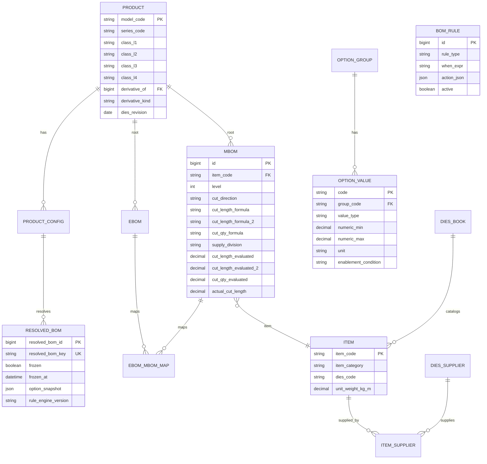
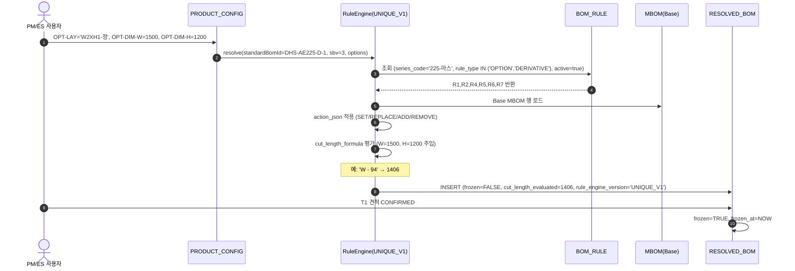

# DE35-1 미서기이중창 표준 BOM 구조 정의서 v1.5

> [!abstract] 요약
> - 본 문서는 **미서기 이중창(Sliding Double Window)** 의 표준 BOM 구조를 정의하는 **단독 SOT(Single Source of Truth)**. 유니크시스템 현행 BOM 데이터(DHS-AE225-D-1) 와 [[WIMS_용어사전_BOM_v1.3]] 을 기준으로 한다.
> - **v1.5 핵심 확장** (v1.4 대비):
>   1. PRODUCT/ITEM/OPTION_VALUE/MBOM/BOM_RULE/RESOLVED_BOM 엔티티의 신규 컬럼 11종 + enum 확장 반영 (§3.5, §9)
>   2. 4계층 제품분류(`productClassPath`, `class_l1~l4`) 를 BOM Level 체계와 통합 (§3.2)
>   3. 절단 속성(`cut_direction`/`cut_length_formula`/`cut_qty_formula`/`supply_division` + `*_evaluated` snapshot) 을 MBOM 행 속성으로 정의 — 별도 절단BOM 엔티티 없음 (§3.5)
>   4. BOM_RULE 액션 동사 4종(`SET`/`REPLACE`/`ADD`/`REMOVE`) 스키마 + `rule_type`(`OPTION`/`DERIVATIVE`) 도입 (§6.5)
>   5. 미서기이중창 DHS-AE225-D-1 을 기준 케이스로 **실제 DB 샘플**(§10) 첨부 — PRODUCT/OPTION/RULE/MBOM/RESOLVED_BOM 행까지
>   6. 다이스북·공급망 엔티티 3종(DIES_BOOK/DIES_SUPPLIER/ITEM_SUPPLIER) 반영 (§9.4)
>   7. 금지어(`CuttingBOM`·`산식구분`·`계산식`·`공식` 등) 전면 치환 (§12)
> - **SOT 원칙:** 표기 충돌 시 [[WIMS_용어사전_BOM_v1.3]] 우선, 본 문서는 미서기이중창 도메인 적용본.

> [!warning] v1.4 대비 변경 영향
> - §3.5 **절단 속성 정의 절 신규 추가** (D35-4)
> - §5.2 외측창짝 설명에 **OPT-DIM 치수 옵션** 연결 (D35-5)
> - §6.5 **BOM_RULE 액션 동사 스키마** 신설, Rule 카탈로그 10건 추가
> - §9 **엔티티 스키마 요약** — PRODUCT/ITEM/OPTION_VALUE/MBOM/BOM_RULE/RESOLVED_BOM 속성 확장 전량 반영
> - §10 **미서기이중창 실 데이터 샘플** 신설 (DHS-AE225-D-1 기준 INSERT 예시)
> - §12 변경이력 내 과거 금지어(`productVersion`/`configVersion`/`계산식`) 는 `[구명칭]` 주석 처리

---

## 목차

1. 개요
2. 용어 범례
3. BOM 구조 개요 (제품분류 4계층 · Phantom · 자재분류 · 절단 속성)
4. 미서기 이중창 표준 BOM (Level 전개표)
5. BOM 구성 상세 설명
6. BOM 등록 규칙 (품목코드 · 표준BOM 버전 · 수량 · 위치구분 · 룰 스키마)
7. MES 연동 고려사항
8. RuleEngine · 평가 파이프라인
9. 엔티티 스키마 요약 (v1.3 기준)
10. 미서기이중창 실 적용 예제 (DHS-AE225-D-1)
11. 계열별 절단 상수 차이표
12. 금지어 검증 및 변경 이력

---

## 1. 개요

### 1.1 목적

본 문서는 WIMS 시스템의 제품관리 모듈에서 관리하는 미서기 이중창의 표준 BOM(Bill of Materials, 자재명세서) 구조를 정의한다. 창호 제품의 원자재, 부자재, 공정, BOM 룰을 체계적으로 구조화하여 BOM 시스템의 표준 등록 기준을 수립하고, MES(제조실행시스템) 연동 시 데이터 정합성을 확보하는 것을 목적으로 한다.

### 1.2 적용 범위

일반 발코니용 미서기 이중창(외측 2짝 + 내측 2짝, PVC 또는 알루미늄 프레임 + 복층유리) 을 기준으로 작성한다. 본 구조는 WIMS 시스템 내 모든 미서기창 계열(160-우수 / 225-마스 / 226-마스) BOM 등록 시 참조 템플릿으로 활용되며, 제품 파생(캡바↔히든바, 반강화유리, 1mm 축소, 3편창, 연창 등) 에 맞게 확장 적용한다.

### 1.3 참조 문서

| 문서 코드 | 문서명 | 비고 |
|---|---|---|
| [[WIMS_용어사전_BOM_v1.3]] | BOM 도메인 용어사전 v1.3 | **최상위 기준** |
| [[DE11-1_소프트웨어_아키텍처_설계서_v1.2]] | SW 아키텍처 설계서 | ER 보강본·frozen 트리거 T1/T2/T3 |
| [[DE32-1_BOM도메인_ER다이어그램_v1.0]] | 논리/물리 ERD | 물리 스키마 확정 |
| [[DE24-1_인터페이스설계서_MES_REST_API_v1.8]] | MES 인터페이스 설계 | `/bom/resolved/{resolvedBomId}` |
| [[AN12-1_요구사항정의서_Phase1_v1.1]] | 요구사항 정의서 | 제품관리 FR |
| [[GAP_분석_통합_2026-04-15]] | GAP 분석 통합본 | §4′ DDL 요약 |

---

## 2. 용어 범례

본 문서에서 사용되는 전문 용어의 정의는 [[WIMS_용어사전_BOM_v1.3]] 을 최상위 기준으로 한다. 아래에는 미서기 이중창 도메인에 한정된 핵심 용어만 정리한다. (용어사전에 존재하는 항목은 참조 위치를 표기.)

### 2.1 창호 구조 용어

| 용어 | 설명 |
|---|---|
| 미서기창 (Sliding Window) | 창문을 좌우로 밀어서 여는 슬라이딩 창호 |
| 이중창 (2중창) | 실외측 창 + 실내측 창 두 겹 구조. 단열·방음 성능 우위 |
| 창틀 (Frame) | 개구부에 고정되는 상틀·하틀·좌틀·우틀 4변 구조체 |
| 창짝 (Sash) | 창틀 안에서 슬라이딩하는 문짝(상변/하변/좌변/우변) |
| 멀리언 (Mullion) | 이중창 내·외창을 구분하는 중간 격벽 프레임 |
| 후렘 (Frame, 현장표기) | 유니크시스템 원본 표기. 본 문서 § · DB 는 표준어 `Frame` 사용 |
| 레일 (Rail) | 하틀의 호차 주행 궤도. 이중창은 외창용·내창용 별도 |

### 2.2 유리·기밀 용어

복층유리(Pair Glass/IGU), 로이유리(Low-E), 간봉(Spacer Bar), 웜엣지(Warm Edge), 중공층, 아르곤가스, 실란트, 모헤어, 가스켓(EPDM), 단열재(Thermal Break) 는 v1.4 와 동일. 상세 설명은 v1.4 §2.2~2.4 를 본 v1.5 에 승계(동일 텍스트 생략).

### 2.3 시스템·제조 용어

| 용어 | 용어사전 참조 | 정의(요약) |
|---|---|---|
| BOM | v1.3 §2 | EBOM+MBOM+Config 묶음 |
| standardBomId | v1.3 §1 | 표준BOM 영속 식별자. 예: `DHS-AE225-D-1` |
| standardBomVersion | v1.3 §1 | EBOM+MBOM+Config 묶음 단일 버전 카운터 |
| resolvedBomId | v1.3 §1 | `RBOM-{standardBomId}-sbv{N}-{optionsHash}` |
| seriesCode | v1.3 §10 | `PRODUCT.series_code` — 예: `225-마스` |
| productClassPath | v1.3 §9 | `미서기/마스/복층/225` 형태의 4계층 분류 경로 |
| itemCategory | v1.3 §1 | PROFILE/GLASS/HARDWARE/CONSUMABLE/SEALANT/SCREEN |
| cutDirection | v1.3 §3 | `W`/`H`/`W1`/`H1`/`H2`/`H3` |
| supplyDivision | v1.3 §3 | `공통`/`외창`/`내창` |
| OPT-DIM | v1.3 §11 | NUMERIC 치수 옵션 그룹 |
| UNIQUE_V1 | v1.3 §13 | 산식 언어 식별자 |
| Phantom | v1.3 §3 | 재고 미보유 가상 반제품 노드 |

### 2.4 단위

| 단위 | 의미 |
|---|---|
| SET | 구성품 묶음 단위 (예: 창틀 1SET = 상·하·좌·우 조합) |
| EA | 낱개 (Each) |
| M | 미터. 길이로 산출하는 선형 자재 |

---

## 3. BOM 구조 개요

### 3.1 제품 구성 개념

미서기 이중창은 개구부에 설치되는 좌우 슬라이딩 이중 구조 창호다. 외측 2짝 + 내측 2짝이 각각 별도의 레일 위에서 움직이며, 두 겹 사이 공기층으로 단열·방음 성능을 확보한다. 각 창짝은 프레임, 복층유리, 호차, 기밀재 등으로 조립되고, 이들을 감싸는 창틀이 전체 구조의 뼈대가 된다.

### 3.2 BOM 계층 구조 + 제품분류 4계층

본 문서는 **BOM Level 체계(L0~L3)** 와 **제품분류 4계층(classL1~L4)** 을 **독립적 축**으로 사용한다. Level 은 자재 분해 깊이, Class 는 제품 카탈로그 위치다.

#### 3.2.1 BOM Level 체계

| Level | 구분 | 설명 | 예시 |
|---|---|---|---|
| **0** | 완제품 (Product) | 공장 출하 최종 단위 | 미서기 이중창 1SET |
| **1** | 조립체 (Assembly) | 여러 부품을 조합한 중간 단위 | 창틀, 외측 창짝, 내측 창짝, 하드웨어 세트 |
| **2** | 부품/자재 (Part) | 조립체 구성 개별 부품 | 상틀, 복층유리, 호차, 크리센트 |
| **3** | 원자재/소재 (Material) | 가장 기초 소재 | 판유리 1장, 간봉, 아르곤가스 |

> ※ 유니크시스템 원본 BOM 의 "Level 2 반제품(검사)" 는 §3.4 **Phantom 노드** 로 매핑된다. WIMS 4단 Level 과 원본 Level 은 1:1 대응되지 않는다.

#### 3.2.2 제품분류 4계층 (productClassPath)

(용어사전 v1.3 §9 대응) PRODUCT 행은 `class_l1~l4` 4개 컬럼으로 카탈로그 위치를 갖는다.

| 축 | 저장 컬럼 | 값 예시 (미서기) |
|---|---|---|
| L1 대분류 | `PRODUCT.class_l1` | `미서기` |
| L2 계약구분 | `PRODUCT.class_l2` | `마스` / `우수` |
| L3 유리사양 | `PRODUCT.class_l3` | `복층` / `삼중` |
| L4 치수계열 | `PRODUCT.class_l4` | `160` / `225` / `226` |
| (derived) | `product_class_path` | `미서기/마스/복층/225` |

예) `DHS-AE225-D-1` 의 `productClassPath = '미서기/마스/복층/225'`.

### 3.3 BOM Level vs 제품분류 통합 ER



### 3.4 Phantom 반제품 노드

유니크시스템 기존 BOM 데이터에서 Q'TY 컬럼이 공란인 중간 가공/조립 노드(HC-001, HC-002, HX-0001 등) 는 재고를 갖지 않는 **Phantom 반제품**으로 처리한다. WIMS 에서는 `MBOM.is_phantom=TRUE` 로 표기하여 MRP·재고 계산에서 제외하고, 하위 자재를 상위 조립체로 직접 전개(Phantom Explosion)한다.

| 항목 | 내용 |
|---|---|
| 정의 | 재고 미보유, BOM 계층 표기·공정 그룹화용 가상 노드 |
| 식별 | `is_phantom=TRUE` |
| 예시 | HC-001 (Frame 절단 반제품), HC-002 (중간 Frame + 풍지판), HX-0001 (225-H-양프레임 조립) |

> [!question] 미확정 (Q9 대기)
> HC-001/HC-002/HX-0001 의 실제 재고 보유 여부는 유니크시스템 Q9 회신 후 확정.

### 3.5 자재 분류 체계 + itemCategory

자재는 6가지 `itemCategory` enum 중 하나로 분류된다 ([[WIMS_용어사전_BOM_v1.3]] §1). 이 enum 은 Resolved 단계에서 `actualQty`·`actualCutLength` 산출 산식을 분기하는 키다.

| 분류 | itemCategory | 대표 자재 | lossRate 적용 산식 |
|---|---|---|---|
| 프레임(선형) | `PROFILE` | 상·하·좌·우틀, 창짝 변, 멀리언 | `actualCutLength = cutLengthEvaluated × (1+lossRate)` |
| 유리(2차원) | `GLASS` | 판유리, 복층유리 | `actualCutLength`, `actualCutLength2` 각 축 독립 |
| 철물(개수) | `HARDWARE` | 호차, 크리센트, 핸들, 스토퍼 | `actualQty = theoreticalQty × (1+lossRate)` |
| 소모품(개수) | `CONSUMABLE` | 나사, 실리콘, 보강재 | 동일 |
| 밀봉재(선형) | `SEALANT` | 모헤어, 가스켓, 바람막이, 백업재 | `actualCutLength` 산식 |
| 방충망 | `SCREEN` | 방충망 네트, 압입고무 | 개수 산식 |

### 3.6 MBOM 절단 속성 (신규 절 — D35-4)

v1.4 까지는 "절단 BOM" 이라는 별도 개념이 있었으나, [[WIMS_용어사전_BOM_v1.3]] §12 에 따라 **CuttingBOM 엔티티 폐기** 되었고, 절단 표현은 전부 MBOM 의 행 속성으로 흡수된다.

| 속성 | DB 컬럼 | 의미 |
|---|---|---|
| 절단 방향 | `cut_direction` | `W`/`H`/`W1`/`H1`/`H2`/`H3`. null 이면 절단 비대상 |
| 1차 절단 산식 | `cut_length_formula` | 예: `W - 94` — RuleEngine 평가 |
| 2차 절단 산식 | `cut_length_formula_2` | 유리(GLASS) 2차원 치수 등 |
| 절단 개수 산식 | `cut_qty_formula` | 예: `2`, `IIF(H>=900, 2, 0)` |
| 공급 구분 | `supply_division` | `공통`/`외창`/`내창`. 이중창 다층 분리 |
| 1차 평가 snapshot | `cut_length_evaluated` | RuleEngine 평가 결과 (mm). `frozen=TRUE` 후 불변 |
| 2차 평가 snapshot | `cut_length_evaluated_2` | 2차 길이 평가 결과 |
| 개수 평가 snapshot | `cut_qty_evaluated` | 절단 개수 평가 결과 |
| 로스 적용 실길이 | `actual_cut_length` | `cut_length_evaluated × (1 + lossRate)` |

> [!tip] 별도 `CUTTING_BOM` 테이블은 **생성하지 않는다**
> 같은 부재라도 "후렘 상하 W방향 2개" / "후렘 좌우 H방향 2개" 는 다른 MBOM 행으로 분리된다. 이미 MBOM 한 줄 = 한 `(자재, 위치, 공정)` 튜플이므로 여기에 절단 속성을 얹는 것이 최소 확장이다.

---

## 4. 미서기 이중창 표준 BOM (Level 전개표)

> 아래 표는 미서기 이중창(외측 2짝 + 내측 2짝) 1SET 기준의 표준 BOM 전개다. `Lv` 는 BOM 계층(숫자가 클수록 하위), `수량` 은 바로 위 조립체 1단위 기준 소요량이다. 용어가 낯선 경우 §2 · [[WIMS_용어사전_BOM_v1.3]] 을 참조한다.

| Lv | 품목코드 | 품목명 | itemCategory | 단위 | 수량 | 비고 |
|---|---|---|---|---|---|---|
| **0** | **PRD-SLD-DW** | **미서기 이중창** | — | SET | 1 | 외2+내2, 표준 발코니형 |
| **1** | **ASY-FRM-001** | **창틀 (Window Frame Assembly)** | — | SET | 1 | 상+하+좌+우+멀리언 조립 |
| 2 | FRM-TOP-001 | 상틀 (Top Frame) | PROFILE | EA | 1 | PVC/AL 압출 |
| 2 | FRM-BOT-001 | 하틀 (Bottom Frame) | PROFILE | EA | 1 | 레일 일체형·배수공 |
| 2 | FRM-LFT-001 | 좌틀 (Left Frame) | PROFILE | EA | 1 | 모헤어 삽입홈 |
| 2 | FRM-RGT-001 | 우틀 (Right Frame) | PROFILE | EA | 1 | 모헤어 삽입홈 |
| 2 | FRM-MUL-001 | 멀리언 (Mullion) | PROFILE | EA | 1 | 내·외창 구분 격벽 |
| 2 | MAT-RNF-001 | 보강재 (Steel Reinforcement) | CONSUMABLE | EA | 4 | 내풍압 |
| 2 | MAT-SCW-001 | 프레임 체결 나사 | CONSUMABLE | EA | 20 | 스텐레스 피스 |
| **1** | **ASY-OSH-001** | **외측 창짝 (Outer Sash Assembly)** | — | SET | 2 | 외측 좌짝 + 외측 우짝 |
| 2 | SH-FRM-O01 | 외측 창짝 프레임 | — | SET | 1 | 상·하·좌·우 조합 |
| 3 | SH-FRM-OT | 외측 상변 (Top Rail) | PROFILE | EA | 1 | |
| 3 | SH-FRM-OB | 외측 하변 (Bottom Rail) | PROFILE | EA | 1 | 호차 장착부 |
| 3 | SH-FRM-OL | 외측 좌변 (Left Stile) | PROFILE | EA | 1 | |
| 3 | SH-FRM-OR | 외측 우변 (Right Stile) | PROFILE | EA | 1 | 크리센트고리 장착부 |
| 2 | GLS-OUT-001 | 외측 복층유리 | GLASS | EA | 1 | 16~24mm |
| 3 | GLS-OUT-P1 | 판유리 실외측 | GLASS | EA | 1 | 5mm 투명/로이 |
| 3 | GLS-SPC-01 | 간봉 | CONSUMABLE | EA | 1 | AL/웜엣지 |
| 3 | GLS-GAS-01 | 중공층 가스 | CONSUMABLE | EA | 1 | 아르곤/건조공기 |
| 3 | GLS-OUT-P2 | 판유리 실내측 | GLASS | EA | 1 | 5mm |
| 3 | GLS-SEL-01 | 유리 실란트 | SEALANT | EA | 1 | 1차 부틸 + 2차 폴리설파이드 |
| 2 | GSK-OUT-001 | 외측 가스켓 | SEALANT | SET | 1 | EPDM 4변 |
| 2 | HCH-OUT-001 | 외측 호차 | HARDWARE | EA | 2 | 높낮이 조절형 |
| 2 | MHR-OUT-001 | 외측 모헤어 | SEALANT | M | 4.5 | 창짝 둘레 |
| **1** | **ASY-ISH-001** | **내측 창짝 (Inner Sash Assembly)** | — | SET | 2 | 내측 좌짝 + 내측 우짝 |
| 2 | SH-FRM-I01 | 내측 창짝 프레임 | — | SET | 1 | |
| 3 | SH-FRM-IT | 내측 상변 | PROFILE | EA | 1 | |
| 3 | SH-FRM-IB | 내측 하변 | PROFILE | EA | 1 | 호차 장착부 |
| 3 | SH-FRM-IL | 내측 좌변 | PROFILE | EA | 1 | |
| 3 | SH-FRM-IR | 내측 우변 | PROFILE | EA | 1 | 크리센트 본체 장착부 |
| 2 | GLS-INN-001 | 내측 복층유리 | GLASS | EA | 1 | 16~24mm |
| 3 | GLS-INN-P1 | 판유리 실외측 | GLASS | EA | 1 | |
| 3 | GLS-SPC-02 | 간봉 | CONSUMABLE | EA | 1 | |
| 3 | GLS-GAS-02 | 중공층 가스 | CONSUMABLE | EA | 1 | |
| 3 | GLS-INN-P2 | 판유리 실내측 | GLASS | EA | 1 | |
| 3 | GLS-SEL-02 | 유리 실란트 | SEALANT | EA | 1 | |
| 2 | GSK-INN-001 | 내측 가스켓 | SEALANT | SET | 1 | |
| 2 | HCH-INN-001 | 내측 호차 | HARDWARE | EA | 2 | |
| 2 | MHR-INN-001 | 내측 모헤어 | SEALANT | M | 4.5 | |
| **1** | **ASY-HDW-001** | **하드웨어 세트** | — | SET | 1 | |
| 2 | HDW-CRS-001 | 크리센트 본체 | HARDWARE | EA | 2 | 내측 우변 |
| 2 | HDW-CRH-001 | 크리센트 고리 | HARDWARE | EA | 2 | 외측 우변 |
| 2 | HDW-HDL-001 | 핸들 | HARDWARE | EA | 4 | 내·외 각 1 |
| 2 | HDW-STP-001 | 안전 스토퍼 | HARDWARE | EA | 4 | 이탈방지 |
| 2 | HDW-WCL-001 | 윈드클로저 | HARDWARE | EA | 2 | 선택 |
| **1** | **ASY-SEL-001** | **기밀·단열 자재 세트** | — | SET | 1 | |
| 2 | SEL-MHR-001 | 창틀 모헤어 | SEALANT | M | 8 | |
| 2 | SEL-GSK-001 | 프레임 가스켓 | SEALANT | M | 6 | EPDM |
| 2 | SEL-WBK-001 | 바람막이 | SEALANT | M | 3 | 연질 PVC |
| 2 | SEL-INS-001 | 단열재 (Thermal Break) | CONSUMABLE | EA | 4 | AZON/폴리아미드 |
| 2 | SEL-SIL-001 | 실리콘 실란트 | SEALANT | EA | 1 | |
| 2 | SEL-BAC-001 | 백업재 | SEALANT | M | 4 | PE 발포 |
| **1** | **ASY-SCR-001** | **방충망 세트** | — | SET | 1 | 조건부(§6.5 R7) |
| 2 | SCR-FRM-001 | 방충망 프레임 | PROFILE | SET | 1 | |
| 2 | SCR-NET-001 | 방충망 네트 | SCREEN | EA | 1 | SUS/폴리에스터 |
| 2 | SCR-RBR-001 | 방충망 압입고무 | SCREEN | M | 4 | |
| 2 | SCR-HCH-001 | 방충망 호차 | HARDWARE | EA | 2 | |
| 2 | SCR-HDL-001 | 방충망 손잡이 | HARDWARE | EA | 1 | |

---

## 5. BOM 구성 상세 설명

### 5.1 창틀 (Window Frame)

창틀은 벽체 개구부에 고정 설치되는 프레임 구조체로, 상·하·좌·우틀 4변과 멀리언으로 구성된다. 하틀에는 창짝 주행용 레일이 일체 형성되고, 물막이턱·배수공이 포함된다. 각 프레임 내부에는 스틸 보강심이 삽입되어 내풍압 성능을 확보한다. 각 변은 `itemCategory=PROFILE` 로 등록되며, `cut_direction` 은 W(상·하) 또는 H(좌·우), `cut_length_formula` 는 계열별 보정값(§11)에 따라 달라진다.

### 5.2 외측 창짝 (Outer Sash) — OPT-DIM 연결 (D35-5)

외측 창짝은 실외측 2짝의 슬라이딩 창문이다. 각 창짝은 상·하·좌·우 4변 프레임 틀에 복층유리를 EPDM 가스켓으로 고정한 구조이며, 하변 호차로 하틀 레일을 주행한다. 창짝의 실제 치수는 **OPT-DIM 치수 옵션 그룹** 에 의해 결정된다.

| 옵션 코드 | valueType | 기본 범위 | 단위 | 활성화 조건 |
|---|---|---|---|---|
| `OPT-DIM-W` | NUMERIC | 600 ~ 3000 | mm | 항상 |
| `OPT-DIM-H` | NUMERIC | 600 ~ 2400 | mm | 항상 |
| `OPT-DIM-W1` | NUMERIC | 200 ~ 1500 | mm | `OPT-LAY IN ('W3XH2-3편','W1XH1-3편')` |
| `OPT-DIM-H1` | NUMERIC | 200 ~ 1200 | mm | (연창 다단 활성 시) |

`OPT-DIM-W` 값은 후렘 상하 절단산식 `W - {상수}` 의 변수 `W` 에 주입되어, RuleEngine 평가 시 `cut_length_evaluated` 에 기록된다.

### 5.3 내측 창짝 (Inner Sash)

구조는 외측 창짝과 동일하다. 차이점은 내측 우변(`SH-FRM-IR`) 에 크리센트 본체가, 외측 우변(`SH-FRM-OR`) 에 크리센트 고리가 장착되어 두 창짝이 겹치는 위치에서 잠금이 형성된다는 점이다. 내창·외창 모두 동일 모델(225-마스 기준 225-H-양프레임-1) 을 `supplyDivision='외창'` / `supplyDivision='내창'` 으로 분리 등록한다.

### 5.4 복층유리 (IGU)

2장의 판유리 + 간봉 + 중공층 가스 + 실란트로 구성되는 2차원 절단 자재다. `itemCategory=GLASS`, `cut_length_formula` · `cut_length_formula_2` 에 가로·세로 산식을 각각 등록한다.

### 5.5~5.7 하드웨어 / 기밀·단열 / 방충망

v1.4 §5.5~5.7 과 동일. 하드웨어는 `HARDWARE`, 기밀재는 `SEALANT`, 방충망은 `SCREEN` 으로 매핑된다. 방충망 세트(`ASY-SCR-001`) 는 `OPT-LAY` 와 H 치수에 따라 조건부로 포함된다(§6.5 R7).

---

## 6. BOM 등록 규칙

### 6.1 품목코드 부여 체계

v1.4 §6.1 의 접두어 체계(PRD/ASY/FRM/SH/GLS/HDW/SEL/SCR/MAT/GSK/HCH/MHR) 를 승계한다. 단, 유니크시스템 실제 부재코드 명명(`UNI-A225-101`, `DHS-AE225-HC-001` 등) 과의 매핑은 `ITEM.dies_code` 컬럼(§9.1 ITEM 스키마) 에 저장하여 이중 관리한다.

### 6.2 표준BOM 버전 관리 원칙 — 단일 `standardBomVersion` 축

EBOM(자재구성) + MBOM(공정구성) + Config(옵션구성) 세 묶음은 **단일 `standardBomVersion`** 으로 묶음 스냅샷(bundle snapshot) 방식으로 관리한다. 셋 중 하나라도 변경되면 `standardBomVersion` 이 정수 증분된다.

#### 6.2.1 식별자(Code) vs 버전(Version) 축 분리

| 엔티티 | 불변 식별자 | 가변 버전 | 의미 |
|---|---|---|---|
| 표준BOM | `standardBomId` (예: `DHS-AE225-D-1`) | `standardBomVersion` (정수) | 제품·구성 조합 영속 식별 / EBOM+MBOM+Config 스냅샷 리비전 |
| 해석 BOM | `resolvedBomId` (결정적 생성) | — | 스냅샷 자체가 불변 |

**resolvedBomId 생성 규칙:**

```
resolvedBomId = RBOM-{standardBomId}-sbv{standardBomVersion}-{optionsHash}
예: RBOM-DHS-AE225-D-1-sbv3-a1b2c3d4
```

`optionsHash` 는 `appliedOptions` 의 **ENUM 옵션 값만** SHA-256 canonical JSON 해시 앞 8자 ([[WIMS_용어사전_BOM_v1.3]] §4.1). NUMERIC 옵션(W/H/W1…) 은 해시 산출에서 제외된다 — `W=1500·H=1200` 과 `W=1501·H=1201` 은 같은 resolvedBomId 로 수렴하고, 실제 치수는 `cut_length_evaluated` 에 별도 snapshot 된다.

#### 6.2.2 표준BOM 버전 관리 원칙

- 세 파트 중 하나라도 변경되면 `standardBomVersion` 증분, `changedComponents: [EBOM|MBOM|Config]` 기록
- 상태 전이: `DRAFT` → `RELEASED` → `DEPRECATED`
- RELEASED 된 버전은 구조 변경 불가, 변경 시 신규 버전 발행
- 외부 API 는 `GET /api/external/v1/bom/standard/{standardBomId}/versions/{standardBomVersion}` 단일 엔드포인트로 묶음 수신

#### 6.2.3 Resolved BOM 불변 스냅샷 원칙 (frozen 트리거)

Resolved BOM 은 생성 직후 `frozen=FALSE` 이며, 아래 T1/T2/T3 중 하나 발생 시 `frozen=TRUE` 로 **영구 동결**된다.

| 트리거 | 발생 조건 | 소관 서브시스템 |
|---|---|---|
| **T1** | 견적서(Estimation) **CONFIRMED** 전이 | ES |
| **T2** | 작업지시(WorkOrder) **RELEASED** 전이 | MF |
| **T3** | PM UI 에서 사용자가 명시적 "확정" 버튼 클릭 | PM |

> T1/T2/T3 정의는 [[DE11-1_소프트웨어_아키텍처_설계서_v1.2]] §5.5.2 와 동기화. 충돌 시 DE11-1 우선.

동결된 `cut_length_evaluated`·`cut_length_evaluated_2`·`cut_qty_evaluated`·`actual_cut_length`·`rule_engine_version` 은 이후 `BOM_RULE.action` 의 산식 상수가 변경되어도, RuleEngine 이 `UNIQUE_V2` 로 업그레이드되어도 **재평가하지 않는다** ([[WIMS_용어사전_BOM_v1.3]] §4.2).

### 6.3 수량 산출 기준

- 수량은 바로 위 조립체 1단위 기준
- `itemCategory=PROFILE`/`SEALANT` 는 길이(mm/M) 로 산출, `cut_length_formula` 평가 결과(mm) + `lossRate` 적용
- `itemCategory=GLASS` 는 W/H 2차원 산식 각각 적용
- `itemCategory=HARDWARE`/`CONSUMABLE`/`SCREEN` 는 개수 × lossRate

### 6.4 위치구분 코드 운용

유니크시스템 현행 BOM 의 위치구분 코드 체계 (후렘 파일 H01~H04·W01~W03, 문짝 파일 H01·H03·W01·W02) 는 `BOM_ITEM_LOCATION` 엔티티를 통해 관리된다. `locationCode` 는 MBOM 행의 `location_code` 컬럼으로, `variantCode`(예: `UNI-A225-101-HC`) 는 위치 인스턴스 품번으로 저장된다.

> [!question] 미확정 (Q16 대기)
> H/W 접두어 의미(수평/수직), 숫자 부여 기준(외→내/설치순서) 은 유니크시스템 회신 대기.

### 6.5 BOM_RULE 액션 동사 스키마 — 4종 verb

(용어사전 v1.3 §13.2 명세화) `BOM_RULE.action_json` 은 JSON 배열. 각 원소는 동사 + 인자로 구성.

| verb | 의미 | 필수 인자 |
|---|---|---|
| `SET` | MBOM 행 속성값 할당 | `target`(MBOM 선택자), `field`, `value`(리터럴/산식) |
| `REPLACE` | 행의 itemCode 치환 | `target`, `from`, `to` |
| `ADD` | 신규 행 삽입 | `item`(itemCode, cutDirection, cutLengthFormula, cutQtyFormula, supplyDivision …) |
| `REMOVE` | 행 제거 | `target` |

**rule_type enum:** `OPTION` (옵션값에 의한 변형) / `DERIVATIVE` (파생제품에 의한 변형).

#### 6.5.1 미서기이중창 Rule 카탈로그 10건

| # | 이름 | when_expr | action (요약) |
|---|---|---|---|
| R1 | 후렘 상하 절단 (225-마스) | `PRODUCT.series_code == '225-마스'` | `SET` MBOM{item=FRM-TOP-001,cut_direction=W}.cut_length_formula = `'W - 94'`; qty=`'2'` |
| R2 | 후렘 좌우 절단 (225-마스) | `PRODUCT.series_code == '225-마스'` | `SET` MBOM{cut_direction=H}.cut_length_formula = `'H - 47'`; qty=`'2'` |
| R3 | 후렘 절단 (160-우수) | `PRODUCT.series_code == '160-우수'` | `SET` cut_length_formula = `'W - 74'` |
| R4 | 외창 공급구분 | `PRODUCT.class_l4 == '225'` | `SET` MBOM{item=SH-FRM-O*}.supply_division = `'외창'` |
| R5 | 내창 공급구분 | `PRODUCT.class_l4 == '225'` | `SET` MBOM{item=SH-FRM-I*}.supply_division = `'내창'` |
| R6 | 유리 2차원 절단 | `itemCategory == 'GLASS'` | `SET` cut_length_formula=`'W - 130'`, cut_length_formula_2=`'H - 130'` |
| R7 | 방충망 H≥900 조건부 | `OPT-LAY == 'W2XH1-정'` | `ADD` item{itemCode=SCR-225,cut_direction=H,cut_length_formula=`'H - 40'`,cut_qty_formula=`'IIF(H >= 900, 2, 0)'`,supply_division=외창} |
| R8 | 3편창 W1 활성화 | `OPT-LAY == 'W3XH2-3편'` | `ADD` MBOM 행 for `SH-FRM-O-MID` with cut_direction=W1, cut_length_formula=`'W1 - 94'` |
| R9 | 연창 중간프레임 ADD | `OPT-LAY == 'W3XH1-연'` | `ADD` item{itemCode=FRM-MUL-002, cut_direction=H, cut_length_formula=`'H - 47'`, cut_qty_formula=`'2'`} |
| R10 | 히든바 파생 REPLACE | `PRODUCT.derivative_kind == 'CAP_TO_HIDDEN'` (rule_type=DERIVATIVE) | `REPLACE` target{itemCode=UNI-CW135-CAP} from=UNI-CW135-CAP to=UNI-CW135-HIDDEN; `SET` cut_length_formula=`'W - 100'` |

> [!example] R7 전체 JSON
> ```json
> {
>   "rule_type": "OPTION",
>   "when_expr": "OPT-LAY == 'W2XH1-정'",
>   "action_json": [
>     { "verb": "ADD",
>       "item": {
>         "itemCode": "SCR-225", "itemCategory": "SCREEN",
>         "cutDirection": "H", "cutLengthFormula": "H - 40",
>         "cutQtyFormula": "IIF(H >= 900, 2, 0)",
>         "supplyDivision": "외창"
>       }
>     }
>   ],
>   "active": true
> }
> ```

---

## 7. MES 연동 고려사항

| No | 항목 | 내용 |
|---|---|---|
| 1 | 연동 범위 | MES BOM 뷰는 Level 0~2 까지. Level 3 원자재는 별도 뷰 |
| 2 | 필수 항목 | itemCode, itemName, level, qty, unit, itemCategory, processCode, **cutDirection, cutLengthEvaluated(·2), cutQtyEvaluated, supplyDivision** |
| 3 | 구조 변경 동결 | 분석 단계 M1 합의 구조 이후 변경 시 영향도 협의 |
| 4 | 접근 권한 | `ROLE_MES_READER` 읽기 전용, 외부 경로만 |
| 5 | 데이터 갱신 | `resolvedBomId` 불변 스냅샷 기준 제공. MES 캐시 키는 반드시 `resolvedBomId` 포함 |
| 6 | 스냅샷 조회 원칙 | MES 는 `GET /api/external/v1/bom/resolved/{resolvedBomId}` 전용 사용. "현재 최신 RELEASED" 는 WIMS 내부 검증용 |

---

## 8. RuleEngine · 평가 파이프라인

### 8.1 평가 시퀀스



### 8.2 인덱스 · 캐시 전략

- `BOM_RULE` 에 `(series_code, rule_type, active)` 복합 인덱스 + `(product_class_path)` 보조 인덱스
- 애플리케이션 기동 시 `action_json` 산식 사전 파싱(pre-compile) → AST in-memory 캐시
- `UNIQUE_V1` → `UNIQUE_V2` 언어 업그레이드 시 frozen Resolved 는 재평가 금지, 신규 Config 부터 V2 적용

---

## 9. 엔티티 스키마 요약 (용어사전 v1.3 기준)

본 절은 DE35-1 에서 참조·운용하는 BOM 엔티티의 신규·확장 속성을 정리한다. 물리 스키마 확정은 [[DE32-1_BOM도메인_ER다이어그램_v1.0]] 소관.

### 9.1 PRODUCT (v1.3 §9 · §10 · §16)

| 컬럼 | 타입 | 정의 |
|---|---|---|
| `product_id` | BIGINT PK (surrogate) | SOT=DE32-1 |
| `model_code` | VARCHAR(32) UNIQUE | 예: `DHS-AE225-D-1` |
| `series_code` | VARCHAR(32) | 예: `225-마스`, `160-우수` |
| `class_l1` | VARCHAR(16) | 대분류. `미서기`/`커튼월` |
| `class_l2` | VARCHAR(16) | 계약구분. `마스`/`우수` |
| `class_l3` | VARCHAR(16) | 유리사양. `복층`/`삼중` |
| `class_l4` | VARCHAR(16) | 치수계열. `160`/`225`/`226` |
| `derivative_of` | BIGINT FK→PRODUCT | 파생 시 기본제품 참조 |
| `derivative_kind` | VARCHAR(16) | `1MM`/`CAP_TO_HIDDEN`/`TEMPERED`/`FIRE_43MM` |
| `dies_revision` | DATE | 다이스북 개정 일자 |

### 9.2 ITEM

| 컬럼 | 타입 | 정의 |
|---|---|---|
| `item_code` | VARCHAR(32) PK | |
| `item_category` | VARCHAR(16) | `PROFILE`/`GLASS`/`HARDWARE`/`CONSUMABLE`/`SEALANT`/`SCREEN` |
| `dies_code` | VARCHAR(32) | 압출 금형 식별자 (유니크 부재코드) |
| `unit_weight_kg_m` | DECIMAL(8,3) | PROFILE 단위중량 (kg/m) — SOT=DE32-1 |

### 9.3 OPTION_VALUE

| 컬럼 | 타입 | 정의 |
|---|---|---|
| `value_id` | BIGINT PK (surrogate) | SOT=DE32-1 |
| `value_code` | VARCHAR(32) | UNIQUE(group_id, value_code) |
| `group_id` | BIGINT FK→OPTION_GROUP | |
| `value_type` | VARCHAR(16) | `ENUM`/`NUMERIC`/`RANGE` (default `ENUM`) |
| `numeric_min` | DECIMAL(10,2) | |
| `numeric_max` | DECIMAL(10,2) | |
| `unit` | VARCHAR(8) | 예: `mm` |
| `enablement_condition` | VARCHAR(255) | UNIQUE_V1 조건식. null 이면 항상 활성 |

### 9.4 MBOM (절단 속성 포함)

§3.6 표 전체. 특히 `cut_direction`, `cut_length_formula`, `cut_length_formula_2`, `cut_qty_formula`, `supply_division`, `cut_length_evaluated`, `cut_length_evaluated_2`, `cut_qty_evaluated`, `actual_cut_length` 9개 신규 컬럼.

### 9.5 BOM_RULE

| 컬럼 | 타입 | 정의 |
|---|---|---|
| `id` | BIGINT PK | |
| `rule_type` | VARCHAR(16) | `OPTION` / `DERIVATIVE` |
| `when_expr` | VARCHAR(512) | UNIQUE_V1 조건식 |
| `action_json` | JSON | verb 4종 배열 (§6.5) |
| `active` | BOOLEAN | |

### 9.6 RESOLVED_BOM

| 컬럼 | 타입 | 정의 |
|---|---|---|
| `resolved_bom_id` | BIGINT PK (surrogate) | |
| `resolved_bom_key` | VARCHAR(96) UNIQUE | `RBOM-...-sbv{N}-{optionsHash}` — SOT=DE32-1 |
| `frozen` | BOOLEAN | 초기 FALSE, T1/T2/T3 시 TRUE |
| `frozen_at` | DATETIME | |
| `option_snapshot` | JSON | `appliedOptions` 원본 |
| `rule_engine_version` | VARCHAR(16) | 예: `UNIQUE_V1` |

### 9.7 다이스북·공급망 (신규 엔티티 3종 — v1.3 §14)

| 엔티티 | 주요 컬럼 | 용도 |
|---|---|---|
| `DIES_BOOK` | `dies_book_id`, `dies_book_revision`(DATE), `supplier_id`(FK→DIES_SUPPLIER) | 금형 카탈로그 개정판 — SOT=DE32-1 |
| `DIES_SUPPLIER` | `supplier_id`, `name`, `role`(`EXTRUSION`/`INSULATION`/`HARDWARE`) | 금형사 |
| `ITEM_SUPPLIER` | (item_code FK, supplier_id FK, lead_time) | 자재 ↔ 공급사 다대다 |

---

## 10. 미서기이중창 실 적용 예제 (DHS-AE225-D-1)

본 절은 **225-마스 계열 DHS-AE225-D-1** 을 케이스로, 엔드투엔드 데이터 샘플을 제공한다. 실제 Flyway 마이그레이션·초기 로드 스크립트의 기준 예제로 사용된다.

### 10.1 PRODUCT INSERT

```sql
INSERT INTO PRODUCT (model_code, series_code, class_l1, class_l2, class_l3, class_l4,
                     derivative_of, derivative_kind, dies_revision)
VALUES ('DHS-AE225-D-1', '225-마스', '미서기', '마스', '복층', '225',
        NULL, NULL, DATE '2025-08-20');
-- productClassPath (derived) = '미서기/마스/복층/225'
```

### 10.2 OPTION 구성 (PRODUCT_CONFIG.option_snapshot)

```json
{
  "OPT-LAY":   "W2XH1-정",
  "OPT-DIM-W": 1500,
  "OPT-DIM-H": 1200
}
```

optionsHash 계산 시 `OPT-LAY` 만 포함(ENUM), `OPT-DIM-W/H` 는 제외(NUMERIC). 예: `optionsHash = 'a1b2c3d4'`.

### 10.3 BOM_RULE 샘플 (5건)

```sql
-- R1: 후렘 상하 절단 (225-마스)
INSERT INTO BOM_RULE (rule_type, when_expr, action_json, active) VALUES
('OPTION', 'PRODUCT.series_code == ''225-마스''',
 '[{"verb":"SET","target":{"itemCode":"FRM-TOP-001","cut_direction":"W"},
    "field":"cut_length_formula","value":"W - 94"},
   {"verb":"SET","target":{"itemCode":"FRM-TOP-001","cut_direction":"W"},
    "field":"cut_qty_formula","value":"2"}]', TRUE);

-- R2: 후렘 좌우 절단 (225-마스)
INSERT INTO BOM_RULE ... when_expr ... action_json:
 '[{"verb":"SET","target":{"cut_direction":"H"},
    "field":"cut_length_formula","value":"H - 47"}]';

-- R4: 외창 공급구분
INSERT INTO BOM_RULE (rule_type, when_expr, action_json, active) VALUES
('OPTION', 'PRODUCT.class_l4 == ''225''',
 '[{"verb":"SET","target":{"itemCode":"SH-FRM-O*"},
    "field":"supply_division","value":"외창"}]', TRUE);

-- R7: 방충망 조건부 ADD (H>=900)
INSERT INTO BOM_RULE (rule_type, when_expr, action_json, active) VALUES
('OPTION', 'OPT-LAY == ''W2XH1-정''',
 '[{"verb":"ADD","item":{
     "itemCode":"SCR-225","itemCategory":"SCREEN",
     "cutDirection":"H","cutLengthFormula":"H - 40",
     "cutQtyFormula":"IIF(H >= 900, 2, 0)",
     "supplyDivision":"외창"}}]', TRUE);

-- R10: 히든바 파생 (DERIVATIVE)
INSERT INTO BOM_RULE (rule_type, when_expr, action_json, active) VALUES
('DERIVATIVE', 'PRODUCT.derivative_kind == ''CAP_TO_HIDDEN''',
 '[{"verb":"REPLACE","target":{"itemCode":"UNI-CW135-CAP"},
    "from":"UNI-CW135-CAP","to":"UNI-CW135-HIDDEN"},
   {"verb":"SET","target":{"itemCode":"UNI-CW135-HIDDEN"},
    "field":"cut_length_formula","value":"W - 100"}]', TRUE);
```

### 10.4 MBOM 행 샘플 (Base, 평가 전)

| item_code | level | cut_direction | cut_length_formula | cut_qty_formula | supply_division | itemCategory |
|---|---|---|---|---|---|---|
| FRM-TOP-001 | 2 | W | `W - 94` | `2` | 공통 | PROFILE |
| FRM-BOT-001 | 2 | W | `W - 94` | `2` | 공통 | PROFILE |
| FRM-LFT-001 | 2 | H | `H - 47` | `2` | 공통 | PROFILE |
| FRM-RGT-001 | 2 | H | `H - 47` | `2` | 공통 | PROFILE |
| SH-FRM-OT | 3 | W | `W - 130` | `1` | 외창 | PROFILE |
| SH-FRM-OB | 3 | W | `W - 130` | `1` | 외창 | PROFILE |
| SH-FRM-IT | 3 | W | `W - 130` | `1` | 내창 | PROFILE |
| GLS-OUT-P1 | 3 | W | `W - 160` (formula_2: `H - 160`) | `1` | 외창 | GLASS |

### 10.5 RESOLVED_BOM 샘플 (W=1500, H=1200 평가 snapshot)

| item_code | cut_direction | cut_length_evaluated | cut_length_evaluated_2 | cut_qty_evaluated | actual_cut_length (lossRate=0.03) |
|---|---|---|---|---|---|
| FRM-TOP-001 | W | 1406 | — | 2 | 1448.18 |
| FRM-LFT-001 | H | 1153 | — | 2 | 1187.59 |
| SH-FRM-OT | W | 1370 | — | 1 | 1411.10 |
| GLS-OUT-P1 | W | 1340 | 1040 | 1 | 1380.20 / 1071.20 |
| SCR-225 (R7 추가) | H | 1160 | — | `IIF(1200>=900,2,0)` → 2 | 1194.80 |

```json
{
  "resolvedBomId": "RBOM-DHS-AE225-D-1-sbv3-a1b2c3d4",
  "standardBomId": "DHS-AE225-D-1",
  "standardBomVersion": 3,
  "appliedOptions": { "OPT-LAY":"W2XH1-정","OPT-DIM-W":1500,"OPT-DIM-H":1200 },
  "appliedOptionsHash": "a1b2c3d4",
  "frozen": false,
  "ruleEngineVersion": "UNIQUE_V1"
}
```

T1(견적 CONFIRMED) 시점에 `frozen=TRUE`, `frozen_at=2026-05-01T10:00:00Z` 로 전환되고 이후 불변.

---

## 11. 계열별 절단 상수 차이표

미서기 계열별 후렘 절단 보정 상수. 동일 Rule 구조에서 `when_expr` 의 `series_code` 분기로 격납된다 ([[WIMS_용어사전_BOM_v1.3]] §13.1).

| 계열 | 후렘 상하 (W 방향) | 후렘 좌우 (H 방향) | 창짝 변 (W) | 창짝 변 (H) |
|---|---|---|---|---|
| `160-우수` | `W - 74` | `H - 37` | `W - 110` | `H - 110` |
| `225-마스` | `W - 94` | `H - 47` | `W - 130` | `H - 130` |
| `226-마스` | `W - 94` | `H - 47` | `W - 132` | `H - 132` |

> 각 계열은 별개의 BOM_RULE 행으로 저장된다. `PRODUCT.series_code` 가 분기 조건이므로 `BOM_RULE` 이 증가하더라도 평가 시점에는 해당 계열 행만 필터링되어 20~50건 수준.

---

## 12. 금지어 검증 및 변경 이력

### 12.1 금지어 검증 결과

[[WIMS_용어사전_BOM_v1.3]] §7 금지어 전수 점검:

| 금지어 | 본 문서 사용 여부 | 비고 |
|---|---|---|
| `CuttingBOM`, `CUTTING_BOM` | ❌ 없음 | MBOM 절단 속성(§3.6) 으로 대체 |
| `LayoutType`, `LAYOUT_TYPE` | ❌ 없음 | `OPT-LAY` 옵션값 |
| `ProductSeries`, `PRODUCT_SERIES` | ❌ 없음 | `PRODUCT.series_code` |
| `산식구분`, `formula_kind` | ❌ 없음 | `supply_division` 로 단일화 |
| `계산식`, `공식` (BOM 문맥) | ❌ 치환 완료 | `산식` 으로 통일 |
| `productVersion`, `configVersion` | §12.2 변경이력 내 역사적 서술만 `[구명칭]` 주석 | 설계 본문 0건 |
| `appliedOptionValues` | ❌ 없음 | `appliedOptions` + `appliedOptionsHash` |
| `changedParts` | ❌ 없음 | `changedComponents` |
| `sv{N}` prefix | ❌ 없음 | `sbv{N}` 사용 |

### 12.2 변경 이력

| 버전 | 일자 | 작성자 | 변경 내용 |
|---|---|---|---|
| v1.0 | 2026-03-05 | 코드크래프트 | 최초 작성 — 미서기 이중창 표준 BOM 구조 정의 |
| v1.1 | 2026-03-05 | 코드크래프트 | 용어 범례(§2) 추가, 전문 용어 괄호 설명 보강 |
| v1.2 | 2026-04-14 | 코드크래프트 | DHS-AE225-D-1 BOM 정리 반영. Phantom 반제품(§3.3 — 본 v1.5 §3.4), 위치구분 코드(§6.4) 신설 |
| v1.3 | 2026-04-14 | 코드크래프트 | Resolved BOM 불변 스냅샷 원칙 신설. `resolvedBomId` 식별자 체계, T1/T2/T3 frozen 트리거 |
| v1.4 | 2026-04-14 | 코드크래프트 | 식별자(Code) vs 버전(Version) 축 분리, `standardBomId`/`standardBomVersion` 단일 축 통합. `[구명칭 `productVersion`, `configVersion`]` 폐기 |
| v1.5-r1 | 2026-04-16 | 코드크래프트 | CX1/CX3 P0 정정 — wikilink 7건(시릴문자 오타·DE32-1/AN12-1/DE24-1 경로) 정정, §6.5 `formula 등` → `cutLengthFormula, cutQtyFormula, supplyDivision`, PRODUCT/OPTION_VALUE PK 를 DE32-1 SOT(surrogate BIGINT)로 정정, `unit_weight_kg_m` DECIMAL(8,3)·`resolved_bom_key` VARCHAR(96)·DIES_BOOK `supplier_id` 로 통일 |
| **v1.5** | **2026-04-16** | **코드크래프트** | **용어사전 v1.3 반영 — 단독 SOT 재구성. 1) PRODUCT(`series_code`/`class_l1~4`/`derivative_of/kind`/`dies_revision`), ITEM(`item_category`/`dies_code`/`unit_weight_kg_m`), OPTION_VALUE(`value_type`/`numeric_min/max`/`unit`/`enablement_condition`), MBOM(절단 9속성), BOM_RULE(`rule_type`/`action_json` verb 4종), RESOLVED_BOM(`rule_engine_version`) 신규/확장 (§3.6, §9) 2) 4계층 제품분류 통합 ER (§3.2~3.3) 3) `CuttingBOM` 엔티티 폐기 — MBOM 속성 확장으로 대체 (§3.6) 4) BOM_RULE 액션 동사 스키마 `SET`/`REPLACE`/`ADD`/`REMOVE` 공식화, 미서기 Rule 카탈로그 10건 (§6.5) 5) DHS-AE225-D-1 실 데이터 샘플 INSERT/MBOM/RESOLVED 행 (§10) 6) 계열별 절단 상수 차이표 (§11) 7) 다이스북·공급망 엔티티 3종 (§9.7) 8) 금지어(`CuttingBOM`·`산식구분`·`계산식`·`공식`) 본문 0건 달성 (§12.1) 9) [[DE11-1_소프트웨어_아키텍처_설계서_v1.2]] ER 보강본, [[DE24-1_인터페이스설계서_MES_REST_API_v1.7]] 과 정합** |

---

## 관련 문서

- [[WIMS_용어사전_BOM_v1.3]]
- [[DE11-1_소프트웨어_아키텍처_설계서_v1.2]]
- [[DE32-1_BOM도메인_ER다이어그램_v1.0]]
- [[DE24-1_인터페이스설계서_MES_REST_API_v1.8]]
- [[GAP_분석_통합_2026-04-15]]
- [[V3_기존설계문서_영향도]]
- [[V2_데이터모델_완전성_검증]]
- [[V4_비즈니스규칙_수용성]]
- [[V5_성능운영_리스크]]
- [[DHS-AE225-D-1_BOM_정리]]
- [[1_유니크제품명정리_분석]]
- [[2-2_미서기제작지시서_분석]]
- [[2-3_미서기산식_분석]]
- [[4-2_커튼월다이스북_분석]]
- [[DE35-1_미서기이중창_표준BOM구조_정의서_v1.4]] (supersedes)
