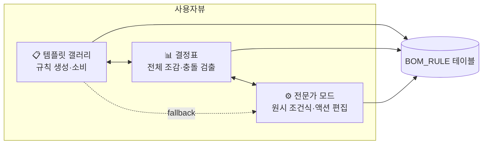
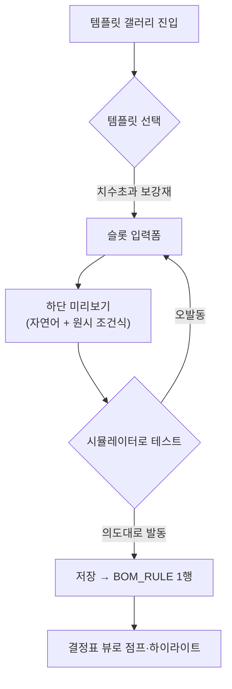
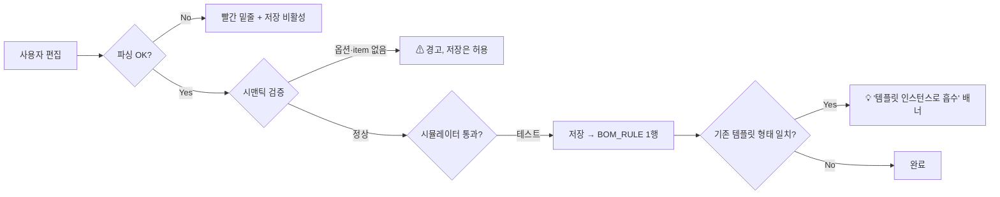
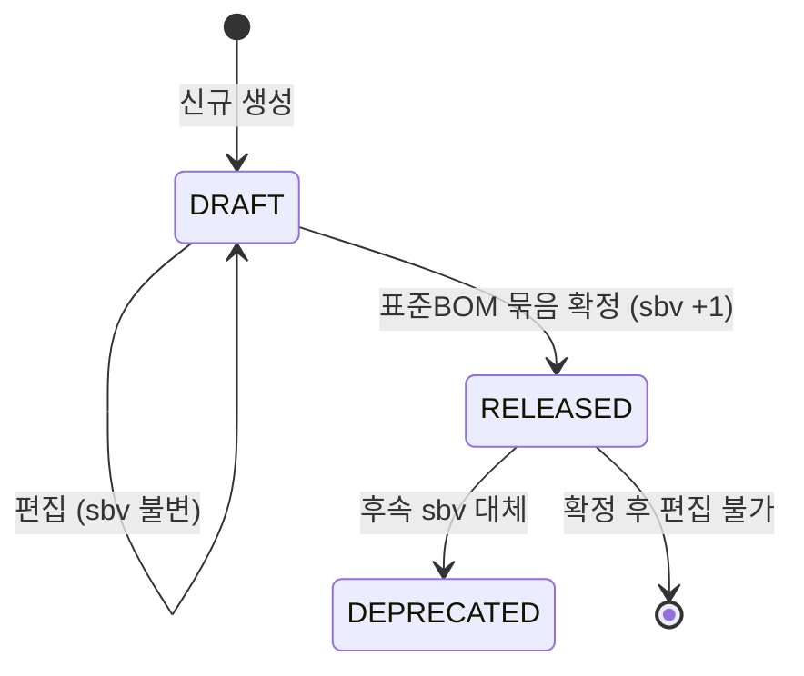
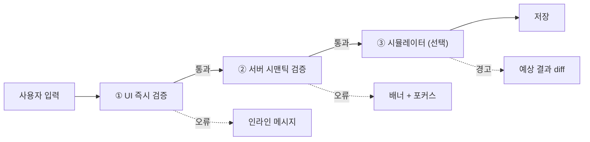

# BOM 옵션별규칙 관리 UI 설계 (Spec)

> [!abstract] 요약
> - `BOM_RULE`(옵션별규칙) 관리 UI 를 **템플릿 갤러리 / 결정표 / 전문가 모드** 3뷰 체계로 재설계한다.
> - 사용자는 "조건식·액션·우선순위·충돌" 을 직접 조합하지 않고, **PM 이 큐레이션한 템플릿**의 슬롯을 채우는 방식으로 규칙을 생성한다. 결정표 뷰는 규칙 전체 조감·충돌·공백을 한 화면에서 드러낸다. 전문가 모드는 예외 규칙용 원시 편집기.
> - 사용자 역할을 UI 차원에서 분리한다 — **PM 담당자가 마스터 규칙을 큐레이션**하고 **견적 담당자는 프로젝트별 예외 규칙만** 추가하는 2층 구조. 저장 모델은 기존 `BOM_RULE` 을 유지하되 `template_id` · `template_instance_id` · `slot_values` · `scope_type` 4개 컬럼을 추가한다.
> - 초기 빌트인 템플릿 6종으로 현장 규칙의 80%+ 커버를 목표로 한다. 템플릿으로 안 되는 예외는 전문가 모드로 작성 후 **템플릿 승격** 으로 유기적 확장.
>
> 배경 사용자 요청: *"규칙을 조합하는 방식이 어렵다"* (조건 조합 · 액션 조합 · 규칙 간 조합 · 조건↔액션 묶음이 **전부** 어렵다는 피드백)

## 배경

현재 [[DE22-1_화면설계서_v1.5-r1#05_BOM관리|옵션별규칙 추가 UI 목업]]은 IF-THEN 카드 기반 빌더다. 행별 AND/OR 토글, 액션 카드 리스트, 산식 미리보기가 한 화면에 펼쳐진다. 기본 CRUD 는 완성되어 있으나 다음 문제가 누적된다.

> [!warning] 현 목업의 누적 리스크
> 1. **조건 우선순위 모호** — 괄호·그룹 없이 AND/OR 만 토글 → `A AND B OR C` 의 해석이 사용자마다 갈림
> 2. **액션 순서·의존성 불명확** — 카드 나열이 "동시 적용" 인지 "순차 적용" 인지 정의 없음
> 3. **규칙 간 충돌 미검출** — 복수 규칙이 같은 옵션 조합에 매칭될 때 우선순위 정책·UI 피드백 없음
> 4. **연쇄 변경 표현 곤란** — 한 옵션이 여러 자재 속성을 동시 변경하는 케이스(절단방향 선택)를 여러 규칙으로 쪼개야 함
> 5. **요구사항·목업 동사 불일치** — [[AN12-1_요구사항정의서_Phase1_v1.1|AN12-1]] 은 `SET/REPLACE/ADD/REMOVE` 4종, 목업은 `QTY_CHANGE/LOSS_CHANGE` 를 포함한 5종
> 6. **역할 분리 부재** — PM 마스터 규칙 vs 견적 단계 예외 규칙의 화면·권한 구분 없음

### 대표 사용 사례 (설계 앵커)

> [!example] 사례 1 — 치수 초과 보강재 자동 추가
> 225 미서기, 3×2 연창 레이아웃, 가로 길이(W) ≥ 3000mm 일 때, 미서기 내부에 **보강재 자재 + 설치 공정** 을 추가한다.
>
> - 조건: ENUM 2개 + NUMERIC 1개 (`productClassPath`, `OPT-LAY`, `W`)
> - 액션: ADD 자재 + ADD 공정 (**2개 액션이 한 규칙에 묶여야 함**)

> [!example] 사례 2 — 가로바/세로바 절단방향 선택
> 미서기 창 사이에 들어가는 가로바·세로바 중 **어느 쪽을 통으로 자르고 어느 쪽을 보정할지** 를 옵션으로 선택 가능하게 한다.
>
> - 조건: `OPT-CUT` ENUM 값 1개
> - 액션: 가로바·세로바 양쪽의 `cutLengthFormula` 를 **동시에** 변경 (**1 옵션 → N 자재 연쇄**)

이 두 사례는 현 목업 구조로는 각각 여러 규칙 행으로 쪼개거나 논리적 단위를 희생해야 표현된다.

## 설계 목표

| 목표 | 지표 |
|---|---|
| 규칙 작성 학습곡선 최소화 | 견적 담당자가 **5분 내 첫 규칙 저장** 가능 |
| 복잡한 규칙도 **단일 논리 단위** 로 유지 | 사례 1·2 가 **UI 상 1 규칙** 으로 입력·조회됨 |
| 규칙 전체 조감과 충돌 조기 발견 | 결정표 뷰에서 **충돌·공백이 자동 하이라이트** |
| 유연성 보존 (템플릿 이탈 허용) | PM 숙련자는 전문가 모드에서 **UNIQUE_V1 원시 편집** |
| 데이터 모델 하위호환 | 기존 `BOM_RULE` 구조 변경 없이 **4개 컬럼만 추가** |

## 섹션 1 — 정보구조와 3뷰 체계



### 뷰별 역할

| 뷰 | 기본 사용자 | 주 용도 | 기본 노출 |
|---|---|---|---|
| 템플릿 갤러리 | 견적 담당자 | 마스터가 깔아둔 템플릿으로 규칙 생성·복제 | 기본 탭 |
| 결정표 | PM 담당자 | 제품군 전체 규칙 매트릭스 점검·충돌 확인 | 탭 전환 |
| 전문가 모드 | PM 숙련자 | 템플릿으로 안 되는 예외 규칙 직접 편집 | 권한 토글, 기본 숨김 |

### 고정 헤더

뷰 전환과 무관하게 **제품군·버전·DRAFT/RELEASED 상태**는 화면 상단에 상주한다. 사용자가 "어떤 표준BOM 의 규칙을 다루는지" 를 늘 인지하도록 한다.

```
[제품군: 225 미서기 ▾]  [standardBomVersion: sbv12]  [상태: DRAFT]
[뷰: 📋 템플릿 | 📊 결정표 | ⚙️ 전문가]          [🔍 시뮬레이터 🔘]
```

시뮬레이터 토글은 뷰 공통 사이드 패널로, 가상 옵션 조합을 입력해 **어떤 규칙이 발동하는지·최종 MBOM diff** 를 저장 없이 확인한다.

### 뷰 간 이동 원칙

- 템플릿 → 결정표: 저장 직후 해당 행으로 스크롤·하이라이트
- 결정표 → 전문가: 행 우클릭 > "원시 편집"
- 전문가 → 템플릿: 기존 템플릿 패턴과 일치 시 "템플릿 승격" 배너

> [!info] 기각된 대안
> - **1뷰 통합** — 현 목업의 고밀도 재현, 견적 담당자 진입 실패
> - **뷰 분리 + 페이지 이동** — 뷰 전환 시 맥락(제품군·버전) 손실

## 섹션 2 — 템플릿 시스템

템플릿은 UI 편의 개념이다. 저장은 기존 `BOM_RULE` 모델을 그대로 쓰고, 템플릿은 **슬롯이 채워지면 1개 이상의 규칙 행으로 컴파일**된다.

### 템플릿 스키마

```yaml
templateId: TPL-REINFORCE-SIZE
name: 치수 초과 시 보강재 자동 추가
category: 자재·공정
slots:
  - key: productClass     # 제품군 선택
    type: product_class
  - key: layout           # 레이아웃 (다중 선택)
    type: option_value(OPT-LAY)
    multi: true
  - key: axis             # 기준 축
    type: enum[W, H]
  - key: threshold        # 임계값
    type: numeric(mm)
  - key: reinforceItem    # 추가 자재
    type: item_ref(filter=PROFILE)
  - key: reinforceProcess # 추가 공정
    type: process_ref
compile:
  - condition: "productClassPath = {productClass}
                AND OPT-LAY IN ({layout})
                AND {axis} >= {threshold}"
    actions:
      - {verb: ADD, target: MBOM,         item: {reinforceItem}, qty: 1}
      - {verb: ADD, target: MBOM_PROCESS, process: {reinforceProcess}}
```

### 1 슬롯 세트 → N 규칙 (연쇄 케이스)

사례 2(절단방향 선택)는 **1 인스턴스가 2 행을 컴파일**한다:

```yaml
templateId: TPL-CUT-DIRECTION
name: 가로바·세로바 절단방향 선택
slots:
  - key: horizontalBar : item_ref(filter=PROFILE)
  - key: verticalBar   : item_ref(filter=PROFILE)
  - key: barThickness  : numeric(mm)
compile:
  - condition: "OPT-CUT = '가로우선'"
    actions:
      - {verb: SET, target: {horizontalBar}, field: cutLengthFormula, value: "W"}
      - {verb: SET, target: {verticalBar},   field: cutLengthFormula, value: "H - {barThickness}*2"}
  - condition: "OPT-CUT = '세로우선'"
    actions:
      - {verb: SET, target: {horizontalBar}, field: cutLengthFormula, value: "W - {barThickness}*2"}
      - {verb: SET, target: {verticalBar},   field: cutLengthFormula, value: "H"}
```

사용자는 **한 화면**에서 3개 슬롯만 지정. 저장 시 `BOM_RULE` 2행 생성. 결정표 뷰에선 `template_instance_id` 로 묶여 **논리적 1 단위** 로 표시.

### 초기 빌트인 템플릿 6종

| # | 템플릿 ID | 이름 | 커버 케이스 | 주 동사 |
|---|---|---|---|---|
| 1 | `TPL-REINFORCE-SIZE` | 치수 초과 보강재 추가 | 사례 1 | ADD |
| 2 | `TPL-CUT-DIRECTION` | 절단방향 선택 | 사례 2 | SET × N |
| 3 | `TPL-ITEM-REPLACE-BY-OPT` | 옵션별 자재 교체 | 유리·프로파일 색상 | REPLACE |
| 4 | `TPL-FORMULA-BY-RANGE` | 치수 구간별 산식 변경 | W 구간별 cutLengthFormula | SET |
| 5 | `TPL-ADD-BY-OPT` | 옵션별 부자재 추가 | OPT-ACC 부자재 | ADD |
| 6 | `TPL-DERIVATIVE-DIFF` | 파생제품 차이 | 용어사전 §16 기본↔파생 | REPLACE / SET |

> [!question] 검증 필요
> 초기 6종이 AN12-1 의 FR-PM-012 유스케이스 80% 를 커버하는지 S2~S3 에서 대조 · 확정.

### 작성 플로우 (견적 담당자)



- **슬롯 입력폼**: 의미 단위 카드형(제품군, 레이아웃, 임계값…). 조건·액션 드롭다운을 나열하는 현 목업과 근본적으로 다르다.
- **자연어 미리보기**: *"225 미서기·3×2 연창·W≥3000mm 일 때, 보강재 2EA 와 보강공정을 추가합니다"* + 원시 조건식 토글.
- **시뮬레이터**: 저장하지 않고도 가상 옵션 조합에 이 규칙이 발동하는지 즉시 표시.

### PM 담당자의 템플릿 큐레이션

- **빌트인 6종** — 시스템 예약. 수정·삭제 불가, 비활성화만 가능
- **커스텀 템플릿** — 전문가 모드 원시 규칙 → "템플릿으로 승격" 마법사(슬롯 정의 자동 추출) → 저장. (S3~S4 상세 설계)
- **스코프** — `미서기 전용 | 커튼월 전용 | 공통` 태그

> [!info] 기각된 대안
> - **마법사(wizard) 단계형 페이지 이동** — WIMS 규칙 슬롯 수(3~5) 에 과함
> - **자유 폼 + 자동완성만** — 학습곡선 문제 미해결

## 섹션 3 — 결정표 뷰

PM 담당자의 조감 화면. 제품군 단위로 **규칙 전체 + 충돌 + 공백** 을 한 장에 펼친다.

### 표 구조

```
┌────────────────────────────┬──────────┬──────────┬──────────┬──────────┬─────────────────┬─────────┐
│ 규칙 (템플릿#인스턴스)       │ OPT-LAY  │ OPT-CUT  │ OPT-GLZ  │ 치수조건 │ 액션 요약         │ 우선순위 │
├────────────────────────────┼──────────┼──────────┼──────────┼──────────┼─────────────────┼─────────┤
│ 🔩 치수초과보강재 #12        │ 3×2연창  │    *     │    *     │ W≥3000   │ +보강재×2, +공정 │   100   │
├── ⚠ 충돌: #15 와 겹침 ──────┴──────────┴──────────┴──────────┴──────────┴─────────────────┴─────────┤
│ ◩ 절단방향 #7 ─┬ 가로우선    │    *     │ 가로우선 │    *     │    -     │ SET 가로바.cutF │    50   │
│                 └ 세로우선    │    *     │ 세로우선 │    *     │    -     │ SET 세로바.cutF │    50   │
│ 🧱 유리교체 #3               │    *     │    *     │   복층   │    -     │ REPLACE 유리    │    30   │
│ (미커버 조합 14개 있음 → 보기) │                                                                     │
└────────────────────────────────────────────────────────────────────────────────────────────────────┘
```

- **행 단위** = `BOM_RULE` 1행. `template_instance_id` 가 같은 행들은 **들여쓰기 + `◩` 아이콘으로 묶음 표시**
- **ENUM 조건 열** = 제품군의 유효 OPTION_GROUP 동적 생성, `*` = wildcard
- **치수조건 열** = NUMERIC 조건을 식으로 표기(`W≥3000`, `[2000,3000)`, `-`). 순수 결정표가 가진 NUMERIC 한계 우회
- **액션 요약** = 동사 + 대상 축약. 호버·펼치기로 전체 노출
- **우선순위** = 큰 수 우선. 동률이면 `created_at` 후순위

### 충돌·공백 검출

| 신호 | 조건 | 표시 |
|---|---|---|
| **충돌(overlap)** | 두 규칙의 조건 교집합 ≠ ∅ 이면서 액션이 같은 target 에 경쟁 | 행 사이 ⚠ 스트라이프 바, 클릭 시 교집합 구간·승자 규칙 표시 |
| **우선순위 모호** | 동점 우선순위 + 조건 겹침 | ❓ 배지, "재조정 제안" 액션 |
| **미커버(gap)** | 유효 옵션 조합 중 규칙 0개 매칭 | 표 하단 "미커버 N개 → 보기" 드로어 |

> [!tip] 성능
> 충돌/공백 계산은 **프런트 AST 교집합**으로 수행(§13 UNIQUE_V1 파서 재사용). 규칙 수 > 100 구간은 서버 사이드 `GET /pm/rules/decision-table` 이 **컴파일된 뷰 + 충돌 요약**을 제공하는 incremental 모델로 전환.

### 인터랙션

- 행 클릭 → 우측 슬라이드 패널에 해당 규칙의 **슬롯 폼** 표시, 편집 가능
- 행 우클릭 > "원시 편집" → 전문가 모드 점프 (권한 검사)
- 시뮬레이터 연동 → 가상 옵션 입력 시 **매칭 행이 우선순위 순 하이라이트**
- 그룹화 토글 — 인스턴스 묶음 ↔ 원시 행
- 컬럼 토글 — 관심 없는 OPTION_GROUP 숨김

### 정렬·필터

- 기본 정렬: 우선순위 DESC → 템플릿 DESC
- 필터: 템플릿 · action 동사 · 우선순위 구간 · 충돌만 · 미커버만 · 최근 수정
- 대량 선택: 우선순위 일괄 조정, 활성/비활성 토글

> [!info] 기각된 대안
> - **전체 옵션 조합 Cartesian 행 전개** — 수백~수천 행 폭발
> - **Pivot 2축 매트릭스** — 3개 이상 ENUM 축에 대응 불가

## 섹션 4 — 전문가 모드

템플릿으로 표현 안 되는 예외 규칙용. **기본 숨김**, `ROLE_PM_ADMIN` 전용.

### 진입점·레이아웃

- 진입: 헤더 뷰 스위치 `⚙️ 전문가` / 결정표 행 우클릭 "원시 편집"
- 레이아웃:


### 조건식 에디터 ([[WIMS_용어사전_BOM_v1.3#13. 산식·BOM_RULE|UNIQUE_V1]])

단일 텍스트 편집기 + AST 기반 보조:

```text
condition:
  productClassPath = '미서기/마스/복층/225'
  AND OPT-LAY IN ('3×2연창', '3×3연창')
  AND W >= 3000
  AND IIF(OPT-GLZ = '복층', H >= 2200, H >= 2500)
```

- **문법 강조** — 키워드/식별자/리터럴 색상 분리
- **자동완성** — `OPT-` 입력 시 유효 그룹 / `OPT-LAY = '` 에서 ENUM 값 제시
- **실시간 파싱** — 입력마다 AST 재생성, 오류 위치 빨간 밑줄
- **변형 힌트** — `OR` 연쇄를 `IN (…)` 으로 간결화 퀵픽스
- **옵션 유효성** — OPTION_GROUP 에 없는 값이면 경고
- **AST 트리 패널**(토글) — 논리 우선순위 시각화

### 액션 카드 리스트

용어사전 §13 의 **SET / REPLACE / ADD / REMOVE** 만. 목업의 `QTY_CHANGE` · `LOSS_CHANGE` 는 **SET 의 특수 케이스** 로 내부 통합. 템플릿 레벨에서만 사람이 읽기 좋게 별명 부여.

| 동사 | 필수 입력 |
|---|---|
| SET | target 선택자, field, value(산식/상수) |
| REPLACE | target, from(itemCode), to(itemCode) |
| ADD | parent(선택), item(itemCode + cutDirection + supplyDivision + qty) |
| REMOVE | target |

- 카드 **드래그 리오더** 로 실행 순서 명시
- `value` 산식은 조건식과 **동일한 엔진** 공유
- 카드 상단에 **영향 범위 미리보기** ("Base MBOM 의 3개 행에 적용")

### 검증·저장



### 템플릿 승격 (escape hatch 의 역방향)

- 전문가 원시 규칙이 기존 템플릿 `compile` 패턴과 일치 → "템플릿 인스턴스로 흡수" 제안
- 어느 템플릿에도 안 맞지만 반복 등장하는 패턴 → PM 이 **새 템플릿 승격 마법사** 실행 (슬롯 자동 추출 → 검토)

### 안전장치

- 전문가 저장 규칙은 결정표·갤러리에서 **`🔒 원시` 읽기 전용 배지** → 실수 편집 방지
- 규칙 단위 **낙관적 락**(`version` 컬럼)

> [!info] 기각된 대안
> - **비주얼 블록 편집기(Blockly)** — `IIF`·중첩 표현이 블록에 갇혀 전문가에게 불리
> - **YAML 원본 편집** — 파싱 피드백 지연·검증 연계 약함

## 섹션 5 — 데이터 매핑·권한

### `BOM_RULE` 컬럼 확장 (추가 4종)

```text
BOM_RULE (v1.3 + 추가)
├─ rule_id                    (PK)
├─ product_class_path         (인덱스)
├─ standard_bom_id / version  (FK)
├─ priority                   (숫자 큰 쪽 우선)
├─ condition_expr             (UNIQUE_V1 원시 텍스트)
├─ actions                    (JSON 배열, verb 4종)
├─ active                     (bool)
├─ ★ template_id              (신규 nullable — 원시 규칙은 NULL)
├─ ★ template_instance_id     (신규 nullable — 1 인스턴스 → N 행 그룹 키)
├─ ★ slot_values              (신규 JSON nullable — 슬롯 원본값)
├─ ★ scope_type               (신규 enum MASTER|ESTIMATE)
├─ created_by / created_at / updated_by / updated_at / version(락)
```

- `template_instance_id` 동일 행 집합 = 결정표 묶음, 템플릿 갤러리 "같이 편집·같이 삭제"
- `template_id = NULL` = 원시 규칙 (`🔒`)
- `slot_values` = 사용자 입력 **원본 보존** (편집 왕복 시 손실 방지)
- `scope_type` = MASTER(PM) / ESTIMATE(견적) 분리 — PM 마스터 규칙과 견적 예외 규칙의 저장·오버레이 축 분리

### `RULE_TEMPLATE` 테이블 (신규)

```text
RULE_TEMPLATE
├─ template_id        (PK, 예: TPL-REINFORCE-SIZE)
├─ name, description, category, icon
├─ is_builtin         (true 면 삭제·슬롯 변경 잠금)
├─ scope              ('미서기' | '커튼월' | '공통')
├─ slots_schema       (JSON — 슬롯 정의)
├─ compile_template   (JSON — condition/action 템플릿)
├─ active, created_by / created_at
```

- 빌트인 6종은 Flyway 마이그레이션 시드 (`V{n}__rule_templates_seed.sql`)
- 커스텀은 승격 마법사에서 INSERT

### 상태·버전 연계



- DRAFT 에서는 규칙 자유 편집, RESOLVED BOM 미생성 ([[WIMS_용어사전_BOM_v1.3#4. 버전·스냅샷|용어사전 §4 lazy]])
- RELEASED 전환은 EBOM·MBOM·Config 와 **원자 번들** — 규칙만 단독 릴리즈 불가
- 릴리즈 후 편집 = 새 DRAFT, `standard_bom_version` +1

### 권한 매트릭스

| 역할 | 템플릿 갤러리 | 결정표 | 전문가 모드 | 템플릿 승격·커스텀 |
|---|---|---|---|---|
| `ROLE_ESTIMATE` | CRUD (ESTIMATE 스코프) | 읽기 | 미노출 | 불가 |
| `ROLE_PM_EDITOR` | CRUD (MASTER) | 읽기·정렬·필터 | 읽기 | 불가 |
| `ROLE_PM_ADMIN` | CRUD (MASTER) | 편집(우선순위·활성) | **편집** | 가능 |
| `ROLE_MES_READER` | — | — | — | — (RESOLVED_BOM 만) |

### 감사·이력

- 편집 단위 `BOM_RULE_HISTORY` 스냅샷 (before/after JSON + actor + timestamp)
- 결정표 행 `📜` 아이콘 → 이력 드로어
- 릴리즈 시 `standardBomVersion` 단위 이력 태그 (용어사전 §4)

### 캐시·성능

- 인덱스: `(product_class_path)`, `(standard_bom_id, standard_bom_version, active)` (§13 기존)
- AST 사전 파싱 캐시 `condition_ast` 컬럼 (옵션, RuleEngine 성능용)
- 결정표 충돌·공백 API: `GET /pm/rules/decision-table?productClass=...` → 컴파일된 뷰 + 충돌 요약

> [!info] 기각된 대안
> - **별도 `RULE_INSTANCE` 테이블** — 2단 조인 비용, 실익 적음
> - **`slot_values` 역파싱 복원** — 편집 왕복 손실
> - **ESTIMATE 를 MASTER 에 flag 만** — 역할 경계 흐림, 마스터·예외 2층 구조 원칙 충돌

## 섹션 6 — 검증·에러·테스팅

### 검증 3계층



| 계층 | 위치 | 검사 범위 |
|---|---|---|
| ① UI 즉시 | 프런트 | 필수 필드, 타입, 산식 파싱(AST), 드롭다운 범위 |
| ② 시맨틱 | 백엔드 | 옵션값 실존, itemCode 실존, 제품군 정합성, `scope_type` 권한 |
| ③ 시뮬레이터 | FE + BE | 가상 옵션 → 규칙 매칭 결과 + 최종 MBOM diff (저장 없음) |

> [!tip] 원칙
> **UI 즉시 검증은 차단, 시맨틱은 가급적 경고(저장 허용)**. 참조 무결성(item/옵션값 실존) 만 차단. DRAFT 단계의 유연성 보장이 목적.

### 시뮬레이터 (핵심 안전장치)

> [!example] 시뮬레이터 레이아웃
> ```
> ┌─ 시뮬레이터 패널 ────────────────────────────────┐
> │ 가상 옵션 조합                                    │
> │  OPT-LAY [3×2연창 ▾]  OPT-GLZ [복층 ▾]           │
> │  OPT-CUT [가로우선 ▾] W [3200] H [2400]          │
> │                                                   │
> │ 매칭 규칙 (우선순위 순)                            │
> │  ▶ #12 치수초과보강재     → +보강재×2, +공정     │
> │  ▶ #7  절단방향 (가로)    → SET 가로바.cutF=W    │
> │    ◌ #15 (우선순위 충돌, 적용 안 됨)              │
> │                                                   │
> │ 최종 MBOM diff                                    │
> │  + 보강재 PRF-REIN-01 ×2 (공정 PRC-REIN-01)      │
> │  ~ 가로바 PRF-BAR-H     cutF: "W-94" → "W"       │
> │  ~ 세로바 PRF-BAR-V     cutF: "H" → "H-120"      │
> └───────────────────────────────────────────────────┘
> ```

- **매칭 규칙** — 발동 순서(우선순위), 기각 규칙은 회색 + 사유
- **MBOM diff** — Base MBOM 대비 추가/제거/변경을 파일 diff 스타일
- **evaluate-only 모드** — DRAFT 에서 RESOLVED 미생성, 저장 없이 `POST /pm/rules/simulate`

### 에러 표시 패턴

| 상황 | 패턴 | 예 |
|---|---|---|
| 필수 필드 누락 | 필드 하단 빨강 + 저장 버튼 비활성 | "임계값 필수" |
| 산식 파싱 실패 | 에디터 밑줄 + 라인/컬럼 | `unexpected 'OR' at col 23` |
| 옵션값 미존재 | 드롭다운 ⚠, 저장 허용 | "OPT-LAY 에 '3×4연창' 없음. 새 옵션 추가?" |
| 충돌 감지 | 결정표 ⚠ 배지 + 드로어 | "#12 와 OPT-LAY=3×2연창 AND W≥3500 에서 겹침" |
| 시뮬 실패 | diff 패널 빨강 배너 | "itemCode PRF-XXX 가 Base MBOM 에 없음. REPLACE 실패 예정" |
| 저장 경합(낙관락) | 토스트 + 새로고침 | "다른 사용자가 먼저 저장" |

### 테스팅 전략

| 레벨 | 대상 | 도구 |
|---|---|---|
| 단위 | 템플릿 컴파일러(`slot_values → condition_expr + actions`), UNIQUE_V1 파서, 결정표 충돌 계산 | Vitest, JUnit 5 |
| 컴포넌트 | 슬롯 입력폼, 결정표 테이블, 산식 에디터, 시뮬레이터 패널 | Vitest + Testing Library |
| 통합 | 저장 → DB 행·`slot_values` 보존·`template_instance_id` 그룹화 | Spring Boot 통합 + MariaDB 컨테이너 |
| E2E | "보강재 추가" 시나리오: 템플릿 → 슬롯 입력 → 시뮬 → 저장 → 결정표 → 원시 편집 → 템플릿 승격 | Playwright |
| 회귀(골든) | 초기 6종 템플릿 컴파일 결과 스냅샷 | Vitest snapshot + BE JSON 비교 |

### 성능 기준

| 지표 | 목표 |
|---|---|
| 결정표 로드 (규칙 ≤200) | < 500ms |
| 시뮬레이터 (매칭 ≤100, AST 캐시 히트) | < 200ms |
| 조건식 파싱 (단일 규칙) | < 20ms |
| 충돌 계산 (규칙 > 100) | 서버 incremental 모드 |

## 개방 이슈

> [!question] 본 설계에서 확정하지 않음
> 1. **`scope_type = ESTIMATE` 오버레이 상세 로직** — Phase 2 ES 서브시스템 설계에 위임. 본 설계는 "컬럼 자리 + 오버레이 원칙"까지만 확정.
> 2. **템플릿 승격 마법사 UX** — 슬롯 자동 추출·검토 플로우는 S3~S4 상세 설계.
> 3. **다국어(영문 라벨)** — 향후 스프린트.
> 4. **모바일(FS) 에서의 규칙 참조** — 읽기 전용 뷰 범위 별도 논의.
> 5. **초기 빌트인 6종 커버리지 검증** — [[AN12-1_요구사항정의서_Phase1_v1.1|AN12-1]] FR-PM-012 유스케이스와 대조 후 확정 필요.
> 6. **동사 통합 소급 적용** — 현 목업의 `QTY_CHANGE` · `LOSS_CHANGE` 를 SET 으로 수렴하는 결정이 [[DE22-1_화면설계서_v1.5-r1|DE22-1]] 개정 유발. 반영 스프린트 결정 필요.

## 구현 범위 요약

| 구분 | 산출물 |
|---|---|
| FE | 3뷰 라우팅, 슬롯 입력폼 컴포넌트, 결정표 테이블, 산식 에디터(UNIQUE_V1 + AST), 시뮬레이터 패널, 템플릿 승격 마법사 |
| BE | 템플릿 컴파일러, `BOM_RULE` + `RULE_TEMPLATE` 스키마 마이그레이션, 시뮬레이터 API(`POST /pm/rules/simulate`), 결정표 API(`GET /pm/rules/decision-table`), 승격 API |
| DB | `BOM_RULE` 4컬럼 추가, `RULE_TEMPLATE` · `BOM_RULE_HISTORY` 신규, 빌트인 6종 시드 |
| 문서 | 본 설계 → 구현 플랜(next step), DE22-1 개정, DE35-1 규칙 섹션 보강 |

## 관련 문서

- [[WIMS_용어사전_BOM_v1.3]] — 용어·§13 산식 언어·action 4종
- [[AN12-1_요구사항정의서_Phase1_v1.1]] — FR-PM-012 BOM_RULE 요구사항
- [[DE22-1_화면설계서_v1.5-r1]] — SCR-PM-013B, 현 목업
- [[DE11-1_아키텍처설계서_v1.2]] — RuleEngine 파이프라인 §11
- [[DE35-1_표준BOM_구조정의서_v1.5-r1]] — BOM_RULE 카탈로그
- [[STATUS]] — S1 Gate 진행 현황

## 변경 이력

| 버전   | 일자         | 변경                                                                                                                  |
| ---- | ---------- | ------------------------------------------------------------------------------------------------------------------- |
| v0.1 | 2026-04-16 | 초안. 브레인스토밍 결과를 6개 섹션으로 정리. 3뷰 체계(템플릿·결정표·전문가), `BOM_RULE` 4컬럼 확장, `RULE_TEMPLATE` 신규, 초기 6종 템플릿, 시뮬레이터 중심 검증 체계 확정. |
