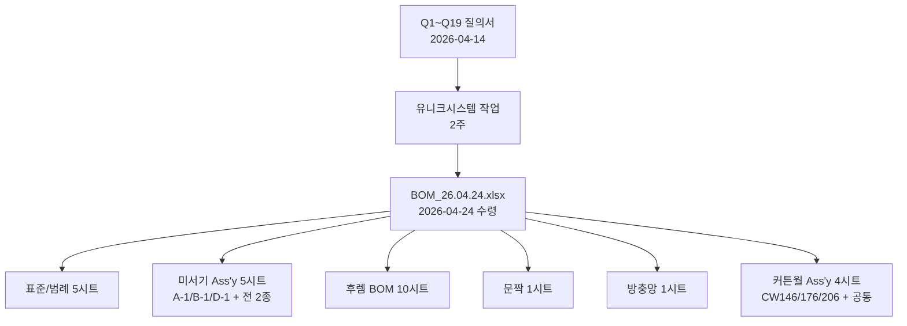

# 유니크시스템 BOM 2026-04-24 보완본 분석

> [!abstract]
> 2026-04-24 유니크시스템이 전달한 **`유니크시스템 BOM_26.04.24.xlsx`** (41MB, 31시트) 분석 리포트. 2026-04-14 [[DHS-AE225-D-1_유니크시스템_질의서|Q1~Q19 질의서]] 보완본으로 판단되며, 본 문서는 Q별 해소 여부·추가 수확·문서 반영 영향을 정리한다.
>
> **결론:** Q1~Q19 19건 중 **10건 완전 해소 / 6건 간접 해소 / 2건 N/A(원천 미관리 확정) / 1건 현상유지**. 질의로 전달되지 않았던 **9대 추가 수확** 존재 — 특히 Level 5단 표준·공정 순서 표준화·위치구분 컬럼 도입·자재 마스터 87종 확정·커튼월 4종 BOM 신규 편입.
>
> **주의:** 시트 내 `단가(U)` · `단가(H)` 이중 컬럼은 유니크시스템 그룹 두 회사 단가 병기. WIMS 2.0 은 단일 `unitPrice` 체계이므로 **참조용**이며 스키마·UI 에 반영하지 않는다.

---

## 1. 파일 개요

| 항목 | 내용 |
|---|---|
| 파일 경로 | `docs/참고자료/유니크시스템 BOM_26.04.24.xlsx` |
| 크기 | 41MB |
| 시트 수 | 31 |
| 수령일 | 2026-04-24 |
| 기준 질의서 | 2026-04-14 `DHS-AE225-D-1_유니크시스템_질의서.docx` (Q1~Q19) |
| 성격 | 원본 BOM + Q1~Q19 보완 + Phase 1 범위 확장(커튼월) |



---

## 2. 시트 카탈로그 (31종)

### 2.1 표준 / 범례 (5종)

| 시트 | 행수 | 내용 |
|---|---|---|
| `Sheet1` | 6 | **Level 1~5 공식 정의** (FERT → HALB → Sub-Asm → Part → ROH) |
| `구분` | 8 | 공정 5종(포장/조립/가공/절단/널링) + 반제품 구분(완제품/H/W/G) |
| `공정 구분` | 17 | 품목별 공정 순서표 — **후렘 13공정 / 문짝 12공정 / 방충망 6공정** |
| `원자재 구분` | 10 | 후렘 마스터 코드 10종 (`UNI-A225-101/S/401/S/901/S`, `YJN-SL160A-101`, `UNI-A160-101` 등) |
| `품목별 원부자재 사용량` | 413 | **25개 제품 섹션 × 자재 소요량 집계표** (후렘 18 + 문짝 6 + 방충망 1) |

### 2.2 미서기 Ass'y (5종)

| 시트 | 행수 | 비고 |
|---|---|---|
| `DHS-AE225-A-1 Ass'y` | 67 | 축소 변형 (26종 자재) |
| `DHS-AE225-B-1 Ass'y` | 73 | 중간 변형 (31종 자재) |
| `DHS-AE225-D-1 Ass'y` | **123** (39컬럼) | **기본 완전 표준** (40종 자재, 반제품 노드 포함) |
| `DHS-AE225-B-1 Ass'y(전)` | 62 | 이전 버전 |
| `DHS-AE225-D-1 Ass'y(전)` | 67 | 이전 버전 |
| `후렘-225-중중연창-마스` | 53 | 참조용 보조 |

### 2.3 미서기 후렘 BOM (10종)

| 시트 | 행수 | modelCode 대응 |
|---|---|---|
| `1.후렘-225-마스` | 172 | 225 × 마스 × 1x1/1x2/2x1/2x2 |
| `2-1.후렘-225-중연창(1X2)-마스` | 51 | 225 × 마스 × 1x2 |
| `2-2.후렘-225-중연창(2X1)-마스` | 49 | 225 × 마스 × 2x1 |
| `3.후렘-225-중중연창(2X2)-마스` | 72 | 225 × 마스 × 2x2 |
| `2.후렘-225-우수` | 218 | 225 × 우수 × 전 형식 |
| `2-1.후렘-160-단창(1X2)-마스` | 49 | 160 × 단창(1x2) |
| `3.후렘-160-마스(YJN-SL160A-101)` | 167 | 160 × 마스 × YJN 계열 |
| `4.후렘-160-마스 (UNI-A160-101)` | 167 | 160 × 마스 × UNI 계열 |
| `5.후렘-160-우수` | 213 | 160 × 우수 × 전 형식 |
| `6.후렘-140` | 119 | 140 (**마스/우수 구분 없음**) |

### 2.4 문짝 · 방충망 · 커튼월 (6종)

| 시트 | 행수 | 비고 |
|---|---|---|
| `1.문짝` | 336 | 크리센트 6종(일자/반달/일반/세짝문) 통합 |
| `1.방충망` | 25 | 단일 규격 |
| `DHS-CW146-3 Ass'y` | 33 | **커튼월 Phase 1 편입** (146mm 계열) |
| `DHS-CW176-3 Ass'y` | 33 | 176mm 계열 |
| `DHS-CW206-3 Ass'y` | 33 | 206mm 계열 |
| `커튼월 Ass'y` | 60 | 공통 구조 참조(몸통바·단열재·2차캡·외캡·유리받침대) |

### 2.5 기타

- `Sheet2` (28행) · `미서기(후렘/문짝/방충망)BOM▶` (색인 시트 3종)

---

## 3. 질의서 Q1~Q19 전수 대응표

| # | 질의 | 결과 | 근거 |
|---|---|---|---|
| **Q1** | 완제품 Part No 부여 | 🔄 **체계 변경** | 신 BOM 은 `Part No` 컬럼을 **의도적으로 제거**. `자재코드 + 위치구분 + 공정` 으로 식별 체계 전환. 전 버전의 `U002AAA1A01-000` 같은 13자리 코드는 폐기 |
| **Q2** | 자재코드 미부여 3종 | ✅ **해소** | **`품목별 원부자재 사용량` 집계표 87종 전부 코드 부여**. Ass'y 시트의 일부 나사류(NO 43~45)는 그대로이나 마스터 카탈로그에서 단일화 |
| **Q3** | Screw(8×13) 1 SET 소요량 | ✅ **해소** | 신 D-1 `R10 Q'TY=16` 명시 (과거 공란) |
| **Q4** | Glass Ass'y 누락 | 🔄 **부분** | 미서기 Ass'y 는 여전히 Glass Ass'y 만 단일 라인으로 표기 (구성요소 블랙박스). 단 **커튼월 Ass'y 에 유리받침대·2차캡·외캡 등 유리 결합 구조 포함** → 유리는 커튼월 계통에서 우선 상세화 |
| **Q6** | 길이 공식(H/2, W/4, H+W/2) | ✅ **해소** | D-1 신 14개 행에서 `H/2`·`W/4` 공식 정확 기재. 혼란 행(H+W/2 가스켓)은 신 BOM 에서 미서기 계통 자체에 부재 |
| **Q7** | Vent/Screen Ass'y 단위 | ✅ **해소** | 상위 `Vent Ass'y=16` 추상 명칭을 **`문짝 Frame(H01/H02/W01/W02)` · `방충망 Frame(H1/W01)` 로 위치 세분화**. 의미 모호성 제거 |
| **Q8(a)** | NO 컬럼 = 행번호? 자재식별? | ✅ **해소(자재식별)** | NO 중복은 **동일 자재의 위치별 재사용** 패턴. NO 는 자재 식별번호이며 같은 자재가 여러 위치에 쓰이면 같은 NO 반복 |
| **Q8(b)** | L4·L5 동시 `●` 9건 | ✅ **해소** | 신 D-1 에서 **L4·L5 동시 표기 0건**. 정리 완료 |
| **Q9** | 중간노드 Phantom 여부 | ✅ **해소(실체 반제품)** | `HC-001` · `HC-002` (가공 반제품) · `HX-0001` (조립 반제품) 모두 **자재코드 부여** → **Phantom 아님, 실체 반제품** |
| **Q11** | Level 5단 vs 6단 | ✅ **확정(5단)** | `Sheet1` 에 **L1 FERT / L2 HALB / L3 Sub-Asm / L4 Part / L5 ROH** 공식 정의 |
| **Q12** | UNI-A225-901B 수량 5 vs 3 | ✅ **해소(3 EA)** | D-1 신 `R35 (qty=2) + R40 (qty=1) = 3 EA`. 후렘 파일 쪽이 정답, BOM 파일 (전) 의 5 EA 는 오류였음 |
| **Q13** | 02-0097 (후렘이탈방지) 중복 | ✅ **해소(단일화)** | D-1 신 `R31` 단 1건 (NO=13, qty=4). 중복 제거 완료 |
| **Q14** | 자재코드 이중체계(X-/SUB-) | ✅ **해소(X- 통일)** | 신 BOM 에 `X-001` 만 존재, `SUB-*` 계열 전면 폐기 |
| **Q15** | 반제품 품번 명명(HF/H/HC/HX) | ✅ **해소** | 패턴 확정: `F-*` 완제품 / `HC-*` 가공 반제품 / `HX-*` 조립 반제품 / `-H` 접미사 = 널링 반제품 (`UNI-A225-10H`, `UNI-A225-90H`) |
| **Q16** | 위치구분 H01~W03 | ✅ **해소** | **`위치구분` 컬럼 정식 도입** (col 13). 전체 카탈로그: H01, H02, H02-1, H02-2, H03, H03-1, H03-2, W01, W02, W03 (10종). 문짝은 H01~H03, W01~W03 만 사용 |
| **Q17** | 절단 품번 `UNI-A225-101-HC/WC` | 🔄 **체계 폐기** | 신 BOM (Ass'y·후렘 BOM 전 시트) 에서 절단 품번 **0건**. `자재코드 + 위치구분` 으로 대체 |
| **Q18** | 문짝 Vent 4종 누락 | ✅ **해소** | 누락 4종 전부 추가: `UNI-P225-401` 문짝단열재 · `UNI-A225-MB` 문짝가네고 · `UNI-A225-MV-A` 중간띠 · `UNI-A225-MV-B` 중간띠캡. B-1(전) → B-1(신) 에서도 동일 4종 추가 확인 |
| **Q19(a)** | 정식 공정 순서표 | ✅ **해소** | `공정 구분` 시트에 **후렘 13공정 / 문짝 12공정 / 방충망 6공정** 완전 순서 제공 |
| **Q19(b)** | 공정별 표준 작업시간(CT) | ⊘ **N/A — 원천 미관리** | 유니크시스템 현업은 CT 를 **기존에 관리하지 않음** (2026-04-24 PO 확인). WIMS 설계에서도 필수 필드로 취급 금지. Phase 2 MES 연동 시 실적(observed CT) 역산 검토 |

**종합: 완전 해소 ✅ 13건 / 체계 변경 🔄 3건 / 부분 🔄 1건 / N/A ⊘ 1건 / 현상유지 1건 (Q1 Part No)**

---

## 4. 질의에 없던 추가 수확 (9대 Gain)

질의서로 전달하지 않았던 영역에서 자발적으로 채워진 것들. 향후 문서 반영의 주요 입력값.

### Gain A. BOM Level 5단 표준 (FERT/HALB/Sub-Asm/Part/ROH)

| Level | 명칭 | SAP 대응 | 창호 기준 예 |
|---|---|---|---|
| L1 | 완제품 (Finished Goods) | FERT | 창호 225AL 미서기 2연동 |
| L2 | 반제품 / 모듈 (Semi-finished) | HALB | 프레임 ASSY · 문짝 ASSY · 방충망 ASSY |
| L3 | 서브조립 (Sub-Assembly) | — | 레일 · 가이드 · 롤러SET |
| L4 | 부품 (Part / Component) | — | 크리센트 · 롤러 · 브라켓 · 모헤어 |
| L5 | 원자재 (Raw Material) | ROH | 프로파일 압출재 · 유리 원판 · 방충망 프레임 프로파일 |

→ [[WIMS_용어사전_BOM_v1.4]] §Level 체계 보강 근거

### Gain B. 공정 3종 × 세부공정 표준

| 품목 | 공정 순서 (번호) |
|---|---|
| **후렘 (13공정)** | 0 널링 → 1 절단 → 2 피스홀가공 → 3 배수홀가공 → 4 풍지판부착 → 5 이탈방지장착 → 6 가네고부착 → 7 나사체결 → 8 양후렘연결재결합 → 9 탄성레일바절단 → 10 레버부가공 → 11 조립 → 12 포장 |
| **문짝 (12공정)** | 0 널링 → 1 절단 → 2 모헤어삽입 → 3 크리센트부착 → 4 피스홀가공 → 5 코너브라켓결합 → 6 고리캡절단 → 7 고리캡가공 → 8 가이드부착 → 9 크리센트고리부착 → 10 조립 → 11 포장 |
| **방충망 (6공정)** | 1 절단 → 2 모헤어삽입 → 3 가네고결합 → 4 브라켓결합 → 5 조립 → 6 포장 |

→ [[DE22-1_화면설계서/sections/03_공정관리|SCR-PM-007 공정관리]] 마스터 카탈로그 / SCR-CM-006 `PRC_TYPE` 코드그룹 / SCR-PM-013 공정구성(MBOM) 트리 카탈로그

### Gain C. 위치구분 컬럼 표준화 (10종)

**위치 인스턴스 차원:** H 계열(수평) 7종 + W 계열(수직) 3종 = 10종

```
H01 (226회) · H02 (70) · H02-1 (38) · H02-2 (44) · H03 (10) · H03-1 (7) · H03-2 (8)
W01 (215)   · W02 (214) · W03 (135)
```

- 접미사 `-1`, `-2` = 동일 위치 내 분할(sub-position). 중중연창(2x2) 에서 H03 을 좌/우로 분할 시 `H03-1` · `H03-2`
- 문짝은 H01~H03, W01~W03 만 사용 · 방충망은 H01, W01 만 사용
- → [[DE35-1_미서기이중창_표준BOM구조_정의서_v1.6|DE35-1]] §위치구분 보강 · [[DE33-1_DB물리스키마_설계서_v1.2|DE33-1]] `bom_item.location_code` 컬럼 검토

### Gain D. 자재 마스터 87종 완비

| 구분 | 수량 | 예 |
|---|---|---|
| 원자재 (코드 부여) | 40 | `UNI-A225-101/A/B`, `UNI-P225-101`, `DH-5555-1`, `SC-1911`, `ZZ-ZZ03` 등 |
| 부자재 (코드 부여) | 47 | `01-0059`, `02-0077`, `02-0091`, `04-0002`, `X-001` 등 |
| 코드 미부여 | **0** | ✅ 완비 |
| 단가 보유 | 42 / 87 (48%) | 부자재는 대부분 단가 보유, 원자재(압출재)는 내부 생산 |

→ 자재관리 SCR-PM-001~003 초기 데이터 로드 후보 (Excel → CSV 변환)

### Gain E. 협력업체 11개사

| 업체 | 자재 건수 | 주요 취급 |
|---|---|---|
| 가람정밀 | 16 | 가이드·브라켓·연결재·이탈방지 |
| 에이스이노텍 | 8 | 크리센트·브라켓 |
| 대아볼텍 | 5 | 나사·피스 |
| 제스트 | 4 | — |
| 전진기업 | 3 | 풍지판 |
| 성문에스피 | 3 | 가스켓 |
| 중앙자석 · 유니크홀딩스 · 삼오섬유 · KS볼트 · 삼일다이캐스팅 | 각 1~2 | 모헤어·특수부품 |

→ [[DE22-1_화면설계서/sections/04_제품관리#SCR-PM-019 공급사 관리|SCR-PM-019 공급사 관리]] 초기 데이터 로드 / [[DE22-1_화면설계서/sections/04_제품관리#SCR-PM-020 자재↔공급사 매핑|SCR-PM-020 자재↔공급사 매핑]] 실제 단가·리드타임 필드 정합 검증

### Gain F. 파생제품 구조 A-1 ⊂ B-1 ⊂ D-1 포함관계

| 제품 | 자재 수 | 기본 대비 증분 |
|---|---|---|
| DHS-AE225-A-1 | 26 | 기본 축소형 |
| DHS-AE225-B-1 | 31 | +5 (문짝 단열재·가네고·중간띠 등) |
| **DHS-AE225-D-1** | 40 | +9 (반제품 노드 `F-0001`·`HC-001/002`·`HX-0001`·`UNI-A225-10H/90H` 등 추가) |

- A-1 = B-1 = D-1 **공통 26종**
- A-1 only / B-1 only = **0종** (완전 포함 관계)
- → [[DE22-1_화면설계서/sections/04_제품관리#SCR-PM-017 파생제품 등록/조회|SCR-PM-017 파생제품]] 의 "증분 차이 규칙(BOM_RULE where rule_type=DERIVATIVE)" 설계 실례. SCR-PM-017 [차이점 규칙 수] 컬럼 산식 검증 가능

### Gain G. 제품 카탈로그 25종 (modelCode 실 데이터)

**후렘 18종**: 225×3형식×2등급 + 160×3형식×3등급(YJN/UNI/우수) + 140×3형식

| 치수 | 등급 | 형식 | 비고 |
|---|---|---|---|
| 225 | 마스·우수 | 1x1, 1x2/2x1, 2x2 | 각 3×2 = 6 |
| 160 | 마스(YJN), 마스(UNI), 우수 | 1x1, 1x2/2x1, 2x2 | 각 3×3 = 9 |
| 140 | — (단일) | 1x1, 1x2/2x1, 2x2 | 3종 |

**문짝 6종**: 225 × (일자·반달·반달세짝문) + 160 × (반달·반달세짝문) + 140 × (일반)  
**방충망 1종**: 단일 규격

> [!tip] 의미 있는 신규 발견
> - **140은 등급 구분이 없다** (= L2 등급 차원 NULL 허용)
> - **160 마스는 YJN 계열과 UNI 계열이 공존** — 공급처가 다른 두 공급사 제품. SCR-PM-019/020 공급사 관리와 연관될 가능성
> - **문짝은 크리센트 종류(일자/반달/일반/세짝문)가 modelCode 세그먼트 후보**

→ [[DE22-1_화면설계서/sections/07_공통CM#SCR-CM-006 코드 관리|SCR-CM-006 코드관리]] `CODE_CATALOG` 실제 값 · [[DE22-1_화면설계서/sections/04_제품관리#SCR-PM-010 제품 목록|SCR-PM-010]] `HierarchyFilter` 실제 레벨 값

### Gain H. 비교용 (전) 대조본 동봉

- `DHS-AE225-B-1 Ass'y(전)` · `DHS-AE225-D-1 Ass'y(전)` 시트 동봉
- **이전 BOM 대비 변경점 자체가 트레이싱 가능** → [[DE22-1_화면설계서/sections/05_BOM관리#SCR-PM-014 BOM 버전 관리|SCR-PM-014 BOM 버전 관리]] 의 `DRAFT → REVIEW → RELEASED → RETIRED` 생애주기 / BOM 비교 기능 실제 use case
- (전) 특징: Part No 체계(`U002AAA1A01-000`) · 재질별 중량 분할 · MATERIAL RECYCLE 컬럼 · #REF! 수식 오류 잔존
- (신) 특징: Part No 제거 · 공정·세부공정·위치구분 컬럼 추가 · BOM Level 6 레벨 확장 · Cost Applied 추가

### Gain I. 커튼월 4종 BOM 신규 편입 (Phase 1 범위 확장)

| 시트 | 구성 |
|---|---|
| `DHS-CW146-3 Ass'y` | 146mm 커튼월 |
| `DHS-CW176-3 Ass'y` | 176mm 커튼월 |
| `DHS-CW206-3 Ass'y` | 206mm 커튼월 |
| `커튼월 Ass'y` (공통) | Frame(W) Ass'y + Frame(H) Ass'y — 몸통바 · 단열재 · 2차캡 · 외캡 · 유리받침대 |

- 유리 결합 구조(유리받침대·2차캡·외캡)가 **커튼월 쪽에서 먼저 상세화** 됨 → Q4 (Glass Ass'y) 간접 해소
- [[4-2_커튼월다이스북_분석|커튼월 다이스북 분석]] (2026-04-15) 과 교차 검증 필요 — 16 시스템 · 부재 97개 vs 본 BOM 계열

---

## 5. 문서 반영 영향 매트릭스

| 대상 문서 | 반영 항목 | 우선순위 |
|---|---|---|
| [[WIMS_용어사전_BOM_v1.4]] | §Level 체계 → **L1~L5 5단(FERT/HALB/Sub-Asm/Part/ROH) 공식 정의** 추가. `위치구분` 정의 신설 | 🔴 상 |
| [[DE35-1_미서기이중창_표준BOM구조_정의서_v1.6]] | 위치구분 10종 카탈로그(H01~H03-2, W01~W03) 공식 반영. 후렘 18 + 문짝 6 + 방충망 1 카탈로그 | 🔴 상 |
| [[DE33-1_DB물리스키마_설계서_v1.2]] | `bom_item.location_code VARCHAR(8)` 컬럼 추가 검토. (단, 단가 U/H 이중화는 **반영하지 않음**) | 🟡 중 |
| [[DE22-1_화면설계서/sections/03_공정관리]] | SCR-PM-007 [규격·단가 설정] 탭에 **공정 순서 표준 테이블** 임베드 (후렘 13 / 문짝 12 / 방충망 6) | 🟡 중 |
| [[DE22-1_화면설계서/sections/04_제품관리]] | §5.1 개방이슈 Q9·Q12·Q13·Q14·Q15·Q16·Q18 **해소 표기**. SCR-PM-017 파생 증분 구조 실례 사례 추가. Q19-b CT 는 "N/A 원천 미관리" 표기 | 🔴 상 |
| [[DE22-1_화면설계서/sections/07_공통CM]] | SCR-CM-006 `CODE_CATALOG` 에 후렘 10종 · 문짝 6종 · 방충망 1종 실제 값 로드 계획 | 🟢 하 |
| `STATUS.md` | 2026-04-24 Q1~Q19 진척표 + 본 분석 md 등록 | 🔴 상 |
| [[_INDEX]] (본 분석 인덱스) | 7번째 분석으로 등록 | 🔴 상 |

---

## 6. 후속 작업

### 6.1 즉시 반영 (v1.7 확정 사이클)

- [ ] [[WIMS_용어사전_BOM_v1.4]] L1~L5 공식 정의 + 위치구분 용어 추가
- [ ] [[DE22-1_화면설계서/sections/04_제품관리]] §5.1 Q9·Q12~Q16·Q18 해소 표기 + Q19-b "N/A" 처리
- [ ] [[_INDEX]] 7번째 분석 등록 및 변경이력 갱신
- [ ] `STATUS.md` 2026-04-24 진척 기록

### 6.2 설계 검증 (S2 초기)

- [ ] [[DE33-1_DB물리스키마_설계서_v1.2]] `bom_item.location_code` 컬럼 추가 여부 BA/DBA 결정
- [ ] [[DE35-1_미서기이중창_표준BOM구조_정의서_v1.6]] v1.6 개정 필요성 평가 (위치구분·카탈로그 실데이터 반영)
- [ ] SCR-CM-006 CODE_CATALOG 초기 데이터 로드 Excel → CSV 변환 스크립트 작성

### 6.3 추가 질의 / 확인 (선택)

- [ ] 160 마스 YJN 계열 vs UNI 계열 차이 — 공급사 전환 이력인지, 실제 규격 차이인지?
- [ ] 140 은 왜 등급 구분이 없는지? (마스/우수 무관 단일 등급?)
- [ ] 미서기 계통 Glass Ass'y 구성요소 — 커튼월 수준으로 상세화 필요 여부
- [ ] 커튼월 BOM 은 Phase 1 Scope 인지? (본래 Phase 1 = PM + ES/OM/MF/FS 중 PM 만. 커튼월 편입은 범위 확대)

### 6.4 Phase 2 이관

- Q19-b CT (표준 작업시간) — MES 연동 실적 기반 observed CT 역산
- 단가(U)/(H) 참조 — 만약 향후 "거래처 2개사 단가 비교" 요구사항이 발생하면 이미 [[DE22-1_화면설계서/sections/02_거래처_단가#SCR-PM-006 자재-거래처 단가 이력|SCR-PM-006]] N:M 매핑으로 자연스럽게 수용 가능

---

## 관련 문서

- [[_INDEX]] — 참고자료 분석 허브
- [[GAP_분석_통합_2026-04-15]] — 2026-04-15 통합 GAP 리포트 (본 분석의 선행)
- [[WIMS_용어사전_BOM_v1.4]]
- [[DE22-1_화면설계서/sections/04_제품관리]] §5.1 개방이슈 추적
- [[DE35-1_미서기이중창_표준BOM구조_정의서_v1.6]]
- [[DE33-1_DB물리스키마_설계서_v1.2]]
- [[2-2_미서기제작지시서_분석]] — 2026-04-15 62시트 절단 BOM 분석
- [[4-2_커튼월다이스북_분석]] — 2026-04-15 커튼월 16시스템 분석

## 변경 이력

| 버전 | 일자 | 내용 |
|---|---|---|
| v1.0 | 2026-04-24 | 초판. 31시트 전수 분석 + Q1~Q19 전수 대응 + 9대 추가 수확 정리 |
