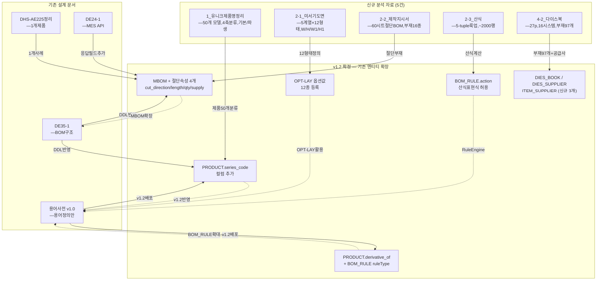

> [!abstract]
> **2026-04-15 에이전트 팀이 유니크시스템 원본 5건을 신규 분석**한 결과, 기존 BOM 문서(용어사전, DHS-AE225-D-1 정리, 설계 문서)와의 **충돌 3건, 누락 7건, 용어 정합성 미흡 5건, 엔티티 모델 보강 필요 4건**이 식별됨. 특히 **(1) 제품 50모델 초기 데이터 미이관 (P0), (2) 절단 표현↔산식 1:1 대응 구조 미설계 (P0), (3) 다이스북 부재코드 97개 통합 전략 부재 (P0)** 가 가장 크리티컬.

> [!warning] 2026-04-16 REVISION (v1.2 반영)
> 본 문서 초안(2026-04-15)은 [[WIMS_용어사전_BOM_v1.1]] 기준으로 **`CuttingBOM`·`ProductSeries`·`LayoutType`·`DerivativeProduct` 4개 엔티티 신설**을 제안했다. 이후 설계 검토에서 **해당 개념들이 모두 기존 엔티티(PRODUCT 속성 / OPTION_VALUE / BOM_RULE / MBOM) 확장으로 표현 가능**하다고 판단, [[WIMS_용어사전_BOM_v1.2]] 에서 엔티티 신설안을 철회했다.
>
> - `CuttingBOM` 엔티티 → **MBOM 속성 확장** (`cutDirection`, `cutLengthFormula`, `cutQtyFormula`, `supplyDivision`)
> - `LayoutType` 엔티티 → **기존 `OPT-LAY` 옵션값** (부가속성은 `OPTION_VALUE.metadata` JSON)
> - `ProductSeries` 엔티티 → **`PRODUCT.series_code` 컬럼 1개**
> - `DerivativeProduct` 엔티티 → **`PRODUCT.derivative_of` / `derivative_kind` + `BOM_RULE` 로 표현**
> - `Formula` 마스터 → **`BOM_RULE.action` 표현식 + MBOM `*_formula` 필드**로 분산
>
> §4(엔티티 모델 보강) 은 v1.2 관점으로 아래 §4′ 에서 다시 작성. §7 우선순위·§📝 다음 단계도 v1.2 반영. §1~§3 의 충돌·누락·용어 관찰 자체는 유효하므로 원문 유지.

---

## 🔍 분석 범위 및 방법론

### 분석 대상 신규 자료 (5건)
1. **1_유니크제품명정리_분석.md** — 제품 50모델(미서기 20+커튼월 30), 4축 분류, 기본-파생 관계
2. **2-1_미서기도면_분석.md** — 60p PDF, 5계열×12형태, W/H/W1/H1 치수 변수
3. **2-2_미서기제작지시서_분석.md** — 62시트 절단 BOM, 알루미늄 부재 16종, `CuttingBOM` 엔티티 제안
4. **2-3_미서기산식_분석.md** — 산식 언어 구조, 5-tuple 룩업 키, ~2,000행 테이블화 가능
5. **4-2_커튼월다이스북_분석.md** — 27p 다이스북, 16시스템, 부재코드 97개

### 기존 문서 (검증 대상)
- **[[WIMS_용어사전_BOM_v1.0.md]]** — BOM 용어 정의 (v1.0, 2026-04-14 기준)
- **[[DHS-AE225-D-1_BOM_정리.md]]** — DHS-AE225-D-1 1개 제품만 정리
- **[[DHS-AE225-D-1_BOM_정리_보완.md]]** — 보완본 (정정 C1~C12 적용)
- **[[DE35-1_미서기이중창_표준BOM구조_정의서_v1.4.md]]** — Level 체계, EBOM/MBOM/Config 구조
- **[[STATUS.md]]** — 프로젝트 현황 (Gate 1 진입, 04.19)

---

## 1️⃣ 충돌 식별 (CONFLICT)

### C1. 제품 분류 축 — 기존 문서와 신규 분석 카테고리 체계 차이

#### 상세 내용

| 항목 | 기존 (DE35-1) | 신규 (1_유니크제품명정리) | 충돌 정도 |
|------|---|---|---|
| **분류축** | 단일 BOM 모델(DHS-AE225-D-1) 중심 | 4축 카테고리(대분류 > 계약구분 > 유리사양 > 치수) | 🔴 구조적 |
| **상품 수** | 1개 제품 정리 | 50개 모델 카탈로그 | 🟠 범위 |
| **기본/파생 개념** | 미정의 (질의 Q 미회신) | **기본↔파생 1mm 차이 쌍 관계** 정의됨 | 🟠 개념추가 |
| **프로파일 코드** | `UNI-A225-101` 단순 참조 | **제작도명칭 `19년-225AL-마스1`** 버전 포함 | 🟡 세부화 |

#### 근거
- 기존: DE35-1 "§3.2 BOM 계층 구조" — Level 체계만 정의, **제품 카탈로그 다중축 필요 미언급**
- 신규: 1_유니크제품명정리 "§5-1 제품 분류 축" — **최소 4단계 계층 필수** 명시
- 영향: PM(제품관리) 서브시스템의 ProductCategory 엔티티가 기존 1단계(DHS-AE225-D-1)만 고려 → 4단계 확대 필요

#### 보강 제안
> [!tip] C1 해결 방안
> **DE35-1 부록 E (신규 추가)** 로 "제품 분류 계층 확장" 섹션 작성:
> - 대분류(미서기/커튼월) → 계약구분(마스/우수) → 유리사양(단창/이중창/복층) → 치수(160/225/226/206/…)
> - ProductCategory 엔티티 4단계 설계
> - 코드 생성 규칙(3-1의 모델명 디코딩) ↔ 카테고리 역매핑 로직

---

### C2. 우수 제품(U-P-*) BOM 누락 — 20개 모델 데이터 미확보

#### 상세 내용

| 제품군 | 기존 BOM | 신규 분석 |
|---|---|---|
| **마스 미서기** | `DHS-AE225-D-1` 1개만 정리 | 12개 모델(160/225/226 각 기본+파생) |
| **우수 미서기** | ❌ **미작성** | 8개 모델(`U-P-SM225-D` 등) |
| **마스 커튼월** | ❌ 미정리 | 13개 모델 |
| **우수 커튼월** | ❌ 미정리 | 17개 모델 |

#### 근거
- STATUS.md "§ BOM 분석 · 질의 상태" — "원본 분석: DHS-AE225-D-1_BOM_정리.md" **단 1개 제품**만 확보
- 1_유니크제품명정리 "§2.2 미서기 전체 제품 목록" — **우수 8개(U-P-SM*) 모두 미정리**
- 커튼월도 마찬가지: 마스/우수 합 30개 → 기존 문서 0개

#### 영향
- **초기 데이터 이관 불가** — WIMS 제품관리 시스템 오픈 시 20개 모델 카탈로그 입력 전략 부재
- **제작지시서 자동생성** — 우수 제품의 CuttingBOM 공식 불명확 (시리즈별 옵셋 상수 다름)

#### 보강 제안
> [!warning] C2 해결 방안 (P0 — 차단 이슈)
> 1. **우수 제품 BOM 신규 정리** — 유니크시스템 측에 우수 제품 BOM 도면 5건 추가 요청
>    - U-P-SM225-D 등 8개 미서기 + 17개 커튼월 (총 25개)
> 2. **임시 전략** — Gate 1 확정 전 마스 제품(20개)만 초기 로드, 우수는 Phase 2 예정 명시
> 3. **WIMS_용어사전** 추가 — "우수제품(Premium)" 카테고리 정의 + 속성 명시

---

### C3. 산식 언어와 절단BOM 구조의 불일치 가능성

#### 상세 내용

| 항목 | 2-2_제작지시서 | 2-3_산식 | 관계 |
|---|---|---|---|
| **절단길이 결정** | 절단 리스트 직접 제시(160-우수-1X1 등 60개 시트) | 산식 언어로 정의(~2,000행 공식 테이블) | ❓ **1:1 대응 미명시** |
| **입력 변수** | W, W1~W3, H, H1~H3 | 5-tuple (series, layoutType, part, dimKey, rule#) | ⚠️ 차원 상이 |
| **옵셋 상수** | "절단 옵셋 패턴 (역산 관찰값)" 예: H-74mm(160계) | 공식 내 상수값 직접 인용 안됨 | ❓ 신뢰도 |

#### 근거
- 2-2 "§4.4 절단 길이 변화 규칙" — 수작업 역산 관찰값 (정확한 공식은 2-3 참고 필수라고 명시)
- 2-3 "§1.2 시트 구성" — 60개 제품 타입 별도 관리하되, 절단BOM과의 연결점 미언급
- DE35-1 "§6.2 BOM 버전 관리" — **CuttingBOM 엔티티 설계 없음** (절단 공식 처리 방식 미정)

#### 영향
- **MF(제조관리) 시스템 설계 충돌** — CuttingInstruction 자동생성 로직이 2-2 방식(직접 조회)과 2-3 방식(산식 계산) 중 선택 미정
- **데이터 불일치 위험** — 2개 파일이 독립적으로 관리되면 장기 버전 관리 곤란

#### 보강 제안
> [!warning] C3 해결 방안 (P0 — 설계 이슈)
> 1. **CuttingBOM 엔티티 신규 정의** ([[DE35-1]] 부록 추가)
>    ```
>    CuttingBOM
>      ├─ seriesCode
>      ├─ layoutCode
>      ├─ itemCode (부품코드)
>      ├─ dimKey (W, H, W1, H1, …)
>      ├─ formula (산식 언어 5-tuple 참조)
>      ├─ offsetConstant (시리즈별 옵셋: -74mm 등)
>      └─ qtyPerSet
>    ```
> 2. **2-3 산식 테이블화** — 2,000행 규칙을 RuleEngine 테이블로 정규화
> 3. **2-2 ↔ 2-3 매핑 검증** — 60개 시트별 절단길이를 2-3 산식으로 역산 검증

---

## 2️⃣ 누락 식별 (MISSING)

### M1. 제품 50개 모델 초기 데이터 이관 전략 부재 (P0)

#### 상세 내용
- **신규 발견**: 1_유니크제품명정리 — 미서기 20개 + 커튼월 30개 **총 50개 모델** 카탈로그
- **기존 문서 현황**: 
  - WIMS_용어사전: 제품 카탈로그 초기화 전략 언급 안 함
  - DHS-AE225-D-1_BOM_정리: 1개 제품만 정리
  - DE35-1: 개념적 BOM 구조만 → 초기 로드 데이터 누락
  - STATUS.md: "원본 분석: DHS-AE225-D-1" 언급, 추가 50개 모델 로드 계획 없음

#### 영향
- **Gate 1 (04.19) 위험** — PM(제품관리) 서브시스템이 제품 마스터 데이터 없이 오픈 불가능
- **테스트 불가** — 통합 테스트 시 대표 제품 선정 불명확
- **초기 데이터 부하 시간** — 수작업 입력 시 프로젝트 일정 밀려날 수 있음

#### 근거 자료 위치
- `1_유니크제품명정리_분석.md` — "§2. 시트 상세 정리", "§3. 제품 코드 체계" → 50개 모델 목록 + 코드 규칙 완성
- `1_유니크제품명정리_분석.md` — "§5-3 모델 코드 속성으로 분해 가능한 항목" → 자동 파싱 로직 설계 가능

#### 보강 제안
> [!warning] M1 해결 방안 (P0 — 차단)
> 1. **신규 문서 작성**: `docs/참고자료/WIMS_제품초기데이터_로드계획_v1.0.md`
>    - 50개 모델별 코드 자동 파싱 규칙 (3-1 네이밍 패턴 활용)
>    - ProductCategory 계층 INSERT 순서 정의
>    - ProductAttribute (브랜드, 제품유형, 치수, 계약구분 등) 매핑
>    - 기본/파생 제품 쌍 관계 INSERT 로직
> 2. **스크립트 생성**: `scripts/initial_product_load.sql` (또는 JSON)
>    - 50개 모델을 SELECT/INSERT 가능한 형식으로 정규화
> 3. **일정 조정**: AN22-1 데이터분석 문서에 "제품초기로드" 태스크 추가 (4.16~4.18)

---

### M2. 부재코드(itemCode) 97개 통합 관리 전략 부재 (P0)

#### 상세 내용
- **신규 발견**: 4-2_커튼월다이스북 — 16시스템 별 **부재코드 97개** 명시
  - 예: `DH-5555-1`(가네고), `DH-5555-2`, `DH-5555-3`… 계열별 변형
- **기존 문서 현황**:
  - WIMS_용어사전 "§1 식별자" — `itemCode` 정의만, 범위/버전 관리 미언급
  - DHS-AE225-D-1_BOM_정리_보완 "§2. 정규화 BOM" — 30개 부재만 사례 제시
  - 용어사전 "§1 식별자" — "자재·공정·조립체 유일 코드. 접두: PRD/ASY/FRM/GLS/HDW/SEL/SCR/MAT" → **다이스북 부재코드의 분류체계 미정의**

#### 영향
- **부재 마스터 데이터 불완정** — 97개 부재 중 몇 개가 실제 ITEM 엔티티에 들어가야 하는지 불명확
- **커튼월 BOM 설계 불가** — 다이스북 시스템별 부재 구성이 산식/절단지시서와 어떻게 매핑되는지 미정

#### 근거 자료 위치
- `4-2_커튼월다이스북_분석.md` — "§3. 부재코드 정리", "§4. 계층별 부재 분류" → 97개 목록 + 코드 패턴

#### 보강 제안
> [!warning] M2 해결 방안 (P0 — 차단)
> 1. **부재 마스터 데이터 통합** — `docs/참고자료/부재마스터_97개_정규화_v1.0.md` 신규 작성
>    - 다이스북 97개 부재 목록 → itemCode + itemName + profile 자동 매핑
>    - 접두 규칙 재정의: 기존 6종(PRD/ASY/FRM/GLS/HDW/SEL/SCR/MAT) vs 다이스북 커스텀 코드(DH-####) 통합 전략
>    - 시스템별(16개) × 부재별 BOM 구성표
> 2. **ITEM 엔티티 확대** — DE35-1에 "부재 분류 확장" 섹션 추가
> 3. **다이스북 ↔ 절단BOM 매핑** — 미서기 16종 부재와 커튼월 97개 부재의 중복 제거 및 통합 코드체계

---

### M3. 계열(Series) 개념 미정의 — 제품 계층과 부재 계층 분리 불명확

#### 상세 내용
- **신규 발견**: 1_유니크제품명정리 — "계약구분(마스/우수)" + "제품유형(AE/WA/CW)" = **계열 개념**
  - 2-2_제작지시서: "시리즈 코드" 정의 (`160-우수`, `225-마스` 등) → **제품 라인업 수준**
  - 2-1_미서기도면: "5계열×12형태" → **도면 기준 체계**
  
- **기존 문서 현황**:
  - WIMS_용어사전: 용어 정의 없음
  - DE35-1 "§2.1 창호 기본 구조 용어" — 창호 부품 용어만 정의, 제품계열/시리즈 미포함
  - DHS-AE225-D-1_정리: "시리즈 코드" 참조도 한국어 정의 없음

#### 영향
- **PM 제품분류 체계와 MF 제작지시서 체계 용어 불일치** 
- **CuttingBOM에서 seriesCode 참조 시 혼동** — "160-우수" vs "UNI-A160" vs "AE160" 중 어느 것이 canonical?

#### 보강 제안
> [!tip] M3 해결 방안 (P1 — 중요)
> **WIMS_용어사전 v1.1** 에 추가 섹션:
> ```
> | 표준명 | 정의 |
> |---|---|
> | 계열(Series) | 제품군(미서기/커튼월) + 계약구분(마스/우수) 조합. 예: "160-우수", "225-마스" |
> | 시리즈(ProductSeries) | 계열 + 연도(19년/20년/21년/24년형) 조합. 예: "225-마스-19년형" |
> | 기본제품 | 설계 기준 규격(225mm). 파생제품과 1mm 치수 차이. 예: DHS-AE225-D-1 |
> | 파생제품 | 기본제품 대비 1mm 축소(224mm). 설계도 동일, 부품코드만 상이. 예: UNI-AE224-D-S |
> ```

---

### M4. 산식 5-tuple 룩업 키의 테이블 정규화 미진행 (P1)

#### 상세 내용
- **신규 발견**: 2-3_미서기산식 — "산식 언어: 5-tuple (series, layoutType, part, dimKey, rule#)"
  - 원본 xlsx에서 ~2,000행의 IF/LOOKUP 함수 → 규칙 테이블로 테이블화 가능
  
- **기존 문서 현황**:
  - DE35-1: CuttingBOM 엔티티 정의 없음 (§1 개요)
  - DE24-1(MES API): "절단 길이 계산" 엔드포인트 미명시
  - WIMS_용어사전: "산식", "5-tuple" 용어 미정의

#### 영향
- **MES 연동 계산 로직 구현 지연** — MES가 절단길이 요청 시 WIMS가 산식을 재계산할 수 없음
- **데이터 검증 불가** — 60개 시트의 절단길이가 산식과 부합하는지 검증 불가능

#### 근거 자료 위치
- `2-3_미서기산식_분석.md` — "§4. 핵심 수식", "§5. 산식 테이블화 제안" → 2,000행 규칙 구조 예시

#### 보강 제안
> [!tip] M4 해결 방안 (P1 — 중요)
> 1. **신규 문서**: `docs/참고자료/절단산식_5tuple_규칙테이블화_v1.0.md`
>    - 원본 xlsx 2-3 시트의 IF/LOOKUP 함수 → CSV/JSON 규칙 테이블 추출
>    - 5-tuple 키 정의: `(series, layoutType, partCode, dimKey, ruleId)`
>    - 규칙별 오프셋 상수·공식 정규화
> 2. **DE24-1 MES API 확대**:
>    - `POST /api/external/v1/cutting/calculate` 엔드포인트 추가
>    - 입력: series, layoutType, partCode, dimW, dimH, dimW1…H3
>    - 출력: cutLength (mm), actualQty
> 3. **MF 시스템 설계 검증** — 계산된 절단길이를 WorkOrder 저장 전 검증 로직

---

### M5. 기본제품↔파생제품 BOM 변형 규칙 미설계 (P1)

#### 상세 내용
- **신규 발견**: 1_유니크제품명정리 — "기본제품과 파생제품은 **치수가 1mm 차이**나는 쌍"
  - 예: `DHS-AE225-D-1`(기본, 225mm) ↔ `UNI-AE224-D-S`(파생, 224mm)
  - **부품코드는 일부 상이** (예: `UNI-A225-101` vs `UNI-A224-*`)
  
- **기존 문서 현황**:
  - WIMS_용어사전 "§2 BOM 구성요소" — "BOM Rule" 정의 있음 (옵션별규칙), but 기본/파생 변형 미언급
  - DHS-AE225-D-1_정리: 1개 제품만 정리 → 파생 제품 BOM 비교 불가
  - DE35-1 "§3.2 BOM 계층" — Config(옵션) 기반 변형만 고려 (기본/파생 쌍 관계 미포함)

#### 영향
- **제품 2배 수관리 부담** — 기본+파생 각각 별도 BOM 설계 필요 vs 변형 규칙으로 자동 생성 가능 선택 미정
- **초기 데이터 이관 중복** — 50개 모델 중 25개는 기본, 25개는 파생 → 중복 입력 vs 자동 생성

#### 보강 제안
> [!tip] M5 해결 방안 (P1 — 중요)
> 1. **BOM_RULE 확대** (WIMS_용어사전 v1.1)
>    ```
>    BOM_RULE (기존: 옵션 기반)
>      + Variant BOM Rule (신규)
>        ├─ ruleType: 'DERIVATIVE' (기본→파생)
>        ├─ sourceProduct: DHS-AE225-D-1
>        ├─ targetProduct: UNI-AE224-D-S
>        ├─ dimOffset: -1 (mm)
>        └─ itemSubstitution [
>             { from: UNI-A225-101, to: UNI-A224-101 },
>             { from: UNI-A225-401, to: UNI-A224-401 }
>           ]
>    ```
> 2. **DE35-1 부록 추가** — "파생제품 BOM 생성 알고리즘"
>    - 기본제품 BOM 복사 + 부품코드 치수 세그먼트 -1 치환
>    - 절단길이 공식에서 W/H 파라미터 그대로 적용 (부품코드는 파생용으로)

---

### M6. 혼합 레이아웃(W4XH2 등) 정의 부재

#### 상세 내용
- **신규 발견**: 2-2_제작지시서 — "12개 레이아웃 타입" 명시
  - `W1XH1-정 / W1XH1-3편 / W1XH2-정 / … / W4XH2-정` (12가지)
  - **하지만 W4XH3, W6XH1 등 추가 형태도 이미지에 포함** (image6~image11)
  
- **기존 문서 현황**:
  - DE35-1: LayoutType 엔티티 미정의
  - WIMS_용어사전: "레이아웃", "형태" 용어 미정의
  - DHS-AE225-D-1_정리: 1개 제품만 → 다양한 레이아웃 미논의

#### 영향
- **MF 제작지시서 생성 시 레이아웃 선택 불명확** — 12가지 외 다른 형태 입력 가능한지 검증 불가
- **테스트 케이스 누락** — 시스템 테스트 시 W4XH3 등 극단 케이스 미포함

#### 보강 제안
> [!tip] M6 해결 방안 (P2 — 선택)
> **DE35-1 부록에 LayoutType 마스터 테이블 추가**:
> | layoutCode | gridW | gridH | is3Piece | imagePng | 비고 |
> |---|---|---|---|---|---|
> | W1XH1-정 | 1 | 1 | false | image1 | 기본 2편 |
> | W1XH1-3편 | 1 | 1 | true | image2 | W1 표기 |
> | W4XH2-정 | 4 | 2 | false | image7 | — |
> | W6XH1 | 6 | 1 | false | image9 | 참고형 |

---

### M7. 부자재(소모품) 23종 관리 전략 부재

#### 상세 내용
- **신규 발견**: 2-2_제작지시서 "§6. 부자재/소모품 목록" — 23종 소모품
  - 예: `02-0051`(탄성스프링), `04-0003`(6.7*7mm 모헤어), `ZZ-ZZ03`(방충망)
  - **단위 구분**: EA(개수) vs M(미터) vs 평(면적)
  
- **기존 문서 현황**:
  - WIMS_용어사전 "§1 식별자": itemCode 접두 8종 정의 (PRD/ASY/…) → 부자재 코드 분류 안 함
  - DHS-AE225-D-1_정리_보완 "§2.1~2.2" — 30개 부재 중 일부만 소모품 언급
  - 용어사전 "§3 MBOM 속성": `lossRate` 정의 있음, but 부자재별 loss 계산 미언급

#### 영향
- **부자재 수급 계획 불가** — 23종 소모품이 제품별/시리즈별 이량이 어떻게 다른지 미정의
- **원가 계산 부정확** — 손실률(lossRate)을 부자재별로 설정해야 하는지 불명확

#### 근거 자료 위치
- `2-2_미서기제작지시서_분석.md` — "§5.2, 5.3 대표 절단 리스트" 의 부자재 항목
- `2-2_미서기제작지시서_분석.md` — "§6. 부자재/소모품 목록", "§8.3 주요 설계 고려사항" → "부자재 vs 절단재 구분"

#### 보강 제안
> [!tip] M7 해결 방안 (P2 — 선택)
> 1. **WIMS_용어사전 v1.1 추가**: 
>    - itemCode 접두 8종 → 신규 추가 `CSM`(소비성자재)
> 2. **부자재 마스터 테이블** (`docs/참고자료/부자재_23종_마스터_v1.0.md`):
>    | itemCode | itemName | unit | series적용 | lossRate | 비고 |
>    |---|---|---|---|---|---|
>    | 02-0051 | 탄성스프링 | EA | 160-우수, 225-우수 | 0.05 | |
>    | 04-0003 | 6.7*7mm 모헤어 | M | 160-우수, 225-우수 | 0.1 | 길이자재 |
> 3. **MF 시스템**: 부자재 단위별 계산 로직 (EI 면적 환산, M→mm 변환 등)

---

## 3️⃣ 용어 정합성 (TERMINOLOGY)

### T1. "계열(Series)", "시리즈", "모델" 용어 정의 부재

| 용어 | 신규 분석 정의 | 기존 문서 상태 | 정합성 |
|---|---|---|---|
| **계열** | 제품군(미서기/커튼월) + 계약구분(마스/우수) | 미정의 | ❌ |
| **시리즈** | 계열 + 연도(19년/20년/21년/24년형) | 미정의 (용어사전 미언급) | ❌ |
| **모델** | 기본제품 (예: DHS-AE225-D-1) | 용어사전 미언급 | ❌ |
| **파생** | 기본제품 1mm 축소 (예: UNI-AE224-D-S) | 미정의 | ❌ |

**영향**: PM 문서 vs MF 문서에서 용어 혼동 → 개발팀 소통 비효율

**해결**: [[WIMS_용어사전_BOM_v1.0.md]] v1.1 에 §2 추가 — "제품계층 용어"

---

### T2. "CuttingBOM", "절단지시서", "제작지시서" 용어 중복/불일치

| 용어 | 의미 | 사용처 |
|---|---|---|
| **CuttingBOM** | 부품별 절단길이·수량 마스터(절단 지시용) | 2-2 분석에서 신규 제안 |
| **절단지시서** | 제품별 절단 리스트 출력물 | 2-2 문서 제목 |
| **제작지시서** | WorkOrder + 절단 라인항 | MF 시스템 설계 용어 미정 |

**영향**: 용어사전에 없어 코드 네이밍 혼동 (CuttingBom vs CuttingInstruction 엔티티 설계 곤란)

**해결**: 용어사전 v1.1 에 정의:
```
CuttingBOM — 부품별 절단길이·수량을 정의하는 마스터 데이터. 시리즈×레이아웃 복합키.
CuttingInstruction — CuttingBOM을 제품 치수(W/H)에 따라 계산한 실제 절단 지시 라인.
```

---

### T3. "다이스북(Die-cast Book)" 용어 미정의

| 용어 | 신규 분석 정의 | 기존 문서 |
|---|---|---|
| **다이스북** | 금형(die) 및 부재(profile) 규격·칫수를 나열한 부재 카탈로그 | 미언급 |
| **금형사** | 다이스북을 공급하는 업체 (부재/프로파일 제조사) | 용어사전 미언급 |
| **계통(System)** | 다이스북의 분류축 (16계통) | 용어사전 미언급 |

**영향**: 부재 마스터 데이터 입력 시 다이스북 출처 미명시 → 부재 버전 관리 불가

**해결**: 용어사전 v1.1:
```
다이스북 — 창호 부재(알루미늄 프로파일, 금속부품 등)의 설계도·칫수·공급사를 정리한 카탈로그.
           예: "커튼월 다이스북" (27p, 16시스템)
금형사 — 다이스북 부재를 제조·공급하는 외주 업체.
계통(System) — 다이스북 내 부재 분류 축. 창호 사양(크기/유리/방식)별로 16개 계통.
```

---

### T4. "손실률(lossRate)" 부재별 산식 미정의

| 항목 | 내용 |
|---|---|
| 기존 정의 (용어사전) | `lossRate: BigDecimal` (0.0~1.0) — 손실 비율 |
| 신규 발견 (2-2) | 부자재별 손실률: 모헤어(10%), 방충망가스켓(5%) 등 추정 |
| 문제 | **어느 부자재에 어떤 lossRate를 적용할지 미정의** |

**영향**: 원가 계산 및 수급 계획 부정확

**해결**: 부자재 마스터 테이블에 lossRate 컬럼 추가

---

### T5. "변형(Variant)" vs "파생(Derivative)" 용어 혼동

| 용어 | 의미 | 사용 맥락 |
|---|---|---|
| **Variant** | 옵션 선택에 따른 변형 (예: 색상, 유리종류) | WIMS_용어사전, DE35-1 |
| **파생(Derivative)** | 기본제품 치수 1mm 축소 (예: 225mm → 224mm) | 신규 분석(1_유니크제품명정리) |

**영향**: BOM Rule 설계 시 두 가지 변형 메커니즘을 구분하지 못함

**해결**: 용어사전에 명확 정의
```
Variant BOM — 옵션 선택(색상, 유리, 방식)에 따른 BOM 변형.
Derivative Product — 기본제품 대비 치수 축소(±1mm) 제품. 제작도 동일, 부품코드만 상이.
```

---

## 4️⃣ 엔티티 모델 보강 (ENTITY DESIGN) — v1.1 초안 (⚠️ 철회됨, 이력 보존)

> [!danger] 2026-04-16 철회
> 아래 §4 E1~E5 는 [[WIMS_용어사전_BOM_v1.1]] 기준의 **초기 제안**이며 v1.2 에서 전면 철회됨. 대체안은 §4′ 참조. E1~E5 를 DE35-1 등에 반영하지 말 것.

### E1. ProductSeries (제품계열) — ⚠️ 철회

```
ProductSeries
  ├─ seriesCode: VARCHAR(20)        -- '160-우수', '225-마스' (Unique)
  ├─ productFamily: ENUM            -- '미서기' | '커튼월'
  ├─ contractType: ENUM             -- '마스' | '우수'
  ├─ frameSize: INT                 -- 160, 225, 226, 206, … (mm)
  ├─ modelYear: YEAR                -- 2019, 2020, 2021, 2024
  ├─ profileFamily: VARCHAR          -- 'UNI-A160', 'YJN-SL160A', 'UNI-A225', …
  ├─ offsetConstantH: INT            -- 문짝 H 옵셋 (-74 | -76 등)
  ├─ offsetConstantW: INT            -- 중간프레임 W 옵셋 (-94 등)
  └─ status: ENUM                   -- 'ACTIVE' | 'DEPRECATED'
```

**기존 미포함**: Status.md에서 "19년형 225AL-마스1" 같은 연도·규격 조합이 체계화되지 않음

---

### E2. LayoutType (창호 형태) — ⚠️ 철회

```
LayoutType
  ├─ layoutCode: VARCHAR(20)        -- 'W1XH1-정', 'W2XH2-정', 'W4XH3' (Unique)
  ├─ gridW: INT                     -- 가로 칸 수 (1~4)
  ├─ gridH: INT                     -- 세로 단 수 (1~3)
  ├─ is3Piece: BOOLEAN              -- 3편(三枚) 여부
  ├─ isPhantom: BOOLEAN             -- Phantom 레이아웃 여부
  ├─ referenceImage: VARCHAR        -- 'image1.png', 'image2.png' (참고도)
  └─ baseDim: JSON                  -- '{ "W": 1000, "H": 1000 }' (기준 치수)
```

**기존 미포함**: DE35-1에 LayoutType 엔티티 정의 없음

---

### E3. CuttingBOM (절단 BOM 마스터) — ⚠️ 철회

```
CuttingBOM
  ├─ cuttingBomId: UUID             -- Unique ID
  ├─ seriesCode: FK(ProductSeries)  -- 시리즈 외래키
  ├─ layoutCode: FK(LayoutType)     -- 레이아웃 외래키
  ├─ itemCode: FK(Item)             -- 부품/부자재 외래키
  ├─ group: ENUM                    -- '공통' | '외창' | '내창'
  ├─ dimKey: VARCHAR(10)            -- 'W' | 'H' | 'W1' | 'H1' | 'H2' | …
  ├─ formula: TEXT                  -- 절단 길이 공식 (예: "W-94", "H-74")
  │                                    또는 5-tuple 룩업 (series, layout, part, key, rule#)
  ├─ qtyPerSet: DECIMAL             -- Set당 수량
  ├─ lossRate: DECIMAL              -- 손실률 (0.0~1.0)
  ├─ bomType: ENUM                  -- 'CUTTING' | 'CONSUMABLE'
  ├─ version: INT                   -- 버전 번호
  └─ effectiveDate: DATE            -- 적용 시작일
```

**기존 미포함**: DE35-1, WIMS_용어사전에 CuttingBOM 엔티티 미정의

---

### E4. DerivativeProduct (파생제품) — ⚠️ 철회

```
DerivativeProduct
  ├─ derivativeId: UUID
  ├─ baseProductId: FK(Product)     -- 기본 제품 외래키
  ├─ derivativeProductId: FK(Product) -- 파생 제품 외래키
  ├─ dimOffset: INT                 -- 치수 오프셋 (예: -1 mm)
  ├─ itemSubstitution: JSON         -- 부품코드 치환 규칙 배열
  │   // [ { from: 'UNI-A225-101', to: 'UNI-A224-101' }, … ]
  └─ isActive: BOOLEAN
```

**기존 미포함**: 기본/파생 제품 관계 엔티티 없음

---

### E5. BOMRule 확대 (기존 엔티티 보강)

**기존 정의** (WIMS_용어사전):
```
BOM_RULE — 옵션값 조합에 따른 BOM 변형 규칙
```

**신규 추가 필드**:
```
BOM_RULE (확대)
  ├─ ruleType: ENUM (신규)         -- 'OPTION' (기존) | 'DERIVATIVE' (신규)
  ├─ ... (기존 필드 유지)
  └─ [DERIVATIVE 타입인 경우]
      ├─ sourceProduct: FK
      ├─ targetProduct: FK
      ├─ dimOffset: INT
      └─ itemSubstitution: JSON
```

---

## 4′. 엔티티 모델 보강 — v1.2 확정안 (대체 설계)

> [!tip] 설계 원칙
> 유니크시스템 원본에서 새로 보인 개념들 — 계열, 레이아웃, 절단 방향/길이/수량, 산식, 파생제품 — 은 **모두 기존 4개 엔티티 계열(PRODUCT / OPTION_* / BOM_RULE / MBOM) 의 속성·표현력 확장으로 표현 가능**. 새 엔티티를 만들기 전에 "기존 엔티티로 정말 안 되는가?" 를 먼저 검증한다.

### E1′ 계열·시리즈 → `PRODUCT.series_code` (컬럼 추가)

```sql
ALTER TABLE PRODUCT ADD COLUMN series_code VARCHAR(32);
ALTER TABLE PRODUCT ADD COLUMN dies_revision DATE;  -- 다이스북 개정일 (선택)
```

- 값 예시: `160-우수`, `225-마스`, `CW-135-MAS-2P`
- 별도 `PRODUCT_SERIES` 테이블 없음. 계열별 상수는 `BOM_RULE.when` 절의 분기 조건(`where series_code='225-마스'`) 으로 자연 격납.

### E2′ 창호 레이아웃 → 기존 `OPT-LAY` 옵션 그룹 활용

- 값 예시: `W1XH1-정`, `W2XH1-정`, `W3XH2-3편` → `OPTION_VALUE` 레코드 12개(계열당)
- 부가 속성(`gridW`, `gridH`, `is3Piece`, `hasMidRail`) 는 `OPTION_VALUE.metadata JSON` 필드에 저장 (필요 시 `OPTION_VALUE` 에 JSON 컬럼 하나 추가).

### E2′-1 수치 옵션 확장 (신규, 핵심)

```sql
ALTER TABLE OPTION_VALUE ADD COLUMN value_type VARCHAR(16) DEFAULT 'ENUM';  -- ENUM | NUMERIC | RANGE
ALTER TABLE OPTION_VALUE ADD COLUMN numeric_min DECIMAL(10,2);
ALTER TABLE OPTION_VALUE ADD COLUMN numeric_max DECIMAL(10,2);
ALTER TABLE OPTION_VALUE ADD COLUMN unit VARCHAR(8);
```

- 신규 `OPT-DIM` 옵션 그룹: 자식 값 `OPT-DIM-W`, `OPT-DIM-H`, `OPT-DIM-W1`, `OPT-DIM-H1`, `OPT-DIM-H2`, `OPT-DIM-H3` — 모두 `value_type='NUMERIC'`, `unit='mm'`.
- `PRODUCT_CONFIG.option_snapshot` 에는 `{"OPT-LAY":"W2XH1-정","OPT-DIM-W":1500,"OPT-DIM-H":1200}` 형태로 혼합 저장.

### E3′ 절단 표현 → `MBOM` 속성 4개 추가 (CuttingBOM 엔티티 불필요)

```sql
ALTER TABLE MBOM ADD COLUMN cut_direction VARCHAR(4);       -- W | H | W1 | H1 | H2 | H3
ALTER TABLE MBOM ADD COLUMN cut_length_formula VARCHAR(255); -- 'W - 94'
ALTER TABLE MBOM ADD COLUMN cut_qty_formula VARCHAR(255);    -- '2', 'IIF(H>=900, 2, 0)'
ALTER TABLE MBOM ADD COLUMN supply_division VARCHAR(8);      -- 공통 | 외창 | 내창
```

- 같은 부재라도 "W 방향 2개" / "H 방향 2개" 가 다른 MBOM 행으로 분리. 기존 MBOM 의 (자재, 위치, 공정) 튜플 모델과 자연스럽게 결합.
- `CUTTING_BOM` · `CUTTING_BOM_LINE` 테이블은 **생성하지 않는다**. 용어사전 v1.2 §7 금지어 등재.

### E4′ 산식 → `BOM_RULE.action` 표현식 + MBOM `*_formula` 필드

```
BOM_RULE 예시:
  when:   PRODUCT.series_code='160-우수' AND OPT-LAY='W2XH1-정'
  action: set MBOM{item='후렘상하', cut_direction='W'}.cut_length_formula = 'W - 74'
          set MBOM{item='후렘상하', cut_direction='W'}.cut_qty_formula    = '2'
```

- 별도 `FORMULA` 카탈로그 테이블 없음. Resolved 단계에서 RuleEngine 이 산식 문자열(`UNIQUE_V1` 언어)을 파싱·평가.
- 산식 언어: 사칙연산 + 이진 `IIF(조건, 참값, 거짓값)` + 변수 `W / H / W1 / H1 / H2 / H3`.

### E5′ 파생제품 → `PRODUCT` 속성 + `BOM_RULE` 로 표현

```sql
ALTER TABLE PRODUCT ADD COLUMN derivative_of BIGINT REFERENCES PRODUCT(id);
ALTER TABLE PRODUCT ADD COLUMN derivative_kind VARCHAR(16);  -- 1MM | CAP_TO_HIDDEN | TEMPERED | FIRE_43MM
```

- 파생제품은 별개 `modelCode` + 별개 `PRODUCT` 행, **BOM은 기본제품 것을 참조**.
- 차이(예: 1mm 축소, 부품코드 치환)는 `BOM_RULE` 로 표현 — `ruleType='DERIVATIVE'` enum 추가.

### 정리: DDL 총량

| 변경 유형 | 대상 | 개수 |
|---|---|---|
| 신규 테이블 | — | **0개** |
| 기존 테이블 컬럼 추가 | PRODUCT(3) + OPTION_VALUE(4) + MBOM(4) | 11 컬럼 |
| BOM_RULE enum 확장 | `ruleType: OPTION | DERIVATIVE` | 1건 |
| **다이스북·공급망**(§14) | `DIES_BOOK`, `DIES_SUPPLIER`, `ITEM_SUPPLIER` | 3테이블 (유지) |

**기존 모델 대비 신규 테이블은 3개(다이스북 계열)만 남음**. 나머지는 모두 기존 엔티티 확장.

---

## 5️⃣ 산식/규칙 엔진 설계 트리거 (P0)

> [!warning] DE11-1 / DE24-1 설계 영향
> 2-3(산식)과 2-2(절단지시서)의 1:1 대응이 신규로 발견되었으므로, MES 규칙 엔진 설계에 즉시 반영 필요

### 영향 받는 기존 설계 문서

1. **DE24-1 MES REST API**
   - 현황: "절단 길이 조회" API 미명시
   - 추가 필요: `POST /api/external/v1/cutting/calculate`
     - 입력: `{ series, layoutType, partCode, W, H, W1, H1, … }`
     - 출력: `{ cutLength (mm), actualQty, formula }`

2. **DE11-1 아키텍처**
   - 현황: RuleEngine 모듈 미정의
   - 추가 필요: "CuttingRuleEngine" 모듈
     - 5-tuple 룩업 구현
     - 동적 공식 계산
     - 옵셋 상수 관리

### 규칙 테이블화 로드맵

```
현황: 2-3.미서기_산식.xlsx (60개 시트, IF/LOOKUP 함수 혼합)
  ↓
목표: RuleTable (규정화된 5-tuple 매핑 테이블)
  ├─ rule_id (PK)
  ├─ series (160-우수 등)
  ├─ layout_type (W1XH1-정 등)
  ├─ part_code (UNI-A160-101 등)
  ├─ dim_key (W, H, W1, … )
  ├─ formula (W-94, H-74 등)
  ├─ offset_constant (정수값)
  └─ version (버전)
```

### 개발 우선순위

- **P0**: 미서기 225(마스) 산식 5-tuple 테이블화 + 검증 (Gate 1 필수)
- **P1**: 미서기 160 / 226 추가 테이블화
- **P2**: 커튼월 산식 테이블화 (Phase 2)

---

## 6️⃣ 데이터 이관 전략 (MIGRATION)

### D1. 초기 제품 마스터 로드 (50개 모델) — P0

| 대상 | 수량 | 일정 | 담당 |
|------|------|------|------|
| 미서기 기본 | 12개 | 04.16 | DE팀 |
| 미서기 파생 | 8개 | 04.16 (자동생성 가능 검토) | DE팀 |
| 커튼월 기본 | 13개 | 04.17 (미정) | DE팀 |
| 커튼월 파생 | 17개 | 04.17 (미정) | DE팀 |
| **합계** | **50개** | **04.16~04.17** | |

**현황**: STATUS.md에 일정 미반영

### D2. 부재 마스터 통합 (97+23종) — P0~P1

| 대상 | 수량 | 출처 | 상태 |
|------|------|------|------|
| 커튼월 다이스북 부재 | 97개 | 4-2_다이스북분석 | 미이관 |
| 미서기 부자재 | 23종 | 2-2_제작지시서분석 | 미이관 |
| 기존 DHS-AE225-D-1 부재 | 30개 | DHS-AE225-D-1_BOM_정리_보완 | 부분이관 |

**추가 작업**: 중복 제거, 통합 itemCode 부여, ITEM 엔티티 INSERT

### D3. CuttingBOM 규칙 로드 (60개 시트) — P0~P1

| 단계 | 작업 | 일정 |
|------|------|------|
| **1단계** | 2-2 시트 분석 → CuttingBOM 규칙 추출 | 04.16 |
| **2단계** | 2-3 산식과 1:1 매핑 검증 | 04.17 |
| **3단계** | RuleEngine 테이블 INSERT | 04.18 |
| **4단계** | Gate 1 테스트 (계산값 검증) | 04.19 |

---

## 7️⃣ 우선순위 분류표 (PRIORITY MATRIX)

> [!info] v1.2 반영 — 2026-04-16 갱신
> 아래 우선순위표는 v1.2 용어사전(엔티티 신설 철회) 기준으로 조정됨. "CuttingBOM 엔티티 설계" → "MBOM 속성 확장 + BOM_RULE 산식" 으로 축소. 용어사전 항목은 **✅ v1.2 배포 완료** 로 클로즈.

### P0 (차단) — Gate 1 필수, 04.19 이전 해결

| 항목 | 유형 | 해결방안 | 담당 | 완료기한 | 상태 |
|------|------|--------|------|---------|------|
| **C2** | 충돌 | 우수 제품 BOM 추가 요청 또는 임시 마스 제품만 로드 | DE팀 | 04.18 | ⏳ |
| **C3** | 충돌 | MBOM 속성 확장(§4′ E3′) + `BOM_RULE.action` 에 산식 허용 | DE팀 | 04.17 | ⏳ |
| **M1** | 누락 | 제품 50개 초기 로드 스크립트 작성 | DE팀 | 04.17 | ⏳ |
| **M2** | 누락 | 부재 97개 itemCode 통합 규칙 정의 | DE팀 | 04.17 | ⏳ |
| **산식엔진** | 설계 | `UNIQUE_V1` 산식 언어 파서 + RuleEngine 평가 로직 명세(DE11-1 모듈 추가) | DE팀 | 04.18 | ⏳ |

### P1 (중요) — Phase 1 완료 필수, 04.30 이전

| 항목 | 유형 | 해결방안 | 담당 | 완료기한 | 상태 |
|------|------|--------|------|---------|------|
| **C1** | 충돌 | DE35-1 부록 E (제품분류 4계층, `PRODUCT.class_l1~4`) 추가 | DE팀 | 04.25 | ⏳ |
| **M3** | 누락 | 계열/시리즈 정의 용어사전 반영 | — | — | ✅ v1.2 §10 배포 |
| **M4** | 누락 | 절단산식 규칙테이블화(`BOM_RULE` 로) | DE팀 | 04.25 | ⏳ |
| **M5** | 누락 | 파생제품 변형(`PRODUCT.derivative_of`+`BOM_RULE ruleType=DERIVATIVE`) | DE팀 | 04.25 | ⏳ |
| **T1~T5** | 용어 | WIMS_용어사전 v1.2 배포 | — | — | ✅ 2026-04-16 완료 |
| **E1~E5** | 엔티티 | **v1.2 에서 E1~E5 신규 엔티티 철회**. §4′ E1′~E5′ 의 기존 엔티티 확장으로 대체 | DE팀 | 04.25 | 🔄 설계 방향 재정립 |
| **DDL** | 스키마 | PRODUCT(3) + OPTION_VALUE(4) + MBOM(4) 컬럼 추가 마이그레이션 (Flyway) | DE팀 | 04.28 | ⏳ |

### P2 (선택) — Phase 2 계획, 05월 이후

| 항목 | 유형 | 해결방안 | 담당 | 완료기한 | 상태 |
|------|------|--------|------|---------|------|
| **M6** | 누락 | 극단 레이아웃(W6XH1 등) `OPT-LAY` 옵션값 확장 | DE팀 | 05.10 | ⏳ |
| **M7** | 누락 | 부자재 23종 마스터 정규화 | DE팀 | 05.10 | ⏳ |

---

## 📊 신규 발견 개념 ↔ 기존 문서 매핑 (Mermaid)



---

## 🎯 가장 크리티컬한 3가지 충돌·누락

> [!warning] TOP 3 CRITICAL ISSUES

### 🔴 Issue #1: 절단 표현과 산식의 1:1 대응 구조 미설계 (P0)
- **영향**: MES 규칙 엔진 설계 지연 → Gate 1 일정 영향
- **증거**: 
  - C3 (2-2 vs 2-3 산식 불일치)
  - M4 (산식 테이블화 미진행)
- **해결 (v1.2)**: MBOM 속성 4개 추가 + `BOM_RULE.action` 표현식 허용 + RuleEngine `UNIQUE_V1` 평가기 구현 (04.17까지). **별도 CuttingBOM 엔티티는 만들지 않음.**

### 🔴 Issue #2: 제품 50개 모델 초기 데이터 로드 계획 부재 (P0)
- **영향**: PM 서브시스템 오픈 불가능 → Gate 1 전면 차단
- **증거**:
  - M1 (50개 모델 미이관)
  - C2 (우수 제품 BOM 미확보, 영향도 20개 모델)
- **해결**: 제품 마스터 로드 스크립트 작성 (04.17까지) + 우수 제품 임시 제외 검토

### 🔴 Issue #3: 부재코드 97개 통합 관리 전략 부재 (P0)
- **영향**: 커튼월 부재 마스터 미정 → ITEM 엔티티 설계 불명확
- **증거**:
  - M2 (다이스북 부재 97개 미통합)
  - 다이스북·공급망 쪽은 v1.2 §14 에서 `DIES_BOOK`/`DIES_SUPPLIER`/`ITEM_SUPPLIER` 신규 엔티티 3개로 정당하게 유지
- **해결**: ITEM 마스터에 `dies_code`/`unit_weight_kg_m` 컬럼 + `ITEM_SUPPLIER` 매핑 테이블 설계 + 부재 97개 로드 스크립트 (04.17까지)

---

## 📝 다음 단계 (Action Items)

### 즉시 (04.15 ~ 04.16)
- [x] **WIMS_용어사전 v1.2 배포** (2026-04-16) — 계열/레이아웃/절단/산식/파생 정의 + v1.1 엔티티 신설 철회
- [x] 참조문서 인덱스 / CLAUDE.md / 메모리 규칙 v1.2 로 전파 (2026-04-16)
- [ ] STATUS.md 업데이트 — GAP 분석 결과 반영
- [ ] Gate 1 일정 검토 — C2, M1 영향도 평가
- [ ] 유니크시스템 추가 요청 — 우수 제품 BOM 또는 마스 제품만 로드 확정

### 단기 (04.16 ~ 04.19)
- [ ] **MBOM 속성 확장 설계** (`cut_direction`, `cut_length_formula`, `cut_qty_formula`, `supply_division`) — DE35-1 §MBOM 개정
- [ ] **OPTION_VALUE 수치형 확장 설계** (`value_type`, `numeric_min/max`, `unit`) + `OPT-DIM` 그룹 신설 — DE35-1 / DE11-1 공통
- [ ] **`UNIQUE_V1` 산식 파서/평가기 명세** (DE11-1 RuleEngine 모듈)
- [ ] 산식 테이블화 (2-3 xlsx → `BOM_RULE` 레코드)
- [ ] 제품 50개 로드 스크립트 (또는 마스 20개만)
- [ ] MES API — 기존 `/bom/resolved/{id}` 응답에 절단 속성 포함 (별도 `/cutting-bom/` 신설 안 함)

### 중기 (04.20 ~ 04.30)
- [ ] DE35-1 부록 E (제품분류 4계층) 반영 + `PRODUCT.class_l1~4`·`series_code` DDL
- [ ] 파생제품 모델 (`PRODUCT.derivative_of/derivative_kind` + `BOM_RULE ruleType=DERIVATIVE`)
- [ ] 부재 마스터 통합 (97+23종) + `DIES_BOOK`/`DIES_SUPPLIER`/`ITEM_SUPPLIER` 신규 테이블 (§14 유지)
- [ ] Flyway 마이그레이션 스크립트 (PRODUCT+3, OPTION_VALUE+4, MBOM+4 컬럼)

---

## 참고: 분석 신뢰도 및 미확인 사항

> [!question] 미확인 사항
> - **C2**: 우수 제품 BOM 자료 재요청 필요 여부 미결정 (현재 질의 Q1~Q19 회신 대기 중)
> - **M4**: 2-3 산식 xlsx의 정확한 offset 상수값 확인 필요 (역산 관찰값일 수 있음)
> - **M5**: 파생제품 부품코드 치환 규칙이 100% 일관성 있는지 추가 표본 검증 필요

---

**작성**: 에이전트 팀 / 분석일: 2026-04-15 / 기준: 신규 분석 md 5건 + 기존 문서 검증
