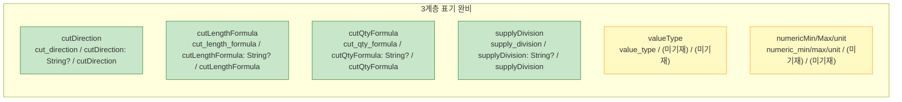

# WIMS 2.0 BOM 설계 v1.2 내부 일관성 검증

> [!abstract] 요약
> [[WIMS_용어사전_BOM_v1.2]] 자체 및 연관 문서 간 용어·필드·금지어의 자가당착 없는 일관성을 검증.
> - **총 발견 이슈: 10건** (🔴 Blocker 1건 / 🟠 Major 4건 / 🟡 Minor 5건)
> - **최종 판정: Conditional Pass** — Blocker 1건 수정 후 설계 문서 작성 진행 가능.

---

## A. 용어사전 자체 일관성 (v1.2)

### A-1. §13 `산식구분` ↔ §3 `supplyDivision` 이중 정의 혼재

**파일·섹션:** `WIMS_용어사전_BOM_v1.2.md` §3 (MBOM 속성) vs §13 (산식)

**현상:**
§3 표에서 `supplyDivision` 의 정의는 `공통 | 외창 | 내창`이고 엔티티 DB 컬럼은 `supply_division` 이다. §13 표에는 `산식구분` 이라는 별도 표준명이 등장하며, `저장 위치` 를 `MBOM.supply_division` 으로, 값 집합을 `내외 / 외창 / 내창` 으로 적고 있다. 두 섹션이 동일 DB 컬럼(`MBOM.supply_division`)을 가리키지만 다른 표준명(`supplyDivision` vs `산식구분`)과 다른 값(`공통` vs `내외`)을 사용하고 있어 모순이 발생한다.

**심각도:** 🔴 Blocker

**제안 수정:**
§13 에서 `산식구분` 행을 삭제하고, "§3 `supplyDivision` 과 동일" 이라는 참조 주석만 남긴다. 값 집합은 `공통 | 외창 | 내창` 으로 §3 를 기준으로 단일화한다. 원본 유니크시스템 자료에 `내외` 표기가 있다면, §3 정의 테이블의 비고란에 "(원본 표기: 내외)" 를 추가하는 방식으로 흡수한다.

---

### A-2. §7 금지어 `CuttingBOM` 이 §12 절 제목에 일반명사로 등장

**파일·섹션:** `WIMS_용어사전_BOM_v1.2.md` §12 제목 및 첫 문장

**현상:**
§7 금지어 표에 `` `CuttingBOM`, `CUTTING_BOM` `` 이 등재되어 있다. 그런데 §12 절 제목이 `절단 표현은 MBOM 속성 확장으로 (CuttingBOM 엔티티 철회)` 이고 `[!warning]` callout 본문에도 `v1.1 에서 별도 CUTTING_BOM·CUTTING_BOM_LINE 엔티티로 올렸으나` 라고 기술되어 있다. 금지어가 본문에 등장하는 것은 이 경우 "철회 공지" 목적이므로 허용 대상이다. 그러나 §12 의 `§3 에 추가된 속성 그대로 사용:` 이하 열거 목록에서 `CuttingInstruction`·`WorkOrderLine` 을 여전히 BOM 섹션 내에서 언급하고 있어, 독자가 이를 현행 BOM 엔티티로 오인할 수 있다.

**심각도:** 🟡 Minor

**제안 수정:**
`CuttingInstruction`·`WorkOrderLine` 언급 문장에 `(MF 서브시스템 소관, BOM 엔티티 아님)` 라는 괄호 주석을 명시적으로 추가한다. §12 제목의 `CuttingBOM 엔티티 철회` 괄호 표기는 철회 공지 목적이므로 유지한다.

---

### A-3. §3 신규 4개 속성의 3계층 네이밍 §8 원칙 부합 여부

**파일·섹션:** `WIMS_용어사전_BOM_v1.2.md` §3 vs §8

**현상:**
§3 에 추가된 `cutDirection` / `cutLengthFormula` / `cutQtyFormula` / `supplyDivision` 4개는 DB(`snake_case`) · 도메인(`camelCase`) · API JSON 키 3계층이 모두 명시되어 있다. §8 원칙(DB: snake_case / 도메인: camelCase / API: @JsonProperty 제어) 에 형식적으로 부합한다. 단, `supplyDivision` 의 API 키는 `supplyDivision` 으로 표기되어 있는데, 동일 문서 §3 기존 속성들의 패턴(예: `frozen` → API `immutable` 같은 의도적 이름 변경)과 비교할 때 의도된 변환인지 단순 통과인지 명시적 언급이 없다.

**심각도:** 🟡 Minor

**제안 수정:**
§3 테이블 하단 또는 §8 대표 사례 목록에 신규 4개 속성의 API 키가 "DB·도메인과 동명(의도적 통과)" 임을 한 줄로 주석 추가한다. 의도적으로 다른 API 키를 쓸 계획이 없다면 현 상태로 확정 표시.

---

### A-4. §1 `seriesCode` ↔ §10 `seriesCode` 기술 방식 일관성

**파일·섹션:** `WIMS_용어사전_BOM_v1.2.md` §1 (식별자 표) vs §10 (계열·시리즈 절)

**현상:**
§1 표에서 `seriesCode` 의 DB 컬럼을 `PRODUCT.series_code` 로 기술하여 테이블명을 포함한다. 이는 다른 행(예: `configCode` → `config_code`, `itemCode` → `item_code`) 이 테이블명 없이 컬럼명만 적는 관행과 다르다. §10 에서도 `seriesCode` 의 저장 위치를 `PRODUCT.series_code` 로 기술하여 의도는 맞다. 다만 §1 표 컬럼 헤더가 `DB` 이므로, `PRODUCT.series_code` 라는 표기는 컬럼명(`series_code`) + 테이블 컨텍스트(`PRODUCT`) 를 혼합한 형태로 표의 다른 행과 표기 스타일 불일치가 있다.

**심각도:** 🟡 Minor

**제안 수정:**
§1 DB 컬럼 표기 방식을 두 가지 중 하나로 통일한다. (a) 모든 행을 `table.column` 형식으로 통일하거나, (b) DB 컬럼명만 적고 별도 "엔티티" 컬럼을 두는 방식. v1.2 현재 구조상 (a) 방식 혹은 `series_code (PRODUCT)` 형태 주석 표기로 통일을 권장.

---

### A-5. §12 Mermaid ER 다이어그램 부재 — §3 서술과의 정합 확인 불가

**파일·섹션:** `WIMS_용어사전_BOM_v1.2.md` §12

**현상:**
v1.1 의 §12 에는 `CUTTING_BOM`·`CUTTING_BOM_LINE` 등 엔티티 간 관계를 나타내는 `erDiagram` Mermaid 블록이 있었다. v1.2 의 §12 에는 이 ER 다이어그램이 삭제되고 `flowchart LR` 한 개(PRODUCT → PRODUCT_CONFIG → BOM_RULE → RESOLVED_BOM)만 남아 있다. 이 흐름도는 §3/§11 서술과 내용적으로 일치한다. 다이어그램 자체에 오류는 없으나, MBOM 속성 확장 후 MBOM이 다이어그램에 노출되지 않아 **절단 속성이 어디에 붙어있는지** 시각적으로 드러나지 않는다.

**심각도:** 🟡 Minor

**제안 수정:**
§12 flowchart 에 `MBOM` 노드를 추가하여 `BOM_RULE --> MBOM[MBOM\ncutDirection/cutLengthFormula\ncutQtyFormula/supplyDivision]` 흐름을 명시한다. Mermaid 자체 오류는 아니므로 Blocker 미해당.

---

### A-6. §17 변경이력 v1.2 항목 — `DerivativeProduct` 철회 미언급

**파일·섹션:** `WIMS_용어사전_BOM_v1.2.md` §17

**현상:**
§17 변경이력 v1.2 항목은 `CuttingBOM·LayoutType·ProductSeries 를 … 흡수` 라고 기술하고 있다. 그런데 v1.1 §2 의 BOM 구성요소 표에는 `CuttingBOM` 외에 `BOM_RULE (확장)` 에 "§13 파생제품 변형도 포함" 이라는 v1.1 신규 내용이 있었고, GAP 문서 §4 의 E4 `DerivativeProduct` 엔티티가 v1.2 에서 철회되었다. 그러나 §17 v1.2 항목에는 `DerivativeProduct` 철회가 명시적으로 언급되지 않는다. `[!warning]` callout 에는 4개 엔티티 철회로 명기되어 있으나 §17 표에는 3개(`CuttingBOM·LayoutType·ProductSeries`)만 열거한다.

**심각도:** 🟠 Major

**제안 수정:**
§17 v1.2 변경 항목에 `DerivativeProduct 엔티티 신설안도 철회, PRODUCT 속성(derivative_of/derivative_kind) + BOM_RULE 로 표현` 을 추가한다.

---

## B. 문서 간 용어 정합성

### B-1. GAP 문서 §4′ DDL 스니펫과 v1.2 §3 표의 컬럼명 완전 일치

**파일·섹션:** `GAP_분석_통합_2026-04-15.md` §4′ E3′ vs `WIMS_용어사전_BOM_v1.2.md` §3

**현상:**
GAP §4′ E3′ DDL 스니펫의 컬럼명은 `cut_direction`, `cut_length_formula`, `cut_qty_formula`, `supply_division` 이고, v1.2 §3 표의 DB 컬럼도 동일하다. 필드명 불일치 없음. DDL 스니펫에서 테이블명은 `MBOM` 으로 표기했고 v1.2 §3 의 헤더도 `MBOM 속성`이므로 정합함. 이 항목은 **이상 없음**.

**심각도:** — (이상 없음, 확인 완료)

---

### B-2. GAP 문서의 철회 블록(E1~E4)에 금지어 사용 — 이력 보존 목적 허용 여부

**파일·섹션:** `GAP_분석_통합_2026-04-15.md` §4 E1~E4

**현상:**
GAP §4 E1~E4 블록 코드 스니펫에는 `cuttingBomId`, `CuttingBOM`, `ProductSeries`, `LayoutType`, `CUTTING_BOM_LINE`, `cuttingBomKey` 등 v1.2 §7 금지어가 다수 등장한다. 해당 블록 상단에 `> [!danger] 2026-04-16 철회` callout 이 명시되어 있고, 블록 제목에 `⚠️ 철회됨, 이력 보존` 이 표기되어 있다. 검증 요건에 따라 "이력 보존 목적" 은 허용 범주이다.

**심각도:** — (이력 보존 목적으로 허용, 이상 없음)

---

### B-3. GAP 문서 §2 M3 해결 제안 내 `ProductSeries` 용어 사용

**파일·섹션:** `GAP_분석_통합_2026-04-15.md` §3 T1 해결 제안

**현상:**
GAP §3 T1 (`계열/시리즈/모델 용어 정의 부재`) 해결 제안 코드 블록에 `시리즈(ProductSeries)` 라는 표현이 포함되어 있다. 이 블록은 v1.1 기준 초안의 해결 제안 텍스트로서 "§1~§3 의 충돌·누락·용어 관찰 자체는 유효하므로 원문 유지" 라는 2026-04-16 REVISION 안내 하에 원문이 보존되어 있다. 그러나 해당 블록에는 `⚠️ 철회` 표시가 없고, `§4 E1~E4` 와 달리 danger callout 도 없다. `ProductSeries` 는 v1.2 §7 금지어이며, 독자가 이 해결 제안을 현행 지침으로 오해할 위험이 있다.

**심각도:** 🟠 Major

**제안 수정:**
GAP §3 T1, T2 해결 제안 블록 앞에 `> [!warning] v1.1 기준 초안 — v1.2 확정안 §4′ 참조` callout 을 추가한다. `ProductSeries` 는 표기 그대로 두되 문맥상 "v1.1 초안의 제안" 임이 명확해지도록 한다.

---

### B-4. 참조문서 인덱스 v1.2 최상단 · superseded 명시 여부

**파일·섹션:** `docs/참고자료/참조문서_인덱스.md` §최우선

**현상:**
참조문서 인덱스 `## 최우선` 섹션 첫 줄이 `docs/참고자료/WIMS_용어사전_BOM_v1.2.md — (최신, 2026-04-16)` 이며 v1.2 를 최상단에 배치하고 있다. v1.1 은 `(superseded, 이력 보존용)`, v1.0 도 동일하게 표기되어 있다. 요건 충족 완료.

**심각도:** — (이상 없음)

---

### B-5. CLAUDE.md 핵심 규칙 3번이 v1.2 를 가리키는지

**파일·섹션:** `/Users/jikwangkim/Documents/Claude/Projects/WIMS2.0/CLAUDE.md` §핵심 규칙 3

**현상:**
`3. **용어사전 선행** — BOM 관련 문서 수정 전 \`docs/참고자료/WIMS_용어사전_BOM_v1.2.md\` (최신) 필수 Read` 로 기재되어 있다. v1.2 를 명시적으로 참조하고 있어 요건 충족.

**심각도:** — (이상 없음)

---

## C. 금지어 적용

### C-1. GAP 문서 §5 `RuleTable` 설계 로드맵 내 `layout_type` 컬럼명 등장

**파일·섹션:** `GAP_분석_통합_2026-04-15.md` §5 (산식/규칙 엔진 설계 트리거) — 규칙 테이블화 로드맵 코드 블록

**현상:**
§5 의 "목표: RuleTable" 코드 블록에 `layout_type (W1XH1-정 등)` 이라는 필드 주석이 포함되어 있다. 이는 v1.2 §7 금지어인 `LayoutType`, `LAYOUT_TYPE` 에 해당하는 snake_case 변형(`layout_type`)이다. 해당 블록은 §4 철회 구간이 아니며 `⚠️ 철회` 표시가 없다. REVISION 안내는 §1~§3 내용 보존 및 §4 대체임을 말하지만, §5 에 대한 처리 방침은 별도 언급이 없다.

**심각도:** 🟠 Major

**제안 수정:**
§5 규칙 테이블화 로드맵 코드 블록의 `layout_type` 을 `opt_lay_value` 또는 `lay_opt` (OPT-LAY 옵션값) 로 교체하거나, 해당 블록 상단에 `> [!warning] 아래 필드명은 v1.1 초안 표기 — v1.2 기준으로 layout_type 은 OPT-LAY 옵션값으로 대체됨` 주석을 추가한다.

---

### C-2. GAP 참조 문서 인덱스 §분석 항목의 `CuttingBOM+WorkOrderLine+CuttingInstruction` 표현

**파일·섹션:** `docs/참고자료/참조문서_인덱스.md` §유니크시스템 참고자료 분석 — `2-2_미서기제작지시서_분석.md` 항목 설명

**현상:**
참조문서 인덱스의 `2-2_미서기제작지시서_분석.md` 항목 설명에 `` `CuttingBOM+WorkOrderLine+CuttingInstruction` 3단 구조 제안 `` 이라고 기재되어 있다. `CuttingBOM` 은 v1.2 §7 금지어이다. 해당 줄은 분석 문서 내용을 요약한 인덱스 설명이며 "제안" 이라고 표기되어 있지만, 철회 표시나 주석이 없어 현행 설계 지침으로 오해될 수 있다.

**심각도:** 🟠 Major

**제안 수정:**
해당 항목 설명을 `62시트 절단 BOM, 알루미늄 부재 16종; v1.1 에서 \`CuttingBOM\` 엔티티 제안(v1.2 에서 MBOM 속성 확장으로 대체됨)` 으로 수정한다.

---

## D. 3계층 네이밍 원칙(§8) 준수 — 신규 필드 현황

아래 표는 v1.2 에서 새로 추가된 필드의 3계층 표기 완비 여부를 정리한다.

| 신규 필드 (표준명) | DB (snake_case) | 도메인 (camelCase) | API (JSON key) | 3계층 완비 |
|---|---|---|---|---|
| cutDirection | `cut_direction` | `cutDirection: String?` | `cutDirection` | 완비 |
| cutLengthFormula | `cut_length_formula` | `cutLengthFormula: String?` | `cutLengthFormula` | 완비 |
| cutQtyFormula | `cut_qty_formula` | `cutQtyFormula: String?` | `cutQtyFormula` | 완비 |
| supplyDivision | `supply_division` | `supplyDivision: String?` | `supplyDivision` | 완비 |
| valueType | `OPTION_VALUE.value_type` | 미기재 | 미기재 | 🟡 **도메인·API 누락** |
| numericMin | `OPTION_VALUE.numeric_min` | 미기재 | 미기재 | 🟡 **도메인·API 누락** |
| numericMax | `OPTION_VALUE.numeric_max` | 미기재 | 미기재 | 🟡 **도메인·API 누락** |
| unit | `OPTION_VALUE.unit` | 미기재 | 미기재 | 🟡 **도메인·API 누락** |
| seriesCode | `PRODUCT.series_code` | `seriesCode: String` | `seriesCode` | 완비 |
| derivativeOf | `PRODUCT.derivative_of` | 미기재 | 미기재 | 🟡 **도메인·API 누락** |
| derivativeKind | `PRODUCT.derivative_kind` | 미기재 | 미기재 | 🟡 **도메인·API 누락** |

**관찰:**
- MBOM 절단 속성 4개(§3)는 3계층이 모두 명시되어 §8 원칙을 완전히 준수한다.
- `OPTION_VALUE` 의 수치형 확장 4개 필드(§11.1)와 `PRODUCT` 의 파생제품 속성 2개(§16)는 DB 컬럼만 기술하고 도메인(Kotlin) 클래스 필드명 및 API JSON 키가 명시되지 않았다. MBOM 속성에 비해 3계층 표기 수준이 낮다.

**심각도(D 항목 전체):** 🟡 Minor × 6개 필드

**제안 수정:**
§11.1 표에 `도메인(Kotlin)` 및 `API JSON key` 컬럼을 추가하고, 각 필드의 camelCase 표준명을 기재한다. `valueType`, `numericMin`, `numericMax`, `unit`, `derivativeOf`, `derivativeKind` 최소 6개 필드 대상. API 노출 불필요한 경우 `—` 으로 명시.

---

## 이슈 요약

| ID | 항목 | 심각도 | 파일 · 섹션 | 핵심 현상 |
|---|---|---|---|---|
| A-1 | §13 `산식구분` ↔ §3 `supplyDivision` | 🔴 Blocker | v1.2 §3/§13 | 같은 DB 컬럼 `supply_division` 에 표준명과 값 집합이 다르게 이중 정의됨 |
| A-6 | §17 변경이력 `DerivativeProduct` 철회 미언급 | 🟠 Major | v1.2 §17 | 철회 엔티티 4개 중 3개만 §17 표에 기재 |
| B-3 | GAP §3 T1 해결 제안에 금지어 `ProductSeries` | 🟠 Major | GAP §3 T1 | 철회 표시 없는 해결 제안 블록에 v1.2 금지어 포함 |
| C-1 | GAP §5 코드 블록 내 `layout_type` | 🟠 Major | GAP §5 | 철회 표시 없는 현행 섹션에 금지어 snake_case 형태 등장 |
| C-2 | 참조문서 인덱스 `CuttingBOM` 표현 | 🟠 Major | 참조문서_인덱스.md | 인덱스 설명에 v1.2 금지어가 철회 주석 없이 잔존 |
| A-2 | §12 `CuttingInstruction` 오인 위험 | 🟡 Minor | v1.2 §12 | BOM 섹션에 MF 소관 엔티티가 컨텍스트 없이 언급됨 |
| A-3 | 신규 4속성 API 키 §8 의도 명시 부재 | 🟡 Minor | v1.2 §3/§8 | 의도된 API 이름 동일 통과인지 불명확 |
| A-4 | §1 DB 컬럼 표기 스타일 불일치 | 🟡 Minor | v1.2 §1 | `series_code` 만 `PRODUCT.series_code` 형식, 나머지는 컬럼명만 |
| A-5 | §12 Mermaid MBOM 노드 부재 | 🟡 Minor | v1.2 §12 | 절단 속성 위치가 다이어그램에 미표현 |
| D | §11.1·§16 신규 필드 3계층 미완비 | 🟡 Minor | v1.2 §11.1/§16 | `valueType` 등 6개 필드에 도메인·API 계층 표기 누락 |

---

## 결론

> [!warning] Conditional Pass
> - 🔴 Blocker 1건 (A-1: `산식구분` / `supplyDivision` 이중 정의) 을 v1.2 에서 수정해야 설계 문서(DE35-1 등)에 반영 가능.
> - 🟠 Major 4건 (A-6, B-3, C-1, C-2) 은 독자 오해 방지를 위해 해당 문서 수정을 권고하며, 다음 DE 산출물 작성 전까지 처리 요망.
> - 🟡 Minor 5건 (A-2, A-3, A-4, A-5, D) 은 다음 용어사전 소규모 리비전(v1.2.1 또는 v1.3) 때 일괄 처리 가능.
> - v1.2 의 핵심 설계 방향(엔티티 철회·MBOM 속성 확장)은 내부 자가당착 없이 일관되게 유지되고 있어, Blocker 수정 후 **설계 작업 진행에 지장 없음**.
