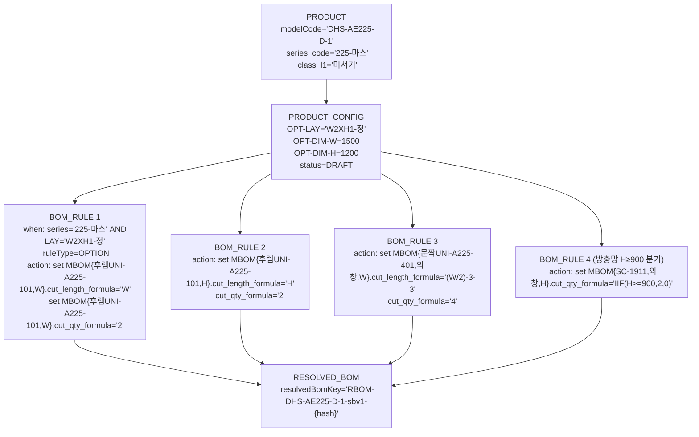

# WIMS 2.0 BOM 설계 v1.2 데이터 모델 완전성·건전성 검증

> [!abstract] 핵심 구멍 요약 (5건)
>
> 1. **P0-G1 산식 언어 2열 구조 미수용** — 원본 산식 파일에 J열(절단 치수1)과 K열(절단 치수2, 유리 세로 치수)이 분리된 2열 구조가 있으나, v1.2 MBOM 은 `cut_length_formula` 단일 필드만 정의. 유리류 부재(ZZ-ZZ100 등)의 세로 치수 산식 저장처 없음.
> 2. **P0-G2 cross-field 활성화 조건 표현 불가** — 3편창(isTripleLeaf=true) 일 때만 W1 입력을 허용해야 하지만, `numeric_min/max` 만으로는 "다른 옵션값에 따른 필드 활성화/금지" 규칙을 표현할 방법이 없음. 별도 enablement condition 필드 누락.
> 3. **P0-G3 소모품 단위계 혼재** — `cut_direction/cut_length_formula` 가 null 인 소모품 행에서 `cut_qty_formula` 가 `(W/250)*2` 처럼 길이 변수를 참조하는 케이스가 있어, "절단 무관 소모품 = qty_formula 단독 사용" 이라는 규정으로는 의미가 불명확함. 수량 산식이 치수 변수를 쓰는 소모품과 고정 수량 소모품을 구분하는 bomType 플래그 없음.
> 4. **P1-G4 산식 상수의 변경 영향도 — 리터럴 vs 상수 테이블 미결** — 74/94/47 등 계열별 오프셋 상수가 `BOM_RULE.action` 산식 안에 리터럴로 박힘. frozen=TRUE 이후 계열 상수 변경 시 기저장 Resolved BOM 의 산식 원문이 구버전 상수를 그대로 갖고 있어 재계산 없이 값이 바뀌지 않는 설계. 단, 이것이 "불변 보장"인지 "재계산 누락 버그"인지 규정 없음.
> 5. **P1-G5 resolvedBomId 카디널리티 폭발** — NUMERIC 옵션(W, H 연속값) 이 optionsHash 에 포함되므로 동일 제품·동일 치수가 아니면 매번 새 resolvedBomId 가 생성됨. 주문 건마다 Resolved BOM 행이 증가하는 구조의 성능·저장 전략이 명세되지 않음.

---

## Q1. 산식 언어 `UNIQUE_V1` 의 표현력

> [!check] 판정: ⚠️ 부분 충족 — J열 단독 산식은 커버하나, K열(2차 치수) 수용 구조 미흡

### 검증 결과

#### 1-A. 사칙연산 + IIF 이진 조건으로 전체 케이스 커버 여부

원본 2-3_미서기산식 §4·§8.1 분석 결과, 60개 시트 전체 산식 유형이 다음 3가지로 분류된다:

| 유형 | 비율 | 예시 |
|------|------|------|
| 직접 대입형 (사칙연산) | ~90% | `W - 94`, `(W/2) - 3 - 3`, `(W - 73 - 73 - 132) / 2` |
| 이진 IIF 조건 분기 | ~10% | `IIF(H>=900, 2, 0)`, `IIF(H1>=900, N, 0)` |
| 비례 수량형 | ~5% | `(W/250)*2`, `(W*4)+(H*4)` |

**AND/OR 복합 조건 및 CASE 다중 분기는 원본에 존재하지 않음.** 2-3 §8.1에서 명시: "복잡한 중첩 조건 없음. 단순 사칙연산 + 이진 IIF로 전체 커버 가능."

`IIF(H>=900, 2, 0)` 과 `IIF(H<900, 2, 0)` 처럼 동일 임계값에 대한 **상보 케이스**는 별도 MBOM 행 2개로 분리하는 패턴으로 처리되므로, 다중 분기가 아닌 이진 IIF 2회로 표현 가능하다.

**결론: `UNIQUE_V1` 언어 자체는 충분하다.**

#### 1-B. 2열 산식 구조 미수용 — P0 구멍

원본 산식 시트의 컬럼 구조:
- **J열 `산식1`**: 절단 치수(부재 절단 길이, mm) — 1차 치수
- **K열 `산식2`**: 유리류 세로 치수 또는 보조 길이 — 2차 치수

```
D11: ZZ-ZZ100   G11: W   I11: 2
J11: ((W/2)-2-2)-69.5-69.5+3       ← 유리 너비
K11: (H-37-37)-69.5-69.5            ← 유리 높이  (K열!)
```

v1.2 MBOM 에는 `cut_length_formula` 1개 필드만 존재한다. K열 값을 저장할 필드가 없다.

> [!danger] P0 구멍 — G1
> `MBOM.cut_length_formula2` (또는 `cut_height_formula`) 필드 신설 필요.
> 대안: 유리 부재(ZZ-ZZ100 등)에 한해 `cut_length_formula` 를 `"W_formula|H_formula"` 구분자 포맷으로 저장하는 규약 — 단, 파서 복잡도 증가.
> 권장안: 단순히 컬럼 1개 추가(`cut_length_formula_2 VARCHAR(255) NULL`).

#### 1-C. 산식 결과 음수/0/비정수 케이스 처리 규정

v1.2 용어사전 및 GAP 분석 어디에도 **결과 유효성 검증 규정**이 없다.

| 케이스 | 예시 | 현행 규정 |
|--------|------|---------|
| 0 이하 결과 | `IIF(H>=900, 2, 0)` 에서 0 → MBOM 행 유지/제거? | 없음 |
| 음수 결과 | W가 매우 작을 때 `W - 94` < 0 | 없음 |
| 소수 결과 | `(W/2) - 3.5` → 비정수 | 없음 |

> [!warning] P1 영향
> RuleEngine 구현 시 예외 처리 로직이 달라질 수 있음. 적어도 "qty=0 이면 MBOM 행을 Resolved BOM에서 제외한다" 는 규약 명세가 DE11-1에 필요.

#### 1-D. 산식 내부 상수 리터럴 vs 상수 테이블

2-3 §부록 계열별 주요 상수 정리에서 확인된 상수 집합:

| 상수 유형 | 값 | 계열 |
|---------|---|------|
| 후렘 두께 H방향 상단/하단 | 37mm | 160 우수 |
| 후렘 두께 H방향 | 38mm | 225 우수 |
| 후렘 두께 H방향 | 47mm(-10 교정) | 225 마스 |
| 글레이징 비드 | 69.5mm | 160 |
| 글레이징 비드 | 54.5mm | 225/226 |
| 레일바 여유 | 73mm | 160/225 우수 |
| 중간 프레임 W 여유 | 47mm | 160/225 |

v1.2 설계는 이 상수들을 `BOM_RULE.when series_code='X'` 분기로 계열별 룰을 분리하고 산식 안에 리터럴로 내장하는 방식을 채택했다(용어사전 §13 예시).

**변경 영향도 평가:**
- 계열 상수를 단독으로 수정하려면 해당 계열의 모든 BOM_RULE 행을 찾아 산식 문자열을 텍스트 치환해야 함
- frozen=TRUE 이후 Resolved BOM 의 산식 원문은 리터럴 상수를 포함하므로, 이후 상수 변경이 기 생성 Resolved BOM 에 영향을 주지 않음 → **불변성 유지에는 오히려 유리**
- 단, 같은 계열의 기준을 전사적으로 바꿔야 할 때 산식 유지보수 비용이 큼

> [!info] P2 수준 — 상수 테이블이 필요한 시점
> 계열 수(현재 5)가 10 이상으로 늘거나 상수 변경 빈도가 높아지는 Phase 2 이후 고려. 현재 규모에서는 리터럴 방식이 오히려 단순하고 불변성과도 잘 맞음.

---

## Q2. OPTION_VALUE 수치형 확장 적절성

> [!check] 판정: ⚠️ 부분 충족 — NUMERIC 확장 자체는 적절, cross-field 활성화 조건 표현 불가

### 2-A. OPT-DIM 6개 OPTION_VALUE vs JSON 단일 필드

v1.2 §11.1: `OPT-DIM-W`, `OPT-DIM-H`, `OPT-DIM-W1`, `OPT-DIM-H1`, `OPT-DIM-H2`, `OPT-DIM-H3` 를 별도 OPTION_VALUE 6행으로 관리.

**6행 분리 방식의 장점:**
- 각 치수 변수마다 `numeric_min/max/unit` 독립 설정 가능 (W: 300~3000mm, H: 300~3000mm 등)
- `BOM_RULE.when` 절에서 `OPT-DIM-H >= 900` 조건 직접 참조 가능
- PRODUCT_CONFIG.option_snapshot JSON 에 `{"OPT-DIM-W": 1500, "OPT-DIM-H": 1200}` 자연스럽게 포함

**JSON 단일 필드 방식의 단점:**
- 각 치수별 min/max 유효성 검증이 DB 수준에서 불가 → 애플리케이션 레이어에서만 가능
- BOM_RULE when 절 파싱 복잡도 증가

**결론: 6행 분리 방식이 현재 설계 목적에 적합하다.**

### 2-B. 3편창 W1 조건부 활성화 — P0 구멍

3편창(`isTripleLeaf=true`)인 경우에만 W1 입력이 의미 있고, 그 외에는 W1을 입력해서는 안 된다.

현재 `OPTION_VALUE` 확장 필드:
```sql
value_type: ENUM | NUMERIC | RANGE
numeric_min: DECIMAL
numeric_max: DECIMAL
unit: VARCHAR
```

이 4개 필드로는 "OPT-LAY 값이 W1XH1-3편 또는 W1XH2-3편일 때만 OPT-DIM-W1 활성화"를 표현할 수 없다.

> [!danger] P0 구멍 — G2
> `OPTION_VALUE` 또는 `OPTION_GROUP` 에 `enablement_condition VARCHAR(512) NULL` 필드가 필요하다.
>
> ```sql
> ALTER TABLE OPTION_VALUE ADD COLUMN enablement_condition VARCHAR(512) NULL;
> -- 예시 값: "OPT-LAY IN ('W1XH1-3편','W1XH2-3편')"
> ```
>
> 이 필드가 없으면 BE 서비스 레이어에 하드코딩해야 하며, BOM 규칙과 옵션 활성화 조건이 분리되어 일관성 유지 불가.

### 2-C. cross-field 규칙 — "3편이면 W1 필수, 아니면 금지"

`numeric_min/max`는 단일 필드 범위 검증만 가능하다. "A 값에 따라 B 필드가 필수/금지" 는 cross-field 제약이다. 이를 OPTION 모델에서 표현하려면:

1. `enablement_condition` 필드로 활성화 여부 결정 (위 G2 보완안)
2. 활성화 시 `required=TRUE`, 비활성화 시 `required=FALSE` 추가 필드 필요

```sql
ALTER TABLE OPTION_VALUE ADD COLUMN is_required_when VARCHAR(512) NULL;
-- 예: "OPT-LAY IN ('W1XH1-3편','W1XH2-3편')"
```

> [!warning] P1 영향
> enablement_condition 과 is_required_when 을 모두 추가하거나, 하나의 condition 필드로 통합 설계. 프론트엔드 옵션 입력 폼 동적 렌더링과 직결.

---

## Q3. MBOM 절단 속성 충분성

> [!check] 판정: ⚠️ 부분 충족 — 방향별 행 분리는 타당, 소모품 구분자 혼동 여지 있음

### 3-A. 방향별 MBOM 행 분리 구조 적절성

v1.2 설계: 같은 부재라도 절단 방향이 다르면 MBOM 행을 분리한다.

```
후렘 상하(W방향): MBOM행 1 — itemCode=UNI-A225-101, cut_direction=W, cut_length_formula='W'
후렘 좌우(H방향): MBOM행 2 — itemCode=UNI-A225-101, cut_direction=H, cut_length_formula='H'
```

원본 2-2_제작지시서 §5.2에서 확인:
- UNI-A225-101: W방향 2개 / H방향 2개 → MBOM 2행으로 분리 저장
- 각 행의 (itemCode, cut_direction, supplyDivision) 튜플이 자연스럽게 구분자 역할

**이 "중복"은 개념적 중복이 아니라 방향별 공정 구분으로 감내 가능하다.** 실제로 절단 작업장에서 W방향과 H방향 절단은 별도 공정이므로 행 분리가 의미적으로 정확하다.

### 3-B. `supply_division` enum 충분성

v1.2 정의: `공통 | 외창 | 내창`

2-3_미서기산식_분석 §7:

| 산식구분 | 의미 | 해당 자재 |
|---------|------|---------|
| `공통` | 내·외창 공통 | 후렘, 레일바, 부속품 |
| `외창` | 외측 창짝에만 | 방충망, 외창 문짝 |
| `내외` | 내창·외창 모두 | 225/226 계열 P홈문짝 |

원본의 3번째 값은 `내외`이지, `내창`이 아니다. v1.2 의 `내창` enum 값이 원본 `내외` 와 동일한 개념인지 명확하지 않다.

> [!warning] P1 영향 — enum 값 불일치
> - 원본 `내외` = 내창 + 외창 동시 적용 → v1.2 `공통` 과 의미 중복 가능성
> - 원본 `외창` = 외창에만 → v1.2 `외창` 과 일치
> - 원본에는 `내창` 단독 값이 없음
>
> **보완안**: enum 재정의 `공통(내외창공통) | 외창전용 | 내창전용 | 내외창모두(=원본 내외)` 또는 원본 그대로 `공통 | 외창 | 내외` 3값 사용 + `내창`은 별도 케이스 존재 여부 확인 후 추가.

### 3-C. 사선 절단(각도) 및 노치 가공 처리

4-2_커튼월다이스북_분석 §5-4에서 **코너바(UNI-CW-CN165) 에 45° 절단 적용**이 명시됨. 현재 `cut_direction` enum이 `W | H | W1 | H1 | H2 | H3` 로만 정의되어 있어, 사선(45°) 절단이나 노치 가공은 표현 불가능하다.

> [!warning] P1 영향 — 미서기 대상 아니나 커튼월 대상
> - 미서기 분석 파일(2-2, 2-3)에는 각도 절단·노치 없음 — Phase 1 범위 밖
> - 커튼월(Phase 2)에서 코너바 45° 절단이 필요. `cut_direction` 에 `ANGLE_45` 또는 별도 `cut_angle` 필드 추가 검토 필요
> - **Phase 1 범위에서는 구멍 아님, Phase 2 진입 전 보완 필요**

### 3-D. 소모품의 `cut_qty_formula` 단독 사용 의미 명확성 — P0 구멍

소모품 케이스 분류:

| 소모품 유형 | 예시 | cut_direction | cut_length_formula | cut_qty_formula |
|-----------|------|--------------|-------------------|----------------|
| 고정 수량 | `02-0034` 반달크리센트, 수량 2개 | null | null | `"2"` |
| 치수 비례 수량 | `02-0051` 탄성스프링, `(W/250)*2` | null | null | `"(W/250)*2"` |
| 선형 자재 | `04-0003` 모헤어, `W*2` mm | null | `"W*2"` | `"1"` |
| 면적 자재 | `ZZ-ZZ03` 방충망, mm² 산출 | null | `"(W/2)*H"` | `"1"` |

현재 v1.2 명세("null이면 공통")만으로는 "탄성스프링처럼 W를 참조하지만 절단 부재가 아닌 소모품"을 선형 자재와 구분할 수 없다. `cut_direction=null` + `cut_length_formula=null` + `cut_qty_formula="(W/250)*2"` 는 유효한 조합이나, 이것이 "선형 자재의 수량" 인지 "소모품의 W 비례 수량" 인지 호출자가 알 수 없다.

> [!danger] P0 구멍 — G3
> `MBOM` 에 `item_category` 또는 기존 ITEM 엔티티에 `item_category ENUM('PROFILE'|'CONSUMABLE'|'GLASS'|'SEALANT')` 를 두어 소모품을 명시적으로 구분해야 한다.
>
> **혹은** `cut_length_formula` 가 null이고 `cut_qty_formula` 가 치수 변수를 포함하면 "치수 비례 소모품", 둘 다 null이면 `theoreticalQty` 사용 이라는 규약을 **DE11-1에 명시**해야 한다.

---

## Q4. BOM_RULE 확장의 스케일

> [!check] 판정: ✅ 충분 (성능), ⚠️ 부분 (설계 명세 미완)

### 4-A. ~2,000 BOM_RULE 행 평가 성능

2-3 §8.1: 60개 시트 합산 ~1,900~2,000행 (중복 제거 전). 실제 BOM_RULE 테이블 규모는 이와 유사.

**RDB 인덱스 전략으로 충분히 처리 가능한 규모.** 예: `(series_code, layout_code, item_code)` 복합 인덱스 → 특정 제품·레이아웃·부재의 룰을 수 ms 이내 조회. MariaDB 10.11 기준 2,000행은 인덱스 스캔 부하 없는 수준.

단, **룰 평가 엔진이 2,000개 산식을 한 번에 평가하는 구조**라면 성능 이슈. 실제로는 (series, layout, item)으로 필터링 후 해당 룰만 평가하므로 대부분 건당 10~30행 수준.

### 4-B. when 절 혼합 조건 지원 여부

원본 분석에서 도출된 BOM_RULE when 절 예상 구조:

```
when: series_code = '225-마스'
      AND OPT-LAY = 'W2XH1-정'
      AND OPT-DIM-H >= 900   ← 방충망 수량 분기
```

이 혼합 조건이 BOM_RULE.when 필드에 어떤 포맷으로 저장되는지, 평가 엔진이 어떻게 파싱하는지 **DE11-1에 명세가 없다** (GAP 분석 §5 RuleEngine 모듈 추가 언급만 있음).

> [!warning] P0 영향 — DE11-1 미명세
> - when 절 포맷 정의 없음 → 구현자마다 포맷이 달라질 위험
> - `UNIQUE_V1` 산식 언어와 when 절 조건 언어가 동일한지 다른지 불명확
> - **보완안**: DE11-1 에 when 절 BNF 문법 정의 추가. 예: `CONDITION_LANG_V1 ::= field OP value (AND field OP value)*`

### 4-C. OPTION vs DERIVATIVE 혼재 인덱스 전략

BOM_RULE 에 `ruleType = OPTION | DERIVATIVE` 두 종류가 공존한다.

- OPTION 룰: series_code + OPT-LAY + item_code 조합으로 룩업
- DERIVATIVE 룰: derivative_of + derivative_kind 조합으로 룩업

두 ruleType 이 같은 테이블에 있으면 인덱스가 비효율적으로 섞일 수 있다.

> [!warning] P1 영향
> - **파티셔닝 인덱스**: `(rule_type, series_code)` 또는 `(rule_type, derivative_of)` 복합 인덱스 분리
> - 또는 `DERIVATIVE` 룰 수가 적어(50모델 × 최대 10치환 = ~500행) OPTION 룰(~2,000행)과 스캔 오버헤드 없이 공존 가능 → P2 수준으로 유보 가능

---

## Q5. 다이스북·공급망(§14) 완전성

> [!check] 판정: ⚠️ 부분 충족 — 개정이력 필드 있음, 공급사 상세 정보 누락

### 5-A. DIES_BOOK 개정판 이력 관리

v1.2 용어사전 §10: `PRODUCT.dies_revision DATE` (선택 컬럼) 언급.
v1.2 §14: `DIES_BOOK.dies_book_revision = '2023-03-24', '2025-08-20'` 가 `DIES_BOOK` 테이블에 있음.

4-2_다이스북_분석 §1: 제정일자 `2023.03.24`, 최신 개정 `2025.08.20 (UNI-D-18-1)`.

**`DIES_BOOK` 엔티티에 `dies_book_revision DATE` 필드가 있으므로 이력 관리는 가능.**

단, 개정이 **파일 전체 교체**인지 **부재 단위 교체**인지에 따라 설계가 달라진다. 2025.08.20 개정은 `UNI-D-18-1` (173계열 신규) 1개 도면만 추가됨 — 즉, **일부 부재만 개정**되는 케이스가 있다.

> [!warning] P1 영향
> `DIES_BOOK` 이 문서 단위 버전인지, 부재 단위 effective_date 인지 결정 필요. 현재 `DIES_BOOK` 엔티티가 문서(PDF) 단위로 모델링되어 있다면 부재별 개정일 추적이 불가. `ITEM.dies_code` + `ITEM.dies_effective_date` 필드 추가 고려.

### 5-B. ITEM_SUPPLIER 상세 정보 부족

v1.2 §14: `ITEM_SUPPLIER` 는 자재↔공급사 다대다 매핑 역할.

4-2_다이스북_분석에서 확인된 공급사 정보:

| 부재 | 공급사 복수 | 단가 | 리드타임 |
|------|-----------|------|--------|
| UNI-CW-S135T20D | 대양,성진,삼산 (3개) | 미명시 | 미명시 |
| PA 단열재 | 플라프로 | 650~1200원/m | 미명시 |
| PJ 철물 | 지원이앤에스, 동신테크, 가람정밀 | 명시됨 | 미명시 |

공급사 복수인 부재에서 **발주 우선순위, 단가, 리드타임**이 없으면 ES(견적설계)와 OM(발주관리)이 공급사를 선택할 근거가 없다.

> [!warning] P1 영향
> `ITEM_SUPPLIER` 에 최소한 `priority INT`, `unit_price DECIMAL`, `price_unit VARCHAR` 3개 컬럼 추가. 리드타임은 Phase 2에서 추가 가능.

### 5-C. PA 단열재 itemCode 미부여 처리

4-2 §4-5: `P.A-CW3-모(마)`, `P.A-CW3-히(마)` 외 여러 PA 부재가 코드 없이 `-` 로 기재됨.

v1.2 §14 `[question]` 미확정 섹션: "PA 단열재 일부 itemCode 미부여 상태. 초기 데이터 로드 전 유니크시스템과 부여 규칙 합의 필요"

현재 ITEM 엔티티의 `item_code NOT NULL` 제약이 있다면 이 부재들을 INSERT 할 수 없다.

> [!warning] P1 영향
> - 옵션 1: `item_code` 를 **NULLABLE** 로 변경하고 미부여 상태 허용 (데이터 정합성 약화)
> - 옵션 2: `PLACEHOLDER-PA-{순번}` 임시 코드 자동 부여 규칙 정의 후 유니크시스템 확인 시 교체
> - 권장: 옵션 2 — ITEM INSERT 시 item_code 없으면 `TMP-{uuid_short}` 자동 채번, `is_code_provisional BOOLEAN DEFAULT FALSE` 컬럼 추가

---

## Q6. 유니크시스템 60시트 × 실데이터 왕복 테스트 (가상 시나리오)

> [!check] 판정: ⚠️ 왕복 가능하나 G1(K열) 구멍에서 유리 치수 누락

### 6-A. 시나리오 설정

시트: **225-마스 / W2XH1-정** (시트 #41, 기준 치수 W=1500, H=1200)

### 6-B. 삽입 데이터 구조 (개념)



### 6-C. BOM_RULE 예상 행 수 (225-마스 W2XH1-정 기준)

| 그룹 | 부재코드 | 방향 | BOM_RULE 행 |
|------|---------|------|------------|
| 공통 후렘 UNI-A225-101 | W | 1 |
| 공통 후렘 UNI-A225-101 | H | 1 |
| 공통 레일바 UNI-PA225-401 | W (하지만 225-마스는 레일바 없음) | 0 |
| 공통 중간프레임 UNI-A225-901 | W | 1 |
| 외창 문짝 UNI-A225-401 | W | 1 |
| 외창 문짝 UNI-A225-401 | H | 1 |
| 내창 문짝 UNI-A225-401 | W | 1 |
| 내창 문짝 UNI-A225-401 | H | 1 |
| 외창 방충망 SC-1911 | W | 1 |
| 외창 방충망 SC-1911 | H (≥900) | 1 |
| 외창 방충망 SC-1911 | H (<900) | 1 |
| 소모품류 (크리센트, 브라켓 등) | — | ~8 |
| **합계** | | **~18행** |

### 6-D. Resolved MBOM 예상 행 수

MBOM 행 = 각 BOM_RULE action 이 참조하는 (item, direction, supply_division) 튜플 수 = **~18행**

(방충망 H 방향은 IIF 결과가 0이면 제외 → W=1500, H=1200 >= 900 이므로 포함: 18행 그대로)

### 6-E. 왕복 테스트 결과 — 발견된 병목/중복/누락

| 구분 | 항목 | 상태 |
|------|------|------|
| **누락** | 유리(ZZ-ZZ100) K열 치수 저장처 없음 | ❌ G1 구멍 |
| **중복** | 외창/내창 문짝이 동일 부재코드(UNI-A225-401) 2배 → MBOM 4행 | ✅ 의도된 설계 |
| **병목** | BOM_RULE.action 포맷 미정 → 구현 시 파서 불명확 | ⚠️ Q4-B 이슈 |
| **정상** | 후렘·중간프레임·방충망·소모품 모두 표현 가능 | ✅ |

### 6-F. 실제 수치 검증 (W=1500, H=1200)

| 부재 | 방향 | 산식 | 계산값 |
|------|------|------|------|
| 후렘 UNI-A225-101 | W | W = 1500 | 1500mm × 2개 |
| 후렘 UNI-A225-101 | H | H = 1200 | 1200mm × 2개 |
| 중간프레임 UNI-A225-901 | W | W - 94 = 1406 | 1406mm × 1개 |
| 외창문짝 UNI-A225-401 | W | (W/2)-3-3 = 744 | 744mm × 4개 |
| 외창문짝 UNI-A225-401 | H | H-38-38 = 1124 | 1124mm × 4개 |
| 방충망 SC-1911 | H | IIF(H>=900,2,0)=2개, H-36.5-36.5=1127mm | 1127mm × 2개 |

> 2-2 제작지시서 §5.3 대조 가능. 기준 치수(1000×1000) 대비 비율 스케일링으로 대략 검증.

---

## Q7. 버전·불변성 상호작용

> [!check] 판정: ⚠️ 부분 충족 — frozen 이후 산식 원문 불변은 보장되나, 평가 시점 규정 미흡

### 7-A. frozen=TRUE 이후 산식 상수 변경 문제

v1.2 설계에서 `RESOLVED_BOM` 의 실제 저장 방식에 두 가지 해석이 가능하다:

**해석 A (산식 원문 저장):** Resolved BOM 생성 시점에 각 MBOM 행의 `cut_length_formula` 산식 원문만 저장. 조회 시마다 산식을 재평가.
- frozen=TRUE 이후 `BOM_RULE.action` 을 수정해도, Resolved BOM 은 생성 시점의 산식 원문을 그대로 갖고 있어 **불변**
- 단, `appliedOptions` 의 W=1500 값을 대입해 산식을 평가하면 매번 같은 결과 → **안전**

**해석 B (평가 결과 저장):** Resolved BOM 생성 시점에 W, H 값을 대입한 계산 결과(mm 정수)를 저장.
- 이후 산식 변경 영향 없음 → **더 안전하나 재계산 불가**

현재 v1.2 명세에서는 어느 해석이 맞는지 **명시되지 않음**.

> [!warning] P1 영향 — 평가 시점 규정 필요
> DE11-1 에 "Resolved BOM 생성 시 산식을 평가하여 결과값을 저장하는가, 산식 원문을 저장하고 조회 시 평가하는가" 를 결정해야 한다.
> - **권장: 결과값 저장** (frozen 의미와 일치, MES 응답 속도 최적)
> - 산식 원문도 함께 보관(`cut_length_formula_snapshot`)하면 이력 추적 가능

### 7-B. optionsHash 카디널리티 폭발 — P1 구멍

`resolvedBomId = RBOM-{standardBomId}-sbv{N}-{optionsHash}`

`optionsHash = SHA-256(appliedOptions)[:8]`

`appliedOptions` 에 NUMERIC 옵션(`OPT-DIM-W=1500`, `OPT-DIM-H=1200`)이 포함되므로, W와 H 조합마다 다른 hash가 생성된다. 1mm 단위 변화도 새 hash → 새 resolvedBomId.

**카디널리티 예측:**
- W 범위: 300~3000mm = 2,700 단위
- H 범위: 300~3000mm = 2,700 단위
- 제품 50개 × 12 레이아웃 × 2700 × 2700 = 이론적 최대 ~43억 조합

실제 주문에서 사용되는 치수는 수백~수천 조합이므로 수백만 행 가능.

> [!danger] P0 구멍 — G5
> 대책이 명세되지 않음. 다음 중 하나 또는 조합 필요:
> 1. **Resolved BOM 을 주문(Order) 엔티티와 연결**하여 중복 생성 제한 → 동일 주문의 동일 치수는 1개만
> 2. **LRU 캐시** 또는 TTL 기반 Eviction — 자주 쓰이지 않는 resolved_bom 은 soft-delete
> 3. **치수를 50mm 단위로 버킷팅** → hash 범위를 ~55 × 55 = 3,025 조합으로 제한 (정밀도 희생)
> 4. **Resolved BOM 을 캐시가 아닌 온디맨드 계산** 으로 전환 — 저장 없이 매번 계산. 단, MES 응답 속도 트레이드오프.
>
> **P0 이유**: 성능 전략 없이 개발 시작하면 Phase 1 이후 데이터 폭발 직면.

---

## 결론: 구멍 우선순위 리스트

### P0 — 개발 착수 전 반드시 결정

| ID | 내용 | 영향 엔티티 | 보완 방향 |
|----|------|-----------|---------|
| **G1** | K열(2차 치수 산식) 저장 필드 없음 | MBOM | `cut_length_formula_2 VARCHAR(255) NULL` 추가 |
| **G2** | cross-field 옵션 활성화 조건 표현 불가 | OPTION_VALUE | `enablement_condition VARCHAR(512) NULL` 추가 |
| **G3** | 소모품과 선형 자재 구분 플래그 없음 | MBOM / ITEM | `item_category ENUM` 또는 DE11-1 규약 명세 |
| **G5** | resolvedBomId 카디널리티 폭발 대책 없음 | RESOLVED_BOM | 캐시 정책 또는 온디맨드 계산 전략 명세 |

### P1 — Phase 1 완료(04.30) 전 보완

| ID | 내용 | 영향 엔티티 | 보완 방향 |
|----|------|-----------|---------|
| **G4** | frozen 이후 산식 평가 시점 규정 없음 | RESOLVED_BOM | DE11-1에 "결과값 저장 vs 산식 원문 저장" 결정 |
| **G6** | supply_division enum 원본과 불일치 (`내외` vs `내창`) | MBOM | enum 값 원본(공통/외창/내외) 으로 재확인 |
| **G7** | BOM_RULE.when 절 포맷/언어 미명세 | BOM_RULE | DE11-1에 CONDITION_LANG_V1 BNF 정의 |
| **G8** | ITEM_SUPPLIER 우선순위·단가 필드 누락 | ITEM_SUPPLIER | `priority INT`, `unit_price DECIMAL`, `price_unit VARCHAR` 추가 |
| **G9** | PA 단열재 itemCode 미부여 처리 규약 없음 | ITEM | 임시 코드 부여 규칙 + `is_code_provisional BOOLEAN` |

### P2 — Phase 2 이전 보완

| ID | 내용 | 비고 |
|----|------|------|
| **G10** | 코너바 45° 사선 절단 표현 불가 | 커튼월 Phase 2 |
| **G11** | 산식 결과 음수/0 처리 규정 없음 | RuleEngine 구현 시 정의 |
| **G12** | DIES_BOOK 부재 단위 개정일 추적 | 173계열 신규 사례 대응 |

### Q별 판정 한 줄 요약

| Q | 판정 | 한 줄 |
|---|------|-------|
| Q1 산식 언어 표현력 | ⚠️ 부분 | IIF·사칙연산으로 60시트 커버, 단 K열 2차 치수 산식 저장처(G1) 구멍 |
| Q2 OPTION_VALUE 수치형 | ⚠️ 부분 | 6개 NUMERIC 행 분리는 적절, cross-field 활성화 조건 필드(G2) 누락 |
| Q3 MBOM 절단 속성 | ⚠️ 부분 | 방향별 행 분리 타당, supply_division enum 불일치(G6)·소모품 구분자(G3) 보완 필요 |
| Q4 BOM_RULE 스케일 | ✅/⚠️ | 2,000행 성능 문제 없음, when 절 언어 BNF(G7) 미명세 |
| Q5 다이스북·공급망 | ⚠️ 부분 | 개정일 필드 있음, ITEM_SUPPLIER 단가·우선순위(G8) 누락·PA 코드 미부여(G9) |
| Q6 왕복 테스트 | ⚠️ 부분 | 18행 Resolved MBOM 생성 가능, 유리 K열(G1) 누락·when 절 포맷(G7) 미결 |
| Q7 버전·불변성 | ⚠️ 부분 | 리터럴 상수로 frozen 불변성 보장, 평가 시점 미명세(G4)·카디널리티 폭발(G5) |

---

## 관련 문서

- [[WIMS_용어사전_BOM_v1.2]]
- [[GAP_분석_통합_2026-04-15]]
- [[2-2_미서기제작지시서_분석]]
- [[2-3_미서기산식_분석]]
- [[4-2_커튼월다이스북_분석]]
- [[1_유니크제품명정리_분석]]
