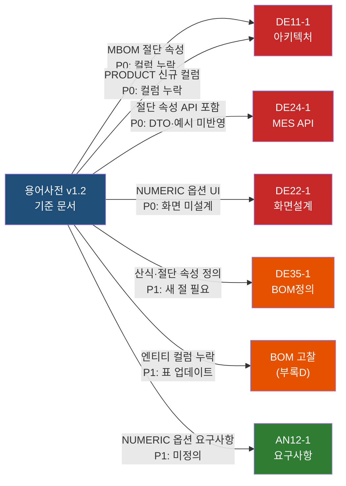

# V3 기존 설계 문서 BOM v1.2 영향도 검증

> [!abstract] 요약
> **검증 범위:** DE/AN 단계 MD 문서 전수 (DE 6건, AN 20건 중 BOM 관련 8건 선별)
> **영향 받는 문서 수:** **6건** (DE 5건 + AN 1건)
> **심각도별 건수:** P0 **4건**, P1 **8건**, P2 **7건** (총 발견 항목 19건)
> **기준 문서:** [[WIMS_용어사전_BOM_v1.2]] (2026-04-16 기준)
>
> v1.2 의 핵심 변경은 ① MBOM 절단 속성 4개 신규, ② OPTION_VALUE NUMERIC 확장, ③ PRODUCT 4계층 분류·계열·파생 컬럼 신규, ④ BOM_RULE action 산식 표현식 공식화 — 네 가지이며, 기존 설계 문서 대부분이 이 속성들을 반영하지 않은 채 v1.0/v1.1 수준에 머물러 있다.

---

## 1. 검증 배경 및 기준

### 1.1 v1.2 주요 변경 요약

| 변경 구분 | 내용 | 영향 엔티티 |
|-----------|------|-------------|
| **엔티티 철회** | `CUTTING_BOM`, `PRODUCT_SERIES`, `LAYOUT_TYPE` 신설 취소 | 기존 엔티티에 흡수 |
| **MBOM 속성 신규** | `cut_direction`, `cut_length_formula`, `cut_qty_formula`, `supply_division` 4개 | `MBOM` |
| **OPTION_VALUE 확장** | `value_type` (ENUM/NUMERIC/RANGE), `numeric_min`, `numeric_max`, `unit` + `OPT-DIM` 신규 그룹 | `OPTION_VALUE` |
| **PRODUCT 속성 신규** | `series_code`, `derivative_of` (FK), `derivative_kind`, `class_l1~l4` | `PRODUCT` |
| **BOM_RULE 확장** | action JSON 에 `formulaExpr` 산식 표현식 허용 | `BOM_RULE` |
| **API 응답 확장** | `/bom/resolved/{id}` 응답에 절단 속성 포함 | DE24-1 |
| **금지어 추가** | `CuttingBOM`, `LayoutType`, `ProductSeries`, `cuttingBomId`, `formula/계산식/공식` (BOM 문맥), `시리즈`(미서기 문맥) | 전 문서 |

### 1.2 금지어 전수 검색 결과 요약

아래 금지어(§7)를 DE/AN 전체 MD 대상으로 Grep 수행한 결과:

| 금지어 | 발견 파일 수 | 대표 위치 |
|--------|:-----------:|-----------|
| `productVersion` | 1 | DE35-1 변경이력 §8 (v1.4~v1.5 설명 텍스트) |
| `configVersion` | 1 | DE35-1 변경이력 §8 |
| `appliedOptionValues` | 1 | DE35-1 변경이력 §8 |
| `changedParts` | 1 | DE35-1 변경이력 §8 |
| `formula`, `계산식`, `공식` (BOM 문맥) | 2 | DE35-1 §3.4 표(제조룰 설명), BOM고찰 §5.2 "수량 산출 공식" |

> [!tip] 변경이력 내 금지어는 무해
> DE35-1 §8 변경이력에 등장하는 `productVersion`/`configVersion` 등은 **과거 버전을 서술하는 역사적 기록**이므로 실제 설계 오류가 아니다. 단, 열람 시 혼동 방지를 위해 이탤릭+취소선 또는 `[구명칭]` 주석을 권장한다.

---

## 2. 문서별 영향 리스트

### 2.1 DE11-1 소프트웨어 아키텍처 설계서 v1.1 (v1.3)

| 항목 | 내용 |
|------|------|
| **파일** | `docs/3_DE(설계)/DE11-1_소프트웨어_아키텍처_설계서_v1.1.md` |
| **현행 버전** | v1.3 (파일명은 v1.1 유지) |
| **영향 관점** | B(스키마), E(방법론) |

#### 발견 항목

| ID | 섹션 | 현상 | 심각도 | 수정 난이도 | 담당 |
|----|------|------|:------:|:-----------:|------|
| D11-1 | §5.3 ER 다이어그램 `PRODUCT` 엔티티 | `series_code`, `derivative_of`, `derivative_kind`, `class_l1~l4` 4종 컬럼 누락. 현재 `category`, `status` 만 정의 | **P0** | 단순 컬럼 추가 | BE 담당 |
| D11-2 | §5.3 ER 다이어그램 `MBOM` 엔티티 | `cut_direction`, `cut_length_formula`, `cut_qty_formula`, `supply_division` 4개 컬럼 누락 | **P0** | 단순 컬럼 추가 | BE 담당 |
| D11-3 | §5.3 ER 다이어그램 `OPTION_VALUE` 엔티티 | `value_type`, `numeric_min`, `numeric_max`, `unit` 누락 (현행은 `value_code`, `value_name`, `is_default` 3개만) | **P1** | 단순 컬럼 추가 | BE 담당 |
| D11-4 | §5.3 ER 다이어그램 `BOM_RULE_ACTION` 엔티티 | `qty_expression` 만 있고 `formula_expr` (절단 산식) 필드 없음. v1.2 에서 action 에 산식 표현식이 공식화됐으나 미반영 | **P1** | 단순 컬럼 추가 | BE 담당 |
| D11-5 | §5.3 `OPTION_GROUP` | `OPT-DIM` 그룹 개념 미반영 (현행 6개 그룹만 예시). 스키마 자체는 확장 가능하나 주석·예시 업데이트 필요 | P2 | 주석 수정 | BE 담당 |

---

### 2.2 DE22-1 화면설계서 Phase1 v1.4

| 항목 | 내용 |
|------|------|
| **파일** | `docs/3_DE(설계)/DE22-1_화면설계서_Phase1_v1.4.md` |
| **현행 버전** | v1.4 |
| **영향 관점** | D(화면설계) |

#### 발견 항목

| ID | 섹션·화면 | 현상 | 심각도 | 수정 난이도 | 담당 |
|----|----------|------|:------:|:-----------:|------|
| D22-1 | §8.1 SCR-PM-010 제품 목록 필터 | 분류 필터가 단일 `분류 [전체▼]` 드롭다운 1개. v1.2 `class_l1~l4` 4계층 체크박스 트리 필터 미설계 | **P1** | 화면 재설계 필요 | UI/UX 담당 |
| D22-2 | §8.2 SCR-PM-011 제품 등록 폼 | 분류 정보 블록이 `카테고리`, `등급`, `재질`, `단열여부` 4개 드롭다운. v1.2 `class_l1(대분류)`, `class_l2(계약구분)`, `class_l3(유리사양)`, `class_l4(치수크기)` 계층 구조와 불일치 | **P1** | 폼 필드 재구성 | UI/UX 담당 |
| D22-3 | §8.2 SCR-PM-011 | `series_code` 계열 입력 필드 없음. 파생제품 여부(`derivative_of`, `derivative_kind`) 입력 UI 없음 | **P1** | 필드 추가 | UI/UX 담당 |
| D22-4 | §9.3.2 옵션 그룹 관리 탭 | OPT-LAY~OPT-ACC 6개 그룹만 정의. `OPT-DIM` (치수 입력 전용) 신규 그룹 및 NUMERIC 타입 옵션값 입력 UI(W/H 숫자 필드) 미설계 | **P0** | 서브탭 확장 설계 | UI/UX 담당 |
| D22-5 | §9.3.2 옵션값 상세 편집 | `value_type` (ENUM/NUMERIC/RANGE) 토글, `numeric_min`/`numeric_max`/`unit` 입력 필드 없음 | **P0** | 옵션값 편집 폼 확장 | UI/UX 담당 |
| D22-6 | §9.3.3 옵션별 규칙 관리 | 액션 유형 목록에 ADD/REMOVE/REPLACE/QTY_CHANGE/LOSS_CHANGE 5종만 있음. v1.2 산식 표현식(`formulaExpr`) 입력 지원 (MBOM `cut_length_formula` 설정) 없음 | **P1** | 액션 편집 UI 확장 | UI/UX 담당 |
| D22-7 | §9.1.2 MBOM 노드 상세 패널 | `cutDirection`, `cutLengthFormula`, `cutQtyFormula`, `supplyDivision` 필드 없음 | **P1** | 패널 필드 추가 | UI/UX 담당 |
| D22-8 | §9.3.4 확정 구성표 미리보기 | 절단 속성(방향·길이·수량) 컬럼 및 `supplyDivision`(외창/내창) 분리 표시 없음 | P2 | 표 컬럼 추가 | UI/UX 담당 |

---

### 2.3 DE24-1 인터페이스설계서 MES REST API v1.7

| 항목 | 내용 |
|------|------|
| **파일** | `docs/3_DE(설계)/DE24-1_인터페이스설계서_MES_REST_API_v1.7.md` |
| **현행 버전** | v1.7 |
| **영향 관점** | C(API 명세) |

#### 발견 항목

| ID | 섹션 | 현상 | 심각도 | 수정 난이도 | 담당 |
|----|------|------|:------:|:-----------:|------|
| D24-1 | §5.4.1 Resolved BOM 응답 JSON | 응답 예시에 `cutDirection`, `cutLengthFormula`, `cutQtyFormula`, `supplyDivision` 필드 없음. 용어사전 §6 "절단 속성이 응답에 포함" 원칙 미반영 | **P0** | JSON 예시 + DTO 업데이트 | BE 담당 |
| D24-2 | §5.3.1 표준BOM 목록 `category` 파라미터 | 분류 필터 파라미터가 `category=SLD/DSLD/CW` 단일 축. v1.2 `class_l1~l4` 4계층 필터 파라미터 (`classL1`, `classL2` 등) 미설계 | P2 | 쿼리 파라미터 확장 | BE 담당 |
| D24-3 | §6.1 DTO 목록 | `ResolvedBomItemDto`에 절단 속성 4개 (`cutDirection`, `cutLengthFormula`, `cutQtyFormula`, `supplyDivision`) 정의 없음 | **P0** | DTO 필드 추가 | BE 담당 |
| D24-4 | §5.4.1 Resolved BOM 응답 `appliedOptions` | NUMERIC 옵션값 (OPT-DIM-W, OPT-DIM-H 등 숫자) 포함 예시 없음. 용어사전 §4 "NUMERIC 옵션도 동일 구조" 미반영 | P2 | 예시 JSON 갱신 | BE 담당 |
| D24-5 | 전체 | `철회된 /cutting-bom/{cuttingBomKey}` 경로가 문서 어디에도 등장하지 않음 ✅ | — | 이미 반영 완료 | — |

> [!success] D24-5 확인 완료
> v1.1 에서 철회된 `/cutting-bom/{cuttingBomKey}` 엔드포인트는 DE24-1 v1.7 어디에도 존재하지 않음. 정상.

---

### 2.4 DE35-1 미서기이중창 표준 BOM 구조 정의서 v1.4

| 항목 | 내용 |
|------|------|
| **파일** | `docs/3_DE(설계)/DE35-1_미서기이중창_표준BOM구조_정의서_v1.4.md` |
| **현행 버전** | v1.4 (파일명). 실제 내용은 단일 `standardBomVersion` 축 반영 완료 |
| **영향 관점** | A(용어), B(스키마) |

#### 발견 항목

| ID | 섹션 | 현상 | 심각도 | 수정 난이도 | 담당 |
|----|------|------|:------:|:-----------:|------|
| D35-1 | §4 BOM 표 + §3.4 자재 분류 | PRODUCT 엔티티 논의 없음. v1.2 `series_code`, `class_l1~l4`, `derivative_of` 등 PRODUCT 신규 컬럼 언급 없음 (DE35-1 은 BOM 구조 정의 문서이므로 제품 분류는 DE32-1 ERD 에서 처리 예정이나, 참조 주석 필요) | P2 | 각주/참조 추가 | BOM 담당 |
| D35-2 | §3.4 자재 분류 표 "제조룰" 행 설명 | `계산식·규칙`, `길이 계산식` 표현 사용. v1.2 금지어 `계산식` → 표준어 `산식` 으로 교체 필요 | P2 | 단순 텍스트 치환 | BOM 담당 |
| D35-3 | §8 변경이력 서술 텍스트 (v1.4~v1.5) | 역사적 기술에서 `productVersion`, `configVersion`, `appliedOptionValues`, `changedParts` 등 구명칭 노출. 독자 혼동 유발 가능 | P2 | `[구명칭]` 주석 처리 | 문서 담당 |
| D35-4 | MBOM 속성 정의 (본문 어디에도) | `cut_direction`, `cut_length_formula`, `cut_qty_formula`, `supply_division` 정의 없음. 절단 BOM 개념이 MBOM 속성 확장임을 명시하는 절 필요 | **P1** | 새 절 추가 (§3.5 절단 속성) | BOM 담당 |
| D35-5 | OPTION_VALUE 정의 없음 | 구성형 BOM 섹션(§5.2)에서 옵션 선택지를 설명하나 `value_type`, `OPT-DIM` 개념 없음. NUMERIC 치수 입력 흐름 미설명 | **P1** | §5.2 OPT-DIM 항목 추가 | BOM 담당 |

---

### 2.5 WIMS_BOM구성에_대한_고찰 (DE35-1 부록D) v1.3

| 항목 | 내용 |
|------|------|
| **파일** | `docs/3_DE(설계)/참고자료/WIMS_BOM구성에_대한_고찰.md` |
| **현행 버전** | v1.3 |
| **영향 관점** | A(용어), B(스키마) |

#### 발견 항목

| ID | 섹션 | 현상 | 심각도 | 수정 난이도 | 담당 |
|----|------|------|:------:|:-----------:|------|
| DB-1 | §4.1 핵심 엔티티 표 `PRODUCT` | `product_id`, `product_code`, `product_name`, `product_type`, `status`, `version` 6개만 정의. `series_code`, `class_l1~l4`, `derivative_of`, `derivative_kind` 누락. 특히 `version` 은 v1.2 에서 `standardBomVersion` 으로 대체된 금지 패턴에 해당 | **P1** | 엔티티 표 컬럼 수정 | BOM 담당 |
| DB-2 | §5.5 구성형 BOM 데이터 모델 `OPTION_VALUE` | `option_value_id`, `option_group_id`, `value_code`, `value_name`, `is_default` 5개만. `value_type`, `numeric_min`, `numeric_max`, `unit` 누락 | **P1** | 엔티티 표 컬럼 추가 | BOM 담당 |
| DB-3 | §5.5 `BOM_RULE_ACTION` | `action_type`, `target_item_id`, `new_item_id`, `qty_expression` 만 정의. 산식 표현식 컬럼(`formula_expr`) 없음 | P2 | 컬럼 1개 추가 | BOM 담당 |
| DB-4 | §5.2 "(1) 설치 구성 (OPT-LAY)" 설명 내 | `연결프레임 수량 산출 공식:` 이라는 표현에서 v1.2 금지어 `공식` 사용. → `산식` 으로 교체 | P2 | 단순 텍스트 치환 | 문서 담당 |
| DB-5 | §5.3 BOM Rule 체계 | 액션 유형 5종(ADD/REMOVE/REPLACE/QTY_CHANGE/LOSS_CHANGE)만 정의. `SET_FORMULA` 또는 산식 표현식 설정 액션 없음 | **P1** | 액션 유형 1개 추가 + 예시 | BOM 담당 |

---

### 2.6 AN12-1 요구사항정의서 Phase1 v1.0 (BOM 관련)

| 항목 | 내용 |
|------|------|
| **파일** | `docs/2_AN(분석)/AN12-1_요구사항정의서_Phase1_v1.0.md` |
| **현행 버전** | v1.1 |
| **영향 관점** | A(용어), D(화면 연계) |

#### 발견 항목

| ID | 섹션 | 현상 | 심각도 | 수정 난이도 | 담당 |
|----|------|------|:------:|:-----------:|------|
| AN-1 | FR-PM-010 BOM 구성 요구사항 | NUMERIC 옵션(W/H 치수 입력) 지원 요구사항 미정의. `OPT-DIM` 그룹을 통한 수치형 옵션 입력이 BOM 요구사항 범위임을 명시 필요 | **P1** | 요구사항 항목 추가 | PM 담당 |
| AN-2 | FR-PM-014 제품 분류 체계 관리 | "분류 체계 관리" 요구사항이 v1.2 `class_l1~l4` 4계층 구조를 명시하지 않음. 단순 `category` 드롭다운 관리 수준으로 기술 | P2 | 설명 문구 보강 | PM 담당 |

---

## 3. 영향도 매트릭스



### 3.1 문서 × 관점 매트릭스

| 문서 | A. 용어 | B. 스키마 | C. API | D. 화면 | E. 방법론 | 최고 심각도 |
|------|:-------:|:---------:|:------:|:-------:|:---------:|:-----------:|
| **DE11-1** | — | P0 (MBOM·PRODUCT 컬럼) | — | — | — | **P0** |
| **DE22-1** | — | — | — | P0 (NUMERIC 옵션 UI) | — | **P0** |
| **DE24-1** | — | — | P0 (절단 속성 미포함) | — | — | **P0** |
| **DE35-1** | P2 (금지어) | P1 (절단·NUMERIC 미정의) | — | — | — | **P1** |
| **BOM 고찰** | P2 (금지어) | P1 (엔티티 컬럼) | — | — | — | **P1** |
| **AN12-1** | — | — | — | P1 (요구사항 누락) | — | **P1** |

---

## 4. 우선순위 결론 및 개정 순서

### 4.1 P0 항목 목록 (Gate 1 전 필수)

| # | 문서 | 항목 ID | 내용 | 작업 규모 |
|---|------|---------|------|-----------|
| 1 | DE11-1 | D11-1 | `PRODUCT` ER에 `series_code`, `class_l1~l4`, `derivative_of`, `derivative_kind` 추가 | 소 (ER 다이어그램 수정) |
| 2 | DE11-1 | D11-2 | `MBOM` ER에 `cut_direction`, `cut_length_formula`, `cut_qty_formula`, `supply_division` 추가 | 소 (ER 다이어그램 수정) |
| 3 | DE24-1 | D24-1 | Resolved BOM 응답 JSON 예시에 절단 속성 4개 추가 | 소 (JSON 예시 수정) |
| 4 | DE24-1 | D24-3 | `ResolvedBomItemDto` 에 절단 속성 4개 필드 추가 | 소 (DTO 표 수정) |
| 5 | DE22-1 | D22-4 | `OPT-DIM` 그룹 및 NUMERIC 옵션값 입력 UI 설계 | 중 (서브탭 신규 설계) |
| 6 | DE22-1 | D22-5 | 옵션값 편집 폼에 `value_type` 토글 + 숫자 범위 필드 추가 | 소 (폼 확장) |

### 4.2 P1 항목 목록 (S2 이내 처리 권장)

| # | 문서 | 항목 ID | 내용 |
|---|------|---------|------|
| 1 | DE35-1 | D35-4 | §3.5 절단 속성 정의 절 신규 추가 |
| 2 | DE35-1 | D35-5 | §5.2 에 `OPT-DIM` 항목 추가 |
| 3 | BOM 고찰 | DB-1 | `PRODUCT` 엔티티 표 컬럼 업데이트 |
| 4 | BOM 고찰 | DB-2 | `OPTION_VALUE` 엔티티 표 컬럼 추가 |
| 5 | BOM 고찰 | DB-5 | BOM Rule 액션 유형에 산식 설정 추가 |
| 6 | DE11-1 | D11-3 | `OPTION_VALUE` ER에 `value_type` 등 추가 |
| 7 | DE11-1 | D11-4 | `BOM_RULE_ACTION` ER에 `formula_expr` 추가 |
| 8 | AN12-1 | AN-1 | FR-PM-010 NUMERIC 옵션 요구사항 추가 |

### 4.3 P2 항목 목록 (S3 이내)

| # | 문서 | 항목 ID | 내용 |
|---|------|---------|------|
| 1 | DE22-1 | D22-1 | 제품 목록 4계층 분류 필터 UI 설계 |
| 2 | DE22-1 | D22-2 | 제품 등록 폼 분류 필드 `class_l1~l4` 구조로 재설계 |
| 3 | DE22-1 | D22-3 | `series_code` 및 파생제품 입력 필드 추가 |
| 4 | DE22-1 | D22-8 | 확정 구성표에 절단 속성 컬럼 추가 |
| 5 | DE24-1 | D24-2 | 표준BOM 목록 쿼리 파라미터 `classL1~L4` 추가 |
| 6 | DE24-1 | D24-4 | `appliedOptions` NUMERIC 예시 JSON 추가 |
| 7 | DE35-1 | D35-1~3 | 참조 주석·금지어 치환·변경이력 주석 처리 |
| 8 | BOM 고찰 | DB-3~4 | `BOM_RULE_ACTION` 컬럼 추가·금지어 치환 |
| 9 | AN12-1 | AN-2 | FR-PM-014 설명 문구 보강 |

### 4.4 개정 권장 순서

```
[즉시 — Gate 1 이전 (04.19)]
1. DE11-1  §5.3 ER 다이어그램 PRODUCT·MBOM 컬럼 추가   ← D11-1, D11-2
2. DE24-1  §5.4.1 응답 JSON + §6.1 DTO 절단 속성 추가  ← D24-1, D24-3

[S2 초반 (04.20~04.26)]
3. DE22-1  §9.3.2 OPT-DIM 그룹 + NUMERIC 옵션값 UI      ← D22-4, D22-5
4. DE35-1  §3.5 절단 속성 절 신규, §5.2 OPT-DIM 추가   ← D35-4, D35-5
5. BOM고찰 §4.1 PRODUCT / §5.5 OPTION_VALUE 컬럼 보강  ← DB-1, DB-2, DB-5
6. AN12-1  FR-PM-010 NUMERIC 옵션 요구사항 추가          ← AN-1

[S2 후반 ~ S3 (04.27~)]
7. DE22-1  제품 등록/목록 4계층 분류 필드 재설계        ← D22-1, D22-2, D22-3
8. 나머지 P2 항목 (DTO 예시·금지어 치환 등)
```

---

## 5. 방법론·산출물 영향 (관점 E)

> [!question] PP12-1 테일러링 결과서 관련
> v1.2 변경이 **새로운 공식 산출물을 요구하는가?** 검토 결과:
>
> - **"산식 언어 명세서"** 별도 산출물: v1.2 에서 `BOM_RULE.action` 표현식(UNIQUE_V1 언어)을 공식화했으나, 현재 용어사전 §13 에 이미 명세가 포함됨. **별도 산출물 불필요** — DE35-1 부록 E(산식 언어 명세) 수준으로 충분.
> - **DE32-1 논리/물리 ERD**: v1.2 신규 컬럼을 반드시 반영해야 함. 해당 산출물은 STATUS.md 에 미생성 상태. S2 에서 DE32-1 작성 시 v1.2 스키마 전면 반영 필요.
> - **PP12-1 테일러링 영향**: 없음. 기존 산출물 범위·일정 변경 없이 기존 DE 산출물 개정으로 흡수 가능.

---

## 6. Gate 1 (04.19) 일정 영향

| 구분 | 현황 | v1.2 영향 |
|------|------|-----------|
| **AN22-1 현행 데이터 분석서** | 완료 | 영향 없음 |
| **AN14-1 요구사항 추적표** | md 완료 (docx 미생성) | AN-1 반영 시 RTM 1행 추가 필요 |
| **AN41-1 총괄 테스트 계획서** | md 완료 | 영향 없음 (BOM 테스트 시나리오는 S4 이후) |
| **DE24-1 MES REST API (Gate 1 필수)** | md+docx 완료 | **D24-1, D24-3 P0 항목 수정 필요** — Gate 1 이전 재배포 권장 |

> [!warning] Gate 1 리스크
> DE24-1 이 Gate 1 필수 산출물이며 MES 팀 확인 대상이다. 현재 Resolved BOM 응답에 절단 속성이 빠진 채 MES 팀에 전달될 경우, MES 측 구현 착수 후 변경 비용이 커진다. **D24-1·D24-3 는 Gate 1(04.19) 이전에 수정 배포를 강력 권장한다.**

---

## 7. 참조

- 기준 문서: [[WIMS_용어사전_BOM_v1.2]]
- GAP 리포트: [[GAP_분석_통합_2026-04-15]]
- 선행 검증: [[V1_내부일관성_검증]]
- 프로젝트 현황: [[STATUS]]
