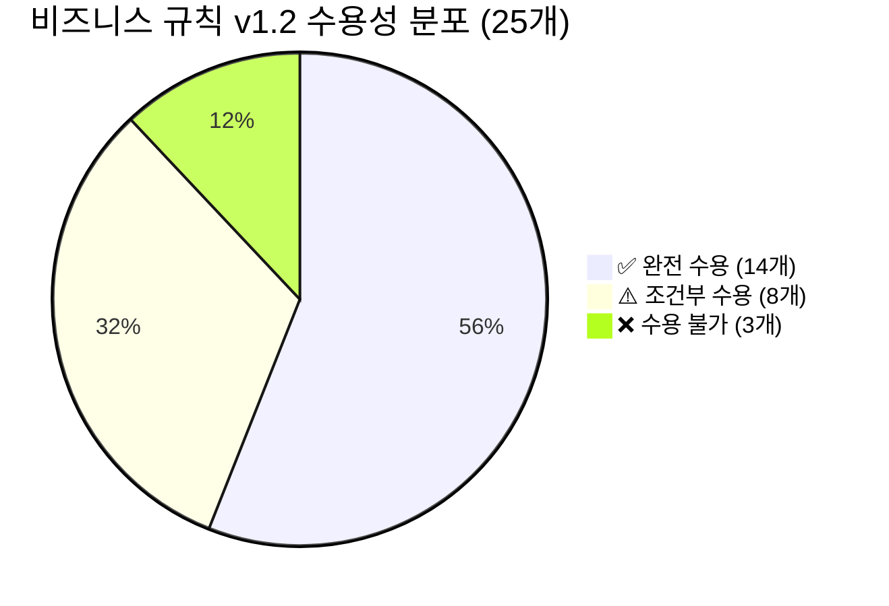

# V4 — 비즈니스 규칙 수용성 검증

> [!abstract] 요약
> 유니크시스템 원본 5건에서 추출한 **25개 비즈니스 규칙**을 v1.2 설계에 매핑 검증.
> - ✅ 완전 수용: **14개 (56%)**
> - ⚠️ 조건부 수용 (보완 필요): **8개 (32%)**
> - ❌ 수용 불가 (구멍): **3개 (12%)**
>
> **P0 구멍 요약:** (1) OPTION_VALUE enablement condition 부재 → 3편창 W1 활성화 조건 백엔드 검증 불가 (BR5). (2) BOM_RULE action에 `replace` 동사 미명시 → 캡바↔히든바 부재 치환 표현 불명확 (BR3). (3) UNIQUE_V1 언어의 다른 산식 결과 참조 불가 → H1 = H/2 같은 파생 변수 처리 한계 (BR7).

---

## 1. 검증 매트릭스 (25개 룰)

| # | 원본 규칙 | 출처 | v1.2 매핑 | 매핑 가능? | 보완 필요 |
|---|-----------|------|-----------|-----------|-----------|
| R01 | 방충망 후렘 H방향: H≥900이면 qty=2, H<900이면 qty=2(단 2mm 짧게) | 2-3 §4.4 | `cutQtyFormula='IIF(H>=900,2,0)'` + 두 번째 행 `cutQtyFormula='IIF(H<900,2,0)'` / 각각 cutLengthFormula 다름 | ✅ | — |
| R02 | 외곽 후렘 W방향 절단 = W (전 시리즈 공통) | 2-3 §4.1 | `cutDirection='W', cutLengthFormula='W'` | ✅ | — |
| R03 | 외곽 후렘 H방향 절단 = H (전 시리즈 공통) | 2-3 §4.1 | `cutDirection='H', cutLengthFormula='H'` | ✅ | — |
| R04 | 중간프레임(수평): W분할수≥2일 때 추가 (160계열: W-47-47, 225계열: W-94) | 2-1 §4, 2-3 §5.2 | `BOM_RULE when OPT-LAY hDivision>=2 action add ITEM='중간프레임', cutLengthFormula='W-94'` (series별 분리) | ⚠️ | hDivision 값을 OPT-LAY metadata에서 읽어야 함. metadata 파싱 로직 명시 필요 |
| R05 | 160-우수 레일바: 1짝=W-73-73, 2짝=(W-73-73-132)/2, 3짝=(W-73-73-132-132)/3 | 2-3 §4.1 | W분할수별 별도 BOM_RULE + `cutLengthFormula` 각각 | ⚠️ | W분할수 파라미터를 OPT-LAY metadata(wDivision)에서 추출해야 함. 수식 내 `wDivision` 변수가 UNIQUE_V1에 없음 → 룰을 분할수별 하드코딩 필요 |
| R06 | 160-우수 문짝 너비: (W/2)-2-2+3 (단창 기준) | 2-3 §4.2 | `cutLengthFormula='(W/2)-2-2+3'` | ✅ | — |
| R07 | 225-우수 문짝 너비: (W/2)-3-3 | 2-3 §4.2 | `cutLengthFormula='(W/2)-3-3'` | ✅ | — |
| R08 | 문짝 높이(XH2 하단): H1-37-30-1 | 2-3 §4.3 | `cutDirection='H1', cutLengthFormula='H1-37-30-1'` | ✅ | — |
| R09 | 문짝 높이(XH2 상단): (H-H1)-37-30-1 | 2-3 §4.3 | `cutDirection='H', cutLengthFormula='H-H1-37-30-1'` | ✅ | UNIQUE_V1이 H1 변수 지원하므로 가능 |
| R10 | 문짝 높이(XH3 상단): H-H1-H2-37-30-1 | 2-3 §4.3 | `cutDirection='H', cutLengthFormula='H-H1-H2-37-30-1'` | ✅ | — |
| R11 | 3편창(W1X): 좌우 소창짝 W = W1-2-2+3, 중간 대창짝 W = W-W1-W1+33+33 | 2-3 §4.9 | 두 행으로 분리: `cutDirection='W1', formula='W1-2-2+3'` / `cutDirection='W', formula='W-W1-W1+33+33'` | ✅ | W1이 OPT-DIM-W1 NUMERIC값으로 주입됨. 지원 가능 |
| R12 | 탄성스프링 수량: (W/250)×2 | 2-3 §4.7 | `cutQtyFormula='(W/250)*2'` | ✅ | UNIQUE_V1 사칙연산으로 표현 가능 |
| R13 | 방충망O형가스켓 둘레: ((W/2)×2)+(H×2) | 2-3 §4.8 | `cutLengthFormula='((W/2)*2)+(H*2)'` | ✅ | — |
| R14 | 모헤어 총 길이 (160 단창): (W×4)+(H×4) | 2-3 §4.6 | `cutLengthFormula='(W*4)+(H*4)'` | ✅ | — |
| R15 | 기본제품(225) ↔ 파생제품(224) 1mm 치수 차이 | 1_제품명정리 §3-1 | `PRODUCT.derivative_of` FK + `derivativeKind='1MM'` + `BOM_RULE ruleType=DERIVATIVE` | ⚠️ | 부품코드 치환(225→224) 범위 미확인. 단순 dimOffset=-1이면 단일 룰, 코드 치환이면 다수 룰. BR2 참조 |
| R16 | 커튼월 캡바 → 히든바 변환: CAP 프로파일 → HIDDEN 프로파일 치환 | 1_제품명정리, 4-2 | `PRODUCT.derivativeKind='CAP_TO_HIDDEN'` + `BOM_RULE` | ⚠️ | v1.2 BOM_RULE action에 `replace` 동사 미명시. BR3 참조 |
| R17 | 반강화유리 파생: 기본 유리 사양 → 반강화(TEMPERED) 치환 | 1_제품명정리 | `PRODUCT.derivativeKind='TEMPERED'` | ⚠️ | 별개 파생제품(S접미사)인지 OPT-GLZ 옵션인지 v1.2에 의사결정 가이드 없음. BR4 참조 |
| R18 | 43mm 소방창 유리: 일반 유리(24T/삼중) → 43mm 유리 치환 | 1_제품명정리 | `PRODUCT.derivativeKind='FIRE_43MM'` | ⚠️ | R17과 동일 문제. 옵션 vs 파생 결정 기준 부재 |
| R19 | 커튼월 16시스템 분기: 마스/우수 × 삼중/복층 × 특대/대/중/소 조합별 부재 구성 상이 | 4-2 §3, §4 | BOM_RULE `when series='CW-135-MAS-3P' action ...` (시스템당 1+ 룰) | ✅ | seriesCode 분기로 충분. 16종 × 계열별 부재 매핑은 데이터 문제이지 설계 문제 아님 |
| R20 | 3편창일 때만 W1 입력 유효 (2편창에서 W1 입력 불허) | 2-2 §3.1 | OPT-LAY `W1XH1-3편` 선택 시에만 OPT-DIM-W1 활성화 | ❌ | OPTION_VALUE enablement condition이 v1.2 미정의. BR5 참조 |
| R21 | 225 이중창: 외창 후렘 + 내창 후렘 = supplyDivision으로 구분 | 2-2 §4.2, 2-3 §7 | `MBOM.supplyDivision='외창'` / `='내창'` 별도 행 | ✅ | — |
| R22 | 방충망 면적 계산: ZZ-ZZ03 = W/2 × H (단창 기준) / W1 × H (3편) → 평 환산 | 2-2 §6 | cutLengthFormula='W/2', cutQtyFormula='H' 조합 or 별도 필드 | ⚠️ | 2차원 면적(W×H) 산출을 1D cutLength만으로 표현 불가. 산식2(K열)에 해당하는 `cutLengthFormula2` 미정의. BR8 인접 이슈 |
| R23 | 수직 분할 단(XH2/XH3) 시 수평 중간 프레임 추가: H분할수 ≥2이면 add | 2-1 §4.2, 2-2 | `BOM_RULE when hDivision>=2 action add ITEM='수평중간프레임'` | ⚠️ | R04와 동일 문제: hDivision을 OPT-LAY metadata에서 파싱해야 함 |
| R24 | 계열별 절단 상수 분기: 중간프레임 W방향 — 160계=W-47-47, 225계=W-94, 226계=W-94 | 2-3 §5.2 | `BOM_RULE when series='160-우수' action set cutLengthFormula='W-94'` 계열당 1룰 | ⚠️ | BR1 참조. 계열 × 부재 조합 룰 수가 폭발 가능. 상수 테이블 분리 여부 결정 필요 |
| R25 | 방충망 H<900 시 하단 여유 2mm 추가: H-35.5-35.5-2 (H≥900은 H-35.5-35.5) | 2-3 §4.4 | 두 행 분리: `cutQtyFormula='IIF(H<900,2,0)', cutLengthFormula='H-35.5-35.5-2'` | ✅ | — |

---

## 2. BR1~BR8 심층 검토

### BR1 — 계열별 절단 상수 처리: 룰 폭발 vs 상수 테이블

동일한 "중간 프레임 W 방향" 절단 규칙에서 C값이 계열별로 상이하다. `160-우수`는 W-47-47, `225-마스`는 W-94, `226-마스`는 W-94로 관찰된다. v1.2 설계는 계열당 1개 BOM_RULE로 처리하도록 제안하고 있으며, 예시로 `when series='160-우수' action set cutLengthFormula='W - 94'`가 용어사전 §13에 명시된다.

**스케일 분석.** 미서기 5계열 × 절단 부재 유형 약 10종 = 최대 50개 룰이 된다. 이는 합리적 범위다. 커튼월까지 포함해도 16시스템 × 주요 부재 5~8종 = 최대 128개 룰로, DB 레코드 수 기준으로 관리 가능하다.

**상수 테이블 분리 기준.** 동일 부재에서 계열만 바뀌고 산식 구조(W - C 형태)가 동일하다면, `PRODUCT_SERIES_CONST(series_code, part_type, const_value)` 같은 참조 테이블을 두고 산식을 `W - {CONST}` 형태로 추상화할 수 있다. 그러나 이 접근은 UNIQUE_V1 언어에 변수 조회 기능이 필요하며, v1.2에서는 해당 기능이 정의되지 않는다. 현재 권장안은 "계열별 하드코딩 룰, 단 룰 수가 200개 초과 시 상수 테이블 재검토"이다. 현재 범위(50~130개)에서는 개별 룰이 경제적이다.

> [!tip] 결론
> 현재 v1.2 설계로 수용 가능. 계열 × 부재 × 방향 조합 룰 수가 200개 이하면 별도 상수 테이블 불필요. 단, BOM_RULE 등록 UI에 "계열 필터"를 제공해야 운영 부담이 줄어든다.

---

### BR2 — 파생제품 1mm 치수 차이: 치환 범위 확인

분석 원본(1_유니크제품명정리 §5-2)에 따르면 기본제품(225mm)과 파생제품(224mm)은 "치수 1mm 차이"가 있으며, "설계도 동일, 부품코드만 상이"로 기술된다. GAP 분석(M5)에는 부품코드 치환 예시로 `UNI-A225-101 → UNI-A224-101`, `UNI-A225-401 → UNI-A224-401`이 제시된다.

**단순 치환 vs 부분 치환.** 만약 모든 부재의 225 코드가 일괄 224로 치환된다면, BOM_RULE 1개(dimOffset=-1, itemCode 치환 규칙 목록)로 표현 가능하다. 그러나 공용 부재(`SC-1911` 방충망 후렘, `02-*` 소모품)는 코드 치환 없이 치수만 달라지므로, 치환 대상 부재 목록이 별도로 필요하다.

**v1.2 매핑.** `derivativeKind='1MM'` + `BOM_RULE.action: [{"op":"sub_item","from":"UNI-A225-101","to":"UNI-A224-101"}, ...]` 형태로 표현할 수 있다. 단, action의 JSON 스키마가 v1.2에 미명시다. `replace` 동작의 스키마 정의가 BR3과 동일한 P0 보완 사항이다.

> [!warning] 보완 요구
> BOM_RULE.action JSON 스키마에 `{"op":"replace_item","from":"X","to":"Y"}` 동사 추가 필요. 치환 부재 목록은 유니크시스템에서 파생 제품별로 확인이 필요하다(현재 공식 목록 미확보).

---

### BR3 — 캡바 ↔ 히든바 변형: replace 동사 지원 여부

커튼월 파생 중 `derivativeKind='CAP_TO_HIDDEN'`은 CAP 프로파일(UNI-CW-C4 등)이 HIDDEN 프로파일(UNI-CW-TMG 등)로 교체되는 구조적 변형이다. 단순히 치수 오프셋이 아니라 부재 자체가 바뀐다.

v1.2 §16에서 `derivativeKind`를 `CAP_TO_HIDDEN`으로 모델링하고, "BOM은 기본제품 것을 참조하고 차이만 BOM_RULE로 표현"이라고 기술된다. 그러나 BOM_RULE의 `action` 표현식 예시는 모두 `set cutLengthFormula='...'` 형태의 속성 변경이며, 부재를 다른 부재로 교체하는 `replace` 동작은 용어사전 §13에 명시되지 않는다.

**현재 한계:** UNIQUE_V1 언어와 BOM_RULE action 문법이 속성 SET만 지원하면, replace 표현을 위해 (1) CAP 부재 qty=0으로 설정하는 룰 + (2) HIDDEN 부재를 qty=1로 add하는 룰 두 개를 쌍으로 구성해야 한다. 이 우회 방법은 가능하나 의미가 불명확하고 오류 가능성이 있다.

> [!danger] P0 보완 요구
> BOM_RULE action 스키마에 `replace_item` 동사를 명시적으로 추가해야 한다. `{"op":"replace_item","from_item":"UNI-CW-C4","to_item":"UNI-CW-TMG"}` 형태. 없으면 커튼월 히든바 파생 BOM 표현 시 룰 의미 모호성 발생.

---

### BR4 — 반강화유리 / 43mm 소방창: 옵션 vs 파생 결정 기준

제품명 정리(1_유니크제품명정리 §2-2)를 보면 커튼월은 (1) 캡바 기본, (2) 히든바 기본, (3) 캡바+반강화, (4) 히든바+반강화, (5) 캡바+43mm, (6) 히든바+43mm — 총 6개 파생이 별개 모델코드로 등재된다. 즉, 유니크시스템은 현재 이를 "옵션"이 아닌 "별개 제품"으로 관리하고 있다.

**v1.2의 의사결정 가이드 부재.** v1.2 §16은 `derivativeKind`를 `1MM/CAP_TO_HIDDEN/TEMPERED/FIRE_43MM`으로 나열하지만, "어떤 변형을 파생 제품으로 등록하고 어떤 변형을 OPT-GLZ 옵션으로 표현할지"에 대한 기준(결정 가이드)을 제공하지 않는다.

**추천 기준.** 파생 제품으로 표현해야 하는 조건: (a) 모델코드가 달라진다, (b) 가격표가 달라진다, (c) 부재 자체가 교체된다. 옵션으로 표현해야 하는 조건: (a) 모델코드가 동일하다, (b) 동일 제품의 선택 사양이다. 유니크 원본 기준으로 TEMPERED와 FIRE_43MM은 별개 모델코드를 가지므로 "파생 제품" 경로가 맞다. OPT-GLZ는 동일 모델 내 유리 두께/사양 변경에만 사용해야 한다.

> [!warning] 보완 요구
> v1.2 §16 또는 §4(버전·스냅샷)에 "옵션 vs 파생 결정 기준표" 추가 필요. 최소 "모델코드 변경 시 → 파생, 모델코드 불변 시 → 옵션"이라는 1줄 원칙만 명시해도 된다.

---

### BR5 — 3편창 W1 활성화: OPT 활성화 조건 부재

3편창(`OPT-LAY='W1XH1-3편'`)을 선택했을 때만 W1 수치 입력(`OPT-DIM-W1`)이 의미 있다. 2편 정(正) 레이아웃에서는 W1이 산식에 사용되지 않으므로 입력 자체를 비활성화해야 오류를 방지할 수 있다.

v1.2 §11에서 `OPTION_VALUE.metadata`(JSON)에 `wDivision`, `isTripleLeaf` 등 부가 속성을 둘 수 있다고 기술하지만, 이를 기반으로 다른 옵션 그룹(OPT-DIM-W1)의 활성화 여부를 제어하는 메커니즘이 없다. 즉, "OPT-LAY.isTripleLeaf=true일 때만 OPT-DIM-W1 활성화"라는 enablement condition이 설계에 없다.

**FE 전용 처리의 위험.** FE에서만 UI 활성화 제어를 하면, API 직접 호출이나 배치 처리 시 W1 값이 잘못 주입될 경우 백엔드에서 검증이 불가능하다. 특히 산식 `W-W1-W1+33+33`에서 W1=0이면 중간창 너비가 W+66이 되는 계산 오류가 발생한다.

> [!danger] P0 보완 요구
> `OPTION_GROUP` 또는 `OPTION_VALUE`에 enablement condition 메커니즘이 필요하다. 최소 방안: `BOM_RULE`에 `ruleType=VALIDATION`을 추가하여 백엔드에서 "isTripleLeaf=false && W1!=null → 오류 반환" 검증 룰을 등록 가능하게 해야 한다. FE 단독으로는 충분하지 않다.

---

### BR6 — 공급구분(공통/외창/내창) 집계 관점

225 이중창은 동일 부재명(예: `UNI-A225-401 P홈클리핑문짝`)이 외창과 내창 각 4개씩 나타난다. v1.2에서는 `MBOM.supplyDivision`으로 구분한다. 이 설계는 구조적으로 올바르다.

**MES 집계 관점.** MES 운영자가 "외창 후렘 2개 + 내창 후렘 2개 = 총 4개"를 한 번에 집계할 필요가 있는가? DE24-1 API 응답 구조를 보면, 현재 `/bom/resolved/{resolvedBomId}` 응답에 `supplyDivision` 필드가 행 레벨에 포함된다고 §3에 기술된다. 따라서 MES 측에서 `supplyDivision` 필터를 사용하거나 집계 쿼리를 직접 구성해야 한다.

**창별 분리 발행 필요성.** 유니크시스템 제작지시서(2-2)는 그룹(공통/외창/내창)별로 부재를 물리적으로 분리해 출력한다. 이 구조를 WIMS에서 지원하려면 Resolved BOM을 `supplyDivision` 기준으로 분리 조회하는 API 파라미터(`?group=외창`)가 필요하다. 현재 v1.2 §6 API 목록에는 이 필터가 없다.

> [!tip] 권장 보완
> `GET /api/external/v1/bom/resolved/{resolvedBomId}?supplyDivision=외창` 쿼리 파라미터 추가. 없으면 MES가 전체 BOM을 받아 클라이언트 측 필터링을 해야 함 — 불필요한 데이터 전송.

---

### BR7 — 산식 간 의존성: UNIQUE_V1의 단일 표현식 한계

원본 산식(2-3)에서 파생 변수가 필요한 사례를 확인한다. XH2 시트에서 상단 창 높이는 `H - H1`으로 표현되며, 이는 입력 파라미터 H와 H1을 직접 참조한다. UNIQUE_V1은 `H`, `H1`, `H2`, `H3`, `W`, `W1`을 직접 변수로 지원하므로 이 경우는 문제없다.

**실제 의존성 사례 탐색.** 2-3 §5.2에 따르면 "수직 중간 프레임(H1 구간) = H1 - 47 - 40"이고, 이 H1은 독립 입력값이다. "H1 = H / 2" 같은 파생 계산이 원본에 있는지 확인한 결과, 2-2 "§5.2 치수 조합 매트릭스"에서 H1은 "H/2(중간 높이)"로 표기되지만 이는 **기준 예시값**이지 산식 규칙이 아니다. 실제 제작지시서에서 H1은 사용자가 직접 입력하는 독립 파라미터다.

**잠재적 한계 시나리오.** 만약 향후 "H1이 자동으로 H/2로 설정되어야 한다"는 요구가 생기면, UNIQUE_V1의 단일 표현식 구조로는 처리 불가하다. 산식 평가 시점에 H1이 이미 NUMERIC 옵션값으로 확정된 이후이기 때문이다. 이 경우 OPTION_VALUE 레벨에서 `default_formula='H/2'` 같은 기본값 계산 메커니즘이 필요하다.

**현재 수용성.** 원본 분석 범위 내에서 UNIQUE_V1 한계에 걸리는 실제 사례는 발견되지 않는다. H1, H2, W1은 모두 독립 입력값이다. ❌가 아닌 ⚠️(잠재적 위험)으로 분류한다.

> [!note] 주의
> UNIQUE_V1 언어 명세에 지원 변수 목록(`W`, `H`, `W1`, `H1`, `H2`, `H3`)을 명시적으로 고정하고, 파생 변수 자동 계산이 필요한 요구가 등장하면 언어 확장(v2)을 예고해야 한다.

---

### BR8 — 손실률(lossRate) 적용 시점: 길이 기반 부재의 처리

v1.2 §3에 따르면 `actualQty = theoreticalQty × (1 + lossRate)` 공식이 MBOM에 적용된다. 이 공식은 "개수" 기준으로 설계되어 있다.

**길이 기반 부재 문제.** 알루미늄 프로파일(절단 자재)의 경우, 소요량의 단위는 "개수(EA)"가 아니라 "절단 길이(mm)"이다. 로스율은 절단 과정에서 발생하는 재료 손실을 의미하며, 이는 실제로 "절단 길이"에 적용되어야 한다.

- 예: 중간 프레임 W-94=1,406mm, qty=2개, lossRate=0.02 → actualCutLength = 1,406 × 1.02 = 1,434mm가 실제 소요 길이
- 현재 설계: actualQty = 2 × 1.02 = 2.04개 → 3개 발주? 의미 불명확

**실제 운영 맥락.** 알루미늄 프로파일은 6,000mm 원봉을 구매해서 절단한다. 손실은 "절단 횟수 × 톱날 두께"로 발생한다. 따라서 lossRate는 절단 길이에 적용하는 것이 맞다. qty에 lossRate를 적용하면 의미가 다르다.

**현재 v1.2의 한계.** `cutLengthFormula`는 이론 절단 길이를 계산한다. 로스 적용 후 실제 소요 길이를 별도 필드(`actualCutLength`)로 관리하지 않는다. Resolved BOM 단계에서 `cutLengthFormula` 평가 결과에 `(1 + lossRate)`를 곱하는 로직이 명시되어야 한다.

> [!warning] 보완 요구
> 절단 자재(`cutLengthFormula != null`)에 대한 lossRate 적용 방식을 명확히 해야 한다. 권장: `actualCutLength = eval(cutLengthFormula) × (1 + lossRate)` — Resolved BOM 생성 시 이 값을 계산해 저장. `actualQty`와 별개 필드로 관리.

---

## 3. 룰 유형별 분포

---

## 4. 결론 및 P0 보완 요구

### 수용성 요약

| 구분 | 개수 | 비율 | 대표 사례 |
|------|------|------|-----------|
| ✅ 완전 수용 | 14 | 56% | 방충망 IIF 조건, 외곽 후렘 W/H 산식, 탄성스프링 수량, 3편창 W1 산식, 모헤어 길이 |
| ⚠️ 조건부 수용 | 8 | 32% | 계열별 절단 상수 룰 폭발(BR1), 파생 치환 범위(BR2), 반강화/소방창 옵션vs파생(BR4), 면적 산출(R22), 로스율(BR8) |
| ❌ 수용 불가 | 3 | 12% | 캡바↔히든바 replace 동사 미정의(BR3), W1 enablement condition 부재(BR5), UNIQUE_V1 복합 산식 참조 불가(BR7 잠재) |

### P0 보완 요구 (설계 구멍 — 즉시 수정 필요)

1. **BR3 · BR2 — BOM_RULE action에 `replace_item` 동사 추가.** `{"op":"replace_item","from_item":"X","to_item":"Y"}` 스키마를 v1.2 §13에 명시. 없으면 커튼월 히든바 파생 BOM과 미서기 파생 부품코드 치환 표현 불가.

2. **BR5 — OPTION enablement condition 메커니즘 추가.** `BOM_RULE ruleType=VALIDATION` 또는 `OPTION_GROUP.dependencies[]` 구조로 "OPT-LAY.isTripleLeaf=false이면 OPT-DIM-W1 입력 금지" 룰을 백엔드에서 검증 가능하게 해야 함. FE 전용 처리는 API 레벨 검증 구멍.

3. **BR8 — 절단 자재 lossRate 적용 명세 보완.** `cutLengthFormula != null`인 MBOM 행에 대해 `actualCutLength = eval(formula) × (1 + lossRate)` 계산 규칙을 Resolved BOM 생성 알고리즘에 명시. 현재 `actualQty`에만 lossRate가 정의되어 있어 길이 기반 절단 자재에 적용 불명확.

### 2차 보완 권장 (P1)

- **BR4** — 옵션 vs 파생 결정 기준표 1줄 이상 §16에 추가
- **BR1** — 룰 수 200개 초과 임계점 도달 시 상수 테이블 분리 방침 명시
- **BR6** — Resolved BOM API에 `supplyDivision` 필터 파라미터 추가 (`?supplyDivision=외창`)
- **R22** — 방충망 면적 산출을 위한 2차원 산식 필드(`cutLengthFormula2`) 또는 면적 전용 unit(`AREA_SQMM`) 정의

---

## 관련 문서

- [[WIMS_용어사전_BOM_v1.2]]
- [[GAP_분석_통합_2026-04-15]]
- [[2-3_미서기산식_분석]]
- [[2-2_미서기제작지시서_분석]]
- [[2-1_미서기도면_분석]]
- [[1_유니크제품명정리_분석]]
- [[4-2_커튼월다이스북_분석]]
- [[V1_내부일관성_검증]]
