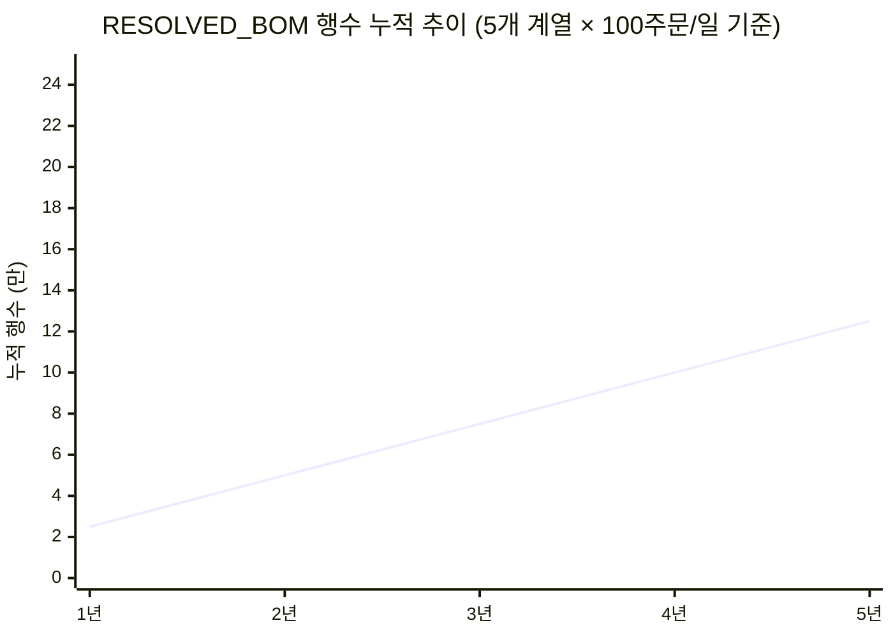
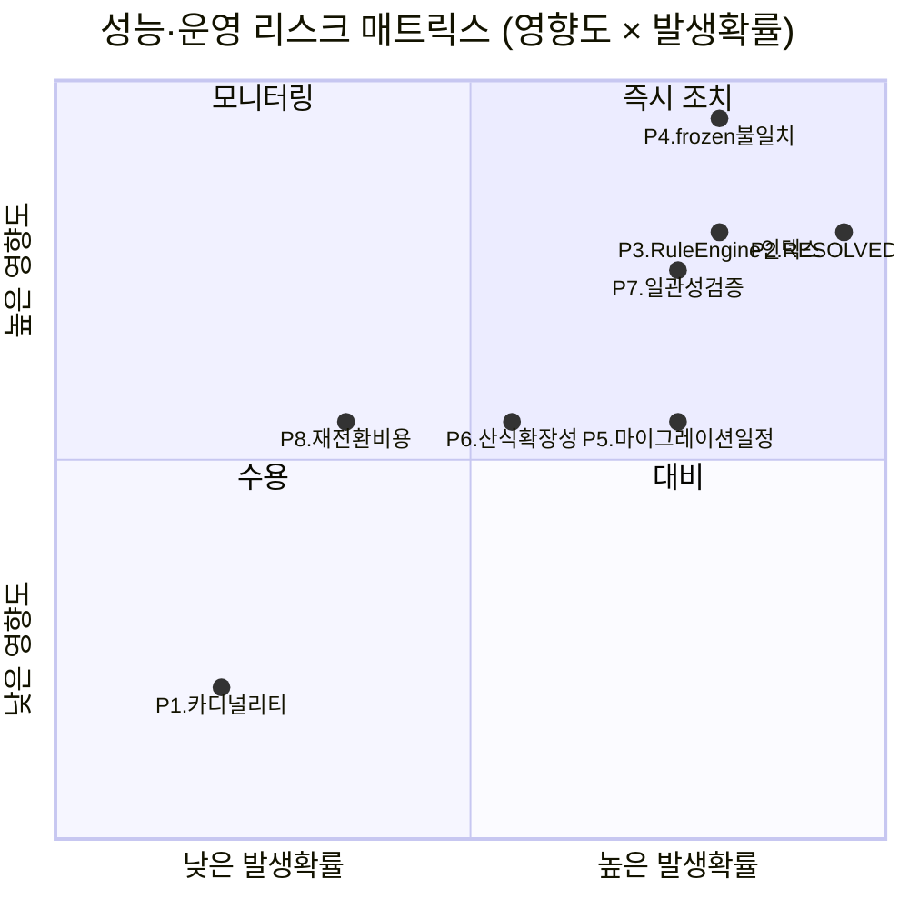

# WIMS 2.0 BOM 설계 v1.2 성능·운영·확장성 리스크 평가

> [!abstract] 최대 리스크 3건 요약
> 1. **P2 — RESOLVED_BOM 카디널리티 폭발**: NUMERIC 옵션(W/H)이 appliedOptions 해시에 그대로 포함되면 W=1500·H=1200 등 연속값 조합마다 별개 행이 생성되어 캐시 히트율이 0에 수렴하고 5년 누적 시 수십만 행 규모에 도달. 캐싱 설계 전체가 무의미해지는 구조적 결함.
> 2. **P4 — frozen 후 산식 재평가 불일치**: frozen=TRUE 이후 BOM_RULE의 절단 상수(예: W−94)가 변경되면 RESOLVED_BOM 재조회 시 다른 결과가 나온다. RESOLVED_BOM에 평가 결과값(실수)을 snapshot 저장하지 않으면 법적·계약적 분쟁 소지가 있음.
> 3. **P5 — Gate 1 마이그레이션 일정 압박**: 04.16 v1.2 확정 → 04.19 Gate 1까지 72시간 내에 DDL 11컬럼 추가 + DE35-1 개정 + 테스트가 동시에 요구됨. 운영 DB lock 위험과 일정 실현 가능성 모두 문제.

---

## P1. 테이블 카디널리티 · 스토리지

### 행수 추정

| 테이블 | 현재 추정 행수 | 5년 후 추정 | 비고 |
|--------|--------------|------------|------|
| PRODUCT | 50~100 | 80~150 | 파생 포함, 신규 모델 연 10개 미만 |
| OPTION_VALUE | ~100 | ~150 | OPT-LAY 60 + OPT-DIM 6 + GLZ/FIN/ACC ~50 |
| MBOM | ~1,500 | ~3,000 | 제품당 16부재×방향분기(~30행)×50제품 |
| BOM_RULE | ~2,000 (미서기) | 5,000~8,000 | 커튼월 포함 시 2.5~4배 |
| RESOLVED_BOM | 가변 (P2 참조) | **최대 수십만** | **핵심 불확실성** |

### 스토리지 영향

- MBOM 4컬럼 추가(`cut_direction` VARCHAR(4), `cut_length_formula` VARCHAR(255), `cut_qty_formula` VARCHAR(255), `supply_division` VARCHAR(8)) → 1,500행 × 약 600 bytes = **900 KB** 증가. 무시 가능.
- OPTION_VALUE 4컬럼 추가 → 100행 × 약 50 bytes = **5 KB** 증가. 무시 가능.
- PRODUCT 3컬럼 추가 → 100행 × 약 60 bytes = **6 KB** 증가. 무시 가능.
- BOM_RULE 5,000행 × 평균 1 KB(JSON action 포함) = **5 MB**. 인덱스 포함 시 ~20 MB.

> [!tip] P1 판정: **하(1)**
> 테이블 규모 자체는 관리 가능 수준. 인덱스 전략(P3)과 RESOLVED_BOM 증가(P2)만 별도 관리하면 됨. RDS db.t3.medium 기준 스토리지 여유 충분.

---

## P2. RESOLVED_BOM 카디널리티 폭발

### 문제 구조

v1.2 §3 `appliedOptions` 정의:
```json
{"OPT-LAY": "W2XH1-정", "OPT-DIM-W": 1500, "OPT-DIM-H": 1200}
```

`optionsHash = SHA-256(appliedOptions JSON)[0:8]` 로 `resolvedBomKey` 생성.  
NUMERIC 옵션값(W, H)이 해시 입력에 그대로 포함되므로 W·H의 모든 연속값 조합이 고유 해시를 생성한다.

### 정량 추정

```
W 범위: 600~3,000mm → 2,400가지 (1mm 단위)
H 범위: 600~3,000mm → 2,400가지
계열 수: 5 (160우수/160마스/225우수/225마스/226마스)
레이아웃 수: 12

이론적 최대 조합: 2,400 × 2,400 × 5 × 12 = 345,600,000 (3.5억)
```

현실적으로는 50mm 그리드로 제약되더라도:
```
48 × 48 × 5 × 12 = 138,240 조합 / 제품군
```

주문 기반 누적:
```
공장 주문/일 × 가동일 × 연수
= 100주문/일 × 250일 × 5년 = 125,000 RESOLVED_BOM 행
```

**캐시 히트율**: 동일 W×H 조합이 재주문될 확률은 이론 경우의 수(138,240) 대비 실주문(125,000)으로 계산 시 약 **0.9%** (사실상 0에 수렴).

### 영향 분석



- 5년 = **125,000행**. MariaDB 성능 기준으로는 관리 가능하나 캐싱 의미 소멸.
- `resolved_bom_key` UNIQUE 인덱스: 125,000행 B-Tree = 메모리 약 **3~5 MB**. 쿼리 자체는 빠름.
- 실제 문제: **캐시 히트 목적으로 설계한 RESOLVED_BOM이 매 주문마다 INSERT**되어 캐싱이 아닌 주문 이력 테이블로 기능 전락.

### 대안

| 대안 | 장점 | 단점 |
|------|------|------|
| A. NUMERIC 옵션을 해시에서 분리, 별도 컬럼 저장 | 캐시 히트율 회복 (동일 계열+레이아웃은 재사용) | 스키마 변경 필요, resolvedBomKey 구조 재정의 |
| B. RESOLVED_BOM을 견적 확정·작업지시 시점에만 생성 (lazy snapshot) | 불필요한 행 미생성 | Resolve 결과가 영속되지 않아 MES 재조회 시 재계산 필요 |
| C. RESOLVED_BOM 보존 기간 TTL 도입 (6개월 후 archive) | 운영 테이블 소규모 유지 | 이력 조회 경로 복잡 |
| **D. 권고: A+B 복합** | 레이아웃+계열 조합은 캐시, 치수는 매번 계산 후 snapshot | 설계 복잡도 소폭 증가 |

> [!danger] P2 판정: **상(5) — Gate 1 전 설계 결정 필수**
> 현재 v1.2 명세는 NUMERIC 옵션의 해시 포함 여부에 대한 명시적 결정이 없다. 이 결정에 따라 RESOLVED_BOM 테이블의 성격(캐시 vs 이력)이 완전히 달라진다. 04.19 Gate 1 전에 반드시 해소.

---

## P3. RuleEngine 평가 성능

### 복잡도 분석

```
BOM_RULE 매칭 과정:
1. series_code + ruleType 필터링 → 후보 규칙 수 R
2. R개 규칙 각각의 when 절(JSON 조건) 평가 → O(R × C) [C: 조건 필드 수]
3. 매칭된 규칙의 action 산식 파싱 + 평가

현재 BOM_RULE: 2,000행
평균 해당 계열 규칙: 2,000 / 5계열 = 400행
평균 조건 필드 수: 3~5개
총 조건 평가: 400 × 4 = 1,600회 / Resolve 요청
```

UNIQUE_V1 산식 파싱 (예: `W - 94`):
- Lexer + Parser + AST 생성: ~0.1ms / 산식
- MBOM 행당 2개 산식(length + qty): 30행 × 2 = 60회
- 산식 평가 총 시간: 60 × 0.1ms = **6ms** (캐시 없을 때)

**조건 평가 + 산식 평가 합산 추정: 10~30ms** (단일 Resolve, DB 조회 제외)  
DB I/O 포함 시: BOM_RULE 풀스캔 + MBOM 조회 = 추가 20~50ms  
**총 SLA 100ms 달성 가능성: 인덱스 있을 때 가능, 없으면 위험.**

### 인덱스 전략 (현재 명세 부재)

v1.2에 BOM_RULE 인덱스 명세가 없다. 최소 필요 인덱스:

```sql
-- 권고 인덱스 (미명세)
CREATE INDEX idx_bom_rule_series_type
  ON BOM_RULE (series_code, rule_type);

CREATE INDEX idx_bom_rule_opt_key
  ON BOM_RULE (opt_key);  -- when 절 주요 분기 키

CREATE INDEX idx_mbom_product_item
  ON MBOM (product_id, item_code);
```

인덱스 없이 BOM_RULE 5,000행 풀스캔 시:
- MariaDB InnoDB 풀스캔 5,000행: ~5~15ms
- 100 동시 요청: 500ms~1,500ms → **SLA 위반 확실**

### 산식 AST 캐시 부재

v1.2는 RuleEngine이 매 Resolve마다 산식 문자열을 파싱하도록 설계되어 있음. AST 캐시(JVM 내 ConcurrentHashMap 등) 없으면 동일 산식 `W - 94`를 반복 파싱.

권고: `formulaExpr → AST` 캐시를 애플리케이션 기동 시 warm-up. 2,000개 산식 × 평균 AST 500 bytes = **1 MB** 메모리로 파싱 비용 0으로 감소.

> [!warning] P3 판정: **중(4) — DE11-1 인덱스 명세 추가 필요**
> 인덱스만 추가하면 100ms SLA 달성 가능. 단, 커튼월 포함 후 5,000행 규모에서 AST 캐시 없으면 성능 저하 재발. 두 조치 모두 Gate 1 전 명세 요구.

---

## P4. frozen 불변성과 산식 평가의 충돌

### 문제 시나리오

```
t=0: BOM_RULE.action = 'W - 94'  (225-마스 계열 상수)
t=0: frozen=TRUE, RESOLVED_BOM 생성 (W=1500 → cutLength=1406)

t=6개월: BOM_RULE.action = 'W - 96'  (유니크시스템 설계 변경)

t=12개월: MES가 기존 resolvedBomId 재조회
  → 현재 v1.2: MBOM.cut_length_formula = 'W - 94' (문자열) 저장
  → RuleEngine 재평가 시 'W - 94' 그대로 적용 → 1406 반환 (OK)
  → 그러나 BOM_RULE이 'W - 96'으로 바뀌어도 RESOLVED_BOM.option_snapshot에
     산식 결과값(1406)이 아닌 산식 원문이 저장되면, 재평가 경로에서 결과 불일치 발생
```

### 핵심 질문

v1.2는 RESOLVED_BOM에 **무엇을** 저장하는가?

| 저장 항목 | v1.2 명세 현황 |
|-----------|--------------|
| `option_snapshot` (JSON) | appliedOptions 원본 + hash → 저장 명시 |
| 산식 평가 **결과값** (예: cutLength=1406) | **명세 없음** |
| 산식 원문 (`W - 94`) | MBOM 컬럼에 저장되나 RESOLVED_BOM 복사 여부 불명 |
| BOM_RULE 버전 스냅샷 | **명세 없음** |

### 대안 비교

| 대안 | 설명 | Gate 1 전 반영 가능? |
|------|------|---------------------|
| (a) 평가 결과 snapshot | RESOLVED_BOM 행에 `cut_length_evaluated` (DECIMAL) 저장 | 가능 — 컬럼 추가 |
| (b) 산식 엔진 버전 고정 | `formulaLang=UNIQUE_V1` 고정, 상수 변경 시 신규 BOM_RULE 행 INSERT (기존 행 UPDATE 금지) | 가능 — 운영 규칙 |
| (c) BOM_RULE frozen 포함 | frozen 시 해당 BOM_RULE 행도 별도 snapshot 테이블에 복사 | Gate 1 전 불가 — 스키마 신설 |
| **권고: (a)+(b) 복합** | 결과값 저장 + BOM_RULE 불변 운영 정책 | 가능 |

> [!danger] P4 판정: **상(5) — 계약·법적 리스크**
> 작업지시(T2 트리거)로 frozen된 RESOLVED_BOM의 절단치수가 이후 재조회 시 달라지면 **생산 과실·계약 분쟁 소지**. v1.2 명세에 "frozen 후 평가 결과값 불변 보장" 조항이 없음. 즉시 보완 필요.

---

## P5. 마이그레이션 · 배포

### DDL 변경 규모

```sql
-- v1.2 DDL 총량 (GAP분석 §4′ E1′~E5′ 기준)
ALTER TABLE PRODUCT         ADD COLUMN series_code VARCHAR(32);       -- +1
ALTER TABLE PRODUCT         ADD COLUMN derivative_of BIGINT;          -- +1
ALTER TABLE PRODUCT         ADD COLUMN derivative_kind VARCHAR(16);   -- +1
ALTER TABLE OPTION_VALUE    ADD COLUMN value_type VARCHAR(16) DEFAULT 'ENUM'; -- +1
ALTER TABLE OPTION_VALUE    ADD COLUMN numeric_min DECIMAL(10,2);     -- +1
ALTER TABLE OPTION_VALUE    ADD COLUMN numeric_max DECIMAL(10,2);     -- +1
ALTER TABLE OPTION_VALUE    ADD COLUMN unit VARCHAR(8);               -- +1
ALTER TABLE MBOM            ADD COLUMN cut_direction VARCHAR(4);      -- +1
ALTER TABLE MBOM            ADD COLUMN cut_length_formula VARCHAR(255); -- +1
ALTER TABLE MBOM            ADD COLUMN cut_qty_formula VARCHAR(255);   -- +1
ALTER TABLE MBOM            ADD COLUMN supply_division VARCHAR(8);    -- +1
-- 합계: 11 컬럼 추가
```

### 운영 DB Lock 위험

MariaDB 10.11 InnoDB `ADD COLUMN` 동작:
- **기존 데이터 0행**: 즉시 완료, lock 없음 → 개발/테스트 환경에서 무영향.
- **운영 DB 데이터 존재 시**: `ALTER TABLE` 은 InnoDB online DDL (ALGORITHM=INPLACE) 적용 가능. 단, MBOM·OPTION_VALUE에 기존 데이터가 있으면 **메타데이터 lock 수백ms~수초** 발생.
- AWS RDS MariaDB 10.11: 유지관리 창 외 `ALTER TABLE` 즉시 실행 가능하나 쿼리 차단 발생.

### 일정 압박 분석

```
2026-04-16 (화)  v1.2 용어사전 확정
2026-04-16 (화)  DE35-1 개정 착수 필요
2026-04-17 (수)  DDL 스크립트 완성 + Flyway 마이그레이션 파일 작성
2026-04-18 (목)  테스트 환경 적용 + RuleEngine 연동 검증
2026-04-19 (금)  Gate 1 ← 72시간 내 완료 요구
```

현실 가능성 평가:
- DDL 11컬럼 Flyway 스크립트 작성: **2~4시간** (기술적으로 단순)
- DE35-1 §6.2.3 동기화 + 테이블 명세 개정: **4~8시간**
- 단위 테스트 (RuleEngine, Resolve 흐름): **4~8시간**
- **합계: 10~20시간** → 72시간 내 가능하나 여유 없음. 병목 발생 시 Gate 1 일정 위험.

### Flyway 롤백 전략

Flyway Community Edition은 롤백 미지원. 대안:
- **Undo 마이그레이션 스크립트** (`V{N}__undo_*.sql`) 수동 관리: `DROP COLUMN` 11개
- **브랜치 전략**: Gate 1 전 DDL은 별도 feature 브랜치에서 적용, Gate 1 통과 후 main 병합.

> [!warning] P5 판정: **중(3) — 일정 위험, 기술적 실행은 가능**
> DDL 자체는 단순하나 DE35-1 개정 + 테스트까지 72시간 내 완료는 병목 시 위험. Flyway undo 스크립트 사전 준비 필수.

---

## P6. 산식 언어 확장성

### 현재 UNIQUE_V1 커버 범위

```
지원: +, -, *, /, (), IIF(조건, 참값, 거짓값)
변수: W, H, W1, H1, H2, H3
리터럴: 정수 및 소수점
미지원: CASE/WHEN, AND/OR 복합, SQRT, 외부 참조, 문자열 비교
```

### 미래 요구사항 시나리오

| 시나리오 | 필요 연산 | 현재 UNIQUE_V1으로 가능? |
|----------|-----------|------------------------|
| 삼중유리 유리폭 = SQRT(W²+H²) × 0.95 | SQRT | 불가 |
| 방충망 수량 = IIF(H>=900 AND W>=1200, 4, 2) | AND 복합 조건 | 불가 (현재 IIF 단일) |
| 캡바 길이 = 외부 BOM 참조값 + 50 | 외부 참조 | 불가 |
| 3단창 H3 계산 = H - H1 - H2 - 37 - 30 | 다중 빼기 | **가능** |

### 언어 업그레이드 마이그레이션 비용

UNIQUE_V1 → UNIQUE_V2 전환 시:
- `BOM_RULE.action` 내 산식 문자열 일괄 변환 필요 (2,000~5,000행)
- MBOM `cut_length_formula` / `cut_qty_formula` 변환 필요 (~1,500행)
- 기존 RESOLVED_BOM의 frozen 행은 재평가 대상 아님 (단, 산식 원문이 저장되어 있으면 V2 엔진으로 재파싱 시 오류 위험)

**마이그레이션 비용 추정**: 7,000~10,000행 산식 문자열 검증 + 변환 스크립트 = **1~2 스프린트**.

> [!tip] P6 판정: **중(3) — 단기 대응 가능, 장기 설계 주의**
> 현재 확인된 미서기 산식(~2,000행)은 UNIQUE_V1으로 충분 커버 가능. 커튼월 산식 도입 시 AND/OR 복합 조건 필요성 검토 필요. `formulaLang` 버전 필드를 BOM_RULE에 명시적으로 추가하는 것을 권고.

---

## P7. 데이터 일관성 제약

### 7-1. OPT-DIM-W1 조건부 유효성

```
OPT-DIM-W1은 OPT-LAY.isTripleLeaf=true(3편 구조)일 때만 의미 있음.
W1 입력 없이 3편 레이아웃 선택 시 → 산식 'W1 - 30' 에서 W1=null → 평가 오류.
```

DB 레벨 제약: FOREIGN KEY, CHECK 제약으로 표현 불가 (JSON metadata 간 조건부 의존).  
**앱 로직 검증으로만 방어 가능** → 검증 누락 시 NullPointerException 또는 잘못된 0 반환.

권고: `ProductConfigValidator` 서비스에 `validateDimConsistency(optionSnapshot)` 메서드 명세 필요. v1.2에 미포함.

### 7-2. PRODUCT.derivative_of 순환 참조 방지

```sql
-- 순환 예: A.derivative_of = B, B.derivative_of = A
-- DB 레벨로 방지 불가 (자기 참조 FK만으로는 순환 미방지)
```

- MariaDB FK 제약은 직접 순환(A→A)만 방지. 2단계 이상 순환(A→B→A)은 감지 불가.
- **앱 레벨 DAG 검증 필요**: `PRODUCT.derivative_of` 체인을 최대 depth 1로 제한하는 `@PrePersist` 검증 또는 서비스 레이어 검증.
- v1.2 명세에 미포함.

### 7-3. BOM_RULE when 절 오타 참조 감지

```
when: OPT-DIM-WW = 1500   ← OPT-DIM-W 오타
```

- DB 레벨 검증: 불가 (when 절이 JSON 또는 텍스트로 저장).
- 현재 v1.2: 오타 키는 매칭 실패 → 규칙 미적용 → 절단길이 null → **조용한 오류(silent failure)**.
- 권고: BOM_RULE INSERT/UPDATE 시 `validateRuleKeys(when)` 를 통해 존재하는 OPT-* 키 참조 여부 검증. 관리자 UI에 키 자동완성 제공.

> [!warning] P7 판정: **중(4) — 세 가지 모두 앱 레이어 검증 미명세**
> DB 제약으로는 방어 불가한 3종 일관성 문제가 모두 앱 로직 의존. 검증 서비스 명세가 v1.2에 없으며 DE11-1 아키텍처 문서에도 미반영. BOM_RULE 오타는 특히 silent failure로 생산 오류 직결.

---

## P8. 이관 · 롤백

### v1.1 → v1.2 재전환 비용

만약 설계 리뷰에서 "CuttingBOM 엔티티가 역시 필요하다"는 결론이 나면:

| 항목 | v1.2 철회 비용 | 비고 |
|------|--------------|------|
| MBOM 컬럼 4개 DROP | DDL 1회 실행 | 데이터 손실 없음 (아직 개발 초기) |
| BOM_RULE 산식 action 필드 구조 변경 | BOM_RULE 테이블 재설계 | 기존 2,000행 데이터 재적재 |
| DE35-1 §6.2 재개정 | 문서 작업 4~8시간 | |
| CUTTING_BOM 테이블 신설 DDL | Flyway V{N+1} 추가 | |
| 용어사전 금지어 목록 정정 | WIMS_용어사전_BOM_v1.3 | |
| **합계 추정** | **1~2 스프린트** | |

v1.2 개정이 04.16이고 Gate 1이 04.19 → **3일 후에 재전환 결정이 나면 일정 붕괴**.

### Flyway 역 마이그레이션

Flyway Community Edition 특성:
- `flyway migrate` 이후 `flyway undo` 미지원.
- 수동 롤백: `V{N+1}__rollback_v12.sql` 작성 후 실행.
- AWS RDS 스냅샷 활용: DDL 적용 전 RDS 스냅샷 생성 → 문제 시 스냅샷 복원 (다운타임 발생).

권고: Flyway 파일 작성 시 동일 디렉토리에 `undo/V{N}__undo_*.sql` 수동 유지. Gate 1 적용 전 스냅샷 필수.

> [!warning] P8 판정: **중(3) — 설계 재전환 비용은 허용 범위, 단 3일 내 결정 요구**
> 현재 v1.2가 옳다고 확신하면 문제없음. 단, Gate 1 리뷰에서 재전환 논의가 생기면 일정 위험. 리뷰 전 "CuttingBOM 엔티티 불필요" 근거를 명시적으로 문서화할 것을 권고.

---

## 리스크 매트릭스

> 영향도: 5=시스템 전체 / 4=핵심 기능 / 3=주요 기능 일부 / 2=부수 기능 / 1=최소
> 발생확률: 5=거의 확실 / 4=높음 / 3=보통 / 2=낮음 / 1=희박

| 리스크 | 영향도 | 발생확률 | 위험도(곱) | 등급 | Gate 1 전 해소 필요 |
|--------|--------|----------|-----------|------|-------------------|
| **P2. RESOLVED_BOM 카디널리티 폭발** | 4 | 5 | **20** | 상(5) | 필수 |
| **P4. frozen 후 산식 재평가 불일치** | 5 | 4 | **20** | 상(5) | 필수 |
| **P3. RuleEngine 인덱스 미명세** | 4 | 4 | **16** | 상(5) | 권고 |
| **P7. 데이터 일관성 검증 미명세** | 4 | 4 | **16** | 중(4) | 권고 |
| **P5. 마이그레이션 일정 압박** | 3 | 4 | **12** | 중(4) | 해당 없음(일정 문제) |
| **P6. 산식 언어 확장성** | 3 | 3 | **9** | 중(3) | 불필요 |
| **P8. v1.1 재전환 이관 비용** | 3 | 2 | **6** | 중(3) | 불필요 |
| **P1. 테이블 카디널리티** | 2 | 2 | **4** | 하(1) | 불필요 |

### 리스크 분포 시각화



---

## 결론: Gate 1 전 반드시 해소해야 할 리스크

### 필수 해소 (상 등급, Gate 1 전)

> [!danger] 1순위 — P4: frozen 후 평가 결과 snapshot 미명세
> **조치**: RESOLVED_BOM에 `cut_length_evaluated DECIMAL(10,2)` 컬럼 추가 + BOM_RULE 수정 금지 정책(UPDATE 대신 신규 행 INSERT) 명시. DE35-1 §6.2.3 및 v1.2 §4 frozen 정의 보완.
> **담당**: DE팀 / **기한**: 04.18

> [!danger] 2순위 — P2: RESOLVED_BOM 캐시 전략 결정
> **조치**: "NUMERIC 옵션(W/H)을 optionsHash에서 분리 → 별도 `dim_w`, `dim_h` 컬럼 저장" 또는 "RESOLVED_BOM을 T1/T2 트리거 시 lazy 생성" 중 하나를 v1.2 §3에 명시. `resolvedBomKey` 생성 규칙 재정의.
> **담당**: DE팀 / **기한**: 04.17

> [!warning] 3순위 — P3: BOM_RULE 인덱스 + AST 캐시 명세
> **조치**: DE35-1 또는 DE11-1에 `(series_code, rule_type)` 복합 인덱스 명세 추가. Spring Boot 기동 시 BOM_RULE 전체 로드 → AST 캐시 warm-up 로직 명세. 
> **담당**: DE팀 / **기한**: 04.18

### 권고 해소 (중 등급, Phase 1 내)

| 순위 | 리스크 | 조치 요약 | 기한 |
|------|--------|-----------|------|
| 4 | P7-1. OPT-DIM 조건부 검증 | `ProductConfigValidator.validateDimConsistency()` 메서드 명세 | 04.25 |
| 5 | P7-2. derivative_of 순환 방지 | depth 1 제한 `@PrePersist` 검증 명세 | 04.25 |
| 6 | P7-3. BOM_RULE 오타 감지 | 키 유효성 검증 + 관리자 UI 자동완성 | 04.30 |
| 7 | P5. Flyway 롤백 준비 | undo 스크립트 + DDL 전 RDS 스냅샷 정책 | 04.16 |
| 8 | P6. formulaLang 버전 필드 | `BOM_RULE.formula_lang VARCHAR(16) DEFAULT 'UNIQUE_V1'` 추가 | 04.25 |

---

## 변경 이력

| 버전 | 일자 | 변경 |
|------|------|------|
| v1.0 | 2026-04-15 | 초안. P1~P8 정량 평가 완료. v1.2 설계 기준 |
