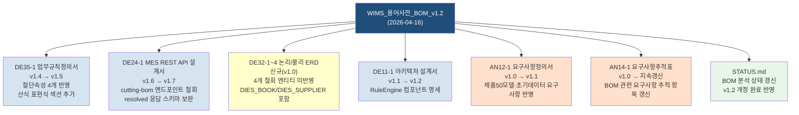

> [!abstract] 요약
> BOM 설계 v1.2(2026-04-16 개정)가 **특허청 SW 개발방법론 테일러링 결과서(PP12-1 v2.1)** 및 **문서코드 규칙**에 준수하는지 M1~M7 7개 항목으로 검증. 용어사전은 "참고자료" 범주로 산출물 명명 규칙의 직접 적용 대상이 아니며, Gate 1 조건 충족에 실질 기여함. 다만 미회신 질의(Q9/Q11/Q14/Q16)에 의존하는 항목이 복수 존재하고, MES API 명세와의 완전한 일치 검증이 DE32-1 ERD 확정 이후에야 가능하므로 **방법론 준수도 등급 B** 로 판정. 후속 개정 의무 문서 **7건**.

---

## M1. 문서 코드 규칙 준수

### M1-1. `WIMS_용어사전_BOM_v1.2.md` 파일명

PP12-1 §1 및 `문서코드_규칙.md`의 명명 패턴(`WIMS2.0_{문서코드}_{문서명}_v{버전}.{ext}`)은 **공식 산출물 대상**이다. `docs/참고자료/` 하위 파일은 작업 지침·참조 자료 성격이며, 해당 규칙의 적용 범위 밖이다. `WIMS_용어사전_BOM_v1.2.md`는 `산출물/` 폴더가 아닌 `docs/참고자료/`에 위치하므로 **명명 규칙 예외로 인정 가능**하다. 단, 이 파일이 실질적으로 DE 단계 "표준 데이터사전(DE32-1~4)"의 핵심 입력 자료로 기능하고 있어, Gate 2(S2) 이후 공식 산출물로 격상하여 `산출물/3_DE/` 에 사본을 두는 것을 권장한다.

### M1-2. `GAP_분석_통합_2026-04-15.md` 범주

파일명에 날짜 접미사를 사용하는 방식은 `docs/참고자료/분석/` 하위 분석 노트 관행으로 수용 가능하다. 이 역시 공식 산출물 코드 체계 밖 참고자료 범주에 속하며, 산출물 폴더 중복 사본은 불필요하다.

### M1-3. 산출물 중복 사본 필요성

현 시점(Gate 1 이전)에는 중복 사본이 불필요하다. Gate 2(S2, DE 완료) 이후 **DE32-1 데이터사전** 산출물이 용어사전 내용을 정규 산출물 형식으로 흡수·수록해야 하며, 그때 `산출물/3_DE/` 에 공식 문서코드 적용 버전이 생성된다.

---

## M2. 단계별 산출물 정합성

PP12-1 §1 산출물 테일러링 표에서 AN 단계 필수 산출물은 사전설문조사 결과서(AN11-2), 요구사항 정의서(AN12-1), 요구사항 추적표(AN14-1), 업무흐름도(AN21-1~5), 현행 데이터 분석서(AN22-1), 총괄 테스트 계획서(AN41-1) 6종이다. **"BOM 용어사전"은 AN 단계 필수 산출물로 열거되지 않는다.** `WIMS_용어사전_BOM_v1.2`는 AN 요구사항 분석을 지원하는 참고자료로서, AN 단계 종료 이전에 개정하는 것이 오히려 정합적이다. AN22-1 현행 데이터 분석서 및 요구사항 정의서와 내용상 연계되므로, Gate 1 이전 v1.2 확정은 AN 산출물 완성도를 높이는 역할을 한다.

DE 단계에서 v1.2의 영향을 받는 필수 산출물은 세 종이다. **DE32-1~4 논리/물리 ERD + 데이터사전**(S2 제출)은 v1.2의 엔티티 축소(4개 철회)를 반영해야 하고, **DE35-1 업무규칙 정의서**(현 v1.4)는 절단 속성 4개 및 산식 표현식 확장을 반영해야 하며, **DE24-1 MES REST API 인터페이스 설계서**(현 v1.6)는 v1.2 §6 엔드포인트 개정(cutting-bom 경로 철회)을 반영해야 한다. 세 문서 모두 Gate 2(S2, M2 1주차) 기한 내 버전 업데이트 의무가 있다.

---

## M3. 변경 관리 · 이력 추적

v1.0(2026-04-14) → v1.1(2026-04-15) → v1.2(2026-04-16) 전환은 `WIMS_용어사전_BOM_v1.2.md` §17 변경이력 표에 기술되어 있다. 그러나 변경이력이 **요약 1행** 단위이며, 공식 CR(Change Request) 등록 · 영향도 분석 · 승인 기록 절차(PP11-1 §8 변경관리 절차)를 거친 증거가 없다. PP12-1은 변경 발생 시 PP11-1 §8에 따른 "CR 등록 → 영향도 분석 → PM·사업주 승인" 적용을 명시하고 있다.

현재 용어사전이 "지침(type: 지침)" 분류이고 `status: review`인 점을 감안할 때, 정식 CR 절차 없이 다이렉트 반영한 것은 **미흡**이다. Gate 1 이전이라는 시점과 엔티티 신설 철회(설계 단순화)라는 성격 상 사업주 서명 수준의 재승인이 필요하지는 않으나, 최소한 PM(김지광) 확인 기록과 영향 문서 목록이 §17 또는 별도 CR 메모에 남아야 한다.

---

## M4. 질의서 회신 대기 항목과의 상호작용

STATUS.md에 따르면 `DHS-AE225-D-1_유니크시스템_질의서.docx` Q1~Q19 전체가 회신 대기 중이다. v1.2가 의존하는 미회신 항목을 식별하면 다음과 같다.

| 질의 | 연계 v1.2 항목 | 위험 |
|---|---|---|
| Q9 (Phantom 경계) | §3 `isPhantom`, Phantom Explosion 정의 | 🟠 Major — Phantom 범위가 달라지면 MBOM 행 구성 변경 |
| Q11 (Level 체계) | §2 EBOM Level 1 기능군 정의(E-STR/E-GLZ 등) | 🟠 Major — 기능군 변경 시 §9 제품분류와 충돌 가능 |
| Q14 (자재코드 이중체계) | §1 `itemCode` 접두 규칙(PRD/ASY/FRM 등) | 🟠 Major — 다이스북 `DH-####` 체계와 충돌 시 §14 재정의 필요 |
| Q16 (위치코드 의미) | §1 `locationCode`, §5 BOM_ITEM_LOCATION | 🟡 Minor — 위치 의미 확정 전 `BOM_ITEM_LOCATION` 활용 제한 |

> [!warning] 설계 확정 위험 평가
> Q9·Q11·Q14는 v1.2의 핵심 구조에 직결된다. 현재 해당 항목에 `[미확정]`/`[검토 중]` 주석이 적용되어 있어 구조 자체의 확정 선언은 유보된 상태이다. **이 상태에서 DE32-1 ERD 초안을 작성하는 것은 허용 가능하나, DE32-1 v1.0 확정(Gate 2 제출)은 Q9·Q11·Q14 회신 완료 이후로 제한해야 위험이 통제된다.**

---

## M5. Gate 1 기준 충족도

PP12-1 §4 Gate 1 진입 기준은 네 항목이다: ① 요구사항 정의서 사업주 승인, ② MES REST API 인터페이스 규격 합의(MES 팀 서명), ③ As-Is/To-Be 업무흐름도 확정(5개 시스템), ④ 총괄 테스트 계획서 작성 완료.

v1.2는 Gate 1 기준 항목 중 **② MES REST API 규격**과 연동되는 핵심 용어·엔드포인트 정의를 제공하며, 이를 통해 DE24-1 v1.6의 안정성을 뒷받침한다. 또한 핵심 용어 통일(금지어 목록, 3계층 네이밍 원칙)은 AN→DE 단계 전환 시 용어 혼선을 방지하는 실질적 조건이다. v1.2가 범위를 추가하기보다 v1.1에서 신설했던 4개 엔티티를 **철회·간소화**했다는 점에서, 오히려 Gate 1 통과를 가속시키는 방향이다. 단, GAP 분석이 신규 P0 이슈(제품 50개 초기 데이터 미이관, 부재코드 97개 전략 부재)를 제기했으므로, Gate 1 체크리스트에 "초기 데이터 로드 계획 확인" 항목 추가를 권장한다.

---

## M6. 품질 기준 (CBD, ISO/IEC 12207)

CBD 관점에서 용어사전이 수행하는 핵심 역할은 **컴포넌트 인터페이스 계약** — 즉 PM·ES·OM·MF·FS 서브시스템이 BOM 엔티티를 참조할 때 동일한 용어·자료형·경로를 사용하도록 보장하는 것이다. v1.2는 §8 "3계층 네이밍 원칙"에서 DB/도메인/API 계층별 명칭 분리를 명시하고 있으며, §6에서 외부 MES API 4개 엔드포인트와 응답 필드를 정의하고 있다.

MES 인터페이스 명세의 완전성 측면에서는 두 가지 갭이 있다. 첫째, `GET /api/external/v1/bom/resolved/{resolvedBomId}` 응답 스키마에서 `cutLengthFormula`·`cutQtyFormula`가 "산식 원문"으로만 기술되어 있고, 평가 결과(실제 길이 mm) 응답 구조가 명시되지 않았다. DE24-1 v1.6에서 이를 보완해야 한다. 둘째, §14 다이스북·공급망 항목에서 `DIES_BOOK`·`DIES_SUPPLIER` 엔티티가 신설되었으나 이에 대한 외부 API 엔드포인트가 §6에 없다. MES가 공급사 정보를 조회해야 할 경우를 위한 API 경로 결정이 DE24-1에서 필요하다.

ISO/IEC 12207 준용 관점에서 v1.2는 소프트웨어 설계 프로세스(5.3.5)의 "인터페이스 설계" 산출물 기준을 부분적으로 충족한다. 완전 충족을 위해서는 DE32-1 ERD와 DE24-1 API 명세가 v1.2와 일관성을 가져야 한다.

---

## M7. 후속 문서 업데이트 의무 목록

---

## 후속 개정 의무 목록

| 문서 | 유형 | 현재 버전 | 제안 버전 | 기한 | 담당 | 비고 |
|---|---|---|---|---|---|---|
| DE35-1 미서기이중창 표준BOM구조 정의서 | 업무규칙정의서 | v1.4 | v1.5 | Gate 2 이전 (S2, M2 1주차) | BE 김진호 | 절단 속성 §3 반영, 산식 §13 반영 |
| DE24-1 MES REST API 인터페이스 설계서 | 인터페이스설계서 | v1.6 | v1.7 | Gate 1 이전 (04.19) ★ | BE 이율희 + MES 팀 | `/cutting-bom` 경로 철회, resolved 응답 스키마 보완 |
| DE32-1~4 논리/물리 ERD + 데이터사전 | ERD/데이터사전 | 미작성 | v1.0 | Gate 2 이전 (S2, M2 1주차) | BE 김진호 | v1.1 4개 엔티티 신설 미포함, DIES_BOOK 포함 |
| DE11-1 소프트웨어 아키텍처 설계서 | 아키텍처설계서 | v1.1 | v1.2 | Gate 2 이전 (S2, M2 1주차) | BE 김진호 | RuleEngine 컴포넌트·평가 흐름 명세 추가 |
| AN12-1 요구사항정의서 Phase1 | 요구사항정의서 | v1.0 | v1.1 | Gate 1 이전 (04.19) | BA 김성현 | 제품 50모델 초기데이터 이관 요구사항 항목 추가 |
| AN14-1 요구사항추적표 | 추적표 | v1.0 | 지속갱신 | Gate 1 이전 (04.19) | BA 김성현 | BOM v1.2 반영 항목 추적 갱신 |
| STATUS.md | 현황문서 | — | — | 즉시 | PM 김지광 | v1.2 개정 완료 기록, 미회신 Q 연계 상태 업데이트 |

> [!note] Gate 1 ★ 필수
> DE24-1 v1.7은 Gate 1 조건(MES REST API 인터페이스 규격 합의)에 직결되므로 04.19 이전 완료가 강제된다.

---

## 결론: 방법론 준수도 등급

> [!success] 판정: **B — 조건부 준수**
>
> **근거:**
> - ✅ 문서 파일명·위치: 참고자료 범주 예외 인정 (M1)
> - ✅ AN 단계 산출물 정합성: 용어사전은 AN 필수 산출물 아님, Gate 1 전 확정 정합 (M2)
> - ✅ Gate 1 충족 방향성: 범위 축소(엔티티 철회)로 Gate 1 가속 기여 (M5)
> - ✅ CBD 인터페이스 계약 역할: 3계층 네이밍·금지어·MES 엔드포인트 명시 (M6)
> - ⚠️ 변경관리 절차 미흡: CR 등록·PM 승인 기록 부재 (M3)
> - ⚠️ 미회신 Q9/Q11/Q14 의존 항목 존재: DE32-1 확정 전 위험 잔존 (M4)
> - ⚠️ MES API 응답 스키마 미완: 산식 평가 결과 반환 구조 미기술 (M6)
> - ⚠️ 후속 개정 의무 문서 7건 미이행 상태 (M7)
>
> **A(완전 준수) 달성 조건:** ① CR 기록 보완 → §17 또는 별도 메모, ② Q9·Q11·Q14 회신 후 DE32-1 확정, ③ DE24-1 v1.7 Gate 1 전 완료, ④ 나머지 후속 6건 Gate 2 전 완료.
