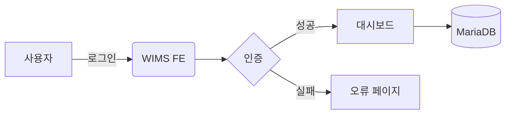
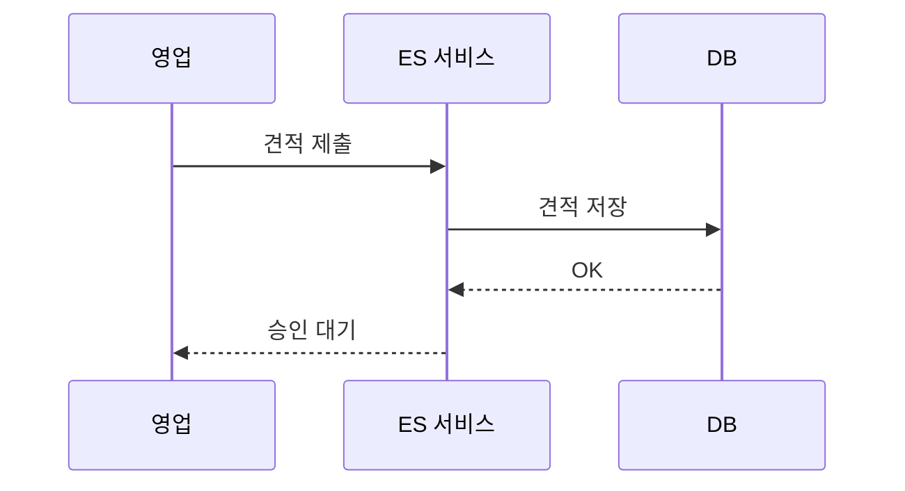
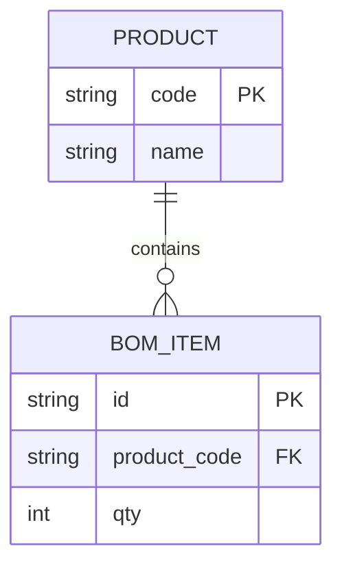

# Mermaid → Word PoC

WIMS 2.0 산출물에서 Mermaid 다이어그램을 Word로 그대로 보존할 수 있는지 검증한다.

## 1. 시스템 구성 (Flowchart)

## 2. 견적 승인 (Sequence)

## 3. 엔티티 관계 (ERD)

## 결론

위 세 가지 다이어그램이 Word에서 벡터로 선명하게 보이면 PoC 성공.
